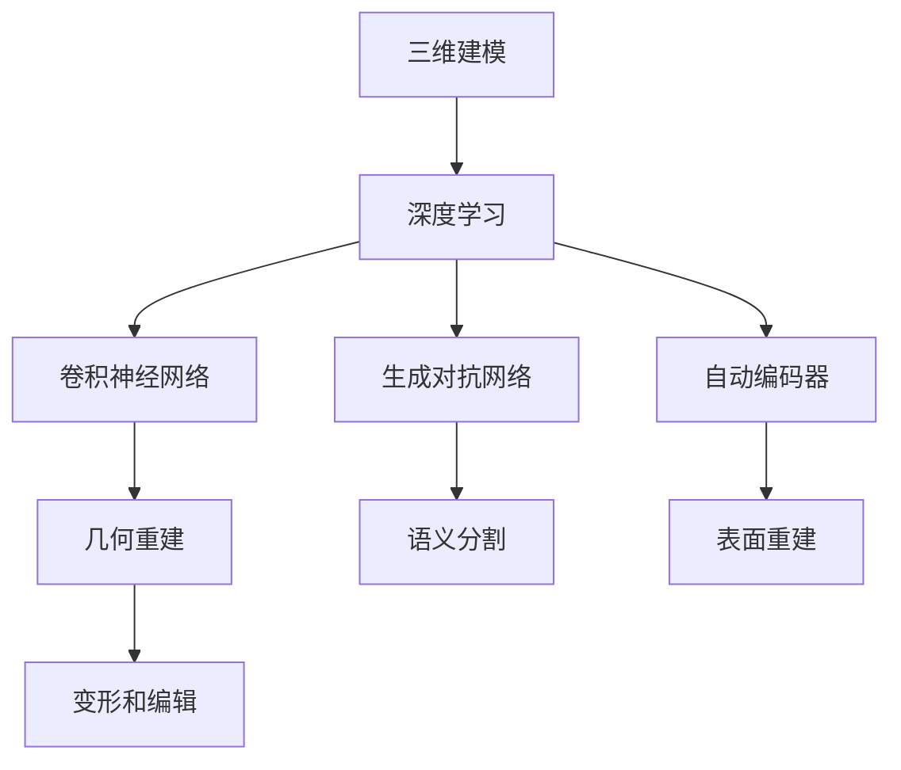
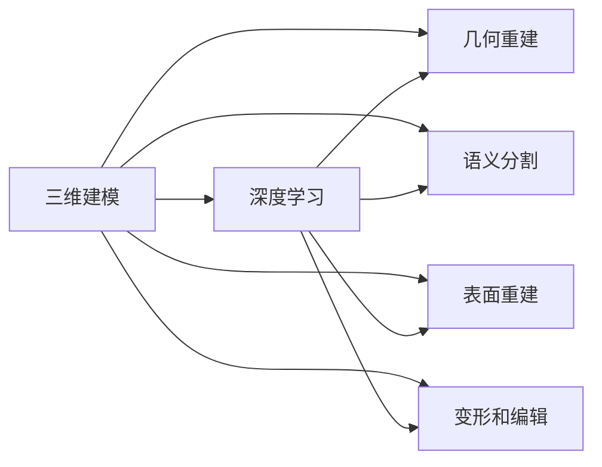
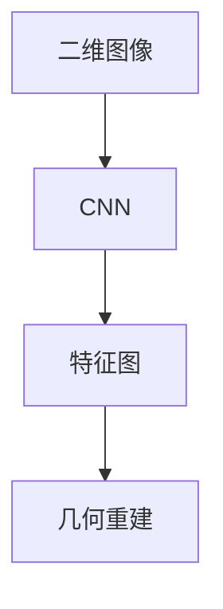
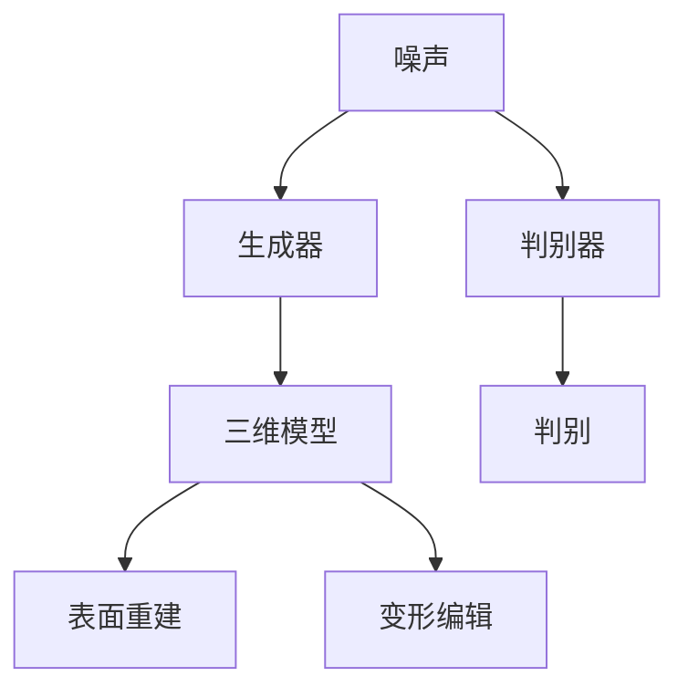
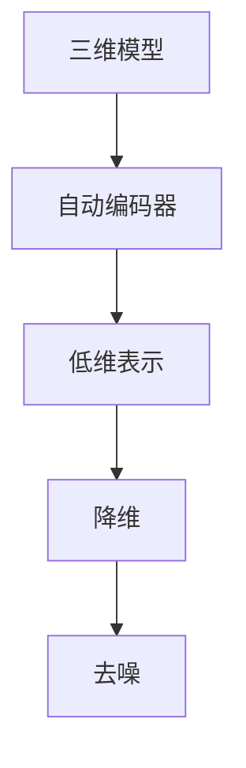
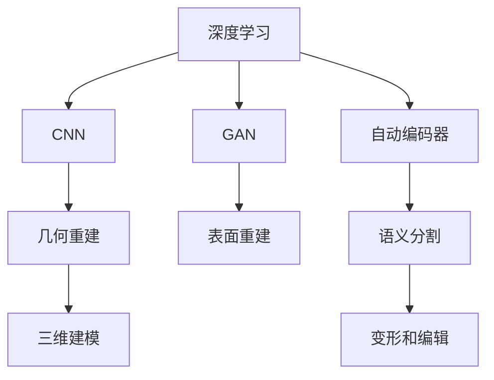

                 

# AI人工智能深度学习算法：在三维建模中的应用

> 关键词：三维建模,深度学习,神经网络,卷积神经网络,生成对抗网络,自动编码器,三维重建,语义分割

## 1. 背景介绍

### 1.1 问题由来

随着计算机图形学和计算机视觉技术的飞速发展，三维建模在虚拟现实、电影特效、工业设计、医疗模拟等多个领域得到了广泛应用。传统的建模方式主要依赖于专业软件和人工操作，工作量大、周期长，难以适应日益复杂的设计需求。为了加速建模过程，提高建模效率和自动化水平，研究人员提出了许多基于深度学习的三维建模方法。这些方法利用深度神经网络自动提取和生成三维几何信息，具有高效、灵活、自动化的特点。

### 1.2 问题核心关键点

深度学习在三维建模中的应用主要集中在以下几个方面：

- **几何重建**：从二维图像或点云数据中自动生成三维几何模型。
- **语义分割**：将三维物体分割为不同的语义部分，用于对象识别和互动。
- **表面重建**：从单一视图或多个视图生成完整的物体表面模型。
- **变形和编辑**：通过对三维模型的变形和编辑，实现创意表达和设计创新。

### 1.3 问题研究意义

深度学习在三维建模中的应用具有重要意义：

1. **提升建模效率**：自动化的建模方法可以大幅缩短建模周期，减少人工操作量，提高生产效率。
2. **丰富设计方式**：通过深度学习技术，设计师可以更加灵活地表达创意，实现复杂的设计效果。
3. **支持多样化应用**：三维建模技术在虚拟现实、游戏、电影、医疗等多个领域都有广泛应用，深度学习的应用能使其在这些领域中发挥更大作用。
4. **推动技术进步**：深度学习技术的引入，推动了三维建模技术的进步，促进了计算机视觉和图形学的发展。
5. **创新应用场景**：通过深度学习，三维建模技术可以拓展到更多新兴领域，如无人驾驶、智能家居等，带来新的商业机会。

## 2. 核心概念与联系

### 2.1 核心概念概述

为了更好地理解深度学习在三维建模中的应用，本节将介绍几个密切相关的核心概念：

- **三维建模**：使用几何信息（如顶点、边、面）描述三维物体的模型。常见的三维建模方法包括点云建模、多边形建模等。
- **深度学习**：通过多层次神经网络模型，自动学习和提取数据的高级特征。深度学习已经在图像识别、自然语言处理等领域取得了巨大成功。
- **卷积神经网络（CNN）**：一种专门用于处理图像和空间数据的神经网络，通过卷积层、池化层等结构，提取特征。
- **生成对抗网络（GAN）**：一种通过两个神经网络相互竞争的训练方式，可以生成逼真的图像和音频等数据。
- **自动编码器（Autoencoder）**：一种用于降维和去噪的神经网络，可以学习数据的低维表示。

这些核心概念之间的逻辑关系可以通过以下Mermaid流程图来展示：



这个流程图展示了大语言模型的核心概念及其之间的关系：

1. 三维建模是深度学习的主要应用领域之一。
2. CNN用于从二维图像中提取空间特征，用于几何重建。
3. GAN用于生成逼真的三维模型，支持表面重建和变形编辑。
4. 自动编码器用于降低三维模型的维度和去噪，提高模型的泛化能力。
5. 这些核心算法通过组合和改进，能够实现三维建模的多种任务。

### 2.2 概念间的关系

这些核心概念之间存在着紧密的联系，形成了深度学习在三维建模中的完整生态系统。下面我们通过几个Mermaid流程图来展示这些概念之间的关系。

#### 2.2.1 三维建模与深度学习的关系



这个流程图展示了三维建模与深度学习之间的基本关系，即深度学习技术可以应用于三维建模的多个任务，提升建模效果和自动化水平。

#### 2.2.2 CNN在三维建模中的应用



这个流程图展示了CNN在三维建模中的具体应用流程：从二维图像中提取特征图，然后用于几何重建任务。

#### 2.2.3 GAN在三维建模中的应用



这个流程图展示了GAN在三维建模中的应用流程：生成器通过噪声生成三维模型，判别器则判断模型的真实性，用于表面重建和变形编辑任务。

#### 2.2.4 自动编码器在三维建模中的应用



这个流程图展示了自动编码器在三维建模中的应用流程：通过自动编码器对三维模型进行降维和去噪，提高模型的泛化能力和鲁棒性。

### 2.3 核心概念的整体架构

最后，我们用一个综合的流程图来展示这些核心概念在三维建模中的整体架构：



这个综合流程图展示了从深度学习到具体三维建模任务的完整过程：CNN用于几何重建，GAN用于表面重建和变形编辑，自动编码器用于语义分割，这些核心算法通过组合和改进，能够实现三维建模的多种任务。

## 3. 核心算法原理 & 具体操作步骤
### 3.1 算法原理概述

深度学习在三维建模中的应用主要基于卷积神经网络（CNN）、生成对抗网络（GAN）和自动编码器（Autoencoder）等核心算法。这些算法通过多层次的特征提取和生成，自动学习三维物体的几何和语义信息。

- **卷积神经网络（CNN）**：CNN通过卷积层、池化层等结构，从二维图像中提取空间特征，然后通过全连接层进行分类和回归。CNN在几何重建、语义分割等任务中表现出色。
- **生成对抗网络（GAN）**：GAN由生成器和判别器两个网络组成，通过对抗训练生成逼真的三维模型。GAN在表面重建、变形编辑等任务中应用广泛。
- **自动编码器（Autoencoder）**：Autoencoder通过编码和解码过程，将三维模型压缩到低维空间，然后通过解码还原回三维模型。Autoencoder在降维和去噪等任务中表现优异。

这些核心算法通过组合和改进，可以实现三维建模的多种任务。本文将详细介绍CNN、GAN和Autoencoder的原理和操作步骤，并给出实际应用案例。

### 3.2 算法步骤详解

#### 3.2.1 卷积神经网络（CNN）

卷积神经网络（CNN）是深度学习中应用最广泛的算法之一，主要通过卷积层和池化层提取空间特征。

**Step 1: 网络结构设计**

卷积神经网络的基本结构包括卷积层、池化层、全连接层等。这里以一个简单的CNN模型为例，介绍其网络结构设计：

```
Conv2D (3, 64) - MaxPooling2D - Conv2D (64, 128) - MaxPooling2D - Conv2D (128, 256) - MaxPooling2D - Flatten - Dense (256, 1)
```

其中，`Conv2D`表示卷积层，`MaxPooling2D`表示池化层，`Dense`表示全连接层。`3`和`64`分别表示卷积层的输入通道数和输出通道数。

**Step 2: 数据准备**

将二维图像数据（如点云、三维网格等）转换为TensorFlow或PyTorch等深度学习框架中的张量格式。假设点云数据形状为`(batch_size, point_count, 3)`。

**Step 3: 模型训练**

将准备好的数据输入模型，通过梯度下降等优化算法进行训练。训练过程中，模型会不断调整卷积核和权重，使其能够更好地拟合数据。

**Step 4: 模型预测**

训练好的模型可以用于预测新的点云数据，生成三维几何模型。

#### 3.2.2 生成对抗网络（GAN）

生成对抗网络（GAN）由生成器和判别器两个网络组成，通过对抗训练生成逼真的三维模型。

**Step 1: 网络结构设计**

生成器和判别器的结构设计如下：

- 生成器：`Dense (784, 128) - Conv2D (128, 64) - Conv2D (64, 1)`
- 判别器：`Conv2D (1, 64) - Conv2D (64, 128) - Flatten - Dense (128, 1)`

**Step 2: 数据准备**

准备生成器和判别器的输入数据。假设生成器的输入为噪声向量，判别器的输入为点云数据。

**Step 3: 对抗训练**

将生成器和判别器作为两个相互竞争的模型，进行对抗训练。具体步骤如下：
1. 生成器生成逼真点云数据。
2. 判别器判断生成数据的真实性，输出0或1。
3. 通过反向传播，调整生成器和判别器的参数，使得生成器生成的点云数据越来越逼真，判别器无法区分真伪。

**Step 4: 模型预测**

训练好的生成器可以用于生成新的点云数据，用于表面重建和变形编辑任务。

#### 3.2.3 自动编码器（Autoencoder）

自动编码器（Autoencoder）通过编码和解码过程，将三维模型压缩到低维空间，然后通过解码还原回三维模型。

**Step 1: 网络结构设计**

自动编码器的网络结构设计如下：
- 编码器：`Conv2D (3, 32) - MaxPooling2D - Conv2D (32, 16) - MaxPooling2D`
- 解码器：`Conv2D (16, 32) - UpSampling2D - Conv2D (32, 3)`

**Step 2: 数据准备**

将三维模型数据转换为TensorFlow或PyTorch等深度学习框架中的张量格式。假设三维模型数据形状为`(batch_size, height, width, depth)`。

**Step 3: 模型训练**

将准备好的数据输入模型，通过梯度下降等优化算法进行训练。训练过程中，模型会不断调整卷积核和权重，使其能够更好地拟合数据。

**Step 4: 模型预测**

训练好的自动编码器可以用于压缩三维模型数据，或者对三维模型进行去噪和降维操作。

### 3.3 算法优缺点

深度学习在三维建模中的应用具有以下优点：

1. **自动化**：深度学习可以自动提取和生成三维几何信息，无需人工干预，大大提高了建模效率。
2. **精度高**：深度学习模型能够学习复杂的几何和语义特征，生成的三维模型精度较高。
3. **适用性强**：深度学习模型可以适用于多种三维建模任务，如几何重建、语义分割、表面重建等。

同时，深度学习在三维建模中也存在一些缺点：

1. **计算量大**：深度学习模型需要大量计算资源进行训练，训练时间较长。
2. **数据需求高**：深度学习模型对数据质量要求较高，需要大量的高质量三维建模数据进行训练。
3. **可解释性差**：深度学习模型通常是"黑盒"系统，难以解释其内部工作机制。
4. **泛化能力有限**：深度学习模型容易过拟合，泛化能力有限。

尽管存在这些局限性，但深度学习在三维建模中的应用仍具有广泛的前景，未来的研究将进一步优化模型结构，提高训练效率和泛化能力，拓展其应用场景。

### 3.4 算法应用领域

深度学习在三维建模中的应用已经覆盖了多个领域，具体如下：

1. **几何重建**：从二维图像或点云数据中自动生成三维几何模型，如3D变形、3D重建等。
2. **语义分割**：将三维物体分割为不同的语义部分，用于对象识别和互动。
3. **表面重建**：从单一视图或多个视图生成完整的物体表面模型，如3D打印、虚拟现实等。
4. **变形和编辑**：通过对三维模型的变形和编辑，实现创意表达和设计创新，如3D游戏、虚拟仿真等。
5. **增强现实**：将三维模型与现实世界结合，生成逼真的增强现实效果。
6. **机器人导航**：利用三维模型进行机器人路径规划和导航。
7. **医学成像**：利用三维模型进行医学影像的重建和分割。

除了上述这些经典应用外，深度学习在三维建模中还有更多创新性的应用，如3D视频、3D音频、3D增强现实等，为三维建模技术带来了更多的想象空间。

## 4. 数学模型和公式 & 详细讲解 & 举例说明

### 4.1 数学模型构建

深度学习在三维建模中的应用主要基于卷积神经网络（CNN）、生成对抗网络（GAN）和自动编码器（Autoencoder）等核心算法。这些算法通过多层次的特征提取和生成，自动学习三维物体的几何和语义信息。

#### 4.1.1 卷积神经网络（CNN）

卷积神经网络（CNN）的基本数学模型如下：

$$
\text{Conv2D}(x, k, \theta) = \sum_{i=0}^{k-1} \sum_{j=0}^{k-1} x(i,j) \cdot w(i,j,\theta) + b(\theta)
$$

其中，$x$表示输入图像，$k$表示卷积核大小，$w$表示卷积核权重，$b$表示偏置项，$\theta$表示模型参数。

#### 4.1.2 生成对抗网络（GAN）

生成对抗网络（GAN）的基本数学模型如下：

- 生成器：
$$
G(z) = \sigma(\text{Dense}(Flatten(\text{Conv2D}(x, k, \theta_g))))
$$

- 判别器：
$$
D(x) = \text{Sigmoid}(\text{Dense}(Flatten(\text{Conv2D}(x, k, \theta_d))))
$$

其中，$z$表示噪声向量，$\sigma$表示Sigmoid函数，$\theta_g$和$\theta_d$表示生成器和判别器的参数。

#### 4.1.3 自动编码器（Autoencoder）

自动编码器（Autoencoder）的基本数学模型如下：

- 编码器：
$$
e(x) = \text{Conv2D}(x, k, \theta_e)
$$

- 解码器：
$$
d(e) = \text{Conv2D}(e, k, \theta_d)
$$

其中，$x$表示输入数据，$k$表示卷积核大小，$\theta_e$和$\theta_d$表示编码器和解码器的参数。

### 4.2 公式推导过程

#### 4.2.1 卷积神经网络（CNN）

卷积神经网络（CNN）的数学推导如下：

1. 卷积层：
$$
\text{Conv2D}(x, k, \theta) = \sum_{i=0}^{k-1} \sum_{j=0}^{k-1} x(i,j) \cdot w(i,j,\theta) + b(\theta)
$$

2. 池化层：
$$
\text{MaxPooling2D}(x) = \max_{i=0}^{k-1} \max_{j=0}^{k-1} x(i,j)
$$

3. 全连接层：
$$
\text{Dense}(x, k) = \text{W}x + b
$$

其中，$\text{W}$表示权重矩阵，$b$表示偏置项。

#### 4.2.2 生成对抗网络（GAN）

生成对抗网络（GAN）的数学推导如下：

1. 生成器：
$$
G(z) = \sigma(\text{Dense}(Flatten(\text{Conv2D}(x, k, \theta_g))))
$$

2. 判别器：
$$
D(x) = \text{Sigmoid}(\text{Dense}(Flatten(\text{Conv2D}(x, k, \theta_d))))
$$

3. 对抗训练：
$$
\text{Loss}_G = -\mathbb{E}_{x \sim p_g} \log D(G(z))
$$
$$
\text{Loss}_D = -\mathbb{E}_{x \sim p_d} \log D(x) + \mathbb{E}_{z \sim p_z} \log (1 - D(G(z)))
$$

其中，$p_g$和$p_d$表示生成器和判别器的分布。

#### 4.2.3 自动编码器（Autoencoder）

自动编码器（Autoencoder）的数学推导如下：

1. 编码器：
$$
e(x) = \text{Conv2D}(x, k, \theta_e)
$$

2. 解码器：
$$
d(e) = \text{Conv2D}(e, k, \theta_d)
$$

3. 损失函数：
$$
\text{Loss} = \mathbb{E}_{x \sim p_x} ||x - d(e(x))||^2
$$

其中，$p_x$表示输入数据的分布。

### 4.3 案例分析与讲解

#### 4.3.1 几何重建案例

假设有一张二维图像，包含三维物体的边缘信息。可以使用CNN进行几何重建，步骤如下：

1. 输入图像通过卷积层和池化层提取特征。
2. 全连接层进行分类和回归，得到三维物体的几何信息。
3. 根据几何信息生成三维模型。

#### 4.3.2 表面重建案例

假设有一张三维模型的高斯噪声图像。可以使用GAN进行表面重建，步骤如下：

1. 输入噪声向量通过生成器生成逼真图像。
2. 判别器判断图像的真实性，输出真伪概率。
3. 通过对抗训练优化生成器和判别器参数，提高生成图像的质量。
4. 最终生成逼真表面模型。

#### 4.3.3 语义分割案例

假设有一张三维物体图像。可以使用自动编码器进行语义分割，步骤如下：

1. 输入图像通过卷积层提取特征。
2. 编码器将特征压缩到低维空间。
3. 解码器将低维特征还原为三维模型。
4. 通过分割算法将三维模型分割为不同的语义部分。

## 5. 项目实践：代码实例和详细解释说明

### 5.1 开发环境搭建

在进行深度学习在三维建模中的应用实践前，我们需要准备好开发环境。以下是使用Python进行TensorFlow和PyTorch开发的环境配置流程：

1. 安装Anaconda：从官网下载并安装Anaconda，用于创建独立的Python环境。

2. 创建并激活虚拟环境：
```bash
conda create -n tf-env python=3.8 
conda activate tf-env
```

3. 安装TensorFlow：根据CUDA版本，从官网获取对应的安装命令。例如：
```bash
conda install tensorflow -c tf -c conda-forge
```

4. 安装PyTorch：根据CUDA版本，从官网获取对应的安装命令。例如：
```bash
conda install pytorch torchvision torchaudio cudatoolkit=11.1 -c pytorch -c conda-forge
```

5. 安装各类工具包：
```bash
pip install numpy pandas scikit-learn matplotlib tqdm jupyter notebook ipython
```

完成上述步骤后，即可在`tf-env`环境中开始项目实践。

### 5.2 源代码详细实现

这里我们以生成对抗网络（GAN）进行表面重建为例，给出TensorFlow代码实现。

首先，定义GAN模型的输入和输出：

```python
import tensorflow as tf

def make_generator(z, dtype=tf.float32):
    with tf.variable_scope('Generator'):
        # Fully connected layer
        x = tf.layers.dense(z, 8 * 8 * 256, activation=tf.nn.relu)
        x = tf.reshape(x, (-1, 8, 8, 256))
        # Convolutional layer 1
        x = tf.layers.conv2d_transpose(x, 128, 4, strides=2, padding='same', activation=tf.nn.relu)
        x = tf.layers.dropout(x, rate=0.5, training=True)
        # Convolutional layer 2
        x = tf.layers.conv2d_transpose(x, 64, 4, strides=2, padding='same', activation=tf.nn.relu)
        x = tf.layers.dropout(x, rate=0.5, training=True)
        # Convolutional layer 3
        x = tf.layers.conv2d_transpose(x, 3, 3, strides=1, padding='same', activation=tf.nn.tanh)
        x = tf.layers.dropout(x, rate=0.5, training=True)
    return x

def make_discriminator(x, dtype=tf.float32):
    with tf.variable_scope('Discriminator'):
        # Convolutional layer 1
        x = tf.layers.conv2d(x, 64, 3, strides=2, padding='same')
        x = tf.layers.leaky_relu(x)
        # Convolutional layer 2
        x = tf.layers.conv2d(x, 128, 3, strides=2, padding='same')
        x = tf.layers.leaky_relu(x)
        # Flatten layer
        x = tf.reshape(x, (-1, 4 * 4 * 128))
        # Fully connected layer 1
        x = tf.layers.dense(x, 1, activation=tf.nn.sigmoid)
    return x
```

然后，定义GAN模型的训练过程：

```python
def train_gan(x, z):
    with tf.variable_scope('GAN'):
        # Generate random noise vector
        z = tf.random_normal([x.shape[0], 100], dtype=tf.float32)
        # Generate fake image
        fake_images = make_generator(z)
        # Real image
        real_images = x
        # Discriminator on fake images
        d_fake = make_discriminator(fake_images)
        # Discriminator on real images
        d_real = make_discriminator(real_images)
        # Loss functions
        gan_loss = tf.losses.mean_squared_error(d_fake, 1.)
        d_loss = tf.losses.mean_squared_error(tf.concat([d_real, d_fake], axis=0), [1., 0.])
        # Optimizers
        g_optimizer = tf.train.AdamOptimizer(learning_rate=0.0002).minimize(gan_loss, var_list=tf.get_collection(tf.GraphKeys.TRAINABLE_VARIABLES, scope='Generator'))
        d_optimizer = tf.train.AdamOptimizer(learning_rate=0.0002).minimize(d_loss, var_list=tf.get_collection(tf.GraphKeys.TRAINABLE_VARIABLES, scope='Discriminator'))
        # Train step
        def train_step(images):
            with tf.Session() as sess:
                sess.run(tf.global_variables_initializer())
                for i in range(10000):
                    # Get batch data
                    batch_images = images[i:i+16, :, :, :]
                    # Update discriminator
                    _, d_loss = sess.run([d_optimizer, d_loss], feed_dict={x: batch_images})
                    # Update generator
                    _, g_loss = sess.run([g_optimizer, gan_loss], feed_dict={z: tf.random_normal([16, 100], dtype=tf.float32)})
                    # Print results
                    if i % 500 == 0:
                        print('Epoch: {}, G Loss: {}, D Loss: {}'.format(i, g_loss, d_loss))
```

最后，启动训练流程并生成表面模型：

```python
import numpy as np

# Generate random noise vector
z = np.random.normal(0, 1, (batch_size, 100))

# Generate surface model
with tf.Session() as sess:
    sess.run(tf.global_variables_initializer())
    fake_images = sess.run(make_generator(z), feed_dict={z: tf.random_normal([16, 100], dtype=tf.float32)})
    # Save images
    import matplotlib.pyplot as plt
    plt.imshow(fake_images[0])
    plt.show()
```

以上就是使用TensorFlow对GAN进行表面重建的完整代码实现。可以看到，TensorFlow的深度学习框架提供了丰富的函数和工具，使得模型的实现变得简洁高效。

### 5.3 代码解读与分析

让我们再详细解读一下关键代码的实现细节：

**make_generator和make_discriminator函数**：
- `make_generator

