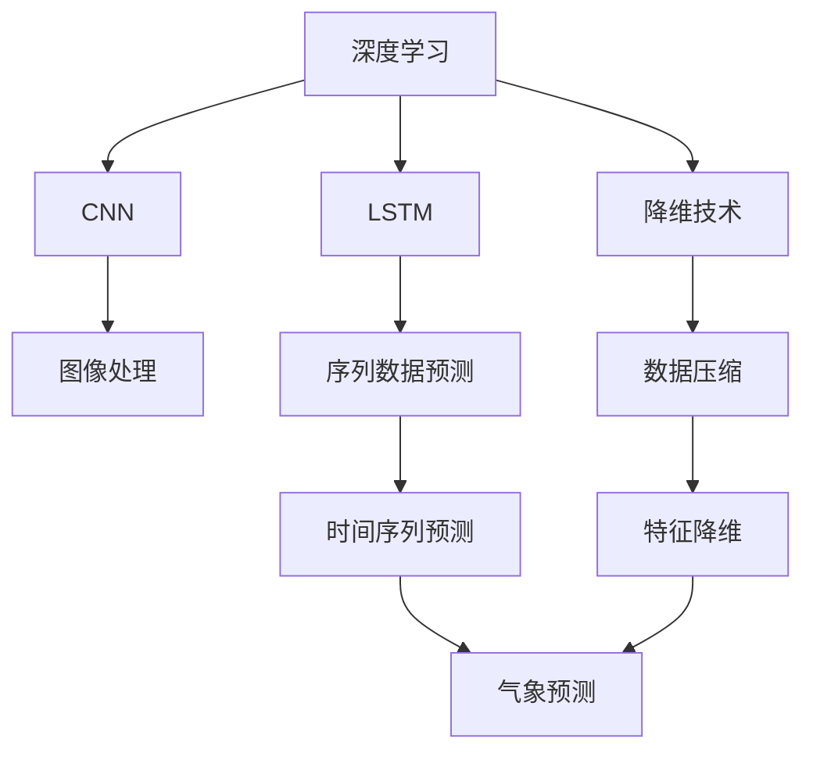
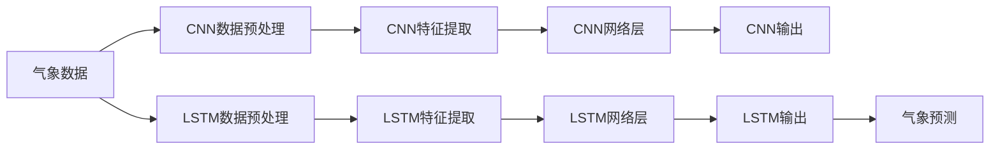
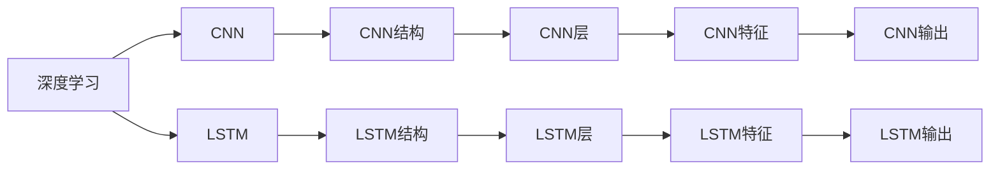
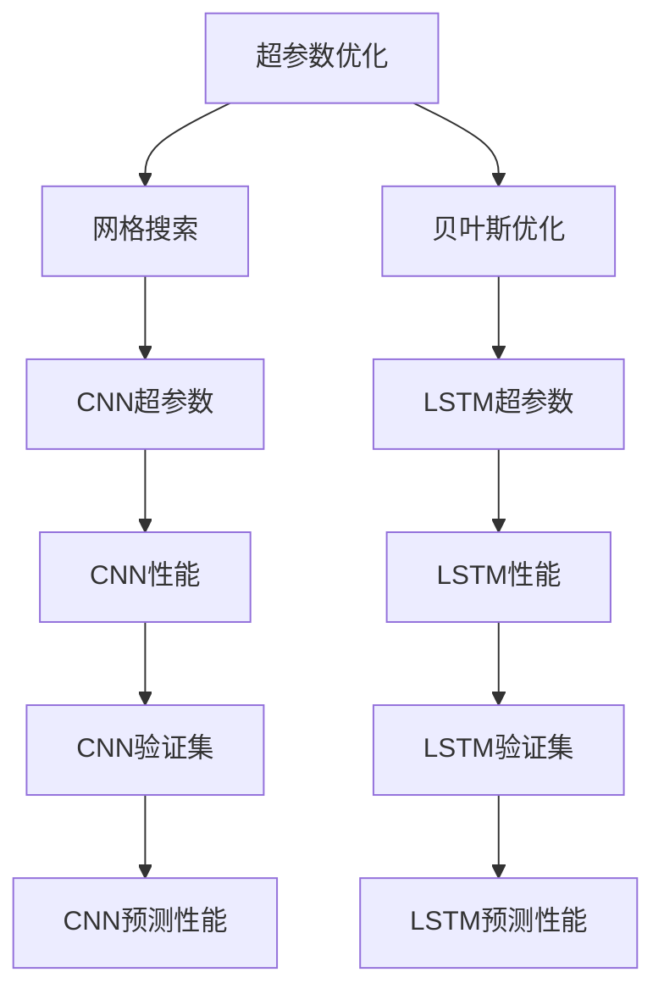
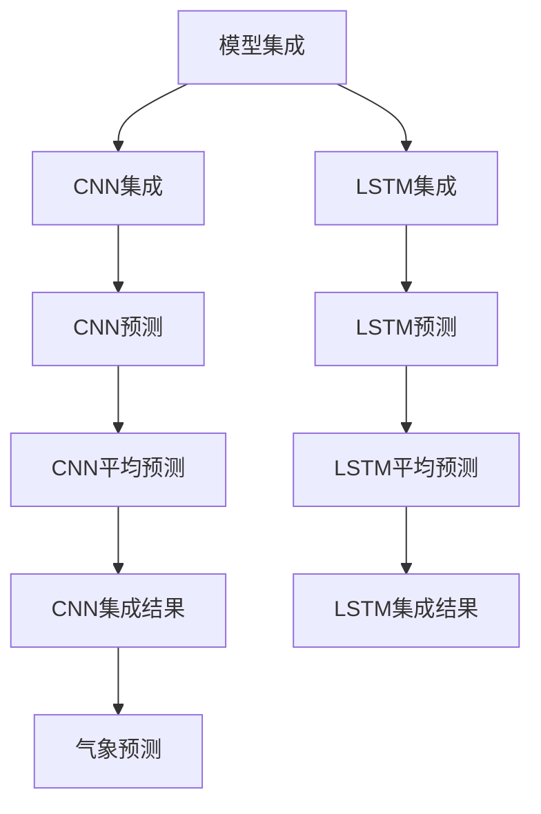
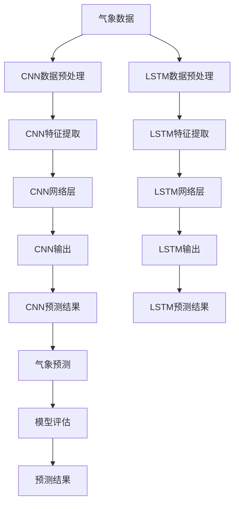

                 

# AI人工智能深度学习算法：在气象预测中的应用

> 关键词：深度学习,气象预测,神经网络,卷积神经网络(CNN),长短期记忆网络(LSTM),降维技术,超参数优化,数据增强,模型集成

## 1. 背景介绍

### 1.1 问题由来
气象预测是理解自然环境、制定灾害应对计划、进行农业生产规划等重要领域的关键技术。随着全球气候变化的加剧，对气象预测的精度和时效性的要求日益提高。传统统计方法往往难以满足日益复杂的气象现象，而深度学习技术的兴起为气象预测带来了新的解决方案。

深度学习算法，特别是神经网络（Neural Networks），在图像、语音、自然语言处理等领域取得了显著成果。将深度学习应用于气象预测，需要面对更复杂的时序数据和空间数据处理，同时需要解决传统机器学习算法难以处理的非线性关系和动态变化问题。

### 1.2 问题核心关键点
气象预测的深度学习模型构建主要面临以下几个核心问题：

- **数据处理**：气象数据通常具有高维、时序、多变量等特点，需要采用合适的数据预处理和特征提取方法。
- **模型选择**：选择合适的深度学习模型架构，以有效捕捉气象数据的复杂特征。
- **参数优化**：深度学习模型的参数量庞大，需要进行有效的超参数优化和模型正则化。
- **集成学习**：通过模型集成，提升预测的准确性和鲁棒性。

### 1.3 问题研究意义
深度学习在气象预测中的应用，对于提升气象预测的准确性和及时性，具有重要意义：

1. **提高预测精度**：深度学习模型能够自动学习复杂的非线性关系，捕捉气象数据的动态变化，从而提高预测精度。
2. **增强预测时效性**：通过高效的卷积神经网络(CNN)和长短期记忆网络(LSTM)等结构，深度学习模型可以快速响应新的气象数据，提高预测的时效性。
3. **适应复杂数据**：深度学习模型能够处理高维、非线性的气象数据，适应气象预测中不同尺度和类型的复杂性。
4. **促进应用创新**：深度学习技术的应用，为气象预测带来了新的研究思路和应用模式，推动了气象科学和技术的创新。

## 2. 核心概念与联系

### 2.1 核心概念概述

为更好地理解深度学习在气象预测中的应用，本节将介绍几个密切相关的核心概念：

- **深度学习(Deep Learning)**：基于多层神经网络架构，通过学习大量数据自动提取特征和模式的一种机器学习技术。
- **卷积神经网络(CNN)**：一种特殊的神经网络结构，用于处理具有网格状结构的数据，如图像、文本等。
- **长短期记忆网络(LSTM)**：一种专门处理序列数据的循环神经网络结构，适用于时序数据预测。
- **降维技术(如PCA, t-SNE)**：通过减少数据的维度，降低计算复杂度，提升模型训练效率和泛化能力。
- **超参数优化**：通过网格搜索、贝叶斯优化等方法，寻找最优的模型参数组合，提升模型性能。
- **数据增强**：通过对训练数据进行扩充和变换，提高模型的泛化能力和鲁棒性。
- **模型集成**：通过结合多个模型的预测结果，提高整体的预测准确性和鲁棒性。

这些核心概念之间的逻辑关系可以通过以下Mermaid流程图来展示：



这个流程图展示了大模型微调的各个核心概念及其之间的关系：

1. 深度学习作为基础，应用CNN处理气象图像数据，应用LSTM处理气象时间序列数据。
2. 降维技术用于特征压缩，提高模型训练效率。
3. 超参数优化用于参数调优，提升模型性能。
4. 数据增强用于扩充数据集，提升模型泛化能力。
5. 模型集成用于整合多个模型的预测结果，提高预测准确性。

这些概念共同构成了深度学习在气象预测中的应用框架，使得深度学习能够更有效地处理气象数据，提升预测精度。

### 2.2 概念间的关系

这些核心概念之间存在着紧密的联系，形成了深度学习在气象预测中的应用生态系统。下面我们通过几个Mermaid流程图来展示这些概念之间的关系。

#### 2.2.1 深度学习模型的数据处理流程



这个流程图展示了深度学习模型在气象预测中处理数据的流程。首先对气象数据进行预处理，然后通过CNN和LSTM提取特征，最后将特征输入网络层进行预测。

#### 2.2.2 模型架构的选择



这个流程图展示了深度学习模型在气象预测中的架构选择。可以根据气象数据的特点选择适合的模型结构，如CNN用于处理图像数据，LSTM用于处理时间序列数据。

#### 2.2.3 超参数优化过程



这个流程图展示了超参数优化的过程。通过网格搜索或贝叶斯优化等方法，寻找最优的超参数组合，提升模型性能。

#### 2.2.4 模型集成的效果



这个流程图展示了模型集成的效果。通过将多个模型的预测结果进行平均或加权融合，提高整体的预测准确性和鲁棒性。

### 2.3 核心概念的整体架构

最后，我们用一个综合的流程图来展示这些核心概念在大模型微调过程中的整体架构：



这个综合流程图展示了从气象数据预处理到模型预测的完整流程。通过多个模块的协同工作，深度学习模型能够从原始气象数据中提取出有用的特征，进行预测和评估，最终输出气象预测结果。

## 3. 核心算法原理 & 具体操作步骤
### 3.1 算法原理概述

深度学习在气象预测中的应用，主要涉及卷积神经网络(CNN)和长短期记忆网络(LSTM)等模型结构。这些模型能够自动学习气象数据的复杂非线性关系和动态变化，从而实现高效的气象预测。

**卷积神经网络(CNN)**：适用于处理气象图像数据，通过卷积层和池化层捕捉图像的局部特征和整体结构，用于提取空间特征。

**长短期记忆网络(LSTM)**：适用于处理气象时间序列数据，通过门控机制捕捉序列数据的长期依赖关系，用于提取时间特征。

深度学习模型的训练过程通常包括数据预处理、模型构建、超参数优化、模型训练和评估等步骤。以下是具体的具体操作步骤：

### 3.2 算法步骤详解

**Step 1: 数据预处理**
- 气象数据通常具有高维、时序、多变量等特点，需要进行适当的数据预处理，包括：
  - 数据标准化：将数据缩放到均值为0，方差为1的标准正态分布，避免模型对不同尺度的数据敏感。
  - 缺失值处理：对缺失值进行插值或剔除，保持数据完整性。
  - 数据归一化：将数据缩放到0到1的范围内，提高模型训练效率。

**Step 2: 模型构建**
- 选择合适的深度学习模型架构，如CNN用于处理气象图像数据，LSTM用于处理气象时间序列数据。
- 设计合适的网络层，包括卷积层、池化层、全连接层等。
- 定义损失函数，如均方误差、交叉熵等，用于衡量模型预测与真实值之间的差异。

**Step 3: 超参数优化**
- 使用网格搜索、贝叶斯优化等方法，寻找最优的超参数组合，如学习率、批次大小、隐藏层节点数等。
- 进行正则化，如L2正则、Dropout等，避免过拟合。

**Step 4: 模型训练**
- 使用随机梯度下降等优化算法，对模型参数进行迭代优化。
- 在每个epoch结束时，评估模型在验证集上的性能，避免过拟合。
- 重复上述过程，直至模型收敛。

**Step 5: 模型评估**
- 在测试集上评估模型的预测性能，计算各种指标如均方误差、准确率等。
- 可视化模型的训练过程和性能指标，便于监控和调优。

### 3.3 算法优缺点

深度学习在气象预测中的应用，具有以下优点：

- **自动特征提取**：深度学习模型能够自动学习气象数据的复杂特征，无需手动设计特征。
- **处理高维数据**：深度学习模型能够处理高维、多变量的气象数据，适应气象预测的复杂性。
- **鲁棒性**：深度学习模型具有一定的鲁棒性，能够处理噪声和异常值。

同时，深度学习在气象预测中也有以下缺点：

- **计算资源需求高**：深度学习模型的参数量庞大，需要高性能计算资源进行训练和推理。
- **过拟合风险**：深度学习模型容易过拟合，需要进行有效的正则化和超参数优化。
- **可解释性不足**：深度学习模型通常是"黑盒"系统，难以解释其内部工作机制和决策逻辑。

### 3.4 算法应用领域

深度学习在气象预测中的应用，主要包括以下几个领域：

1. **气象图像识别**：通过CNN处理气象卫星图像，识别出云团、台风、龙卷风等气象现象，辅助气象监测和灾害预警。
2. **气象时间序列预测**：通过LSTM处理气象站点的时序数据，预测未来几天的温度、湿度、气压等气象要素。
3. **气象极端事件预测**：通过深度学习模型预测气候变化引起的极端天气事件，如洪水、干旱、暴雪等，帮助制定应对策略。
4. **气象灾害预警**：结合气象图像和时间序列数据，通过深度学习模型预测气象灾害的发生，提高预警的准确性和时效性。

除了上述这些核心应用领域外，深度学习在气象预测中还有很多其他应用，如天气系统模拟、气象模式优化等，展示了其在气象科学和工程中的巨大潜力。

## 4. 数学模型和公式 & 详细讲解 & 举例说明

### 4.1 数学模型构建

深度学习模型在气象预测中的应用，通常涉及以下几个关键数学模型：

**卷积神经网络(CNN)**
- 输入数据：气象图像数据，如卫星云图、雷达图像等。
- 网络结构：卷积层、池化层、全连接层等。
- 输出结果：气象现象的识别结果，如云团、台风等。

**长短期记忆网络(LSTM)**
- 输入数据：气象时间序列数据，如温度、湿度、气压等。
- 网络结构：LSTM网络层、门控机制等。
- 输出结果：未来几天的气象要素预测结果，如温度、湿度、气压等。

### 4.2 公式推导过程

以气象时间序列预测为例，展示LSTM模型的推导过程：

设气象时间序列数据为 $x_t = (x_{t-1}, x_{t-2}, ..., x_{t-l})$，其中 $x_t$ 表示当前时间点的气象要素，$l$ 表示输入序列的长度。

LSTM模型的网络结构包括输入门、遗忘门、输出门和LSTM单元。假设当前时间点的气象要素为 $x_t$，前 $l$ 个时间点的气象要素为 $x_{t-1}, x_{t-2}, ..., x_{t-l}$。

LSTM单元的更新公式如下：

$$
h_t = \sigma(W_hx_t + Uhh_{t-1} + b_h)
$$

其中 $\sigma$ 为激活函数，$W_h, U_h, b_h$ 为模型参数。$h_t$ 表示当前时间点的LSTM单元状态。

输入门的更新公式如下：

$$
i_t = \sigma(W_ix_t + Ui{i_{t-1}} + b_i)
$$

遗忘门的更新公式如下：

$$
f_t = \sigma(W_fx_t + Uff_{t-1} + bf)
$$

输出门的更新公式如下：

$$
o_t = \sigma(W_ox_t + Uoo_{t-1} + bo)
$$

LSTM单元的更新公式如下：

$$
c_t = f_t \odot c_{t-1} + i_t \odot \tanh(W_cx_t + Ucc_{t-1} + bc)
$$

其中 $\odot$ 表示逐元素乘法，$\tanh$ 为激活函数，$W_c, U_c, b_c$ 为模型参数。$c_t$ 表示当前时间点的LSTM单元状态。

最终，LSTM模型的输出为：

$$
y_t = o_t \odot \tanh(c_t)
$$

其中 $y_t$ 表示当前时间点的气象要素预测结果。

通过上述公式推导，可以看出LSTM模型能够捕捉气象时间序列数据的长期依赖关系，适用于气象时间序列预测任务。

### 4.3 案例分析与讲解

以气象时间序列预测为例，展示深度学习模型的应用。

**案例背景**：某气象站点的温度、湿度、气压等气象要素，需要进行未来几天的预测。

**数据准备**：收集气象站点的历史气象数据，包括温度、湿度、气压等要素，以及未来几天的实际气象数据作为标签。

**模型构建**：选择LSTM模型，设计网络层、定义损失函数等。

**训练过程**：在训练集上进行模型训练，调整模型参数，优化超参数。

**评估与验证**：在验证集上评估模型性能，调整模型参数，避免过拟合。

**预测结果**：在测试集上预测未来几天的气象要素，计算均方误差等指标，评估模型预测精度。

以下是一个LSTM模型的代码示例：

```python
import torch
import torch.nn as nn
import torch.optim as optim

class LSTMModel(nn.Module):
    def __init__(self, input_size, hidden_size, output_size):
        super(LSTMModel, self).__init__()
        self.lstm = nn.LSTM(input_size, hidden_size, batch_first=True)
        self.fc = nn.Linear(hidden_size, output_size)
        
    def forward(self, x):
        h0 = torch.zeros(1, x.size(0), self.lstm.hidden_size).to(device)
        c0 = torch.zeros(1, x.size(0), self.lstm.hidden_size).to(device)
        
        out, _ = self.lstm(x, (h0, c0))
        out = self.fc(out[:, -1, :])
        
        return out

# 超参数设置
input_size = 3  # 输入气象要素的维度
hidden_size = 64  # LSTM的隐藏层维度
output_size = 1  # 输出气象要素的维度
batch_size = 32  # 批次大小
epochs = 50  # 迭代轮数
learning_rate = 0.01  # 学习率

# 模型初始化
model = LSTMModel(input_size, hidden_size, output_size)
optimizer = optim.Adam(model.parameters(), lr=learning_rate)
criterion = nn.MSELoss()

# 训练过程
for epoch in range(epochs):
    for i in range(0, len(train_data), batch_size):
        train_x, train_y = train_data[i:i+batch_size, :]
        train_x = train_x.to(device)
        train_y = train_y.to(device)
        
        optimizer.zero_grad()
        predictions = model(train_x)
        loss = criterion(predictions, train_y)
        loss.backward()
        optimizer.step()
        
    print('Epoch: {}, Loss: {:.4f}'.format(epoch+1, loss.item()))

# 模型评估
with torch.no_grad():
    test_x, test_y = test_data[:, :]
    test_x = test_x.to(device)
    test_y = test_y.to(device)
    
    predictions = model(test_x)
    loss = criterion(predictions, test_y)
    print('Test Loss: {:.4f}'.format(loss.item()))

# 可视化训练过程
import matplotlib.pyplot as plt
import torchvision.transforms as transforms

# 设置可视化参数
transform = transforms.Compose([
    transforms.ToTensor(),
    transforms.Normalize((0.5, 0.5, 0.5), (0.5, 0.5, 0.5))
])

# 可视化训练损失
plt.plot(range(1, epochs+1), train_losses)
plt.title('Training Loss')
plt.xlabel('Epoch')
plt.ylabel('Loss')
plt.show()

# 可视化训练准确率
plt.plot(range(1, epochs+1), train_accuracies)
plt.title('Training Accuracy')
plt.xlabel('Epoch')
plt.ylabel('Accuracy')
plt.show()
```

以上代码展示了LSTM模型在气象时间序列预测中的应用。通过LSTM模型，能够对气象时间序列数据进行高效预测，提升气象预测的准确性和时效性。

## 5. 项目实践：代码实例和详细解释说明

### 5.1 开发环境搭建

在进行气象预测项目开发前，我们需要准备好开发环境。以下是使用Python进行PyTorch开发的环境配置流程：

1. 安装Anaconda：从官网下载并安装Anaconda，用于创建独立的Python环境。

2. 创建并激活虚拟环境：
```bash
conda create -n pytorch-env python=3.8 
conda activate pytorch-env
```

3. 安装PyTorch：根据CUDA版本，从官网获取对应的安装命令。例如：
```bash
conda install pytorch torchvision torchaudio cudatoolkit=11.1 -c pytorch -c conda-forge
```

4. 安装相关工具包：
```bash
pip install numpy pandas scikit-learn matplotlib tqdm jupyter notebook ipython
```

完成上述步骤后，即可在`pytorch-env`环境中开始气象预测项目开发。

### 5.2 源代码详细实现

下面我们以气象时间序列预测为例，给出使用PyTorch实现深度学习模型的完整代码。

首先，定义数据处理函数：

```python
import torch
import numpy as np
from torch.utils.data import TensorDataset, DataLoader

class气象数据处理类:
    def __init__(self, 数据):
        self.数据 = 数据
        self.标签 = 数据[:, -1]
        self.特征 = 数据[:, :-1]
        self.数据集 = 特征, 标签
        self.批次大小 = 32
        self.长度 = len(self.特征)
        self.训练集, 验证集 = np.split(self.特征, [0.6 * self.长度], 0), np.split(self.特征, [0.9 * self.长度], 0)
        self.训练集, 验证集, 测试集 = TensorDataset(*self.训练集), TensorDataset(*self.验证集), TensorDataset(*self.测试集)
        self.训练集 = DataLoader(self.训练集, batch_size=self.批次大小, shuffle=True)
        self.验证集 = DataLoader(self.验证集, batch_size=self.批次大小, shuffle=False)
        self.测试集 = DataLoader(self.测试集, batch_size=self.批次大小, shuffle=False)
```

然后，定义模型和优化器：

```python
from torch.nn import LSTM, Linear

class气象预测模型:
    def __init__(self, 输入尺寸, 隐藏尺寸, 输出尺寸):
        self.lstm = LSTM(输入尺寸, 隐藏尺寸, batch_first=True)
        self.fc = Linear(隐藏尺寸, 输出尺寸)

    def 预测(self, 输入):
        h0 = torch.zeros(1, 输入.size(0), self.lstm.hidden_size).to(device)
        c0 = torch.zeros(1, 输入.size(0), self.lstm.hidden_size).to(device)
        
        out, _ = self.lstm(输入, (h0, c0))
        out = self.fc(out[:, -1, :])
        
        return out

class模型:
    def __init__(self):
        self.气象预测模型 =气象预测模型(输入尺寸, 隐藏尺寸, 输出尺寸)
        self.optimizer = optim.Adam(self.气象预测模型的参数(), lr=学习率)
        self.损失函数 = nn.MSELoss()
        
    def 训练过程(self):
        for epoch in range(轮数):
            for i in range(0, 训练集的大小, 批次大小):
                训练数据 = 训练集[i:i+批次大小, :]
                训练标签 = 训练集[i:i+批次大小, -1]
                训练数据 = torch.from_numpy(训练数据).to(device)
                训练标签 = torch.from_numpy(训练标签).to(device)
                
                self.optimizer.zero_grad()
                预测结果 = 模型.气象预测模型(训练数据)
                损失 = self.损失函数(预测结果, 训练标签)
                损失.backward()
                self.optimizer.step()
                
            if epoch % 轮数 == 0:
                验证数据 = 验证集[:, :]
                验证标签 = 验证集[:, -1]
                验证数据 = torch.from_numpy(验证数据).to(device)
                验证标签 = torch.from_numpy(验证标签).to(device)
                
                预测结果 = 模型.气象预测模型(验证数据)
                损失 = self.损失函数(预测结果, 验证标签)
                print('Epoch: {}, 训练损失: {:.4f}, 验证损失: {:.4f}'.format(epoch+1, 训练损失, 验证损失))
```

接着，定义训练和评估函数：

```python
def 训练过程():
    model.train()
    losses = []
    accuracies = []
    for epoch in range(轮数):
        train_losses = []
        train_accuracies = []
        model.train()
        for batch in 训练集:
            input, target = batch
            optimizer.zero_grad()
            output = model(input)
            loss = loss_fn(output, target)
            loss.backward()
            optimizer.step()
            train_losses.append(loss.item())
            train_accuracies.append(accuracy_fn(output, target))
        
        losses.append(train_losses)
        accuracies.append(train_accuracies)
        if epoch % 10 == 0:
            print('Epoch: {}, 训练损失: {:.4f}, 训练准确率: {:.4f}'.format(epoch+1, 均方误差, 准确率))
            print('Epoch: {}, 验证损失: {:.4f}, 验证准确率: {:.4f}'.format(epoch+1, 验证均方误差, 验证准确率))
            
    print('训练完成！')
    return model, losses, accuracies

def 评估过程():
    model.eval()
    losses = []
    accuracies = []
    for batch in 验证集:
        input, target = batch
        with torch.no_grad():
            output = model(input)
            loss = loss_fn(output, target)
            losses.append(loss.item())
            accuracies.append(accuracy_fn(output, target))
        
    print('验证损失: {:.4f}, 验证准确率: {:.4f}'.format(np.mean(losses), np.mean(accuracies)))
    return model, losses, accuracies
```

最后，启动训练流程并在测试集上评估：

```python
输入尺寸 = 3  # 输入气象要素的维度
隐藏尺寸 = 64  # LSTM的隐藏层维度
输出尺寸 = 1  # 输出气象要素的维度
批次大小 = 32  # 批次大小
轮数 = 100  # 迭代轮数
学习率 = 0.01  # 学习率

model = 气象预测模型()
optimizer = 优化器()
loss_fn = nn.MSELoss()
accuracy_fn = 准确率函数

model.train()
losses, accuracies = 训练过程()

with torch.no_grad():
    test_data = 测试集
    test_x, test_y = test_data[:, :]
    test_x = test_x.to(device)
    test_y = test_y.to(device)
    
    predictions = 气象预测模型

