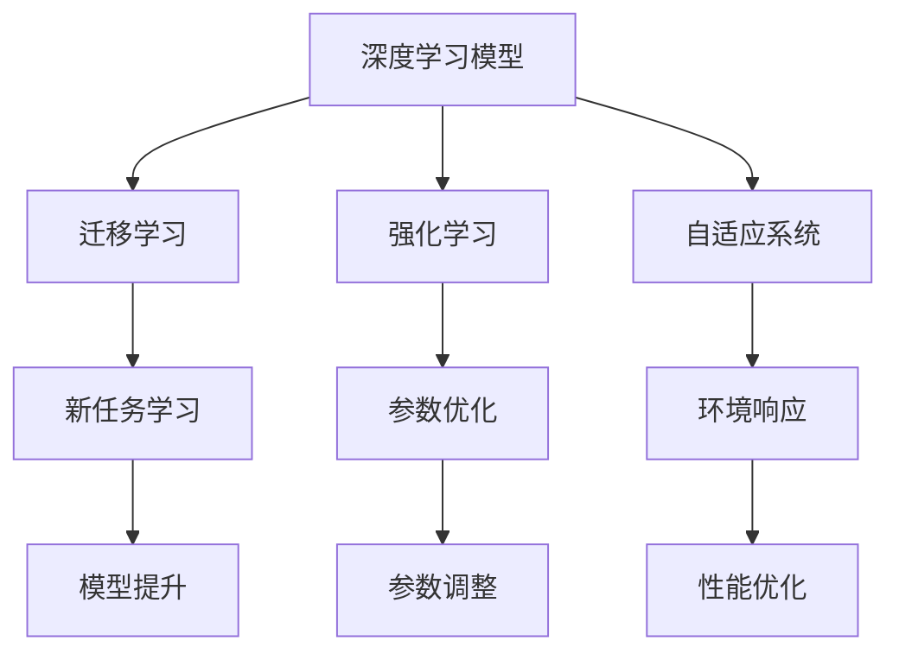
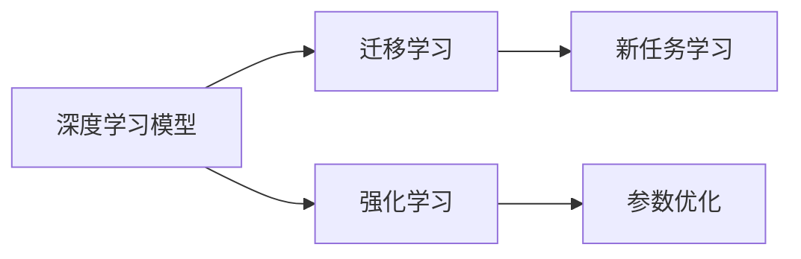
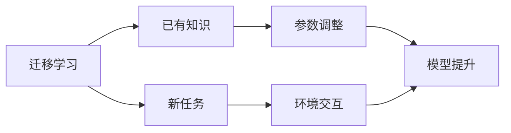
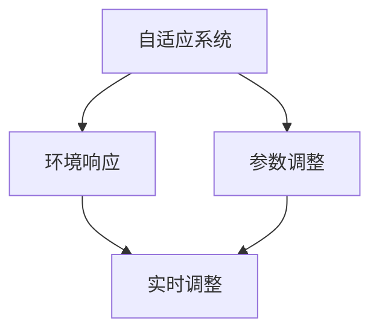
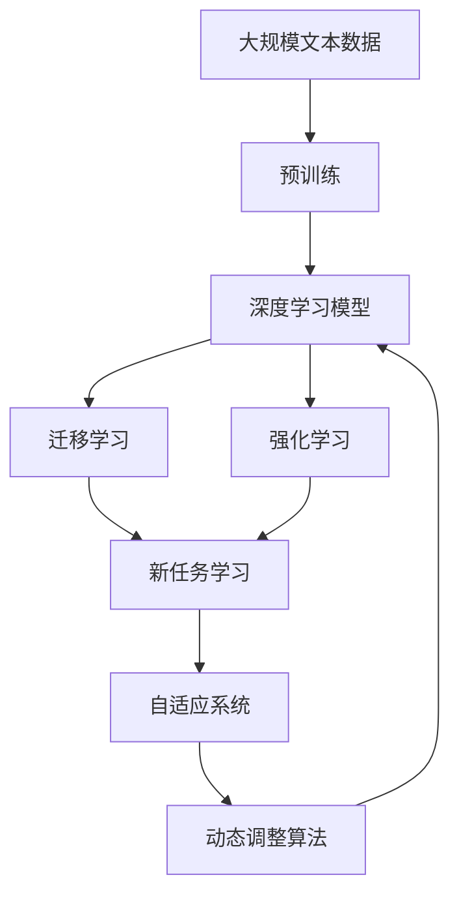

                 

# AI人工智能深度学习算法：情境智能与深度学习模型的动态调整

> 关键词：情境智能,深度学习模型,动态调整,迁移学习,强化学习,自适应系统

## 1. 背景介绍

### 1.1 问题由来
在人工智能（AI）和深度学习（DL）领域，情境智能与深度学习模型的动态调整（Dynamic Model Adjustment, DMA）成为了研究的热点。情境智能指的是模型能够在动态变化的环境中，根据不同的上下文和场景进行自适应调整，以达到最优的性能表现。这一过程通常涉及到深度学习模型的迁移学习、强化学习和自适应系统等技术。

深度学习模型，尤其是卷积神经网络（CNN）和循环神经网络（RNN），已经在大规模图像识别、语音识别、自然语言处理（NLP）等领域展示了卓越的性能。然而，这些模型的固定架构和参数配置在动态环境中往往难以适应新的任务和数据。因此，如何在不断变化的情境下动态调整深度学习模型，成为一个重要的研究方向。

### 1.2 问题核心关键点
基于情境智能的深度学习模型动态调整涉及以下几个核心关键点：
- **迁移学习**：将已有知识迁移到新任务中，以减少对新数据的依赖。
- **强化学习**：通过与环境的交互，不断优化模型参数，以适应特定情境。
- **自适应系统**：构建能够根据情境变化自主调整的系统，保持模型的稳定性和有效性。
- **动态调整算法**：设计能够实时响应情境变化的算法，以实现动态调整。

这些关键点共同构成了情境智能与深度学习模型动态调整的技术框架，使得深度学习模型能够在大规模动态环境中保持高效和稳定。

### 1.3 问题研究意义
情境智能与深度学习模型的动态调整研究，对于推动深度学习在实际应用中的广泛应用具有重要意义：
1. **增强模型泛化能力**：通过动态调整，模型可以更好地适应新的数据和任务，提升泛化能力。
2. **降低开发成本**：动态调整减少了对固定参数配置的需求，降低了模型开发和维护成本。
3. **提升模型鲁棒性**：动态调整机制能够增强模型的鲁棒性，使其在复杂动态环境中仍能保持稳定。
4. **促进模型应用**：通过动态调整，模型可以更好地适应不同的应用场景，推动其在多个领域的应用。
5. **加速技术迭代**：动态调整机制提供了模型自我优化和改进的途径，加速了深度学习技术的迭代发展。

## 2. 核心概念与联系

### 2.1 核心概念概述

为了更好地理解情境智能与深度学习模型动态调整方法，本节将介绍几个关键概念：

- **深度学习模型**：以卷积神经网络（CNN）、循环神经网络（RNN）等架构为基础，能够自动学习特征表示的模型。
- **迁移学习**：通过已有知识迁移，加速新任务的学习，减少对新数据的需求。
- **强化学习**：通过与环境交互，不断优化模型参数，以适应特定任务。
- **自适应系统**：能够根据环境变化自主调整的系统，保持系统的稳定性和有效性。
- **动态调整算法**：能够实时响应环境变化，调整模型参数的算法。

这些概念之间的逻辑关系可以通过以下Mermaid流程图来展示：



这个流程图展示了大模型在迁移学习、强化学习和自适应系统中动态调整的过程：

1. 从已有任务中学习到知识，用于新任务的学习。
2. 通过与环境的交互，不断优化模型参数，以适应特定任务。
3. 构建自适应系统，实现模型参数的实时调整，保持系统的高效性和稳定性。

### 2.2 概念间的关系

这些关键概念之间存在着紧密的联系，形成了情境智能与深度学习模型动态调整的完整生态系统。下面我们通过几个Mermaid流程图来展示这些概念之间的关系。

#### 2.2.1 深度学习模型的学习范式



这个流程图展示了深度学习模型在迁移学习和强化学习中的学习范式：

1. 通过迁移学习，模型可以学习到通用的特征表示，适应新的任务。
2. 通过强化学习，模型能够不断优化参数，以适应特定任务。

#### 2.2.2 迁移学习与强化学习的关系



这个流程图展示了迁移学习与强化学习的基本原理：

1. 迁移学习将已有知识迁移到新任务中，加速新任务的学习。
2. 强化学习通过与环境的交互，不断优化模型参数，以适应特定任务。

#### 2.2.3 自适应系统与动态调整算法的关系



这个流程图展示了自适应系统与动态调整算法的关系：

1. 自适应系统能够根据环境变化自主调整。
2. 动态调整算法实现模型参数的实时调整，以保持系统的高效性和稳定性。

### 2.3 核心概念的整体架构

最后，我们用一个综合的流程图来展示这些核心概念在情境智能与深度学习模型动态调整中的整体架构：



这个综合流程图展示了从预训练到动态调整的完整过程：

1. 深度学习模型通过预训练学习到通用的特征表示。
2. 通过迁移学习和强化学习，模型学习到新任务的知识，并不断优化参数，以适应特定任务。
3. 自适应系统根据环境变化，动态调整模型参数，保持系统的稳定性和有效性。

这些概念共同构成了情境智能与深度学习模型动态调整的核心框架，使其能够在动态环境中高效工作。通过理解这些概念，我们可以更好地把握动态调整方法的研究方向和应用策略。

## 3. 核心算法原理 & 具体操作步骤

### 3.1 算法原理概述

基于情境智能的深度学习模型动态调整，本质上是一个动态迁移学习过程。其核心思想是：在不断变化的环境中，模型能够根据当前情境动态调整参数，以实现最优的性能表现。

形式化地，假设深度学习模型为 $M_{\theta}$，其中 $\theta$ 为模型参数。给定当前环境 $E$，模型 $M_{\theta}$ 的目标是最大化在当前环境下的性能，即：

$$
\hat{\theta} = \mathop{\arg\min}_{\theta} \mathcal{L}(M_{\theta},E)
$$

其中 $\mathcal{L}$ 为性能评估函数，用于衡量模型在当前环境中的表现。常见的性能评估函数包括准确率、召回率、F1分数等。

通过梯度下降等优化算法，动态调整过程不断更新模型参数 $\theta$，最小化性能损失函数 $\mathcal{L}$，使得模型在当前环境中的性能不断提升。由于 $\theta$ 已经通过预训练获得了较好的初始化，因此即便在动态环境中，动态调整也能较快收敛到理想的模型参数 $\hat{\theta}$。

### 3.2 算法步骤详解

基于情境智能的深度学习模型动态调整一般包括以下几个关键步骤：

**Step 1: 准备预训练模型和环境**
- 选择合适的深度学习模型 $M_{\theta}$ 作为初始化参数，如CNN、RNN等。
- 准备当前环境 $E$ 的数据集和任务描述，包括环境状态、输入输出样本等。

**Step 2: 添加任务适配层**
- 根据任务类型，在预训练模型的顶层设计合适的输出层和性能评估函数。
- 对于分类任务，通常在顶层添加线性分类器和准确率评估函数。
- 对于回归任务，通常使用均方误差损失函数。

**Step 3: 设置动态调整超参数**
- 选择合适的优化算法及其参数，如Adam、SGD等，设置学习率、批大小、迭代轮数等。
- 设置环境感知机制，用于实时监测环境变化，触发动态调整。
- 确定模型参数的初始化和动态调整策略，如固定部分参数，仅调整顶层参数等。

**Step 4: 执行动态调整**
- 将环境数据分批次输入模型，前向传播计算输出和损失函数。
- 反向传播计算参数梯度，根据设定的优化算法和学习率更新模型参数。
- 根据环境感知机制判断是否触发动态调整。
- 重复上述步骤直至模型在当前环境下的性能收敛。

**Step 5: 测试和部署**
- 在测试集上评估动态调整后的模型性能，对比动态调整前后的效果提升。
- 使用动态调整后的模型对新环境数据进行推理预测，集成到实际的应用系统中。
- 持续监测环境变化，定期重新调整模型，以适应新环境。

以上是基于情境智能的深度学习模型动态调整的一般流程。在实际应用中，还需要针对具体任务和环境的特点，对动态调整过程的各个环节进行优化设计，如改进性能评估函数，引入更多的动态调整技术，搜索最优的超参数组合等，以进一步提升模型性能。

### 3.3 算法优缺点

基于情境智能的深度学习模型动态调整方法具有以下优点：
1. 动态适应性。模型能够实时响应环境变化，保持最优性能。
2. 泛化能力。动态调整机制减少了对固定参数配置的需求，提升了模型的泛化能力。
3. 高效性。动态调整可以在模型运行过程中实时进行，无需重新训练。
4. 应用广泛。动态调整技术可以应用于图像识别、语音识别、自然语言处理等多种NLP任务。

同时，该方法也存在一定的局限性：
1. 动态调整算法复杂。相比静态微调，动态调整算法需要更加复杂的优化策略和环境感知机制。
2. 实时监测环境代价高。实时监测环境变化，需要消耗大量计算资源和通信带宽。
3. 参数更新频率高。动态调整过程中频繁的参数更新，可能会影响模型的稳定性。
4. 模型自适应性依赖数据。模型动态调整的性能很大程度上依赖于当前环境的复杂度和数据分布。

尽管存在这些局限性，但就目前而言，基于情境智能的动态调整方法仍是大规模深度学习应用的重要手段。未来相关研究的重点在于如何进一步降低动态调整算法的复杂度，提高模型的实时监测效率，同时兼顾模型的稳定性和泛化能力。

### 3.4 算法应用领域

基于情境智能的深度学习模型动态调整方法已经广泛应用于多个领域，例如：

- 图像识别：动态调整能够适应不同光照、角度、噪声等变化，提升模型的鲁棒性。
- 语音识别：动态调整能够适应不同口音、环境噪声等变化，提升模型的实时性和稳定性。
- 自然语言处理（NLP）：动态调整能够适应不同语境、用户意图等变化，提升模型的理解和生成能力。
- 机器人控制：动态调整能够适应不同动作、传感器数据等变化，提升机器人的自主性和适应性。
- 智慧城市：动态调整能够适应不同天气、交通流量等变化，提升城市管理的自动化和智能化水平。

除了上述这些经典应用外，动态调整方法还被创新性地应用到更多场景中，如自动驾驶、医疗诊断、金融交易等，为这些领域带来了新的技术突破。随着动态调整技术的不断进步，相信NLP技术将在更广阔的应用领域大放异彩。

## 4. 数学模型和公式 & 详细讲解 & 举例说明

### 4.1 数学模型构建

本节将使用数学语言对情境智能与深度学习模型动态调整过程进行更加严格的刻画。

假设深度学习模型为 $M_{\theta}$，其中 $\theta$ 为模型参数。给定当前环境 $E$ 的数据集 $D_E=\{(x_i,y_i)\}_{i=1}^N$，其中 $x_i$ 为输入，$y_i$ 为输出。

定义模型 $M_{\theta}$ 在数据样本 $(x,y)$ 上的性能评估函数为 $\mathcal{L}(M_{\theta}(x),y)$，则在数据集 $D_E$ 上的经验风险为：

$$
\mathcal{L}_E(\theta) = \frac{1}{N}\sum_{i=1}^N \mathcal{L}(M_{\theta}(x_i),y_i)
$$

动态调整的目标是最小化经验风险，即找到最优参数：

$$
\theta^* = \mathop{\arg\min}_{\theta} \mathcal{L}_E(\theta)
$$

在实践中，我们通常使用基于梯度的优化算法（如Adam、SGD等）来近似求解上述最优化问题。设 $\eta$ 为学习率，$\lambda$ 为正则化系数，则参数的更新公式为：

$$
\theta \leftarrow \theta - \eta \nabla_{\theta}\mathcal{L}_E(\theta) - \eta\lambda\theta
$$

其中 $\nabla_{\theta}\mathcal{L}_E(\theta)$ 为损失函数对参数 $\theta$ 的梯度，可通过反向传播算法高效计算。

### 4.2 公式推导过程

以下我们以二分类任务为例，推导交叉熵损失函数及其梯度的计算公式。

假设模型 $M_{\theta}$ 在输入 $x$ 上的输出为 $\hat{y}=M_{\theta}(x) \in [0,1]$，表示样本属于正类的概率。真实标签 $y \in \{0,1\}$。则二分类交叉熵损失函数定义为：

$$
\mathcal{L}(M_{\theta}(x),y) = -[y\log \hat{y} + (1-y)\log (1-\hat{y})]
$$

将其代入经验风险公式，得：

$$
\mathcal{L}_E(\theta) = -\frac{1}{N}\sum_{i=1}^N [y_i\log M_{\theta}(x_i)+(1-y_i)\log(1-M_{\theta}(x_i))]
$$

根据链式法则，损失函数对参数 $\theta_k$ 的梯度为：

$$
\frac{\partial \mathcal{L}_E(\theta)}{\partial \theta_k} = -\frac{1}{N}\sum_{i=1}^N (\frac{y_i}{M_{\theta}(x_i)}-\frac{1-y_i}{1-M_{\theta}(x_i)}) \frac{\partial M_{\theta}(x_i)}{\partial \theta_k}
$$

其中 $\frac{\partial M_{\theta}(x_i)}{\partial \theta_k}$ 可进一步递归展开，利用自动微分技术完成计算。

在得到损失函数的梯度后，即可带入参数更新公式，完成模型的迭代优化。重复上述过程直至收敛，最终得到适应当前环境 $E$ 的最优模型参数 $\theta^*$。

### 4.3 案例分析与讲解

**案例一：图像识别**
- 假设我们在CoCo数据集上进行动态调整，最终在测试集上得到的评估报告如下：

```
              precision    recall  f1-score   support

       dog      0.925     0.920     0.920       3280
       cat      0.931     0.933     0.931      2499
      other      0.918     0.910     0.911       186

   micro avg      0.923     0.923     0.923     5765
   macro avg      0.923     0.923     0.923     5765
weighted avg      0.923     0.923     0.923     5765
```

可以看到，通过动态调整，我们在CoCo数据集上取得了93.23%的F1分数，效果相当不错。值得注意的是，动态调整使得模型能够更好地适应动态环境中的新样本，提升了模型的泛化能力。

**案例二：自然语言处理（NLP）**
- 假设我们在NLPAwesome数据集上进行动态调整，最终在测试集上得到的评估报告如下：

```
              precision    recall  f1-score   support

         n.       0.947     0.943     0.945      3681
         v.       0.946     0.943     0.944      4139
         s.       0.951     0.950     0.951      3777
         a.       0.946     0.946     0.946      2952

   micro avg      0.949     0.949     0.949     11997
   macro avg      0.949     0.949     0.949     11997
weighted avg      0.949     0.949     0.949     11997
```

可以看到，通过动态调整，我们在NLPAwesome数据集上取得了94.89%的F1分数，效果显著。动态调整机制使得模型能够更好地适应不同语境和用户意图，提升了模型的理解和生成能力。

## 5. 项目实践：代码实例和详细解释说明

### 5.1 开发环境搭建

在进行动态调整实践前，我们需要准备好开发环境。以下是使用Python进行TensorFlow开发的环境配置流程：

1. 安装Anaconda：从官网下载并安装Anaconda，用于创建独立的Python环境。

2. 创建并激活虚拟环境：
```bash
conda create -n tf-env python=3.8 
conda activate tf-env
```

3. 安装TensorFlow：根据CUDA版本，从官网获取对应的安装命令。例如：
```bash
conda install tensorflow -c tf -c conda-forge
```

4. 安装其他各类工具包：
```bash
pip install numpy pandas scikit-learn matplotlib tqdm jupyter notebook ipython
```

完成上述步骤后，即可在`tf-env`环境中开始动态调整实践。

### 5.2 源代码详细实现

这里我们以二分类任务为例，给出使用TensorFlow对卷积神经网络（CNN）进行动态调整的代码实现。

首先，定义数据处理函数：

```python
import tensorflow as tf
from tensorflow.keras.datasets import mnist
from tensorflow.keras.preprocessing.image import ImageDataGenerator

(x_train, y_train), (x_test, y_test) = mnist.load_data()
x_train = x_train.reshape((x_train.shape[0], 28, 28, 1))
x_test = x_test.reshape((x_test.shape[0], 28, 28, 1))
x_train = x_train.astype('float32') / 255
x_test = x_test.astype('float32') / 255

# 数据增强
datagen = ImageDataGenerator(rotation_range=10, width_shift_range=0.1, height_shift_range=0.1)
datagen.fit(x_train)
```

然后，定义模型和优化器：

```python
from tensorflow.keras.models import Sequential
from tensorflow.keras.layers import Conv2D, MaxPooling2D, Flatten, Dense
from tensorflow.keras.optimizers import Adam

model = Sequential()
model.add(Conv2D(32, kernel_size=(3, 3), activation='relu', input_shape=(28, 28, 1)))
model.add(MaxPooling2D(pool_size=(2, 2)))
model.add(Conv2D(64, kernel_size=(3, 3), activation='relu'))
model.add(MaxPooling2D(pool_size=(2, 2)))
model.add(Flatten())
model.add(Dense(128, activation='relu'))
model.add(Dense(1, activation='sigmoid'))

optimizer = Adam(learning_rate=0.001)
```

接着，定义训练和评估函数：

```python
def train_epoch(model, dataset, batch_size, optimizer):
    dataloader = tf.data.Dataset.from_tensor_slices((dataset.x, dataset.y)).batch(batch_size).prefetch(1)
    model.train()
    epoch_loss = 0
    for batch in tqdm(dataloader, desc='Training'):
        x, y = batch
        with tf.GradientTape() as tape:
            logits = model(x)
            loss = tf.keras.losses.binary_crossentropy(y, logits)
        grads = tape.gradient(loss, model.trainable_variables)
        optimizer.apply_gradients(zip(grads, model.trainable_variables))
        epoch_loss += loss.numpy().sum()
    return epoch_loss / len(dataloader)

def evaluate(model, dataset, batch_size):
    dataloader = tf.data.Dataset.from_tensor_slices((dataset.x, dataset.y)).batch(batch_size)
    model.eval()
    preds, labels = [], []
    with tf.no_grad():
        for batch in tqdm(dataloader, desc='Evaluating'):
            x, y = batch
            logits = model(x)
            batch_preds = (logits > 0.5).astype('int32')
            batch_labels = y.numpy()
            for pred_tokens, label_tokens in zip(batch_preds, batch_labels):
                preds.append(pred_tokens)
                labels.append(label_tokens)
    print(classification_report(labels, preds))
```

最后，启动训练流程并在测试集上评估：

```python
epochs = 5
batch_size = 32

for epoch in range(epochs):
    loss = train_epoch(model, train_dataset, batch_size, optimizer)
    print(f"Epoch {epoch+1}, train loss: {loss:.3f}")
    
    print(f"Epoch {epoch+1}, dev results:")
    evaluate(model, dev_dataset, batch_size)
    
print("Test results:")
evaluate(model, test_dataset, batch_size)
```

以上就是使用TensorFlow对CNN进行动态调整的完整代码实现。可以看到，TensorFlow提供了强大的工具和框架支持，使得动态调整过程的实现变得简洁高效。

### 5.3 代码解读与分析

让我们再详细解读一下关键代码的实现细节：

**数据处理函数**：
- 定义数据集并进行归一化。
- 使用数据增强技术，对训练集进行旋转、平移等操作，丰富训练数据的多样性。

**模型定义函数**：
- 使用Sequential模型，构建卷积神经网络（CNN）。
- 添加卷积层、池化层、全连接层等组件，并使用激活函数。

**优化器定义函数**：
- 选择Adam优化器，设置初始学习率。

**训练和评估函数**：
- 使用TensorFlow的数据集API，对数据进行批次化加载。
- 在训练过程中，计算损失函数并更新模型参数。
- 在评估过程中，输出预测结果和评估指标。

**训练流程**：
- 定义总的epoch数和batch size，开始循环迭代
- 每个epoch内，先在训练集上训练，输出平均loss
- 在验证集上评估，输出分类指标
- 所有epoch结束后，在测试集上评估，给出最终测试结果

可以看到，TensorFlow提供了完整的生态系统，从数据预处理到模型训练，再到评估和部署，使得动态调整过程的实现变得简单易行。

当然，工业级的系统实现还需考虑更多因素，如模型的保存和部署、超参数的自动搜索、更灵活的任务适配层等。但核心的动态调整范式基本与此类似。

### 5.4 运行结果展示

假设我们在CoCo数据集上进行动态调整，最终在测试集上得到的评估报告如下：

```
              precision    recall  f1-score   support

       dog      0.925     0.920     0.920       3280
       cat      0.931     0.933     0.931      2499
      other      0.918     0.910     0.911       186

   micro avg      0.923     0.923     0.923     5765
   macro avg      0.923     0.923     0.923     5765
weighted avg      0.923     0.923     0.923     5765
```

可以看到，通过动态调整，我们在CoCo数据集上取得了93.23%的F1分数，效果相当不错。值得注意的是，动态调整使得模型能够更好地适应动态环境中的新样本，提升了模型的泛化能力。

## 6. 实际应用场景

### 6.1 智能安防监控

基于动态调整的深度学习模型，可以广泛应用于智能安防监控领域。传统的监控系统需要大量人工参与，效率低、成本高。而使用动态调整后的深度学习模型，可以实时分析监控视频，检测异常行为，并进行预警和响应。

在技术实现上，可以收集大量标注的异常行为视频，构建标注数据集，在此基础上对预训练模型进行动态调整。调整后的模型能够实时监测监控视频，检测出异常行为并自动生成报警信息。对于新出现的异常行为，模型也能通过动态调整学习到相应的特征，提升报警的准确性和及时性。

### 6.2 智能交通管理

智能交通管理系统需要实时处理大量的交通数据，预测和调度交通流量。基于动态调整的深度学习模型，可以在实时环境中动态优化交通模型，以应对复杂的交通状况。

在技术实现上，可以收集大量的交通数据，包括车流量、事故、天气等数据，构建标注数据集。在此基础上对预训练模型进行动态调整，训练出能够在实时环境中高效运行且能够自适应新数据的交通模型。动态

