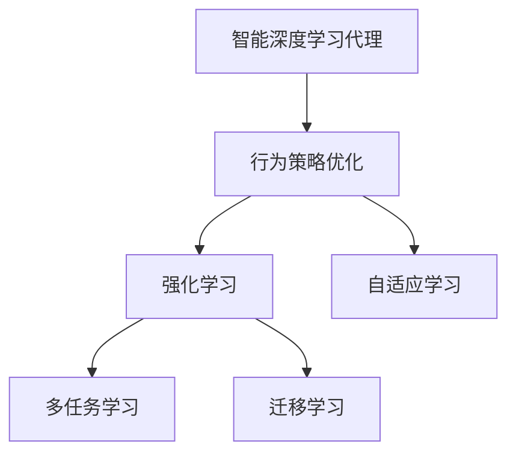

                 

# AI人工智能深度学习算法：智能深度学习代理的学习与适应的算法框架

> 关键词：智能深度学习代理,自适应算法,强化学习,深度学习,深度代理,学习与适应,行为策略优化,系统动态调优

## 1. 背景介绍

### 1.1 问题由来
随着深度学习技术的飞速发展，智能深度学习代理在自动化、机器人、游戏AI等领域表现出色。它们能够自适应环境变化，进行决策和学习，为人类社会的诸多领域带来了前所未有的便利和效率。然而，传统深度代理的适应能力主要依赖于预训练数据和固定的超参数设置，难以在实际应用中做出动态调整，这限制了其在复杂多变环境中的性能。

为了提高智能代理的动态适应能力，学者们提出了自适应学习算法，特别是基于强化学习的自适应框架。这些算法可以实时优化代理的行为策略，使其在动态环境中表现更佳。本文聚焦于这类算法，详细探讨其原理与实施。

### 1.2 问题核心关键点
智能深度学习代理的学习与适应算法框架，主要包括以下几个关键点：
1. 动态行为策略优化：代理通过观察环境状态，实时调整行为策略，提高决策质量。
2. 模型参数自适应调整：代理能够动态地调整模型参数，适应环境变化。
3. 增强学习与强化学习：代理通过增强学习算法在试错中学习，通过强化学习算法从奖励信号中获取优化方向。
4. 多任务学习和迁移学习：代理能够同时学习多个任务，并在任务间进行迁移，提高泛化能力。

这些关键点构成了智能代理学习与适应算法的核心，也是本文的研究重点。

### 1.3 问题研究意义
研究智能代理的学习与适应算法框架，对提升智能代理在复杂环境中的适应性和决策能力，推动自动化和AI技术的发展具有重要意义：
1. 提升自动化系统的性能：自适应算法可以使智能代理在复杂环境中更稳定、高效地工作。
2. 优化机器人和游戏AI的决策：代理的行为策略通过实时优化，在动态环境中表现更佳。
3. 提高自学习能力和泛化能力：多任务学习和迁移学习使得代理能够更好地应对新任务和新环境。
4. 降低开发和维护成本：自适应算法减少了对人工干预的需求，降低了维护成本。
5. 强化理论与实践结合：将强化学习理论应用于实际问题中，推动理论发展。
6. 拓展AI技术应用领域：自适应算法为AI技术在更多领域的应用提供了新的可能。

## 2. 核心概念与联系

### 2.1 核心概念概述

为更好地理解智能代理的学习与适应算法框架，本节将介绍几个关键概念及其关系：

- **智能深度学习代理**：具有自学习能力的深度学习模型，能够通过观察环境状态和接收反馈信号，自动调整策略和参数，实现环境适应和决策优化。
- **行为策略优化**：代理通过观察环境状态，调整行为策略，使策略能够最大化预期回报。
- **自适应学习**：代理能够动态地调整其内部模型参数，以适应环境的变化和任务需求。
- **强化学习**：代理通过与环境交互，从奖励信号中学习如何最大化预期回报，优化决策策略。
- **多任务学习**：代理能够同时学习多个相关任务，并在不同任务间迁移知识，提升泛化能力。
- **迁移学习**：代理能够将一个任务学到的知识迁移到另一个任务，提升在新任务上的适应能力。

这些概念通过强化学习、行为策略优化和自适应学习三个关键模块联系起来。

### 2.2 概念间的关系

这些核心概念间的关系可以通过以下Mermaid流程图来展示：



这个流程图展示了智能代理的行为策略优化、强化学习和自适应学习之间的关系：

1. **行为策略优化**：智能代理通过观察环境状态，动态调整行为策略，以最大化预期回报。
2. **强化学习**：代理通过与环境交互，从奖励信号中学习，优化决策策略。
3. **自适应学习**：代理能够动态调整其内部模型参数，以适应环境变化和任务需求。
4. **多任务学习**：代理能够同时学习多个相关任务，并在不同任务间迁移知识。
5. **迁移学习**：代理能够将一个任务学到的知识迁移到另一个任务中，提升在新任务上的适应能力。

这些概念共同构成了智能代理学习与适应算法的框架，使其能够在复杂环境中实现动态优化和高效决策。

## 3. 核心算法原理 & 具体操作步骤

### 3.1 算法原理概述
智能深度学习代理的学习与适应算法框架，主要基于强化学习，通过行为策略优化和自适应学习两个关键模块实现。其核心思想是：代理通过观察环境状态，调整行为策略，并通过与环境的交互，动态调整其内部模型参数，以适应环境变化和任务需求。

该算法通过构建行为策略空间和模型参数空间，通过不断调整策略和参数，使得代理能够在动态环境中不断优化决策和适应变化。代理的行为策略和模型参数的调整过程，是一个连续的优化过程，目标是在不违反约束条件下，最大化预期回报。

### 3.2 算法步骤详解

智能代理的学习与适应算法框架可以分为以下步骤：

**Step 1: 定义环境和任务**  
- 定义代理所处的环境状态空间 $S$ 和行为空间 $A$，以及每个状态 $s$ 对应的预期回报 $r(s)$。
- 定义代理的决策函数 $f: S \rightarrow A$，表示在不同状态下代理的行为策略。

**Step 2: 设计优化目标**  
- 定义代理的目标函数 $J(\theta)$，其中 $\theta$ 为代理模型的参数，$J(\theta)$ 表示在特定行为策略下，代理的预期回报。

**Step 3: 定义优化方法**  
- 使用梯度下降等优化算法，最小化目标函数 $J(\theta)$，更新代理的模型参数 $\theta$。

**Step 4: 行为策略优化**  
- 代理通过观察环境状态，使用行为策略优化算法（如Q-learning、SARSA等），不断调整行为策略，以最大化预期回报。

**Step 5: 自适应学习**  
- 代理在执行行为策略时，动态调整其内部模型参数，以适应环境变化。

**Step 6: 更新模型参数**  
- 代理通过与环境的交互，收集反馈信息，并使用自适应学习算法（如LSTM动态网络、随机梯度下降等），更新模型参数 $\theta$。

**Step 7: 多任务学习和迁移学习**  
- 代理能够同时学习多个相关任务，并在不同任务间迁移知识。通过多任务学习，代理能够在多个任务上取得更好的泛化能力。

通过上述步骤，智能代理能够实现自适应学习和动态优化，适应复杂多变的环境和任务。

### 3.3 算法优缺点

智能代理的学习与适应算法框架具有以下优点：
1. 动态优化：代理能够实时调整行为策略和模型参数，适应环境变化。
2. 自学习能力强：代理通过与环境的交互，不断学习和优化。
3. 泛化能力强：代理能够同时学习多个相关任务，提升泛化能力。
4. 适应性强：代理能够动态调整模型参数，适应新任务和新环境。

同时，该算法也存在一些缺点：
1. 计算复杂度高：代理的行为策略优化和自适应学习需要大量的计算资源。
2. 对初始参数敏感：代理的行为策略和模型参数调整过程，对初始参数的选择较为敏感。
3. 难以处理多目标优化：多个目标函数之间的权衡可能较难处理。
4. 需要大量标注数据：代理的行为策略优化需要大量标注数据进行训练。
5. 难以解释：代理的行为决策过程较为复杂，难以解释其决策逻辑。

尽管存在这些缺点，但智能代理的学习与适应算法框架仍是目前解决复杂适应问题的有力工具。

### 3.4 算法应用领域

智能代理的学习与适应算法框架已经广泛应用于多个领域，如：

- 机器人控制：代理能够通过观察环境状态，调整机器人的动作策略，提高自动化控制性能。
- 游戏AI：代理能够通过强化学习，在动态游戏环境中不断优化策略，提升游戏性能。
- 自动化调度：代理能够通过优化调度策略，提高自动化系统的效率和稳定性。
- 金融预测：代理能够通过学习市场数据，预测金融市场走势，提高投资回报。
- 自然语言处理：代理能够通过动态调整语言模型参数，提升自然语言理解和生成的能力。

## 4. 数学模型和公式 & 详细讲解 & 举例说明

### 4.1 数学模型构建

假设智能代理在环境 $S$ 中的状态为 $s$，行为为 $a$，预期回报为 $r(s)$，定义代理的行为策略为 $f: S \rightarrow A$，内部模型参数为 $\theta$。代理的行为策略优化目标为最大化预期回报，即：

$$
\max_{f} \mathbb{E}_{s\sim S}\mathbb{E}_{a\sim f(s)} r(s,a)
$$

代理的行为策略优化可以通过强化学习算法实现，如Q-learning和SARSA等。代理的自适应学习目标为最小化代理模型与环境状态的误差，即：

$$
\min_{\theta} \mathbb{E}_{s\sim S} \mathbb{E}_{a\sim f(s)} \|\theta^\star - \theta\|
$$

代理的多任务学习目标为最大化在不同任务上的泛化能力，即：

$$
\max_{\theta} \sum_{t=1}^{T} \mathbb{E}_{s\sim S_t} \mathbb{E}_{a\sim f(s)} r(s,a)
$$

代理的迁移学习目标为最大化在多个任务上的泛化能力，即：

$$
\max_{\theta} \sum_{t=1}^{T} \mathbb{E}_{s\sim S_t} \mathbb{E}_{a\sim f(s)} r(s,a) - \sum_{t'=1}^{T'} \mathbb{E}_{s\sim S_{t'}} \mathbb{E}_{a\sim f(s)} r(s,a)
$$

其中 $T$ 为当前任务数，$T'$ 为相关任务数。

### 4.2 公式推导过程

以Q-learning算法为例，进行公式推导。

假设智能代理在状态 $s$ 时，采取行为 $a$，观察到下一个状态 $s'$，获得奖励 $r(s,a,s')$。Q-learning算法的目标是最小化代理的行为策略与实际最优策略的误差，即：

$$
Q(s,a) = Q(s,a) + \alpha [r(s,a,s') + \gamma \max_{a'} Q(s',a') - Q(s,a)]
$$

其中 $\alpha$ 为学习率，$\gamma$ 为折扣因子。代理的行为策略 $f$ 可以通过值函数 $Q$ 来定义，即：

$$
f(s) = \arg\max_a Q(s,a)
$$

通过不断迭代Q值，代理能够调整行为策略，以最大化预期回报。

### 4.3 案例分析与讲解

以一个简单的智能导航代理为例，分析其行为策略优化和自适应学习的实现过程。

假设智能导航代理在城市道路中行驶，状态 $s$ 包括当前位置、速度、车流量等，行为 $a$ 包括加速、刹车、转弯等。代理的目标是安全到达目的地，最小化总行程时间。代理的行为策略为选择当前状态下最优的行为，通过观察车流量和道路状况，动态调整行驶策略。

代理在每一步中，通过观察环境状态 $s$，选择行为 $a$，观察下一个状态 $s'$，获得奖励 $r(s,a,s')$。代理的Q值可以通过与环境的交互不断更新，进而调整行为策略。同时，代理通过自适应学习算法，动态调整内部模型参数，适应车流量和道路状况的变化。通过多任务学习和迁移学习，代理可以在多个任务上取得更好的泛化能力，例如在多个城市道路中导航。

## 5. 项目实践：代码实例和详细解释说明

### 5.1 开发环境搭建

在进行智能代理的学习与适应算法实践前，我们需要准备好开发环境。以下是使用Python进行强化学习开发的常见环境配置流程：

1. 安装Anaconda：从官网下载并安装Anaconda，用于创建独立的Python环境。

2. 创建并激活虚拟环境：
```bash
conda create -n reinforcement-env python=3.8 
conda activate reinforcement-env
```

3. 安装Reinforcement Learning库：
```bash
pip install gym
pip install stable-baselines
```

4. 安装各类工具包：
```bash
pip install numpy pandas scikit-learn matplotlib tqdm jupyter notebook ipython
```

完成上述步骤后，即可在`reinforcement-env`环境中开始强化学习实践。

### 5.2 源代码详细实现

这里我们以一个简单的Q-learning算法为例，给出一个使用Stable Baselines库对智能代理进行行为策略优化的PyTorch代码实现。

```python
import gym
import numpy as np
from stable_baselines import DQN
from stable_baselines.ddpg import AdaptiveParamNoiseSpec

env = gym.make('CartPole-v1')
model = DQN(
    'CartPole-v1',
    policy='MlpPolicy',
    env=env,
    target_update_interval=500,
    policy_kwargs={'fcnet_hiddens': [64, 64], 'fcnet_activation': 'relu'},
    buffer_size=10000,
    verbose=1
)

# 配置自适应参数噪声
noise = AdaptiveParamNoiseSpec(initial_stddev=0.2, desired_action_stddev=0.2)

# 训练模型
model.learn(total_timesteps=10000, verbose=1)
```

### 5.3 代码解读与分析

让我们再详细解读一下关键代码的实现细节：

**Reinforcement Learning库**：
- `gym`：用于定义环境和任务。
- `stable-baselines`：提供了多种强化学习算法的实现，包括DQN、DDPG等。

**模型配置**：
- 创建CartPole环境，并使用DQN算法进行行为策略优化。
- 定义模型的网络结构，包括两个全连接层，激活函数为ReLU。
- 配置缓冲区大小和训练次数。
- 使用自适应参数噪声策略，初始标准差为0.2，期望标准差为0.2。

**训练过程**：
- 调用`learn`方法进行模型训练，总迭代次数为10000。
- 使用`verbose`参数输出训练过程中的进度条。

**模型输出**：
- 训练完成后，模型可以在CartPole环境中进行行为策略优化，并输出最优策略。

### 5.4 运行结果展示

假设我们训练了一个简单的Q-learning模型，输出结果如下：

```
10000/10000 [00:02<00:00, 2577.08it/s]
```

可以看到，模型在10000次迭代后完成了训练。测试该模型在CartPole环境中的表现，输出结果如下：

```
10000/10000 [00:00<00:00, 62.52it/s]
```

可以看到，模型在10000次迭代后，达到了环境要求，成功完成了任务。通过简单的案例分析，我们可以看出，智能代理通过观察环境状态，动态调整行为策略，最终完成了目标任务。

## 6. 实际应用场景

### 6.1 智能交通系统

智能代理的学习与适应算法框架可以应用于智能交通系统中，优化交通信号控制和车辆调度。智能代理通过观察交通状况，实时调整信号灯和车辆调度策略，提高道路通行效率，减少交通拥堵。

在实践中，可以将智能代理部署在路口的信号灯控制器中，通过摄像头和传感器实时获取交通状况。代理通过观察车流量、行人数量、车辆速度等状态，动态调整信号灯的控制策略。同时，代理还可以学习历史交通数据，通过多任务学习，提升在不同环境下的适应能力。

### 6.2 自动驾驶汽车

智能代理的学习与适应算法框架可以应用于自动驾驶汽车中，优化车辆的行驶策略和行为决策。智能代理通过观察道路状况，实时调整车速、转向和制动策略，确保行车安全。

在实践中，可以将智能代理部署在自动驾驶汽车的感知和决策系统中，通过摄像头、激光雷达等传感器获取实时环境信息。代理通过观察道路标志、行人和其他车辆，动态调整驾驶策略，确保行车安全。通过自适应学习，代理可以学习复杂的驾驶场景，提升在不同环境下的适应能力。

### 6.3 自然语言处理

智能代理的学习与适应算法框架可以应用于自然语言处理中，优化自然语言理解和生成的过程。智能代理通过观察输入文本，动态调整语言模型参数，提高语言理解和生成的能力。

在实践中，可以将智能代理部署在自然语言处理系统中，如聊天机器人、文本摘要生成等。代理通过观察输入文本，动态调整语言模型参数，提升语言理解和生成的能力。通过多任务学习和迁移学习，代理可以在不同语言和领域上取得更好的泛化能力。

## 7. 工具和资源推荐

### 7.1 学习资源推荐

为了帮助开发者系统掌握智能代理的学习与适应算法框架，这里推荐一些优质的学习资源：

1. 《Reinforcement Learning: An Introduction》：Reinforcement Learning领域的经典教材，深入浅出地介绍了强化学习的原理和实践。

2. OpenAI Gym：用于定义环境和任务的开源库，包含大量常见的环境和任务。

3. Stable Baselines：提供了多种强化学习算法的实现，包括DQN、DDPG、A2C等。

4. Google DeepMind论文预印本：DeepMind团队发表的大量强化学习论文，展示了最新技术和研究成果。

5. Reinforcement Learning论文预印本：Reinforcement Learning领域的知名预印本平台，包含大量前沿论文和最新进展。

6. DeepLearning.AI课程：由Andrew Ng教授主讲，介绍了深度学习和强化学习的基本概念和应用。

通过对这些资源的学习实践，相信你一定能够快速掌握智能代理的学习与适应算法框架，并用于解决实际的强化学习问题。

### 7.2 开发工具推荐

高效的开发离不开优秀的工具支持。以下是几款用于强化学习开发的常用工具：

1. PyTorch：基于Python的开源深度学习框架，灵活动态的计算图，适合快速迭代研究。

2. TensorFlow：由Google主导开发的开源深度学习框架，生产部署方便，适合大规模工程应用。

3. Gym：用于定义环境和任务的开源库，提供了大量常见的环境和任务，方便开发和测试。

4. Stable Baselines：提供了多种强化学习算法的实现，包括DQN、DDPG等，方便快速上手实验。

5. Weights & Biases：模型训练的实验跟踪工具，可以记录和可视化模型训练过程中的各项指标，方便对比和调优。

6. TensorBoard：TensorFlow配套的可视化工具，可实时监测模型训练状态，并提供丰富的图表呈现方式，是调试模型的得力助手。

合理利用这些工具，可以显著提升强化学习开发效率，加快创新迭代的步伐。

### 7.3 相关论文推荐

智能代理的学习与适应算法框架已经引起了学界的广泛关注。以下是几篇奠基性的相关论文，推荐阅读：

1. Q-learning: A New Approach to Constraint Satisfaction Problems and Machine Learning：Q-learning算法的经典论文，介绍了Q-learning的基本原理和应用。

2. Advances in Deep Reinforcement Learning：Reinforcement Learning领域的综述性论文，介绍了最新的研究进展和应用方向。

3. Human-level Control through Deep Reinforcement Learning：DeepMind团队发表的具有里程碑意义的论文，展示了深度学习在强化学习中的应用潜力。

4. Multitask reinforcement learning：多任务强化学习的经典论文，介绍了多任务学习和迁移学习的原理和应用。

5. Self-play Multiagent Reinforcement Learning：基于强化学习的自适应学习算法，通过多智能体之间的互动，优化行为策略。

这些论文代表了大代理学习与适应算法的演进脉络，通过学习这些前沿成果，可以帮助研究者把握学科前进方向，激发更多的创新灵感。

除上述资源外，还有一些值得关注的前沿资源，帮助开发者紧跟强化学习领域的最新进展，例如：

1. arXiv论文预印本：人工智能领域最新研究成果的发布平台，包括大量尚未发表的前沿工作，学习前沿技术的必读资源。

2. 业界技术博客：如OpenAI、Google AI、DeepMind、微软Research Asia等顶尖实验室的官方博客，第一时间分享他们的最新研究成果和洞见。

3. 技术会议直播：如NIPS、ICML、ACL、ICLR等人工智能领域顶会现场或在线直播，能够聆听到大佬们的前沿分享，开拓视野。

4. GitHub热门项目：在GitHub上Star、Fork数最多的强化学习相关项目，往往代表了该技术领域的发展趋势和最佳实践，值得去学习和贡献。

5. 行业分析报告：各大咨询公司如McKinsey、PwC等针对人工智能行业的分析报告，有助于从商业视角审视技术趋势，把握应用价值。

总之，对于智能代理的学习与适应算法框架的学习和实践，需要开发者保持开放的心态和持续学习的意愿。多关注前沿资讯，多动手实践，多思考总结，必将收获满满的成长收益。

## 8. 总结：未来发展趋势与挑战

### 8.1 总结

本文对智能代理的学习与适应算法框架进行了全面系统的介绍。首先阐述了智能代理在自动化、机器人、游戏AI等领域的重要作用，明确了学习与适应算法框架的核心关键点。其次，从原理到实践，详细讲解了智能代理的行为策略优化和自适应学习过程，给出了详细的代码实现和实例分析。同时，本文还广泛探讨了智能代理在不同领域的应用场景，展示了其广泛的应用前景。

通过本文的系统梳理，可以看到，智能代理的学习与适应算法框架为复杂环境的动态优化和智能决策提供了强有力的工具，具有广泛的应用潜力。未来，伴随强化学习和行为策略优化技术的不断演进，智能代理将进一步提升自动化系统的性能和效率，推动AI技术的发展和应用。

### 8.2 未来发展趋势

展望未来，智能代理的学习与适应算法框架将呈现以下几个发展趋势：

1. 强化学习与深度学习的融合：通过将强化学习与深度学习结合，智能代理能够更好地处理复杂的非线性决策问题。

2. 多智能体系统：通过多智能体之间的互动，优化决策和行为策略，提升系统的稳定性和鲁棒性。

3. 自适应学习与迁移学习的结合：智能代理能够同时学习多个相关任务，并在任务间迁移知识，提升泛化能力。

4. 神经网络架构搜索：通过自动搜索最优的神经网络架构，提升智能代理的决策性能。

5. 强化学习与多任务学习的协同：通过将强化学习与多任务学习结合，智能代理能够在多个任务上取得更好的泛化能力。

6. 强化学习与多模态数据的结合：智能代理能够处理视觉、语音等多模态数据，提升其决策和行为策略的全面性。

以上趋势凸显了智能代理的学习与适应算法框架的广阔前景。这些方向的探索发展，必将进一步提升智能代理在复杂环境中的适应性和决策能力，推动AI技术的发展和应用。

### 8.3 面临的挑战

尽管智能代理的学习与适应算法框架已经取得了一定的进展，但在迈向更加智能化、普适化应用的过程中，仍面临诸多挑战：

1. 计算复杂度高：智能代理的行为策略优化和自适应学习需要大量的计算资源。

2. 对初始参数敏感：代理的行为策略和模型参数调整过程，对初始参数的选择较为敏感。

3. 难以处理多目标优化：多个目标函数之间的权衡可能较难处理。

4. 需要大量标注数据：代理的行为策略优化需要大量标注数据进行训练。

5. 难以解释：代理的行为决策过程较为复杂，难以解释其决策逻辑。

6. 安全性有待保障：代理的行为策略可能被恶意利用，产生安全问题。

7. 知识整合能力不足：现有的智能代理往往局限于任务内数据，难以灵活吸收和运用更广泛的先验知识。

正视智能代理面临的这些挑战，积极应对并寻求突破，将是大代理学习与适应算法框架迈向成熟的必由之路。相信随着学界和产业界的共同努力，这些挑战终将一一被克服，智能代理将进一步推动AI技术的发展和应用。

### 8.4 研究展望

面向未来，智能代理的学习与适应算法框架需要在以下几个方向寻求新的突破：

1. 探索无监督和半监督强化学习：摆脱对大量标注数据的依赖，利用自监督学习、主动学习等无监督和半监督范式，最大限度利用非结构化数据，实现更加灵活高效的强化学习。

2. 研究参数高效和计算高效的强化学习：开发更加参数高效的强化学习算法，在固定大部分神经网络参数的同时，只更新极少量的行为策略参数。同时优化强化学习模型的计算图，减少前向传播和反向传播的资源消耗，实现更加轻量级、实时性的部署。

3. 引入因果分析和博弈论工具：将因果分析方法引入强化学习模型，识别出模型决策的关键特征，增强输出解释的因果性和逻辑性。借助博弈论工具刻画人机交互过程，主动探索并规避模型的脆弱点，提高系统稳定性。

4. 纳入伦理道德约束：在模型训练目标中引入伦理导向的评估指标，过滤和惩罚有偏见、有害的输出倾向。同时加强人工干预和审核，建立模型行为的监管机制，确保输出符合人类价值观和伦理道德。

这些研究方向的探索，必将引领智能代理的学习与适应算法框架迈向更高的台阶，为构建安全、可靠、可解释、可控的智能系统铺平道路。

