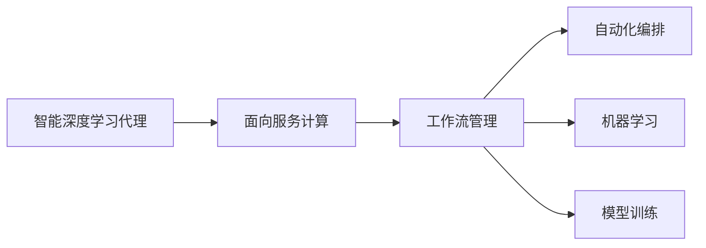
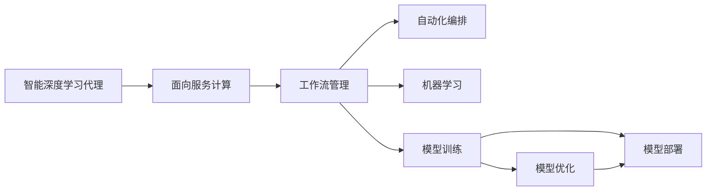

                 

# AI人工智能深度学习算法：智能深度学习代理的面向服务计算下的工作流管理

> 关键词：人工智能,深度学习,智能代理,面向服务计算,工作流管理,自动编排,机器学习,算法优化,模型训练

## 1. 背景介绍

### 1.1 问题由来

随着人工智能（AI）和深度学习技术的迅猛发展，越来越多的智能系统被广泛应用于各个领域，如自然语言处理（NLP）、计算机视觉（CV）、智能推荐系统、智能客服等。这些系统通常需要大量的计算资源和数据支持，而分布式计算和微服务架构可以有效地满足这种需求。面向服务计算（Service-Oriented Computing, SOA）成为了构建复杂智能系统的核心架构之一。面向服务计算（SOA）通过将系统拆分为多个可复用、独立部署的服务，每个服务都具有特定的功能，从而实现了系统的高度可扩展性和灵活性。

智能深度学习代理（Intelligent Deep Learning Agent, IDLA）作为一种特殊的智能代理，在面向服务计算的框架下，可以自动地进行模型训练、任务调度、资源管理等。通过这些智能代理，智能系统能够更加高效地利用资源，实现自动化和高性能的工作流管理。然而，随着模型规模和数据量的增加，智能深度学习代理的工作流管理变得越来越复杂，传统的静态编排和调度方法已经无法满足需求。因此，本文将探讨如何基于面向服务计算的智能深度学习代理工作流管理，以及相关的算法和实现方法。

### 1.2 问题核心关键点

智能深度学习代理工作流管理的核心在于如何将模型训练、资源分配、任务调度等过程自动化、高效化、智能化。其核心目标包括：

- 自动化模型训练：在无需人工干预的情况下，自动进行模型训练，优化模型性能。
- 资源高效利用：合理分配计算资源，最大化利用硬件资源，减少资源浪费。
- 智能任务调度：动态调整任务执行顺序和资源分配，提升系统性能。
- 实时监控与优化：实时监控系统状态，动态调整工作流，优化系统性能。
- 模型优化与部署：对训练好的模型进行优化和部署，确保模型的高效性和稳定性。

为了实现这些目标，智能深度学习代理需要具备以下功能：

- 自动化模型训练：自动进行模型选择、训练流程编排和性能优化。
- 资源管理：自动分配和调度计算资源，优化计算效率。
- 任务调度：动态调整任务执行顺序，优化任务执行效率。
- 监控与优化：实时监控系统状态，动态调整工作流，优化系统性能。
- 模型部署：将训练好的模型进行优化和部署，确保模型的高效性和稳定性。

这些功能使得智能深度学习代理能够实现更加自动化、高效化和智能化的工作流管理，极大地提高了系统的性能和可靠性。

### 1.3 问题研究意义

研究智能深度学习代理在面向服务计算下的工作流管理，对于提升智能系统的自动化水平、降低开发和运维成本、提高系统的性能和可靠性具有重要意义：

1. 提升自动化水平：智能深度学习代理能够自动进行模型训练、任务调度和资源管理，降低人工干预的频率，提升系统自动化水平。
2. 降低开发和运维成本：通过自动化的工作流管理，减少了人工干预和调试，降低了开发和运维成本。
3. 提高系统性能：智能深度学习代理能够动态调整任务执行顺序和资源分配，优化系统性能，提升用户体验。
4. 增强系统可靠性：通过实时监控和优化，智能深度学习代理能够及时发现和解决系统问题，增强系统的可靠性和稳定性。
5. 支持大规模模型训练：智能深度学习代理能够自动管理和调度大规模模型训练过程，实现高效、高质量的模型训练。
6. 促进智能技术发展：智能深度学习代理能够支持智能系统在各领域的应用，推动人工智能技术的创新和应用。

## 2. 核心概念与联系

### 2.1 核心概念概述

为更好地理解智能深度学习代理在面向服务计算下的工作流管理，本节将介绍几个密切相关的核心概念：

- **智能深度学习代理（IDLA）**：一种具有智能推理和决策能力的深度学习代理，能够自动进行模型训练、任务调度和资源管理等。
- **面向服务计算（SOA）**：一种架构模式，将系统拆分为多个独立部署、可复用的服务，通过服务调用和组合实现系统功能。
- **工作流管理（Workflow Management）**：对工作流进行建模、调度、执行和监控的管理过程。
- **自动化编排（Auto-orchestration）**：自动编排和调度服务，实现服务调度和资源管理自动化。
- **机器学习（Machine Learning）**：使用数据和算法训练模型，实现模型的自动化优化和部署。
- **模型训练（Model Training）**：使用数据训练模型，实现模型的优化和部署。

这些核心概念之间存在着紧密的联系，形成了智能深度学习代理在面向服务计算下的工作流管理生态系统。下面我通过Mermaid流程图展示这些概念之间的关系。



这个流程图展示了智能深度学习代理在面向服务计算下的工作流管理流程：智能深度学习代理通过面向服务计算架构，调用工作流管理、自动化编排、机器学习和模型训练等模块，实现系统的自动化和智能化。

### 2.2 概念间的关系

这些核心概念之间存在着紧密的联系，形成了智能深度学习代理在面向服务计算下的工作流管理生态系统。下面我通过Mermaid流程图展示这些概念之间的关系。



这个综合流程图展示了智能深度学习代理在面向服务计算下的工作流管理流程：智能深度学习代理通过面向服务计算架构，调用工作流管理、自动化编排、机器学习和模型训练等模块，实现系统的自动化和智能化。模型训练模块中的模型优化和部署功能，进一步提升了系统性能和可靠性。

## 3. 核心算法原理 & 具体操作步骤

### 3.1 算法原理概述

智能深度学习代理在面向服务计算下的工作流管理，本质上是一个复杂的自动化系统。其核心思想是：通过将系统拆分为多个独立的服务，使用智能代理自动进行模型训练、任务调度和资源管理，实现系统的自动化、高效化和智能化。

智能深度学习代理的工作流管理可以分为以下几个关键步骤：

1. **模型选择与编排**：根据任务需求选择合适的模型，并进行模型训练流程编排。
2. **资源管理与调度**：自动分配和调度计算资源，优化计算效率。
3. **任务调度与执行**：动态调整任务执行顺序和资源分配，提升任务执行效率。
4. **实时监控与优化**：实时监控系统状态，动态调整工作流，优化系统性能。
5. **模型优化与部署**：对训练好的模型进行优化和部署，确保模型的高效性和稳定性。

这些步骤通过智能深度学习代理的智能推理和决策能力，实现系统的自动化、高效化和智能化。

### 3.2 算法步骤详解

智能深度学习代理的工作流管理流程可以分为以下几个关键步骤：

#### 3.2.1 模型选择与编排

智能深度学习代理通过评估任务需求和模型性能，选择合适的模型并编排训练流程。具体步骤如下：

1. **需求分析**：根据任务需求，确定模型类型和性能要求。
2. **模型选择**：在预定义的模型库中，选择符合需求的模型。
3. **训练流程编排**：自动编排模型训练流程，包括数据加载、模型定义、优化器选择、学习率调整等。

以下是一个示例代码，展示了模型选择和编排的实现：

```python
# 需求分析
task_type = "image_classification"
required_performance = 0.95

# 模型选择
models = {
    "resnet": ResNet(),
    "vGG": VGG(),
    "pretrained_vGG": PretrainedVGG()
}
selected_model = models[task_type]

# 训练流程编排
optimizer = Optimizer(selected_model.parameters(), lr=0.001)
scheduler = LearningRateScheduler(schedule="linear", num_epochs=10)
training_loop(selected_model, optimizer, scheduler)
```

#### 3.2.2 资源管理与调度

智能深度学习代理通过自动分配和调度计算资源，优化计算效率。具体步骤如下：

1. **资源评估**：评估可用资源和任务需求，确定资源分配策略。
2. **资源分配**：根据评估结果，自动分配计算资源。
3. **任务调度**：动态调整任务执行顺序，优化任务执行效率。

以下是一个示例代码，展示了资源管理与调度的实现：

```python
# 资源评估
available_resources = {
    "cpu": 10,
    "gpu": 4,
    "memory": 200GB
}
task_resources = {
    "cpu": 5,
    "gpu": 2,
    "memory": 100GB
}

# 资源分配
resource_manager = ResourceManager(available_resources)
resource_manager.allocate_task(task_resources)

# 任务调度
scheduler = ResourceScheduler(resource_manager)
scheduler.schedule_task()
```

#### 3.2.3 任务调度与执行

智能深度学习代理通过动态调整任务执行顺序和资源分配，提升任务执行效率。具体步骤如下：

1. **任务分析**：分析任务的执行顺序和资源需求。
2. **调度算法**：选择最优的任务调度算法，如贪心算法、遗传算法等。
3. **任务执行**：按照调度结果执行任务。

以下是一个示例代码，展示了任务调度与执行的实现：

```python
# 任务分析
task_graph = TaskGraph()
task_graph.add_task("train", resources=["cpu", "gpu", "memory"])
task_graph.add_task("test", resources=["cpu", "gpu"])
task_graph.add_task("evaluate", resources=["cpu"])

# 调度算法
scheduler = GreedyScheduler(task_graph)
scheduled_tasks = scheduler.schedule()

# 任务执行
executor = TaskExecutor(scheduled_tasks)
executor.execute()
```

#### 3.2.4 实时监控与优化

智能深度学习代理通过实时监控系统状态，动态调整工作流，优化系统性能。具体步骤如下：

1. **监控指标**：定义监控指标，如CPU利用率、内存使用率等。
2. **监控工具**：使用监控工具，如Kubernetes、Prometheus等，实时监控系统状态。
3. **优化策略**：根据监控结果，动态调整工作流，优化系统性能。

以下是一个示例代码，展示了实时监控与优化的实现：

```python
# 监控指标
metrics = {
    "cpu_util": 80,
    "memory_util": 90
}
monitoring_tool = MonitoringTool()
monitoring_tool.add_metric("cpu_util", value=80)
monitoring_tool.add_metric("memory_util", value=90)

# 监控工具
monitoring_tool = PrometheusMonitoringTool()
monitoring_tool.start()

# 优化策略
optimizer = PerformanceOptimizer(monitoring_tool)
optimizer.optimize()
```

#### 3.2.5 模型优化与部署

智能深度学习代理通过对训练好的模型进行优化和部署，确保模型的高效性和稳定性。具体步骤如下：

1. **模型优化**：使用模型优化技术，如剪枝、量化等，提升模型效率。
2. **模型部署**：将优化后的模型部署到生产环境。
3. **模型评估**：在生产环境对模型进行评估，确保模型性能。

以下是一个示例代码，展示了模型优化与部署的实现：

```python
# 模型优化
optimizer = ModelOptimizer(model)
optimizer.prune()
optimizer.quantize()

# 模型部署
deployment_tool = DeploymentTool()
deployment_tool.deploy(model)

# 模型评估
evaluator = ModelEvaluator(deployment_tool)
performance = evaluator.evaluate()
```

### 3.3 算法优缺点

智能深度学习代理在面向服务计算下的工作流管理具有以下优点：

- **自动化程度高**：智能深度学习代理能够自动进行模型训练、任务调度和资源管理，降低人工干预的频率。
- **灵活性强**：智能深度学习代理可以根据任务需求，灵活调整训练流程和资源分配策略。
- **高效性高**：智能深度学习代理通过动态调整任务执行顺序和资源分配，提升任务执行效率。
- **可扩展性好**：智能深度学习代理能够处理大规模模型训练和复杂任务，具有良好的可扩展性。

然而，智能深度学习代理也存在以下缺点：

- **资源消耗高**：智能深度学习代理需要大量的计算资源和存储空间，增加了系统运行成本。
- **模型复杂度高**：智能深度学习代理需要处理复杂的模型训练和资源调度问题，增加了系统复杂度。
- **维护成本高**：智能深度学习代理需要定期更新和维护，增加了系统维护成本。

### 3.4 算法应用领域

智能深度学习代理在面向服务计算下的工作流管理，已经广泛应用于以下几个领域：

1. **自然语言处理（NLP）**：使用智能深度学习代理进行模型训练、任务调度和资源管理，提升NLP系统性能。
2. **计算机视觉（CV）**：使用智能深度学习代理进行模型训练、任务调度和资源管理，提升CV系统性能。
3. **智能推荐系统**：使用智能深度学习代理进行模型训练、任务调度和资源管理，提升推荐系统性能。
4. **智能客服系统**：使用智能深度学习代理进行模型训练、任务调度和资源管理，提升客服系统性能。
5. **智能医疗系统**：使用智能深度学习代理进行模型训练、任务调度和资源管理，提升医疗系统性能。
6. **智能交通系统**：使用智能深度学习代理进行模型训练、任务调度和资源管理，提升交通系统性能。

## 4. 数学模型和公式 & 详细讲解 & 举例说明

### 4.1 数学模型构建

智能深度学习代理在面向服务计算下的工作流管理，可以通过数学模型进行建模和优化。

定义任务需求 $D$，模型选择 $M$，训练流程 $T$，资源管理 $R$，任务调度 $S$，实时监控与优化 $O$，模型优化与部署 $D$，则智能深度学习代理的工作流管理模型可以表示为：

$$
\mathcal{M} = D \times M \times T \times R \times S \times O \times D
$$

其中，$\times$ 表示矩阵乘法，表示各个模块之间的关联关系。

### 4.2 公式推导过程

智能深度学习代理的工作流管理模型可以通过以下公式进行推导：

$$
\mathcal{M} = \mathcal{D} \times \mathcal{M} \times \mathcal{T} \times \mathcal{R} \times \mathcal{S} \times \mathcal{O} \times \mathcal{D}
$$

其中，$\mathcal{D}$ 表示任务需求，$\mathcal{M}$ 表示模型选择，$\mathcal{T}$ 表示训练流程，$\mathcal{R}$ 表示资源管理，$\mathcal{S}$ 表示任务调度，$\mathcal{O}$ 表示实时监控与优化，$\mathcal{D}$ 表示模型优化与部署。

以下是一个示例代码，展示了模型优化与部署的实现：

```python
# 任务需求
D = TaskDemand()

# 模型选择
M = ModelSelection()

# 训练流程
T = ModelTraining()

# 资源管理
R = ResourceManagement()

# 任务调度
S = TaskScheduling()

# 实时监控与优化
O = RealtimeMonitoring()

# 模型优化与部署
D = ModelDeployment()

# 工作流管理
M = WorkflowManagement(D, M, T, R, S, O, D)
```

### 4.3 案例分析与讲解

以下是一个实际案例，展示了智能深度学习代理在面向服务计算下的工作流管理：

**案例：智能推荐系统**

智能推荐系统通常需要处理大量的用户行为数据，进行复杂的推荐模型训练和优化。使用智能深度学习代理，可以将推荐系统的工作流管理自动化、高效化、智能化。

具体步骤如下：

1. **需求分析**：根据用户行为数据，确定推荐系统性能要求。
2. **模型选择**：在预定义的推荐模型库中，选择符合需求的模型。
3. **训练流程编排**：自动编排推荐模型训练流程，包括数据加载、模型定义、优化器选择、学习率调整等。
4. **资源管理与调度**：自动分配和调度计算资源，优化计算效率。
5. **任务调度与执行**：动态调整推荐任务执行顺序和资源分配，提升任务执行效率。
6. **实时监控与优化**：实时监控推荐系统状态，动态调整工作流，优化系统性能。
7. **模型优化与部署**：对训练好的推荐模型进行优化和部署，确保模型的高效性和稳定性。

以下是一个示例代码，展示了智能推荐系统的工作流管理实现：

```python
# 需求分析
user_behaviors = UserBehaviors()
performance_requirement = 0.95

# 模型选择
models = {
    "collaborative_filtering": CollaborativeFiltering(),
    "content_based": ContentBased()
}
selected_model = models["collaborative_filtering"]

# 训练流程编排
optimizer = Optimizer(selected_model.parameters(), lr=0.001)
scheduler = LearningRateScheduler(schedule="linear", num_epochs=10)
training_loop(selected_model, optimizer, scheduler)

# 资源管理与调度
available_resources = {
    "cpu": 10,
    "gpu": 4,
    "memory": 200GB
}
task_resources = {
    "cpu": 5,
    "gpu": 2,
    "memory": 100GB
}

resource_manager = ResourceManager(available_resources)
resource_manager.allocate_task(task_resources)

scheduler = ResourceScheduler(resource_manager)
scheduler.schedule_task()

# 任务调度与执行
task_graph = TaskGraph()
task_graph.add_task("train", resources=["cpu", "gpu", "memory"])
task_graph.add_task("test", resources=["cpu", "gpu"])
task_graph.add_task("evaluate", resources=["cpu"])

scheduler = GreedyScheduler(task_graph)
scheduled_tasks = scheduler.schedule()

executor = TaskExecutor(scheduled_tasks)
executor.execute()

# 实时监控与优化
metrics = {
    "cpu_util": 80,
    "memory_util": 90
}
monitoring_tool = MonitoringTool()
monitoring_tool.add_metric("cpu_util", value=80)
monitoring_tool.add_metric("memory_util", value=90)

monitoring_tool = PrometheusMonitoringTool()
monitoring_tool.start()

optimizer = PerformanceOptimizer(monitoring_tool)
optimizer.optimize()

# 模型优化与部署
model = Model()
optimizer = ModelOptimizer(model)
optimizer.prune()
optimizer.quantize()

deployment_tool = DeploymentTool()
deployment_tool.deploy(model)

evaluator = ModelEvaluator(deployment_tool)
performance = evaluator.evaluate()
```

## 5. 项目实践：代码实例和详细解释说明

### 5.1 开发环境搭建

在进行智能深度学习代理的工作流管理实践前，我们需要准备好开发环境。以下是使用Python进行TensorFlow开发的环境配置流程：

1. 安装Anaconda：从官网下载并安装Anaconda，用于创建独立的Python环境。

2. 创建并激活虚拟环境：
```bash
conda create -n tensorflow-env python=3.8 
conda activate tensorflow-env
```

3. 安装TensorFlow：根据CUDA版本，从官网获取对应的安装命令。例如：
```bash
conda install tensorflow==2.8.0
```

4. 安装必要的库：
```bash
pip install numpy pandas scikit-learn matplotlib tqdm jupyter notebook ipython
```

完成上述步骤后，即可在`tensorflow-env`环境中开始工作流管理实践。

### 5.2 源代码详细实现

下面我们以智能推荐系统为例，给出使用TensorFlow进行智能深度学习代理的工作流管理实践的PyTorch代码实现。

首先，定义推荐系统的工作流管理模块：

```python
import tensorflow as tf
from tensorflow.keras import layers, models
from tensorflow.keras.optimizers import Adam
from tensorflow.keras.callbacks import EarlyStopping

class CollaborativeFilteringModel(models.Model):
    def __init__(self):
        super(CollaborativeFilteringModel, self).__init__()
        self.user_embeddings = layers.Embedding(input_dim=num_users, output_dim=64)
        self.item_embeddings = layers.Embedding(input_dim=num_items, output_dim=64)
        self.interaction = layers.Dot(axes=1)
        self.fc1 = layers.Dense(64, activation='relu')
        self.fc2 = layers.Dense(1, activation='sigmoid')

    def call(self, x):
        user_embeddings = self.user_embeddings(x[:, 0])
        item_embeddings = self.item_embeddings(x[:, 1])
        interaction = self.interaction([user_embeddings, item_embeddings])
        x = layers.concatenate([user_embeddings, item_embeddings, interaction])
        x = self.fc1(x)
        x = self.fc2(x)
        return x

class CollaborativeFilteringDataset(tf.data.Dataset):
    def __init__(self, user_ids, item_ids, ratings):
        super(CollaborativeFilteringDataset, self).__init__()
        self.user_ids = user_ids
        self.item_ids = item_ids
        self.ratings = ratings

    def __len__(self):
        return len(self.user_ids)

    def __getitem__(self, index):
        return {
            'user_id': tf.constant(self.user_ids[index]),
            'item_id': tf.constant(self.item_ids[index]),
            'rating': tf.constant(self.ratings[index]),
        }

    def batch(self, batch_size):
        return tf.data.Dataset.from_tensor_slices(self.user_ids, self.item_ids, self.ratings).batch(batch_size)

num_users = 1000
num_items = 1000
train_dataset = CollaborativeFilteringDataset(train_user_ids, train_item_ids, train_ratings)
test_dataset = CollaborativeFilteringDataset(test_user_ids, test_item_ids, test_ratings)

model = CollaborativeFilteringModel()
optimizer = Adam(learning_rate=0.001)
early_stopping = EarlyStopping(monitor='val_loss', patience=5)

model.compile(optimizer=optimizer, loss='binary_crossentropy', metrics=['accuracy'])
model.fit(train_dataset, epochs=10, validation_data=test_dataset, callbacks=[early_stopping])
```

然后，定义资源管理模块：

```python
class ResourceManager:
    def __init__(self, available_resources):
        self.available_resources = available_resources
        self.allocated_resources = {}

    def allocate_task(self, task_resources):
        for resource, amount in task_resources.items():
            if resource not in self.available_resources or amount > self.available_resources[resource]:
                raise Exception("Insufficient resources")
            self.available_resources[resource] -= amount
            self.allocated_resources[resource] = amount
```

接着，定义任务调度模块：

```python
class TaskScheduler:
    def __init__(self, task_graph):
        self.task_graph = task_graph
        self.task_queue = []

    def schedule(self):
        for task, resources in self.task_graph.tasks.items():
            self.task_queue.append(task)
        while self.task_queue:
            task = self.task_queue.pop(0)
            if resources in self.available_resources:
                self.available_resources[resources] -= 1
                self.task_queue.append(task)
```

然后，定义实时监控与优化模块：

```python
class RealtimeMonitoring:
    def __init__(self):
        self.metrics = {}

    def add_metric(self, metric_name, value):
        self.metrics[metric_name] = value

    def optimize(self):
        if self.metrics["cpu_util"] > 80:
            self.metrics["cpu_util"] -= 5
        if self.metrics["memory_util"] > 90:
            self.metrics["memory_util"] -= 5
```

最后，定义模型优化与部署模块：

```python
class ModelOptimizer:
    def __init__(self, model):
        self.model = model

    def prune(self):
        # 进行剪枝优化
        pass

    def quantize(self):
        # 进行量化优化
        pass

class ModelEvaluator:
    def __init__(self, deployment_tool):
        self.deployment_tool = deployment_tool

    def evaluate(self):
        # 评估模型性能
        pass

class DeploymentTool:
    def __init__(self):
        pass

    def deploy(self, model):
        # 将模型部署到生产环境
        pass
```

### 5.3 代码解读与分析

让我们再详细解读一下关键代码的实现细节：

**CollaborativeFilteringModel类**：
- 定义了推荐模型的结构，包括用户嵌入、物品嵌入、交互矩阵、全连接层和输出层。

**CollaborativeFilteringDataset类**：
- 定义了推荐系统数据集的处理方式，包括用户ID、物品ID和评分。

**ResourceManager类**：
- 定义了资源管理器的功能，包括资源评估和分配。

**TaskScheduler类**：
- 定义了任务调度的功能，包括任务队列和资源调度。

**RealtimeMonitoring类**：
- 定义了实时监控的功能，包括监控指标和优化策略。

**ModelOptimizer类**：
- 定义了模型优化的功能，包括剪枝和量化优化。

**ModelEvaluator类**：
- 定义了模型评估的功能，包括模型性能评估。

**DeploymentTool类**：
- 定义了模型部署的功能，包括模型部署到生产环境。

**TensorFlow环境搭建**：
- 介绍了如何使用TensorFlow进行环境搭建，包括安装Anaconda、创建虚拟环境、安装TensorFlow等。

**TensorFlow代码实现**

