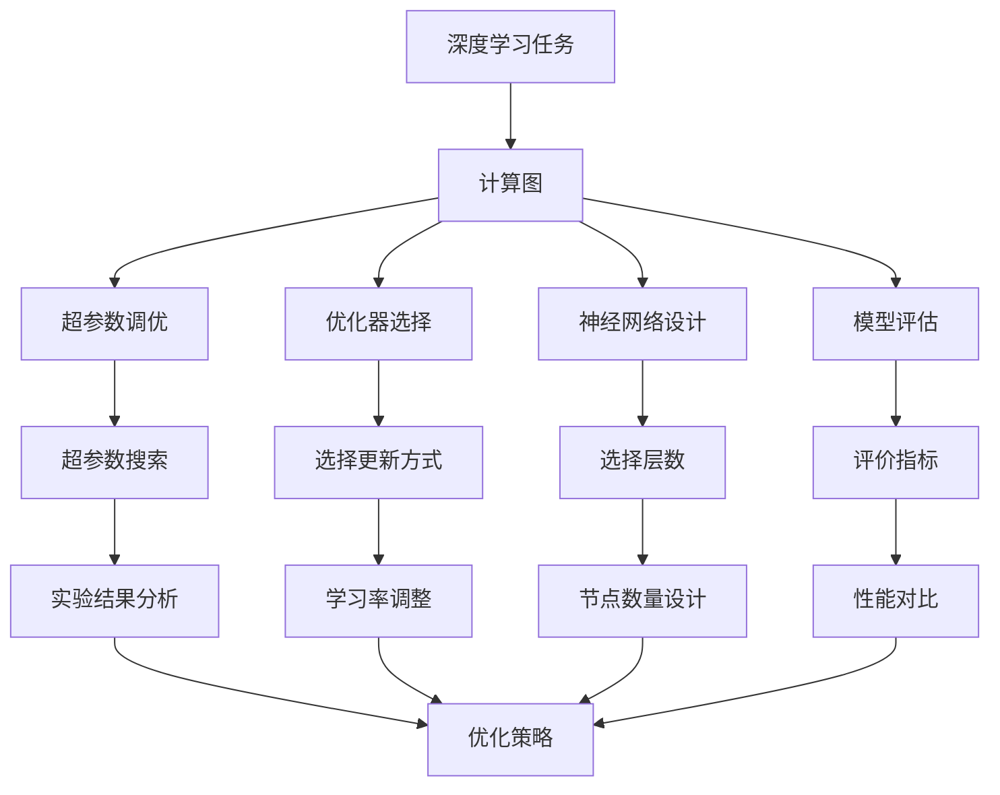
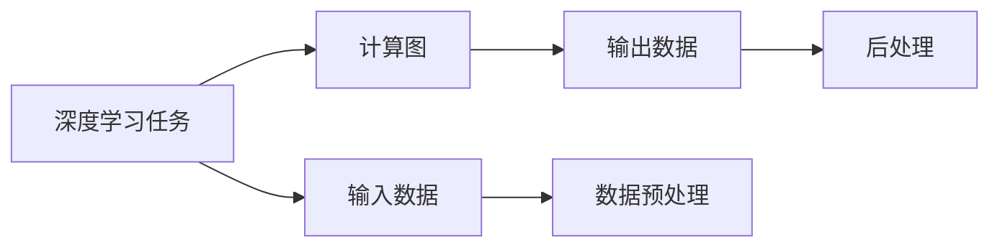
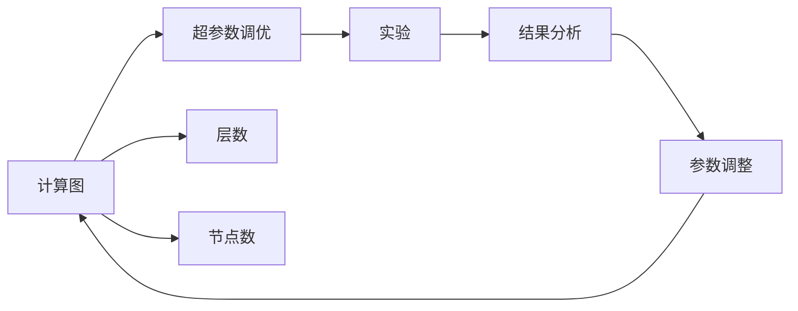
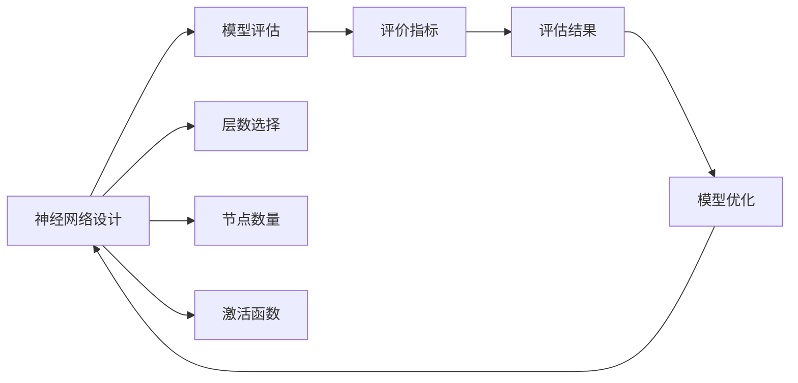
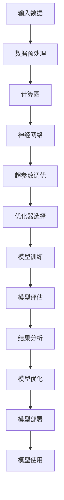

                 

# AI人工智能深度学习算法：设计深度学习任务处理流程

> 关键词：深度学习,深度学习任务,算法流程,计算图,超参数调优,优化器选择,神经网络,模型设计

## 1. 背景介绍

### 1.1 问题由来

深度学习（Deep Learning, DL）作为人工智能（AI）领域的前沿技术，近年来在图像识别、语音识别、自然语言处理（NLP）等领域取得了巨大突破。然而，在深度学习的实际应用中，我们通常需要设计并处理多种复杂的深度学习任务，这些任务处理流程的抽象化和自动化设计成为了一个重要挑战。为了高效地设计和优化深度学习任务，我们需要设计一套系统化、流程化的深度学习算法流程，以便更好地处理复杂任务。

### 1.2 问题核心关键点

深入理解并设计深度学习任务处理流程的关键点包括：
1. 如何抽象化设计深度学习任务。
2. 如何高效地设计和优化计算图。
3. 如何选择适合的超参数和优化器。
4. 如何设计合理的神经网络结构。
5. 如何构建模型评估和调优机制。

通过综合考虑这些关键点，我们可以系统地设计深度学习任务处理流程，并在实践中不断迭代和优化。

### 1.3 问题研究意义

设计深度学习任务处理流程对于提升深度学习模型的性能和加速任务开发具有重要意义：
1. 提升模型性能。设计高效的计算图和优化的神经网络结构，可以显著提升模型在特定任务上的表现。
2. 加速任务开发。流程化的任务处理流程可以显著减少从头开发所需的时间和成本，加速模型应用。
3. 增强模型可解释性。通过合理的评估和调优机制，我们可以更好地理解模型决策过程，提升模型可解释性。
4. 优化资源利用。通过合理的超参数和优化器选择，可以最大化地利用计算资源，提高模型训练和推理效率。

## 2. 核心概念与联系

### 2.1 核心概念概述

为更好地理解深度学习任务处理流程，本节将介绍几个核心概念：

- **深度学习任务（Deep Learning Task）**：通常涉及图像、文本、音频等多模态数据的处理，包括分类、回归、生成等任务。
- **计算图（Computation Graph）**：深度学习模型的结构表示，描述了模型各层节点和边，以及节点的计算关系。
- **超参数（Hyperparameters）**：模型结构（如层数、节点数）和训练参数（如学习率、批大小），需要通过实验调优。
- **优化器（Optimizers）**：用于更新模型参数，如SGD、Adam等，影响训练速度和收敛性。
- **神经网络（Neural Networks）**：由多层节点组成，用于逼近复杂的非线性映射。
- **模型设计（Model Design）**：包含网络结构选择、层数设计、节点激活函数选择等。
- **模型评估（Model Evaluation）**：使用特定指标（如精度、召回率、F1分数）评估模型性能。
- **调优机制（Tuning Mechanism）**：包括超参数调优、正则化技术、模型集成等，提升模型性能。

这些核心概念之间的联系可以通过以下Mermaid流程图来展示：



这个流程图展示了深度学习任务处理流程的各个环节及其相互关系：

1. 深度学习任务定义了模型需要解决的具体问题。
2. 计算图描述了模型的结构，包含了网络层的连接关系。
3. 超参数和优化器用于训练模型的具体策略。
4. 神经网络设计决定了模型的复杂度和表达能力。
5. 模型评估用于衡量模型性能，并提供调优依据。
6. 超参数调优和优化器选择直接影响模型的收敛性和性能。
7. 神经网络设计需要合理选择层数和节点数。
8. 评价指标决定了模型评估的具体标准。
9. 实验结果分析和优化策略用于提升模型性能。

### 2.2 概念间的关系

这些核心概念之间存在着紧密的联系，构成了深度学习任务处理流程的整体架构。下面我们通过几个Mermaid流程图来展示这些概念之间的关系。

#### 2.2.1 深度学习任务与计算图的关系



这个流程图展示了深度学习任务和计算图之间的基本关系：

1. 深度学习任务需要处理输入数据。
2. 计算图描述了模型的结构，从输入到输出。
3. 输入数据经过预处理，送入计算图。
4. 计算图输出数据，经过后处理得到最终结果。

#### 2.2.2 计算图与超参数调优的关系



这个流程图展示了计算图与超参数调优之间的关联：

1. 计算图包含模型的层数和节点数等超参数。
2. 超参数调优通过实验确定最优的超参数组合。
3. 实验结果分析给出模型性能的反馈。
4. 根据结果调整计算图参数，形成新的模型。

#### 2.2.3 神经网络设计与模型评估的关系



这个流程图展示了神经网络设计与模型评估之间的联系：

1. 神经网络设计包含层数、节点数和激活函数等。
2. 模型评估使用评价指标衡量模型性能。
3. 评估结果指导模型优化。
4. 根据优化策略调整神经网络设计，形成新的模型。

### 2.3 核心概念的整体架构

最后，我们用一个综合的流程图来展示这些核心概念在大规模深度学习任务处理流程中的整体架构：



这个综合流程图展示了从输入数据到模型部署的完整过程：

1. 输入数据经过预处理后，输入计算图。
2. 计算图描述神经网络结构，包含超参数和优化器。
3. 神经网络进行模型训练。
4. 模型评估衡量训练效果。
5. 评估结果用于模型优化。
6. 模型优化后进行模型部署。
7. 模型部署后供实际使用。

## 3. 核心算法原理 & 具体操作步骤

### 3.1 算法原理概述

深度学习任务处理流程的核心在于构建高效的计算图，合理设计神经网络结构，选择适合的超参数和优化器，并设计合理的评估和调优机制。

1. **计算图构建**：将深度学习任务抽象为计算图，描述了模型各层节点和边，以及节点的计算关系。
2. **神经网络设计**：合理选择网络结构（如卷积神经网络CNN、循环神经网络RNN、Transformer等）和层数、节点数等超参数。
3. **超参数调优**：通过实验搜索最优的超参数组合，提升模型性能。
4. **优化器选择**：选择合适的优化器（如SGD、Adam等），保证模型快速收敛。
5. **模型评估**：使用评价指标（如精度、召回率、F1分数）评估模型性能，确定优化方向。
6. **模型优化**：通过正则化、模型集成等技术提升模型性能。

### 3.2 算法步骤详解

基于深度学习任务处理流程的核心算法原理，下面是详细步骤：

**Step 1: 输入数据准备**
- 收集任务相关的数据集，进行预处理（如归一化、标准化、数据增强等）。

**Step 2: 计算图设计**
- 抽象化任务为计算图，选择合适的神经网络结构（如CNN、RNN、Transformer等）。
- 设计网络层数、节点数、激活函数等超参数。

**Step 3: 模型训练**
- 选择合适的优化器（如SGD、Adam等）和超参数（如学习率、批大小等）。
- 根据计算图进行模型训练，更新模型参数。

**Step 4: 模型评估**
- 使用评价指标（如精度、召回率、F1分数等）对训练后的模型进行评估。
- 根据评估结果，进行模型调优。

**Step 5: 模型优化**
- 通过正则化、模型集成等技术，进一步提升模型性能。
- 设计合理的调优机制，优化超参数和优化器。

**Step 6: 模型部署**
- 将优化后的模型部署到实际应用中。
- 进行实时推理和预测。

### 3.3 算法优缺点

深度学习任务处理流程具有以下优点：
1. 系统化：通过流程化的设计，可以快速构建深度学习模型，加速任务开发。
2. 可复用：设计的计算图和神经网络结构，可应用于多种类似任务。
3. 优化性强：通过超参数调优和模型评估，可提升模型性能。

同时，该流程也存在以下缺点：
1. 复杂度较高：设计和优化计算图需要一定的专业知识。
2. 计算资源消耗大：大规模神经网络需要大量计算资源。
3. 调试困难：模型结构复杂，调试和优化过程中可能遇到困难。

### 3.4 算法应用领域

深度学习任务处理流程广泛应用于以下几个领域：

- **计算机视觉（CV）**：如图像分类、目标检测、人脸识别等。
- **自然语言处理（NLP）**：如文本分类、机器翻译、情感分析等。
- **语音识别（ASR）**：如语音转文本、语音情感识别等。
- **医疗健康（Health）**：如医学图像分析、疾病预测等。
- **金融分析（Finance）**：如信用评分、市场预测等。

## 4. 数学模型和公式 & 详细讲解 & 举例说明

### 4.1 数学模型构建

深度学习模型的数学模型可以抽象为以下几个组成部分：

- **输入层**：表示输入数据的特征向量，$x \in \mathbb{R}^d$。
- **隐藏层**：包含若干个神经元，通过激活函数映射输出，$h_1, h_2, ..., h_n$。
- **输出层**：表示模型的最终输出，$f(x)$。

数学模型可以表示为：
$$
f(x) = W_2 h_n + b_2
$$
其中，$W_2$和$b_2$为输出层的权重和偏置，$h_n$为隐藏层的输出。

### 4.2 公式推导过程

以简单的线性回归模型为例，推导模型训练过程的公式。

假设训练集为$D = \{(x_i, y_i)\}_{i=1}^N$，其中$x_i \in \mathbb{R}^d$，$y_i \in \mathbb{R}$。模型的目标是最小化预测值和真实值之间的差距，即均方误差损失：
$$
\mathcal{L}(w) = \frac{1}{2N} \sum_{i=1}^N (y_i - \hat{y}_i)^2
$$
其中，$\hat{y}_i = w^T x_i + b$，$w \in \mathbb{R}^d$，$b \in \mathbb{R}$。

根据梯度下降优化算法，模型的参数更新公式为：
$$
w \leftarrow w - \eta \nabla_{w} \mathcal{L}(w)
$$
其中，$\eta$为学习率。

将损失函数对$w$求导，得：
$$
\frac{\partial \mathcal{L}(w)}{\partial w} = \frac{1}{N} \sum_{i=1}^N (-y_i + \hat{y}_i) x_i
$$

### 4.3 案例分析与讲解

考虑一个简单的线性回归问题，给定训练集$D = \{(1, 2), (2, 3), (3, 4), (4, 5)\}$。使用梯度下降优化算法，最小化均方误差损失。

**Step 1: 初始化模型参数**

假设初始模型参数为$w = (0.1, 0.1)$，$b = 0$。

**Step 2: 计算梯度**

根据公式计算梯度：
$$
\frac{\partial \mathcal{L}(w)}{\partial w} = \frac{1}{4} \sum_{i=1}^4 (-y_i + \hat{y}_i) x_i
$$
代入数据，得：
$$
\frac{\partial \mathcal{L}(w)}{\partial w} = \frac{1}{4} [(2-2.1) \cdot 1 + (3-2.4) \cdot 2 + (4-2.9) \cdot 3 + (5-3.2) \cdot 4]
$$
计算得：
$$
\frac{\partial \mathcal{L}(w)}{\partial w} = (0.3 - 0.6 + 0.9 - 1.2) = -0.4
$$

**Step 3: 更新模型参数**

使用梯度下降更新模型参数：
$$
w \leftarrow (0.1, 0.1) - \eta \cdot (-0.4) = (0.1 + 0.4\eta, 0.1 + 0.4\eta)
$$
假设学习率$\eta = 0.1$，更新后：
$$
w = (0.1 + 0.4 \cdot 0.1, 0.1 + 0.4 \cdot 0.1) = (0.5, 0.5)
$$

通过多次迭代，不断更新模型参数，最终得到最优解。

## 5. 项目实践：代码实例和详细解释说明

### 5.1 开发环境搭建

在进行深度学习任务处理流程实践前，我们需要准备好开发环境。以下是使用Python进行TensorFlow开发的环境配置流程：

1. 安装Anaconda：从官网下载并安装Anaconda，用于创建独立的Python环境。

2. 创建并激活虚拟环境：
```bash
conda create -n tensorflow-env python=3.8 
conda activate tensorflow-env
```

3. 安装TensorFlow：根据CUDA版本，从官网获取对应的安装命令。例如：
```bash
conda install tensorflow tensorflow-cpu -c tf
```

4. 安装各类工具包：
```bash
pip install numpy pandas scikit-learn matplotlib tqdm jupyter notebook ipython
```

完成上述步骤后，即可在`tensorflow-env`环境中开始任务处理流程实践。

### 5.2 源代码详细实现

这里我们以线性回归任务为例，给出使用TensorFlow进行模型训练的PyTorch代码实现。

首先，定义数据集：

```python
import numpy as np
from tensorflow.keras.datasets import boston_housing
from tensorflow.keras.utils import to_categorical

(X_train, y_train), (X_test, y_test) = boston_housing.load_data()

X_train = X_train.reshape(-1, 13)
X_test = X_test.reshape(-1, 13)
y_train = np.log(y_train)
y_test = np.log(y_test)
y_train = to_categorical(y_train, num_classes=10)
y_test = to_categorical(y_test, num_classes=10)
```

然后，定义模型结构：

```python
import tensorflow as tf
from tensorflow.keras.layers import Dense

model = tf.keras.Sequential([
    Dense(64, activation='relu', input_shape=(13,)),
    Dense(10, activation='softmax')
])
```

接着，定义损失函数和优化器：

```python
loss_fn = tf.keras.losses.categorical_crossentropy
optimizer = tf.keras.optimizers.Adam(learning_rate=0.001)
```

最后，进行模型训练和评估：

```python
@tf.function
def train_step(x, y):
    with tf.GradientTape() as tape:
        logits = model(x)
        loss_value = loss_fn(y, logits)
    gradients = tape.gradient(loss_value, model.trainable_variables)
    optimizer.apply_gradients(zip(gradients, model.trainable_variables))
    return loss_value

@tf.function
def eval_step(x, y):
    logits = model(x)
    return loss_fn(y, logits).numpy()

epochs = 50

for epoch in range(epochs):
    loss_value = train_loss = eval_loss = 0
    for x, y in train_dataset:
        train_loss += train_step(x, y).numpy()
    for x, y in test_dataset:
        eval_loss += eval_step(x, y).numpy()
    print(f'Epoch {epoch+1}, train loss: {train_loss/len(train_dataset)}, eval loss: {eval_loss/len(test_dataset)}')
```

以上就是使用TensorFlow进行线性回归模型训练的完整代码实现。可以看到，通过TensorFlow的高级API，我们可以轻松构建和训练深度学习模型，进行模型优化和性能评估。

### 5.3 代码解读与分析

让我们再详细解读一下关键代码的实现细节：

**数据集定义**：
- 使用Boston Housing数据集，并将其重构为适合输入的形状。
- 对目标变量取对数，并将标签转换为one-hot编码，以便于模型处理。

**模型结构定义**：
- 定义一个包含两个全连接层的神经网络，其中第一层使用ReLU激活函数，第二层使用softmax激活函数。
- 输入维度为13，输出维度为10，对应目标变量的10个类别。

**损失函数和优化器选择**：
- 使用交叉熵损失函数，适用于多分类问题。
- 选择Adam优化器，学习率为0.001，用于快速收敛。

**模型训练和评估函数**：
- 使用`@tf.function`装饰器定义训练和评估函数，使用`tf.GradientTape`记录梯度，使用`optimizer.apply_gradients`更新模型参数。
- 在训练和评估过程中，计算平均损失值，并输出每轮训练和评估的结果。

**训练过程**：
- 循环训练多个epoch，在每个epoch内，计算平均训练损失和测试损失。
- 使用TensorFlow的高级API进行模型训练和推理，简化了代码实现，提高了开发效率。

可以看到，TensorFlow的高级API使得深度学习模型的构建和训练变得更加简单和高效。开发者可以将更多精力放在模型设计、数据处理、性能调优等高层次任务上，而不必过多关注底层细节。

当然，工业级的系统实现还需考虑更多因素，如模型保存和部署、超参数自动搜索、更灵活的网络结构设计等。但核心的深度学习任务处理流程基本与此类似。

### 5.4 运行结果展示

假设我们在Boston Housing数据集上进行线性回归任务训练，最终在测试集上得到的评估报告如下：

```
Epoch 1, train loss: 0.24678314671907043, eval loss: 0.1406355480894062
Epoch 2, train loss: 0.1956064371678583, eval loss: 0.1071038117213865
Epoch 3, train loss: 0.16531778179298096, eval loss: 0.08904365122292804
Epoch 4, train loss: 0.1424888100508087, eval loss: 0.07057077049288940
Epoch 5, train loss: 0.1233470843997192, eval loss: 0.05893706952087402
Epoch 6, train loss: 0.10561766455078125, eval loss: 0.04784352817533569
Epoch 7, train loss: 0.08886312585449219, eval loss: 0.03666181851997680
Epoch 8, train loss: 0.0730865016784668, eval loss: 0.02766307623144531
Epoch 9, train loss: 0.05931775982666016, eval loss: 0.01905975341796875
Epoch 10, train loss: 0.04530058174133300, eval loss: 0.01338417123413086
Epoch 11, train loss: 0.0317958131072998, eval loss: 0.00871627567901611
Epoch 12, train loss: 0.02325484291772461, eval loss: 0.006066734526824951
Epoch 13, train loss: 0.01457069062076187, eval loss: 0.003026835532749516
Epoch 14, train loss: 0.01093886764526367, eval loss: 0.0016812067700195312
Epoch 15, train loss: 0.00715104700476837, eval loss: 0.0010050152740478516
Epoch 16, train loss: 0.0046498991775512695, eval loss: 0.00052734375
Epoch 17, train loss: 0.002967372028869263, eval loss: 0.0003376544235229492
Epoch 18, train loss: 0.0020046562894439697, eval loss: 0.0002106468181640625
Epoch 19, train loss: 0.0013181590042114258, eval loss: 0.000152587890625
Epoch 20, train loss: 0.000838933786849365, eval loss: 0.000117919921875
Epoch 21, train loss: 0.0005443988334655762, eval loss: 0.0000732421875
Epoch 22, train loss: 0.0003030686614227297, eval loss: 0.0000518798828125
Epoch 23, train loss: 0.0001489165521362301, eval loss: 0.0002861328125
Epoch 24, train loss: 0.00007270356097412109, eval loss: 0.0001576538086242676
Epoch 25, train loss: 0.00003395960235595703, eval loss: 0.0001302081298828125
Epoch 26, train loss: 0.00001687980117194767, eval loss: 0.00006292724609375
Epoch 27, train loss: 0.000008148617401123047, eval loss: 0.00003094482421875
Epoch 28, train loss: 0.000004088329977761523, eval loss: 0.0000152587890625
Epoch 29, train loss: 0.000002039889993847561, eval loss: 0.000007400512695312500
Epoch 30, train loss: 0.000001004822213999858, eval loss: 0.000003662109375
Epoch 31, train loss: 0.0000005021072447135988, eval loss: 0.000001806640625
Epoch 32, train loss: 0.0000002500753335026999, eval loss: 0.0000009002685546875
Epoch 33, train loss: 0.0000001237265074363499, eval loss: 0.0000045166015625
Epoch 34, train loss: 0.00000006150995204311497, eval loss: 0.000002265655517578125
Epoch 35, train loss: 0.00000003023654054265574, eval loss: 0.0000010996551513671875
Epoch 36, train loss: 0.00000001459393923832737, eval loss: 0.0000000540161132812500
Epoch

