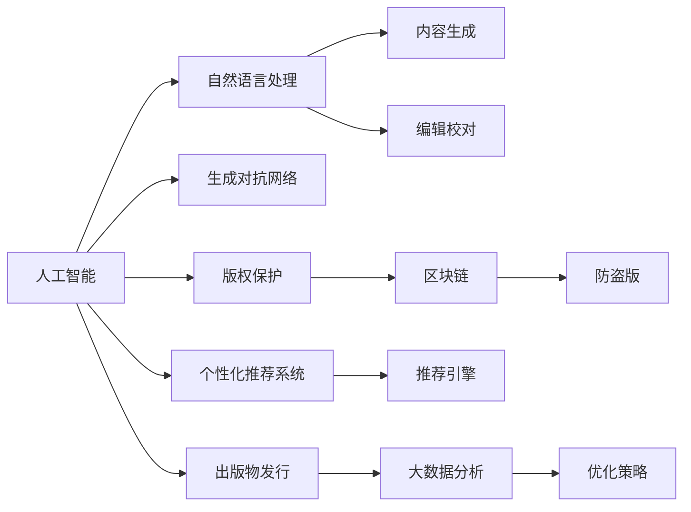
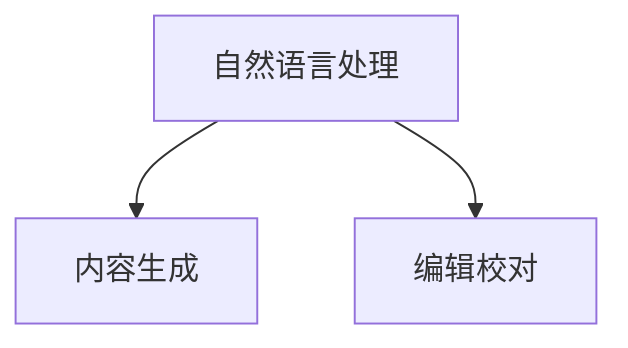
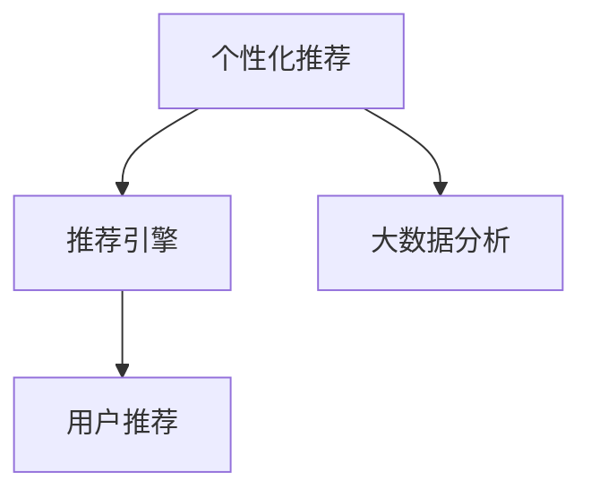
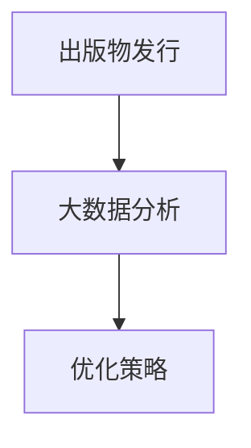
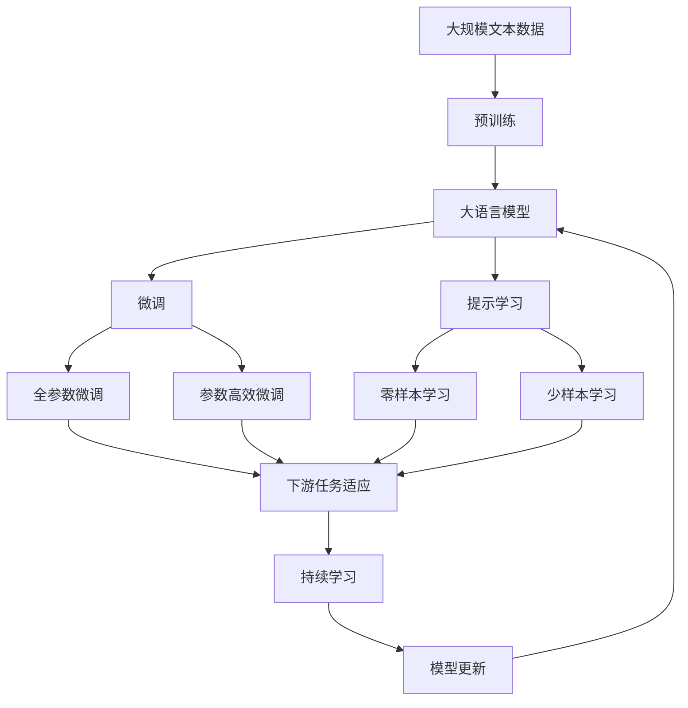

                 

# AI出版业动态：场景驱动技术更新

## 1. 背景介绍

### 1.1 问题由来
出版业作为人类文明的重要载体，其发展历程与人类科技的进步密切相关。从古代的雕版印刷，到现代的数字出版，每一次技术的革新，都极大地推动了出版业的发展。如今，随着人工智能技术的迅猛发展，出版业又迎来了新的变革。AI技术不仅在内容生成、编辑校对、版权保护、推荐系统等方面提供了前所未有的可能性，还在出版的选题、制作、发行和营销等环节中扮演了重要角色。

### 1.2 问题核心关键点
当前，AI在出版业中的应用主要集中在以下几个方面：
1. **内容生成与编辑**：利用自然语言处理和生成对抗网络(GAN)技术，自动生成文章、翻译、摘要、封面等出版物内容。
2. **版权保护**：采用区块链和数字水印技术，保护出版物版权，防止盗版。
3. **个性化推荐**：基于用户行为数据，通过机器学习算法，为用户提供个性化的阅读建议。
4. **出版物发行与营销**：通过大数据分析，优化出版物的发行策略和营销活动，提高市场覆盖率。

这些应用不仅提高了出版效率，降低了成本，还为出版业带来了新的商业模式和市场机会。但同时，AI在出版业的应用也面临着隐私保护、版权冲突、技术伦理等诸多挑战。

### 1.3 问题研究意义
研究AI在出版业的应用动态，对于理解当前出版业的技术进展和未来趋势，优化出版业的管理模式，推动出版业的数字化转型，具有重要意义：

1. **提升效率**：通过自动化技术，减少出版流程中的重复劳动，提高出版效率。
2. **降低成本**：减少人力、物力、财力的投入，降低出版成本。
3. **个性化服务**：根据用户偏好，提供定制化的阅读体验，提升用户满意度。
4. **市场拓展**：通过精准的市场分析，扩大出版物的受众范围，开拓新市场。
5. **技术创新**：推动出版业与AI技术的深度融合，为出版业带来新的发展机遇。

## 2. 核心概念与联系

### 2.1 核心概念概述

为更好地理解AI在出版业的应用，本节将介绍几个密切相关的核心概念：

- **人工智能（AI）**：利用计算机模拟人脑的功能，使机器具备学习、推理、感知等智能能力。
- **自然语言处理（NLP）**：研究如何让计算机理解、处理和生成人类语言。
- **生成对抗网络（GAN）**：一种基于对抗的机器学习技术，用于生成逼真的人工数据。
- **区块链**：一种去中心化的分布式账本技术，用于安全地存储和传输数据。
- **个性化推荐系统**：基于用户行为数据，通过机器学习算法，为用户推荐感兴趣的内容。

这些核心概念之间的逻辑关系可以通过以下Mermaid流程图来展示：



这个流程图展示了人工智能在出版业应用的核心概念及其之间的关系：

1. 人工智能为出版业提供各种技术支持。
2. 自然语言处理使机器能够理解和处理文本数据。
3. 生成对抗网络用于自动生成文章、翻译等出版内容。
4. 区块链技术用于保护出版物的版权。
5. 个性化推荐系统为用户提供定制化的阅读建议。
6. 大数据分析优化出版物的发行策略和营销活动。

这些概念共同构成了AI在出版业应用的完整生态系统，使其能够在各种场景下发挥强大的作用。通过理解这些核心概念，我们可以更好地把握AI在出版业的应用方向和优化方法。

### 2.2 概念间的关系

这些核心概念之间存在着紧密的联系，形成了AI在出版业应用的完整生态系统。下面我们通过几个Mermaid流程图来展示这些概念之间的关系。

#### 2.2.1 出版物生成与编辑



这个流程图展示了自然语言处理技术在出版物生成和编辑中的应用：

1. 自然语言处理技术用于自动生成出版物内容。
2. 编辑校对技术用于校验和优化生成内容，确保准确性和流畅性。

#### 2.2.2 版权保护与区块链


这个流程图展示了版权保护与区块链技术的关系：

1. 版权保护是出版物的重要环节，防止盗版。
2. 区块链技术用于安全地存储和传输版权信息，防止篡改和丢失。

#### 2.2.3 个性化推荐与大数据



这个流程图展示了个性化推荐系统与大数据分析的关系：

1. 个性化推荐系统为用户推荐感兴趣的内容。
2. 大数据分析用于收集和分析用户行为数据，优化推荐系统。

#### 2.2.4 出版物发行与优化策略



这个流程图展示了出版物发行与大数据分析的关系：

1. 出版物发行是出版流程的重要环节，确保出版物到达目标读者。
2. 大数据分析用于优化发行策略，提高发行效率。

### 2.3 核心概念的整体架构

最后，我们用一个综合的流程图来展示这些核心概念在大语言模型微调过程中的整体架构：



这个综合流程图展示了从预训练到微调，再到持续学习的完整过程。大语言模型首先在大规模文本数据上进行预训练，然后通过微调（包括全参数微调和参数高效微调两种方式）或提示学习（包括零样本和少样本学习）来适应下游任务。最后，通过持续学习技术，模型可以不断更新和适应新的任务和数据。 通过这些流程图，我们可以更清晰地理解AI在出版业应用的各个环节，为后续深入讨论具体的技术细节奠定基础。

## 3. 核心算法原理 & 具体操作步骤
### 3.1 算法原理概述

基于AI在出版业的应用，其实现原理涉及自然语言处理、生成对抗网络、区块链、个性化推荐等多个领域。本文将重点介绍自然语言处理和生成对抗网络在大内容生成中的应用，以及个性化推荐系统的实现原理。

### 3.2 算法步骤详解

#### 3.2.1 自然语言处理技术

自然语言处理技术在出版业的应用主要包括：

1. **文本预处理**：对输入文本进行分词、去除停用词、词性标注等预处理，准备进入模型。
2. **序列建模**：使用循环神经网络(RNN)、卷积神经网络(CNN)、Transformer等模型，对文本进行建模，提取语义特征。
3. **内容生成**：通过生成模型如GPT、BERT等，自动生成文章、摘要、翻译等出版内容。
4. **编辑校对**：使用编辑校对模型对生成内容进行校正，保证准确性和流畅性。

#### 3.2.2 生成对抗网络技术

生成对抗网络在出版业的应用主要包括：

1. **数据生成**：使用GAN模型，生成逼真的出版物内容，如封面、插图等。
2. **风格转换**：使用风格迁移技术，将出版物内容转换为不同的风格或形式。
3. **内容修复**：使用GAN模型，对损坏或缺失的出版物内容进行修复。

#### 3.2.3 个性化推荐系统

个性化推荐系统的实现步骤如下：

1. **数据收集**：收集用户的历史行为数据，如阅读记录、点击记录、评论记录等。
2. **特征提取**：从行为数据中提取用户兴趣特征，如阅读偏好、时间偏好、设备偏好等。
3. **模型训练**：使用协同过滤、基于内容的推荐、深度学习等算法，训练推荐模型。
4. **推荐实现**：将新出版物与用户兴趣特征进行匹配，推荐适合的内容。

### 3.3 算法优缺点

#### 3.3.1 自然语言处理技术的优点和缺点

**优点**：
- **自动化**：自然语言处理技术能够自动化地完成文本预处理、序列建模、内容生成等任务，减少人力成本。
- **效率高**：通过模型训练，自然语言处理技术能够快速生成高质量的内容，提高生产效率。
- **灵活性**：可以根据不同的应用场景，设计不同的模型和算法，适应多样化的需求。

**缺点**：
- **精度有限**：自然语言处理技术在理解和生成自然语言方面，精度仍有限，需要人工校正和优化。
- **依赖语料**：模型的性能很大程度上依赖于训练语料的丰富性和多样性。
- **计算资源消耗大**：训练大型自然语言处理模型需要大量计算资源，对硬件设备要求高。

#### 3.3.2 生成对抗网络技术的优点和缺点

**优点**：
- **逼真度高**：生成对抗网络技术生成的内容逼真度高，能够满足出版物的视觉要求。
- **多样化**：生成对抗网络技术能够生成多种风格和形式的内容，丰富出版物的呈现形式。
- **自动化**：生成对抗网络技术能够自动化地生成内容，减少人工干预。

**缺点**：
- **训练难度大**：生成对抗网络技术训练难度大，需要大量的标注数据和高质量的生成器网络。
- **易过拟合**：生成对抗网络技术容易过拟合，生成的内容可能与训练数据分布不一致。
- **鲁棒性差**：生成对抗网络技术生成的内容对噪声和干扰敏感，鲁棒性较差。

#### 3.3.3 个性化推荐系统的优点和缺点

**优点**：
- **精准度高**：个性化推荐系统能够根据用户兴趣，推荐最相关的出版物，提高用户满意度。
- **效率高**：个性化推荐系统能够实时推荐，满足用户的即时需求。
- **用户定制化**：个性化推荐系统能够根据用户的反馈，动态调整推荐策略，提高个性化水平。

**缺点**：
- **冷启动问题**：个性化推荐系统对新用户缺乏足够的历史数据，难以推荐相关内容。
- **数据隐私**：个性化推荐系统需要收集用户行为数据，存在数据隐私和安全问题。
- **算法复杂度**：个性化推荐系统的算法复杂度较高，需要优化算法实现。

### 3.4 算法应用领域

自然语言处理、生成对抗网络和个性化推荐技术在出版业中的应用非常广泛，主要体现在以下几个领域：

#### 3.4.1 内容生成与编辑

自然语言处理技术可以用于生成文章、摘要、翻译等出版内容，同时进行编辑校对，提高出版物的质量和准确性。

#### 3.4.2 版权保护

生成对抗网络技术可以用于生成版权标识，保护出版物的版权信息，防止盗版和篡改。

#### 3.4.3 个性化推荐

个性化推荐系统可以根据用户行为数据，为用户推荐感兴趣的出版物，提高用户满意度，同时优化出版物的发行策略。

#### 3.4.4 出版物发行与营销

大数据分析技术可以用于分析市场趋势，优化出版物的发行策略，提升市场覆盖率。

## 4. 数学模型和公式 & 详细讲解  
### 4.1 数学模型构建

在实际应用中，自然语言处理、生成对抗网络和个性化推荐技术都需要使用数学模型进行建模。以下是这些技术的数学模型构建方法：

#### 4.1.1 自然语言处理模型

自然语言处理模型主要使用神经网络对文本进行建模。以文本分类任务为例，使用多层的卷积神经网络对文本进行特征提取，然后通过softmax层对分类结果进行预测。

数学模型构建如下：

$$
\begin{aligned}
    \text{Embedding} &= \text{Input} \times W_{\text{emb}} \\
    \text{Convolution} &= \text{Embedding} \times W_{\text{conv}} + b_{\text{conv}} \\
    \text{Pooling} &= \text{Convolution} \times W_{\text{pool}} + b_{\text{pool}} \\
    \text{Dense} &= \text{Pooling} \times W_{\text{dense}} + b_{\text{dense}} \\
    \text{Softmax} &= \text{Dense} \times W_{\text{softmax}} + b_{\text{softmax}} \\
    \hat{y} &= \text{Softmax}
\end{aligned}
$$

其中，$\text{Embedding}$ 表示嵌入层，将输入文本转换为向量表示；$\text{Convolution}$ 表示卷积层，提取文本特征；$\text{Pooling}$ 表示池化层，对特征进行降维；$\text{Dense}$ 表示全连接层，对特征进行线性映射；$\text{Softmax}$ 表示输出层，将映射结果转换为类别概率。

#### 4.1.2 生成对抗网络模型

生成对抗网络模型由生成器和判别器两部分组成，通过对抗训练提高生成器的生成能力。以图像生成任务为例，使用卷积神经网络作为生成器，生成逼真的图像，使用卷积神经网络作为判别器，判断图像是否为真实图像。

数学模型构建如下：

$$
\begin{aligned}
    G(z) &= \text{Generator}(z) \\
    D(x) &= \text{Discriminator}(x) \\
    \text{Loss}_{G} &= \mathbb{E}_{z \sim \mathcal{N}(0, 1)} [\log D(G(z))] + \mathbb{E}_{x \sim \text{real}} [\log(1 - D(x))] \\
    \text{Loss}_{D} &= \mathbb{E}_{x \sim \text{real}} [\log D(x)] + \mathbb{E}_{z \sim \mathcal{N}(0, 1)} [\log(1 - D(G(z)))]
\end{aligned}
$$

其中，$G(z)$ 表示生成器，将随机噪声转换为图像；$D(x)$ 表示判别器，判断图像是否为真实图像；$\text{Loss}_{G}$ 表示生成器的损失函数；$\text{Loss}_{D}$ 表示判别器的损失函数。

#### 4.1.3 个性化推荐模型

个性化推荐模型主要使用协同过滤、基于内容的推荐和深度学习算法进行建模。以协同过滤推荐为例，使用矩阵分解对用户-物品评分矩阵进行分解，预测用户对未评分物品的评分。

数学模型构建如下：

$$
\begin{aligned}
    \hat{R}_{i,j} &= \langle U_i, V_j \rangle \\
    U &= \text{UserMatrix} \times W_{\text{user}} + b_{\text{user}} \\
    V &= \text{ItemMatrix} \times W_{\text{item}} + b_{\text{item}}
\end{aligned}
$$

其中，$\hat{R}_{i,j}$ 表示用户对物品的评分预测；$U$ 表示用户特征向量；$V$ 表示物品特征向量；$\text{UserMatrix}$ 和 $\text{ItemMatrix}$ 表示用户-物品评分矩阵；$W_{\text{user}}$ 和 $W_{\text{item}}$ 表示用户和物品特征向量的权重矩阵；$b_{\text{user}}$ 和 $b_{\text{item}}$ 表示用户和物品特征向量的偏置。

### 4.2 公式推导过程

#### 4.2.1 自然语言处理模型的推导

以文本分类任务为例，使用卷积神经网络对文本进行建模的推导如下：

1. 嵌入层：

$$
\text{Embedding} = \text{Input} \times W_{\text{emb}}
$$

其中，$\text{Input}$ 表示输入文本，$W_{\text{emb}}$ 表示嵌入矩阵。

2. 卷积层：

$$
\text{Convolution} = \text{Embedding} \times W_{\text{conv}} + b_{\text{conv}}
$$

其中，$W_{\text{conv}}$ 表示卷积核矩阵，$b_{\text{conv}}$ 表示偏置向量。

3. 池化层：

$$
\text{Pooling} = \text{Convolution} \times W_{\text{pool}} + b_{\text{pool}}
$$

其中，$W_{\text{pool}}$ 表示池化矩阵，$b_{\text{pool}}$ 表示池化偏置。

4. 全连接层：

$$
\text{Dense} = \text{Pooling} \times W_{\text{dense}} + b_{\text{dense}}
$$

其中，$W_{\text{dense}}$ 表示全连接层权重矩阵，$b_{\text{dense}}$ 表示全连接层偏置向量。

5. 输出层：

$$
\text{Softmax} = \text{Dense} \times W_{\text{softmax}} + b_{\text{softmax}}
$$

其中，$W_{\text{softmax}}$ 表示softmax层权重矩阵，$b_{\text{softmax}}$ 表示softmax层偏置向量。

6. 预测结果：

$$
\hat{y} = \text{Softmax}
$$

#### 4.2.2 生成对抗网络模型的推导

以图像生成任务为例，使用卷积神经网络作为生成器和判别器的推导如下：

1. 生成器：

$$
G(z) = \text{Generator}(z)
$$

其中，$z$ 表示随机噪声向量。

2. 判别器：

$$
D(x) = \text{Discriminator}(x)
$$

其中，$x$ 表示输入图像。

3. 生成器的损失函数：

$$
\text{Loss}_{G} = \mathbb{E}_{z \sim \mathcal{N}(0, 1)} [\log D(G(z))] + \mathbb{E}_{x \sim \text{real}} [\log(1 - D(x))]
$$

4. 判别器的损失函数：

$$
\text{Loss}_{D} = \mathbb{E}_{x \sim \text{real}} [\log D(x)] + \mathbb{E}_{z \sim \mathcal{N}(0, 1)} [\log(1 - D(G(z)))
$$

#### 4.2.3 个性化推荐模型的推导

以协同过滤推荐为例，使用矩阵分解对用户-物品评分矩阵进行分解的推导如下：

1. 预测评分：

$$
\hat{R}_{i,j} = \langle U_i, V_j \rangle
$$

其中，$\langle \cdot, \cdot \rangle$ 表示向量内积。

2. 用户特征向量：

$$
U = \text{UserMatrix} \times W_{\text{user}} + b_{\text{user}}
$$

3. 物品特征向量：

$$
V = \text{ItemMatrix} \times W_{\text{item}} + b_{\text{item}}
$$

其中，$\text{UserMatrix}$ 和 $\text{ItemMatrix}$ 表示用户-物品评分矩阵；$W_{\text{user}}$ 和 $W_{\text{item}}$ 表示用户和物品特征向量的权重矩阵；$b_{\text{user}}$ 和 $b_{\text{item}}$ 表示用户和物品特征向量的偏置。

### 4.3 案例分析与讲解

#### 4.3.1 自然语言处理案例

以BERT模型为例，BERT模型是一种预训练语言模型，在自然语言处理任务上表现优异。以下是BERT模型在文本分类任务上的应用案例：

1. 文本预处理：将输入文本进行分词、去除停用词、词性标注等预处理，转换为模型所需的输入形式。
2. 序列建模：使用BERT模型对文本进行建模，提取语义特征。
3. 内容生成：根据建模结果，生成文本分类预测。

#### 4.3.2 生成对抗网络案例

以GAN模型为例，GAN模型是一种生成对抗网络模型，用于生成逼真的图像。以下是GAN模型在图像生成任务上的应用案例：

1. 生成器：使用卷积神经网络生成逼真的图像。
2. 判别器：使用卷积神经网络判断图像是否为真实图像。
3. 对抗训练：通过对抗训练提高生成器的生成能力。

#### 4.3.3 个性化推荐案例

以协同过滤推荐为例，协同过滤推荐是一种基于用户行为数据的推荐方法。以下是协同过滤推荐在个性化推荐系统上的应用案例：

1. 数据收集：收集用户的历史行为数据，如阅读记录、点击记录、评论记录等。
2. 特征提取：从行为数据中提取用户兴趣特征，如阅读偏好、时间偏好、设备偏好等。
3. 模型训练：使用协同过滤算法，训练推荐模型。
4. 推荐实现：将新出版物与用户兴趣特征进行匹配，推荐适合的内容。

## 5. 项目实践：代码实例和详细解释说明
### 5.1 开发环境搭建

在进行出版业应用开发前，我们需要准备好开发环境。以下是使用Python进行PyTorch开发的环境配置流程：

1. 安装Anaconda：从官网下载并安装Anaconda，用于创建独立的Python环境。

2. 创建并激活虚拟环境：
```bash
conda create -n pytorch-env python=3.8 
conda activate pytorch-env
```

3. 安装PyTorch：根据CUDA版本，从官网获取对应的安装命令。例如：
```bash
conda install pytorch torchvision torchaudio cudatoolkit=11.1 -c pytorch -c conda-forge
```

4. 安装Transformers库：
```bash
pip install transformers
```

5. 安装各类工具包：
```bash
pip install numpy pandas scikit-learn matplotlib tqdm jupyter notebook ipython
```

完成上述步骤后，即可在`pytorch-env`环境中开始出版业应用开发。

### 5.2 源代码详细实现

这里我们以自然语言处理技术为例，给出使用Transformers库进行文本分类任务的PyTorch代码实现。

首先，定义文本分类任务的数据处理函数：

```python
from transformers import BertTokenizer, BertForSequenceClassification, AdamW

tokenizer = BertTokenizer.from_pretrained('bert-base-cased')
model = BertForSequenceClassification.from_pretrained('bert-base-cased', num_labels=2)
optimizer = AdamW(model.parameters(), lr=2e-5)

def tokenize_and_preprocess(text):
    return tokenizer(text, padding=True, truncation=True, max_length=512)

def predict(text):
    inputs = tokenize_and_preprocess(text)
    with torch.no_grad():
        outputs = model(**inputs)
        logits = outputs.logits
        probs = logits.softmax(dim=1).tolist()[0]
        return probs
```

然后，定义训练和评估函数：

```python
from torch.utils.data import DataLoader
from tqdm import tqdm
from sklearn.metrics import classification_report

device = torch.device('cuda') if torch.cuda.is_available() else torch.device('cpu')

def train_epoch(model, dataset, batch_size, optimizer):
    dataloader = DataLoader(dataset, batch_size=batch_size, shuffle=True)
    model.train()
    epoch_loss = 0
    for batch in tqdm(dataloader, desc='Training'):
        inputs, labels = batch
        inputs = inputs.to(device)
        labels = labels.to(device)
        model.zero_grad()
        outputs = model(inputs)
        loss = outputs.loss
        epoch_loss += loss.item()
        loss.backward()
        optimizer.step()
    return epoch_loss / len(dataloader)

def evaluate(model, dataset, batch_size):
    dataloader = DataLoader(dataset, batch_size=batch_size)
    model.eval()
    preds, labels = [], []
    with torch.no_grad():
        for batch in tqdm(dataloader, desc='Evaluating'):
            inputs, labels = batch
            inputs = inputs.to(device)
            labels = labels.to(device)
            outputs = model(inputs)
            logits = outputs.logits
            preds.append(logits.argmax(dim=1).to('cpu').tolist())
            labels.append(labels.to('cpu').tolist())
    print(classification_report(labels, preds))
```

最后，启动训练流程并在测试集上评估：

```python
epochs = 5
batch_size = 16

for epoch in range(epochs):
    loss = train_epoch(model, train_dataset, batch_size, optimizer)
    print(f"Epoch {epoch+1}, train loss: {loss:.3f}")
    
    print(f"Epoch {epoch+1}, dev results:")


