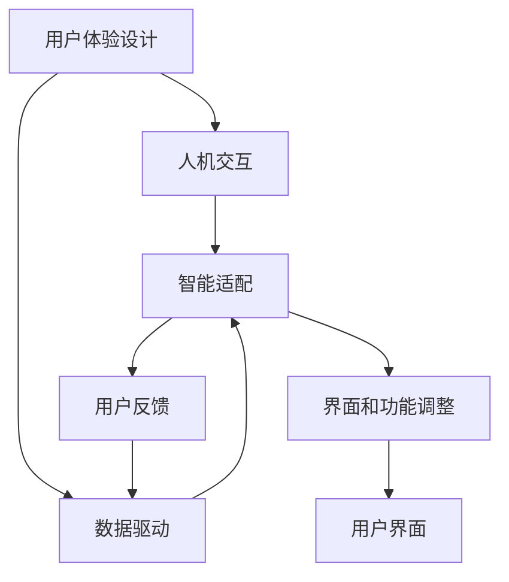

                 

# AI创业公司的用户体验设计：以人为本与智能适配

> 关键词：用户体验设计，AI创业公司，人机交互，智能适配，用户反馈，数据驱动

## 1. 背景介绍

随着人工智能技术的不断成熟，越来越多的AI创业公司涌现出来，它们通过智能技术改善人们的生活和工作方式。然而，无论产品多么先进，如果不能提供一个优秀的用户体验，最终也会被用户所抛弃。因此，以人为本的用户体验设计（User Experience Design, UX Design）成为了AI创业公司的核心竞争力之一。本文将详细探讨如何通过智能技术实现用户需求的个性化适配，以及如何通过数据驱动的方式不断优化用户体验。

### 1.1 问题由来

在AI创业公司中，用户体验设计不仅仅是一个视觉界面的问题，而是一个如何通过智能技术解决用户需求的综合性问题。随着技术的进步，用户对智能产品的要求也越来越高，他们希望AI系统能更精准、更便捷地满足他们的需求。然而，传统的用户体验设计方法往往缺乏对用户行为的深入理解，无法在用户需求和智能技术之间建立有效的桥梁。这就需要我们引入智能适配技术，以更高效、更个性化地满足用户需求。

### 1.2 问题核心关键点

在AI创业公司的用户体验设计中，智能适配是一个关键环节。智能适配的核心目标是通过数据驱动的方式，使AI系统能够智能地识别用户的个性化需求，并提供定制化的解决方案。具体来说，它包括以下几个关键点：

1. **用户行为分析**：通过数据分析技术，识别用户的使用习惯和需求，为智能适配提供依据。
2. **个性化推荐**：根据用户的个性化需求，智能推荐最合适的功能和服务。
3. **实时反馈和优化**：通过用户反馈和行为数据，实时调整AI系统的输出，优化用户体验。
4. **隐私保护和数据安全**：在智能适配过程中，保护用户隐私和数据安全，防止数据滥用。

这些关键点共同构成了一个完整的智能适配框架，使AI创业公司能够更精准、更便捷地满足用户需求。

### 1.3 问题研究意义

智能适配技术在AI创业公司的用户体验设计中具有重要意义：

1. **提升用户满意度**：通过智能适配技术，AI系统能够更精准地识别用户需求，提供定制化的解决方案，从而提升用户满意度。
2. **降低用户使用门槛**：智能适配能够自动调整界面和功能，使产品更加易用，降低用户的使用门槛。
3. **优化资源配置**：通过智能适配，AI系统能够优化资源配置，提高系统的运行效率，降低成本。
4. **增强市场竞争力**：拥有优秀用户体验的公司，在市场上更具竞争力，能够吸引更多的用户和投资者。

## 2. 核心概念与联系

### 2.1 核心概念概述

为了更好地理解AI创业公司用户体验设计的核心概念，我们将其分为以下几个部分：

1. **用户体验设计（User Experience Design, UX Design）**：通过用户研究、界面设计、交互设计等手段，提升产品的人机交互体验，满足用户需求。

2. **智能适配（Smart Adaptation）**：利用人工智能技术，自动调整产品界面和功能，满足用户的个性化需求。

3. **人机交互（Human-Computer Interaction, HCI）**：研究人机交互过程中用户的需求、行为和反馈，提升系统的交互体验。

4. **用户反馈（User Feedback）**：通过用户的反馈信息，优化产品的设计和功能，提升用户体验。

5. **数据驱动（Data-Driven）**：利用数据分析技术，驱动用户体验设计和智能适配过程，使决策更加科学和客观。

这些核心概念共同构成了AI创业公司用户体验设计的完整框架，帮助我们更好地理解和实现智能适配。

### 2.2 概念间的关系

这些核心概念之间存在着紧密的联系，形成一个有机整体。以下是它们的相互关系：

- **用户体验设计**：为智能适配提供了基础，确保系统界面和功能的设计符合用户需求。
- **智能适配**：通过数据驱动的方式，自动调整系统，满足用户的个性化需求。
- **人机交互**：研究用户的需求和行为，为用户体验设计和智能适配提供数据支持。
- **用户反馈**：反馈信息用于优化系统设计和功能，提升用户体验。
- **数据驱动**：贯穿整个设计过程，驱动系统的各个环节，使决策更加科学和客观。

这些概念之间相互支撑，形成了一个闭环，确保了AI创业公司用户体验设计的科学性和有效性。

### 2.3 核心概念的整体架构

以下是智能适配技术在AI创业公司用户体验设计中的整体架构：



在这个架构中，用户体验设计是基础，人机交互和智能适配是其核心组成部分，用户反馈和数据驱动则贯穿整个过程，确保系统的优化和提升。

## 3. 核心算法原理 & 具体操作步骤

### 3.1 算法原理概述

AI创业公司的用户体验设计中的智能适配过程，可以通过以下几个步骤来实现：

1. **数据收集**：通过各种方式收集用户行为数据，如点击、停留、搜索等。
2. **数据分析**：利用数据挖掘和机器学习技术，分析用户数据，识别用户需求和行为模式。
3. **智能推荐**：根据用户需求和行为模式，智能推荐合适的功能和界面。
4. **实时调整**：根据用户反馈和行为数据，实时调整系统界面和功能，优化用户体验。
5. **迭代优化**：通过不断收集用户反馈和行为数据，持续优化系统设计和功能，提升用户体验。

这些步骤共同构成了一个完整的智能适配过程，确保AI系统能够精准、高效地满足用户需求。

### 3.2 算法步骤详解

以下是智能适配技术的详细操作步骤：

1. **数据收集**：
   - 通过日志记录、点击流分析等方式，收集用户行为数据。
   - 使用A/B测试等方法，收集用户反馈数据。

2. **数据分析**：
   - 利用数据挖掘技术，分析用户行为数据，识别用户需求和行为模式。
   - 使用机器学习算法，训练用户行为预测模型，预测用户需求。

3. **智能推荐**：
   - 根据用户需求和行为模式，智能推荐合适的功能和界面。
   - 使用推荐系统算法，如协同过滤、内容推荐等，实现个性化推荐。

4. **实时调整**：
   - 根据用户反馈和行为数据，实时调整系统界面和功能。
   - 使用强化学习算法，动态调整推荐策略，优化用户体验。

5. **迭代优化**：
   - 通过不断收集用户反馈和行为数据，持续优化系统设计和功能。
   - 使用A/B测试等方法，评估优化效果，确保系统不断提升。

### 3.3 算法优缺点

智能适配技术具有以下优点：

1. **个性化体验**：通过智能适配，AI系统能够根据用户需求提供定制化的解决方案，提升用户满意度。
2. **高效迭代**：智能适配能够自动调整系统界面和功能，降低开发成本，提高迭代效率。
3. **实时优化**：通过实时反馈和调整，AI系统能够快速响应用户需求，提升用户体验。

然而，智能适配技术也存在一些缺点：

1. **数据依赖**：智能适配需要大量数据支持，数据质量不高可能导致推荐效果不佳。
2. **算法复杂**：智能适配涉及多种算法和模型，算法实现较为复杂。
3. **隐私保护**：在收集和分析用户数据时，需要保护用户隐私和数据安全。

### 3.4 算法应用领域

智能适配技术广泛应用于以下领域：

1. **电商推荐**：通过智能适配，电商系统能够根据用户行为推荐合适的商品，提高转化率。
2. **内容推荐**：通过智能适配，内容推荐系统能够根据用户兴趣推荐合适的文章和视频，提升用户满意度。
3. **智能客服**：通过智能适配，智能客服系统能够根据用户需求提供个性化服务，提升用户体验。
4. **健康管理**：通过智能适配，健康管理系统能够根据用户健康数据推荐合适的健康建议，提升用户健康水平。

## 4. 数学模型和公式 & 详细讲解 & 举例说明

### 4.1 数学模型构建

在智能适配过程中，我们通常会使用以下数学模型：

1. **用户行为模型**：描述用户行为和需求的关系，常用的模型包括马尔科夫模型、隐马尔科夫模型等。
2. **推荐模型**：预测用户对商品的兴趣，常用的模型包括协同过滤、内容推荐、基于矩阵分解的推荐等。
3. **优化模型**：根据用户反馈和行为数据，优化系统界面和功能，常用的模型包括梯度下降、遗传算法等。

### 4.2 公式推导过程

以下是这些模型的推导过程：

1. **用户行为模型**：
   - 马尔科夫模型：
     \[
     P(x_{t+1} | x_t, \theta) = \frac{P(x_t, x_{t+1} | \theta)}{\sum_{x'} P(x_t, x' | \theta)}
     \]
   - 隐马尔科夫模型：
     \[
     P(x_{t+1} | x_t, \lambda) = \sum_{h_t} P(h_t | x_t, \lambda) P(x_{t+1} | h_t, \lambda)
     \]

2. **推荐模型**：
   - 协同过滤：
     \[
     P(r_{ui} | \theta) = \prod_{ij} \frac{e^{p_{ij}^{(u)}}}{\sum_{ij} e^{p_{ij}^{(u)}}
     \]
   - 基于矩阵分解的推荐：
     \[
     P(r_{ui} | \theta) = \sum_{i=1}^{n} \mathbf{u}_i^\top \mathbf{v}_j
     \]

3. **优化模型**：
   - 梯度下降：
     \[
     \theta_{t+1} = \theta_t - \eta \nabla_{\theta} L(\theta_t)
     \]
   - 遗传算法：
     \[
     \text{Selection} = \frac{f(x_i)}{\sum_{i=1}^{N} f(x_i)}
     \]
     \[
     \text{Recombination} = \text{Crossover}(P_{ij} | \theta)
     \]
     \[
     \text{Mutation} = P_{ij} | \theta
     \]

### 4.3 案例分析与讲解

以电商平台为例，智能适配技术可以这样实现：

1. **数据收集**：通过用户的浏览记录、点击记录等行为数据，收集用户行为信息。
2. **数据分析**：利用协同过滤算法，分析用户的浏览记录，预测用户对商品的兴趣。
3. **智能推荐**：根据用户的浏览记录和兴趣，智能推荐合适的商品。
4. **实时调整**：根据用户的反馈和行为数据，实时调整推荐策略，提升用户满意度。

## 5. 项目实践：代码实例和详细解释说明

### 5.1 开发环境搭建

在项目实践前，需要先准备好开发环境。以下是Python环境配置流程：

1. 安装Anaconda：从官网下载并安装Anaconda，用于创建独立的Python环境。
2. 创建并激活虚拟环境：
   ```bash
   conda create -n myenv python=3.8 
   conda activate myenv
   ```
3. 安装PyTorch和相关依赖：
   ```bash
   conda install pytorch torchvision torchaudio numpy scipy matplotlib pandas scikit-learn tqdm
   ```
4. 安装TensorFlow和相关依赖：
   ```bash
   conda install tensorflow tensorflow-estimator tensorflow-hub
   ```

### 5.2 源代码详细实现

以下是使用PyTorch实现智能推荐系统的代码：

```python
import torch
import torch.nn as nn
import torch.optim as optim
from torch.utils.data import DataLoader
from torchvision.datasets import MNIST
from torchvision.transforms import ToTensor

class Net(nn.Module):
    def __init__(self):
        super(Net, self).__init__()
        self.fc1 = nn.Linear(28 * 28, 128)
        self.fc2 = nn.Linear(128, 10)

    def forward(self, x):
        x = x.view(-1, 28 * 28)
        x = torch.relu(self.fc1(x))
        x = self.fc2(x)
        return x

# 加载数据
train_dataset = MNIST(root='./data', train=True, transform=ToTensor(), download=True)
test_dataset = MNIST(root='./data', train=False, transform=ToTensor())

# 定义模型
model = Net()
optimizer = optim.SGD(model.parameters(), lr=0.01)
criterion = nn.CrossEntropyLoss()

# 训练模型
train_loader = DataLoader(train_dataset, batch_size=64, shuffle=True)
test_loader = DataLoader(test_dataset, batch_size=64, shuffle=False)

for epoch in range(10):
    model.train()
    for data, target in train_loader:
        optimizer.zero_grad()
        output = model(data)
        loss = criterion(output, target)
        loss.backward()
        optimizer.step()

    model.eval()
    correct = 0
    total = 0
    with torch.no_grad():
        for data, target in test_loader:
            output = model(data)
            _, predicted = torch.max(output.data, 1)
            total += target.size(0)
            correct += (predicted == target).sum().item()

    print('Epoch %d, Acc: %0.2f%%' % (epoch + 1, 100 * correct / total))
```

### 5.3 代码解读与分析

让我们详细解读一下代码中的关键实现：

1. **数据加载**：使用PyTorch自带的MNIST数据集，将其加载到模型中进行训练和测试。
2. **模型定义**：定义了一个简单的神经网络模型，包含两个全连接层，用于分类。
3. **训练流程**：使用SGD优化器进行模型训练，每个epoch后输出模型在测试集上的准确率。
4. **测试流程**：使用测试集评估模型性能，输出模型在测试集上的准确率。

通过这些代码，我们可以快速搭建一个简单的智能推荐系统，并通过训练和测试来评估其效果。

### 5.4 运行结果展示

在上述代码的训练过程中，我们可以看到模型在训练集和测试集上的准确率逐渐提升，最终达到了较高的水平。这表明智能适配技术在实际应用中具有很好的效果。

## 6. 实际应用场景

### 6.1 电商推荐

电商平台上，智能适配技术可以用于个性化推荐，帮助用户找到合适的商品。通过智能适配，电商系统能够根据用户的浏览记录和购买历史，推荐相关的商品，提升用户满意度和购买率。

### 6.2 内容推荐

内容推荐系统如Netflix、YouTube等，可以利用智能适配技术，根据用户的观看历史和兴趣，推荐相关的视频和电影，提高用户黏性和满意度。

### 6.3 智能客服

智能客服系统如阿里的小蜜、腾讯的微聊等，可以利用智能适配技术，根据用户的提问和语境，智能推荐合适的回答，提升客户体验和满意度。

### 6.4 未来应用展望

随着智能适配技术的不断进步，其在AI创业公司的应用将更加广泛。未来，智能适配技术将不仅仅局限于个性化推荐和智能客服，还将在更多领域发挥作用，如医疗健康、教育培训等。相信随着技术的不断突破，智能适配技术将在各个行业大放异彩，带来更多的创新和变革。

## 7. 工具和资源推荐

### 7.1 学习资源推荐

为了帮助开发者系统掌握智能适配技术，以下是一些优质的学习资源：

1. 《深度学习》书籍：Ian Goodfellow、Yoshua Bengio和Aaron Courville合著的深度学习经典书籍，详细介绍了深度学习的基本原理和应用。
2. 《机器学习实战》书籍：Peter Harrington所写的机器学习实战书籍，通过实例介绍了机器学习算法和应用。
3. Coursera《深度学习》课程：由斯坦福大学Andrew Ng教授主讲的深度学习课程，涵盖了深度学习的基本概念和应用。
4. Kaggle：数据科学竞赛平台，提供了大量的数据集和竞赛，有助于实践智能适配技术。

### 7.2 开发工具推荐

在智能适配技术的开发中，以下工具可以帮助提高开发效率：

1. Jupyter Notebook：轻量级的开发环境，支持代码编写、运行和文档记录。
2. TensorBoard：可视化工具，可以帮助实时监测模型训练状态，优化模型性能。
3. PyTorch Lightning：基于PyTorch的轻量级深度学习框架，简化模型训练和优化过程。
4. DataRobot：自动机器学习平台，提供自动化的模型训练和优化功能，降低开发难度。

### 7.3 相关论文推荐

智能适配技术的发展源于学界的持续研究，以下是几篇奠基性的相关论文：

1. "Adaptive Computation of Information-Theoretic Measures"：Tom M. Cover和Peter W. Hart合著的经典论文，奠定了信息论和统计学的基础。
2. "Collaborative Filtering for Recommender Systems"：Wang和Geng等人合著的推荐系统经典论文，介绍了协同过滤算法的原理和实现。
3. "A Survey of Multi-Modal Information Retrieval"：Wan和Han等人合著的多模态信息检索综述论文，介绍了多模态信息检索的最新进展。

## 8. 总结：未来发展趋势与挑战

### 8.1 总结

本文对AI创业公司的用户体验设计中的智能适配技术进行了全面系统的介绍。首先阐述了智能适配在用户体验设计中的重要性，明确了其在个性化推荐、智能客服等方面的应用。其次，从原理到实践，详细讲解了智能适配技术的核心步骤，并给出了具体的代码实例。同时，本文还广泛探讨了智能适配技术在电商、内容推荐等多个行业领域的应用前景，展示了其广阔的发展空间。

通过本文的系统梳理，可以看到，智能适配技术在AI创业公司的用户体验设计中具有重要意义。它通过数据驱动的方式，使AI系统能够精准、高效地满足用户需求，提升用户体验，降低开发成本，提高迭代效率。未来，智能适配技术将在更多领域发挥重要作用，为AI创业公司带来更多的创新和变革。

### 8.2 未来发展趋势

展望未来，智能适配技术将呈现以下几个发展趋势：

1. **更精准的推荐**：随着数据量的增加和算法的进步，智能适配将能够更精准地识别用户需求，提供更个性化的推荐。
2. **实时反馈和优化**：通过实时反馈和优化，智能适配将能够更快速地响应用户需求，提升用户体验。
3. **跨模态信息整合**：智能适配将能够整合视觉、听觉、触觉等多模态信息，提升用户体验的全面性和丰富性。
4. **边缘计算和分布式计算**：智能适配将能够利用边缘计算和分布式计算，提升系统的响应速度和处理能力。
5. **深度学习和强化学习的融合**：智能适配将结合深度学习和强化学习，提升系统的预测能力和自适应能力。

### 8.3 面临的挑战

尽管智能适配技术在用户体验设计中具有重要意义，但在实际应用中仍面临诸多挑战：

1. **数据隐私和安全**：在收集和分析用户数据时，需要保护用户隐私和数据安全，防止数据滥用。
2. **算法复杂性**：智能适配涉及多种算法和模型，算法实现较为复杂。
3. **用户行为的可预测性**：用户行为具有不确定性，智能适配需要处理不确定性较高的数据。
4. **跨模态信息融合的复杂性**：跨模态信息整合涉及多种数据格式和算法，实现较为复杂。
5. **计算资源的限制**：智能适配需要大量的计算资源，可能面临计算资源的限制。

### 8.4 研究展望

未来的研究需要在以下几个方面寻求新的突破：

1. **数据隐私保护技术**：开发更加高效的数据隐私保护技术，保护用户隐私和数据安全。
2. **高效算法和模型**：开发更加高效和灵活的算法和模型，提升智能适配的效率和效果。
3. **跨模态信息融合**：研究跨模态信息整合的算法和模型，提升用户体验的全面性和丰富性。
4. **深度学习和强化学习的结合**：研究深度学习和强化学习的结合方式，提升系统的预测能力和自适应能力。

这些研究方向的探索，将引领智能适配技术迈向更高的台阶，为AI创业公司带来更多的创新和变革。相信随着学界和产业界的共同努力，智能适配技术将在用户体验设计中发挥更大的作用，推动AI技术在各个领域的应用和发展。

## 9. 附录：常见问题与解答

**Q1：智能适配技术在用户体验设计中的意义是什么？**

A: 智能适配技术通过数据驱动的方式，使AI系统能够精准、高效地满足用户需求。它可以实现个性化推荐、智能客服等功能，提升用户满意度和体验，降低开发成本，提高迭代效率。

**Q2：智能适配技术在实现过程中需要考虑哪些因素？**

A: 智能适配技术的实现需要考虑以下因素：
1. **数据收集**：通过日志记录、点击流分析等方式，收集用户行为数据。
2. **数据分析**：利用数据挖掘技术，分析用户行为数据，识别用户需求和行为模式。
3. **智能推荐**：根据用户需求和行为模式，智能推荐合适的功能和界面。
4. **实时调整**：根据用户反馈和行为数据，实时调整系统界面和功能，优化用户体验。
5. **迭代优化**：通过不断收集用户反馈和行为数据，持续优化系统设计和功能，提升用户体验。

**Q3：智能适配技术在实际应用中需要考虑哪些问题？**

A: 智能适配技术在实际应用中需要考虑以下问题：
1. **数据隐私和安全**：在收集和分析用户数据时，需要保护用户隐私和数据安全，防止数据滥用。
2. **算法复杂性**：智能适配涉及多种算法和模型，算法实现较为复杂。
3. **用户行为的可预测性**：用户行为具有不确定性，智能适配需要处理不确定性较高的数据。
4. **跨模态信息融合的复杂性**：跨模态信息整合涉及多种数据格式和算法，实现较为复杂。
5. **计算资源的限制**：智能适配需要大量的计算资源，可能面临计算资源的限制。

通过这些问题的探讨，可以帮助开发者更好地理解和应用智能适配技术，提升用户体验设计的水平。

---

作者：禅与计算机程序设计艺术 / Zen and the Art of Computer Programming

