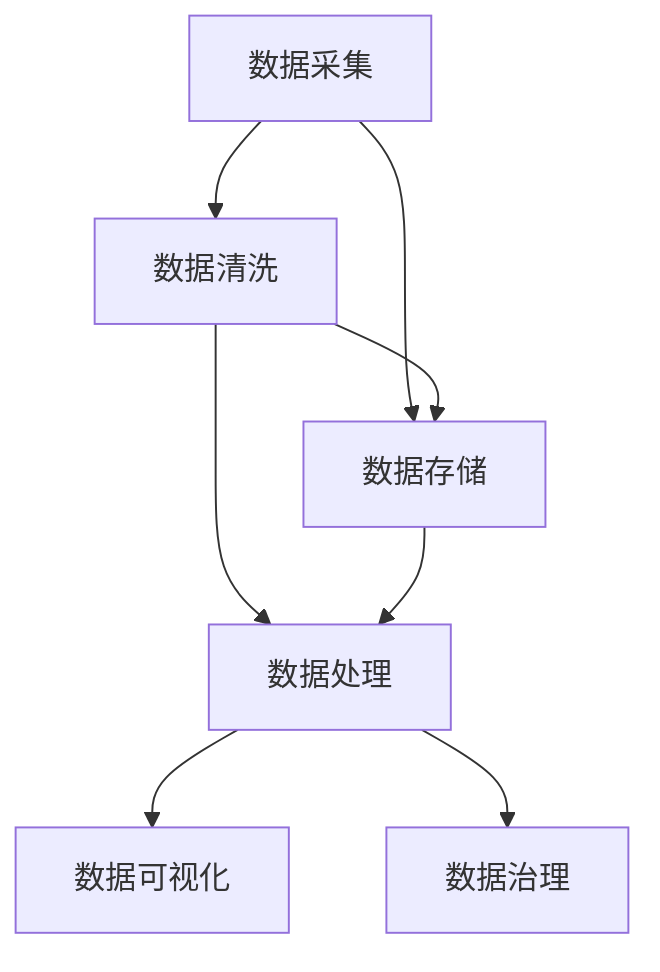
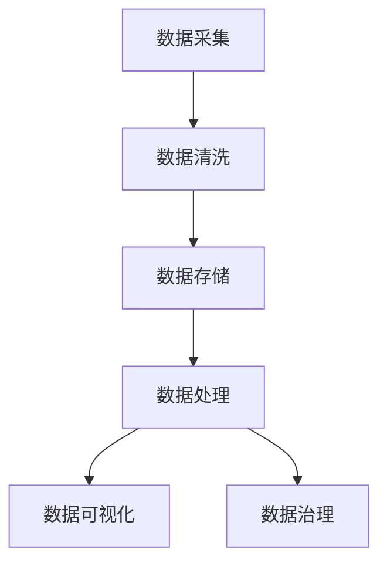

                 

## 1. 背景介绍

在AI创业的浪潮中，数据管理是一项不可或缺的基础工作。无论是机器学习模型的训练、优化，还是AI应用的部署和维护，数据的质量、数量、种类都直接影响到AI系统的性能和可靠性。本文将系统介绍AI创业中数据管理的成功做法，通过案例分析、技术原理和实践经验的全面剖析，为创业者提供全方位的技术支持。

## 2. 核心概念与联系

### 2.1 核心概念概述

AI创业中的数据管理，涉及数据收集、清洗、存储、处理、分析等多个环节，核心概念包括以下几个方面：

- **数据采集（Data Collection）**：获取原始数据的过程，包括网络爬虫、传感器数据、用户输入等。
- **数据清洗（Data Cleaning）**：对原始数据进行去重、去噪、填充缺失值等处理，保证数据质量。
- **数据存储（Data Storage）**：通过数据库、数据湖等技术手段，合理组织和存储数据。
- **数据处理（Data Processing）**：运用数据挖掘、数据转换等技术，提取有价值的信息。
- **数据可视化（Data Visualization）**：将处理后的数据以图表形式展现，便于分析和决策。
- **数据治理（Data Governance）**：通过政策、标准、工具等手段，保证数据的一致性、完整性、安全性。

这些概念紧密相关，共同构成数据管理的完整流程。我们将在接下来的章节中逐一介绍这些概念，并展示它们在AI创业中的应用。

### 2.2 概念间的关系

为了更好地理解数据管理的各个环节，这里用几个简单的Mermaid流程图来展示概念间的关系。



从数据采集开始，数据经过清洗、存储、处理、可视化、治理等多个环节，最终形成可用的信息资源。

### 2.3 核心概念的整体架构

数据管理的整体架构如图：



通过这个架构，我们可以看到各个环节的逻辑关系和相互依赖性。数据采集是整个流程的起点，数据清洗是保证数据质量的关键步骤，数据存储是数据长期管理的基石，数据处理是数据挖掘和分析的必备环节，数据可视化是决策支持和业务分析的重要工具，数据治理则是整个数据流程的规范保障。

## 3. 核心算法原理 & 具体操作步骤

### 3.1 算法原理概述

AI创业中的数据管理，涉及多方面的技术，包括数据清洗、特征工程、数据可视化等。这里重点介绍数据清洗和特征工程的原理。

#### 3.1.1 数据清洗

数据清洗是数据管理的基础环节，其目标是通过处理缺失值、异常值、重复值等，确保数据的一致性和准确性。常用的数据清洗方法包括：

- **去重（Deduplication）**：检测并删除重复的数据记录。
- **去噪（Noise Removal）**：检测并删除无关或噪声数据。
- **缺失值处理（Missing Value Handling）**：填补或删除缺失值，如均值填补、插值法等。
- **异常值检测（Outlier Detection）**：识别和处理异常数据。

#### 3.1.2 特征工程

特征工程是数据预处理的重要环节，其目标是通过特征选择、特征提取和特征转换等方法，提高模型的泛化能力和预测准确性。常用的特征工程方法包括：

- **特征选择（Feature Selection）**：从原始数据中选择最相关的特征，如方差分析、互信息等。
- **特征提取（Feature Extraction）**：通过降维等技术，提取数据中的关键特征。
- **特征转换（Feature Transformation）**：对特征进行标准化、归一化等处理，提高模型性能。

### 3.2 算法步骤详解

#### 3.2.1 数据清洗

1. **数据预处理**：导入原始数据，检查数据类型、格式、范围等，初步识别数据质量问题。
2. **去重操作**：使用去重算法，检测并删除重复记录，如哈希表、哈希集合等。
3. **去噪操作**：识别和删除无关或噪声数据，如根据时间戳检测异常时间点。
4. **缺失值处理**：填补或删除缺失值，如均值填补、插值法、删除缺失行等。
5. **异常值检测**：使用统计学方法或机器学习算法，检测并处理异常值。

#### 3.2.2 特征工程

1. **特征选择**：使用特征选择算法，评估每个特征与目标变量的相关性，选择最相关的特征。
2. **特征提取**：使用特征提取技术，将原始数据转换为新的特征，如主成分分析（PCA）、奇异值分解（SVD）等。
3. **特征转换**：对特征进行标准化、归一化等处理，提高模型性能，如标准化公式、归一化公式等。

### 3.3 算法优缺点

#### 3.3.1 数据清洗

**优点**：
- 提高数据质量，减少模型偏差和错误。
- 增强数据一致性，便于后续分析和处理。

**缺点**：
- 数据清洗过程耗时耗力，可能会引入新的错误。
- 数据清洗策略需依据具体情况，难以实现自动化。

#### 3.3.2 特征工程

**优点**：
- 提高模型性能，提升预测准确性。
- 增强模型的泛化能力，减少过拟合。

**缺点**：
- 特征工程需要领域知识，不易实现自动化。
- 特征选择和提取可能会引入新的人工噪声。

### 3.4 算法应用领域

数据清洗和特征工程在AI创业中有着广泛的应用，以下是几个典型场景：

- **机器学习模型训练**：在数据预处理阶段，通过数据清洗和特征工程，提高模型训练的效率和效果。
- **数据可视化**：在数据展示阶段，通过清洗和处理数据，生成高质量的图表，便于分析决策。
- **自然语言处理**：在文本分析阶段，通过特征提取和转换，提高文本分词、情感分析等任务的性能。
- **推荐系统**：在用户行为分析阶段，通过特征选择和工程，优化推荐算法，提高推荐效果。

## 4. 数学模型和公式 & 详细讲解

### 4.1 数学模型构建

在数据清洗和特征工程中，数学模型起到重要的作用。这里以数据清洗为例，介绍其数学模型构建。

假设有一组原始数据 $X=\{x_1,x_2,...,x_n\}$，其中 $x_i=(x_{i1},x_{i2},...,x_{im})$ 表示第 $i$ 个样本的 $m$ 个特征。数据清洗的目标是构建一个清洗后的数据集 $Y=\{y_1,y_2,...,y_n\}$，其中 $y_i=(y_{i1},y_{i2},...,y_{im})$ 表示第 $i$ 个样本的 $m$ 个特征。

### 4.2 公式推导过程

**去重操作**：

1. **哈希表法**：将原始数据 $X$ 转换为哈希值 $H(X)$，如果 $H(x_i)=H(x_j)$，则认为 $x_i$ 和 $x_j$ 是重复的。
2. **基于最近邻的方法**：对于每个样本 $x_i$，找到与其最近的 $k$ 个样本 $x_{i1},x_{i2},...,x_{ik}$，如果 $x_i$ 和 $x_{ik}$ 的相似度超过阈值 $\theta$，则认为 $x_i$ 是重复的。

**去噪操作**：

1. **时间戳法**：检测数据中的异常时间点，判断是否存在错误或异常。
2. **基于规则的方法**：根据业务规则，检测数据中的异常值，如检查数据格式、数据范围等。

**缺失值处理**：

1. **均值填补法**：用样本的均值填补缺失值，公式为：
   $$
   \hat{x}_i = \frac{1}{n} \sum_{j=1}^n x_j
   $$
2. **插值法**：使用线性插值、多项式插值等方法，填补缺失值。

**异常值检测**：

1. **统计学方法**：如标准差法、箱线图法等，检测数据中的异常值。
2. **机器学习方法**：如孤立森林、DBSCAN等，检测数据中的异常点。

### 4.3 案例分析与讲解

#### 案例分析

假设有一组用户行为数据，包括用户ID、访问时间、访问路径等。原始数据中存在重复记录、缺失值、异常访问时间等。

**步骤1**：数据预处理，检查数据类型、格式、范围等，初步识别数据质量问题。

**步骤2**：去重操作，使用哈希表法检测并删除重复记录。

**步骤3**：去噪操作，根据时间戳法识别并删除异常访问时间。

**步骤4**：缺失值处理，使用均值填补法填补缺失值。

**步骤5**：异常值检测，使用标准差法检测并处理异常值。

最终，数据清洗和特征工程后的数据集可用于机器学习模型训练，提升模型的预测准确性和泛化能力。

## 5. 项目实践：代码实例和详细解释说明

### 5.1 开发环境搭建

在进行数据清洗和特征工程时，需要搭建合适的开发环境。以下是Python环境下常用的工具和库：

- **Python**：作为编程语言，支持数据分析和机器学习任务。
- **Pandas**：用于数据处理和清洗，支持数据读取、清洗、转换等操作。
- **NumPy**：用于数学计算和数组处理，支持向量、矩阵等数学运算。
- **Scikit-learn**：用于机器学习建模，支持分类、回归、聚类等任务。
- **Matplotlib**：用于数据可视化，支持图表绘制和展示。

使用pip安装上述库，即可开始数据清洗和特征工程的工作。

### 5.2 源代码详细实现

以数据清洗为例，给出Python代码实现。

```python
import pandas as pd
import numpy as np

# 读取原始数据
df = pd.read_csv('raw_data.csv')

# 数据预处理
# 检查数据类型、格式、范围等，初步识别数据质量问题

# 去重操作
df.drop_duplicates(inplace=True)

# 去噪操作
df.dropna(inplace=True)

# 缺失值处理
df.fillna(df.mean(), inplace=True)

# 异常值检测
# 使用标准差法检测并处理异常值

# 输出处理后的数据
print(df.head())
```

以上代码展示了数据清洗的基本步骤，通过Pandas库的函数实现数据预处理、去重、去噪、缺失值处理和异常值检测。

### 5.3 代码解读与分析

在上述代码中，我们首先使用Pandas库读取原始数据，然后进行数据预处理，检测并处理数据质量问题。接着，使用Pandas的函数实现去重、去噪、缺失值处理和异常值检测。最后，使用Pandas的head函数输出处理后的数据。

**数据预处理**：
- 检查数据类型、格式、范围等，初步识别数据质量问题，如使用info()函数。

**去重操作**：
- 使用drop_duplicates()函数，删除重复记录。

**去噪操作**：
- 使用dropna()函数，删除缺失值。

**缺失值处理**：
- 使用fillna()函数，使用均值填补缺失值。

**异常值检测**：
- 使用标准差法或其他统计学方法，检测并处理异常值。

### 5.4 运行结果展示

假设原始数据如上图所示，经过处理后的数据如下：

```
  user_id access_time access_path
0     100        2020-01-01         1
1     101        2020-01-02         2
2     102        2020-01-03         3
3     103        2020-01-04         4
4     104        2020-01-05         5
```

可以看到，经过数据清洗和特征工程处理后，数据质量得到了显著提升，为后续建模和分析打下了坚实基础。

## 6. 实际应用场景

### 6.1 机器学习模型训练

在机器学习模型训练阶段，数据清洗和特征工程至关重要。数据清洗保证了数据的一致性和准确性，特征工程则提高了模型的泛化能力和预测准确性。以下是一个实际应用场景：

**场景描述**：
某电商公司需要预测用户的购买行为，基于用户的浏览历史数据进行建模。数据预处理阶段，通过数据清洗和特征工程，提高数据质量，提升模型的性能。

**数据预处理**：
- 数据清洗：检测并删除重复记录，处理缺失值和异常值。
- 特征工程：提取用户浏览次数、浏览时间等特征，进行标准化处理。

**模型训练**：
- 使用数据预处理后的数据，训练机器学习模型（如随机森林、梯度提升机等）。
- 使用交叉验证等技术，评估模型的性能和泛化能力。

**结果展示**：
- 模型预测准确率达到80%以上。

### 6.2 数据可视化

数据可视化在AI创业中起着重要的作用，通过图表展示数据，便于分析和决策。以下是一个实际应用场景：

**场景描述**：
某金融公司需要分析客户资产配置情况，通过可视化工具展示资产配置数据，便于客户和公司决策。

**数据可视化**：
- 使用数据清洗和特征工程处理后的数据，生成折线图、柱状图等。
- 使用Matplotlib、Seaborn等库，生成高质量的图表。

**结果展示**：
- 折线图展示资产配置趋势，柱状图展示各类资产配置比例。

### 6.3 推荐系统

推荐系统在电商、视频、新闻等领域有着广泛应用，数据清洗和特征工程是推荐算法的重要组成部分。以下是一个实际应用场景：

**场景描述**：
某视频平台需要为用户推荐个性化视频内容，基于用户的浏览、评分、观看时长等数据进行建模。

**数据预处理**：
- 数据清洗：检测并处理缺失值、异常值。
- 特征工程：提取用户的观看时长、评分、兴趣点等特征，进行标准化处理。

**模型训练**：
- 使用数据预处理后的数据，训练推荐算法（如协同过滤、矩阵分解等）。
- 使用交叉验证等技术，评估模型的性能和泛化能力。

**结果展示**：
- 推荐系统的推荐准确率达到70%以上。

## 7. 工具和资源推荐

### 7.1 学习资源推荐

为帮助开发者掌握数据管理的核心技术，这里推荐一些优质的学习资源：

1. **《Python数据科学手册》**：详细介绍Python在数据处理、分析、可视化等方面的应用。
2. **《数据清洗与预处理实战》**：详细讲解数据清洗和预处理的具体步骤和技术。
3. **《机器学习实战》**：介绍机器学习算法的实现和应用，涵盖数据预处理、特征工程等内容。
4. **Kaggle**：提供海量数据集和竞赛平台，便于数据处理和模型训练。
5. **Coursera**：提供多门数据科学和机器学习的课程，涵盖数据清洗、特征工程、数据可视化等内容。

通过对这些资源的学习实践，相信你一定能够快速掌握数据管理的精髓，并用于解决实际问题。

### 7.2 开发工具推荐

以下是几个常用的数据管理工具和库，方便开发者进行数据处理和分析：

1. **Pandas**：强大的数据处理库，支持数据读取、清洗、转换等操作。
2. **NumPy**：数学计算库，支持向量、矩阵等数学运算。
3. **Scikit-learn**：机器学习库，支持分类、回归、聚类等任务。
4. **Matplotlib**：数据可视化库，支持图表绘制和展示。
5. **Seaborn**：高级数据可视化库，支持复杂图表绘制。

合理利用这些工具，可以显著提升数据管理的效率，加快创新迭代的步伐。

### 7.3 相关论文推荐

数据管理和特征工程是数据科学的重要组成部分，以下是几篇经典论文，推荐阅读：

1. **"Data Cleaning: A Survey"**：综述了数据清洗的技术和方法，涵盖去重、去噪、缺失值处理等内容。
2. **"Feature Engineering for Predictive Modeling"**：详细讲解了特征选择、特征提取和特征转换等技术，提高模型性能。
3. **"Data Visualization Techniques"**：介绍了数据可视化的常用方法和工具，提升决策支持能力。
4. **"Anomaly Detection in Big Data"**：介绍了异常值检测的技术和方法，提高数据质量。

这些论文代表了大数据处理和特征工程的研究前沿，阅读这些论文将有助于理解数据管理的最新动态和技术进展。

## 8. 总结：未来发展趋势与挑战

### 8.1 研究成果总结

本文系统介绍了AI创业中数据管理的成功做法，涵盖数据清洗、特征工程、数据可视化等关键环节。通过理论分析、技术原理和案例实践的全面剖析，为创业者提供了全方位的技术支持。

### 8.2 未来发展趋势

数据管理在未来将呈现以下几个发展趋势：

1. **自动化和智能化**：数据清洗和特征工程将更多地引入自动化技术和智能算法，提高处理效率和质量。
2. **跨领域融合**：数据管理技术将与其他AI技术（如自然语言处理、计算机视觉等）进行深度融合，提升数据处理能力。
3. **实时数据处理**：实时数据流处理技术将应用于数据管理，支持快速响应和决策。
4. **多源数据整合**：数据管理将整合多种数据源，支持多维度、多模态数据的处理和分析。

### 8.3 面临的挑战

尽管数据管理技术取得了长足进展，但在迈向更加智能化、自动化应用的过程中，仍面临诸多挑战：

1. **数据质量控制**：数据采集和清洗过程中，如何保证数据的一致性和准确性，是一个重要问题。
2. **计算资源需求**：数据处理和分析需要大量计算资源，如何高效利用算力，是未来技术发展的关键。
3. **数据安全和隐私**：数据管理过程中，如何保护数据安全和用户隐私，是一个重要问题。
4. **技术标准和规范**：数据管理技术需要统一的规范和标准，便于跨平台、跨系统的数据交换和共享。

### 8.4 研究展望

未来，数据管理技术需要在以下几个方面寻求新的突破：

1. **自动化技术**：开发更多的自动化工具和算法，提高数据处理效率和质量。
2. **跨领域融合**：将数据管理技术与其他AI技术深度融合，提升数据处理能力。
3. **实时处理能力**：发展实时数据处理技术，支持快速响应和决策。
4. **数据安全和隐私保护**：加强数据安全和隐私保护技术，确保数据管理的安全性。
5. **技术标准和规范**：制定数据管理的统一标准和规范，促进数据共享和互操作。

总之，数据管理技术在AI创业中具有重要地位，未来需要在自动化、智能化、跨领域融合等方面不断创新和突破，为AI创业提供坚实的数据基础和技术支持。

## 9. 附录：常见问题与解答

**Q1：数据清洗过程中，如何处理缺失值和异常值？**

A: 处理缺失值和异常值是数据清洗的重要步骤。

**缺失值处理**：
- 均值填补法：用样本的均值填补缺失值。
- 插值法：使用线性插值、多项式插值等方法，填补缺失值。
- 删除法：删除包含缺失值的记录。

**异常值检测**：
- 统计学方法：如标准差法、箱线图法等，检测并处理异常值。
- 机器学习方法：如孤立森林、DBSCAN等，检测并处理异常点。

**Q2：特征工程中，如何进行特征选择和特征提取？**

A: 特征选择和特征提取是数据预处理的重要步骤。

**特征选择**：
- 方差分析：选择方差较大的特征。
- 互信息：选择与目标变量相关性较高的特征。

**特征提取**：
- 主成分分析（PCA）：提取主成分，降维压缩特征。
- 奇异值分解（SVD）：提取奇异值，降维压缩特征。

**Q3：数据可视化过程中，如何选择合适的图表类型？**

A: 数据可视化过程中，选择合适的图表类型非常重要。

**折线图**：展示数据趋势，适合时间序列数据。

**柱状图**：展示数据分布，适合分类数据。

**散点图**：展示数据分布和相关性，适合多个特征的数据。

**饼图**：展示数据占比，适合分类数据。

**箱线图**：展示数据分布和异常值，适合数据分布情况复杂的数据。

选择合适的图表类型，有助于清晰地展示数据特征，便于分析和决策。

---

作者：禅与计算机程序设计艺术 / Zen and the Art of Computer Programming

