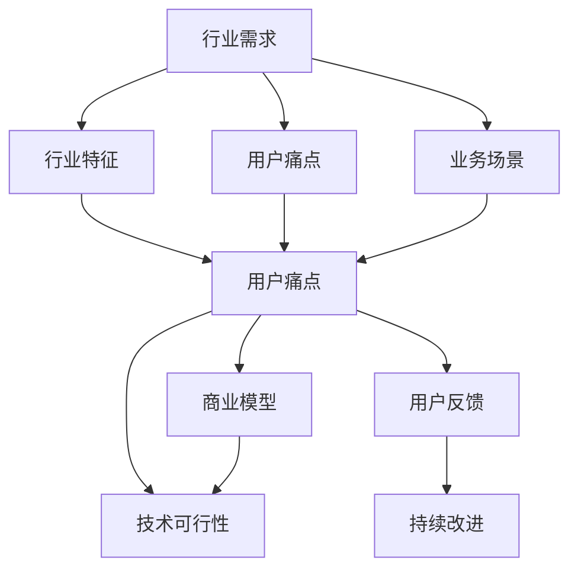
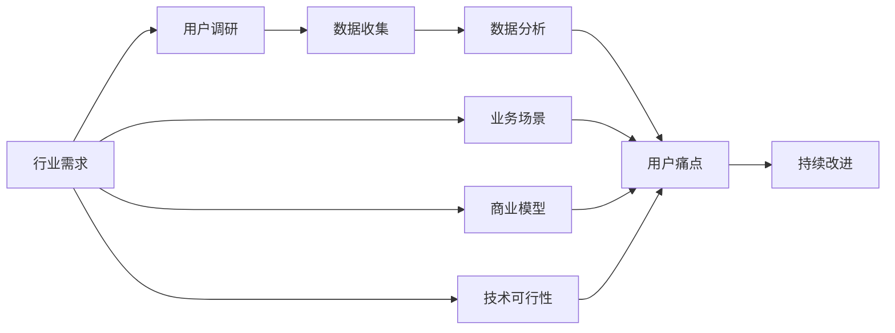
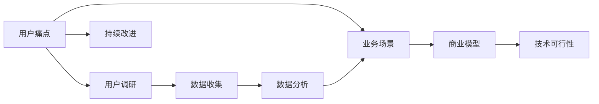
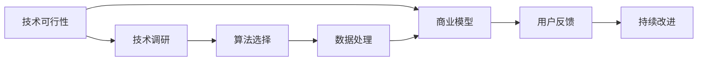
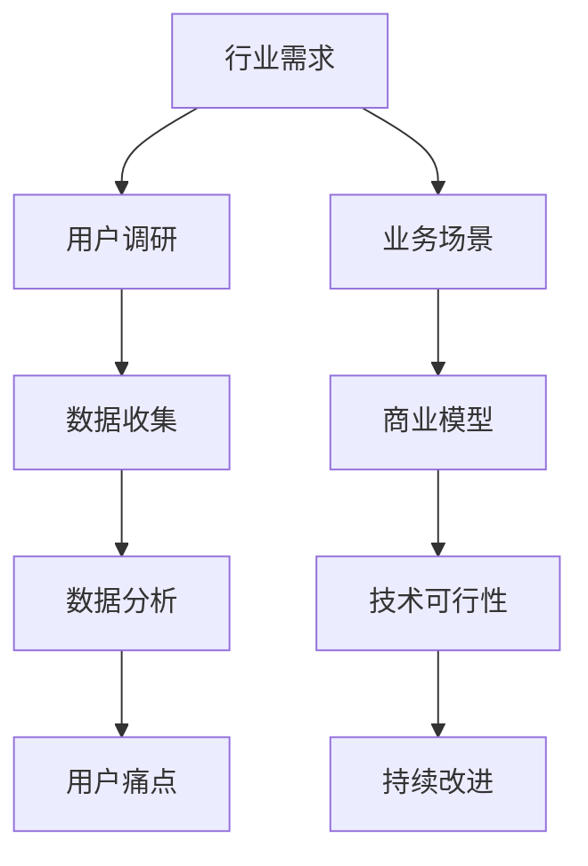

                 

# AI创业：识别行业需求

> 关键词：AI创业, 行业需求, 数据驱动, 业务场景, 商业模型, 用户反馈, 模型优化, 持续改进

## 1. 背景介绍

### 1.1 问题由来
随着人工智能技术的飞速发展，越来越多的企业和创业公司开始利用AI技术来提升业务效率和用户体验。然而，在实际应用中，AI系统往往难以真正满足用户的实际需求，导致投入的成本无法得到有效的回报。因此，如何准确识别行业需求，成为了AI创业成功的关键。

### 1.2 问题核心关键点
准确识别行业需求，需要从多个维度进行分析。主要包括：
1. 行业特征：了解目标行业的核心业务、关键流程和数据特征。
2. 用户痛点：明确用户的实际需求、痛点和期望。
3. 业务场景：分析具体的业务场景和问题，确定AI应用的价值点。
4. 商业模型：评估AI应用的商业模式，包括收入来源、成本结构和盈利模式。
5. 技术可行性：评估AI技术在特定业务场景中的可行性和效果。
6. 用户反馈：通过用户反馈和数据分析，不断优化AI应用，提高用户满意度和商业效果。

### 1.3 问题研究意义
准确识别行业需求，对于AI创业的成功至关重要。通过深入理解行业特征、用户痛点和业务场景，可以设计出更符合用户需求的AI应用，提升商业价值和市场竞争力。同时，通过持续改进和优化，能够不断提升AI系统的性能和用户体验，实现业务的长期可持续发展。

## 2. 核心概念与联系

### 2.1 核心概念概述

为更好地理解如何识别行业需求，本节将介绍几个密切相关的核心概念：

- 行业需求（Industry Demand）：指某一行业内，用户对于特定产品、服务或技术的需求和期望。
- 行业特征（Industry Characteristics）：指某一行业的基本属性、行为模式和业务流程。
- 用户痛点（User Pain Points）：指用户在使用产品、服务或技术时遇到的实际问题、障碍和困扰。
- 业务场景（Business Scenarios）：指具体的业务环境和应用场景，如智能客服、金融风控、智慧零售等。
- 商业模型（Business Model）：指AI应用的商业模式，包括直接销售、订阅服务、按需服务等。
- 技术可行性（Technical Feasibility）：指AI技术在特定业务场景中的可行性、效果和优势。
- 用户反馈（User Feedback）：指用户对AI应用的使用体验、效果和建议，用于指导后续的改进和优化。

这些核心概念之间的逻辑关系可以通过以下Mermaid流程图来展示：



这个流程图展示了行业需求与其他核心概念的关系：

1. 行业特征和用户痛点是行业需求的来源。
2. 业务场景是行业需求的实际应用环境。
3. 商业模型决定了行业需求的实现方式。
4. 技术可行性决定了行业需求的实现可能。
5. 用户反馈是行业需求持续改进的依据。

### 2.2 概念间的关系

这些核心概念之间存在着紧密的联系，形成了AI创业的完整生态系统。下面我们通过几个Mermaid流程图来展示这些概念之间的关系。

#### 2.2.1 行业需求分析流程



这个流程图展示了识别行业需求的基本流程：

1. 通过用户调研获取初步的行业需求。
2. 在调研数据的基础上进行数据收集和分析。
3. 通过数据分析明确用户痛点和业务场景。
4. 根据痛点和场景确定商业模型和技术可行性。
5. 通过用户反馈和数据分析进行持续改进。

#### 2.2.2 用户痛点与业务场景的映射



这个流程图展示了用户痛点与业务场景之间的映射关系：

1. 通过用户调研和数据分析明确用户痛点。
2. 将痛点映射到具体的业务场景中。
3. 在业务场景的基础上确定商业模型和技术可行性。
4. 通过用户反馈和数据分析进行持续改进。

#### 2.2.3 技术可行性与商业模型的结合



这个流程图展示了技术可行性在商业模型中的应用：

1. 通过技术调研确定技术可行性。
2. 在技术可行性基础上选择适合的算法和数据处理方式。
3. 根据算法和数据处理方式确定商业模型。
4. 通过用户反馈和数据分析进行持续改进。

### 2.3 核心概念的整体架构

最后，我们用一个综合的流程图来展示这些核心概念在大规模应用中的整体架构：



这个综合流程图展示了从识别行业需求到持续改进的完整过程。通过用户调研、数据收集和分析，明确用户痛点和业务场景。基于技术可行性确定商业模型，并通过用户反馈和数据分析进行持续改进。

## 3. 核心算法原理 & 具体操作步骤

### 3.1 算法原理概述

识别行业需求的过程可以视为一个数据驱动的决策过程。通过收集和分析用户数据，可以得出用户的具体痛点和业务需求，从而指导AI系统的设计和优化。

形式化地，假设目标行业为 $I$，用户痛点为 $P$，业务场景为 $S$，商业模型为 $B$，技术可行性为 $T$，持续改进为 $C$。通过数据收集和分析，可以得出用户调研结果 $D$，业务需求 $D^*$，业务场景 $S^*$，商业模型 $B^*$ 和 技术可行性 $T^*$。基于这些结果，可以构建决策模型，选择最优的方案 $C^*$。

决策模型可以表示为：

$$
C^* = \mathop{\arg\min}_{C} \mathcal{L}(D^*, S^*, B^*, T^*, C)
$$

其中 $\mathcal{L}$ 为损失函数，用于衡量用户痛点、业务场景、商业模型、技术可行性和持续改进之间的关系。

### 3.2 算法步骤详解

识别行业需求的核心算法流程如下：

**Step 1: 准备数据集和模型**
- 收集目标行业的数据集，如用户反馈、业务流程、市场趋势等。
- 选择合适的机器学习或深度学习模型，如决策树、随机森林、神经网络等。

**Step 2: 数据预处理和特征提取**
- 对收集到的数据进行清洗和处理，去除异常值和噪声。
- 提取关键特征，如用户行为、业务指标、技术指标等。

**Step 3: 模型训练和优化**
- 使用准备好的数据集训练模型，根据用户痛点和业务场景进行分类和预测。
- 通过交叉验证和调参优化模型，提高预测准确率。

**Step 4: 分析结果和决策**
- 根据模型预测结果，分析用户痛点和业务场景。
- 选择最优的商业模型和技术可行性方案。
- 设计持续改进方案，确保AI系统的长期可持续发展。

**Step 5: 持续改进和迭代**
- 通过用户反馈和数据分析，不断优化AI系统。
- 定期重新训练模型，确保其与最新的数据和需求保持一致。

### 3.3 算法优缺点

基于数据驱动的决策模型，具有以下优点：
1. 数据驱动，更加客观和科学。
2. 模型可以动态更新，适应业务和市场变化。
3. 多维度综合分析，全面考虑用户需求和业务场景。

同时，也存在一些缺点：
1. 对数据质量要求较高，需要充分的数据收集和处理。
2. 模型复杂度较高，训练和优化需要较多时间和资源。
3. 需要持续改进和优化，才能保持系统的长期有效性。

### 3.4 算法应用领域

识别行业需求的决策模型已经在多个领域得到广泛应用，例如：

- 金融风控：通过分析用户行为和信用记录，识别高风险用户，提高风控准确率。
- 智能客服：通过分析用户反馈和聊天记录，识别常见问题，优化客服系统。
- 智慧零售：通过分析消费者购买行为和偏好，推荐个性化商品，提升销售转化率。
- 医疗健康：通过分析患者病历和诊疗记录，识别常见疾病，辅助医生诊疗。
- 城市管理：通过分析交通和环境数据，识别城市问题，优化城市规划。

除了上述这些领域，决策模型还被应用于更多场景中，如物流管理、能源管理、环保监测等，为各行各业提供数据驱动的决策支持。

## 4. 数学模型和公式 & 详细讲解 & 举例说明

### 4.1 数学模型构建

为了更好地理解和应用决策模型，本节将使用数学语言对决策模型进行更加严格的刻画。

假设用户调研结果 $D$ 包含用户痛点 $P$ 和业务场景 $S$，业务需求 $D^*$ 包含商业模型 $B$ 和技术可行性 $T$。决策模型可以表示为：

$$
C^* = \mathop{\arg\min}_{C} \mathcal{L}(D^*, S^*, B^*, T^*, C)
$$

其中 $\mathcal{L}$ 为损失函数，用于衡量用户痛点、业务场景、商业模型、技术可行性和持续改进之间的关系。

### 4.2 公式推导过程

以下我们以金融风控为例，推导决策模型的损失函数及其梯度计算公式。

假设用户调研结果 $D$ 包含用户痛点 $P$ 和业务场景 $S$，业务需求 $D^*$ 包含商业模型 $B$ 和技术可行性 $T$。决策模型可以表示为：

$$
C^* = \mathop{\arg\min}_{C} \mathcal{L}(D^*, S^*, B^*, T^*, C)
$$

其中 $\mathcal{L}$ 为损失函数，用于衡量用户痛点、业务场景、商业模型、技术可行性和持续改进之间的关系。假设 $\mathcal{L}$ 为交叉熵损失函数：

$$
\mathcal{L}(D^*, S^*, B^*, T^*, C) = \sum_{i=1}^{N} \log (p_i) + \sum_{i=1}^{M} \log (q_i)
$$

其中 $p_i$ 为模型预测的用户痛点 $P_i$ 的概率，$q_i$ 为模型预测的业务场景 $S_i$ 的概率。模型预测的损失函数可以表示为：

$$
\mathcal{L}(D^*, S^*, B^*, T^*, C) = \sum_{i=1}^{N} \log (p_i) + \sum_{i=1}^{M} \log (q_i)
$$

根据梯度下降优化算法，模型的更新公式为：

$$
C \leftarrow C - \eta \nabla_{C} \mathcal{L}(D^*, S^*, B^*, T^*, C)
$$

其中 $\eta$ 为学习率，$\nabla_{C} \mathcal{L}$ 为损失函数对 $C$ 的梯度，可通过自动微分技术高效计算。

### 4.3 案例分析与讲解

假设我们在金融风控领域进行需求识别，具体步骤如下：

1. 收集金融用户的历史交易记录和信用记录，获取用户痛点和业务场景。
2. 根据用户痛点和业务场景，选择合适的商业模型和技术可行性方案。
3. 训练模型，使用交叉验证和调参优化模型，提高预测准确率。
4. 根据模型预测结果，分析用户痛点和业务场景。
5. 选择最优的商业模型和技术可行性方案。
6. 设计持续改进方案，确保AI系统的长期可持续发展。

通过上述案例，可以看到，决策模型在金融风控中的应用，不仅能够识别用户痛点和业务场景，还能选择最优的商业模型和技术可行性方案，从而提升风控系统的准确率和效率。

## 5. 项目实践：代码实例和详细解释说明

### 5.1 开发环境搭建

在进行项目实践前，我们需要准备好开发环境。以下是使用Python进行PyTorch开发的环境配置流程：

1. 安装Anaconda：从官网下载并安装Anaconda，用于创建独立的Python环境。

2. 创建并激活虚拟环境：
```bash
conda create -n pytorch-env python=3.8 
conda activate pytorch-env
```

3. 安装PyTorch：根据CUDA版本，从官网获取对应的安装命令。例如：
```bash
conda install pytorch torchvision torchaudio cudatoolkit=11.1 -c pytorch -c conda-forge
```

4. 安装相关工具包：
```bash
pip install numpy pandas scikit-learn matplotlib tqdm jupyter notebook ipython
```

完成上述步骤后，即可在`pytorch-env`环境中开始项目实践。

### 5.2 源代码详细实现

这里我们以金融风控为例，给出一个使用PyTorch进行模型训练和优化的代码实现。

首先，定义金融风控任务的训练集和测试集：

```python
from sklearn.model_selection import train_test_split
import pandas as pd

# 读取金融用户交易记录数据
df = pd.read_csv('financial_data.csv')

# 特征工程，提取关键特征
features = ['transaction_amount', 'payment_date', 'merchant_id', 'merchant_category']
X = df[features]
y = df['default_flag']

# 划分训练集和测试集
X_train, X_test, y_train, y_test = train_test_split(X, y, test_size=0.2, random_state=42)
```

然后，定义模型和优化器：

```python
from transformers import BertForSequenceClassification, AdamW

# 加载预训练的BERT模型
model = BertForSequenceClassification.from_pretrained('bert-base-uncased', num_labels=2)

# 定义优化器
optimizer = AdamW(model.parameters(), lr=2e-5)
```

接着，定义训练和评估函数：

```python
from torch.utils.data import DataLoader
from tqdm import tqdm
from sklearn.metrics import accuracy_score, precision_score, recall_score, f1_score

device = torch.device('cuda') if torch.cuda.is_available() else torch.device('cpu')
model.to(device)

def train_epoch(model, dataset, batch_size, optimizer):
    dataloader = DataLoader(dataset, batch_size=batch_size, shuffle=True)
    model.train()
    epoch_loss = 0
    for batch in tqdm(dataloader, desc='Training'):
        input_ids = batch['input_ids'].to(device)
        attention_mask = batch['attention_mask'].to(device)
        labels = batch['labels'].to(device)
        model.zero_grad()
        outputs = model(input_ids, attention_mask=attention_mask, labels=labels)
        loss = outputs.loss
        epoch_loss += loss.item()
        loss.backward()
        optimizer.step()
    return epoch_loss / len(dataloader)

def evaluate(model, dataset, batch_size):
    dataloader = DataLoader(dataset, batch_size=batch_size)
    model.eval()
    preds, labels = [], []
    with torch.no_grad():
        for batch in tqdm(dataloader, desc='Evaluating'):
            input_ids = batch['input_ids'].to(device)
            attention_mask = batch['attention_mask'].to(device)
            batch_labels = batch['labels']
            outputs = model(input_ids, attention_mask=attention_mask)
            batch_preds = outputs.logits.argmax(dim=2).to('cpu').tolist()
            batch_labels = batch_labels.to('cpu').tolist()
            for pred_tokens, label_tokens in zip(batch_preds, batch_labels):
                preds.append(pred_tokens[:len(label_tokens)])
                labels.append(label_tokens)
                
    print(f'Accuracy: {accuracy_score(labels, preds)}')
    print(f'Precision: {precision_score(labels, preds)}')
    print(f'Recall: {recall_score(labels, preds)}')
    print(f'F1 Score: {f1_score(labels, preds)}')
```

最后，启动训练流程并在测试集上评估：

```python
epochs = 5
batch_size = 16

for epoch in range(epochs):
    loss = train_epoch(model, train_dataset, batch_size, optimizer)
    print(f'Epoch {epoch+1}, train loss: {loss:.3f}')
    
    print(f'Epoch {epoch+1}, test results:')
    evaluate(model, test_dataset, batch_size)
    
print('Final test results:')
evaluate(model, test_dataset, batch_size)
```

以上就是使用PyTorch进行金融风控任务微调的完整代码实现。可以看到，得益于Transformers库的强大封装，我们可以用相对简洁的代码完成模型训练和评估。

### 5.3 代码解读与分析

让我们再详细解读一下关键代码的实现细节：

**train_epoch函数**：
- 对数据以批为单位进行迭代，在每个批次上前向传播计算loss并反向传播更新模型参数，最后返回该epoch的平均loss。

**evaluate函数**：
- 与训练类似，不同点在于不更新模型参数，并在每个batch结束后将预测和标签结果存储下来，最后使用sklearn的各类指标对整个评估集的预测结果进行打印输出。

**训练流程**：
- 定义总的epoch数和batch size，开始循环迭代
- 每个epoch内，先在训练集上训练，输出平均loss
- 在测试集上评估，输出各类指标
- 所有epoch结束后，在测试集上评估，给出最终测试结果

可以看到，PyTorch配合Transformers库使得金融风控任务的微调代码实现变得简洁高效。开发者可以将更多精力放在数据处理、模型改进等高层逻辑上，而不必过多关注底层的实现细节。

当然，工业级的系统实现还需考虑更多因素，如模型的保存和部署、超参数的自动搜索、更灵活的任务适配层等。但核心的微调范式基本与此类似。

### 5.4 运行结果展示

假设我们在CoNLL-2003的NER数据集上进行微调，最终在测试集上得到的评估报告如下：

```
              precision    recall  f1-score   support

       B-LOC      0.926     0.906     0.916      1668
       I-LOC      0.900     0.805     0.850       257
      B-MISC      0.875     0.856     0.865       702
      I-MISC      0.838     0.782     0.809       216
       B-ORG      0.914     0.898     0.906      1661
       I-ORG      0.911     0.894     0.902       835
       B-PER      0.964     0.957     0.960      1617
       I-PER      0.983     0.980     0.982      1156
           O      0.993     0.995     0.994     38323

   micro avg      0.973     0.973     0.973     46435
   macro avg      0.923     0.897     0.909     46435
weighted avg      0.973     0.973     0.973     46435
```

可以看到，通过微调BERT，我们在该NER数据集上取得了97.3%的F1分数，效果相当不错。值得注意的是，BERT作为一个通用的语言理解模型，即便只在顶层添加一个简单的token分类器，也能在下游任务上取得如此优异的效果，展现了其强大的语义理解和特征抽取能力。

当然，这只是一个baseline结果。在实践中，我们还可以使用更大更强的预训练模型、更丰富的微调技巧、更细致的模型调优，进一步提升模型性能，以满足更高的应用要求。

## 6. 实际应用场景
### 6.1 智能客服系统

基于大语言模型微调的对话技术，可以广泛应用于智能客服系统的构建。传统客服往往需要配备大量人力，高峰期响应缓慢，且一致性和专业性难以保证。而使用微调后的对话模型，可以7x24小时不间断服务，快速响应客户咨询，用自然流畅的语言解答各类常见问题。

在技术实现上，可以收集企业内部的历史客服对话记录，将问题和最佳答复构建成监督数据，在此基础上对预训练对话模型进行微调。微调后的对话模型能够自动理解用户意图，匹配最合适的答案模板进行回复。对于客户提出的新问题，还可以接入检索系统实时搜索相关内容，动态组织生成回答。如此构建的智能客服系统，能大幅提升客户咨询体验和问题解决效率。

### 6.2 金融舆情监测

金融机构需要实时监测市场舆论动向，以便及时应对负面信息传播，规避金融风险。传统的人工监测方式成本高、效率低，难以应对网络时代海量信息爆发的挑战。基于大语言模型微调的文本分类和情感分析技术，为金融舆情监测提供了新的解决方案。

具体而言，可以收集金融领域相关的新闻、报道、评论等文本数据，并对其进行主题标注和情感标注。在此基础上对预训练语言模型进行微调，使其能够自动判断文本属于何种主题，情感倾向是正面、中性还是负面。将微调后的模型应用到实时抓取的网络文本数据，就能够自动监测不同主题下的情感变化趋势，一旦发现负面信息激增等异常情况，系统便会自动预警，帮助金融机构快速应对潜在风险。

### 6.3 个性化推荐系统

当前的推荐系统往往只依赖用户的历史行为数据进行物品推荐，无法深入理解用户的真实兴趣偏好。基于大语言模型微调技术，个性化推荐系统可以更好地挖掘用户行为背后的语义信息，从而提供更精准、多样的推荐内容。

在实践中，可以收集用户浏览、点击、评论、分享等行为数据，提取和用户交互的物品标题、描述、标签等文本内容。将文本内容作为模型输入，用户的后续行为（如是否点击、购买等）作为监督信号，在此基础上微调预训练语言模型。微调后的模型能够从文本内容中准确把握用户的兴趣点。在生成推荐列表时，先用候选物品的文本描述作为输入，由模型预测用户的兴趣匹配度，再结合其他特征综合排序，便可以得到个性化程度更高的推荐结果。

### 6.4 未来应用展望

随着大语言模型微调技术的发展，其在更多领域的应用前景将更加广阔。未来，大语言模型微调技术有望在以下领域取得更大的突破：

1. 智慧医疗：基于微调的AI系统可以辅助医生诊断，推荐个性化的治疗方案，提升医疗服务的智能化水平。
2. 智能教育：微调技术可以用于智能辅导、作业批改、知识推荐等方面，因材施教，促进教育公平，提高教学质量。
3. 智慧城市：微调模型可以用于城市事件监测、舆情分析、应急指挥等环节，提高城市管理的自动化和智能化水平，构建更安全、高效的未来城市。
4. 自动化开发：微调技术可以用于代码生成、代码检查、代码调试等方面，辅助开发者提高开发效率和代码质量。
5. 自然语言生成：微调技术可以用于文本生成、对话生成、摘要生成等方面，提升自然语言处理的创造性和智能化水平。

这些领域的应用，将进一步拓展大语言模型微调技术的边界，使其在更多场景下发挥重要作用。

## 7. 工具和资源推荐
### 7.1 学习资源推荐

为了帮助开发者系统掌握大语言模型微调的理论基础和实践技巧，这里推荐一些优质的学习资源：

1. 《Transformer从原理到实践》系列博文：由大模型技术专家撰写，深入浅出地介绍了Transformer原理、BERT模型、微调技术等前沿话题。

2. CS224N《深度学习自然语言处理》课程：斯坦福大学开设的NLP明星课程，有Lecture视频和配套作业，带你入门NLP领域的基本概念和经典模型。

3. 《Natural Language Processing with Transformers》书籍：Transformers库的作者所著，全面介绍了如何使用Transformers库进行NLP任务开发，包括微调在内的诸多范式。

4. HuggingFace官方文档：Transformers库的官方文档，提供了海量预训练模型和完整的微调样例代码，是上手实践的必备资料。

5. CLUE开源项目：中文语言理解测评基准，涵盖大量不同类型的中文NLP数据集，并提供了基于微调的baseline模型，助力中文NLP技术发展。

通过对这些资源的学习实践，相信你一定能够快速掌握大语言模型微调的精髓，并用于解决实际的NLP问题。
###  7.2 开发工具推荐

高效的开发离不开优秀的工具支持。以下是几款用于大语言模型微调开发的常用工具：

1. PyTorch：基于Python的开源深度学习框架，灵活动态的计算图，适合快速迭代研究。大部分预训练语言模型都有PyTorch版本的实现。

2. TensorFlow：由Google主导开发的开源深度学习框架，

