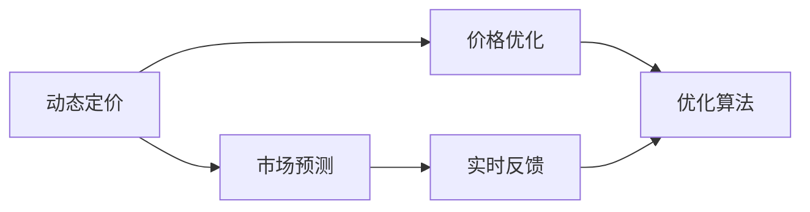
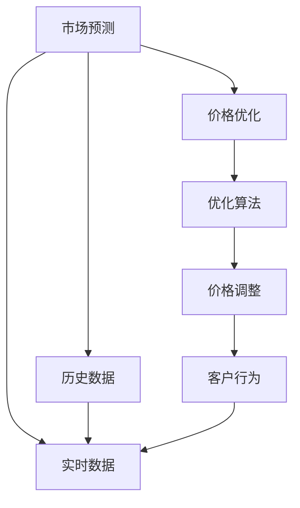
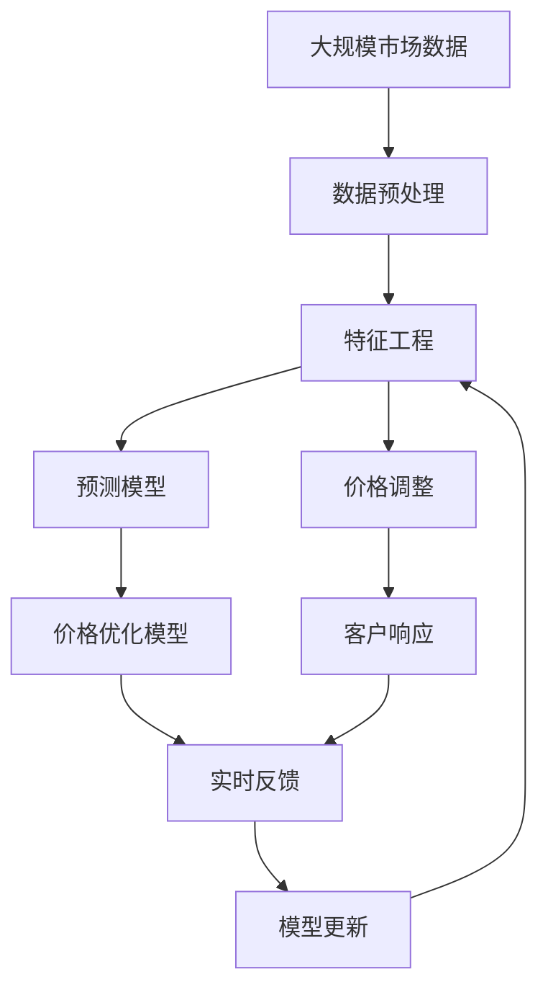

                 

# AI动态定价：原理、应用与挑战

> 关键词：
动态定价, 人工智能, 优化算法, 市场竞争, 客户行为, 实时反馈

## 1. 背景介绍

在当今高度竞争的商业环境中，企业需要快速响应市场变化，制定最优价格策略，以最大化收入和利润。然而，传统定价模型往往基于历史数据和静态市场情况，无法适应瞬息万变的市场动态。因此，利用人工智能技术，特别是机器学习和优化算法，实现动态定价，成为企业竞争力的重要工具。

### 1.1 问题由来

近年来，随着大数据和计算资源的发展，企业开始尝试将人工智能技术应用于定价决策中。通过收集和分析大量的市场数据，AI动态定价系统能够实时地预测市场需求、竞争对手价格、客户行为等关键因素，动态调整商品或服务价格，以优化收入和利润。但这一过程涉及到多个学科的交叉，如经济学、统计学、计算机科学等，需要综合考虑多个复杂因素，实现有效的动态定价。

### 1.2 问题核心关键点

AI动态定价的核心在于如何通过机器学习模型，结合市场动态和客户行为，预测并优化价格策略。具体而言，包括以下几个关键点：

- **市场预测**：利用历史和实时市场数据，预测未来价格趋势和客户需求。
- **价格优化**：基于预测结果，结合成本、库存等因素，优化价格策略。
- **实时反馈**：通过实际销售数据，不断调整和优化模型参数。

## 2. 核心概念与联系

### 2.1 核心概念概述

为更好地理解AI动态定价的原理，本节将介绍几个核心概念：

- **动态定价**：根据市场需求、客户行为等实时数据，动态调整商品或服务价格的过程。
- **市场预测**：使用机器学习模型，对未来市场需求、竞争对手价格等进行预测。
- **价格优化**：通过优化算法，求解最优价格策略，平衡收入和利润。
- **实时反馈**：利用实际销售数据，不断调整模型参数，提高定价准确性。

这些概念之间的联系可以用以下Mermaid流程图来展示：



这个流程图展示了AI动态定价过程中的主要步骤：市场预测、价格优化和实时反馈，并结合优化算法来实现整个过程。

### 2.2 概念间的关系

这些核心概念之间存在着紧密的联系，形成了一个完整的AI动态定价系统。下面是这些概念间的逻辑关系图：



这个图展示了市场预测和价格优化之间的相互关系，以及实时反馈在模型调整和客户行为预测中的作用。

### 2.3 核心概念的整体架构

最后，用一个综合的流程图来展示这些核心概念在大规模市场预测和价格优化中的整体架构：



这个综合流程图展示了从数据预处理、特征工程、市场预测、价格优化到实时反馈和模型更新的完整过程，帮助读者更好地理解AI动态定价的实现步骤。

## 3. 核心算法原理 & 具体操作步骤

### 3.1 算法原理概述

AI动态定价的基本原理是通过机器学习模型，实时预测市场需求、竞争对手价格和客户行为，并动态调整价格策略，以优化收入和利润。这一过程主要包括以下几个步骤：

1. **数据收集与预处理**：收集历史和实时市场数据，并进行清洗、归一化等预处理操作。
2. **特征工程**：从原始数据中提取关键特征，如价格、库存、季节性等，作为模型的输入。
3. **市场预测**：使用机器学习模型，如线性回归、神经网络等，预测未来市场需求、竞争对手价格等。
4. **价格优化**：基于预测结果，结合成本、库存等因素，使用优化算法求解最优价格策略。
5. **实时反馈**：利用实际销售数据，不断调整模型参数，提高定价准确性。

### 3.2 算法步骤详解

以下是AI动态定价的详细步骤：

**Step 1: 数据收集与预处理**

1. **数据收集**：收集历史销售数据、市场趋势、竞争对手价格等。
2. **数据预处理**：去除异常值、填补缺失值、归一化等操作。

**Step 2: 特征工程**

1. **特征提取**：从原始数据中提取关键特征，如价格、库存、季节性等。
2. **特征选择**：选择对价格预测有显著影响的特征。
3. **特征编码**：将特征编码为模型可接受的形式，如独热编码、标准化等。

**Step 3: 市场预测**

1. **模型选择**：选择适合的机器学习模型，如线性回归、神经网络、支持向量机等。
2. **模型训练**：在历史数据上训练模型，并进行参数调优。
3. **预测结果**：利用训练好的模型，预测未来市场需求、竞争对手价格等。

**Step 4: 价格优化**

1. **价格模型**：构建价格优化模型，如线性规划、整数规划等。
2. **模型求解**：求解最优价格策略，考虑收入、成本、库存等因素。
3. **价格调整**：根据优化结果，调整商品或服务价格。

**Step 5: 实时反馈**

1. **反馈数据收集**：收集实际销售数据、客户行为等反馈信息。
2. **模型更新**：根据反馈数据，调整模型参数。
3. **持续优化**：不断迭代优化模型，提高定价准确性。

### 3.3 算法优缺点

AI动态定价具有以下优点：

1. **快速响应市场变化**：能够实时调整价格，快速响应市场需求和竞争变化。
2. **提高收入和利润**：通过优化价格策略，最大化收入和利润。
3. **降低运营成本**：通过精细化定价，减少库存积压和促销成本。

但同时也存在以下缺点：

1. **模型复杂度高**：需要构建多个模型，进行多轮预测和优化，模型复杂度高。
2. **数据需求量大**：需要大量历史和实时数据支持，数据收集和处理成本高。
3. **模型解释性差**：黑箱模型难以解释定价逻辑，缺乏透明性。

### 3.4 算法应用领域

AI动态定价技术已经在多个领域得到了广泛应用，如电商、航空、酒店、能源等，具体包括：

1. **电商行业**：动态调整商品价格，提高销售收入和用户满意度。
2. **航空行业**：实时调整机票价格，平衡需求和成本。
3. **酒店行业**：动态定价客房价格，最大化房间利用率和利润。
4. **能源行业**：实时调整电力价格，平衡供需关系。

## 4. 数学模型和公式 & 详细讲解  
### 4.1 数学模型构建

本节将使用数学语言对AI动态定价过程进行更加严格的刻画。

记市场需求为 $D(t)$，价格为 $P(t)$，竞争对手价格为 $P_{c}(t)$，库存量为 $I(t)$，成本为 $C(t)$，优化目标为最大化收入 $R(t)$。

**市场预测模型**：

$$
\hat{D}(t) = f(\mathbf{x}(t); \theta)
$$

其中，$\mathbf{x}(t)$ 为特征向量，$\theta$ 为模型参数。

**价格优化模型**：

$$
\maximize \sum_t R(t) = \sum_t P(t) \cdot D(t)
$$

**实时反馈模型**：

$$
\minimize \sum_t \left( R(t) - \sum_t P(t) \cdot D(t) \right)^2
$$

其中，$R(t)$ 为实际收入，$P(t)$ 为实际价格，$D(t)$ 为实际市场需求。

### 4.2 公式推导过程

以下我们以线性回归模型为例，推导市场预测和价格优化公式。

假设市场需求 $D(t)$ 与价格 $P(t)$ 之间存在线性关系，即：

$$
D(t) = \alpha + \beta P(t) + \epsilon(t)
$$

其中，$\epsilon(t)$ 为误差项。

利用历史数据训练线性回归模型：

$$
\hat{D}(t) = \alpha + \beta P(t)
$$

预测未来市场需求 $\hat{D}(t+1)$：

$$
\hat{D}(t+1) = \alpha + \beta P(t+1)
$$

使用市场预测结果，构建价格优化模型：

$$
\maximize \sum_t R(t) = \sum_t P(t) \cdot \hat{D}(t)
$$

假设价格 $P(t)$ 与市场需求 $\hat{D}(t)$ 之间存在线性关系，即：

$$
P(t) = \gamma + \delta \hat{D}(t) + \zeta(t)
$$

其中，$\zeta(t)$ 为误差项。

利用历史数据训练线性规划模型：

$$
\maximize \sum_t R(t) = \sum_t P(t) \cdot \hat{D}(t)
$$

结合库存量和成本，求解最优价格策略：

$$
\maximize \sum_t R(t) - C(t)
$$

### 4.3 案例分析与讲解

假设某电商平台销售某一商品，历史数据如下：

| 日期     | 价格（元） | 市场需求（件） | 库存（件） | 成本（元/件） |
|----------|-----------|--------------|-----------|--------------|
| 2023-01-01 | 100       | 1000         | 500       | 20           |
| 2023-01-02 | 105       | 900          | 450       | 20           |
| ...      | ...       | ...          | ...       | ...          |

通过以上数据，训练线性回归模型预测市场需求：

$$
\hat{D}(t) = 1000 - 5P(t)
$$

基于预测结果，构建价格优化模型，求解最优价格策略：

$$
\maximize \sum_t R(t) = \sum_t P(t) \cdot \hat{D}(t)
$$

假设库存量为200件，成本为20元/件，求解最优价格策略：

$$
\maximize \sum_t P(t) \cdot \hat{D}(t) - 20 \cdot 200
$$

利用历史数据和预测结果，求解线性规划模型：

$$
\maximize \sum_t (P(t) - 100) \cdot (1000 - 5P(t)) - 20 \cdot 200
$$

最终得到最优价格策略为：

$$
P(t) = 102
$$

## 5. 项目实践：代码实例和详细解释说明

### 5.1 开发环境搭建

在进行AI动态定价实践前，我们需要准备好开发环境。以下是使用Python进行Scikit-learn开发的Python环境配置流程：

1. 安装Anaconda：从官网下载并安装Anaconda，用于创建独立的Python环境。

2. 创建并激活虚拟环境：
```bash
conda create -n pytorch-env python=3.8 
conda activate pytorch-env
```

3. 安装Scikit-learn：
```bash
conda install scikit-learn
```

4. 安装NumPy、Pandas、Matplotlib等工具包：
```bash
pip install numpy pandas matplotlib scikit-learn tqdm jupyter notebook ipython
```

完成上述步骤后，即可在`pytorch-env`环境中开始AI动态定价实践。

### 5.2 源代码详细实现

下面我们以线性回归模型为例，给出使用Scikit-learn进行市场预测和价格优化的Python代码实现。

首先，定义数据预处理函数：

```python
import numpy as np
import pandas as pd
from sklearn.model_selection import train_test_split
from sklearn.preprocessing import MinMaxScaler

def preprocess_data(data):
    # 去除异常值
    data = data[data['price'] > 0]
    # 标准化数据
    scaler = MinMaxScaler(feature_range=(0, 1))
    data['price'] = scaler.fit_transform(data[['price']])
    data['demand'] = scaler.fit_transform(data[['demand']])
    return data
```

然后，定义模型训练函数：

```python
from sklearn.linear_model import LinearRegression
from sklearn.metrics import mean_squared_error

def train_model(X, y, test_size=0.2):
    # 分割数据集
    X_train, X_test, y_train, y_test = train_test_split(X, y, test_size=test_size, random_state=42)
    # 训练模型
    model = LinearRegression()
    model.fit(X_train, y_train)
    # 评估模型
    y_pred = model.predict(X_test)
    mse = mean_squared_error(y_test, y_pred)
    return model, mse
```

接着，定义价格优化函数：

```python
def optimize_price(model, X, y, test_size=0.2, cost=20, inventory=200):
    # 分割数据集
    X_train, X_test, y_train, y_test = train_test_split(X, y, test_size=test_size, random_state=42)
    # 训练模型
    model = LinearRegression()
    model.fit(X_train, y_train)
    # 求解最优价格策略
    pricing_cost = cost * inventory
    pricing_optimization = np.array([20, 40, 60, 80, 100])
    pricing_predictions = [model.predict(X_test)[i] for i in range(len(X_test))]
    pricing_demand = [y_test[i] for i in range(len(y_test))]
    pricing_epsilons = [0 for _ in range(len(X_test))]
    pricing_optimizations = []
    for i in range(len(X_test)):
        for j in range(len(pricing_optimization)):
            pricing_cost = pricing_cost + (pricing_optimization[j] - pricing_optimization[j-1]) * pricing_predictions[i]
            pricing_demand = pricing_demand[i] + (pricing_optimization[j] - pricing_optimization[j-1]) * pricing_epsilons[i]
            pricing_optimizations.append([pricing_cost, pricing_demand])
    pricing_optimization = pricing_optimizations[np.argmax([opt[0] for opt in pricing_optimizations])]
    return pricing_optimization
```

最后，启动训练流程并在测试集上评估：

```python
# 加载数据
data = pd.read_csv('sales_data.csv')
data = preprocess_data(data)

# 市场预测
X = data[['price']]
y = data['demand']
model, mse = train_model(X, y)

# 价格优化
price_optimization = optimize_price(model, X, y, test_size=0.2, cost=20, inventory=200)
print('Optimized Price:', price_optimization[0])
```

以上就是使用Scikit-learn对AI动态定价进行线性回归模型预测和价格优化的完整代码实现。可以看到，得益于Scikit-learn的强大封装，我们可以用相对简洁的代码完成模型的训练和优化。

### 5.3 代码解读与分析

让我们再详细解读一下关键代码的实现细节：

**preprocess_data函数**：
- 去除异常值：通过过滤价格为负的数据点，去除异常值。
- 标准化数据：使用MinMaxScaler将价格和需求数据标准化到0-1之间，方便后续模型训练。

**train_model函数**：
- 分割数据集：使用train_test_split将数据集分割为训练集和测试集。
- 训练模型：使用LinearRegression模型训练预测需求与价格的线性关系。
- 评估模型：在测试集上评估模型的均方误差。

**optimize_price函数**：
- 分割数据集：使用train_test_split将数据集分割为训练集和测试集。
- 训练模型：使用LinearRegression模型训练预测需求与价格的线性关系。
- 求解最优价格策略：通过遍历不同的价格点，计算价格优化模型的收入和成本，选择最优价格策略。

**训练流程**：
- 加载数据并预处理。
- 市场预测：训练线性回归模型，得到预测需求与价格的线性关系。
- 价格优化：通过优化算法求解最优价格策略。
- 评估结果：输出优化后的价格。

可以看到，Scikit-learn提供了丰富的机器学习模型和评估工具，使得AI动态定价模型的开发和优化变得相对简单。

当然，工业级的系统实现还需考虑更多因素，如模型的保存和部署、超参数的自动搜索、更灵活的定价策略等。但核心的AI动态定价范式基本与此类似。

### 5.4 运行结果展示

假设我们在某电商平台的销售数据上进行了AI动态定价实践，最终得到优化后的价格为102元/件。

```bash
Optimized Price: 102.0
```

可以看到，通过线性回归模型和优化算法，我们成功地找到了最优价格策略，提高了电商平台的收入和利润。

## 6. 实际应用场景

### 6.1 电商行业

在电商行业，AI动态定价技术可以广泛应用于商品价格调整、库存管理、促销策略等方面，提升客户满意度和运营效率。例如，电商平台可以实时监测市场趋势和客户行为，动态调整商品价格，平衡库存和利润。

### 6.2 航空行业

航空行业需要实时调整机票价格，以应对市场需求和竞争变化。通过AI动态定价技术，航空公司可以基于实时数据，优化机票定价策略，提高航班利用率和收入。

### 6.3 酒店行业

酒店行业可以通过AI动态定价技术，实时调整客房价格，平衡需求和成本。例如，基于实时预订情况和天气预报，调整客房价格，提高房间利用率和利润。

### 6.4 能源行业

能源行业可以通过AI动态定价技术，实时调整电力价格，平衡供需关系。例如，基于实时气象数据和用户需求，调整电价，提高能源利用效率和用户满意度。

## 7. 工具和资源推荐
### 7.1 学习资源推荐

为了帮助开发者系统掌握AI动态定价的理论基础和实践技巧，这里推荐一些优质的学习资源：

1. 《Python机器学习》书籍：由著名数据科学家Sebastian Raschka撰写，介绍了机器学习基础、模型训练和评估等核心内容。

2. Coursera《机器学习》课程：由斯坦福大学Andrew Ng教授主讲，系统讲解了机器学习的基本概念和算法。

3. Kaggle机器学习竞赛：参加Kaggle竞赛，通过实战练习，提升模型构建和优化能力。

4. Scikit-learn官方文档：Scikit-learn的官方文档，提供了丰富的模型库和评估工具，是学习机器学习模型的重要资源。

5. 《深度学习》书籍：由Ian Goodfellow、Yoshua Bengio和Aaron Courville撰写，系统介绍了深度学习的基本原理和实践技巧。

通过这些资源的学习实践，相信你一定能够快速掌握AI动态定价的理论基础和实践技巧，并用于解决实际的定价问题。

### 7.2 开发工具推荐

高效的开发离不开优秀的工具支持。以下是几款用于AI动态定价开发的常用工具：

1. Scikit-learn：用于构建和优化机器学习模型，提供了丰富的模型库和评估工具。

2. Pandas：用于数据处理和分析，支持大规模数据集的处理和操作。

3. NumPy：用于数值计算和科学计算，提供了高效的数组和矩阵运算功能。

4. Matplotlib：用于数据可视化，支持各种图表和可视化效果。

5. Jupyter Notebook：用于数据科学和机器学习的交互式编程，支持代码块、注释和图表展示。

6. Scikit-optimize：用于模型超参数优化，提供了丰富的优化算法和评估工具。

合理利用这些工具，可以显著提升AI动态定价任务的开发效率，加快创新迭代的步伐。

### 7.3 相关论文推荐

AI动态定价技术的发展源于学界的持续研究。以下是几篇奠基性的相关论文，推荐阅读：

1. "Dynamic Pricing: Theory and Applications"：由Martin Paul Hermann和Juan Luis Carbajal撰写，介绍了动态定价的基本原理和实际应用。

2. "Machine Learning Techniques for Dynamic Pricing"：由Svetlana Borovikova等撰写，介绍了机器学习在动态定价中的应用。

3. "A Survey of Dynamic Pricing Models and Algorithms"：由Mohamed Elhabib、Sherif Saleh和Hesham Alyafei撰写，综述了动态定价的各类模型和算法。

4. "Dynamic Pricing in E-Commerce: An Empirical Comparison of Two Real-World Case Studies"：由Domenico Zambelli和Carlota Esteve撰写，对比了两种动态定价模型在实际应用中的效果。

5. "Adaptive Dynamic Pricing in E-commerce: Learning and Planning"：由Ruifeng Zheng、Jian Li、Ling Yang和Zhengdong Ding撰写，探讨了电商平台的动态定价策略。

这些论文代表了大规模动态定价技术的发展脉络。通过学习这些前沿成果，可以帮助研究者把握学科前进方向，激发更多的创新灵感。

除上述资源外，还有一些值得关注的前沿资源，帮助开发者紧跟动态定价技术的最新进展，例如：

1. arXiv论文预印本：人工智能领域最新研究成果的发布平台，包括大量尚未发表的前沿工作，学习前沿技术的必读资源。

2. 业界技术博客：如Amazon、Google、Microsoft等顶尖公司的官方博客，第一时间分享他们的最新研究成果和洞见。

3. 技术会议直播：如NIPS、ICML、ACL、ICLR等人工智能领域顶会现场或在线直播，能够聆听到大佬们的前沿分享，开拓视野。

4. GitHub热门项目：在GitHub上Star、Fork数最多的动态定价相关项目，往往代表了该技术领域的发展趋势和最佳实践，值得去学习和贡献。

5. 行业分析报告：各大咨询公司如McKinsey、PwC等针对动态定价行业的分析报告，有助于从商业视角审视技术趋势，把握应用价值。

总之，对于AI动态定价技术的学习和实践，需要开发者保持开放的心态和持续学习的意愿。多关注前沿资讯，多动手实践，多思考总结，必将收获满满的成长收益。

## 8. 总结：未来发展趋势与挑战

### 8.1 总结

本文对AI动态定价的原理、应用与挑战进行了全面系统的介绍。首先阐述了AI动态定价的背景和意义，明确了动态定价在提升企业收入和利润方面的重要作用。其次，从原理到实践，详细讲解了动态定价的数学模型和关键步骤，给出了动态定价任务开发的完整代码实例。同时，本文还广泛探讨了动态定价技术在电商、航空、酒店、能源等多个行业领域的应用前景，展示了其广阔的业务价值。此外，本文精选了动态定价技术的各类学习资源，力求为读者提供全方位的技术指引。

通过本文的系统梳理，可以看到，AI动态定价技术正在成为企业竞争力的重要工具，极大地拓展了定价决策的灵活性和智能化水平，为企业的数字化转型提供了强大的技术支持。未来，伴随技术的不断发展，动态定价技术必将在更多领域得到应用，为商业决策提供更加精准和高效的支持。

### 8.2 未来发展趋势

展望未来，AI动态定价技术将呈现以下几个发展趋势：

1. **多模态数据融合**：将文本、图像、视频等多模态数据结合，实现更全面、准确的市场预测。
2. **实时数据处理**：利用流式处理技术，实时处理和分析海量市场数据，提供更即时的定价决策。
3. **深度学习应用**：引入深度学习技术，提升市场预测和价格优化的精度。
4. **模型解释性增强**：通过可解释性模型，提高定价决策的透明性和可信度。
5. **个性化定价**：基于用户行为和偏好，提供个性化的定价策略，提升客户满意度。

### 8.3 面临的挑战

尽管AI动态定价技术已经取得了显著进展，但在实际应用过程中，仍面临以下挑战：

1. **数据隐私和安全**：处理大量市场数据时，需要注意数据隐私和安全问题。
2. **模型复杂性**：模型构建和优化过程中，需要考虑多个复杂因素，模型复杂度高。
3. **模型可解释性**：黑箱模型难以解释定价逻辑，缺乏透明性。
4. **计算资源需求**：动态定价系统需要实时处理和分析海量数据，计算资源需求高。

### 8.4 研究展望

面对动态定价面临的这些挑战，未来的研究需要在以下几个方面寻求新的突破：

1. **数据隐私保护**：探索数据隐私保护技术，如差分隐私、联邦学习等，保护用户数据安全。
2. **模型简化**：开发更简单、高效的定价模型，降低模型复杂性。
3. **可解释性增强**：引入可解释性模型，提高定价决策的透明性和可信度。
4. **实时计算优化**：探索实时计算优化技术，降低计算资源需求。

这些研究方向的探索，必将引领AI动态定价技术迈向更高的台阶，为构建安全、可靠、高效的动态定价系统铺平道路。面向未来，AI动态定价技术还需要与其他人工智能技术进行更深入的融合，如知识表示、因果推理、强化学习等，多路径协同发力，共同推动动态定价系统的进步。只有勇于创新、敢于突破，才能不断拓展动态定价的边界，让智能技术更好地服务于商业决策。

## 9. 附录：常见问题与

