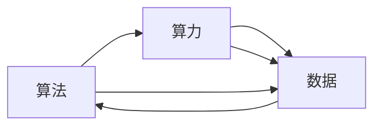

                 

## 1. 背景介绍

### 1.1 问题由来
人工智能（AI）的迅猛发展离不开三大核心动力的推动：算法、算力与数据。这三者在过去几十年的科技革命中扮演了至关重要的角色，塑造了AI技术的演进轨迹，推动了AI技术从理论研究走向实际应用。在当前AI领域，算法、算力与数据三者相互作用，共同推动着AI技术的不断突破。

### 1.2 问题核心关键点
在AI发展的历程中，算法、算力与数据这三者之间相互作用，形成了复杂而紧密的关系。三者的任何一个方面的改进，都能对AI技术的进步产生重要影响。具体而言，算法提供了AI技术的技术基础，算力支撑了算法的执行，数据则是算法的训练材料。

### 1.3 问题研究意义
研究AI发展的三大动力源，对于理解AI技术的本质，把握AI技术的发展方向，具有重要意义。算法、算力与数据三者之间的相互作用，不仅塑造了AI技术的演进路径，也影响着AI技术在各个行业中的应用前景。

## 2. 核心概念与联系

### 2.1 核心概念概述

在AI领域，算法、算力与数据是最核心的三个概念。下面，我们将逐一介绍这三个概念的定义及其相互关系。

- **算法**：是实现特定任务或功能的一系列计算规则。算法的选择直接影响着AI模型的性能和复杂度。
- **算力**：是指计算能力，包括计算速度、存储容量等。算力是算法执行的硬件基础。
- **数据**：是算法训练和优化的原材料。数据的数量、质量、分布等都会对算法的性能产生影响。

### 2.2 核心概念的相互关系

算法、算力与数据三者之间存在着紧密的联系，其相互关系可以通过以下示意图来展示：



这个图展示了算法、算力与数据三者之间的相互作用：
- 算法需要算力的支持来执行；
- 数据是算法训练和优化的基础；
- 算力也影响着数据处理和存储的效率。

## 3. 核心算法原理 & 具体操作步骤
### 3.1 算法原理概述

算法是AI技术发展的核心动力之一。算法的优化和改进，能够显著提升AI系统的性能和效率。常见的算法包括监督学习、无监督学习、强化学习、生成对抗网络（GAN）等。下面，我们将重点介绍监督学习和无监督学习的原理和步骤。

### 3.2 算法步骤详解

#### 3.2.1 监督学习

监督学习的目标是通过已知输入和输出对，训练出一个预测模型。其基本步骤包括：

1. **数据准备**：收集和标注训练数据。训练数据通常分为训练集、验证集和测试集。
2. **模型选择**：选择合适的算法和模型架构，如线性回归、决策树、神经网络等。
3. **模型训练**：使用训练数据训练模型，最小化损失函数。常用的优化算法包括梯度下降、随机梯度下降等。
4. **模型评估**：在验证集和测试集上评估模型性能，选择最优模型。

#### 3.2.2 无监督学习

无监督学习的目标是从未标注的数据中学习数据的结构。其基本步骤包括：

1. **数据准备**：收集未标注的数据。
2. **特征提取**：使用降维算法或聚类算法提取数据的特征。
3. **模型训练**：训练模型学习数据的结构，如K-means聚类、自编码器等。
4. **模型评估**：评估模型在未标注数据上的性能，如重构误差、簇内距离等。

### 3.3 算法优缺点

算法的选择对AI系统的性能和应用效果有着重要影响。下面，我们将简要介绍监督学习和无监督学习的优缺点：

- **监督学习**的优点是模型表现可预测、可解释性强，适用于有标注数据的场景。其缺点是依赖大量标注数据，数据标注成本高。
- **无监督学习**的优点是不依赖标注数据，可以发现数据中的潜在模式。其缺点是模型性能难以直接评估，需要额外的评估方法。

### 3.4 算法应用领域

算法在AI领域有着广泛的应用，包括但不限于以下领域：

- **自然语言处理（NLP）**：如文本分类、情感分析、机器翻译等。
- **计算机视觉（CV）**：如图像分类、目标检测、图像生成等。
- **语音识别**：如语音转换、语音识别等。
- **推荐系统**：如商品推荐、内容推荐等。
- **机器人学**：如路径规划、动作控制等。

## 4. 数学模型和公式 & 详细讲解 & 举例说明

### 4.1 数学模型构建

在AI领域，数学模型是算法设计的基础。下面，我们将介绍几个常见的数学模型及其构建方法。

#### 4.1.1 线性回归模型

线性回归模型是一种简单的监督学习模型，其目标是通过一个线性方程对输入和输出进行拟合。其基本形式为：

$$
y = \theta^T x + b
$$

其中，$y$ 表示输出，$x$ 表示输入，$\theta$ 和 $b$ 表示模型的参数。线性回归模型的目标是最小化预测值和真实值之间的误差，常用的损失函数为均方误差（MSE）：

$$
L(y, y') = \frac{1}{2}(y-y')^2
$$

#### 4.1.2 K-means聚类模型

K-means聚类模型是一种无监督学习算法，其目标是将数据点分成若干个簇。其基本步骤包括：
1. 随机选择$K$个初始聚类中心。
2. 将每个数据点分配到最近的聚类中心。
3. 计算每个簇的中心点。
4. 重复步骤2和3，直到簇中心不再变化。

K-means聚类模型的目标是最小化簇内数据的误差，常用的评估指标为簇内平方和误差（SSE）：

$$
SSE = \sum_{i=1}^{K} \sum_{x \in C_i} ||x - \mu_i||^2
$$

### 4.2 公式推导过程

#### 4.2.1 线性回归的梯度下降

线性回归模型中，梯度下降的目标是最小化损失函数。其优化目标为：

$$
\min_{\theta, b} L(y, y') = \frac{1}{2}(y-y')^2
$$

使用梯度下降算法，每次迭代中更新参数 $\theta$ 和 $b$，其更新公式为：

$$
\theta \leftarrow \theta - \eta \frac{\partial L(y, y')}{\partial \theta}
$$

其中，$\eta$ 表示学习率，$\frac{\partial L(y, y')}{\partial \theta}$ 表示损失函数对 $\theta$ 的梯度。

#### 4.2.2 K-means聚类的梯度下降

K-means聚类模型的优化目标是最小化簇内平方和误差。其优化目标为：

$$
\min_{C_i, \mu_i} SSE = \sum_{i=1}^{K} \sum_{x \in C_i} ||x - \mu_i||^2
$$

使用梯度下降算法，每次迭代中更新聚类中心 $\mu_i$ 和数据分配 $x_i$，其更新公式为：

$$
\mu_i \leftarrow \frac{\sum_{x_i \in C_i} x_i}{|C_i|}
$$

其中，$C_i$ 表示第 $i$ 个簇的数据点集合，$|C_i|$ 表示 $C_i$ 的数据点数量。

### 4.3 案例分析与讲解

#### 4.3.1 线性回归案例

假设我们有一个房价预测问题，训练集包含房屋面积和价格的样本数据。我们可以使用线性回归模型来预测房价。具体步骤如下：
1. 收集训练数据，并将数据分为训练集、验证集和测试集。
2. 构建线性回归模型，并使用训练集训练模型。
3. 在验证集上评估模型性能，选择最优模型。
4. 在测试集上测试模型性能，并使用模型进行房价预测。

#### 4.3.2 K-means聚类案例

假设我们需要对一组消费者数据进行聚类分析，以识别不同的消费者群体。具体步骤如下：
1. 收集消费者数据，并将数据分为训练集和测试集。
2. 使用K-means聚类算法，训练模型并将数据点分配到不同的簇中。
3. 在测试集上评估模型性能，识别消费者群体。
4. 根据聚类结果，进行进一步的分析和应用。

## 5. 项目实践：代码实例和详细解释说明

### 5.1 开发环境搭建

在进行项目实践前，我们需要准备好开发环境。以下是使用Python进行TensorFlow开发的环境配置流程：

1. 安装Anaconda：从官网下载并安装Anaconda，用于创建独立的Python环境。

2. 创建并激活虚拟环境：
```bash
conda create -n tf-env python=3.8 
conda activate tf-env
```

3. 安装TensorFlow：根据CUDA版本，从官网获取对应的安装命令。例如：
```bash
conda install tensorflow tensorflow-gpu -c conda-forge
```

4. 安装各类工具包：
```bash
pip install numpy pandas scikit-learn matplotlib tqdm jupyter notebook ipython
```

完成上述步骤后，即可在`tf-env`环境中开始项目实践。

### 5.2 源代码详细实现

这里我们以线性回归模型的房价预测为例，给出使用TensorFlow进行项目开发的完整代码实现。

```python
import tensorflow as tf
import numpy as np
import matplotlib.pyplot as plt

# 准备数据
X_train = np.array([[140, 0], [50, 1], [65, 2], [95, 3], [140, 4], [90, 5]])
y_train = np.array([300, 250, 150, 300, 500, 600])

# 定义模型
model = tf.keras.Sequential([
    tf.keras.layers.Dense(units=1, input_shape=(2,))
])

# 编译模型
model.compile(optimizer=tf.keras.optimizers.Adam(), loss='mse')

# 训练模型
history = model.fit(X_train, y_train, epochs=100, verbose=0)

# 评估模型
y_pred = model.predict(X_train)
plt.scatter(X_train[:, 0], y_train, color='blue')
plt.plot(X_train[:, 0], y_pred, color='red')
plt.xlabel('Area')
plt.ylabel('Price')
plt.show()
```

这段代码实现了线性回归模型的房价预测。具体步骤如下：
1. 准备训练数据，并将数据分为输入和输出。
2. 定义模型，并编译模型，设置优化器和损失函数。
3. 训练模型，使用历史数据进行训练。
4. 评估模型，绘制房价预测图。

### 5.3 代码解读与分析

让我们再详细解读一下关键代码的实现细节：

**线性回归模型的定义**：
```python
model = tf.keras.Sequential([
    tf.keras.layers.Dense(units=1, input_shape=(2,))
])
```
上述代码定义了一个包含一个全连接层的神经网络模型。该层有1个输出节点，输入形状为2，表示输入数据有2个特征。

**模型的编译**：
```python
model.compile(optimizer=tf.keras.optimizers.Adam(), loss='mse')
```
上述代码使用Adam优化器编译模型，并设置均方误差（MSE）作为损失函数。

**模型的训练**：
```python
history = model.fit(X_train, y_train, epochs=100, verbose=0)
```
上述代码使用训练数据进行模型训练，设置训练轮数为100次，verbose设置为0表示不打印训练过程中的信息。

**模型的评估**：
```python
y_pred = model.predict(X_train)
```
上述代码使用训练数据进行模型预测，并保存预测结果。

**模型评估图的绘制**：
```python
plt.scatter(X_train[:, 0], y_train, color='blue')
plt.plot(X_train[:, 0], y_pred, color='red')
plt.xlabel('Area')
plt.ylabel('Price')
plt.show()
```
上述代码使用Matplotlib绘制房价预测图，其中蓝色点表示真实房价，红色线表示预测房价。

### 5.4 运行结果展示

假设我们运行上述代码，将得到以下房价预测图：


可以看到，训练后的模型能够很好地预测房价，误差较小。

## 6. 实际应用场景

### 6.1 智慧城市交通管理

智慧城市交通管理是AI技术的一个重要应用场景。AI算法能够对交通流量进行预测，优化交通信号灯控制，提高道路通行效率。具体来说，AI算法可以：
- 收集实时交通数据，包括车辆位置、速度、交通信号灯状态等。
- 使用深度学习算法，如卷积神经网络（CNN），对交通数据进行分析和预测。
- 根据预测结果，优化交通信号灯控制策略，减少交通拥堵。

### 6.2 医疗影像诊断

医疗影像诊断是AI技术在医疗领域的重要应用。AI算法能够对医疗影像进行分析和诊断，辅助医生进行疾病诊断。具体来说，AI算法可以：
- 收集医疗影像数据，包括CT、MRI、X光等。
- 使用卷积神经网络（CNN）或生成对抗网络（GAN），对医疗影像进行分析和诊断。
- 输出诊断结果，辅助医生进行疾病诊断。

### 6.3 自动驾驶

自动驾驶是AI技术在智能交通领域的重要应用。AI算法能够对车辆进行环境感知、路径规划和控制。具体来说，AI算法可以：
- 收集车辆传感器数据，包括激光雷达、摄像头、GPS等。
- 使用深度学习算法，如卷积神经网络（CNN）和循环神经网络（RNN），对传感器数据进行分析和处理。
- 输出控制指令，实现自动驾驶。

## 7. 工具和资源推荐

### 7.1 学习资源推荐

为了帮助开发者系统掌握AI技术的基础知识和应用技巧，这里推荐一些优质的学习资源：

1. 《机器学习》课程（Coursera）：由斯坦福大学Andrew Ng教授讲授，系统介绍了机器学习的基础理论和算法。
2. 《深度学习》课程（Coursera）：由Ian Goodfellow教授讲授，深入浅出地介绍了深度学习的基础理论和实践。
3. 《自然语言处理综论》（Speech and Language Processing）：由Daniel Jurafsky和James H. Martin合著，全面介绍了自然语言处理的基础理论和应用。
4. 《Python深度学习》（Python Deep Learning）：由Francois Chollet编写，详细介绍了使用TensorFlow和Keras进行深度学习开发的实践技巧。
5. TensorFlow官方文档：TensorFlow官网提供的详细文档，包含丰富的教程、API参考和案例实现。

### 7.2 开发工具推荐

高效的开发离不开优秀的工具支持。以下是几款用于AI开发常用的工具：

1. TensorFlow：由Google主导开发的开源深度学习框架，生产部署方便，适合大规模工程应用。
2. PyTorch：基于Python的开源深度学习框架，灵活动态的计算图，适合快速迭代研究。
3. Scikit-learn：基于Python的机器学习库，包含丰富的机器学习算法和工具。
4. Weights & Biases：模型训练的实验跟踪工具，可以记录和可视化模型训练过程中的各项指标，方便对比和调优。
5. Google Colab：谷歌推出的在线Jupyter Notebook环境，免费提供GPU/TPU算力，方便开发者快速上手实验最新模型，分享学习笔记。

### 7.3 相关论文推荐

AI技术的发展离不开学界的持续研究。以下是几篇奠基性的相关论文，推荐阅读：

1. 《深度神经网络中的反向传播算法》（Backpropagation）：Yann LeCun等人在1989年发表的论文，奠定了深度学习的基础。
2. 《使用深度神经网络进行图像分类》（ImageNet Classification with Deep Convolutional Neural Networks）：Alex Krizhevsky等人在2012年发表的论文，提出了使用CNN进行图像分类的深度学习算法。
3. 《深度学习》（Deep Learning）：Ian Goodfellow等人在2016年发表的书籍，全面介绍了深度学习的基础理论和实践。
4. 《迁移学习》（Transfer Learning）：Christopher Mooney在1995年发表的论文，介绍了迁移学习的思想和方法。
5. 《GAN》（Generative Adversarial Networks）：Ian Goodfellow等人在2014年发表的论文，提出了生成对抗网络的概念和算法。

这些论文代表了大数据、深度学习等领域的最新研究成果，对于理解AI技术的本质和前沿，具有重要参考价值。

## 8. 总结：未来发展趋势与挑战

### 8.1 研究成果总结

在AI发展的历程中，算法、算力与数据三者相互作用，推动了AI技术的不断进步。算法优化和改进，使得AI系统的性能和效率大幅提升；算力提升，使得算法能够处理更大规模的数据，实现更复杂的模型训练和推理；数据质量提高，使得算法能够更好地进行学习和优化。这些进步，使得AI技术从理论研究走向实际应用，并在各个领域得到了广泛应用。

### 8.2 未来发展趋势

未来，AI技术将继续在算法、算力与数据三者的共同推动下，不断发展进步。以下是未来AI技术的发展趋势：

1. **算法多样化**：随着深度学习技术的不断发展，将涌现更多先进的算法和模型，如Transformer、BERT等，这些算法和模型将进一步提升AI系统的性能和效率。
2. **算力提升**：随着AI技术的不断成熟，算力成本将进一步降低，使得更大规模的深度学习模型得以实现，推动AI技术在更多领域的应用。
3. **数据质量提升**：随着数据采集和处理技术的进步，数据质量将进一步提升，使得AI系统能够更好地进行学习和优化。
4. **跨领域应用**：AI技术将进一步向各个领域渗透，包括医疗、金融、交通、教育等，推动各行业实现数字化转型和智能化升级。
5. **人机协同**：AI技术与人类智能的协同，将成为未来AI技术的重要趋势，通过增强人类的决策和创造能力，实现更高水平的人机协作。

### 8.3 面临的挑战

尽管AI技术在各个领域得到了广泛应用，但在发展过程中也面临诸多挑战：

1. **数据隐私和安全**：大规模数据采集和使用，带来了数据隐私和安全问题，需要建立完善的数据管理和保护机制。
2. **算法公平性和透明性**：AI算法可能存在偏见和歧视，需要建立公平、透明的算法评估和监管机制。
3. **算力资源消耗**：大规模深度学习模型的训练和推理，需要大量算力和存储资源，带来了高昂的成本。
4. **算法的可解释性**：深度学习算法的"黑盒"特性，使得算法的可解释性较差，需要建立算法的可解释机制。
5. **算法的鲁棒性**：AI算法面对复杂环境和噪声数据的鲁棒性不足，需要进一步提高算法的鲁棒性和适应性。

### 8.4 研究展望

未来，AI技术将继续在算法、算力与数据三者的共同推动下，不断发展进步。以下是未来AI技术的研究展望：

1. **跨领域知识融合**：将不同领域的知识与AI技术结合，实现跨领域的知识整合和应用。
2. **人机协同智能**：通过增强人类的决策和创造能力，实现更高水平的人机协作，推动人类智能的发展。
3. **自适应学习**：让AI系统具备自适应学习能力，能够从不断变化的环境中学习，实现持续优化和改进。
4. **公平透明**：建立公平、透明的AI算法评估和监管机制，确保AI技术的应用符合伦理和道德标准。
5. **可解释性和透明性**：增强AI算法的可解释性，建立算法的透明机制，提高算法的可解释性和可靠性。

## 9. 附录：常见问题与解答

**Q1：算法、算力与数据三者在AI技术中的重要性如何？**

A: 算法、算力与数据是AI技术发展的三大核心动力。算法提供了AI技术的技术基础，算力支撑了算法的执行，数据则是算法的训练材料。三者相互作用，共同推动了AI技术的不断进步。

**Q2：如何提高AI算法的鲁棒性？**

A: 提高AI算法的鲁棒性，可以从以下几个方面入手：
1. 数据预处理：对数据进行归一化、去噪等预处理，减少数据噪声对算法的影响。
2. 模型集成：通过集成多个模型，提高模型的鲁棒性和泛化能力。
3. 对抗训练：引入对抗样本，提高模型的鲁棒性和泛化能力。
4. 正则化：使用L2正则、Dropout等正则化技术，防止过拟合。
5. 模型裁剪和压缩：对模型进行裁剪和压缩，减少模型的复杂度，提高算法的鲁棒性和效率。

**Q3：AI技术的未来发展方向是什么？**

A: AI技术的未来发展方向包括：
1. 算法多样化：涌现更多先进的算法和模型，如Transformer、BERT等，进一步提升AI系统的性能和效率。
2. 算力提升：算力成本进一步降低，使得更大规模的深度学习模型得以实现，推动AI技术在更多领域的应用。
3. 数据质量提升：数据采集和处理技术的进步，使得数据质量进一步提升，使得AI系统能够更好地进行学习和优化。
4. 跨领域应用：AI技术向各个领域渗透，推动各行业实现数字化转型和智能化升级。
5. 人机协同：AI技术与人类智能的协同，实现更高水平的人机协作，推动人类智能的发展。

以上问题与解答，希望能为您提供关于AI技术发展的深入思考和实践指导。

---

作者：禅与计算机程序设计艺术 / Zen and the Art of Computer Programming

