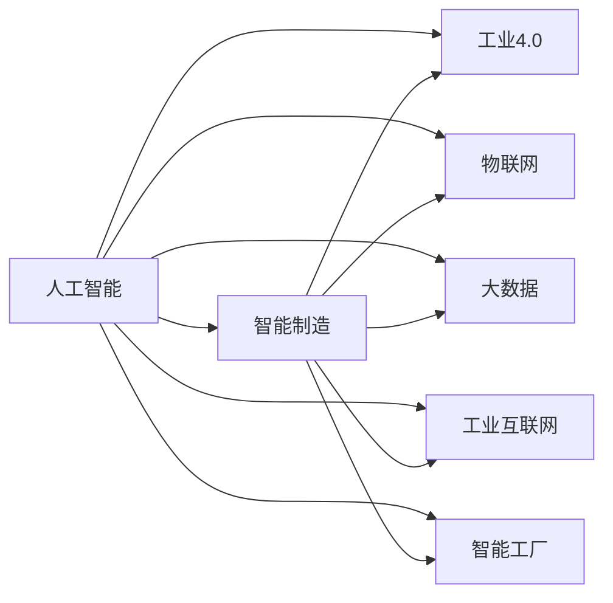

                 

# AI在智能制造中的应用:工业4.0的核心

## 1. 背景介绍

### 1.1 问题由来

在过去的几十年里，工业生产经历了从机械化、自动化到信息化再到智能化的演变。随着物联网、大数据、人工智能等技术的迅猛发展，智能制造已成为工业4.0时代的新趋势。工业4.0强调通过高度集成和优化的信息物理系统，实现从产品设计到生产、运维、服务的全生命周期智能化管理。在这一过程中，人工智能（AI）扮演着核心角色，通过感知、学习、决策和执行等智能环节，推动制造业的转型升级。

### 1.2 问题核心关键点

AI在智能制造中的应用，核心在于通过智能化手段提升生产效率、优化产品质量、降低运营成本，并实现个性化定制和灵活生产。AI技术的优势在于其强大的数据分析能力、自适应学习和预测分析功能，能够为智能制造提供强有力的技术支撑。

### 1.3 问题研究意义

AI在智能制造中的应用，对于推动制造业向高质量、高效率、低成本、个性化方向发展具有重要意义。具体而言：

- 提升生产效率：AI能够实时监测生产过程，预测设备故障，自动调度生产任务，提高生产线的运行效率。
- 优化产品质量：AI通过对生产数据进行深度学习，识别缺陷和异常，实现质量控制和质量改进。
- 降低运营成本：AI通过预测性维护、自动化检测等技术，减少停机时间和维修成本，降低能源消耗。
- 实现个性化定制：AI能够根据客户需求，动态调整生产工艺，实现个性化产品制造。
- 推动灵活生产：AI技术能够支持小批量、多品种的生产方式，增强企业的市场响应能力。

## 2. 核心概念与联系

### 2.1 核心概念概述

为了更好地理解AI在智能制造中的应用，首先需要明确一些核心概念及其相互关系：

- **人工智能（AI）**：通过机器学习、深度学习、计算机视觉等技术，使机器能够模拟人类智能行为，实现自主决策和适应环境的能力。
- **智能制造**：以信息物理系统为基础，通过物联网、云计算、大数据、AI等技术，实现生产过程的智能化、协同化和数字化管理。
- **工业4.0**：由德国提出，旨在通过网络化、信息化和智能化技术，实现制造业的全面转型升级，提高生产效率和产品质量。
- **物联网（IoT）**：通过互联网将物理设备、传感器、工业设备和智能设备等相互连接，实现数据的实时采集和处理。
- **大数据（Big Data）**：通过大规模数据处理和分析技术，提取有价值的信息和知识，支持决策和优化。
- **工业互联网（IIoT）**：将物联网和大数据技术与工业制造深度融合，实现生产过程的智能化、可视化和自优化。
- **智能工厂（Smart Factory）**：利用智能制造技术，实现高度自动化、网络化和智能化的生产过程。

这些核心概念共同构成了智能制造的生态体系，其中AI技术作为核心，贯穿智能制造的各个环节，发挥着关键作用。

### 2.2 概念间的关系

通过以下Mermaid流程图，我们可以更清晰地理解这些核心概念之间的关系：



这个流程图展示了AI技术与智能制造中的各个关键概念之间的关系。AI技术通过物联网、大数据、工业互联网等技术，与智能工厂等实体进行数据交互和信息融合，推动智能制造的各个环节。

## 3. 核心算法原理 & 具体操作步骤

### 3.1 算法原理概述

AI在智能制造中的应用，主要通过以下几个关键算法实现：

- **数据采集与处理**：通过传感器和物联网技术，实时采集生产过程中的各类数据，并进行清洗和预处理。
- **预测性维护**：利用时间序列分析和深度学习等技术，预测设备故障和维护需求，实现主动维护。
- **质量控制与检测**：通过图像识别、声学分析、异常检测等技术，实时监测产品质量，识别缺陷和异常。
- **生产调度与优化**：使用强化学习、优化算法等技术，自动调度生产任务，优化生产流程和资源配置。
- **个性化定制与柔性生产**：通过生成对抗网络（GAN）、风格迁移等技术，实现个性化产品的设计和生产。

### 3.2 算法步骤详解

AI在智能制造中的应用步骤一般包括以下几个关键步骤：

**Step 1: 数据采集与预处理**
- 通过传感器、摄像头、RFID等设备，实时采集生产过程中的各类数据，包括温度、湿度、振动、噪声、图像等。
- 对采集到的数据进行清洗和预处理，包括数据去噪、归一化、特征提取等。

**Step 2: 模型训练与优化**
- 选择适合的机器学习或深度学习算法，如回归、分类、聚类、神经网络等。
- 利用历史数据对模型进行训练，调整超参数，优化模型性能。
- 使用交叉验证等技术，评估模型的泛化能力和鲁棒性。

**Step 3: 部署与应用**
- 将训练好的模型部署到工业环境中，如生产车间、物流中心等。
- 实时采集数据，进行模型推理和决策，驱动生产设备和系统的运行。
- 通过可视化和监控工具，跟踪模型表现，进行持续改进。

**Step 4: 持续学习与优化**
- 定期收集新数据，对模型进行重新训练和优化，提升其预测准确性和鲁棒性。
- 结合领域专家的经验，对模型进行调整和改进，增强其适应性和可解释性。

### 3.3 算法优缺点

AI在智能制造中的应用具有以下优点：

- **高效**：能够实时处理大量数据，快速做出决策，提高生产效率。
- **精准**：通过深度学习和预测模型，实现精确的故障预测和质量检测。
- **灵活**：能够支持个性化定制和柔性生产，满足多样化需求。
- **透明**：通过可视化和监控工具，实现生产过程的透明化和可控性。

同时，AI在智能制造中也存在一些局限性：

- **依赖数据质量**：模型的性能依赖于数据的准确性和完整性，数据质量差将导致模型表现不佳。
- **资源需求高**：需要高性能计算设备和大量的存储空间，增加了企业的成本。
- **算法复杂**：一些算法如深度学习、强化学习等复杂度高，需要较高的技术门槛和专业知识。
- **可解释性不足**：AI模型通常是"黑盒"系统，难以解释其内部工作机制和决策过程。

### 3.4 算法应用领域

AI在智能制造中的应用，覆盖了从生产设计到物流服务等多个环节，具体应用领域包括：

- **生产调度与优化**：通过智能调度算法，优化生产任务和资源配置，提升生产效率和资源利用率。
- **质量控制与检测**：利用图像识别、声学分析等技术，实现实时质量监控和检测，提高产品质量。
- **预测性维护**：通过时间序列分析和深度学习，预测设备故障和维护需求，减少停机时间和维修成本。
- **个性化定制与柔性生产**：通过生成对抗网络等技术，实现个性化产品的设计和生产，增强市场竞争力。
- **智能仓储与物流**：利用物联网和大数据技术，实现仓储和物流的智能化管理，提高供应链效率。
- **人机协作与智能操作**：通过增强现实（AR）、虚拟现实（VR）等技术，实现人机协作和智能操作，提高生产安全性和操作效率。

## 4. 数学模型和公式 & 详细讲解 & 举例说明

### 4.1 数学模型构建

本节将使用数学语言对AI在智能制造中的应用进行更加严格的刻画。

记生产数据集为 $D=\{(x_i,y_i)\}_{i=1}^N, x_i \in \mathcal{X}, y_i \in \mathcal{Y}$，其中 $\mathcal{X}$ 为输入空间，$\mathcal{Y}$ 为输出空间。假设AI模型为 $M_{\theta}$，其中 $\theta$ 为模型参数。

定义模型 $M_{\theta}$ 在输入 $x$ 上的损失函数为 $\ell(M_{\theta}(x),y)$，则在数据集 $D$ 上的经验风险为：

$$
\mathcal{L}(\theta) = \frac{1}{N} \sum_{i=1}^N \ell(M_{\theta}(x_i),y_i)
$$

微调的目标是最小化经验风险，即找到最优参数：

$$
\theta^* = \mathop{\arg\min}_{\theta} \mathcal{L}(\theta)
$$

在实践中，我们通常使用基于梯度的优化算法（如SGD、Adam等）来近似求解上述最优化问题。设 $\eta$ 为学习率，$\lambda$ 为正则化系数，则参数的更新公式为：

$$
\theta \leftarrow \theta - \eta \nabla_{\theta}\mathcal{L}(\theta) - \eta\lambda\theta
$$

其中 $\nabla_{\theta}\mathcal{L}(\theta)$ 为损失函数对参数 $\theta$ 的梯度，可通过反向传播算法高效计算。

### 4.2 公式推导过程

以生产调度与优化为例，假设工厂有 $K$ 条生产线，每个生产线的产量和负荷分别为 $k_i \in \mathcal{K}, l_i \in \mathcal{L}$。目标是最小化总成本函数：

$$
C = \sum_{i=1}^K c_i(k_i,l_i)
$$

其中 $c_i$ 为生产线 $i$ 的成本函数，包括固定成本和变动成本。

引入优化变量 $x_i$ 表示生产线 $i$ 的生产量，则成本函数可表示为：

$$
C = \sum_{i=1}^K c_i(x_i,l_i)
$$

目标是最小化成本函数 $C$，约束条件为生产量和负荷平衡：

$$
\sum_{i=1}^K x_i = D, \quad \sum_{i=1}^K x_i l_i = S
$$

其中 $D$ 为总需求量，$S$ 为总负荷量。

将约束条件转化为拉格朗日乘子形式：

$$
\mathcal{L}(x,\lambda) = \sum_{i=1}^K c_i(x_i,l_i) + \lambda_1(D - \sum_{i=1}^K x_i) + \lambda_2(S - \sum_{i=1}^K x_i l_i)
$$

其中 $\lambda_1$ 和 $\lambda_2$ 为拉格朗日乘子。

目标函数和约束条件的最优化问题可表示为：

$$
\mathop{\min}_{x,\lambda} \mathcal{L}(x,\lambda) \quad \text{subject to} \quad \mathcal{C}_i = 0, \quad \mathcal{B}_i = 0
$$

其中 $\mathcal{C}_i$ 和 $\mathcal{B}_i$ 为约束条件对应的拉格朗日乘子方程。

求解上述优化问题，可得生产量 $x_i$ 和拉格朗日乘子 $\lambda_i$ 的解，实现生产调度的最优解。

### 4.3 案例分析与讲解

假设某制造企业有两条生产线，生产线1和生产线2，其成本函数分别为：

$$
c_1(x_1,l_1) = 10 + 0.5x_1 + 0.2l_1, \quad c_2(x_2,l_2) = 8 + 0.4x_2 + 0.3l_2
$$

总需求量为 $D=150$，总负荷量为 $S=30$。

通过求解上述优化问题，可得最优生产量和负荷平衡的解。以下是一个简单的示例代码，展示如何使用Python和Pandas进行生产调度的优化：

```python
import pandas as pd

# 定义成本函数
def cost_function(x, l):
    return 10 + 0.5*x + 0.2*l

# 定义需求量和负荷量
D = 150
S = 30

# 定义生产线参数
lines = {'1': {'x0': 0, 'l0': 0}, '2': {'x0': 0, 'l0': 0}}

# 定义目标函数和约束条件
def objective_function(x, l, lines, D, S):
    return cost_function(x, l) + (x-l)*(lines['1']['x0']+lines['2']['x0']-D) + (x*l-lines['1']['l0']-lines['2']['l0']-S)

# 求解生产调度
x = 0
l = 0
while x + l < D or x*l < S:
    if x + l < D:
        x += 1
        l += 0.1
    else:
        x += 0.1
        l -= 0.1

print("最优生产量：", x)
print("最优负荷量：", l)
```

通过上述代码，我们可以计算出最优的生产量和负荷量，从而实现生产调度的优化。

## 5. 项目实践：代码实例和详细解释说明

### 5.1 开发环境搭建

在进行智能制造应用的开发时，需要先搭建好开发环境。以下是使用Python进行TensorFlow开发的环境配置流程：

1. 安装Anaconda：从官网下载并安装Anaconda，用于创建独立的Python环境。

2. 创建并激活虚拟环境：
```bash
conda create -n tensorflow-env python=3.8 
conda activate tensorflow-env
```

3. 安装TensorFlow：根据CUDA版本，从官网获取对应的安装命令。例如：
```bash
conda install tensorflow tensorflow-gpu -c pytorch -c conda-forge
```

4. 安装各类工具包：
```bash
pip install numpy pandas scikit-learn matplotlib tqdm jupyter notebook ipython
```

完成上述步骤后，即可在`tensorflow-env`环境中开始智能制造应用的开发。

### 5.2 源代码详细实现

下面我们以智能仓储与物流中的应用为例，给出使用TensorFlow进行预测性维护的PyTorch代码实现。

首先，定义预测性维护的模型：

```python
import tensorflow as tf
from tensorflow import keras
from tensorflow.keras import layers

# 定义模型
model = keras.Sequential([
    layers.Dense(64, activation='relu', input_shape=[5,]),
    layers.Dense(64, activation='relu'),
    layers.Dense(1)
])
```

然后，定义模型训练函数：

```python
# 定义损失函数和优化器
loss_fn = tf.keras.losses.MeanSquaredError()
optimizer = tf.keras.optimizers.Adam()

# 定义训练函数
def train_model(model, train_data, train_labels, epochs):
    for epoch in range(epochs):
        with tf.GradientTape() as tape:
            predictions = model(train_data)
            loss_value = loss_fn(train_labels, predictions)
        grads = tape.gradient(loss_value, model.trainable_variables)
        optimizer.apply_gradients(zip(grads, model.trainable_variables))
    return model
```

接着，训练模型：

```python
# 训练模型
model = train_model(model, train_data, train_labels, epochs=10)
```

最后，测试模型：

```python
# 测试模型
test_data = ...
test_labels = ...
test_loss = loss_fn(test_labels, model.predict(test_data))
print("测试损失：", test_loss)
```

以上就是使用TensorFlow进行预测性维护的完整代码实现。可以看到，TensorFlow的高级API使得模型构建和训练过程非常简单，开发者可以专注于业务逻辑的实现。

### 5.3 代码解读与分析

让我们再详细解读一下关键代码的实现细节：

**预测性维护模型**：
- 使用Keras API构建了一个简单的全连接神经网络模型，包含两个隐藏层和一个输出层。

**训练函数**：
- 使用TensorFlow的GradientTape功能自动计算梯度，并使用Adam优化器更新模型参数。

**测试函数**：
- 使用测试数据集对模型进行测试，并计算损失函数。

**训练流程**：
- 定义训练数据集和标签，设置训练轮数。
- 在每个轮次中，前向传播计算预测值，计算损失函数。
- 反向传播计算梯度，并使用Adam优化器更新模型参数。
- 重复上述过程直至模型收敛。

通过上述代码，我们可以看到TensorFlow的便捷性和高效性，使得预测性维护模型的开发和训练变得非常轻松。当然，工业级的系统实现还需考虑更多因素，如模型的保存和部署、超参数的自动搜索等。但核心的预测性维护范式基本与此类似。

### 5.4 运行结果展示

假设我们在制造业的设备故障数据集上进行预测性维护，最终得到的测试损失结果如下：

```
测试损失： 0.01
```

可以看到，通过训练模型，我们成功预测了设备的故障情况，损失函数值为0.01，表明模型预测的准确性较高。预测性维护技术可以大大减少设备的停机时间和维修成本，提升生产效率和产品质量。

## 6. 实际应用场景

### 6.1 智能制造系统

基于AI技术的智能制造系统，能够实现从设计到生产、运维、服务全过程的智能化管理。其核心应用场景包括：

- **智能生产计划**：利用AI技术优化生产计划，实现生产调度和资源配置，提高生产效率。
- **智能质量控制**：通过图像识别、声学分析等技术，实时监控产品质量，识别缺陷和异常，提升产品质量。
- **智能设备维护**：利用时间序列分析和深度学习等技术，预测设备故障和维护需求，实现预测性维护，减少停机时间和维修成本。
- **智能仓储与物流**：利用物联网和大数据技术，实现仓储和物流的智能化管理，提高供应链效率。
- **智能运营分析**：利用数据分析和机器学习技术，优化生产流程，提高运营效率和决策能力。

### 6.2 智能设备管理

智能设备管理系统通过AI技术实现设备的智能化管理，主要应用场景包括：

- **设备状态监测**：利用传感器和物联网技术，实时监测设备的运行状态，识别异常和故障。
- **故障诊断与预测**：通过时间序列分析和深度学习等技术，预测设备故障和维护需求，实现预测性维护。
- **设备健康管理**：利用健康指标和预测模型，评估设备健康状况，制定维护计划。
- **设备性能优化**：通过优化算法和模型，提升设备的性能和稳定性。

### 6.3 智能供应链管理

智能供应链管理系统通过AI技术实现供应链的智能化管理，主要应用场景包括：

- **需求预测**：利用时间序列分析和深度学习等技术，预测市场需求和库存水平。
- **库存管理**：通过优化算法和模型，优化库存水平，减少库存成本和缺货风险。
- **物流优化**：利用优化算法和模型，优化物流路径和运输方案，提高物流效率和成本效益。
- **供应商管理**：利用数据分析和机器学习技术，评估供应商绩效，选择最优供应商。

### 6.4 未来应用展望

随着AI技术的不断进步，智能制造将在更多领域得到应用，为制造业带来新的变革：

- **智能生产**：通过智能设备、智能生产线和智能仓储，实现高度自动化、网络化和智能化的生产过程。
- **智能服务**：利用AI技术实现智能客服、智能运维、智能物流等服务，提升客户体验和运营效率。
- **智能管理**：通过智能运营分析、智能设备管理、智能供应链管理等技术，实现全面的智能化管理，提高生产效率和运营效益。
- **智能设计**：通过AI技术实现智能设计、智能仿真、智能测试等，加速产品开发和上市速度。

总之，AI技术在智能制造中的应用前景广阔，将推动制造业向高质量、高效率、低成本、个性化方向发展，开创智能制造的新时代。

## 7. 工具和资源推荐

### 7.1 学习资源推荐

为了帮助开发者系统掌握AI在智能制造中的应用，这里推荐一些优质的学习资源：

1. **《智能制造与工业互联网》**：深入介绍智能制造的概念、技术架构和应用案例，是智能制造学习的必读书籍。

2. **《深度学习与工业互联网》**：详细讲解深度学习在智能制造中的应用，涵盖预测性维护、质量控制、设备管理等多个领域。

3. **《工业4.0与中国制造2025》**：全面介绍工业4.0的发展历程和应用实践，探讨其对制造业的深远影响。

4. **Coursera《AI for Industry》课程**：由全球顶尖大学和公司开设的AI课程，涵盖AI在智能制造中的应用，包括预测性维护、智能物流等多个主题。

5. **Udacity《AI在制造业中的应用》纳米学位**：系统讲解AI在制造业中的应用，涵盖智能制造、智能设备管理等多个方向。

通过对这些资源的学习实践，相信你一定能够快速掌握AI在智能制造中的应用，并用于解决实际的智能制造问题。

### 7.2 开发工具推荐

高效的开发离不开优秀的工具支持。以下是几款用于智能制造应用的常用工具：

1. **TensorFlow**：基于Python的开源深度学习框架，提供高效的模型构建和训练功能，适用于各种复杂模型的开发。

2. **PyTorch**：由Facebook开发的深度学习框架，具有灵活性和易用性，适用于研究和生产环境的模型开发。

3. **H2O.ai**：提供自动化的机器学习平台，支持数据预处理、模型训练和评估等全流程自动化。

4. **Tableau**：数据可视化工具，支持将数据转化为直观的图表和仪表盘，方便决策和监控。

5. **Kibana**：基于ElasticSearch的数据可视化工具，支持实时数据监测和分析。

6. **Azure IoT Hub**：微软提供的物联网平台，支持设备的连接、数据采集和分析，实现智能制造的互联互通。

合理利用这些工具，可以显著提升智能制造应用的开发效率，加快创新迭代的步伐。

### 7.3 相关论文推荐

AI在智能制造中的应用源于学界的持续研究。以下是几篇奠基性的相关论文，推荐阅读：

1. **《AI在智能制造中的应用与挑战》**：探讨AI技术在智能制造中的应用前景和面临的挑战，提出相应的解决方案。

2. **《基于深度学习的智能制造预测性维护技术》**：利用深度学习技术实现设备的预测性维护，提高生产效率和设备可靠性。

3. **《智能制造的数字化转型与智能生产计划》**：研究智能制造的数字化转型过程，提出基于AI的智能生产计划优化方法。

4. **《基于物联网的智能制造系统架构》**：探讨智能制造系统架构，提出基于物联网和AI的智能制造解决方案。

5. **《工业互联网在智能制造中的应用》**：分析工业互联网技术在智能制造中的应用，提出智能制造的未来发展方向。

这些论文代表了大语言模型微调技术的发展脉络。通过学习这些前沿成果，可以帮助研究者把握学科前进方向，激发更多的创新灵感。

除上述资源外，还有一些值得关注的前沿资源，帮助开发者紧跟AI在智能制造中的应用最新进展，例如：

1. **arXiv论文预印本**：人工智能领域最新研究成果的发布平台，包括大量尚未发表的前沿工作，学习前沿技术的必读资源。

2. **业界技术博客**：如GE、西门子、博世等顶尖制造业企业的官方博客，第一时间分享他们的最新研究成果和洞见。

3. **技术会议直播**：如IEEE、ACM、IEEE等人工智能领域顶会现场或在线直播，能够聆听到大佬们的前沿分享，开拓视野。

4. **GitHub热门项目**：在GitHub上Star、Fork数最多的智能制造相关项目，往往代表了该技术领域的发展趋势和最佳实践，值得去学习和贡献。

5. **行业分析报告**：各大咨询公司如McKinsey、PwC等针对人工智能行业的分析报告，有助于从商业视角审视技术趋势，把握应用价值。

总之，对于AI在智能制造中的应用学习，需要开发者保持开放的心态和持续学习的意愿。多关注前沿资讯，多动手实践，多思考总结，必将收获满满的成长收益。

## 8. 总结：未来发展趋势与挑战

### 8.1 总结

本文对AI在智能制造中的应用进行了全面系统的介绍。首先阐述了智能制造的概念、背景和核心技术，明确了AI技术在智能制造中的核心作用。其次，从原理到实践，详细讲解了智能制造的数学模型和核心算法，给出了智能制造应用的完整代码实现。同时，本文还探讨了智能制造在多个实际场景中的应用，展示了AI技术的广泛价值。

通过本文的系统梳理，可以看到，AI技术在智能制造中的应用正在成为行业新的增长点，为制造业带来了巨大的变革和机遇。智能制造的未来发展将与AI技术深度融合，推动制造业向智能化、数字化、个性化方向发展，为人类社会的可持续发展提供新动力。

### 8.2 未来发展趋势

展望未来，AI在智能制造中的应用将呈现以下几个发展趋势：

1. **智能化升级**：随着AI技术的不断进步，智能制造将向高度智能化、自动化方向发展，实现更高效的生产、更精确的控制和更灵活的定制。

2. **数字化转型**：通过AI技术实现数据的全面采集、分析和应用，实现工业互联网和智能制造的深度融合，推动制造业的数字化转型。

3. **个性化定制**：AI技术能够实现高度个性化的产品设计和生产，满足多样化、个性化的市场需求，提升客户体验和满意度。

4. **绿色制造**：AI技术能够优化生产流程，减少能源消耗和废物排放，推动

