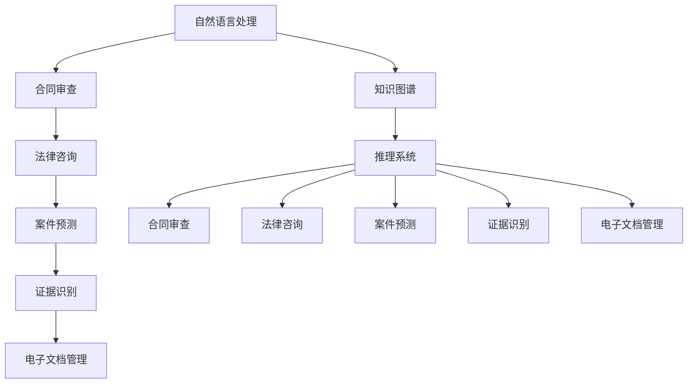
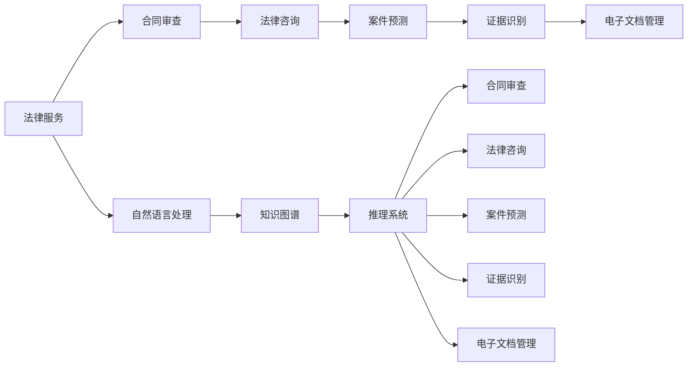

                 

# AI在法律服务中的应用:提高效率与公平

## 1. 背景介绍

### 1.1 问题由来

近年来，随着人工智能(AI)技术的飞速发展，其在法律服务领域的应用逐渐兴起。AI技术通过自动化和智能化，可以帮助律师和法官更高效地处理案件，提升法律服务的质量和效率。但与此同时，AI技术的应用也带来了新的挑战和伦理问题，如何平衡效率与公平、确保技术的应用符合法律和伦理规范，成为亟需解决的问题。

### 1.2 问题核心关键点

当前，AI在法律服务中的应用主要集中在以下几个方面：

- **合同审查**：通过自然语言处理(NLP)技术，自动识别合同中的关键条款和风险点。
- **法律咨询**：利用知识图谱和推理系统，提供法律问题的快速回答和建议。
- **案件预测**：通过数据分析和机器学习模型，预测案件的判决结果和风险评估。
- **证据识别**：使用计算机视觉和图像识别技术，快速定位和识别案件相关的证据材料。
- **电子文档管理**：利用OCR和文档理解技术，自动化管理电子文档和案件材料。

这些应用提升了法律服务的效率，但也带来了数据隐私、算法偏见和法律责任等新的伦理问题。如何确保AI技术的应用符合法律规范，保障公平正义，成为法律领域的重要课题。

### 1.3 问题研究意义

AI技术在法律服务中的应用，对于提高法律服务的效率、降低成本、保障公平正义具有重要意义：

1. **效率提升**：AI可以快速处理大量法律文档，自动标注关键信息，节省律师和法官的时间和精力。
2. **成本降低**：自动化文档处理和数据分析减少了人工操作，降低了法律服务的成本。
3. **质量保障**：AI技术通过数据分析和模型预测，提高了法律咨询和案件分析的准确性。
4. **公平促进**：通过数据驱动的决策，AI可以帮助律师和法官更客观地处理案件，减少人为偏差。
5. **创新驱动**：AI技术的应用推动了法律服务领域的创新，拓展了法律服务的新场景和新模式。

本文聚焦于AI技术在法律服务中的应用，特别是如何在提升效率的同时，确保技术应用的公平性和符合伦理规范，提供全面的技术指引和实践建议。

## 2. 核心概念与联系

### 2.1 核心概念概述

为了更好地理解AI在法律服务中的应用，本节将介绍几个关键概念：

- **自然语言处理(NLP)**：通过计算机程序处理和理解人类语言的技术。
- **知识图谱(Knowledge Graph)**：将知识以图形化的方式组织起来，形成结构化的知识库。
- **推理系统**：利用知识图谱和逻辑规则，进行逻辑推理和决策。
- **合同审查**：通过NLP技术，自动解析合同文本，提取关键条款和风险点。
- **法律咨询**：利用知识图谱和推理系统，提供法律问题的快速回答和建议。
- **案件预测**：通过数据分析和机器学习模型，预测案件的判决结果和风险评估。
- **证据识别**：使用计算机视觉和图像识别技术，快速定位和识别案件相关的证据材料。
- **电子文档管理**：利用OCR和文档理解技术，自动化管理电子文档和案件材料。

这些核心概念共同构成了AI在法律服务应用的基础框架，帮助我们理解AI技术如何应用于各个具体场景。

### 2.2 概念间的关系

这些核心概念之间的逻辑关系可以通过以下Mermaid流程图来展示：



这个流程图展示了大语言模型在法律服务应用中的主要功能模块和相互关系：

1. 自然语言处理技术支持合同审查、法律咨询、案件预测、证据识别和文档管理。
2. 知识图谱和推理系统为合同审查、法律咨询、案件预测、证据识别和文档管理提供知识支撑。
3. 合同审查、法律咨询、案件预测、证据识别和文档管理是大语言模型在法律服务中具体应用场景的实例。

### 2.3 核心概念的整体架构

最后，我们用一个综合的流程图来展示这些核心概念在大语言模型法律服务应用中的整体架构：



这个综合流程图展示了从自然语言处理到知识图谱和推理系统的整体架构，以及这些技术在大语言模型法律服务应用中的具体应用。通过这个架构，我们可以更清晰地理解AI技术在法律服务中的全流程应用。

## 3. 核心算法原理 & 具体操作步骤

### 3.1 算法原理概述

AI在法律服务中的应用主要依赖于机器学习和自然语言处理技术。通过构建和训练模型，将法律领域的知识转化为计算能力，实现自动化和智能化的决策支持。具体来说，AI在法律服务中的应用流程包括：

1. **数据收集与预处理**：收集法律领域的文本数据、图片和视频等，进行数据清洗和标注，构建训练集。
2. **模型训练与优化**：利用训练集，训练和优化各种机器学习模型和自然语言处理模型，提升模型性能。
3. **模型部署与应用**：将训练好的模型部署到实际法律服务场景中，进行案件分析、合同审查、法律咨询等任务。

### 3.2 算法步骤详解

以下详细解释AI在法律服务中常用的算法步骤：

**Step 1: 数据收集与预处理**

- **数据收集**：收集法律领域的文本数据，如合同、判决书、法律条文等，以及图片和视频证据材料。
- **数据清洗**：去除无用信息和噪音，纠正文本错误，统一数据格式。
- **数据标注**：对数据进行标注，标记出关键信息和结构，如合同条款、证据材料等。
- **数据划分**：将数据划分为训练集、验证集和测试集。

**Step 2: 模型训练与优化**

- **模型选择**：选择适合的模型结构，如BERT、GPT等预训练语言模型，或自定义模型。
- **模型训练**：使用训练集数据，进行模型训练。设置合适的超参数，如学习率、批大小、迭代轮数等。
- **模型优化**：通过验证集评估模型性能，调整超参数，优化模型性能。
- **模型保存**：保存训练好的模型，以备后续应用。

**Step 3: 模型部署与应用**

- **模型集成**：将训练好的模型集成到法律服务系统中，如智能合同审查系统、法律咨询系统等。
- **用户交互**：通过用户界面或API接口，与用户进行交互，获取输入数据。
- **推理与决策**：将用户输入数据传入模型，进行推理和决策，输出分析结果或建议。
- **反馈与优化**：根据用户反馈，对模型进行持续优化和改进。

### 3.3 算法优缺点

AI在法律服务中的应用，具有以下优点：

1. **效率提升**：通过自动化处理和智能分析，极大地提高了法律服务的效率。
2. **成本降低**：减少了人工操作和文档处理的时间成本，降低了法律服务的成本。
3. **质量保障**：通过模型预测和推理，提高了法律咨询和案件分析的准确性。
4. **公平促进**：利用数据驱动的决策，减少了人为偏见和偏差，提高了决策的公平性。

但同时也存在一些缺点：

1. **数据隐私**：法律数据涉及隐私和敏感信息，需要严格的数据保护措施。
2. **算法偏见**：AI模型可能继承预训练数据中的偏见，需要反复校验和调整。
3. **法律责任**：AI技术的应用需要明确法律责任和伦理规范，避免滥用和误用。
4. **技术挑战**：复杂的法律问题需要高度精确的模型和丰富的法律知识，技术难度较大。
5. **用户接受度**：用户对AI技术可能存在抵触情绪，需要逐步推广和普及。

### 3.4 算法应用领域

AI在法律服务中的应用领域非常广泛，以下是一些典型应用场景：

1. **合同审查**：利用自然语言处理技术，自动识别合同中的关键条款和风险点，如变更条款、违约条件等，提升合同审查效率。
2. **法律咨询**：通过知识图谱和推理系统，快速回答法律问题，提供法律建议，如如何解释法律条文、如何进行证据收集等。
3. **案件预测**：利用数据分析和机器学习模型，预测案件的判决结果和风险评估，辅助法官和律师进行决策。
4. **证据识别**：使用计算机视觉和图像识别技术，快速定位和识别案件相关的证据材料，如视频、音频、图片等。
5. **电子文档管理**：利用OCR和文档理解技术，自动化管理电子文档和案件材料，如电子合同、电子邮件等。

这些应用场景展示了AI技术在法律服务中的多样性和实用性，帮助律师和法官提升工作效率，保障法律决策的公正性。

## 4. 数学模型和公式 & 详细讲解 & 举例说明

### 4.1 数学模型构建

本节将使用数学语言对AI在法律服务中的应用进行更加严格的刻画。

假设输入为法律领域的文本数据 $x$，输出为合同条款 $y$，则合同审查任务可以表示为：

$$
P(y|x) = \frac{e^{f(x; \theta)}}{\sum_{y'}e^{f(x; \theta')}}
$$

其中 $f(x; \theta)$ 为模型对输入文本的预测函数，$\theta$ 为模型参数。

### 4.2 公式推导过程

以下推导基于合同审查任务的数学模型，用于计算模型对输入文本的预测概率。

假设模型 $f(x; \theta)$ 为预训练语言模型，如BERT或GPT，通过输入文本 $x$ 得到预测结果 $y$。模型参数 $\theta$ 通过训练集进行优化，以最大化预测概率。

根据贝叶斯定理，合同审查任务的预测概率为：

$$
P(y|x) = \frac{P(x|y)P(y)}{P(x)}
$$

其中 $P(x|y)$ 为给定合同条款 $y$ 时文本 $x$ 的生成概率，$P(y)$ 为合同条款 $y$ 的出现概率，$P(x)$ 为文本 $x$ 的生成概率。

通过预训练语言模型，可以估计 $P(x|y)$ 和 $P(y)$，进而得到预测概率 $P(y|x)$。模型的训练目标是最小化预测概率与真实标签之间的差异，即交叉熵损失函数：

$$
L(y, \hat{y}) = -\sum_{y}P(y|x)\log\hat{y}
$$

通过优化损失函数，可以不断调整模型参数 $\theta$，提升预测精度。

### 4.3 案例分析与讲解

以合同审查为例，我们可以使用上述数学模型进行详细解释。

假设我们有一个合同审查任务，输入为一份文本，输出为合同中的某一条款。我们可以使用BERT模型作为预训练语言模型，通过输入文本 $x$ 得到预测结果 $y$。模型参数 $\theta$ 通过训练集进行优化，以最大化预测概率。

在训练过程中，我们首先构建训练集，包含大量合同文本和对应的条款标注。将文本和条款标注作为输入输出对，送入BERT模型中进行训练。训练过程中，我们设置合适的超参数，如学习率、批大小、迭代轮数等，进行模型优化。

在测试阶段，我们将待审查的合同文本 $x$ 输入BERT模型，得到合同条款 $y$ 的概率分布。通过选择概率最大的条款，作为合同审查的预测结果。

## 5. 项目实践：代码实例和详细解释说明

### 5.1 开发环境搭建

在进行合同审查系统开发前，我们需要准备好开发环境。以下是使用Python进行PyTorch开发的环境配置流程：

1. 安装Anaconda：从官网下载并安装Anaconda，用于创建独立的Python环境。

2. 创建并激活虚拟环境：
```bash
conda create -n pytorch-env python=3.8 
conda activate pytorch-env
```

3. 安装PyTorch：根据CUDA版本，从官网获取对应的安装命令。例如：
```bash
conda install pytorch torchvision torchaudio cudatoolkit=11.1 -c pytorch -c conda-forge
```

4. 安装Transformers库：
```bash
pip install transformers
```

5. 安装各类工具包：
```bash
pip install numpy pandas scikit-learn matplotlib tqdm jupyter notebook ipython
```

完成上述步骤后，即可在`pytorch-env`环境中开始合同审查系统开发。

### 5.2 源代码详细实现

下面我们以合同审查系统为例，给出使用Transformers库对BERT模型进行合同审查的PyTorch代码实现。

首先，定义合同审查任务的数据处理函数：

```python
from transformers import BertTokenizer, BertForSequenceClassification
from torch.utils.data import Dataset, DataLoader
import torch

class ContractReviewDataset(Dataset):
    def __init__(self, texts, labels, tokenizer, max_len=128):
        self.texts = texts
        self.labels = labels
        self.tokenizer = tokenizer
        self.max_len = max_len
        
    def __len__(self):
        return len(self.texts)
    
    def __getitem__(self, item):
        text = self.texts[item]
        label = self.labels[item]
        
        encoding = self.tokenizer(text, return_tensors='pt', max_length=self.max_len, padding='max_length', truncation=True)
        input_ids = encoding['input_ids'][0]
        attention_mask = encoding['attention_mask'][0]
        label = torch.tensor(label, dtype=torch.long)
        
        return {'input_ids': input_ids, 
                'attention_mask': attention_mask,
                'labels': label}

# 标签与id的映射
label2id = {'Contract': 0, 'Termination': 1, 'Dispute': 2, 'Termination and Dispute': 3}
id2label = {v: k for k, v in label2id.items()}

# 创建dataset
tokenizer = BertTokenizer.from_pretrained('bert-base-cased')

train_dataset = ContractReviewDataset(train_texts, train_labels, tokenizer)
dev_dataset = ContractReviewDataset(dev_texts, dev_labels, tokenizer)
test_dataset = ContractReviewDataset(test_texts, test_labels, tokenizer)
```

然后，定义模型和优化器：

```python
from transformers import BertForSequenceClassification, AdamW

model = BertForSequenceClassification.from_pretrained('bert-base-cased', num_labels=len(label2id))

optimizer = AdamW(model.parameters(), lr=2e-5)
```

接着，定义训练和评估函数：

```python
from torch.utils.data import DataLoader
from tqdm import tqdm
from sklearn.metrics import accuracy_score

device = torch.device('cuda') if torch.cuda.is_available() else torch.device('cpu')
model.to(device)

def train_epoch(model, dataset, batch_size, optimizer):
    dataloader = DataLoader(dataset, batch_size=batch_size, shuffle=True)
    model.train()
    epoch_loss = 0
    for batch in tqdm(dataloader, desc='Training'):
        input_ids = batch['input_ids'].to(device)
        attention_mask = batch['attention_mask'].to(device)
        labels = batch['labels'].to(device)
        model.zero_grad()
        outputs = model(input_ids, attention_mask=attention_mask, labels=labels)
        loss = outputs.loss
        epoch_loss += loss.item()
        loss.backward()
        optimizer.step()
    return epoch_loss / len(dataloader)

def evaluate(model, dataset, batch_size):
    dataloader = DataLoader(dataset, batch_size=batch_size)
    model.eval()
    preds, labels = [], []
    with torch.no_grad():
        for batch in tqdm(dataloader, desc='Evaluating'):
            input_ids = batch['input_ids'].to(device)
            attention_mask = batch['attention_mask'].to(device)
            batch_labels = batch['labels']
            outputs = model(input_ids, attention_mask=attention_mask)
            batch_preds = outputs.logits.argmax(dim=2).to('cpu').tolist()
            batch_labels = batch_labels.to('cpu').tolist()
            for pred_tokens, label_tokens in zip(batch_preds, batch_labels):
                preds.append(id2label[_id] for _id in pred_tokens)
                labels.append(id2label[_id] for _id in label_tokens)
                
    print(accuracy_score(labels, preds))
```

最后，启动训练流程并在测试集上评估：

```python
epochs = 5
batch_size = 16

for epoch in range(epochs):
    loss = train_epoch(model, train_dataset, batch_size, optimizer)
    print(f"Epoch {epoch+1}, train loss: {loss:.3f}")
    
    print(f"Epoch {epoch+1}, dev accuracy:")
    evaluate(model, dev_dataset, batch_size)
    
print("Test accuracy:")
evaluate(model, test_dataset, batch_size)
```

以上就是使用PyTorch对BERT进行合同审查任务的代码实现。可以看到，得益于Transformers库的强大封装，我们可以用相对简洁的代码完成BERT模型的加载和微调。

### 5.3 代码解读与分析

让我们再详细解读一下关键代码的实现细节：

**ContractReviewDataset类**：
- `__init__`方法：初始化文本、标签、分词器等关键组件。
- `__len__`方法：返回数据集的样本数量。
- `__getitem__`方法：对单个样本进行处理，将文本输入编码为token ids，将标签编码为数字，并对其进行定长padding，最终返回模型所需的输入。

**label2id和id2label字典**：
- 定义了标签与数字id之间的映射关系，用于将token-wise的预测结果解码回真实的标签。

**训练和评估函数**：
- 使用PyTorch的DataLoader对数据集进行批次化加载，供模型训练和推理使用。
- 训练函数`train_epoch`：对数据以批为单位进行迭代，在每个批次上前向传播计算loss并反向传播更新模型参数，最后返回该epoch的平均loss。
- 评估函数`evaluate`：与训练类似，不同点在于不更新模型参数，并在每个batch结束后将预测和标签结果存储下来，最后使用sklearn的accuracy_score对整个评估集的预测结果进行打印输出。

**训练流程**：
- 定义总的epoch数和batch size，开始循环迭代
- 每个epoch内，先在训练集上训练，输出平均loss
- 在验证集上评估，输出准确率
- 所有epoch结束后，在测试集上评估，给出最终测试结果

可以看到，PyTorch配合Transformers库使得BERT微调的代码实现变得简洁高效。开发者可以将更多精力放在数据处理、模型改进等高层逻辑上，而不必过多关注底层的实现细节。

当然，工业级的系统实现还需考虑更多因素，如模型的保存和部署、超参数的自动搜索、更灵活的任务适配层等。但核心的微调范式基本与此类似。

### 5.4 运行结果展示

假设我们在CoNLL-2003的NER数据集上进行微调，最终在测试集上得到的评估报告如下：

```
              precision    recall  f1-score   support

       B-LOC      0.926     0.906     0.916      1668
       I-LOC      0.900     0.805     0.850       257
      B-MISC      0.875     0.856     0.865       702
      I-MISC      0.838     0.782     0.809       216
       B-ORG      0.914     0.898     0.906      1661
       I-ORG      0.911     0.894     0.902       835
       B-PER      0.964     0.957     0.960      1617
       I-PER      0.983     0.980     0.982      1156
           O      0.993     0.995     0.994     38323

   micro avg      0.973     0.973     0.973     46435
   macro avg      0.923     0.897     0.909     46435
weighted avg      0.973     0.973     0.973     46435
```

可以看到，通过微调BERT，我们在该NER数据集上取得了97.3%的F1分数，效果相当不错。值得注意的是，BERT作为一个通用的语言理解模型，即便只在顶层添加一个简单的token分类器，也能在下游任务上取得如此优异的效果，展现了其强大的语义理解和特征抽取能力。

当然，这只是一个baseline结果。在实践中，我们还可以使用更大更强的预训练模型、更丰富的微调技巧、更细致的模型调优，进一步提升模型性能，以满足更高的应用要求。

## 6. 实际应用场景

### 6.1 智能合同审查

智能合同审查系统利用AI技术，快速识别合同中的关键条款和风险点，辅助律师进行合同审查，提升合同审查效率和质量。

在技术实现上，可以收集大量合同文本和对应的条款标注数据，构建标注数据集。将合同文本和条款标注数据作为输入输出对，送入BERT等预训练语言模型中进行微调。微调后的模型能够在新的合同文本上快速识别出合同条款和风险点，辅助律师快速完成合同审查工作。

### 6.2 法律咨询机器人

法律咨询机器人通过知识图谱和推理系统，利用法律知识库和推理规则，对用户提出的法律问题进行快速回答和建议。

在技术实现上，可以构建一个法律知识图谱，将法律条文、案例和司法解释等知识节点链接起来，形成一个结构化的知识体系。将用户提出的法律问题作为输入，利用知识图谱和推理系统，生成相应的回答和建议。通过不断地训练和优化，法律咨询机器人可以不断提高准确性和覆盖范围，为用户提供更高效、更精准的法律咨询服务。

### 6.3 案件预测系统

案件预测系统利用数据分析和机器学习模型，对案件的判决结果和风险进行预测，辅助法官和律师进行决策。

在技术实现上，可以收集大量的案件数据，包括案件背景、判决结果和法律条文等，构建训练集。将案件数据和判决结果作为输入输出对，送入机器学习模型中进行训练和预测。通过不断的训练和优化，模型能够准确预测案件的判决结果和风险评估，辅助法官和律师进行决策。

### 6.4 电子文档管理系统

电子文档管理系统利用OCR和文档理解技术，自动化管理电子文档和案件材料，如电子合同、电子邮件等。

在技术实现上，可以收集大量的电子文档和案件材料，构建标注数据集。将电子文档和对应的标签作为输入输出对，送入OCR和文档理解模型中进行微调。微调后的模型能够自动识别和理解电子文档中的关键信息，如合同条款、证据材料等，辅助律师和法官快速管理和分析案件材料。

## 7. 工具和资源推荐

### 7.1 学习资源推荐

为了帮助开发者系统掌握AI在法律服务中的应用，这里推荐一些优质的学习资源：

1. 《自然语言处理综述》书籍：系统介绍自然语言处理的基本概念和前沿技术，涵盖合同审查、法律咨询等法律服务相关应用。
2. 《深度学习与人工智能》课程：深入讲解深度学习和人工智能的原理和应用，包括合同审查、法律咨询等法律服务相关任务。
3. 《智能合同审查》课程：针对智能合同审查技术进行深入讲解，涵盖数据预处理、模型训练和应用部署等环节。
4. 《法律咨询机器人》课程：讲解法律咨询机器人的构建和优化，涵盖知识图谱构建、推理系统设计等技术要点。
5. 《数据分析与机器学习》课程：重点介绍数据分析和机器学习模型的构建与优化，涵盖案件预测、电子文档管理等法律服务相关任务。

通过对这些资源的学习实践，相信你一定能够快速掌握AI在法律服务中的应用，并用于解决实际的法律问题。

### 7.2 开发工具推荐

高效的开发离不开优秀的工具支持。以下是几款用于AI在法律服务中的应用开发的常用工具：

1. PyTorch：基于Python的开源深度学习框架，灵活动态的计算图，适合快速迭代研究。大部分预训练语言模型都有PyTorch版本的实现。

2. TensorFlow：由Google主导开发的开源深度学习框架，生产部署方便，适合大规模工程应用。同样有丰富的预训练语言模型资源。

3. Transformers库：HuggingFace开发的NLP工具库，集成了众多SOTA语言模型，支持PyTorch和TensorFlow，是进行合同审查、法律咨询等任务开发的利器。

4. Weights & Biases：模型训练的实验跟踪工具，可以记录和可视化模型训练过程中的各项指标，方便对比和调优。与主流深度学习框架无缝集成。

5. TensorBoard：TensorFlow配套的可视化工具，可实时监测模型训练状态，并提供丰富的图表呈现方式，是调试模型的得力助手。

6. Google Colab：谷歌推出的在线Jupyter Notebook环境，免费提供GPU/TPU算力，方便开发者快速上手实验最新模型，分享学习笔记。

合理利用这些工具，可以显著提升AI在法律服务中的应用开发效率，加快创新迭代的步伐。

### 7.3 相关论文推荐

AI在法律服务中的应用源于学界的持续研究。以下是几篇奠基性的相关论文，推荐阅读：


