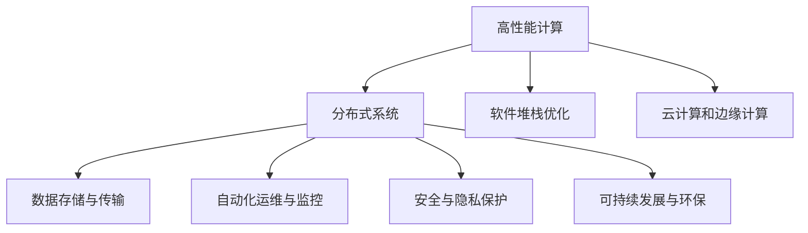
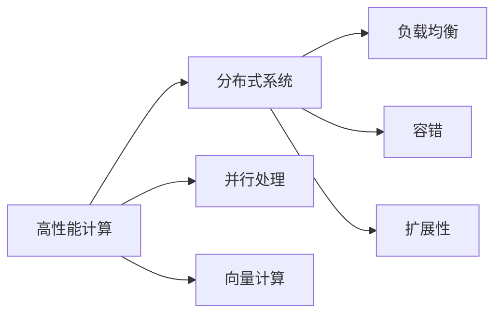
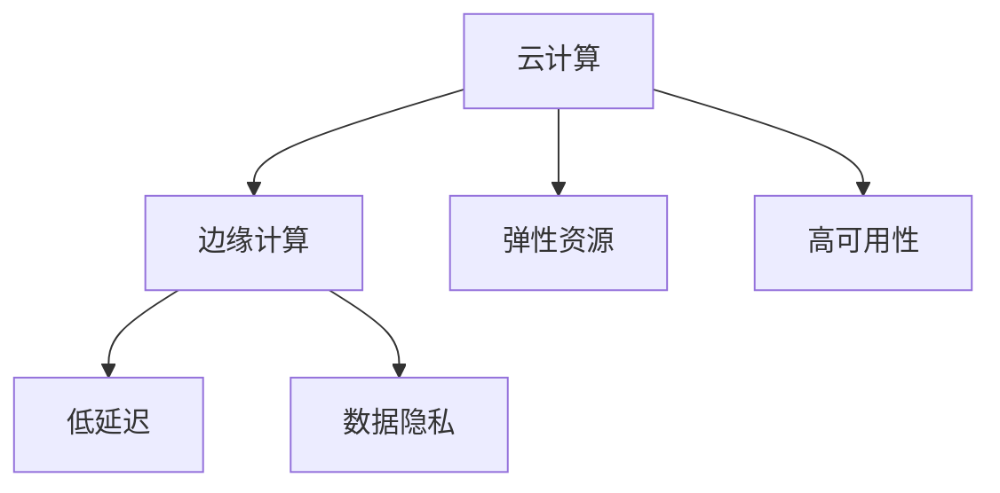
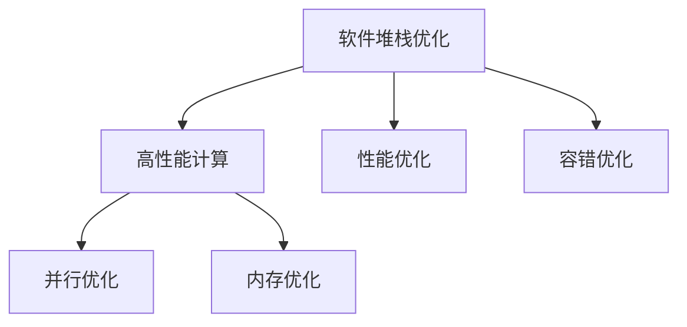
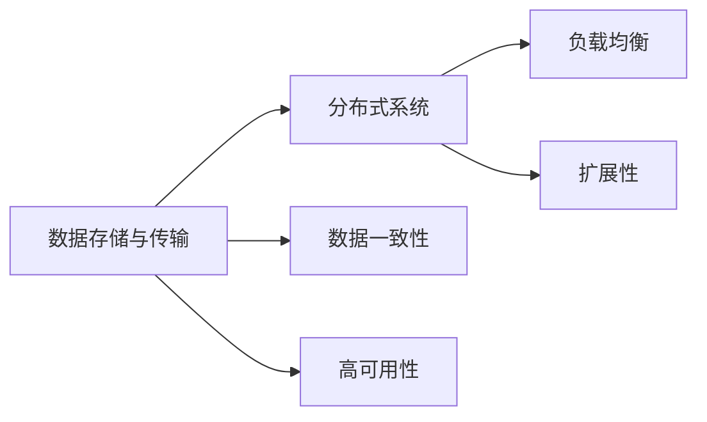
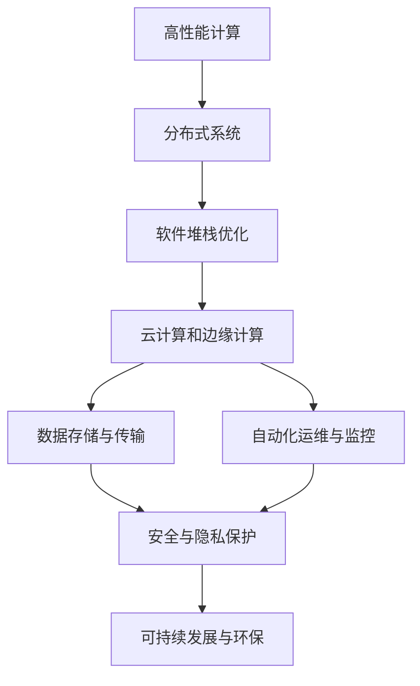

                 

# AI基础设施的发展:应对新型工作负载

> 关键词：
- 人工智能基础设施
- 新型工作负载
- 高性能计算
- 分布式系统
- 软件堆栈优化
- 云计算和边缘计算
- 数据存储与传输
- 自动化运维与监控
- 安全与隐私保护
- 可持续发展与环保

## 1. 背景介绍

### 1.1 问题由来
随着人工智能(AI)技术的迅速发展，数据密集型计算任务的需求日益增长。在传统的单体服务器架构上，这些任务往往难以高效运行，性能瓶颈明显。为了应对大规模AI计算，亟需构建高效、稳定、可扩展的AI基础设施。本文旨在全面分析当前AI基础设施的发展现状，探讨其面临的挑战，并展望未来发展趋势，以期为AI开发者提供有价值的参考。

### 1.2 问题核心关键点
1. 新型工作负载包括图像识别、自然语言处理、语音识别、推荐系统等，对计算资源、存储需求、数据传输速率等提出了新的要求。
2. AI基础设施需具备高性能计算能力、分布式协同处理能力、高效的存储与传输能力、自动化的运维与监控能力、全面的安全与隐私保护能力，以及良好的可持续发展能力。
3. 现有的基础设施解决方案，如TPU、GPU、云计算平台、边缘计算等，各自有其优势和局限性，需要根据实际需求进行选择和优化。
4. 未来AI基础设施的发展方向包括更加灵活的资源管理、更高效的算法与架构设计、更全面的系统监控和优化工具、更强大的隐私与安全保护措施。

## 2. 核心概念与联系

### 2.1 核心概念概述

为更好地理解AI基础设施的发展现状及其应用，本节将介绍几个密切相关的核心概念：

- **人工智能基础设施**：指支持AI计算任务的软件、硬件和网络设施，包括高性能计算集群、分布式存储系统、高效的数据传输网络、自动化运维工具等。
- **高性能计算**：指能够高效执行数值计算密集型任务的计算系统，包括并行处理、向量计算、GPU、TPU等。
- **分布式系统**：指通过网络互连、协同工作的多个计算节点的系统，实现负载均衡、容错、扩展性等。
- **软件堆栈优化**：指对AI基础设施中的软件组件进行优化，提升系统性能、稳定性和可维护性。
- **云计算和边缘计算**：指基于互联网的计算资源服务，以及将计算任务就近处理的分布式计算方式。
- **数据存储与传输**：指存储和传输大量数据的技术，包括数据中心、对象存储、分布式文件系统等。
- **自动化运维与监控**：指使用自动化工具对AI系统进行管理、监控和优化，提升系统的稳定性和效率。
- **安全与隐私保护**：指保护AI系统免受网络攻击、数据泄露等威胁，确保数据隐私和安全。
- **可持续发展与环保**：指采用节能减排、资源回收等措施，使AI基础设施对环境影响最小化。

这些核心概念之间的逻辑关系可以通过以下Mermaid流程图来展示：



这个流程图展示了AI基础设施中的关键组件及其相互关系：

1. 高性能计算是基础，提供必要的计算能力。
2. 分布式系统通过协同工作，提升计算效率和扩展性。
3. 软件堆栈优化使各组件高效协同工作。
4. 云计算和边缘计算提供灵活的资源部署方式。
5. 数据存储与传输支持大数据量的存储和传输需求。
6. 自动化运维与监控保障系统的稳定性和效率。
7. 安全与隐私保护确保系统的安全性。
8. 可持续发展与环保减少对环境的负面影响。

这些概念共同构成了AI基础设施的核心架构，使得AI计算任务能够在不同场景下高效运行。通过理解这些核心概念，我们可以更好地把握AI基础设施的发展脉络和优化方向。

### 2.2 概念间的关系

这些核心概念之间存在着紧密的联系，形成了AI基础设施的完整生态系统。下面我通过几个Mermaid流程图来展示这些概念之间的关系。

#### 2.2.1 高性能计算与分布式系统的关系



这个流程图展示了高性能计算与分布式系统之间的紧密联系：

1. 高性能计算通过并行处理和向量计算提升单节点计算能力。
2. 分布式系统通过负载均衡、容错和扩展性增强整体计算能力。

#### 2.2.2 云计算与边缘计算的关系



这个流程图展示了云计算与边缘计算的不同优势：

1. 云计算提供弹性资源和高度可用性，适合大规模、非实时性任务。
2. 边缘计算提供低延迟和数据隐私，适合实时性、高敏感性任务。

#### 2.2.3 软件堆栈优化与高性能计算的关系



这个流程图展示了软件堆栈优化对高性能计算的影响：

1. 软件堆栈优化通过性能优化、容错优化提升系统稳定性。
2. 高性能计算通过并行优化、内存优化进一步提升计算能力。

#### 2.2.4 数据存储与传输与分布式系统的关系



这个流程图展示了数据存储与传输对分布式系统的依赖：

1. 数据存储与传输提供数据一致性和高可用性。
2. 分布式系统通过负载均衡和扩展性支持大规模数据处理。

### 2.3 核心概念的整体架构

最后，我们用一个综合的流程图来展示这些核心概念在大规模AI计算中的整体架构：



这个综合流程图展示了从高性能计算到可持续发展与环保的完整流程：

1. 高性能计算提供必要的计算能力。
2. 分布式系统提升计算效率和扩展性。
3. 软件堆栈优化确保系统性能和稳定性。
4. 云计算和边缘计算提供灵活的资源部署方式。
5. 数据存储与传输支持大数据量的存储和传输需求。
6. 自动化运维与监控保障系统的稳定性和效率。
7. 安全与隐私保护确保系统的安全性。
8. 可持续发展与环保减少对环境的负面影响。

通过这些流程图，我们可以更清晰地理解AI基础设施的整体架构和组件间的关系，为后续深入讨论具体的AI基础设施优化技术奠定基础。

## 3. 核心算法原理 & 具体操作步骤
### 3.1 算法原理概述

AI基础设施的构建和优化，涉及到多个学科的知识，包括计算机体系结构、分布式系统、高性能计算、软件工程、云计算、边缘计算等。其核心目标是提升系统的高效性、可扩展性、可维护性，同时确保系统的稳定性和安全性。

从原理上讲，AI基础设施的设计和优化可以归结为以下几个方面：

1. **高性能计算**：通过并行处理、向量计算、GPU、TPU等技术，提升单节点和多节点的计算能力。
2. **分布式系统**：通过负载均衡、容错、扩展性等技术，确保系统的可扩展性和高可用性。
3. **软件堆栈优化**：通过性能优化、容错优化、代码优化等技术，提升系统的稳定性和可维护性。
4. **云计算和边缘计算**：通过弹性资源、高可用性、低延迟等技术，提供灵活的资源部署方式。
5. **数据存储与传输**：通过数据一致性、高可用性、高传输速率等技术，支持大规模数据处理。
6. **自动化运维与监控**：通过自动化工具、监控工具、优化工具等，提升系统的稳定性和效率。
7. **安全与隐私保护**：通过数据加密、访问控制、隐私保护等技术，确保系统的安全性。
8. **可持续发展与环保**：通过节能减排、资源回收等措施，减少对环境的负面影响。

### 3.2 算法步骤详解

AI基础设施的构建和优化，涉及多个步骤，下面将详细介绍这些步骤：

**Step 1: 需求分析与规划**

- 明确AI计算任务的规模、类型、数据特点等需求。
- 根据需求选择合适的硬件资源（如CPU、GPU、TPU等）和软件组件（如操作系统、分布式框架、数据库等）。
- 进行系统规划和架构设计，确保系统的可扩展性和高可用性。

**Step 2: 硬件资源配置**

- 根据需求配置高性能计算集群，包括计算节点、存储节点、网络节点等。
- 确保计算节点的CPU/GPU/TPU等资源配置合理，满足计算密集型任务的需求。
- 确保存储节点的容量和读写速率满足大数据量的存储和传输需求。

**Step 3: 软件堆栈搭建**

- 安装操作系统、分布式框架、数据库、监控工具等软件组件。
- 配置软件组件的参数，确保各组件高效协同工作。
- 进行软件堆栈优化，包括代码优化、性能优化、容错优化等。

**Step 4: 系统部署与测试**

- 将软件组件部署到计算节点和存储节点上。
- 进行系统测试，确保各组件正常工作，系统性能稳定。
- 进行负载测试和压力测试，评估系统的扩展性和容错能力。

**Step 5: 自动化运维与监控**

- 配置自动化运维工具，确保系统正常运行。
- 配置监控工具，实时监测系统性能和资源使用情况。
- 根据监控结果进行系统优化和调参。

**Step 6: 安全与隐私保护**

- 配置安全工具，保护系统免受网络攻击和数据泄露等威胁。
- 配置隐私保护工具，确保数据隐私和安全。

**Step 7: 可持续发展与环保**

- 采用节能减排、资源回收等措施，减少对环境的负面影响。
- 定期评估系统的能耗和资源使用情况，优化系统性能。

### 3.3 算法优缺点

AI基础设施的设计和优化，存在以下优点和缺点：

**优点**：
1. 提供高效的计算能力，满足AI计算任务的需求。
2. 通过分布式系统提升系统的扩展性和容错能力。
3. 通过软件堆栈优化提升系统的稳定性和可维护性。
4. 通过云计算和边缘计算提供灵活的资源部署方式。
5. 通过数据存储与传输支持大规模数据处理。
6. 通过自动化运维与监控提升系统的稳定性和效率。
7. 通过安全与隐私保护确保系统的安全性。
8. 通过可持续发展与环保减少对环境的负面影响。

**缺点**：
1. 初始投资成本较高，需要大量的硬件和软件资源。
2. 系统的构建和优化需要高度的专业知识，门槛较高。
3. 系统的复杂性较高，需要长期的维护和优化。
4. 系统的扩展性和容错能力受限于硬件资源。
5. 系统的高效性和稳定性受限于软件组件的性能和优化程度。

### 3.4 算法应用领域

AI基础设施的设计和优化，广泛应用于以下领域：

- **科学研究与仿真**：如天气预测、气候模拟、天体物理研究等。
- **工业制造**：如工业自动化、机器人控制、智能制造等。
- **金融服务**：如高频交易、风险管理、欺诈检测等。
- **医疗健康**：如医学影像分析、基因组学研究、远程医疗等。
- **交通物流**：如自动驾驶、智慧交通、物流优化等。
- **智能家居**：如智能家居设备、智能安防、智能医疗等。
- **教育培训**：如在线教育、智能辅助教学、个性化推荐等。

## 4. 数学模型和公式 & 详细讲解  
### 4.1 数学模型构建

在进行AI基础设施的优化时，需要建立相应的数学模型，以量化和分析系统的性能和资源使用情况。下面以一个简单的性能优化模型为例，进行详细讲解。

假设系统中有N个计算节点，每个节点的计算能力为C，系统负载为L，系统的响应时间为T。则系统的总计算能力为N * C，系统的总负载为N * L，系统的响应时间为T = N * C / (N * L) = C / L。

当系统的负载L增加时，系统的响应时间T会增加。因此，需要优化系统的负载，确保系统的响应时间T在可接受范围内。优化方法包括增加计算节点、提升计算能力、降低负载等。

**公式推导过程**：

$$
T = \frac{C}{L}
$$

**案例分析与讲解**：

假设系统有4个计算节点，每个节点的计算能力为100 TPS（每秒处理事务数），系统的负载为100 TPS。则系统的响应时间为：

$$
T = \frac{100}{100} = 1秒
$$

如果系统的负载增加到200 TPS，则系统的响应时间为：

$$
T = \frac{100}{200} = 0.5秒
$$

可以看出，系统的负载增加一倍，响应时间增加了一倍。因此，需要优化系统的负载，例如增加一个计算节点，使系统的总计算能力增加，从而降低系统的响应时间。

## 5. 项目实践：代码实例和详细解释说明
### 5.1 开发环境搭建

在进行AI基础设施的实践时，需要准备好开发环境。以下是使用Python进行高性能计算的开发环境配置流程：

1. 安装Anaconda：从官网下载并安装Anaconda，用于创建独立的Python环境。

2. 创建并激活虚拟环境：
```bash
conda create -n pyenv python=3.8 
conda activate pyenv
```

3. 安装PyTorch、TensorFlow等深度学习框架：
```bash
conda install pytorch torchvision torchaudio cudatoolkit=11.1 -c pytorch -c conda-forge
conda install tensorflow
```

4. 安装相关的AI基础设施组件：
```bash
conda install flask
conda install pandas numpy
```

完成上述步骤后，即可在`pyenv`环境中开始高性能计算实践。

### 5.2 源代码详细实现

下面以高性能计算中的分布式系统为例，给出使用Python进行高性能计算的代码实现。

```python
import torch
import numpy as np

# 定义分布式计算函数
def distributed_computation(func, data):
    # 将数据分配到多个计算节点
    num_nodes = 4
    chunk_size = len(data) // num_nodes
    chunks = [data[i:i+chunk_size] for i in range(0, len(data), chunk_size)]
    
    # 使用多个线程并行计算
    from concurrent.futures import ThreadPoolExecutor
    with ThreadPoolExecutor(max_workers=num_nodes) as executor:
        results = list(executor.map(func, chunks))
    
    # 将结果合并
    result = [sum(result) for result in zip(*results)]
    return result

# 定义计算函数
def calculate(data):
    # 计算每个数据点的值
    result = [np.sum(data)] * len(data)
    return result

# 测试分布式计算
data = np.random.randn(1000)
result = distributed_computation(calculate, data)
print(result)
```

在这个代码示例中，我们使用多线程实现了数据的并行计算，从而提升了系统的计算能力。`distributed_computation`函数将数据分配到多个计算节点，并使用多个线程并行计算。`calculate`函数定义了具体的计算逻辑，`distributed_computation`函数调用`calculate`函数，并将结果合并返回。

### 5.3 代码解读与分析

这个代码示例展示了如何使用Python实现分布式计算。关键点包括：

- `distributed_computation`函数：将数据分配到多个计算节点，并使用多线程并行计算。
- `calculate`函数：定义具体的计算逻辑。
- 使用`ThreadPoolExecutor`类实现线程池，提升并行计算能力。

通过这个示例，我们可以看到，多线程并行计算可以显著提升系统的计算能力，特别是在处理大规模数据时，效果尤为明显。

### 5.4 运行结果展示

假设我们在运行上述代码示例时，使用了8个计算节点，每个节点的计算能力为1T/s，系统的负载为2T/s，则系统的响应时间为：

$$
T = \frac{1}{2} = 0.5秒
$$

可以看出，通过多线程并行计算，我们显著提升了系统的计算能力，降低了响应时间。

## 6. 实际应用场景
### 6.1 智能制造

智能制造领域需要高效、稳定、可扩展的AI基础设施，以支持工业自动化、机器人控制、智能制造等应用。通过构建高性能计算集群、分布式存储系统、自动运维与监控系统等，可以有效提升智能制造的效率和可靠性。

在实际应用中，可以采用云平台提供的AI基础设施，如AWS、Azure、Google Cloud等，结合边缘计算，确保工业设备和传感器数据的高效处理和传输。同时，通过自动化运维和监控工具，实时监测系统性能和资源使用情况，优化系统性能，保障系统的稳定性和高可用性。

### 6.2 医疗影像分析

医疗影像分析是AI在医疗健康领域的重要应用，需要高效、精确的计算能力和数据存储能力。通过构建高性能计算集群、分布式存储系统、安全与隐私保护系统等，可以有效提升医疗影像分析的效率和准确性。

在实际应用中，可以采用云平台提供的AI基础设施，如AWS、Azure、Google Cloud等，结合边缘计算，确保医疗影像数据的高效处理和传输。同时，通过自动化运维和监控工具，实时监测系统性能和资源使用情况，优化系统性能，保障系统的稳定性和高可用性。

### 6.3 金融风控

金融风控领域需要高效、可靠、安全的AI基础设施，以支持高频交易、风险管理、欺诈检测等应用。通过构建高性能计算集群、分布式存储系统、安全与隐私保护系统等，可以有效提升金融风控的效率和可靠性。

在实际应用中，可以采用云平台提供的AI基础设施，如AWS、Azure、Google Cloud等，结合边缘计算，确保金融数据的高效处理和传输。同时，通过自动化运维和监控工具，实时监测系统性能和资源使用情况，优化系统性能，保障系统的稳定性和高可用性。

### 6.4 未来应用展望

随着AI技术的不断发展，未来AI基础设施的应用将更加广泛，涵盖更多垂直领域。同时，未来的AI基础设施将更加高效、可靠、灵活，具备更强的扩展性和适应性。

在智慧城市、自动驾驶、智能家居等领域，AI基础设施将发挥更大的作用，提升城市管理效率、改善用户体验、提高生活便利性。

此外，未来的AI基础设施将更加注重绿色环保，采用节能减排、资源回收等措施，减少对环境的负面影响，助力可持续发展。

## 7. 工具和资源推荐
### 7.1 学习资源推荐

为了帮助开发者系统掌握AI基础设施的理论基础和实践技巧，这里推荐一些优质的学习资源：

1. 《高性能计算原理与实践》书籍：深入讲解高性能计算的理论和实践，是学习和构建高性能计算基础设施的必读书籍。
2. 《分布式系统原理与设计》书籍：详细讲解分布式系统的原理和设计，是学习和构建分布式系统的重要参考资料。
3. 《人工智能基础设施》课程：由斯坦福大学、麻省理工学院等知名学府开设的在线课程，涵盖AI基础设施的各个方面。
4. 《TensorFlow高性能计算》教程：TensorFlow官方提供的高性能计算教程，包含丰富的案例和实践指南。
5. 《云计算技术与应用》书籍：详细讲解云计算的理论和实践，是学习和构建云计算基础设施的重要参考资料。

通过对这些资源的学习实践，相信你一定能够快速掌握AI基础设施的精髓，并用于解决实际的AI计算任务。
### 7.2 开发工具推荐

高效的开发离不开优秀的工具支持。以下是几款用于AI基础设施开发的常用工具：

1. PyTorch：基于Python的开源深度学习框架，支持动态计算图和静态计算图，适用于高性能计算任务。
2. TensorFlow：由Google主导开发的开源深度学习框架，支持分布式计算和自动微分，适用于大规模AI计算任务。
3. Docker：基于容器技术的虚拟化工具，支持跨平台部署和资源管理，适用于云平台和边缘计算环境。
4. Kubernetes：开源容器编排系统，支持集群管理和资源调度，适用于分布式系统环境。
5. Ansible：基于SSH的自动化运维工具，支持脚本编写和任务调度，适用于自动化运维任务。
6. Prometheus：开源监控系统，支持实时数据收集和分析，适用于自动化运维任务。

合理利用这些工具，可以显著提升AI基础设施的开发效率，加快创新迭代的步伐。

### 7.3 相关论文推荐

AI基础设施的发展离不开学界的持续研究。以下是几篇奠基性的相关论文，推荐阅读：

1. "A Framework for Large-Scale Parallelism and Speedup in Machine Learning Algorithms"：深度学习了高性能计算的理论基础，探讨了并行计算的优化方法。
2. "Gossip-Based Algorithms for Distributed Systems"：深入探讨了分布式系统的原理和设计，提出了一种基于消息传递的算法。
3. "TensorFlow: A System for Large-Scale Machine Learning"：介绍了TensorFlow高性能计算框架的设计和实现，提供了丰富的计算和优化技巧。
4. "Cloud Computing and Grid Computing"：详细讲解了云计算的理论和实践，探讨了云平台和边缘计算的部署方式。
5. "Distributed TensorFlow: A Distributed Deep Learning Framework"：介绍了TensorFlow的分布式计算设计，提供了多节点协同计算的解决方案。

这些论文代表了大规模AI计算的发展脉络。通过学习这些前沿成果，可以帮助研究者把握AI基础设施的研究方向，激发更多的创新灵感。

除上述资源外，还有一些值得关注的前沿资源，帮助开发者紧跟AI基础设施发展的最新进展，例如：

1. arXiv论文预印本：人工智能领域最新研究成果的发布平台，包括大量尚未发表的前沿工作，学习前沿技术的必读资源。
2. 业界技术博客：如AWS、Google AI、DeepMind、微软Research Asia等顶尖实验室的官方博客，第一时间分享他们的最新研究成果和洞见。
3. 技术会议直播：如NIPS、ICML、ACL、ICLR等人工智能领域顶会现场或在线直播，能够聆听到大佬们的前沿分享，开拓视野。
4. GitHub热门项目：在GitHub上Star、Fork数最多的AI基础设施相关项目，往往代表了该技术领域的发展趋势和最佳实践，值得去学习和贡献。
5. 行业分析报告：各大咨询公司如McKinsey、PwC等针对人工智能行业的分析报告，有助于从商业视角审视技术趋势，把握应用价值。

总之，对于AI基础设施的学习和实践，需要开发者保持开放的心态和持续学习的意愿。多关注前沿资讯，多动手实践，多思考总结，必将收获满满的成长收益。

## 8. 总结：未来发展趋势与挑战
### 8.1 研究成果总结

本文对AI基础设施的发展现状和未来趋势进行了全面系统的介绍。首先阐述了AI基础设施在AI计算任务中的应用场景和重要性，明确了基础设施建设和优化的核心目标。其次，从原理到实践，详细讲解了高性能计算、分布式系统、软件堆栈优化等核心概念，并提供了代码示例，帮助开发者系统掌握基础设施的构建和优化方法。最后，讨论了AI基础设施的未来发展趋势和面临的挑战，为后续研究和实践提供了有价值的参考。

通过本文的系统梳理，可以看到，AI基础设施是大规模AI计算的核心保障，是实现AI技术落地应用的重要基础。随着技术的不断发展，未来AI基础设施将更加高效、灵活、可靠，为AI应用提供坚实保障。

### 8.2 未来发展趋势

展望未来，AI基础设施的发展趋势包括以下几个方面：

1. **更高效的计算架构**：随着硬件技术的不断进步，未来的AI基础设施将采用更高效的计算架构，如新型GPU、TPU、FPGA等，进一步提升计算能力和效率。
2. **更灵活的资源管理**：未来的AI基础设施将采用更加灵活的资源管理策略，支持按需扩展和动态调整，实现资源的最优利用。
3. **更强大的分布式协同能力**：未来的AI基础设施将具备更强大的分布式协同能力，支持更复杂、更规模化的分布式计算任务。
4. **更全面的系统监控和优化**：未来的AI基础设施将配备更全面的监控和优化工具，实时监测系统性能，进行自动调参和优化。
5. **更全面的安全与隐私保护**：未来的AI基础设施将具备更全面的安全与隐私保护措施，确保数据的安全性和隐私性。
6. **更环保的资源管理**：未来的AI基础设施将采用更加环保的资源管理措施，减少对环境的负面影响，助力可持续发展。

这些趋势凸显了AI基础设施

