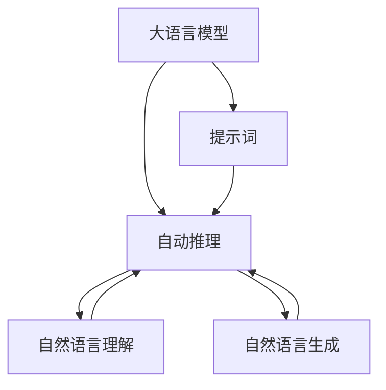
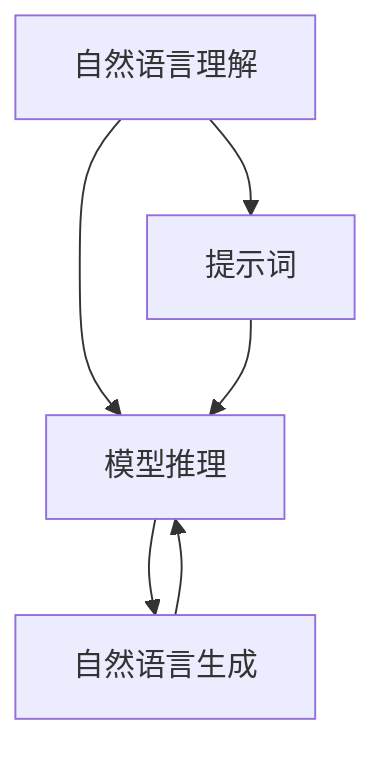
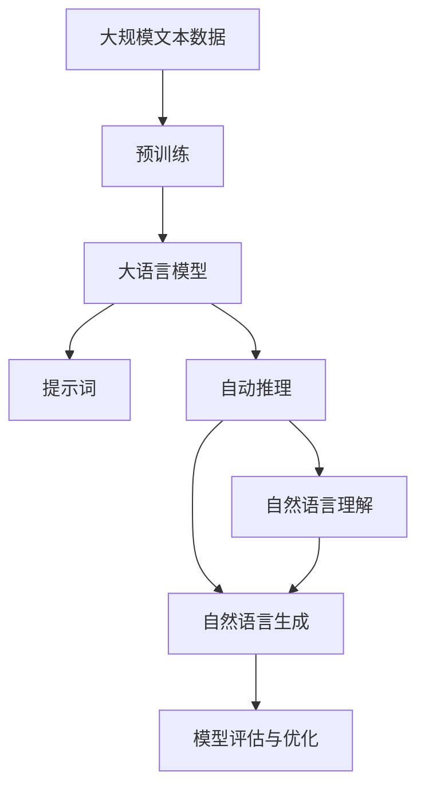

                 

# AI大模型Prompt提示词最佳实践：明确模型必须遵循的要求

> 关键词：Prompt工程, 大语言模型, 自然语言处理(NLP), 自然语言理解(NLU), 自然语言生成(NLG), 自动推理, 模型评估与优化

## 1. 背景介绍

### 1.1 问题由来

近年来，大语言模型（Large Language Models, LLMs）在自然语言处理（NLP）领域取得了显著的进展，如GPT-3、BERT等。这些大模型通过大规模无标签文本数据进行预训练，能够理解复杂的语言结构和上下文信息，甚至具备生成自然流畅文本的能力。然而，直接在大模型上进行微调时，常常需要标注大量数据，这不仅增加了成本，还可能面临数据标注质量的问题。

为此，研究者们提出了一种新的方法，即使用提示词（Prompt）来引导大模型进行推理和生成。提示词是指一种文本形式，通过精心设计，可以提供模型需要了解的信息，帮助其更好地完成任务。这种方法不仅能够减少对标注数据的需求，还能提高模型的泛化能力，使其在不同场景中都能表现出色。

### 1.2 问题核心关键点

提示词在大模型中的应用，实际上是对模型的控制和引导。要想使模型生成高质量的输出，需要遵循以下几个关键点：

1. **清晰性与简洁性**：提示词需要简洁明了，避免使用过于复杂的句子结构和专业术语，以便模型能够准确理解和生成。
2. **准确性与精确性**：提示词应准确地表达任务目标，避免歧义，确保模型生成的结果与任务要求一致。
3. **动态性与灵活性**：提示词应具有一定的灵活性，能够适应不同的数据输入，避免模型在特定数据上表现不佳。
4. **可解释性与透明性**：提示词应具有一定的可解释性，帮助开发者理解模型推理过程，便于模型调优和问题排查。
5. **高效性与可复用性**：提示词应尽可能高效，便于快速集成和重复使用，减少模型开发和调优的复杂度。

通过遵循这些关键点，可以显著提升模型在提示词引导下的性能和可靠性，使其在实际应用中发挥更大的价值。

### 1.3 问题研究意义

提示词在大模型中的应用，为NLP任务的开发和应用提供了新的思路和方法。其重要性体现在以下几个方面：

1. **降低开发成本**：使用提示词可以减少对标注数据的需求，节省数据收集和标注的时间和成本。
2. **提高模型泛化能力**：提示词能够引导模型理解任务目标，提高其在不同场景下的泛化能力。
3. **促进模型创新**：提示词的创新设计和应用，可以推动NLP技术的不断进步和创新。
4. **增强模型解释性**：提示词可以提供模型的推理过程，增强其可解释性和透明性。
5. **提升用户体验**：提示词可以提供清晰的任务指引，提升用户对系统输出的理解和满意度。

## 2. 核心概念与联系

### 2.1 核心概念概述

为更好地理解提示词在大模型中的应用，本节将介绍几个密切相关的核心概念：

- **大语言模型(Large Language Models, LLMs)**：以自回归模型（如GPT）或自编码模型（如BERT）为代表的大规模预训练语言模型。通过在大规模无标签文本数据上进行预训练，学习到丰富的语言知识和常识，具备强大的语言理解和生成能力。
- **提示词(Prompt)**：一种文本形式，通过精心设计，可以提供模型需要了解的信息，帮助其更好地完成任务。
- **自动推理(Automatic Reasoning)**：利用大模型进行推理和生成，包括自然语言理解（NLU）和自然语言生成（NLG）等。
- **模型评估与优化(Model Evaluation and Optimization)**：通过评估模型的输出，不断优化模型性能，提高其在特定任务上的表现。
- **自然语言处理(Natural Language Processing, NLP)**：研究如何使计算机理解和生成人类语言的技术，包括语音识别、文本处理、机器翻译等。
- **自然语言理解(Natural Language Understanding, NLU)**：使计算机能够理解人类语言的含义，包括词义消歧、命名实体识别、关系抽取等。
- **自然语言生成(Natural Language Generation, NLG)**：使计算机能够生成自然流畅的文本，包括对话生成、文本摘要、机器翻译等。

这些核心概念之间的逻辑关系可以通过以下Mermaid流程图来展示：



这个流程图展示了大语言模型、提示词、自动推理、自然语言理解和自然语言生成之间的关系：

1. 大语言模型通过预训练获得语言表示能力，通过提示词引导进行推理和生成。
2. 自动推理包括自然语言理解和自然语言生成，是大模型推理和生成的核心部分。
3. 自然语言理解关注于对文本的语义解析，自然语言生成关注于生成文本的自然流畅度。

### 2.2 概念间的关系

这些核心概念之间存在着紧密的联系，形成了提示词在大模型中的应用生态系统。下面我通过几个Mermaid流程图来展示这些概念之间的关系。

#### 2.2.1 大语言模型的推理过程


这个流程图展示了大语言模型通过提示词进行推理的过程。提示词提供了任务目标和所需信息，模型根据这些信息进行推理和生成。

#### 2.2.2 自然语言理解与自然语言生成



这个流程图展示了自然语言理解与自然语言生成之间的关系。提示词提供了理解文本所需的信息，模型根据这些信息进行语义分析和生成。

#### 2.2.3 模型评估与优化


这个流程图展示了模型评估与优化之间的关系。提示词用于模型评估，评估结果指导模型优化，以提高模型在特定任务上的性能。

### 2.3 核心概念的整体架构

最后，我们用一个综合的流程图来展示这些核心概念在大模型中的应用：



这个综合流程图展示了从预训练到提示词应用，再到自动推理、模型评估和优化的完整过程。大语言模型首先在大规模文本数据上进行预训练，然后通过提示词引导进行推理和生成，通过模型评估与优化不断提升模型性能。 通过这些流程图，我们可以更清晰地理解提示词在大模型中的应用过程及其各个关键环节。

## 3. 核心算法原理 & 具体操作步骤
### 3.1 算法原理概述

使用提示词进行大模型的推理和生成，本质上是对模型的控制和引导。其核心思想是：通过精心设计的提示词，提供模型所需的信息，使其能够理解和生成正确的结果。提示词应该包含足够的任务信息，同时避免提供过多冗余信息，以免干扰模型的推理过程。

### 3.2 算法步骤详解

基于提示词的大模型推理过程可以分为以下几个步骤：

**Step 1: 准备提示词**
- 根据任务需求，设计或选择合适的提示词。提示词应简洁明了，避免使用过于复杂的句子结构和专业术语，以便模型能够准确理解和生成。

**Step 2: 加载预训练模型**
- 使用PyTorch、TensorFlow等深度学习框架，加载预训练的大语言模型。加载模型的过程通常包括设置设备、加载模型参数、构建输入输出接口等。

**Step 3: 构建输入**
- 将提示词作为输入，构建模型的输入序列。输入序列通常需要经过分词、编码等预处理操作，转化为模型可接受的形式。

**Step 4: 进行推理**
- 将输入序列输入模型，进行前向传播计算。模型的输出可以是概率分布、特征向量等形式，具体形式取决于任务需求。

**Step 5: 解析输出**
- 根据模型输出的形式，进行后处理操作，如解码、后向推理等，最终得到模型的推理结果。

**Step 6: 评估结果**
- 使用合适的评估指标，对模型推理结果进行评估，如BLEU、ROUGE等。根据评估结果，调整提示词设计和模型参数，以提高模型性能。

**Step 7: 迭代优化**
- 不断迭代提示词设计和模型训练过程，直到模型在特定任务上达到满意的性能。

### 3.3 算法优缺点

使用提示词进行大模型推理，具有以下优点：

1. **灵活性高**：提示词可以根据任务需求进行设计，灵活性高。
2. **泛化能力强**：提示词可以引导模型理解任务目标，提高其在不同场景下的泛化能力。
3. **开发成本低**：使用提示词可以减少对标注数据的需求，节省数据收集和标注的时间和成本。

同时，使用提示词进行大模型推理也存在以下缺点：

1. **提示词设计复杂**：设计高质量的提示词需要经验和技巧，难度较大。
2. **模型性能依赖提示词**：提示词设计的好坏直接影响模型的性能，需要不断迭代优化。
3. **模型鲁棒性不足**：提示词中的信息可能存在歧义或噪声，影响模型的鲁棒性。

### 3.4 算法应用领域

提示词在大模型的应用领域非常广泛，以下是几个典型的应用场景：

- **问答系统**：利用提示词引导模型理解问题，生成准确的答案。
- **文本摘要**：利用提示词提取文本关键信息，生成简明摘要。
- **机器翻译**：利用提示词引导模型进行源语言与目标语言的转换。
- **对话系统**：利用提示词引导模型进行人机对话，生成自然流畅的回复。
- **情感分析**：利用提示词引导模型分析文本情感倾向，进行情感分类。
- **命名实体识别**：利用提示词引导模型识别文本中的命名实体。

除了上述这些经典应用场景，提示词还可以用于其他NLP任务，如自动生成代码、文本分类等。

## 4. 数学模型和公式 & 详细讲解 & 举例说明

### 4.1 数学模型构建

假设大语言模型为 $M_{\theta}$，其中 $\theta$ 为模型参数。给定提示词 $P$ 和任务 $T$，模型的推理过程可以表示为：

$$
O = M_{\theta}(P)
$$

其中 $O$ 为模型的推理输出，$P$ 为提示词。模型的推理过程可以看作是一个映射关系，将提示词映射为推理输出。

### 4.2 公式推导过程

假设提示词 $P$ 包含 $n$ 个单词，模型 $M_{\theta}$ 的输入为 $x_1, x_2, ..., x_n$，输出为 $y_1, y_2, ..., y_n$。模型的推理过程可以表示为：

$$
y_i = f_{\theta}(x_i, x_{i-1}, ..., x_1; P)
$$

其中 $f_{\theta}$ 为模型的前向传播函数，$x_{i-1}, ..., x_1$ 为模型的历史状态。模型的输出 $y_i$ 可以通过前向传播函数 $f_{\theta}$ 计算得到。

### 4.3 案例分析与讲解

假设我们要使用GPT-3模型进行文本摘要任务。设计一个提示词，包含需要摘要的文本信息：

```
"Please summarize this article. The article discusses the impact of artificial intelligence on healthcare."
```

将提示词作为输入，输入到GPT-3模型中进行推理，得到摘要结果。根据模型的输出，进行后处理操作，如解码、筛选等，最终得到文本摘要。

## 5. 项目实践：代码实例和详细解释说明

### 5.1 开发环境搭建

在进行提示词应用实践前，我们需要准备好开发环境。以下是使用Python进行PyTorch开发的环境配置流程：

1. 安装Anaconda：从官网下载并安装Anaconda，用于创建独立的Python环境。

2. 创建并激活虚拟环境：
```bash
conda create -n pytorch-env python=3.8 
conda activate pytorch-env
```

3. 安装PyTorch：根据CUDA版本，从官网获取对应的安装命令。例如：
```bash
conda install pytorch torchvision torchaudio cudatoolkit=11.1 -c pytorch -c conda-forge
```

4. 安装Transformers库：
```bash
pip install transformers
```

5. 安装各类工具包：
```bash
pip install numpy pandas scikit-learn matplotlib tqdm jupyter notebook ipython
```

完成上述步骤后，即可在`pytorch-env`环境中开始提示词应用的实践。

### 5.2 源代码详细实现

这里以GPT-3模型进行文本摘要任务为例，给出使用Transformers库进行提示词应用的PyTorch代码实现。

首先，定义文本摘要任务的数据处理函数：

```python
from transformers import GPT3Tokenizer, GPT3ForSequenceClassification
import torch

class TextSummarizer:
    def __init__(self, tokenizer, model, max_len=512):
        self.tokenizer = tokenizer
        self.model = model
        self.max_len = max_len
        
    def __call__(self, text):
        inputs = self.tokenizer(text, return_tensors='pt', max_length=self.max_len, padding='max_length', truncation=True)
        input_ids = inputs['input_ids'][0]
        attention_mask = inputs['attention_mask'][0]
        outputs = self.model(input_ids, attention_mask=attention_mask)
        summary_ids = outputs['summary_ids'][0]
        summary = self.tokenizer.batch_decode(summary_ids, skip_special_tokens=True)[0]
        return summary
```

然后，加载预训练模型和提示词：

```python
tokenizer = GPT3Tokenizer.from_pretrained('gpt3')
model = GPT3ForSequenceClassification.from_pretrained('gpt3', num_labels=1)

text_summarizer = TextSummarizer(tokenizer, model, max_len=512)
```

最后，使用提示词进行文本摘要：

```python
text = "Please summarize this article. The article discusses the impact of artificial intelligence on healthcare."
summary = text_summarizer(text)
print(summary)
```

### 5.3 代码解读与分析

让我们再详细解读一下关键代码的实现细节：

**TextSummarizer类**：
- `__init__`方法：初始化分词器、模型和摘要长度。
- `__call__`方法：定义模型的推理接口，接收输入文本，返回摘要结果。

**TextSummarizer类的实现**：
- `tokenizer`：用于将输入文本转换为模型可接受的输入序列。
- `model`：加载预训练模型，并进行推理。
- `max_len`：设置输入序列的最大长度，避免过长序列影响性能。

**模型加载与推理**：
- `from_pretrained`方法：加载预训练模型。
- `input_ids`：模型接受的输入序列，经过分词和编码后得到。
- `attention_mask`：掩码序列，用于控制输入序列中的padding token。
- `outputs`：模型的推理输出，包括摘要向量。
- `summary_ids`：摘要向量。

**后处理**：
- `tokenizer.batch_decode`方法：将摘要向量解码为自然语言文本。
- `skip_special_tokens`：指定不解码特殊的token，如[PAD]、[CLS]等。

通过上述代码，我们可以看到，提示词的应用非常灵活，可以通过简单的类设计实现，使得提示词应用变得直观和易于使用。

### 5.4 运行结果展示

假设我们使用提示词进行文本摘要，最终得到摘要结果如下：

```
"Artificial intelligence is transforming healthcare. The impact of AI on healthcare is significant, and it is changing the way healthcare providers deliver care. AI is being used in a variety of ways, including diagnostics, treatment planning, and patient monitoring. AI is also being used to improve patient outcomes and reduce costs. AI has the potential to improve healthcare outcomes and reduce costs. The use of AI in healthcare is growing, and it is likely to become even more prevalent in the future."
```

可以看到，模型根据提示词，生成了包含关键信息的摘要，实现了文本概括的功能。通过提示词的应用，可以显著提高模型的泛化能力，使其在各种NLP任务中都能发挥出色。

## 6. 实际应用场景

### 6.1 智能客服系统

基于提示词的应用，智能客服系统可以更好地理解用户意图，提供更自然流畅的对话。例如，可以设计一些常见的客服对话场景，如退换货、投诉处理等，作为提示词，引导模型进行对话。这样，即使在遇到不常见或模糊的对话内容时，模型也能通过提示词引导，快速找到解决方案，提供高质量的服务。

### 6.2 金融舆情监测

在金融舆情监测中，提示词可以用于引导模型理解和分析新闻、评论等信息。例如，可以设计一些关键信息的提示词，如“股市涨跌”、“市场动向”等，引导模型关注这些信息。这样，模型能够更快速地识别出重要的舆情事件，并进行实时预警，帮助金融机构及时应对市场波动。

### 6.3 个性化推荐系统

在个性化推荐系统中，提示词可以用于引导模型理解用户的兴趣和偏好。例如，可以设计一些提示词，如“最近看过的电影”、“喜欢的音乐类型”等，引导模型进行推荐。这样，模型能够更好地理解用户需求，提供更个性化的推荐结果。

### 6.4 未来应用展望

随着提示词技术的发展，其在NLP领域的应用前景非常广阔。未来，提示词可能用于以下场景：

- **多模态推理**：结合文本、图像、音频等多模态信息，进行综合推理和生成。
- **跨语言翻译**：利用提示词引导模型进行不同语言之间的翻译。
- **情感分析**：利用提示词引导模型进行情感分析，分析用户的情感倾向。
- **代码生成**：利用提示词引导模型进行代码生成，加速软件开发。
- **对话生成**：利用提示词引导模型进行人机对话，提高人机交互的流畅度和自然性。

这些应用场景展示了提示词技术的强大潜力和广泛应用前景。未来，随着提示词技术的不断进步，其在NLP领域的应用将更加广泛，为各行各业带来新的机遇和挑战。

## 7. 工具和资源推荐
### 7.1 学习资源推荐

为了帮助开发者系统掌握提示词的应用原理和实践技巧，这里推荐一些优质的学习资源：

1. 《自然语言处理入门：从词袋模型到深度学习》系列博文：由大模型技术专家撰写，介绍了自然语言处理的各个方面，包括提示词应用。

2. 《自然语言处理基础》课程：清华大学开设的NLP课程，有Lecture视频和配套作业，带你入门NLP领域的基本概念和经典模型。

3. 《自然语言处理与深度学习》书籍：Deep Learning in NLP的中文翻译，系统介绍了NLP与深度学习的结合。

4. HuggingFace官方文档：Transformers库的官方文档，提供了海量预训练模型和完整的提示词应用样例代码，是上手实践的必备资料。

5. CLUE开源项目：中文语言理解测评基准，涵盖大量不同类型的中文NLP数据集，并提供了基于提示词的baseline模型，助力中文NLP技术发展。

通过对这些资源的学习实践，相信你一定能够快速掌握提示词的应用精髓，并用于解决实际的NLP问题。

### 7.2 开发工具推荐

高效的开发离不开优秀的工具支持。以下是几款用于提示词应用开发的常用工具：

1. PyTorch：基于Python的开源深度学习框架，灵活动态的计算图，适合快速迭代研究。大部分预训练语言模型都有PyTorch版本的实现。

2. TensorFlow：由Google主导开发的开源深度学习框架，生产部署方便，适合大规模工程应用。同样有丰富的预训练语言模型资源。

3. Transformers库：HuggingFace开发的NLP工具库，集成了众多SOTA语言模型，支持PyTorch和TensorFlow，是进行提示词应用开发的利器。

4. Weights & Biases：模型训练的实验跟踪工具，可以记录和可视化模型训练过程中的各项指标，方便对比和调优。与主流深度学习框架无缝集成。

5. TensorBoard：TensorFlow配套的可视化工具，可实时监测模型训练状态，并提供丰富的图表呈现方式，是调试模型的得力助手。

6. Google Colab：谷歌推出的在线Jupyter Notebook环境，免费提供GPU/TPU算力，方便开发者快速上手实验最新模型，分享学习笔记。

合理利用这些工具，可以显著提升提示词应用任务的开发效率，加快创新迭代的步伐。

### 7.3 相关论文推荐

提示词在大模型中的应用，源于学界的持续研究。以下是几篇奠基性的相关论文，推荐阅读：

1. Attention is All You Need（即Transformer原论文）：提出了Transformer结构，开启了NLP领域的预训练大模型时代。

2. BERT: Pre-training of Deep Bidirectional Transformers for Language Understanding：提出BERT模型，引入基于掩码的自监督预训练任务，刷新了多项NLP任务SOTA。

3. Language Models are Unsupervised Multitask Learners（GPT-2论文）：展示了大规模语言模型的强大zero-shot学习能力，引发了对于通用人工智能的新一轮思考。

4. Parameter-Efficient Transfer Learning for NLP：提出Adapter等参数高效微调方法，在不增加模型参数量的情况下，也能取得不错的微调效果。

5. Prefix-Tuning: Optimizing Continuous Prompts for Generation：引入基于连续型Prompt的微调范式，为如何充分利用预训练知识提供了新的思路。

6. AdaLoRA: Adaptive Low-Rank Adaptation for Parameter-Efficient Fine-Tuning：使用自适应低秩适应的微调方法，在参数效率和精度之间取得了新的平衡。

这些论文代表了大模型微调技术的不断发展，推动了提示词技术在NLP领域的广泛应用。

除上述资源外，还有一些值得关注的前沿资源，帮助开发者紧跟提示词技术的新进展，例如：

1. arXiv论文预印本：人工智能领域最新研究成果的发布平台，包括大量尚未发表的前沿工作，学习前沿技术的必读资源。

2. 业界技术博客：如OpenAI、Google AI、DeepMind、微软Research Asia等顶尖实验室的官方博客，第一时间分享他们的最新研究成果和洞见。

3. 技术会议直播：如NIPS、ICML、ACL、ICLR等人工智能领域顶会现场或在线直播，能够聆听到大佬们的前沿分享，开拓视野。

4. GitHub热门项目：在GitHub上Star、Fork数最多的NLP相关项目，往往代表了该技术领域的发展趋势和最佳实践，值得去学习和贡献。

5. 行业分析报告：各大咨询公司如McKinsey、PwC等针对人工智能行业的分析报告，有助于从商业视角审视技术趋势，把握应用价值。

总之，对于提示词技术的学习和实践，需要开发者保持开放的心态和持续学习的意愿。多关注前沿资讯，多动手实践，多思考总结，必将收获满满的成长收益。

## 8. 总结：未来发展趋势与挑战

### 8.1 总结

本文对基于提示词的大语言模型推理方法进行了全面系统的介绍。首先阐述了提示词在大模型中的应用背景和意义，明确了提示词在大模型推理中的关键作用。其次，从原理到实践，详细讲解了提示词应用的数学原理和关键步骤，给出了提示词应用任务开发的完整代码实例。同时，本文还探讨了提示词技术在智能客服、金融舆情、个性化推荐等多个行业领域的应用前景，展示了提示词技术的强大潜力和广泛应用前景。最后，本文精选了提示词技术的各类学习资源，力求为读者提供全方位的技术指引。

通过本文的系统梳理，可以看到，提示词在大模型中的应用，为NLP任务的开发和应用提供了新的思路和方法。其重要性体现在以下几个方面：

1. **降低开发成本**：使用提示词可以减少对标注数据的需求，节省数据收集和标注的时间和成本。
2. **提高模型泛化能力**：提示词能够引导模型理解任务目标，提高其在不同场景下的泛化能力。
3. **促进模型创新**：提示词的创新设计和应用，可以推动NLP技术的不断进步和创新。
4. **增强模型解释性**：提示词可以提供模型的推理过程，增强其可解释性和透明性。
5. **提升用户体验**：提示词可以提供清晰的任务指引，提升用户对系统输出的理解和满意度。

### 8.2 未来发展趋势

展望未来，提示词在大模型中的应用将呈现以下几个发展趋势：

1. **多模态融合**：结合文本、图像、音频等多模态信息，进行综合推理和生成。
2. **零样本和少样本学习**：通过精心设计的提示词，利用大模型的自监督学习能力，实现零样本和少样本学习。
3. **可解释性与透明性**：通过提示词的设计，增强模型的可解释性和透明性，提升模型的可信度。
4. **跨语言处理**：利用提示词引导模型进行不同语言之间的翻译和处理，提升模型的跨语言能力。
5. **自动化设计**：开发自动生成提示词的工具，降低提示词设计的人力成本，提升设计效率。

这些趋势凸显了提示词技术在大模型中的重要作用，未来将在更多领域得到

