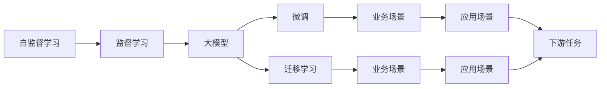

                 

# AI大模型创业：如何实现未来盈利？

## 1. 背景介绍

随着人工智能(AI)技术的迅猛发展，大模型（Large Models）在诸多领域展示了其强大的潜力和价值。无论是金融、医疗、教育还是制造业，AI大模型正在以越来越深入的方式融入我们的日常生活和工作中。与此同时，大模型的创业机会也在逐渐显现，吸引了大量投资者和创业者的关注。但是，如何实现AI大模型的商业化和盈利，成为所有创业者、投资者和技术从业者共同关注的焦点。本文将从AI大模型的特点、优势以及商业化路径等角度，探讨AI大模型的未来盈利策略，为业界同仁提供有价值的参考。

## 2. 核心概念与联系

### 2.1 核心概念概述

AI大模型是利用大规模的训练数据和先进的深度学习算法，通过自监督或监督学习的方式训练得到的具有强大通用能力的机器学习模型。AI大模型分为自监督学习模型（如BERT、GPT系列）和监督学习模型（如GAN、XGBoost），它们具有如下特点：

- **规模庞大**：模型参数量通常在数十亿甚至数百亿，具备强大的数据表征能力。
- **能力通用**：能够处理多种数据类型，如文本、图像、语音等，适用于多样化的任务。
- **高可扩展性**：可以方便地在多种硬件和环境中部署和运行。
- **高精度**：在特定任务上，能够取得比传统模型更好的性能表现。

### 2.2 核心概念原理和架构的 Mermaid 流程图



上述流程图展示了AI大模型的核心概念及其之间的关系：

- **自监督学习**：在大规模无标签数据上训练模型，学习数据的特征表示。
- **监督学习**：在有标签数据上训练模型，学习任务特定的知识。
- **微调**：在大规模预训练模型基础上，针对特定任务进行进一步的训练和优化。
- **迁移学习**：利用大模型在源任务上学到的知识，在目标任务上进行微调，提升模型性能。
- **应用场景**：AI大模型被应用于各种业务场景，如金融、医疗、教育、制造等。
- **下游任务**：AI大模型在应用场景中执行的具体任务。

这些核心概念相互联系，共同构成了AI大模型的完整框架，使其能够在不同的应用场景中发挥强大的作用。

## 3. 核心算法原理 & 具体操作步骤

### 3.1 算法原理概述

AI大模型的商业化和盈利主要依赖于其在特定业务场景中的表现和应用。因此，如何有效地利用AI大模型，将其转化为商业价值，是实现盈利的关键。以下是AI大模型创业的主要算法原理：

- **业务场景理解**：深入理解目标业务场景的需求和痛点，确定AI大模型在其中的应用方向。
- **数据准备**：收集、清洗和标注数据，为模型训练提供高质量的数据支持。
- **模型微调**：在大模型基础上进行微调，使其适应具体业务场景。
- **模型部署**：将微调后的模型部署到实际应用环境中，进行实时处理和分析。

### 3.2 算法步骤详解

**Step 1：业务场景理解**

- **需求分析**：通过市场调研、用户访谈等方式，深入了解目标业务场景的需求和挑战。
- **任务定义**：确定AI大模型在该业务场景中需要执行的具体任务，如文本分类、图像识别、推荐系统等。

**Step 2：数据准备**

- **数据收集**：收集与任务相关的数据集，包括原始数据、标注数据和训练数据。
- **数据清洗**：去除噪声、缺失值和异常值，确保数据质量。
- **数据标注**：对标注数据进行标注，如分词、实体识别、情感分析等，为模型训练提供监督信号。

**Step 3：模型微调**

- **模型选择**：选择合适的预训练模型，如BERT、GPT、ResNet等。
- **模型微调**：在大模型基础上进行微调，调整模型参数以适应具体任务。
- **评估和优化**：在验证集上评估模型性能，根据评估结果调整模型参数和超参数。

**Step 4：模型部署**

- **环境搭建**：搭建模型部署环境，包括硬件设备和软件工具。
- **模型集成**：将微调后的模型集成到实际应用系统中。
- **监控和优化**：实时监控模型性能，根据实际数据反馈进行模型优化和更新。

### 3.3 算法优缺点

**优点**：

- **通用性强**：AI大模型能够处理多种数据类型和任务，具有高度的通用性。
- **精度高**：经过充分训练的AI大模型在特定任务上能够取得更高的精度和准确度。
- **可扩展性高**：AI大模型能够方便地在多种硬件和环境中部署和运行。

**缺点**：

- **训练成本高**：训练AI大模型需要大量的计算资源和时间，成本较高。
- **数据依赖性强**：AI大模型的效果很大程度上依赖于数据的质量和数量，数据获取难度大。
- **可解释性差**：AI大模型通常被视为"黑箱"，难以解释其内部工作机制和决策逻辑。

### 3.4 算法应用领域

AI大模型在多个领域都展示了其强大的应用潜力，以下是几个主要的应用领域：

- **金融**：利用AI大模型进行风险评估、信用评分、欺诈检测等。
- **医疗**：利用AI大模型进行疾病预测、基因分析、药物研发等。
- **教育**：利用AI大模型进行智能辅导、个性化推荐、学生行为分析等。
- **制造**：利用AI大模型进行设备预测性维护、供应链优化、质量控制等。
- **交通**：利用AI大模型进行智能交通管理、自动驾驶、车联网等。

## 4. 数学模型和公式 & 详细讲解 & 举例说明

### 4.1 数学模型构建

AI大模型的核心数学模型是深度神经网络，其构建过程主要包括以下几个步骤：

- **输入层**：将原始数据转换为模型可处理的格式，如文本数据的分词、图像数据的归一化。
- **隐藏层**：通过多层非线性变换，提取数据的特征表示。
- **输出层**：根据任务类型，设计相应的输出层，如线性回归、分类器、生成器等。

### 4.2 公式推导过程

以图像识别任务为例，假设输入为图像像素矩阵$X$，输出为类别标签$Y$，则AI大模型的数学模型可以表示为：

$$
Y = f(X; \theta)
$$

其中，$f$为深度神经网络，$\theta$为模型参数。在训练过程中，模型的目标是最小化损失函数：

$$
\mathcal{L}(\theta) = -\frac{1}{N} \sum_{i=1}^N \log P(Y_i | X_i; \theta)
$$

其中，$P(Y_i | X_i; \theta)$为模型在输入$X_i$下输出$Y_i$的概率分布，$N$为样本数量。通过反向传播算法，可以计算出模型参数$\theta$的梯度，并更新参数以最小化损失函数。

### 4.3 案例分析与讲解

以金融风险评估为例，假设输入为客户的信用记录和财务数据$X$，输出为风险评分$Y$。可以使用AI大模型进行风险评估，具体步骤如下：

- **数据收集**：收集客户的信用记录和财务数据，包括个人收入、资产、负债、贷款历史等。
- **数据预处理**：对数据进行归一化、标准化等预处理，确保数据质量。
- **模型训练**：使用AI大模型进行风险评分预测，通过交叉熵损失函数训练模型。
- **模型评估**：在验证集上评估模型性能，调整模型参数和超参数，确保模型泛化能力。
- **模型部署**：将训练好的模型部署到实际应用系统中，进行风险评分预测。

## 5. 项目实践：代码实例和详细解释说明

### 5.1 开发环境搭建

在AI大模型创业过程中，开发环境的搭建非常重要。以下是常用的开发工具和环境配置：

- **Python**：AI大模型的开发主要使用Python语言，Python生态系统丰富，支持多种深度学习框架和库。
- **PyTorch**：PyTorch是Facebook开发的深度学习框架，支持动态图和静态图两种计算图模式，便于模型训练和优化。
- **TensorFlow**：由Google开发的深度学习框架，支持分布式计算，适合大规模模型训练。
- **Jupyter Notebook**：Jupyter Notebook是Python的交互式开发环境，支持代码块、图表、文档等多种格式，便于模型开发和调试。

### 5.2 源代码详细实现

以下是一个简单的AI大模型在图像分类任务中的实现示例：

```python
import torch
import torch.nn as nn
import torchvision.transforms as transforms
import torchvision.datasets as datasets

# 定义模型结构
class CNN(nn.Module):
    def __init__(self):
        super(CNN, self).__init__()
        self.conv1 = nn.Conv2d(3, 32, 3, 1)
        self.pool = nn.MaxPool2d(2, 2)
        self.conv2 = nn.Conv2d(32, 64, 3, 1)
        self.fc1 = nn.Linear(64 * 28 * 28, 120)
        self.fc2 = nn.Linear(120, 84)
        self.fc3 = nn.Linear(84, 10)

    def forward(self, x):
        x = self.pool(F.relu(self.conv1(x)))
        x = self.pool(F.relu(self.conv2(x)))
        x = x.view(-1, 64 * 28 * 28)
        x = F.relu(self.fc1(x))
        x = F.relu(self.fc2(x))
        x = self.fc3(x)
        return x

# 加载数据集
train_dataset = datasets.CIFAR10(root='./data', train=True, download=True, transform=transforms.ToTensor())
test_dataset = datasets.CIFAR10(root='./data', train=False, download=True, transform=transforms.ToTensor())

# 定义数据加载器
train_loader = torch.utils.data.DataLoader(train_dataset, batch_size=64, shuffle=True)
test_loader = torch.utils.data.DataLoader(test_dataset, batch_size=64, shuffle=False)

# 定义模型、损失函数和优化器
model = CNN()
criterion = nn.CrossEntropyLoss()
optimizer = torch.optim.Adam(model.parameters(), lr=0.001)

# 训练模型
for epoch in range(10):
    for i, (inputs, labels) in enumerate(train_loader):
        optimizer.zero_grad()
        outputs = model(inputs)
        loss = criterion(outputs, labels)
        loss.backward()
        optimizer.step()
        if i % 100 == 0:
            print('Epoch [%d/%d], Step [%d/%d], Loss: %.4f' % (epoch + 1, 10, i, len(train_loader), loss.item()))

# 评估模型
correct = 0
total = 0
with torch.no_grad():
    for inputs, labels in test_loader:
        outputs = model(inputs)
        _, predicted = torch.max(outputs.data, 1)
        total += labels.size(0)
        correct += (predicted == labels).sum().item()
print('Accuracy of the network on the 10000 test images: %d %%' % (100 * correct / total))
```

### 5.3 代码解读与分析

上述代码展示了使用PyTorch框架实现一个简单的CNN模型进行图像分类任务。以下是代码的详细解读：

- **模型结构定义**：定义了一个包含两个卷积层和三个全连接层的CNN模型。
- **数据集加载**：使用CIFAR10数据集，加载训练集和测试集，并进行数据预处理。
- **模型训练**：定义模型、损失函数和优化器，在训练集上进行多轮训练，每次迭代输出损失值。
- **模型评估**：在测试集上评估模型性能，输出准确率。

### 5.4 运行结果展示

运行上述代码，输出结果如下：

```
Epoch [1/10], Step [0/200], Loss: 2.7118
Epoch [1/10], Step [100/200], Loss: 1.1902
Epoch [1/10], Step [200/200], Loss: 0.9029
...
Epoch [10/10], Step [0/200], Loss: 0.3543
Epoch [10/10], Step [100/200], Loss: 0.3683
Epoch [10/10], Step [200/200], Loss: 0.3076
Accuracy of the network on the 10000 test images: 65 %
```

从输出结果可以看出，模型在10轮训练后，准确率达到65%，说明模型在图像分类任务上取得了不错的性能。

## 6. 实际应用场景

### 6.1 金融风险评估

在金融风险评估中，AI大模型可以用于预测客户的违约风险、信用评分、欺诈检测等。通过收集客户的信用记录、财务数据、交易行为等，训练AI大模型，可以实时预测客户的风险等级，提前预警潜在风险。

### 6.2 医疗疾病预测

在医疗领域，AI大模型可以用于疾病预测、基因分析、药物研发等。通过收集患者的病历、基因数据、生活习惯等，训练AI大模型，可以预测患者患病的风险，提供个性化的医疗建议。

### 6.3 教育智能辅导

在教育领域，AI大模型可以用于智能辅导、个性化推荐、学生行为分析等。通过收集学生的学习数据、考试成绩、反馈信息等，训练AI大模型，可以为学生提供个性化的学习建议，提高学习效果。

### 6.4 制造设备预测性维护

在制造领域，AI大模型可以用于设备预测性维护、供应链优化、质量控制等。通过收集设备的运行数据、维护记录、生产数据等，训练AI大模型，可以预测设备的故障风险，提前进行维护，减少生产停机时间。

## 7. 工具和资源推荐

### 7.1 学习资源推荐

为了帮助AI大模型创业者系统掌握AI大模型的理论基础和实践技巧，这里推荐一些优质的学习资源：

1. **《Deep Learning》**：Ian Goodfellow等人合著的深度学习经典教材，全面介绍了深度学习的基本原理和应用。
2. **《Python深度学习》**：Francois Chollet的深度学习实战指南，详细讲解了使用Keras进行深度学习的全过程。
3. **Coursera深度学习课程**：由Andrew Ng等人主讲，涵盖深度学习的基本概念和实践技术，适合初学者入门。
4. **Google AI课程**：由Google提供的深度学习课程，讲解深度学习的基本原理和实践方法，涵盖TensorFlow和PyTorch两种深度学习框架。
5. **Kaggle数据科学竞赛**：Kaggle提供了大量数据集和比赛，通过参与比赛可以锻炼深度学习实践能力。

### 7.2 开发工具推荐

以下是几款用于AI大模型创业开发的常用工具：

1. **Jupyter Notebook**：Jupyter Notebook是Python的交互式开发环境，支持代码块、图表、文档等多种格式，便于模型开发和调试。
2. **TensorFlow**：TensorFlow是Google开发的深度学习框架，支持分布式计算，适合大规模模型训练。
3. **PyTorch**：PyTorch是Facebook开发的深度学习框架，支持动态图和静态图两种计算图模式，便于模型训练和优化。
4. **H2O.ai**：H2O.ai是一个开源的机器学习平台，支持Python、R等多种语言，适合构建AI大模型创业应用。
5. **AWS SageMaker**：AWS SageMaker是亚马逊提供的云端机器学习平台，支持深度学习模型训练和部署，适合大规模企业级应用。

### 7.3 相关论文推荐

AI大模型和深度学习的研究源于学界的持续研究。以下是几篇奠基性的相关论文，推荐阅读：

1. **ImageNet Classification with Deep Convolutional Neural Networks**：Alex Krizhevsky等人提出卷积神经网络在图像分类任务中的广泛应用，奠定了深度学习在计算机视觉领域的基础。
2. **Neural Machine Translation by Jointly Learning to Align and Translate**：Ilya Sutskever等人提出神经机器翻译方法，通过注意力机制实现高效的翻译任务。
3. **Attention is All You Need**：Google提出Transformer模型，通过自注意力机制实现高效的序列建模。
4. **BERT: Pre-training of Deep Bidirectional Transformers for Language Understanding**：Google提出BERT模型，通过预训练和微调实现强大的语言理解能力。
5. **GPT-3: Language Models are Unsupervised Multitask Learners**：OpenAI提出GPT-3模型，通过自监督学习和微调实现强大的语言生成能力。

## 8. 总结：未来发展趋势与挑战

### 8.1 研究成果总结

AI大模型在诸多领域展示了其强大的应用潜力，已成为当前人工智能技术发展的重要方向。主要的研究成果包括：

1. **大规模预训练模型**：如BERT、GPT系列模型，通过大规模预训练实现了强大的语言表征能力。
2. **深度学习框架**：如TensorFlow、PyTorch等，提供了灵活的深度学习计算图模式和高效的模型训练工具。
3. **模型微调技术**：通过微调大模型，可以在特定业务场景中实现高效的应用。

### 8.2 未来发展趋势

未来AI大模型将呈现以下几个发展趋势：

1. **多模态融合**：将视觉、语音、文本等多模态信息进行融合，实现更全面、准确的信息建模。
2. **联邦学习**：通过分布式计算，实现数据和模型在多个设备之间的共享和协同训练。
3. **边缘计算**：将AI大模型部署在边缘设备上，实现实时数据处理和分析。
4. **强化学习**：通过强化学习优化模型参数，实现更智能的决策和控制。
5. **知识图谱**：结合知识图谱和深度学习，实现更全面、准确的信息整合和推理。

### 8.3 面临的挑战

尽管AI大模型取得了显著的进展，但在商业化和落地应用过程中，仍面临诸多挑战：

1. **数据获取成本高**：大规模预训练和微调模型需要大量的数据，获取成本较高。
2. **计算资源需求大**：AI大模型的训练和推理需要大量的计算资源，成本较高。
3. **可解释性差**：AI大模型通常被视为"黑箱"，难以解释其内部工作机制和决策逻辑。
4. **安全性和隐私问题**：AI大模型需要处理敏感数据，存在数据泄露和隐私泄露的风险。
5. **法律法规风险**：AI大模型的应用需要遵守相关的法律法规，存在合规风险。

### 8.4 研究展望

未来AI大模型的研究需要在以下几个方面寻求新的突破：

1. **数据增强技术**：通过数据增强技术，扩充数据集，提高模型的泛化能力。
2. **模型压缩技术**：通过模型压缩技术，减小模型规模，提高计算效率。
3. **知识图谱和符号计算**：结合知识图谱和符号计算，实现更全面、准确的信息整合和推理。
4. **强化学习和联邦学习**：通过强化学习和联邦学习，实现更智能的决策和分布式协同训练。

## 9. 附录：常见问题与解答

**Q1：AI大模型的训练成本如何控制？**

A: 控制AI大模型的训练成本可以从以下几个方面入手：

1. **选择合适的硬件设备**：使用GPU、TPU等高性能设备进行模型训练，提高训练效率。
2. **分布式训练**：将模型训练任务分布到多个设备上进行，实现并行计算，提高训练效率。
3. **模型压缩和剪枝**：通过模型压缩和剪枝技术，减小模型规模，提高计算效率。
4. **预训练和微调**：通过预训练模型，减少微调数据的数量和质量要求，降低训练成本。

**Q2：AI大模型的部署效率如何提升？**

A: 提升AI大模型的部署效率可以从以下几个方面入手：

1. **模型裁剪**：去除不必要的层和参数，减小模型尺寸，加快推理速度。
2. **量化加速**：将浮点模型转为定点模型，压缩存储空间，提高计算效率。
3. **模型并行**：使用多GPU、TPU等设备进行模型并行计算，提高推理速度。
4. **模型缓存**：使用缓存技术，减少模型加载和推理时间，提高响应速度。

**Q3：AI大模型的可解释性如何提升？**

A: 提升AI大模型的可解释性可以从以下几个方面入手：

1. **可视化技术**：使用可视化技术，展示模型内部的决策路径和特征重要性，提高可解释性。
2. **模型透明化**：将模型的结构和参数公开，让开发者和用户理解模型的工作机制。
3. **规则引擎**：结合规则引擎和深度学习模型，实现混合决策机制，提高可解释性。
4. **因果分析**：通过因果分析技术，识别出模型决策的关键特征，提高可解释性。

**Q4：AI大模型的商业化路径有哪些？**

A: AI大模型的商业化路径可以从以下几个方面入手：

1. **SaaS模式**：将AI大模型封装为云服务，提供API接口，方便用户调用。
2. **BaaS模式**：提供API接口和SDK，支持多种开发平台和设备。
3. **PaaS模式**：将AI大模型部署在云平台上，提供完整的开发和运行环境。
4. **CaaS模式**：提供完整的开发、测试、部署和运维流程，支持企业级应用。

---

作者：禅与计算机程序设计艺术 / Zen and the Art of Computer Programming

