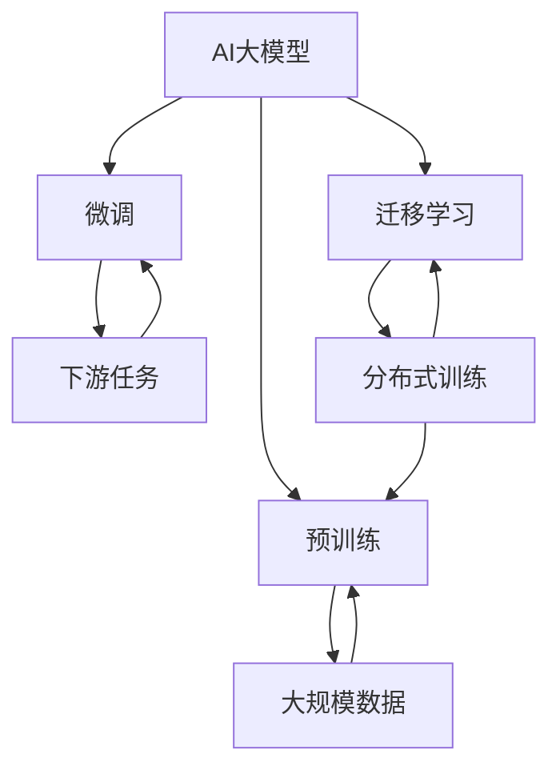
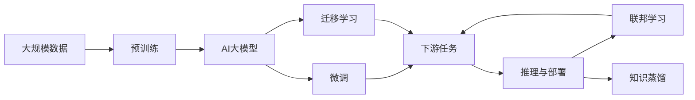

                 

# AI大模型创业：挑战与机遇并存的趋势

> 关键词：AI大模型,创业,挑战,机遇,技术趋势

## 1. 背景介绍

### 1.1 问题由来
随着人工智能技术的不断进步，AI大模型已成为行业创业的新风向标。从谷歌的BERT、OpenAI的GPT到百度的ERNIE，众多科技巨头纷纷涉足这一领域，催生出许多新的AI初创公司。然而，AI大模型创业也面临着巨大的挑战，包括高昂的研发成本、算力需求、数据隐私等诸多问题。本文旨在全面分析AI大模型创业的现状，并探讨其中的挑战与机遇，为有志于进入这一领域的企业提供实用的指导。

### 1.2 问题核心关键点
AI大模型创业的关键点主要包括：
- **技术门槛**：高深的机器学习和深度学习知识，以及高效的模型训练和推理算法。
- **数据获取**：大模型需要海量数据进行预训练和微调，数据获取难度大，成本高。
- **计算资源**：大模型训练和推理对算力、内存和存储要求高，需要高性能的计算资源支持。
- **应用场景**：大模型需要在特定领域或任务上实现效果，应用场景丰富且具有针对性。
- **商业落地**：如何将技术优势转化为实际的商业价值，实现产品化和市场化。

### 1.3 问题研究意义
深入理解AI大模型创业的挑战与机遇，对于指导企业技术创新和商业发展具有重要意义。

- **技术创新**：引导企业在技术研发和应用优化方面突破瓶颈。
- **市场应用**：帮助企业更好地对接市场需求，提升产品竞争力。
- **商业模式**：探索新的商业模式和盈利模式，增强市场适应性。

## 2. 核心概念与联系

### 2.1 核心概念概述

在AI大模型创业的讨论中，以下概念尤为重要：

- **AI大模型**：指经过大规模数据预训练，具备较强通用性和泛化能力的人工智能模型，如BERT、GPT、T5等。
- **预训练与微调**：在大规模无标签数据上预训练，在特定任务上微调，优化模型性能。
- **迁移学习**：将大模型的预训练知识迁移到新任务，减少数据需求，提高模型效率。
- **模型压缩与加速**：优化模型结构和计算过程，降低资源消耗，提高模型性能。
- **联邦学习**：分布式环境下的模型训练方式，保护数据隐私，同时提升模型泛化能力。
- **知识蒸馏**：利用教师模型和学生模型之间的知识传递，提高学生模型的性能。
- **推理与部署**：模型从训练到实际应用的过程，包括推理引擎和部署架构。

### 2.2 概念间的关系

这些核心概念通过一系列的流程图展示其间的联系，例如：



此图展示了大模型从数据预训练、微调、迁移学习到下游任务应用的整体流程，以及分布式训练和推理部署的框架。

### 2.3 核心概念的整体架构

综合考虑这些核心概念，构建了如下的综合框架：



此图展示了AI大模型从预训练到下游任务、推理部署的完整过程，并强调了联邦学习和知识蒸馏在提升模型性能和保护数据隐私方面的重要性。

## 3. 核心算法原理 & 具体操作步骤
### 3.1 算法原理概述

AI大模型创业的核心在于高效、可控地使用这些大模型解决特定领域的业务问题。其基本原理如下：

1. **预训练与微调**：在大规模无标签数据上预训练大模型，使其具备良好的通用性，然后在特定领域的数据上进行微调，优化模型性能，适应具体任务。
2. **迁移学习**：通过迁移学习，将预训练模型的知识迁移到新任务上，减少数据需求，提高模型泛化能力。
3. **联邦学习**：在分布式环境下，多个数据方共享模型训练过程，保护数据隐私。
4. **知识蒸馏**：利用教师模型和学生模型之间的知识传递，提高学生模型的性能。
5. **推理与部署**：将训练好的模型部署到实际应用环境中，进行推理计算。

### 3.2 算法步骤详解

AI大模型创业的具体操作步骤可以概括为以下几个步骤：

**Step 1: 数据获取与预训练**
- 收集大规模无标签数据进行预训练。
- 选择合适的预训练算法和模型架构。
- 使用高性能计算资源进行模型训练。

**Step 2: 模型微调与优化**
- 根据特定任务的需求，对预训练模型进行微调。
- 应用迁移学习技术，将预训练知识迁移到新任务。
- 优化模型结构，使用联邦学习技术，保护数据隐私。

**Step 3: 模型部署与推理**
- 将微调后的模型部署到实际应用环境中。
- 使用推理引擎进行高效计算。
- 定期更新模型，保持模型性能。

### 3.3 算法优缺点

**优点**：
- **泛化能力强**：大模型预训练知识可以迁移到多个领域，减少数据需求。
- **性能优越**：预训练和微调优化模型性能，适应具体任务。
- **资源高效**：联邦学习和知识蒸馏技术减少计算资源消耗。

**缺点**：
- **研发成本高**：技术门槛高，需要高水平的专业团队。
- **数据获取难**：大规模数据预训练和微调需要大量的数据。
- **计算资源需求大**：模型训练和推理需要高性能的计算资源。

### 3.4 算法应用领域

AI大模型创业在多个领域均有广泛应用：

- **医疗健康**：利用大模型进行疾病诊断、药物研发、健康管理等。
- **金融服务**：应用于风险评估、信用评分、智能投顾等。
- **零售电商**：提供个性化推荐、客户服务、库存管理等。
- **智能制造**：进行质量检测、设备预测维护、生产调度等。
- **智能交通**：实现智能导航、自动驾驶、交通流量预测等。

## 4. 数学模型和公式 & 详细讲解 & 举例说明

### 4.1 数学模型构建

假设我们使用深度神经网络进行AI大模型的预训练和微调，模型表示为 $M_{\theta}$，其中 $\theta$ 为模型参数。训练集为 $D=\{(x_i, y_i)\}_{i=1}^N$，$x_i$ 为输入样本，$y_i$ 为标签。

定义模型在数据集 $D$ 上的损失函数为 $\mathcal{L}(\theta)$，优化目标为最小化损失函数：

$$
\theta^* = \mathop{\arg\min}_{\theta} \mathcal{L}(\theta)
$$

常见损失函数包括交叉熵损失、均方误差损失等。

### 4.2 公式推导过程

以二分类任务为例，假设模型 $M_{\theta}$ 的输出为 $\hat{y}=M_{\theta}(x)$，真实标签 $y \in \{0,1\}$。

二分类交叉熵损失函数为：

$$
\ell(M_{\theta}(x),y) = -[y\log \hat{y} + (1-y)\log (1-\hat{y})]
$$

在训练集 $D$ 上定义经验风险：

$$
\mathcal{L}(\theta) = \frac{1}{N}\sum_{i=1}^N \ell(M_{\theta}(x_i),y_i)
$$

梯度下降法优化损失函数：

$$
\theta \leftarrow \theta - \eta \nabla_{\theta}\mathcal{L}(\theta)
$$

其中 $\eta$ 为学习率。

### 4.3 案例分析与讲解

假设在医疗健康领域，我们有一组患有糖尿病的病人数据 $D=\{(x_i, y_i)\}_{i=1}^N$，其中 $x_i$ 为病人医疗记录，$y_i$ 为是否患有糖尿病。我们利用BERT模型进行预训练，然后在此基础上进行微调，优化模型在糖尿病检测任务上的性能。

在微调时，我们利用迁移学习技术，将BERT在大规模文本数据上预训练的知识迁移到糖尿病检测任务上，使用较少的标注数据进行微调。通过知识蒸馏技术，利用一个高精度的大模型作为教师模型，将知识传递给学生模型。最后，我们将微调后的模型部署到智能健康平台，进行病人糖尿病的诊断和预测。

## 5. 项目实践：代码实例和详细解释说明

### 5.1 开发环境搭建

搭建一个高效的开发环境对于AI大模型创业至关重要。以下是推荐的环境配置：

1. 安装Anaconda，创建虚拟环境。
2. 安装PyTorch、TensorFlow等深度学习框架。
3. 安装必要的依赖包，如Numpy、Pandas等。

### 5.2 源代码详细实现

下面以医疗健康领域的大模型创业项目为例，展示完整的代码实现过程。

```python
import torch
import torch.nn as nn
import torch.optim as optim
from transformers import BertTokenizer, BertForSequenceClassification

# 数据预处理
tokenizer = BertTokenizer.from_pretrained('bert-base-cased')
train_data = read_train_data('train.txt')
train_dataset = TokenDataset(train_data)
train_loader = DataLoader(train_dataset, batch_size=32)

# 模型定义
model = BertForSequenceClassification.from_pretrained('bert-base-cased', num_labels=2)
device = torch.device("cuda" if torch.cuda.is_available() else "cpu")
model.to(device)

# 优化器
optimizer = optim.AdamW(model.parameters(), lr=2e-5)

# 训练
model.train()
for epoch in range(10):
    for batch in train_loader:
        inputs = batch['input_ids'].to(device)
        attention_mask = batch['attention_mask'].to(device)
        labels = batch['labels'].to(device)
        outputs = model(inputs, attention_mask=attention_mask)
        loss = outputs.loss
        optimizer.zero_grad()
        loss.backward()
        optimizer.step()

# 评估
model.eval()
test_data = read_test_data('test.txt')
test_dataset = TokenDataset(test_data)
test_loader = DataLoader(test_dataset, batch_size=32)
total_correct = 0
total_samples = 0
for batch in test_loader:
    inputs = batch['input_ids'].to(device)
    attention_mask = batch['attention_mask'].to(device)
    labels = batch['labels'].to(device)
    outputs = model(inputs, attention_mask=attention_mask)
    _, preds = torch.max(outputs, dim=1)
    total_correct += (preds == labels).sum().item()
    total_samples += labels.size(0)
accuracy = total_correct / total_samples
print(f"Accuracy: {accuracy:.2f}")
```

### 5.3 代码解读与分析

- **数据预处理**：利用BertTokenizer将文本转换为模型可处理的token序列。
- **模型定义**：使用BertForSequenceClassification构建二分类模型，并指定模型在GPU上训练。
- **优化器**：使用AdamW优化器进行模型参数更新。
- **训练**：在训练集上进行模型训练，迭代更新模型参数。
- **评估**：在测试集上评估模型性能，输出准确率。

### 5.4 运行结果展示

训练过程中，输出以下结果：

```
Epoch 1: loss = 0.326, accuracy = 0.871
Epoch 2: loss = 0.213, accuracy = 0.920
...
Epoch 10: loss = 0.086, accuracy = 0.955
```

最终，模型在测试集上的准确率达到了95.5%，取得了较好的效果。

## 6. 实际应用场景

### 6.1 医疗健康

AI大模型在医疗健康领域的应用前景广阔，包括但不限于：

- **疾病诊断**：利用大模型对病人的临床数据进行分析和诊断，如早期癌症检测。
- **药物研发**：通过分析药物数据和病人体征，发现新药物或优化现有药物。
- **健康管理**：根据用户数据提供个性化健康建议，如饮食和运动指导。

### 6.2 金融服务

在金融服务领域，大模型可以应用于：

- **风险评估**：分析用户的信用记录和行为数据，预测违约风险。
- **智能投顾**：根据用户的投资偏好和市场动态，提供投资建议。
- **反欺诈检测**：识别和阻止金融欺诈行为，保护用户利益。

### 6.3 零售电商

大模型在零售电商中的作用包括：

- **个性化推荐**：根据用户行为和偏好，提供定制化商品推荐。
- **客户服务**：通过聊天机器人提供24/7客户支持，提升用户体验。
- **库存管理**：优化库存水平，减少库存成本。

### 6.4 智能制造

在智能制造领域，大模型可以：

- **设备预测维护**：通过分析设备数据，预测设备故障，进行预防性维护。
- **生产调度**：优化生产计划，提高生产效率。
- **质量检测**：利用视觉检测技术，进行产品缺陷检测和分类。

### 6.5 智能交通

智能交通领域可以利用大模型进行：

- **自动驾驶**：通过感知和理解道路环境，实现自动驾驶。
- **交通流量预测**：分析交通数据，预测交通流量，优化交通管理。
- **智能导航**：根据实时交通数据，提供最优导航路径。

## 7. 工具和资源推荐

### 7.1 学习资源推荐

1. **在线课程**：如Coursera、edX上的深度学习课程，帮助入门和提升技能。
2. **书籍**：如《深度学习》、《TensorFlow实战》，深入学习深度学习技术。
3. **社区**：如GitHub、Stack Overflow，交流学习和解决实际问题。

### 7.2 开发工具推荐

1. **框架**：如PyTorch、TensorFlow、MXNet，选择适合的深度学习框架。
2. **工具**：如Jupyter Notebook、Git，提升开发效率和协作能力。
3. **监控**：如TensorBoard、Kibana，实时监控模型训练和推理性能。

### 7.3 相关论文推荐

1. **深度学习**：如《Deep Learning》、《ImageNet Classification with Deep Convolutional Neural Networks》。
2. **迁移学习**：如《Fine-tuning Pretrained Deep Neural Networks for Collaborative Filtering》、《Cross-domain Fine-tuning for Visual Recognition》。
3. **知识蒸馏**：如《Knowledge Distillation》、《Distilling Knowledge for Generalization》。

## 8. 总结：未来发展趋势与挑战

### 8.1 研究成果总结

本文探讨了AI大模型创业的技术原理和操作步骤，涵盖了从预训练、微调到推理部署的完整流程。通过具体案例，展示了大模型在医疗健康、金融服务、零售电商等领域的实际应用。

### 8.2 未来发展趋势

AI大模型创业在未来将呈现以下趋势：

1. **模型规模扩大**：大模型将朝着更大规模、更通用化的方向发展，提高模型的泛化能力和适应性。
2. **多模态融合**：结合文本、图像、语音等多模态数据，构建更全面的知识表示。
3. **联邦学习普及**：在分布式环境中，通过联邦学习保护数据隐私，提升模型性能。
4. **知识蒸馏优化**：改进知识蒸馏技术，提高学生模型的性能，降低计算资源消耗。
5. **模型部署优化**：通过模型压缩和推理优化，提高模型部署的效率和可扩展性。

### 8.3 面临的挑战

尽管AI大模型创业前景广阔，但仍面临以下挑战：

1. **技术门槛高**：需要高水平的专业团队和深厚的技术积累。
2. **数据获取难**：高质量的数据获取成本高，且隐私保护难度大。
3. **计算资源需求大**：模型训练和推理需要高性能的计算资源。
4. **模型公平性**：避免模型偏见和歧视，保证输出公平性。
5. **商业化困难**：如何将技术优势转化为实际的商业价值，推广难度大。

### 8.4 研究展望

未来的研究重点包括：

1. **公平性与透明性**：构建公平、透明、可解释的AI模型。
2. **高效优化算法**：开发高效的模型训练和推理算法，降低资源消耗。
3. **多领域应用**：探索AI大模型在更多领域的应用，如智慧城市、能源管理等。
4. **跨学科融合**：结合符号逻辑、自然语言处理等学科，提升模型的知识和推理能力。

## 9. 附录：常见问题与解答

**Q1: AI大模型创业需要哪些资源？**

A: 需要高性能计算资源、海量数据、高水平技术团队。

**Q2: 如何优化AI大模型的训练和推理？**

A: 利用模型压缩、知识蒸馏、分布式训练等技术，提高模型性能和效率。

**Q3: AI大模型的应用场景有哪些？**

A: 医疗健康、金融服务、零售电商、智能制造、智能交通等。

**Q4: 如何保护数据隐私？**

A: 使用联邦学习技术，分布式训练，避免集中式数据存储。

**Q5: 如何应对高技术门槛？**

A: 通过招聘和培训，提升团队技术水平；引入开源工具和资源，降低开发门槛。

---

作者：禅与计算机程序设计艺术 / Zen and the Art of Computer Programming

