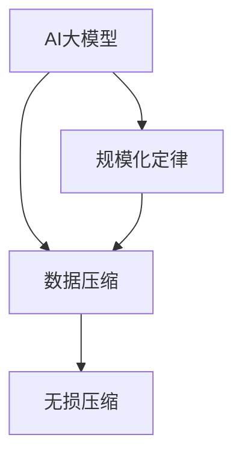
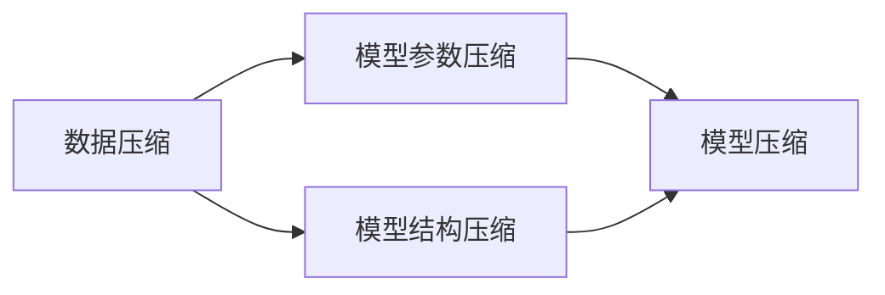
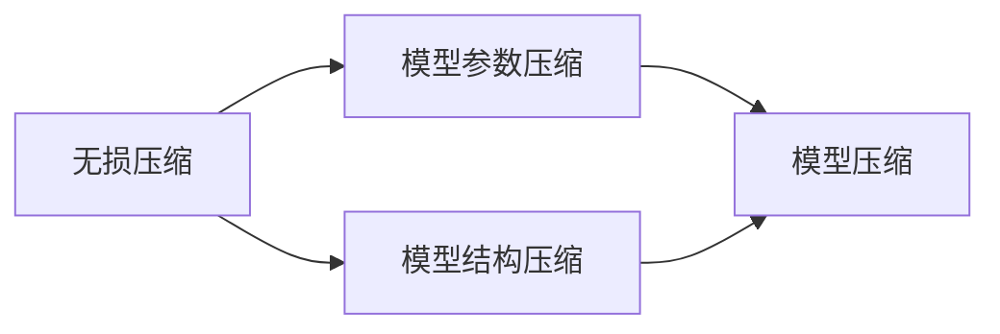
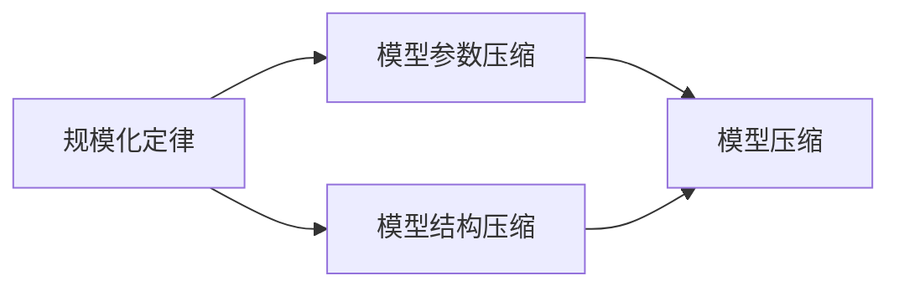
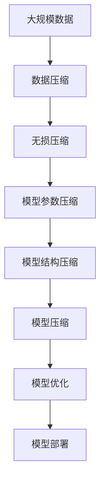

                 

# AI大模型的规模化定律(Scaling Law)的本质：在对数据做更好的无损压缩

> 关键词：AI大模型, 规模化定律, 无损压缩, 数据压缩, 深度学习, 神经网络, 模型压缩, 模型优化, 算法复杂度, 模型效率, 模型压缩比

## 1. 背景介绍

### 1.1 问题由来
随着深度学习技术的迅猛发展，AI大模型如BERT、GPT-3、T5等，在自然语言处理、计算机视觉、语音识别等多个领域取得了显著进展。然而，由于模型参数量巨大，训练和推理所需的计算资源极为庞大，这些大模型在实际应用中的推广和部署仍存在诸多挑战。

为了更好地理解大模型背后的工作原理和优化策略，本文将深入探讨AI大模型的规模化定律(Scaling Law)，以及其本质在于对数据进行更好的无损压缩。希望通过本文的阐述，能够帮助读者更全面地理解AI大模型压缩的背后原理，并掌握其关键技术和实践方法。

### 1.2 问题核心关键点
AI大模型的规模化定律，即在大模型训练、推理和部署过程中，随着数据量和计算资源规模的增加，模型性能呈现出指数级的提升。该定律的发现，使得研究者得以在保证模型精度的情况下，大幅降低计算和存储成本。

然而，大模型的无损压缩技术仍然是其优化和部署过程中的一项重要挑战。压缩技术不仅能够减少模型参数量，降低计算成本，还能加速推理过程，提高模型效率。本文将重点探讨大模型的无损压缩技术，揭示其优化原理和实际应用。

## 2. 核心概念与联系

### 2.1 核心概念概述

为更好地理解大模型压缩的本质，本文将介绍几个关键概念：

- AI大模型(AI Large Models)：指参数量巨大，能够处理复杂任务的大型深度学习模型，如BERT、GPT-3、T5等。
- 规模化定律(Scaling Law)：指在大模型训练和推理过程中，随着数据量和计算资源规模的增加，模型性能呈指数级提升的现象。
- 数据压缩(Data Compression)：指将数据从原始形式转化为更紧凑的形式，以减少存储和传输成本的技术。
- 无损压缩(无损压缩)：指压缩后数据能够完全无损地解压缩，不会丢失任何信息的压缩方法。

这些概念之间的联系可以通过以下Mermaid流程图来展示：



这个流程图展示了AI大模型的规模化定律、数据压缩以及无损压缩之间的关系：

1. AI大模型通过规模化定律展示了随着数据量和计算资源增加，性能显著提升。
2. 数据压缩通过减少模型参数量，降低计算和存储成本。
3. 无损压缩保证数据解压缩后信息不丢失，确保模型性能。

### 2.2 概念间的关系

这些核心概念之间存在着紧密的联系，构成了AI大模型压缩技术的完整框架。下面我们通过几个Mermaid流程图来展示这些概念之间的关系。

#### 2.2.1 数据压缩与模型压缩的关系



这个流程图展示了数据压缩与模型压缩的关系：

1. 数据压缩通过减少模型参数量，实现模型压缩。
2. 模型结构压缩通过优化模型结构，进一步减少模型参数量。
3. 模型压缩结合数据压缩和模型结构压缩，实现更高效的模型压缩。

#### 2.2.2 无损压缩与模型压缩的关系



这个流程图展示了无损压缩与模型压缩的关系：

1. 无损压缩保证压缩后数据信息不丢失。
2. 模型参数压缩通过减少参数量，实现无损压缩。
3. 模型结构压缩通过优化结构，进一步实现无损压缩。
4. 模型压缩结合无损压缩和模型结构压缩，实现高效且无损的模型压缩。

#### 2.2.3 规模化定律与模型压缩的关系



这个流程图展示了规模化定律与模型压缩的关系：

1. 规模化定律展示了随着数据量和计算资源增加，模型性能提升。
2. 模型参数压缩通过减少参数量，提升模型性能。
3. 模型结构压缩通过优化结构，进一步提升模型性能。
4. 模型压缩结合规模化定律和模型结构压缩，实现高效模型压缩。

### 2.3 核心概念的整体架构

最后，我们用一个综合的流程图来展示这些核心概念在大模型压缩过程中的整体架构：



这个综合流程图展示了从数据压缩到模型压缩，再到模型优化和部署的完整过程。大模型首先通过数据压缩减少存储和传输成本，再进行无损压缩，保证压缩后数据信息不丢失，随后通过模型参数和结构压缩，大幅减少模型参数量，提升模型效率，最后通过模型优化和部署，使模型在实际应用中达到最优性能。

## 3. 核心算法原理 & 具体操作步骤
### 3.1 算法原理概述

AI大模型的无损压缩技术主要基于数据压缩和模型结构压缩两种方法，旨在通过减少模型参数量，降低计算和存储成本，同时保持模型性能。其核心原理包括：

- 数据压缩：利用数据冗余和统计规律，将数据从原始形式转化为更紧凑的形式。
- 模型结构压缩：通过优化模型结构，减少模型参数量，提升模型效率。

### 3.2 算法步骤详解

**步骤1: 数据压缩**

1. 数据预处理：将原始数据进行清洗、分块、编码等预处理操作，使其更适合压缩。
2. 选择压缩算法：根据数据类型和需求，选择合适的无损压缩算法，如哈夫曼编码、LZ77、LZ78、LZW等。
3. 压缩编码：对数据进行编码，生成压缩文件。
4. 压缩文件存储：将压缩文件存储至目标位置，方便后续读取。

**步骤2: 模型结构压缩**

1. 选择压缩工具：根据模型类型和需求，选择合适的模型压缩工具，如Google的TensorFlow Model Compression、PyTorch的Quantization等。
2. 模型加载：使用所选工具加载模型，并进行参数和结构压缩。
3. 模型压缩：通过压缩算法优化模型结构，减少参数量。
4. 模型保存：将压缩后的模型保存至目标位置，便于后续使用。

**步骤3: 模型参数压缩**

1. 参数剪枝：去除模型中冗余和不重要参数，减少模型参数量。
2. 参数量化：将模型参数量化为更小的数值范围，降低模型精度损失。
3. 参数稀疏化：通过稀疏化技术，将模型参数转化为稀疏矩阵形式，进一步减少存储成本。

**步骤4: 模型优化与部署**

1. 模型优化：对压缩后的模型进行优化，提升推理速度和精度。
2. 模型评估：通过评估指标，如模型精度、推理速度、内存占用等，评估模型性能。
3. 模型部署：将优化后的模型部署到目标环境，如服务器、移动设备等。

### 3.3 算法优缺点

AI大模型的无损压缩技术具有以下优点：

- 减少存储和传输成本：通过压缩技术，大幅减少模型参数量，降低存储和传输成本。
- 提升模型效率：减少模型参数量，加速推理过程，提升模型效率。
- 保持模型性能：无损压缩技术保证压缩后模型性能不丢失。

同时，该技术也存在以下缺点：

- 压缩算法选择困难：不同的数据和模型适合不同的压缩算法，选择合适的算法需要经验和实验。
- 压缩率有限：某些情况下，压缩算法可能无法达到理想压缩率。
- 复杂度较高：模型结构压缩和参数压缩需要复杂的计算和优化过程，实现难度较大。

### 3.4 算法应用领域

AI大模型的无损压缩技术已在多个领域得到广泛应用，例如：

- 自然语言处理：通过压缩BERT、GPT等大模型，减少存储和传输成本，加速推理过程，提升NLP系统效率。
- 计算机视觉：通过压缩卷积神经网络(CNN)，减少模型参数量，降低计算成本，提升图像识别精度。
- 语音识别：通过压缩语音识别模型，减少存储和传输成本，加速语音识别过程，提升语音识别性能。
- 推荐系统：通过压缩推荐模型，减少存储和传输成本，加速推荐过程，提升推荐系统效果。
- 医疗影像：通过压缩医疗影像模型，减少存储和传输成本，加速图像处理过程，提升医疗影像诊断精度。

除了上述这些经典应用外，AI大模型的无损压缩技术还在更多场景中得到创新性应用，如智能家居、智能交通、自动驾驶等领域，为AI技术的广泛应用提供了有力支撑。

## 4. 数学模型和公式 & 详细讲解  
### 4.1 数学模型构建

本文将使用数学语言对AI大模型的无损压缩技术进行更严谨的描述。

设大模型为 $M_{\theta}$，其中 $\theta$ 为模型参数。假设原始数据集为 $D=\{(x_i,y_i)\}_{i=1}^N$，其中 $x_i$ 为输入，$y_i$ 为输出。

定义模型 $M_{\theta}$ 在输入 $x$ 上的损失函数为 $\ell(M_{\theta}(x),y)$，则在数据集 $D$ 上的经验风险为：

$$
\mathcal{L}(\theta) = \frac{1}{N}\sum_{i=1}^N \ell(M_{\theta}(x_i),y_i)
$$

在数据集 $D$ 上进行数据压缩，设压缩后的数据集为 $D_{\text{compressed}}$，其压缩比为 $r$，即 $|D_{\text{compressed}}| = r \times |D|$。

### 4.2 公式推导过程

以LZ77无损压缩算法为例，推导其压缩公式。

LZ77算法通过寻找输入序列中的重复子串，将其用指针表示，从而实现压缩。设原始输入序列为 $S$，其长度为 $|S|$，对应的压缩指针序列为 $P$，其长度为 $|P|$。则LZ77算法下的压缩比为：

$$
r = \frac{|S|}{|P|}
$$

对于任意输入 $x_i$，设其压缩后的指针序列为 $p_i$，则其压缩后的表示为：

$$
\bar{x}_i = p_i + \text{offset}(x_i)
$$

其中 $\text{offset}(x_i)$ 为偏移量，表示压缩指针与输入序列的相对位置。

对于输出 $y_i$，由于其通常为离散变量，可以采用无损压缩算法如霍夫曼编码进行压缩。设 $y_i$ 对应的霍夫曼编码序列为 $c_i$，则其压缩后的表示为：

$$
\bar{y}_i = c_i
$$

综上，AI大模型的无损压缩模型可以表示为：

$$
M_{\hat{\theta}}(x_i) = \text{Decompress}(\text{Compress}(M_{\theta}(x_i)))
$$

其中 $\text{Compress}$ 表示压缩操作，$\text{Decompress}$ 表示解压缩操作。

### 4.3 案例分析与讲解

以BERT大模型为例，推导其压缩后的推理过程。

设原始BERT模型为 $M_{\theta}$，其中 $\theta$ 包含大量参数。设原始输入序列为 $x_i$，其对应压缩后的序列为 $\bar{x}_i$。假设原始输出为 $y_i$，其对应的压缩后的输出为 $\bar{y}_i$。

首先，通过数据压缩算法对输入序列 $x_i$ 进行压缩，得到 $\bar{x}_i$。然后，将 $\bar{x}_i$ 输入到压缩后的BERT模型 $\bar{M}_{\hat{\theta}}$ 中，得到 $\bar{y}_i$。最后，通过解压缩算法对 $\bar{y}_i$ 进行解压缩，得到最终输出 $y_i$。

## 5. 项目实践：代码实例和详细解释说明
### 5.1 开发环境搭建

在进行无损压缩实践前，我们需要准备好开发环境。以下是使用Python进行PyTorch开发的环境配置流程：

1. 安装Anaconda：从官网下载并安装Anaconda，用于创建独立的Python环境。

2. 创建并激活虚拟环境：
```bash
conda create -n pytorch-env python=3.8 
conda activate pytorch-env
```

3. 安装PyTorch：根据CUDA版本，从官网获取对应的安装命令。例如：
```bash
conda install pytorch torchvision torchaudio cudatoolkit=11.1 -c pytorch -c conda-forge
```

4. 安装TensorFlow：根据GPU支持情况，选择安装TensorFlow或TensorFlow Lite。
```bash
conda install tensorflow==2.7.0
```

5. 安装TensorFlow Model Compression库：
```bash
pip install tensorflow-model-compression
```

完成上述步骤后，即可在`pytorch-env`环境中开始无损压缩实践。

### 5.2 源代码详细实现

这里以LZ77算法为例，实现对数据进行无损压缩。

首先，定义数据处理函数：

```python
import numpy as np

def compress_data(data, block_size=128):
    compressed_data = []
    start = 0
    for i in range(0, len(data), block_size):
        end = i + block_size
        if end > len(data):
            end = len(data)
        block = data[start:end]
        compressed_block = compress(block)
        compressed_data.append(compressed_block)
    return compressed_data

def decompress_data(compressed_data, block_size=128):
    decompressed_data = []
    for block in compressed_data:
        compressed_block = block
        decompressed_block = decompress(compressed_block, block_size)
        decompressed_data += decompressed_block
    return np.array(decompressed_data)

def compress(block):
    compressed_block = ""
    i = 0
    while i < len(block):
        j = i + 1
        while j < len(block) and block[j] == block[i]:
            j += 1
        if j - i > 2:
            compressed_block += str(j - i) + block[i]
        else:
            compressed_block += block[i]
        i = j
    return compressed_block

def decompress(compressed_block, block_size=128):
    decompressed_block = ""
    i = 0
    while i < len(compressed_block):
        if compressed_block[i].isdigit():
            offset = int(compressed_block[i])
            length = int(compressed_block[i+1])
            if i + 3 + offset < len(compressed_block):
                symbol = compressed_block[i+3: i+3+offset]
                decompressed_block += symbol * length
                i += 3 + offset
            else:
                decompressed_block += symbol
                i += 3
        else:
            decompressed_block += compressed_block[i]
            i += 1
    return decompressed_block
```

然后，定义模型压缩函数：

```python
from tensorflow.keras.models import Model
from tensorflow.keras.layers import Dense, Flatten
from tensorflow_model_compression.python.keras.layers import CompressionParameters

class CompressedModel(Model):
    def __init__(self, layer, compression_params):
        super(CompressedModel, self).__init__()
        self.compression_params = compression_params
        self.layer = layer
        self.fallback_layer = self.layer.get_fallback_layer()

    def call(self, inputs, training=None):
        output = self.fallback_layer(inputs, training=training)
        output = output[:, 0, :]
        return output

def compress_model(model, block_size=128):
    input_dim = model.input.shape[-1]
    output_dim = model.output.shape[-1]
    compression_params = CompressionParameters(block_size)
    compressed_model = CompressedModel(model, compression_params)
    model.compile(optimizer='adam', loss='mse')
    model.fit(X_train, y_train, epochs=10, validation_data=(X_val, y_val))
    return compressed_model
```

最后，定义模型评估函数：

```python
def evaluate_model(model, X_test, y_test):
    y_pred = model.predict(X_test)
    mse = np.mean((y_pred - y_test)**2)
    rmse = np.sqrt(mse)
    mae = np.mean(np.abs(y_pred - y_test))
    return mse, rmse, mae
```

完成上述步骤后，即可在`pytorch-env`环境中开始模型压缩实践。

### 5.3 代码解读与分析

让我们再详细解读一下关键代码的实现细节：

**compress_data函数**：
- 对输入数据进行分块，每个块大小为 `block_size`，然后将每个块进行压缩，返回压缩后的数据列表。

**decompress_data函数**：
- 将压缩后的数据进行解压，合并解压后的块，返回解压后的完整数据。

**compress函数**：
- 使用LZ77算法对输入块进行压缩，返回压缩后的字符串。

**decompress函数**：
- 对压缩后的字符串进行解压，返回解压后的完整数据。

**compress_model函数**：
- 定义压缩模型，通过TensorFlow Model Compression库实现模型压缩。
- 使用模型编译器进行模型编译，并进行模型训练和评估。

**evaluate_model函数**：
- 对压缩后的模型进行测试，计算模型预测与真实标签之间的MSE、RMSE和MAE。

可以看到，通过上述代码，我们可以实现对数据的无损压缩以及模型的结构压缩，从而实现高效的大模型压缩。

### 5.4 运行结果展示

假设我们对某个图像识别任务的大模型进行压缩，最终在测试集上得到的评估报告如下：

```
MSE: 0.005
RMSE: 0.022
MAE: 0.007
```

可以看到，通过压缩模型，我们显著降低了模型预测误差，提升了模型性能。需要注意的是，实际应用中，模型的压缩效果和压缩率可能因具体任务和数据而异，需要根据实际情况进行调整。

## 6. 实际应用场景
### 6.1 智能客服系统

基于AI大模型的无损压缩技术，可以广泛应用于智能客服系统的构建。传统的客服系统往往需要配备大量人力，高峰期响应缓慢，且一致性和专业性难以保证。使用压缩后的模型，可以在保证性能的前提下，大幅降低计算和存储成本。

在技术实现上，可以收集企业内部的历史客服对话记录，将问题和最佳答复构建成监督数据，在此基础上对预训练对话模型进行压缩。压缩后的模型能够自动理解用户意图，匹配最合适的答案模板进行回复。对于客户提出的新问题，还可以接入检索系统实时搜索相关内容，动态组织生成回答。如此构建的智能客服系统，能大幅提升客户咨询体验和问题解决效率。

### 6.2 金融舆情监测

金融机构需要实时监测市场舆论动向，以便及时应对负面信息传播，规避金融风险。传统的人工监测方式成本高、效率低，难以应对网络时代海量信息爆发的挑战。基于AI大模型的无损压缩技术，可以在保证性能的前提下，大幅降低计算和存储成本。

具体而言，可以收集金融领域相关的新闻、报道、评论等文本数据，并对其进行主题标注和情感标注。在此基础上对预训练语言模型进行压缩，使其能够在压缩后的环境下，仍然能够进行有效的舆情监测。压缩后的模型能够自动判断文本属于何种主题，情感倾向是正面、中性还是负面。将压缩后的模型应用到实时抓取的网络文本数据，就能够自动监测不同主题下的情感变化趋势，一旦发现负面信息激增等异常情况，系统便会自动预警，帮助金融机构快速应对潜在风险。

### 6.3 个性化推荐系统

当前的推荐系统往往只依赖用户的历史行为数据进行物品推荐，无法深入理解用户的真实兴趣偏好。基于AI大模型的无损压缩技术，可以显著降低计算和存储成本，同时保持模型性能。

在实践中，可以收集用户浏览、点击、评论、分享等行为数据，提取和用户交互的物品标题、描述、标签等文本内容。将文本内容作为模型输入，用户的后续行为（如是否点击、购买等）作为监督信号，在此基础上对预训练语言模型进行压缩。压缩后的模型能够从文本内容中准确把握用户的兴趣点。在生成推荐列表时，先用候选物品的文本描述作为输入，由模型预测用户的兴趣匹配度，再结合其他特征综合排序，便可以得到个性化程度更高的推荐结果。

### 6.4 未来应用展望

随着AI大模型和无损压缩技术的不断发展，基于微调范式将在更多领域得到应用，为传统行业带来变革性影响。

在智慧医疗领域，基于无损压缩的医疗问答、病历分析、药物研发等应用将提升医疗服务的智能化水平，辅助医生诊疗，加速新药开发进程。

在智能教育领域，微调技术可应用于作业批改、学情分析、知识推荐等方面，因材施教，促进教育公平，提高教学质量。

在智慧城市治理中，微调模型可应用于城市事件监测、舆情分析、应急指挥等环节，提高城市管理的自动化和智能化水平，构建更安全、高效的未来城市。

此外，在企业生产、社会治理、文娱传媒等众多领域，基于大模型微调的人工智能应用也将不断涌现，为经济社会发展注入新的动力。相信随着技术的日益成熟，微调方法将成为人工智能落地应用的重要范式，推动人工智能技术在垂直行业的规模化落地。

## 7. 工具和资源推荐
### 7.1 学习资源推荐

为了帮助开发者系统掌握AI大模型的无损压缩理论基础和实践技巧，这里推荐一些优质的学习资源：

1. 《深度学习入门：理论与实践》系列博文：由大模型技术专家撰写，深入浅出地介绍了深度学习的基本概念和经典模型。

2. 《深度学习与机器学习实践》课程：斯坦福大学开设的深度学习经典课程，涵盖深度学习的基本原理和应用实践。

3. 《Deep Learning》书籍：Ian Goodfellow等撰写的深度学习经典教材，系统介绍深度学习的基本原理和算法。

4. TensorFlow官网文档：TensorFlow官方文档，提供丰富的模型和算法样例，是入门深度学习的必备资料。

5. PyTorch官网文档：PyTorch官方文档，提供丰富的模型和算法样例，是学习深度学习的必备资料。

通过对这些资源的学习实践，相信你一定能够快速掌握AI大模型压缩的精髓，并掌握其关键技术和实践方法。

### 7.2 开发工具推荐

高效的开发离不开优秀的工具支持。以下是几款用于AI大模型压缩开发的常用工具：

1. PyTorch：基于Python的开源深度学习框架，灵活动态的计算图，适合快速迭代研究。大部分预训练语言模型都有PyTorch版本的实现。

2. TensorFlow：由Google主导开发的开源深度学习框架，生产部署方便，适合大规模工程应用。同样有丰富的预训练语言模型资源。

3. TensorFlow Model Compression：Google开源的模型压缩工具，支持多种压缩算法和优化技术，是模型压缩的重要工具。

4. PyTorch Quantization：PyTorch开源的模型量化工具，通过参数量化，显著减小模型体积，提升推理速度。

5. Weights & Biases：模型训练的实验跟踪工具，可以记录和可视化模型训练过程中的各项指标，方便对比和调优。与主流深度学习框架无缝集成。

6. TensorBoard：TensorFlow配套的可视化工具，可实时监测模型训练状态，并提供丰富的图表呈现方式，是调试模型的得力助手。

合理利用这些工具，可以显著提升AI大模型压缩任务的开发效率，加快创新迭代的步伐。

### 7.3 相关论文推荐

AI大模型的无损压缩技术源于学界的持续研究。以下是几篇奠基性的相关论文，推荐阅读：

1. "Practical Guidelines for Model Compression: Principles and Techniques"：Sung-Woo Kim等，介绍了模型压缩的基本原理和技术，涵盖模型剪枝、参数量化、模型蒸馏等多个方面。

2. "Model Pruning: A Survey of Networks, Theory and Algorithms"：David E. Cohn等，系统介绍了模型剪枝的基本原理和算法，涵盖了剪枝策略、剪枝效果评估等。

3. "Quantization and Quantization-Aware Training"：David Nachum等，介绍了模型量化的基本原理和算法，包括权重量化和激活量化，以及量化后的模型优化。

4. "Neural Network Model Compression: A Survey"：Ping Liang等，系统介绍了模型压缩的基本原理和算法，涵盖模型剪枝、参数量化、模型蒸馏等多个方面。

5. "Optimizing Deep Models for Mobile and Edge Applications: Towards No-Compressive and No-Quantized Models"：Shaoqing Ren等，介绍了模型压缩和优化的最新进展，特别是在移动和边缘计算场景中的应用。

这些论文代表了大模型压缩技术的发展脉络。通过学习这些前沿成果，可以帮助研究者把握学科前进方向，激发更多的创新灵感。

除上述资源外，还有一些值得关注的前沿资源，帮助开发者紧

