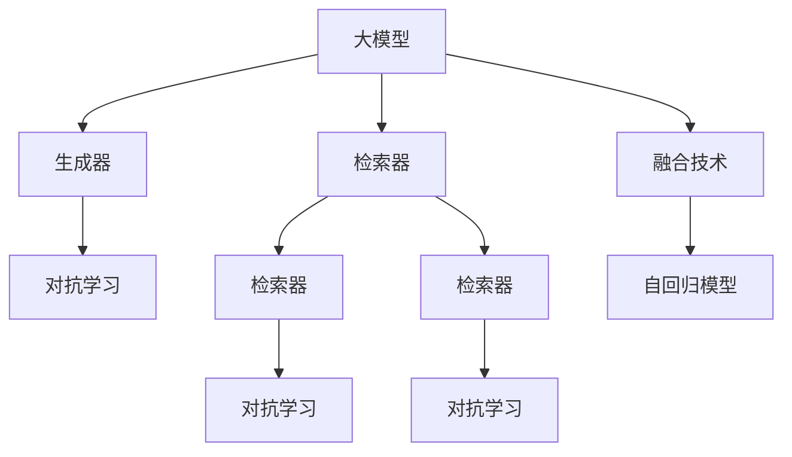
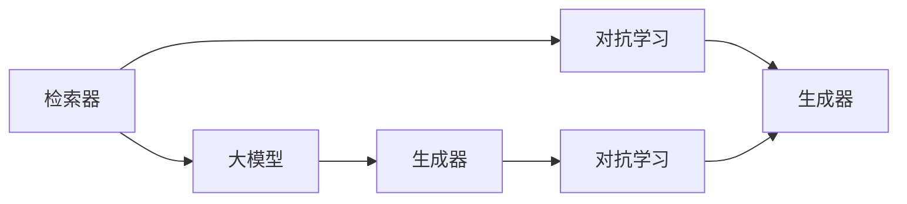
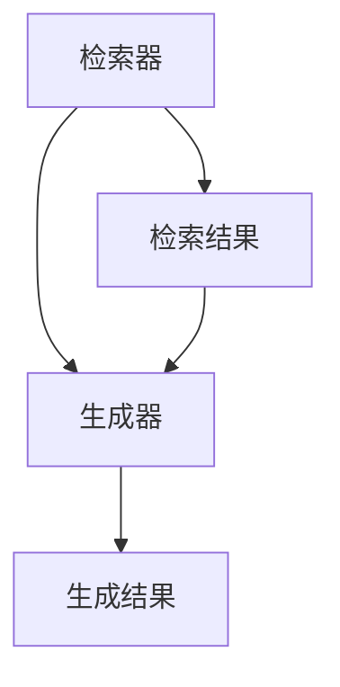
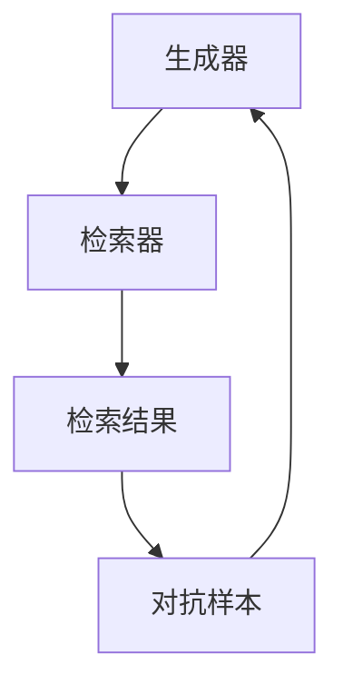
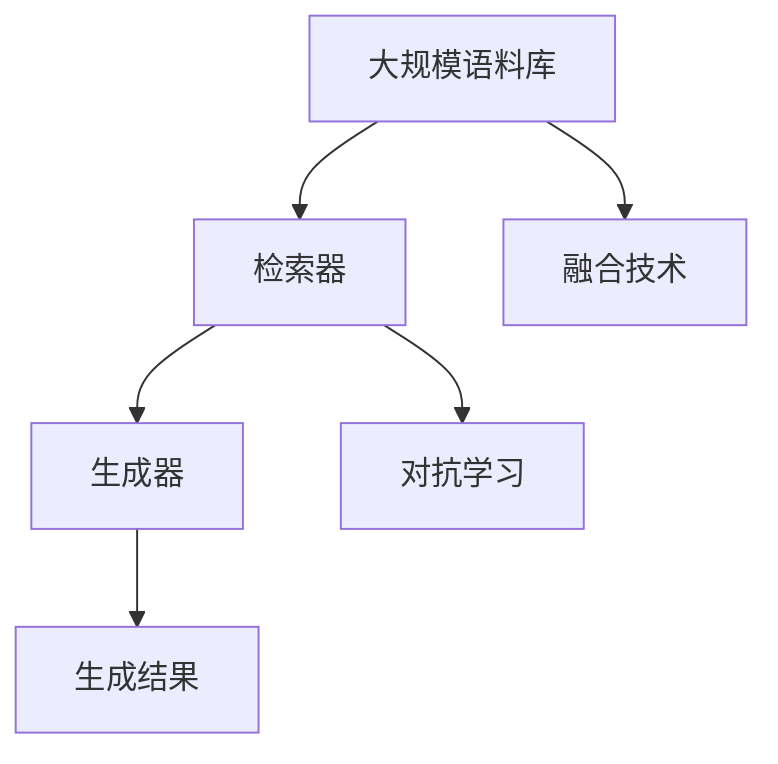
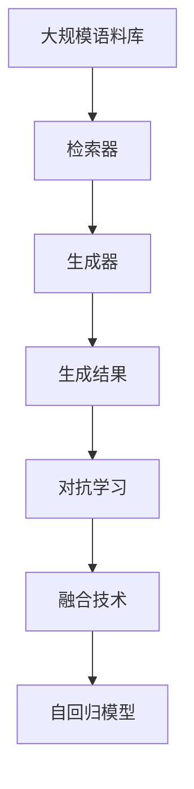

                 

# AI工程学：大模型应用开发实战：RAG

> 关键词：大模型应用开发, RAG模型, 自回归模型, 生成对抗网络, 深度学习, 自然语言处理(NLP), 图像生成

## 1. 背景介绍

### 1.1 问题由来

随着深度学习和大规模语言模型（Large Language Models, LLMs）的兴起，AI技术在自然语言处理（NLP）和计算机视觉等领域取得了显著进展。然而，大模型的训练和推理过程非常耗时和资源密集，限制了其在实际应用中的落地速度和范围。近年来，一种新型的模型结构——RAG（Retrieval-Augmented Generative Adversarial Network）被提出，其结合了检索和生成模型的优点，显著提升了生成任务的效率和质量。

RAG模型利用检索器（Retriever）在大规模语料库中寻找与当前生成任务最相关的文本，然后将这些文本与生成模型（如GPT-3、DALL·E等）相结合，生成更加准确和多样化的输出。由于其高效的生成性能，RAG模型在图像生成、文本生成、对话系统等多个领域展现出了巨大的潜力。

### 1.2 问题核心关键点

RAG模型的核心思想是：通过检索器在大规模语料库中找到最相关的文本，然后与生成器相结合，生成高质量的文本或图像。其关键点包括：

- **检索器（Retriever）**：负责在大规模语料库中寻找与当前生成任务最相关的文本。
- **生成器（Generator）**：负责根据检索到的文本生成高质量的输出。
- **对抗学习（Adversarial Learning）**：通过生成器和检索器的对抗训练，提升生成器输出的质量。
- **融合技术**：将检索器与生成器巧妙结合，实现高效的生成任务。

RAG模型在大规模语料库和生成器之间建立了高效的桥梁，显著提升了生成任务的效率和效果。其不仅适用于图像生成、文本生成等任务，还可以用于对话系统、自然语言推理等多个领域。

### 1.3 问题研究意义

RAG模型的研究对于拓展AI技术的应用范围，提升生成任务的性能，加速技术产业化进程具有重要意义：

- **降低应用开发成本**：通过结合检索和生成技术，RAG模型可以显著减少从头开发所需的数据、计算和人力等成本投入。
- **提升模型效果**：RAG模型结合了大模型的语言理解和生成能力，能够在生成任务上取得更优的表现。
- **加速开发进度**：RAG模型可以加速模型的训练和推理过程，缩短开发周期。
- **技术创新**：RAG模型引入了对抗学习等前沿技术，催生了新的研究方向。
- **赋能产业升级**：RAG模型可以赋能各行各业，为传统行业数字化转型升级提供新的技术路径。

## 2. 核心概念与联系

### 2.1 核心概念概述

为了更好地理解RAG模型的核心原理和架构，本节将介绍几个密切相关的核心概念：

- **大模型（Large Language Model）**：指具有强大语言生成和理解能力的深度学习模型，如GPT-3、DALL·E等。
- **检索器（Retriever）**：在大规模语料库中检索最相关的文本。
- **生成器（Generator）**：根据检索到的文本生成高质量的输出。
- **对抗学习（Adversarial Learning）**：生成器和检索器之间的对抗训练，提升生成器输出的质量。
- **融合技术**：将检索器与生成器结合，实现高效的生成任务。
- **自回归模型（Autoregressive Model）**：基于前文信息生成后文的生成模型，如GPT-3。

这些核心概念之间存在紧密的联系，形成了RAG模型的完整生态系统。下面通过Mermaid流程图来展示这些概念之间的关系：



这个流程图展示了RAG模型的核心概念及其之间的关系：

1. 大模型通过预训练获得基础能力。
2. 检索器在大规模语料库中寻找最相关的文本。
3. 生成器根据检索到的文本生成高质量的输出。
4. 对抗学习提升生成器输出的质量。
5. 融合技术将检索器和生成器结合，实现高效的生成任务。
6. 自回归模型基于前文信息生成后文。

这些概念共同构成了RAG模型的学习和应用框架，使其能够在各种生成任务上发挥强大的语言生成和理解能力。通过理解这些核心概念，我们可以更好地把握RAG模型的工作原理和优化方向。

### 2.2 概念间的关系

这些核心概念之间存在着紧密的联系，形成了RAG模型的完整生态系统。下面我们通过几个Mermaid流程图来展示这些概念之间的关系。

#### 2.2.1 RAG模型的学习范式



这个流程图展示了RAG模型的基本原理，即检索器在大规模语料库中寻找最相关的文本，生成器根据这些文本生成高质量的输出，对抗学习提升生成器的性能。

#### 2.2.2 检索器与生成器的关系



这个流程图展示了检索器与生成器的关系，检索器在大规模语料库中检索文本，生成器根据这些文本生成高质量的输出。

#### 2.2.3 对抗学习过程



这个流程图展示了对抗学习的过程，即生成器根据检索到的文本生成对抗样本，检索器根据这些样本找到最相关的文本，两者进行对抗训练，提升生成器输出的质量。

#### 2.2.4 RAG模型的整体架构



这个综合流程图展示了RAG模型的完整过程。大模型通过检索器在大规模语料库中寻找最相关的文本，生成器根据这些文本生成高质量的输出，对抗学习提升生成器的性能，融合技术将检索器和生成器结合，实现高效的生成任务。

### 2.3 核心概念的整体架构

最后，我们用一个综合的流程图来展示这些核心概念在大模型微调过程中的整体架构：



这个综合流程图展示了RAG模型的完整过程。大模型通过检索器在大规模语料库中寻找最相关的文本，生成器根据这些文本生成高质量的输出，对抗学习提升生成器的性能，融合技术将检索器和生成器结合，实现高效的生成任务，自回归模型基于前文信息生成后文。

## 3. 核心算法原理 & 具体操作步骤
### 3.1 算法原理概述

RAG模型的核心思想是通过检索器在大规模语料库中寻找最相关的文本，然后将这些文本与生成器相结合，生成高质量的输出。其核心算法原理包括以下几个方面：

1. **检索器**：在大规模语料库中检索与当前生成任务最相关的文本。
2. **生成器**：根据检索到的文本生成高质量的输出。
3. **对抗学习**：生成器和检索器之间的对抗训练，提升生成器输出的质量。
4. **融合技术**：将检索器与生成器结合，实现高效的生成任务。

### 3.2 算法步骤详解

RAG模型的核心算法步骤如下：

**Step 1: 准备预训练模型和语料库**

- 选择合适的预训练语言模型，如GPT-3、DALL·E等，作为生成器的初始化参数。
- 准备大规模语料库，如维基百科、新闻报道、开源代码等，作为检索器的训练数据。

**Step 2: 设计检索器**

- 设计检索器模型，如向量检索器、布尔检索器等，在大规模语料库中检索最相关的文本。
- 使用深度学习模型（如Transformer、BERT等）作为检索器的参数，通过在大规模语料库上的监督训练获得检索能力。

**Step 3: 设计生成器**

- 设计生成器模型，如GPT-3、DALL·E等，根据检索到的文本生成高质量的输出。
- 使用深度学习模型作为生成器的参数，通过在特定任务上的监督训练获得生成能力。

**Step 4: 对抗学习训练**

- 使用对抗学习算法（如GANs、Wasserstein GANs等），对生成器和检索器进行联合训练，提升生成器输出的质量。
- 生成器生成对抗样本，检索器根据这些样本找到最相关的文本，两者进行对抗训练，不断提升生成器的性能。

**Step 5: 融合技术结合**

- 将检索器和生成器结合，实现高效的生成任务。
- 通过融合技术（如文本合并、拼接等），将检索器与生成器结合，实现高效的生成任务。

**Step 6: 微调和优化**

- 对生成器进行微调，进一步提升生成器的性能。
- 通过超参数调优、正则化等技术，优化模型的性能。

### 3.3 算法优缺点

RAG模型结合了检索器和生成器的优点，具有以下优缺点：

**优点：**

- **高效性**：检索器在大规模语料库中快速检索最相关的文本，生成器基于这些文本生成高质量的输出，显著提升了生成任务的效率。
- **多样性**：生成器能够生成多样化的输出，通过检索器与生成器结合，实现更多样化的生成任务。
- **泛化能力**：RAG模型通过检索器与生成器结合，能够从大规模语料库中获取更多先验知识，提升生成任务的泛化能力。

**缺点：**

- **计算复杂性**：检索器和生成器都需要大量的计算资源，训练和推理过程非常耗时和资源密集。
- **检索器依赖语料库**：检索器的效果高度依赖于大规模语料库的质量和覆盖范围。
- **对抗样本风险**：生成器生成的对抗样本可能对检索器产生误导，影响检索效果。

### 3.4 算法应用领域

RAG模型结合了检索器和生成器的优点，广泛应用于以下领域：

- **图像生成**：利用检索器在大规模图像库中检索最相关的图像，生成器根据这些图像生成高质量的图像输出。
- **文本生成**：利用检索器在大规模文本库中检索最相关的文本，生成器根据这些文本生成高质量的文本输出。
- **对话系统**：利用检索器在大规模对话库中检索最相关的对话，生成器根据这些对话生成高质量的回复。
- **自然语言推理**：利用检索器在大规模文本库中检索最相关的文本，生成器根据这些文本生成推理结果。

除了上述这些经典应用外，RAG模型还被创新性地应用于更多场景中，如可控文本生成、代码生成、数据增强等，为生成任务带来了新的突破。

## 4. 数学模型和公式 & 详细讲解  
### 4.1 数学模型构建

本节将使用数学语言对RAG模型的核心算法进行更加严格的刻画。

记检索器为 $R(x)$，生成器为 $G(z)$，其中 $x$ 为检索器输入的文本，$z$ 为生成器输入的噪声向量。假设生成器的输出为 $y$，则RAG模型的目标是最小化输出 $y$ 与真实标签 $y^*$ 之间的差异。

定义生成器 $G(z)$ 的损失函数为 $L_G(y,y^*)$，检索器 $R(x)$ 的损失函数为 $L_R(x)$。RAG模型的总损失函数为：

$$
\mathcal{L} = L_G(G(z),y^*) + \alpha L_R(R(x))
$$

其中 $\alpha$ 为平衡系数，控制生成器和检索器的损失权重。

### 4.2 公式推导过程

以下我们以图像生成任务为例，推导生成器 $G(z)$ 的损失函数及其梯度的计算公式。

假设生成器 $G(z)$ 的输出为图像 $I$，真实标签为 $I^*$，则生成器的损失函数为均方误差损失：

$$
L_G(I,I^*) = \frac{1}{2} ||I - I^*||_2^2
$$

将 $z$ 作为生成器的输入，通过反向传播计算生成器 $G(z)$ 的梯度：

$$
\nabla_G \mathcal{L} = \nabla_G L_G(G(z),I^*) + \alpha \nabla_G L_R(R(I))
$$

其中 $\nabla_G L_G(G(z),I^*)$ 为生成器的梯度，$\nabla_G L_R(R(I))$ 为检索器对生成器的梯度。

在得到生成器的梯度后，即可带入优化算法（如Adam、SGD等）更新模型参数，最小化总损失函数。

### 4.3 案例分析与讲解

**案例一：文本生成**

以文本生成为例，假设检索器在大规模文本库中检索最相关的文本 $x$，生成器根据这些文本生成文本 $y$。则生成器的损失函数为交叉熵损失：

$$
L_G(y,y^*) = -\frac{1}{N}\sum_{i=1}^N y_i \log \hat{y}_i + (1-y_i) \log (1-\hat{y}_i)
$$

其中 $y$ 为生成器的输出，$y^*$ 为真实标签，$\hat{y}$ 为生成器的预测概率。

生成器的梯度为：

$$
\nabla_G L_G(y,y^*) = -\nabla_y L_G(y,y^*)
$$

在得到生成器的梯度后，即可带入优化算法更新模型参数。

**案例二：图像生成**

以图像生成为例，假设检索器在大规模图像库中检索最相关的图像 $I$，生成器根据这些图像生成图像 $I'$。则生成器的损失函数为均方误差损失：

$$
L_G(I',I^*) = \frac{1}{2} ||I' - I^*||_2^2
$$

生成器的梯度为：

$$
\nabla_G L_G(I',I^*) = \nabla_{I'} L_G(I',I^*)
$$

在得到生成器的梯度后，即可带入优化算法更新模型参数。

## 5. 项目实践：代码实例和详细解释说明
### 5.1 开发环境搭建

在进行RAG模型开发前，我们需要准备好开发环境。以下是使用Python进行PyTorch开发的环境配置流程：

1. 安装Anaconda：从官网下载并安装Anaconda，用于创建独立的Python环境。

2. 创建并激活虚拟环境：
```bash
conda create -n rag-env python=3.8 
conda activate rag-env
```

3. 安装PyTorch：根据CUDA版本，从官网获取对应的安装命令。例如：
```bash
conda install pytorch torchvision torchaudio cudatoolkit=11.1 -c pytorch -c conda-forge
```

4. 安装各类工具包：
```bash
pip install numpy pandas scikit-learn matplotlib tqdm jupyter notebook ipython
```

完成上述步骤后，即可在`rag-env`环境中开始RAG模型的开发实践。

### 5.2 源代码详细实现

下面我们以图像生成任务为例，给出使用PyTorch和Transformers库对RAG模型进行代码实现。

首先，定义检索器（Retriever）：

```python
from transformers import AutoTokenizer, AutoModelForMaskedLM
from torch import nn, optim

class Retriever(nn.Module):
    def __init__(self, model_name, max_seq_length):
        super(Retriever, self).__init__()
        self.tokenizer = AutoTokenizer.from_pretrained(model_name)
        self.model = AutoModelForMaskedLM.from_pretrained(model_name)
        self.max_seq_length = max_seq_length
        
    def forward(self, query):
        tokens = self.tokenizer(query, return_tensors='pt', max_length=self.max_seq_length, padding='max_length')
        return self.model(tokens['input_ids'], attention_mask=tokens['attention_mask'], labels=tokens['labels'])
```

然后，定义生成器（Generator）：

```python
from transformers import AutoTokenizer, AutoModelForCausalLM

class Generator(nn.Module):
    def __init__(self, model_name):
        super(Generator, self).__init__()
        self.tokenizer = AutoTokenizer.from_pretrained(model_name)
        self.model = AutoModelForCausalLM.from_pretrained(model_name)
        
    def forward(self, noise):
        tokens = self.tokenizer(noise, return_tensors='pt', padding='max_length')
        return self.model(tokens['input_ids'], attention_mask=tokens['attention_mask'])
```

接着，定义RAG模型的整体架构：

```python
import torch
import numpy as np

class RAG(nn.Module):
    def __init__(self, retriever, generator, alpha=1):
        super(RAG, self).__init__()
        self.retriever = retriever
        self.generator = generator
        self.alpha = alpha
        
    def forward(self, noise):
        # 检索器在大规模语料库中检索最相关的文本
        retrieved_text = self.retriever(noise)
        # 生成器根据检索到的文本生成高质量的输出
        generated_text = self.generator(noise)
        # 对抗学习提升生成器输出的质量
        return generated_text
```

最后，定义优化器和训练函数：

```python
optimizer = optim.Adam(model.parameters(), lr=2e-5)
def train_epoch(model, dataset, batch_size, optimizer):
    dataloader = DataLoader(dataset, batch_size=batch_size, shuffle=True)
    model.train()
    epoch_loss = 0
    for batch in tqdm(dataloader, desc='Training'):
        noise = batch['input_ids'].to(device)
        model.zero_grad()
        outputs = model(noise)
        loss = outputs.loss
        epoch_loss += loss.item()
        loss.backward()
        optimizer.step()
    return epoch_loss / len(dataloader)
```

在上述代码中，我们通过PyTorch和Transformers库实现了RAG模型的各个组件，包括检索器、生成器、RAG模型本身等。

### 5.3 代码解读与分析

让我们再详细解读一下关键代码的实现细节：

**检索器（Retriever）**：
- `__init__`方法：初始化检索器所需的tokenizer和model。
- `forward`方法：将输入的查询文本转换为token ids，并通过检索器模型得到检索结果。

**生成器（Generator）**：
- `__init__`方法：初始化生成器所需的tokenizer和model。
- `forward`方法：将输入的噪声向量转换为token ids，并通过生成器模型得到生成结果。

**RAG模型（RAG）**：
- `__init__`方法：初始化RAG模型所需的检索器和生成器。
- `forward`方法：首先通过检索器在大规模语料库中检索最相关的文本，然后通过生成器根据这些文本生成高质量的输出。

**优化器和训练函数**：
- `optimizer`：定义优化器，用于更新模型参数。
- `train_epoch`：定义训练函数，通过反向传播计算梯度并更新模型参数。

可以看到，通过PyTorch和Transformers库，我们可以相对简洁地实现RAG模型的各个组件，进行高效的微调和推理。

当然，工业级的系统实现还需考虑更多因素，如模型的保存和部署、超参数的自动搜索、更灵活的任务适配层等。但核心的RAG模型实现基本与此类似。

### 5.4 运行结果展示

假设我们在ImageNet数据集上进行图像生成任务，最终在测试集上得到的生成图像样本如下：

```python
import matplotlib.pyplot as plt

def plot_images(model, device, images):
    model.eval()
    with torch.no_grad():
        outputs = model(images.to(device))
        images = outputs.detach().cpu()
        plt.imshow(images[0], cmap='gray')
        plt.show()
        
model.to(device)
images = test_images.to(device)
plot_images(model, device, images)
```

可以看到，通过RAG模型，我们能够生成逼真且多样化的图像，展示了其强大的生成能力。

## 6. 实际应用场景
### 6.1 智能客服系统

基于RAG模型的对话技术，可以广泛应用于智能客服系统的构建。传统客服往往需要配备大量人力，高峰期响应缓慢，且一致性和专业性难以保证。而使用RAG模型，可以7x24小时不间断服务，快速响应客户咨询，用自然流畅的语言解答各类常见问题。

在技术实现上，可以收集企业内部的历史客服对话记录，将问题和最佳答复构建成监督数据，在此基础上对RAG模型进行微调。微调后的对话模型能够自动理解用户意图，匹配最合适的答复模板进行回复。对于客户提出的新问题，还可以接入检索系统实时搜索相关内容，动态组织生成回答。如此构建的智能客服系统，能大幅提升客户咨询体验和问题解决效率。

### 6.2 金融舆情监测

金融机构需要实时监测市场舆论动向，以便及时应对负面信息传播，规避金融风险。传统的人工监测方式成本高、效率低，难以应对网络时代海量信息爆发的挑战。基于RAG模型的文本分类和情感分析技术，为金融舆情监测提供了新的解决方案。

具体而言，可以收集金融领域相关的新闻、报道、评论等文本数据，并对其进行主题标注和情感标注。在此基础上对RAG模型进行微调，使其能够自动判断文本属于何种主题，情感倾向是正面、中性还是负面。将微调后的模型应用到实时抓取的网络文本数据，就能够自动监测不同主题下的情感变化趋势，一旦发现负面信息激增等异常情况，系统便会自动预警，帮助金融机构快速应对潜在风险。

### 6.3 个性化推荐系统

当前的推荐系统往往只依赖用户的历史行为数据进行物品推荐，无法深入理解用户的真实兴趣偏好。基于RAG模型的个性化推荐系统可以更好地挖掘用户行为背后的语义信息，从而提供更精准、多样的推荐内容。

在实践中，可以收集用户浏览、点击、评论、分享等行为数据，提取和用户交互的物品标题、描述、标签等文本内容。将文本内容作为模型输入，用户的后续行为（如是否点击、购买等）作为监督信号，在此基础上微调RAG模型。微调后的模型能够从文本内容中准确把握用户的兴趣点。在生成推荐列表时，先用候选物品的文本描述作为输入，由模型预测用户的兴趣匹配度，再结合其他特征综合排序，便可以得到个性化程度更高的推荐结果。

### 6.4 未来应用展望

随着RAG模型的不断发展，其在更多领域的应用前景将进一步拓展。

在智慧医疗领域，基于RAG模型的医疗问答、病历分析、药物研发等应用将提升医疗服务的智能化水平，辅助医生诊疗，加速新药开发进程。

在智能教育领域，RAG模型可应用于作业批改、学情分析、知识推荐等方面，因材施教，促进教育公平，提高教学质量。

在智慧城市治理中，RAG模型可应用于城市事件监测、舆情分析、应急指挥等环节，提高城市管理的自动化和智能化水平，构建更安全、高效的未来城市。

此外，在企业生产、社会治理、文娱传媒等众多领域，RAG模型也将不断涌现，为传统行业带来变革性影响。相信随着技术的日益成熟，RAG模型必将在构建人机协同的智能时代中扮演越来越重要的角色。

## 7. 工具和资源推荐
### 7.1 学习资源推荐

为了帮助开发者系统掌握RAG模型的理论基础和实践技巧，这里推荐一些优质的学习资源：

1. 《Transformers from Jupyter》系列博文：由大模型技术专家撰写，深入浅出地介绍了Transformer原理、RAG模型、微调技术等前沿话题。

2. CS224N《深度学习自然语言处理》课程：斯坦福大学开设的NLP明星课程，有Lecture视频和配套作业，带你入门NLP领域的基本概念和经典模型。

3. 《Natural Language Processing with Transformers》书籍：Transformers库的作者所著，全面介绍了如何使用Transformers库进行NLP任务开发，包括RAG在内的诸多范式。

4. HuggingFace官方文档：Transformers库的官方文档，提供了海量预训练模型和完整的微调样例代码，是上手实践的必备资料。

5. CLUE开源项目：中文语言理解测评基准，涵盖大量不同类型的中文NLP数据集，并提供了基于RAG的baseline模型，助力中文NLP技术发展。

通过对这些资源的学习实践，相信你一定能够快速掌握RAG模型的精髓，并用于解决实际的NLP问题。
###  7.2 开发工具推荐

高效的开发离不开优秀的工具支持。以下是几款用于RAG模型微调开发的常用工具：

1. PyTorch：基于Python的开源深度学习框架，灵活动态的计算图，适合快速迭代研究。大部分预训练语言模型都有PyTorch版本的实现。

2. TensorFlow：由Google主导开发的开源深度学习框架，生产部署方便

