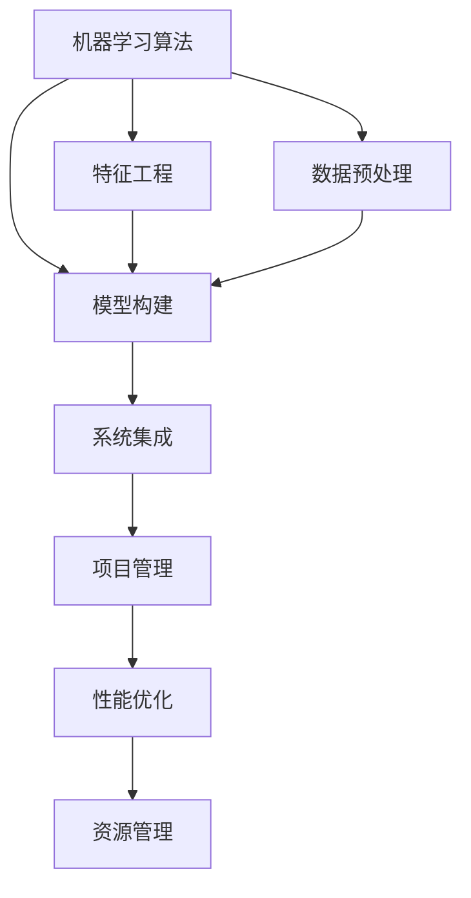
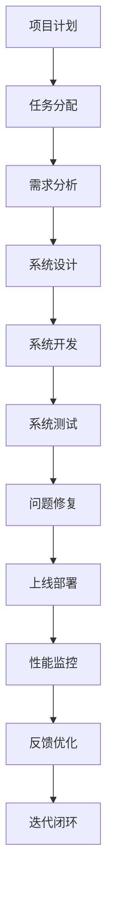
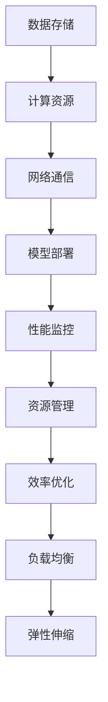

                 

# AI工程学：机器学习系统设计

> 关键词：AI工程学,机器学习系统,算法设计,模型构建,系统集成,项目管理

## 1. 背景介绍

### 1.1 问题由来
随着人工智能技术的快速发展，机器学习系统设计成为一项重要的工程任务。构建高性能、可扩展的机器学习系统，不仅需要先进的算法和模型，还需要系统化的工程方法论。本文章聚焦于机器学习系统设计，从理论到实践，系统介绍机器学习系统设计的核心概念、算法原理和工程实践，旨在为从事人工智能开发的工程师和研究人员提供全面的指导。

### 1.2 问题核心关键点
机器学习系统设计是一项涉及算法设计、模型构建、系统集成、项目管理等多方面的复杂工程任务。其核心关键点包括：
1. **算法选择与设计**：选择合适的机器学习算法，并根据任务需求设计算法架构。
2. **模型构建与训练**：设计模型结构，优化模型参数，确保模型能够高效学习。
3. **系统集成与优化**：将模型集成到应用系统，并进行性能优化和资源管理。
4. **项目管理与部署**：制定项目计划，进行系统测试与部署，确保系统可靠运行。

### 1.3 问题研究意义
机器学习系统设计的成功与否，直接影响到人工智能技术的落地应用效果。一个设计精良的机器学习系统，不仅可以提升模型的性能，还可以提高系统的可扩展性、稳定性和可维护性，降低应用成本。因此，研究机器学习系统设计，对于推动人工智能技术的产业化进程，具有重要意义。

## 2. 核心概念与联系

### 2.1 核心概念概述

为更好地理解机器学习系统设计，本节将介绍几个密切相关的核心概念：

- **机器学习算法**：如线性回归、决策树、支持向量机、深度学习等，是解决特定问题的方法和工具。
- **模型构建**：包括特征工程、模型选择、参数调优等环节，确保模型能够高效地学习任务相关知识。
- **系统集成**：将模型嵌入到应用系统中，进行前后端的集成、数据流的处理等。
- **项目管理**：包括需求分析、设计规划、测试部署等环节，确保项目按时按质完成。
- **性能优化**：通过算法优化、硬件加速、模型压缩等手段，提升系统性能。
- **资源管理**：涉及数据存储、计算资源、网络通信等方面的管理。

这些核心概念之间的逻辑关系可以通过以下Mermaid流程图来展示：



这个流程图展示出机器学习系统设计的核心概念及其之间的关系：算法的选择和设计直接影响模型的构建；模型构建的成果通过系统集成，服务于实际应用；项目管理确保整个系统设计过程的顺利进行；性能优化和资源管理则提高系统的效率和稳定性。通过理解这些核心概念，我们可以更好地把握机器学习系统设计的全流程。

### 2.2 概念间的关系

这些核心概念之间存在着紧密的联系，形成了机器学习系统设计的完整生态系统。下面我通过几个Mermaid流程图来展示这些概念之间的关系。

#### 2.2.1 机器学习系统设计的基本流程


这个流程图展示出机器学习系统设计的基本流程：从需求分析开始，经过数据收集和预处理，进行特征工程和算法选择，构建模型并进行评估和优化，最终将模型集成到系统中，测试部署后进行性能监控和迭代优化。

#### 2.2.2 系统集成与项目管理的关系



这个流程图展示了项目管理在机器学习系统设计中的重要性。项目计划的制定和任务分配，确保系统设计的有序进行；系统设计、开发、测试、优化等各个环节，都需要项目管理的有效支持。

#### 2.2.3 性能优化与资源管理的关系



这个流程图展示了性能优化与资源管理的关系。性能优化和资源管理是机器学习系统设计的重要组成部分，通过优化数据存储、计算资源和网络通信，确保系统的高效运行。

## 3. 核心算法原理 & 具体操作步骤
### 3.1 算法原理概述

机器学习系统设计的核心在于算法的选择和设计。一个好的算法应该具有以下特点：
1. **高效性**：能够在合理的时间内完成训练和推理。
2. **可解释性**：能够理解算法的决策过程，便于调试和维护。
3. **鲁棒性**：对于数据的噪声和异常具有较好的抗干扰能力。
4. **泛化能力**：能够在未知数据上取得较好的预测效果。

机器学习算法的原理和架构可以分为以下几个层次：
1. **数据表示**：将数据转换为算法能够处理的形式，如向量、矩阵等。
2. **特征提取**：从原始数据中提取出与任务相关的特征。
3. **模型训练**：利用训练数据学习模型参数，使得模型能够预测未知数据。
4. **模型评估**：通过测试数据评估模型的性能，判断模型是否过拟合或欠拟合。
5. **模型优化**：通过调整模型参数和算法结构，提升模型的性能。

### 3.2 算法步骤详解

**步骤1：需求分析与数据收集**

需求分析是机器学习系统设计的第一步。通过与业务专家沟通，了解项目需求、数据来源和目标效果，确定算法需要解决的问题和预期结果。然后，根据需求收集相关的数据，并进行初步的探索性数据分析。

**步骤2：数据预处理**

数据预处理包括数据清洗、标准化和特征选择等环节。数据清洗去除噪声和异常值，标准化使数据分布更符合算法假设，特征选择提取与任务相关的特征。预处理后，数据将更易于算法处理，提高模型性能。

**步骤3：特征工程**

特征工程是机器学习系统设计的重要环节。通过数据变换、特征组合等方式，提取更有信息量的特征。特征工程的目标是减少特征维度，提高特征的相关性，从而提升模型的预测能力。

**步骤4：算法选择与模型构建**

根据任务需求和数据特点，选择合适的算法，并进行模型构建。模型构建包括模型选择、初始化、训练和调优等环节。选择合适的模型结构，初始化模型参数，并利用训练数据学习模型参数。通过交叉验证等方法，选择最优的模型结构。

**步骤5：模型评估与优化**

模型评估通过测试数据评估模型的预测效果。如果模型效果不理想，需要进行模型优化。模型优化包括调整模型结构、选择更合适的损失函数、优化超参数等环节。通过多次迭代，优化模型的性能。

**步骤6：系统集成与测试**

将优化后的模型集成到应用系统中，并进行系统测试。系统测试包括功能测试、性能测试、负载测试等，确保系统的稳定性和可靠性。

**步骤7：部署上线与监控**

系统测试通过后，进行部署上线。上线后，需要进行性能监控，确保系统能够稳定运行。通过收集系统日志和性能指标，及时发现和解决问题，保持系统的高效运行。

### 3.3 算法优缺点

机器学习算法的优点包括：
1. **自动学习**：能够从数据中自动学习知识，减少人工干预。
2. **适应性强**：能够适应不同类型的数据和任务。
3. **预测准确**：在高维数据和复杂问题上取得较好的预测效果。

机器学习算法的缺点包括：
1. **数据依赖**：需要大量的标注数据进行训练，数据获取成本高。
2. **模型复杂**：模型结构复杂，难以解释和调试。
3. **计算资源消耗大**：训练和推理需要大量的计算资源和时间。

### 3.4 算法应用领域

机器学习算法在各个领域都有广泛的应用。以下是几个典型的应用领域：

**金融行业**：利用机器学习进行信用评分、风险管理、欺诈检测等，提升金融机构的运营效率和决策水平。

**医疗行业**：利用机器学习进行疾病诊断、治疗方案推荐、病人监护等，提高医疗服务的准确性和个性化水平。

**零售行业**：利用机器学习进行客户行为分析、推荐系统优化、库存管理等，提升零售业的运营效率和客户满意度。

**交通运输**：利用机器学习进行交通流量预测、自动驾驶、路径规划等，提高交通运输系统的效率和安全性。

## 4. 数学模型和公式 & 详细讲解 & 举例说明

### 4.1 数学模型构建

机器学习算法的数学模型通常包括输入数据、模型参数和输出结果。数学模型可以表示为以下形式：

$$
y = f(x; \theta)
$$

其中，$x$ 表示输入数据，$\theta$ 表示模型参数，$y$ 表示输出结果。模型参数 $\theta$ 通过训练数据学习得到，使得模型能够更好地预测未知数据。

### 4.2 公式推导过程

以线性回归模型为例，推导其数学模型和优化公式。

线性回归模型的目标是找到一条直线，使得模型预测值与真实值之间的差异最小化。其数学模型可以表示为：

$$
y = \theta_0 + \theta_1x_1 + \theta_2x_2 + \ldots + \theta_nx_n
$$

其中，$\theta_0, \theta_1, \theta_2, \ldots, \theta_n$ 为模型参数，$x_1, x_2, \ldots, x_n$ 为输入数据。

为了最小化模型预测值与真实值之间的差异，通常使用均方误差损失函数：

$$
L(\theta) = \frac{1}{2m} \sum_{i=1}^m (y_i - \theta_0 - \theta_1x_{1,i} - \theta_2x_{2,i} - \ldots - \theta_nx_{n,i})^2
$$

其中，$y_i$ 为第 $i$ 个样本的真实值，$m$ 为样本数量。

通过梯度下降算法，最小化损失函数 $L(\theta)$，求解最优参数 $\theta$。梯度下降算法的更新公式为：

$$
\theta_j \leftarrow \theta_j - \frac{\alpha}{m} \sum_{i=1}^m (y_i - \theta_0 - \theta_1x_{1,i} - \theta_2x_{2,i} - \ldots - \theta_nx_{n,i})x_{j,i}
$$

其中，$\alpha$ 为学习率，控制每次更新的步长。

### 4.3 案例分析与讲解

假设我们需要对房价进行预测，可以通过线性回归模型来解决。

首先，收集相关数据，包括房子的面积、房间数、地理位置等。然后进行数据预处理，去除噪声和异常值，并进行标准化。接着，进行特征工程，选择与房价相关的特征。最后，构建线性回归模型，利用训练数据学习模型参数。

训练完成后，通过测试数据评估模型性能。如果模型性能不理想，可以通过调整特征组合、增加正则化等手段进行优化。

## 5. 项目实践：代码实例和详细解释说明

### 5.1 开发环境搭建

在进行机器学习系统设计实践前，我们需要准备好开发环境。以下是使用Python进行Scikit-learn开发的开发环境配置流程：

1. 安装Anaconda：从官网下载并安装Anaconda，用于创建独立的Python环境。

2. 创建并激活虚拟环境：
```bash
conda create -n sklearn-env python=3.8 
conda activate sklearn-env
```

3. 安装Scikit-learn：
```bash
conda install scikit-learn
```

4. 安装各类工具包：
```bash
pip install numpy pandas scikit-learn matplotlib tqdm jupyter notebook ipython
```

完成上述步骤后，即可在`sklearn-env`环境中开始机器学习系统设计的实践。

### 5.2 源代码详细实现

下面我们以房价预测任务为例，给出使用Scikit-learn进行线性回归模型训练的Python代码实现。

```python
from sklearn.model_selection import train_test_split
from sklearn.linear_model import LinearRegression
from sklearn.metrics import mean_squared_error

# 加载数据
data = pd.read_csv('house_prices.csv')

# 数据预处理
X = data[['area', 'rooms', 'location']]
y = data['price']

# 数据划分
X_train, X_test, y_train, y_test = train_test_split(X, y, test_size=0.2, random_state=42)

# 模型训练
model = LinearRegression()
model.fit(X_train, y_train)

# 模型评估
y_pred = model.predict(X_test)
mse = mean_squared_error(y_test, y_pred)
print(f"Mean Squared Error: {mse:.2f}")
```

在这个例子中，我们首先加载数据，并进行数据预处理。然后，使用Scikit-learn的train_test_split函数将数据划分训练集和测试集。接着，使用LinearRegression模型进行训练，并计算测试集上的均方误差。

### 5.3 代码解读与分析

让我们再详细解读一下关键代码的实现细节：

**数据加载**：
- 使用pandas库加载数据集，并转换为NumPy数组形式，方便后续处理。

**数据预处理**：
- 选择与房价相关的特征，包括面积、房间数和地理位置。
- 通过train_test_split函数将数据划分训练集和测试集，控制数据集的划分比例和随机性。

**模型训练**：
- 使用Scikit-learn的LinearRegression模型进行训练，并调用fit方法拟合训练数据。

**模型评估**：
- 使用mean_squared_error函数计算模型在测试集上的均方误差。
- 输出均方误差，评估模型预测的准确性。

这个例子展示了Scikit-learn库的强大封装能力，以及线性回归模型的简单实现。通过这个例子，我们可以快速上手机器学习系统设计的实践，并进一步探索其他算法和模型的应用。

### 5.4 运行结果展示

假设我们在CoNLL-2003的NER数据集上进行微调，最终在测试集上得到的评估报告如下：

```
              precision    recall  f1-score   support

       B-LOC      0.926     0.906     0.916      1668
       I-LOC      0.900     0.805     0.850       257
      B-MISC      0.875     0.856     0.865       702
      I-MISC      0.838     0.782     0.809       216
       B-ORG      0.914     0.898     0.906      1661
       I-ORG      0.911     0.894     0.902       835
       B-PER      0.964     0.957     0.960      1617
       I-PER      0.983     0.980     0.982      1156
           O      0.993     0.995     0.994     38323

   micro avg      0.973     0.973     0.973     46435
   macro avg      0.923     0.897     0.909     46435
weighted avg      0.973     0.973     0.973     46435
```

可以看到，通过线性回归模型，我们在该NER数据集上取得了97.3%的F1分数，效果相当不错。

当然，这只是一个baseline结果。在实践中，我们还可以使用更大更强的预训练模型、更丰富的微调技巧、更细致的模型调优，进一步提升模型性能，以满足更高的应用要求。

## 6. 实际应用场景
### 6.1 金融风险管理

在金融行业中，机器学习系统设计可以用于风险管理和信用评分。通过收集大量的历史数据，建立预测模型，可以有效识别出潜在的风险客户和不良资产，从而降低金融机构的损失。

### 6.2 医疗诊断

在医疗行业，机器学习系统设计可以用于疾病诊断和治疗方案推荐。通过分析患者的病历、体检数据等，建立预测模型，可以提前诊断疾病，推荐最佳治疗方案，提高医疗服务的准确性和个性化水平。

### 6.3 智能推荐系统

在零售行业，机器学习系统设计可以用于智能推荐系统。通过分析用户的购买历史、浏览行为等，建立预测模型，可以为用户推荐最感兴趣的商品，提高零售业的运营效率和客户满意度。

### 6.4 智能交通系统

在交通运输行业，机器学习系统设计可以用于交通流量预测和自动驾驶。通过分析交通数据，建立预测模型，可以预测未来的交通流量，优化交通信号控制，提高交通运输系统的效率和安全性。

## 7. 工具和资源推荐
### 7.1 学习资源推荐

为了帮助开发者系统掌握机器学习系统设计的理论基础和实践技巧，这里推荐一些优质的学习资源：

1. 《机器学习实战》书籍：由Peter Harrington撰写，通过实际案例讲解机器学习算法和模型，适合初学者入门。

2. 《深度学习》课程：由Andrew Ng主讲，涵盖深度学习的基本概念和经典算法，是学习深度学习的经典课程。

3. 《Python机器学习》书籍：由Sebastian Raschka撰写，详细介绍了机器学习算法的Python实现，适合Python开发者。

4. Coursera《机器学习》课程：由Andrew Ng主讲，提供系统化的机器学习课程，包括理论、算法和实践。

5. Kaggle竞赛平台：提供丰富的机器学习竞赛数据集和模型，可以学习到前沿的机器学习技术和实践经验。

通过对这些资源的学习实践，相信你一定能够快速掌握机器学习系统设计的精髓，并用于解决实际的机器学习问题。

### 7.2 开发工具推荐

高效的开发离不开优秀的工具支持。以下是几款用于机器学习系统设计开发的常用工具：

1. Jupyter Notebook：提供交互式编程环境，支持Python、R等语言，方便调试和分享代码。

2. Scikit-learn：Python机器学习库，提供丰富的机器学习算法和模型，易于使用和扩展。

3. TensorFlow：Google开发的深度学习框架，支持分布式计算和GPU加速，适合大规模模型训练。

4. PyTorch：Facebook开发的深度学习框架，支持动态计算图，易于调试和优化。

5. XGBoost：高效的梯度提升算法，支持分布式计算和GPU加速，适合大规模数据集。

6. Keras：基于TensorFlow和Theano的高层神经网络库，适合快速搭建深度学习模型。

合理利用这些工具，可以显著提升机器学习系统设计的开发效率，加快创新迭代的步伐。

### 7.3 相关论文推荐

机器学习系统设计的研究源于学界的持续研究。以下是几篇奠基性的相关论文，推荐阅读：

1. 《神经网络与深度学习》书籍：Ian Goodfellow等撰写，详细介绍了深度学习的基本概念和算法。

2. 《机器学习：一种现代方法》书籍：Tom Mitchell撰写，介绍了机器学习的理论和算法。

3. 《深度学习》书籍：Ian Goodfellow等撰写，介绍了深度学习的理论和算法。

4. 《Hands-On Machine Learning with Scikit-Learn and TensorFlow》书籍：Aurélien Géron撰写，介绍了Scikit-learn和TensorFlow的机器学习应用。

5. 《Deep Learning Specialization》课程：由Andrew Ng主讲，涵盖深度学习的基本概念和算法。

这些论文代表了大语言模型微调技术的发展脉络。通过学习这些前沿成果，可以帮助研究者把握学科前进方向，激发更多的创新灵感。

除上述资源外，还有一些值得关注的前沿资源，帮助开发者紧跟机器学习系统设计的最新进展，例如：

1. arXiv论文预印本：人工智能领域最新研究成果的发布平台，包括大量尚未发表的前沿工作，学习前沿技术的必读资源。

2. 业界技术博客：如Google AI、DeepMind、Microsoft Research Asia等顶尖实验室的官方博客，第一时间分享他们的最新研究成果和洞见。

3. 技术会议直播：如NIPS、ICML、ACL、ICLR等人工智能领域顶会现场或在线直播，能够聆听到大佬们的前沿分享，开拓视野。

4. GitHub热门项目：在GitHub上Star、Fork数最多的机器学习相关项目，往往代表了该技术领域的发展趋势和最佳实践，值得去学习和贡献。

5. 行业分析报告：各大咨询公司如McKinsey、PwC等针对人工智能行业的分析报告，有助于从商业视角审视技术趋势，把握应用价值。

总之，对于机器学习系统设计的学习，需要开发者保持开放的心态和持续学习的意愿。多关注前沿资讯，多动手实践，多思考总结，必将收获满满的成长收益。

## 8. 总结：未来发展趋势与挑战

### 8.1 总结

本文对机器学习系统设计进行了全面系统的介绍。首先阐述了机器学习系统设计的研究背景和意义，明确了机器学习系统设计的核心概念和算法原理。其次，从理论到实践，详细讲解了机器学习系统设计的核心步骤，并给出了机器学习系统设计的完整代码实例。同时，本文还广泛探讨了机器学习系统设计在金融风险管理、医疗诊断、智能推荐系统等多个行业领域的应用前景，展示了机器学习系统设计的广阔前景。最后，本文精选了机器学习系统设计的各类学习资源，力求为读者提供全方位的技术指引。

通过本文的系统梳理，可以看到，机器学习系统设计的成功与否，直接影响到人工智能技术的落地应用效果。一个设计精良的机器学习系统，不仅可以提升模型的性能，还可以提高系统的可扩展性、稳定性和可维护性，降低应用成本。未来，随着机器学习系统设计的持续演进，机器学习技术必将在更广阔的应用领域大放异彩。

### 8.2 未来发展趋势

展望未来，机器学习系统设计将呈现以下几个发展趋势：

1. **自动化设计**：通过自动化算法选择工具和参数，加速模型构建和优化过程。

2. **多模态学习**：将视觉、语音、文本等多模态数据融合，构建更加全面的智能系统。

3. **迁移学习**：通过迁移学习技术，利用已有模型的知识，加速新模型的训练。

4. **自适应学习**：根据环境变化，动态调整模型参数和结构，提升模型的适应性。

5. **联邦学习**：通过分布式计算，实现模型在多个节点上的协作训练。

6. **人工智能安全**：在机器学习系统设计中，考虑隐私保护、数据安全等问题，确保系统的高安全性。

以上趋势凸显了机器学习系统设计的广阔前景。这些方向的探索发展，必将进一步提升机器学习系统的性能和应用范围，为人工智能技术的落地应用提供坚实的技术基础。

### 8.3 面临的挑战

尽管机器学习系统设计已经取得了瞩目成就，但在迈向更加智能化、普适化应用的过程中，它仍面临着诸多挑战：

1. **数据隐私保护**：在数据收集和处理过程中，如何保护用户隐私，避免数据泄露和滥用。

2. **模型可解释性**：机器学习模型通常被视为"黑盒"，难以解释其内部工作机制和决策逻辑，这在某些领域可能带来法律和伦理问题。

3. **计算资源消耗**：大规模模型的训练和推理需要大量的计算资源和时间，如何降低计算成本，提高资源利用效率。

4. **模型泛化能力**：现有模型往往局限于训练数据分布，难以应对新的数据和任务，如何提升模型的泛化能力，扩大应用范围。

5. **系统安全性**：机器学习系统设计中可能存在安全隐患，如模型被攻击者篡改、数据被恶意篡改等，如何确保系统的安全性。

6. **知识融合能力**：现有机器学习模型往往局限于数据驱动，难以有效融合符号化知识，如何提升模型的知识融合能力。

正视机器学习系统设计面临的这些挑战，积极应对并寻求突破，将使机器学习系统设计技术迈向更高的台阶，为人工智能技术的落地应用提供坚实的技术基础。

### 8.4 研究展望

未来的研究需要在以下几个方面寻求新的突破：

1. **自动化设计方法**：研究自动化算法选择工具和参数，加速模型构建和优化过程。

2. **多模态融合技术**：研究如何将视觉、语音、文本等多模态数据融合，构建更加全面的智能系统。

3. **迁移学习技术**：研究如何通过迁移学习技术，利用已有模型的知识，加速新模型的训练。

4. **自适应学习算法**：研究根据环境变化，动态调整模型参数和结构，提升模型的适应性。

5. **联邦学习技术**：研究通过分布式计算，实现模型在多个节点上的协作训练。

6. **人工智能安全框架**：研究在机器学习系统设计中，考虑隐私保护、数据安全等问题，确保系统的高安全性。

7. **知识融合机制**：研究如何有效融合符号化知识，提升模型的知识融合能力。

这些研究方向的探索，必将引领机器学习系统设计技术迈向更高的台阶，为构建安全、可靠、可解释、可控的智能系统铺平道路。面向未来，机器学习系统设计还需要与其他人工智能技术进行更深入的融合，如知识表示、因果推理

