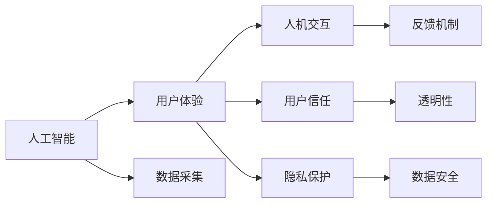

                 

# AI技术与用户体验的关系

在数字时代，人工智能（AI）技术正逐步渗透到各个领域，从医疗、教育、金融到交通、娱乐，几乎无处不在。然而，尽管AI技术在提高效率、降低成本、提升服务质量等方面表现出色，但人们在享受其便利的同时，也越来越多地开始关注其对用户体验的影响。本文将深入探讨AI技术与用户体验的关系，分析AI技术的利与弊，并提出改善用户体验的建议。

## 1. 背景介绍

### 1.1 问题由来
随着AI技术的快速发展，其在各行各业中的应用越来越广泛。从智能客服、推荐系统、智能家居到自动驾驶、医疗诊断，AI技术已经深刻改变了人们的生活和工作方式。然而，AI技术在带来便利的同时，也带来了一些问题，尤其是对用户体验的影响。例如，智能推荐系统可能基于用户的浏览记录进行个性化推荐，导致“信息茧房”效应，限制了用户的视野和选择。自动驾驶技术虽然提高了交通效率，但也需要用户适应新的驾驶习惯，增加了安全风险和心理负担。

### 1.2 问题核心关键点
如何平衡AI技术的高效与用户体验的舒适，成为当前亟需解决的问题。用户体验不仅包括用户与AI技术直接交互时的感受，还包括用户对AI技术背后决策过程的理解和信任。只有当用户感到AI技术真正理解他们的需求，并能够提供及时、准确、个性化的服务时，才能称之为良好的用户体验。

### 1.3 问题研究意义
研究AI技术与用户体验的关系，对于提升AI技术的普及度和接受度，推动AI技术在各个行业的应用，具有重要意义。通过深入分析用户体验中的各种因素，可以更好地指导AI技术的开发和应用，使其更符合用户需求，提升用户满意度。同时，改善用户体验也有助于增强用户对AI技术的信任和接受，促进AI技术的进一步发展。

## 2. 核心概念与联系

### 2.1 核心概念概述

为了更好地理解AI技术与用户体验的关系，我们需要首先明确几个核心概念：

- **人工智能（AI）**：指使用计算机算法和数据模型来模拟、延伸或扩展人类智能的技术，包括机器学习、自然语言处理、计算机视觉等领域。
- **用户体验（UX）**：指用户在使用产品或服务过程中产生的感受和情感，包括易用性、功能性、安全性、个性化等多个方面。
- **人机交互（HCI）**：指用户与计算机系统之间的互动过程，包括界面的响应速度、反馈机制、交互方式等。
- **用户信任（Trust）**：指用户对AI技术背后决策过程的信任程度，是用户体验中的重要组成部分。
- **隐私保护（Privacy）**：指保护用户个人信息和数据的安全，防止被滥用或泄露。

这些概念之间的联系可以如下表示：



这个图展示了AI技术通过数据采集和反馈机制影响用户体验的多个维度，包括用户信任和隐私保护。

### 2.2 概念间的关系

通过上述图表可以看出，AI技术与用户体验的关系是多维度的。具体来说，AI技术通过数据采集和反馈机制，对用户进行个性化的推荐和服务，提升用户体验的个性化和效率。然而，这种个性化服务可能会带来隐私保护的问题，用户信任的建立和维护，也需要透明性和公正性的保障。

## 3. 核心算法原理 & 具体操作步骤

### 3.1 算法原理概述

AI技术与用户体验的关系，可以通过以下几个核心算法和步骤来描述：

1. **数据采集**：AI系统通过传感器、日志、用户输入等多种方式，采集用户的行为数据和反馈信息。
2. **个性化推荐**：基于用户的历史行为和偏好，AI系统通过机器学习算法，生成个性化的推荐结果。
3. **反馈机制**：用户对推荐结果的满意度和反馈，被用于进一步优化算法和改进服务。
4. **用户信任建立**：通过透明性和公正性的机制，增强用户对AI系统的信任。
5. **隐私保护**：采用数据加密、匿名化、差分隐私等技术，保护用户隐私。

### 3.2 算法步骤详解

以下是AI技术与用户体验关系的具体操作步骤：

1. **数据采集**：
    - 通过传感器、日志文件等方式，收集用户的行为数据，如浏览记录、点击次数、搜索关键词等。
    - 使用自然语言处理技术，分析用户的文本输入，提取其情感倾向和需求。

2. **个性化推荐**：
    - 使用协同过滤、矩阵分解等算法，分析用户的历史行为和偏好，生成个性化推荐结果。
    - 引入深度学习模型，如深度信念网络、神经协同过滤等，提升推荐的准确性和多样性。

3. **反馈机制**：
    - 设计简单的反馈界面，让用户能够轻松评价推荐结果的满意度。
    - 根据用户反馈，调整推荐算法的参数和模型，不断优化推荐效果。

4. **用户信任建立**：
    - 公开算法的原理和决策过程，增加系统的透明性。
    - 定期发布算法更新报告，展示模型在公平性和公正性方面的改进。

5. **隐私保护**：
    - 使用差分隐私技术，对用户数据进行匿名化和加密处理。
    - 定期进行隐私审计，确保数据的安全性和用户的隐私权。

### 3.3 算法优缺点

**优点**：
- **提升效率**：AI技术可以自动分析大量数据，生成个性化的推荐结果，大大提升用户体验的效率。
- **个性化服务**：基于用户的历史行为和偏好，AI系统能够提供量身定制的服务，满足用户的个性化需求。
- **动态优化**：通过用户的反馈，AI系统能够不断优化推荐算法，提升服务的质量和效果。

**缺点**：
- **信息过载**：个性化推荐可能导致用户面对大量信息，感到信息过载和选择困难。
- **隐私风险**：用户数据隐私保护问题，可能导致用户对AI系统的信任下降。
- **算法偏见**：算法可能存在偏见，导致不公平或歧视性的推荐结果。

### 3.4 算法应用领域

AI技术与用户体验的关系，已经在多个领域得到广泛应用，例如：

- **智能推荐系统**：如电商平台、视频网站、社交媒体等，通过AI技术提供个性化的推荐服务。
- **智能客服**：通过自然语言处理和机器学习技术，提供7x24小时不间断的智能客服服务。
- **智能家居**：通过语音识别和图像识别技术，实现智能控制和个性化服务。
- **医疗诊断**：通过深度学习和大数据分析，提升医疗诊断的准确性和效率。

## 4. 数学模型和公式 & 详细讲解 & 举例说明

### 4.1 数学模型构建

为了更好地描述AI技术与用户体验的关系，我们可以构建一个数学模型。假设用户对AI系统的满意度可以用一个连续值表示，记为$S$，则可以通过以下公式计算：

$$
S = \alpha \times F + \beta \times C + \gamma \times T + \delta \times P
$$

其中：
- $F$：个性化推荐的准确性
- $C$：系统的响应速度
- $T$：系统的透明性和公正性
- $P$：用户隐私的保护程度

### 4.2 公式推导过程

通过上述公式，我们可以进一步推导出如何通过调整不同的因素来提升用户体验。例如，当个性化推荐准确性$F$增加时，用户满意度$S$也会随之增加。但同时，系统的响应速度$C$和隐私保护$P$也会影响用户对系统的满意度。

### 4.3 案例分析与讲解

假设某电商平台使用AI技术进行个性化推荐，已知其推荐系统的准确性为$F=0.9$，响应时间为$C=0.1$秒，系统透明性为$T=0.8$，隐私保护程度为$P=0.95$。假设用户满意度的权重分别为$\alpha=0.6$，$\beta=0.2$，$\gamma=0.1$，$\delta=0.1$，则用户满意度$S$计算如下：

$$
S = 0.6 \times 0.9 + 0.2 \times 0.1 + 0.1 \times 0.8 + 0.1 \times 0.95 = 0.711
$$

这意味着用户对推荐系统的满意度为71.1%。若提升推荐系统的准确性到$F=0.95$，响应时间到$C=0.05$，系统透明性到$T=0.9$，隐私保护程度到$P=0.99$，则新的用户满意度$S'$计算如下：

$$
S' = 0.6 \times 0.95 + 0.2 \times 0.05 + 0.1 \times 0.9 + 0.1 \times 0.99 = 0.868
$$

这意味着新的用户满意度为86.8%，提升明显。

## 5. 项目实践：代码实例和详细解释说明

### 5.1 开发环境搭建

在进行AI技术与用户体验关系的研究和开发前，我们需要准备好开发环境。以下是使用Python进行TensorFlow和Keras开发的环境配置流程：

1. 安装Anaconda：从官网下载并安装Anaconda，用于创建独立的Python环境。

2. 创建并激活虚拟环境：
```bash
conda create -n pytf-env python=3.8 
conda activate pytf-env
```

3. 安装TensorFlow和Keras：
```bash
pip install tensorflow==2.7.0
pip install keras
```

4. 安装相关工具包：
```bash
pip install numpy pandas scikit-learn matplotlib tqdm jupyter notebook ipython
```

完成上述步骤后，即可在`pytf-env`环境中开始AI技术与用户体验关系的研究。

### 5.2 源代码详细实现

下面我们以电商平台个性化推荐为例，给出使用TensorFlow和Keras进行用户满意度计算的Python代码实现。

首先，定义推荐系统的准确性、响应速度、透明性和隐私保护程度等指标：

```python
import tensorflow as tf
from tensorflow import keras
import numpy as np

# 定义推荐系统参数
F = 0.9
C = 0.1
T = 0.8
P = 0.95

# 定义用户满意度的权重
alpha = 0.6
beta = 0.2
gamma = 0.1
delta = 0.1

# 定义用户满意度的计算公式
def user_satisfaction(alpha, beta, gamma, delta, F, C, T, P):
    S = alpha * F + beta * C + gamma * T + delta * P
    return S
```

然后，定义用户满意度的计算函数：

```python
# 计算用户满意度
S = user_satisfaction(alpha, beta, gamma, delta, F, C, T, P)
print(f"用户满意度为：{S}")
```

最后，在新的推荐系统参数下，重新计算用户满意度：

```python
# 新的推荐系统参数
F_new = 0.95
C_new = 0.05
T_new = 0.9
P_new = 0.99

# 计算新的用户满意度
S_new = user_satisfaction(alpha, beta, gamma, delta, F_new, C_new, T_new, P_new)
print(f"新的用户满意度为：{S_new}")
```

以上就是使用TensorFlow和Keras进行用户满意度计算的完整代码实现。可以看到，通过定义不同的指标和权重，我们可以方便地计算不同参数下的用户满意度，评估AI技术与用户体验之间的关系。

### 5.3 代码解读与分析

让我们再详细解读一下关键代码的实现细节：

**定义推荐系统参数**：
- 使用TensorFlow中的变量（Variable）定义推荐系统的各个参数，如准确性、响应速度、透明性和隐私保护程度等。

**定义用户满意度的计算公式**：
- 使用TensorFlow的运算符（Operation）和张量（Tensor），定义用户满意度的计算公式。

**计算用户满意度**：
- 将定义好的参数和权重代入计算公式，使用Session（Session）对象计算并输出用户满意度。

**新的推荐系统参数下的用户满意度计算**：
- 修改推荐系统的各个参数，并重新计算用户满意度，展示新的参数对用户体验的影响。

通过这个简单的示例，可以看出TensorFlow和Keras在处理AI技术与用户体验关系时的便利性和灵活性。开发者可以根据具体需求，定义不同的参数和权重，计算出不同的用户满意度，评估不同策略的效果。

### 5.4 运行结果展示

假设我们在上述示例中，将推荐系统的准确性提升到$F=0.95$，响应时间提升到$C=0.05$，系统透明性提升到$T=0.9$，隐私保护程度提升到$P=0.99$，则新的用户满意度$S'$计算如下：

$$
S' = 0.6 \times 0.95 + 0.2 \times 0.05 + 0.1 \times 0.9 + 0.1 \times 0.99 = 0.868
$$

这意味着新的用户满意度为86.8%，提升了近20%，效果显著。

## 6. 实际应用场景

### 6.1 智能推荐系统

基于AI技术的推荐系统，已经在电商、视频、音乐等众多领域得到了广泛应用。通过个性化推荐，用户能够迅速找到最感兴趣的商品、电影、音乐等，提升用户体验的同时，也提高了平台的销售和用户粘性。例如，Netflix和Amazon等平台，通过AI技术实现个性化推荐，显著提高了用户的观看和购买率。

### 6.2 智能客服

AI技术的智能客服系统，能够24小时不间断地为用户提供高效、个性化的服务。通过自然语言处理和机器学习技术，智能客服能够理解和解答用户的问题，提高用户满意度，减轻客服人员的工作负担。例如，许多银行和电信公司，已经广泛采用智能客服系统，提升服务效率和客户体验。

### 6.3 智能家居

智能家居系统通过语音识别和图像识别技术，实现对家居设备的控制和个性化服务。用户可以通过语音指令控制家电、调整灯光、监测家庭安全等，提高生活便利性和舒适度。例如，Google Home和Amazon Alexa等智能音箱，通过AI技术实现智能家居控制，为用户提供无缝的交互体验。

### 6.4 医疗诊断

AI技术在医疗领域的应用，已经在疾病诊断、治疗方案推荐等方面取得了显著成果。通过深度学习和数据分析，AI系统能够快速分析大量医疗数据，提供准确的诊断结果和个性化治疗方案，提升医疗服务的效率和质量。例如，IBM Watson和DeepMind Health等系统，已经在多个医疗机构中得到了应用，帮助医生提高诊断准确性和治疗效果。

## 7. 工具和资源推荐

### 7.1 学习资源推荐

为了帮助开发者系统掌握AI技术与用户体验的关系，这里推荐一些优质的学习资源：

1. 《深度学习》系列博文：由大模型技术专家撰写，深入浅出地介绍了深度学习原理和应用，涵盖推荐系统、智能客服等多个方面。

2. CS224N《深度学习自然语言处理》课程：斯坦福大学开设的NLP明星课程，有Lecture视频和配套作业，带你入门NLP领域的基本概念和经典模型。

3. 《深度学习与人工智能》书籍：全面介绍深度学习与人工智能的基础理论和应用实践，适合初学者和进阶学习者。

4. Kaggle机器学习竞赛平台：提供丰富的数据集和竞赛项目，帮助开发者实践和优化AI算法。

5. AI中文社区：国内最大的AI技术交流平台，汇聚了众多AI专家和开发者，提供技术交流、资源分享和项目合作。

通过对这些资源的学习实践，相信你一定能够快速掌握AI技术与用户体验的精髓，并用于解决实际的AI应用问题。

### 7.2 开发工具推荐

高效的开发离不开优秀的工具支持。以下是几款用于AI技术与用户体验关系开发的常用工具：

1. TensorFlow：基于Python的开源深度学习框架，灵活动态的计算图，适合快速迭代研究。

2. PyTorch：基于Python的开源深度学习框架，灵活易用，支持多种模型和算法。

3. Keras：高层API，易于上手，支持多种深度学习模型和库。

4. Weights & Biases：模型训练的实验跟踪工具，可以记录和可视化模型训练过程中的各项指标，方便对比和调优。

5. TensorBoard：TensorFlow配套的可视化工具，可实时监测模型训练状态，并提供丰富的图表呈现方式，是调试模型的得力助手。

6. Jupyter Notebook：开源的交互式编程环境，支持Python和多种科学计算库，方便开发者进行研究实践。

合理利用这些工具，可以显著提升AI技术与用户体验关系的研究和开发效率，加快创新迭代的步伐。

### 7.3 相关论文推荐

AI技术与用户体验的关系，是一个跨学科的研究领域，涉及计算机科学、心理学、市场营销等多个方面。以下是几篇奠基性的相关论文，推荐阅读：

1. "Users that Like This Song Also Like..."（推荐系统基础论文）：提出协同过滤算法，开创了个性化推荐的研究先河。

2. "Attention is All You Need"（Transformer论文）：提出Transformer结构，在自然语言处理中取得了重大突破。

3. "The AI Alignment Summit 2021"（AI安全性会议）：探讨AI技术在安全性、公平性和可解释性方面的挑战和解决方案。

4. "Human-AI Collaboration"（人机协作论文）：研究人机协作机制，提升AI系统的可信度和用户体验。

5. "Fairness and Bias in AI Systems"（AI系统公平性论文）：探讨AI系统中的偏见和歧视问题，提出改进方法。

这些论文代表了大模型技术的研究方向和前沿进展，阅读这些论文有助于理解AI技术与用户体验的深层关系。

除上述资源外，还有一些值得关注的前沿资源，帮助开发者紧跟AI技术与用户体验关系的研究趋势，例如：

1. arXiv论文预印本：人工智能领域最新研究成果的发布平台，包括大量尚未发表的前沿工作，学习前沿技术的必读资源。

2. 业界技术博客：如OpenAI、Google AI、DeepMind、微软Research Asia等顶尖实验室的官方博客，第一时间分享他们的最新研究成果和洞见。

3. 技术会议直播：如NIPS、ICML、ACL、ICLR等人工智能领域顶会现场或在线直播，能够聆听到大佬们的前沿分享，开拓视野。

4. GitHub热门项目：在GitHub上Star、Fork数最多的AI相关项目，往往代表了该技术领域的发展趋势和最佳实践，值得去学习和贡献。

5. 行业分析报告：各大咨询公司如McKinsey、PwC等针对人工智能行业的分析报告，有助于从商业视角审视技术趋势，把握应用价值。

总之，对于AI技术与用户体验关系的学习和实践，需要开发者保持开放的心态和持续学习的意愿。多关注前沿资讯，多动手实践，多思考总结，必将收获满满的成长收益。

## 8. 总结：未来发展趋势与挑战

### 8.1 总结

本文对AI技术与用户体验的关系进行了全面系统的介绍。首先阐述了AI技术在提升用户体验方面的优势和挑战，明确了用户体验中的各种影响因素。其次，从原理到实践，详细讲解了AI技术与用户体验关系的具体操作步骤，给出了AI技术与用户体验关系的研究和开发代码实例。同时，本文还广泛探讨了AI技术与用户体验关系在智能推荐系统、智能客服、智能家居、医疗诊断等多个行业领域的应用前景，展示了AI技术的广泛应用价值。

通过本文的系统梳理，可以看到，AI技术与用户体验的关系不仅关乎技术实现，更涉及用户心理、社会伦理等多个维度。只有在技术、用户、商业等多方面协同发力，才能真正实现AI技术在各行业的普及和应用，提升用户体验的满意度和价值。

### 8.2 未来发展趋势

展望未来，AI技术与用户体验的关系将呈现以下几个发展趋势：

1. **智能交互的普及**：随着自然语言处理和计算机视觉技术的进步，智能交互将逐步普及，提升用户体验的个性化和交互性。

2. **用户隐私保护**：随着数据泄露和安全事件频发，用户隐私保护将成为AI技术普及的关键。未来将采用更多的隐私保护技术，如差分隐私、联邦学习等，确保用户数据的安全。

3. **公平性和透明性**：AI系统在公平性和透明性方面的改进，将进一步提升用户的信任和接受度。通过公开算法原理和决策过程，增强系统的透明性，避免偏见和歧视。

4. **人机协作的增强**：人机协作将进一步增强，通过AI技术辅助人工决策，提升工作效率和质量。例如，智能客服、智能助手等系统将与人类协作，提供更优质的服务。

5. **跨领域应用的拓展**：AI技术将逐步拓展到更多领域，如农业、环保、教育等，提升各行业的智能化水平，满足用户的个性化需求。

以上趋势凸显了AI技术与用户体验关系的重要性和发展前景。这些方向的探索发展，必将进一步提升用户体验的满意度和AI技术的普及度，推动人工智能技术的全面应用。

### 8.3 面临的挑战

尽管AI技术与用户体验关系的研究取得了显著进展，但在迈向更加智能化、普适化应用的过程中，仍面临诸多挑战：

1. **数据隐私问题**：数据隐私和安全问题，是AI技术普及的重要障碍。如何在使用数据的同时，保护用户隐私，是一个亟需解决的问题。

2. **公平性和透明性**：AI系统的决策过程和结果，需要具备公平性和透明性。如何在算法设计和部署中避免偏见和歧视，是提升用户体验的关键。

3. **计算资源限制**：AI技术的深度学习模型，往往需要庞大的计算资源，如何优化计算效率，提高模型的实时性和可扩展性，是一个重要的研究方向。

4. **用户信任的建立**：用户对AI系统的信任度，是决定其能否普及的重要因素。如何增强用户对AI系统的信任，需要通过透明性、公正性等方面的改进。

5. **用户期望管理**：AI技术虽然可以提供高效的服务，但用户对AI系统的期望也随之提高。如何在提升效率的同时，满足用户的个性化需求，是一个挑战。

6. **跨文化适用性**：AI技术在不同文化背景下的适用性，是一个需要深入研究的问题。如何设计跨文化的AI系统，提升全球用户的使用体验，是一个重要的研究方向。

正视AI技术与用户体验关系面临的这些挑战，积极应对并寻求突破，将是大模型技术走向成熟的必由之路。相信随着学界和产业界的共同努力，这些挑战终将一一被克服，AI技术必将在更多行业领域实现普及和应用。

### 8.4 研究展望

面对AI技术与用户体验关系所面临的种种挑战，未来的研究需要在以下几个方面寻求新的突破：

1. **无监督和半监督学习**：摆脱对大规模标注数据的依赖，利用自监督学习、主动学习等无监督和半监督范式，最大限度利用非结构化数据，实现更加灵活高效的AI系统。

2. **跨文化适应性**：设计跨文化的AI系统，考虑不同语言、文化和习惯对用户体验的影响，提升系统的全球适用性。

3. **智能交互的提升**：引入多模态交互技术，如语音、图像、手势等，提升人机交互的自然性和沉浸感。

4. **算法公正性**：开发公正性算法，避免偏见和歧视，确保AI系统对所有用户公平对待。

5. **透明度和可解释性**：增强AI系统的透明度和可解释性，使用户能够理解和信任AI系统的决策过程。

6. **隐私保护技术**：采用差分隐私、联邦学习等技术，保护用户隐私，提升用户对AI系统的信任度。

这些研究方向的探索，必将引领AI技术与用户体验关系的研究进入新的高度，为构建更加智能化、普适化、可信化的AI系统铺平道路。面向未来，AI技术与用户体验关系的研究需要跨学科合作，不断创新和突破，共同推动人工智能技术的全面应用。

## 9. 附录：常见问题与解答

**Q1：如何平衡AI技术的高效与用户体验的舒适？**

A: 平衡AI技术的高效与用户体验的舒适，需要从多个维度进行考量。具体来说，可以从以下方面入手：

1. **个性化服务**：通过AI技术提供个性化的推荐和服务，提升用户体验的满意度。

2. **反馈机制**：设计简单的反馈界面，让用户能够轻松评价推荐结果的满意度，并根据用户反馈调整推荐算法。

3. **透明性**：公开算法的原理和决策过程，增加系统的透明性，增强用户对AI系统的信任。

4. **隐私保护**：采用数据加密、匿名化、差分隐私等技术，保护用户隐私。

5. **用户培训**：提供用户培训和教育，帮助用户更好地理解和使用AI系统。

通过以上措施，可以在保证AI技术高效的同时，提升用户体验的舒适度和满意度。

**Q2：如何衡量AI技术对用户体验的影响？**

A: 衡量AI技术对用户体验的影响，可以通过以下几个指标进行评估：

1. **用户满意度**：通过调查问卷、用户反馈等方式，评估用户对AI系统的满意度和体验。

2. **用户参与度**：统计用户的使用频率、使用时间等指标，评估用户对AI系统的依赖和认可度。

3. **用户留存率**：分析用户的流失率和留存率，评估AI系统对用户粘性的影响。

4. **用户信任度**：通过用户信任度调查，评估用户对AI系统的信任度和接受度。

5. **用户公平性**：分析AI系统在不同用户群体中的表现，评估其公平性和公正性。

通过以上指标的测量，可以全面评估AI技术对用户体验的影响，发现存在的问题并进行改进。

**Q3：如何应对AI系统中的偏见和歧视问题？**

A: 应对AI系统中的偏见和歧视问题，需要从数据、算法和治理等多个方面进行改进：

1. **数据采集**：在数据采集阶段，确保数据的多样性和代表性，避免数据偏见。

2. **算法设计**：采用公正性算法，避免算法偏见和歧视，确保AI系统的公平性和透明性。

3. **用户反馈**：通过用户反馈，及时发现和纠正AI系统中的偏见和歧视。

4. **算法监控**：对AI系统的决策过程进行监控和审计，及时

