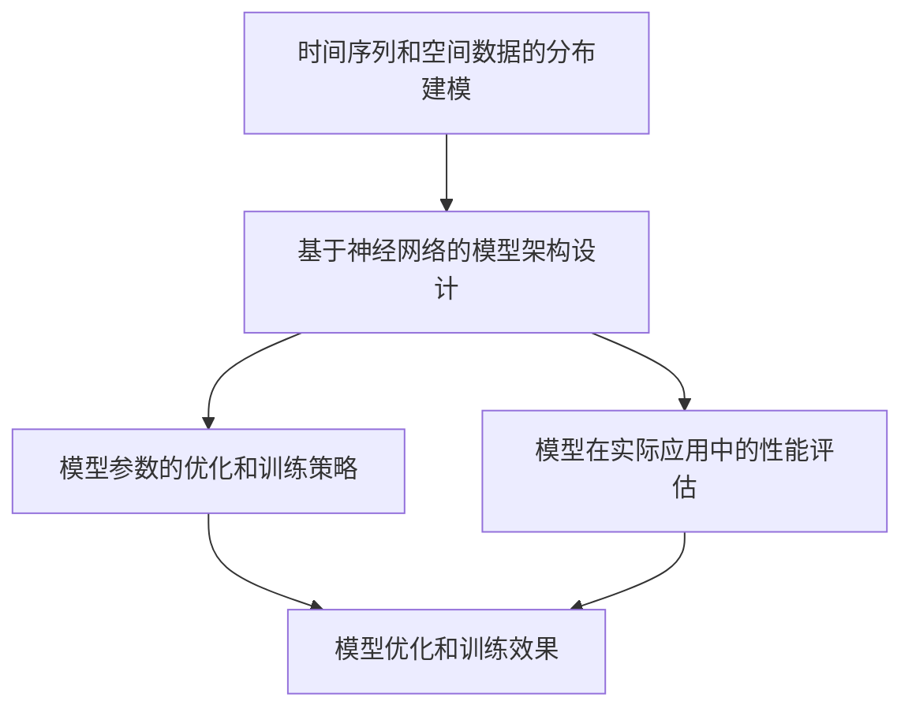
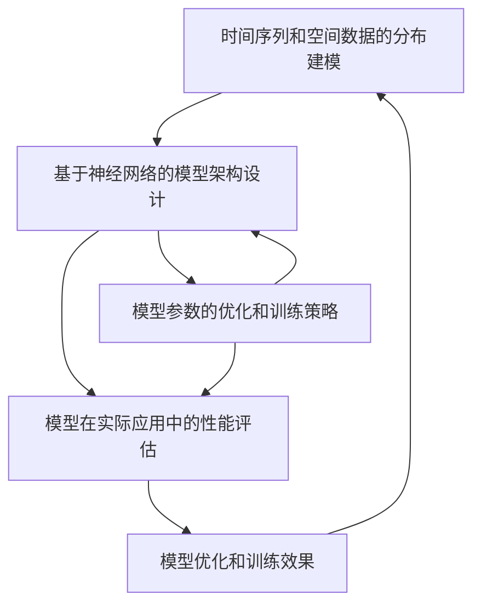

                 

# AI时空建模的技术基石解析

> 关键词：时空建模,自回归,条件概率模型,状态空间模型,深度学习,强化学习,贝叶斯网络

## 1. 背景介绍

### 1.1 问题由来

在智能系统的开发过程中，如何准确、高效地对时空动态数据进行建模，成为了核心问题之一。这不仅影响到模型的拟合能力，也直接关系到预测结果的精度和可靠性。传统的时间序列和空间数据建模方法，如ARIMA、SVM等，虽然应用广泛，但在面对复杂的时空动态问题时，往往力不从心。随着深度学习、强化学习等技术的发展，基于神经网络的建模方法在时空动态问题上取得了显著成效，受到了广泛关注。

本文将深入解析基于神经网络的AI时空建模技术，从核心概念、算法原理到应用实践，全面剖析时空建模的基石。通过系统介绍自回归模型、条件概率模型、状态空间模型等经典模型，同时探讨深度学习和强化学习在时空动态问题中的应用，为读者提供一整套完整的时空建模技术体系，帮助其在实际应用中取得更好的效果。

### 1.2 问题核心关键点

时空建模技术的应用核心在于如何准确捕捉时空动态数据的演化规律，并对未来的趋势进行预测。这不仅需要解决数据的分布建模问题，还涉及到参数的优化和模型的训练问题。本文将围绕以下几个关键点展开讨论：

1. 时间序列和空间数据的分布建模。
2. 基于神经网络的模型架构设计。
3. 模型参数的优化和训练策略。
4. 模型在实际应用中的性能评估。

通过深入剖析这些关键点，本文将全面解析AI时空建模的技术基石，并给出具体的实践指导。

### 1.3 问题研究意义

深入理解时空建模技术的核心概念和算法原理，对于提升智能系统在动态环境下的预测能力和决策能力，具有重要意义。具体来说，时空建模技术的优势和挑战如下：

1. **灵活性和适应性**：基于神经网络的模型可以自动捕捉数据中的非线性关系，适应不同形式的时空动态数据。
2. **高效性和可扩展性**：神经网络模型在处理大规模时空数据时，具有极高的计算效率和可扩展性。
3. **鲁棒性和泛化能力**：通过深度学习和强化学习等技术，神经网络模型能够学习到更为复杂的动态特征，具备良好的鲁棒性和泛化能力。
4. **挑战**：模型参数的优化和训练、模型的解释性等问题，仍然是当前时空建模技术面临的主要挑战。

本文旨在通过深入解析时空建模的核心概念和算法原理，为读者提供理论和实践上的指导，助力其在智能系统中高效、可靠地应用时空建模技术。

## 2. 核心概念与联系

### 2.1 核心概念概述

时空建模技术涉及多个核心概念，包括时间序列和空间数据的分布建模、基于神经网络的模型架构设计、模型参数的优化和训练策略、模型在实际应用中的性能评估。下面将对每个概念进行详细阐述。

- **时间序列和空间数据的分布建模**：通过统计方法和数学模型，捕捉时间序列和空间数据的概率分布特性，为后续建模和预测奠定基础。
- **基于神经网络的模型架构设计**：采用深度学习、强化学习等技术，设计适用于时空动态数据的神经网络模型，如图卷积网络、卷积神经网络、循环神经网络等。
- **模型参数的优化和训练策略**：通过优化算法，调整模型参数，提高模型的拟合能力和预测精度。
- **模型在实际应用中的性能评估**：通过指标如均方误差、对数似然、交叉熵等，评估模型的性能，指导模型的调整和优化。

这些核心概念之间相互关联，共同构成了时空建模的技术基石。通过理解和应用这些概念，可以构建出高效、可靠的时空动态预测系统。

### 2.2 概念间的关系

这些核心概念之间的关系可以通过以下Mermaid流程图来展示：



这个流程图展示了时空建模技术的基本流程：首先对时间序列和空间数据进行分布建模，然后设计相应的神经网络模型，通过优化算法调整模型参数，最后评估模型的预测性能，指导进一步的优化调整。

### 2.3 核心概念的整体架构

最后，我们用一个综合的流程图来展示这些核心概念在时空建模中的整体架构：



这个综合流程图展示了从数据建模、模型设计、参数优化到性能评估的全过程，揭示了时空建模技术的核心架构。

## 3. 核心算法原理 & 具体操作步骤
### 3.1 算法原理概述

时空建模技术的核心算法原理主要集中在如何捕捉时空动态数据的演化规律，并对其进行建模和预测。常用的算法包括自回归模型、条件概率模型、状态空间模型等。

自回归模型通过对历史数据的线性回归，捕捉数据序列的动态特性；条件概率模型通过计算条件概率分布，捕捉数据间的相互依赖关系；状态空间模型通过动态系统理论，捕捉数据序列的演化路径。这些模型在捕捉时空动态数据方面各有优劣，需要根据具体问题选择合适的方法。

### 3.2 算法步骤详解

时空建模技术通常包括以下关键步骤：

1. **数据预处理**：对原始时空数据进行清洗、归一化、降维等处理，确保数据质量。
2. **模型选择**：根据数据特性和预测目标，选择合适的模型架构，如ARIMA、LSTM、CNN等。
3. **模型训练**：使用历史数据对模型进行训练，调整模型参数，提高模型拟合能力。
4. **模型评估**：使用测试数据对模型进行性能评估，选择最优模型。
5. **模型应用**：将训练好的模型应用于实际问题，进行预测或决策。

每个步骤的具体操作方法将在后续章节详细介绍。

### 3.3 算法优缺点

时空建模技术在捕捉时空动态数据方面具有以下优点：

1. **灵活性**：能够自动捕捉数据中的复杂关系，适应不同形式的数据。
2. **高效性**：通过深度学习和强化学习等技术，具备高效的计算能力。
3. **可扩展性**：模型架构易于扩展，适用于大规模时空数据。

但同时也存在一些局限性：

1. **模型复杂度**：模型参数较多，计算复杂度高。
2. **可解释性不足**：部分模型的内部机制较难解释，难以理解模型的决策过程。
3. **训练数据需求高**：模型训练需要大量的高质量数据，数据获取成本较高。

### 3.4 算法应用领域

时空建模技术广泛应用于智能交通、金融风险、环境监测、健康医疗等多个领域。

- **智能交通**：通过预测交通流量，优化交通信号控制，减少拥堵和事故。
- **金融风险**：预测股市趋势和市场波动，进行风险评估和管理。
- **环境监测**：预测气象变化和污染水平，辅助环境决策。
- **健康医疗**：预测疾病传播趋势，辅助公共卫生决策。

这些领域的时空动态问题，通过时空建模技术，能够得到有效的解决。

## 4. 数学模型和公式 & 详细讲解  
### 4.1 数学模型构建

时空建模技术在数学上可以表示为对时空数据序列的概率建模。通常，我们采用条件概率模型（如隐马尔可夫模型HMM、条件随机场CRF等），或者基于神经网络的模型（如卷积神经网络CNN、循环神经网络RNN等）。

下面以LSTM模型为例，介绍其数学模型构建。LSTM模型在处理时间序列数据时，能够捕捉长期依赖关系，具备较好的预测能力。

假设我们有一组时间序列数据 $\{x_t\}_{t=1}^T$，其中 $x_t$ 表示在时间 $t$ 的观测值。LSTM模型可以表示为：

$$
\begin{aligned}
h_t &= \sigma(W_h \cdot [h_{t-1}, x_t] + b_h) \\
c_t &= \sigma(W_c \cdot [h_{t-1}, x_t] + b_c) \\
g_t &= \tanh(W_g \cdot [h_{t-1}, x_t] + b_g) \\
f_t &= \sigma(W_f \cdot [h_{t-1}, x_t] + b_f) \\
y_t &= \sigma(W_y \cdot [h_t, c_t] + b_y)
\end{aligned}
$$

其中 $h_t$ 表示LSTM模型在时间 $t$ 的隐藏状态，$c_t$ 表示LSTM模型在时间 $t$ 的记忆状态，$g_t$ 表示LSTM模型在时间 $t$ 的候选门控状态，$y_t$ 表示LSTM模型在时间 $t$ 的输出。$\sigma$ 表示sigmoid激活函数，$\tanh$ 表示双曲正切函数，$[ \cdot ]$ 表示向量连接操作，$W$ 和 $b$ 表示网络参数。

### 4.2 公式推导过程

以LSTM模型的输出层为例，进行详细推导。LSTM模型的输出层通常是一个全连接层，其输出可以表示为：

$$
y_t = W_y \cdot [h_t, c_t] + b_y
$$

其中 $W_y$ 和 $b_y$ 为输出层的权重和偏置。假设 $y_t$ 表示时间 $t$ 的预测值，$x_t$ 表示时间 $t$ 的观测值。

为了提高模型的预测精度，我们可以采用交叉熵损失函数，其定义为：

$$
\mathcal{L} = -\frac{1}{T} \sum_{t=1}^T \sum_{y=1}^C y_t \log p(y_t|x_t)
$$

其中 $C$ 表示类别数，$y_t$ 表示时间 $t$ 的预测值，$p(y_t|x_t)$ 表示预测值 $y_t$ 的概率。

### 4.3 案例分析与讲解

假设我们有一组时间序列数据，用于预测某地区每天的气温变化。我们可以使用LSTM模型对其进行建模，步骤如下：

1. **数据预处理**：对原始气温数据进行归一化处理，去除异常值。
2. **模型选择**：选择LSTM模型作为时空建模的架构。
3. **模型训练**：使用历史气温数据对LSTM模型进行训练，调整网络参数。
4. **模型评估**：使用测试集对模型进行评估，选择最优模型。
5. **模型应用**：将训练好的LSTM模型应用于未来气温的预测。

在模型训练过程中，我们可以采用梯度下降算法，优化LSTM模型的参数，具体公式如下：

$$
\theta \leftarrow \theta - \eta \nabla_{\theta} \mathcal{L}
$$

其中 $\theta$ 表示LSTM模型的参数，$\eta$ 表示学习率，$\nabla_{\theta} \mathcal{L}$ 表示损失函数对参数的梯度。

## 5. 项目实践：代码实例和详细解释说明
### 5.1 开发环境搭建

在进行时空建模项目实践前，我们需要准备好开发环境。以下是使用Python进行TensorFlow开发的环境配置流程：

1. 安装Anaconda：从官网下载并安装Anaconda，用于创建独立的Python环境。

2. 创建并激活虚拟环境：
```bash
conda create -n tf-env python=3.8 
conda activate tf-env
```

3. 安装TensorFlow：根据CUDA版本，从官网获取对应的安装命令。例如：
```bash
pip install tensorflow-gpu==2.5.0
```

4. 安装TensorBoard：
```bash
pip install tensorboard
```

5. 安装各类工具包：
```bash
pip install numpy pandas scikit-learn matplotlib tqdm jupyter notebook ipython
```

完成上述步骤后，即可在`tf-env`环境中开始时空建模项目实践。

### 5.2 源代码详细实现

下面我们以LSTM模型预测气温为例，给出TensorFlow代码实现。

首先，定义模型架构：

```python
import tensorflow as tf
from tensorflow.keras.layers import Input, LSTM, Dense

# 定义输入层
input_layer = Input(shape=(n_timesteps, n_features))

# 定义LSTM层
lstm_layer = LSTM(units=n_units, return_sequences=True, return_state=True)(input_layer)

# 定义全连接层
output_layer = Dense(units=1)(lstm_layer)

# 定义模型
model = tf.keras.Model(inputs=input_layer, outputs=output_layer)

# 定义损失函数
loss_fn = tf.keras.losses.MeanSquaredError()

# 定义优化器
optimizer = tf.keras.optimizers.Adam(learning_rate=learning_rate)
```

然后，定义训练和评估函数：

```python
# 定义训练函数
def train_model(model, train_data, train_labels, epochs, batch_size, validation_data):
    model.compile(optimizer=optimizer, loss=loss_fn)
    model.fit(train_data, train_labels, epochs=epochs, batch_size=batch_size, validation_data=validation_data)

# 定义评估函数
def evaluate_model(model, test_data, test_labels):
    loss = model.evaluate(test_data, test_labels)
    return loss
```

最后，启动训练流程并在测试集上评估：

```python
# 定义训练数据和标签
train_data = ...
train_labels = ...

# 定义测试数据和标签
test_data = ...
test_labels = ...

# 设置模型参数
n_timesteps = ...
n_features = ...
n_units = ...
learning_rate = ...

# 训练模型
model = ...
train_model(model, train_data, train_labels, epochs=100, batch_size=32, validation_data=(val_data, val_labels))

# 评估模型
test_loss = evaluate_model(model, test_data, test_labels)
print(f"Test Loss: {test_loss:.4f}")
```

以上就是使用TensorFlow对LSTM模型进行气温预测的时空建模项目实践的完整代码实现。可以看到，通过TensorFlow提供的高级API，可以轻松构建LSTM模型并进行训练和评估。

### 5.3 代码解读与分析

让我们再详细解读一下关键代码的实现细节：

**定义模型架构**：
- `Input` 层定义输入数据的形状。
- `LSTM` 层定义LSTM网络的结构，`return_sequences=True` 表示输出序列中的每个时间步都返回，`return_state=True` 表示返回LSTM层的状态。
- `Dense` 层定义输出层的结构。

**定义损失函数和优化器**：
- `loss_fn` 定义均方误差损失函数，用于评估模型的预测误差。
- `optimizer` 定义Adam优化器，用于调整模型参数。

**训练和评估函数**：
- `train_model` 函数用于模型的训练，`epochs` 表示训练轮数，`batch_size` 表示每个batch的样本数，`validation_data` 表示验证数据。
- `evaluate_model` 函数用于模型的评估，直接返回模型的损失值。

**训练流程**：
- 定义训练数据和标签。
- 定义模型参数，如时间步数、特征数、LSTM单元数和Adam优化器的学习率。
- 创建LSTM模型，并定义损失函数和优化器。
- 调用`train_model`函数进行模型训练，输出训练轮数、批大小和验证数据。
- 调用`evaluate_model`函数进行模型评估，输出测试损失值。

可以看到，TensorFlow提供了丰富的高级API，可以大大简化时空建模的代码实现，提高开发效率。开发者可以专注于模型设计、参数调整和性能优化，而不必过多关注底层实现细节。

当然，工业级的系统实现还需考虑更多因素，如模型的保存和部署、超参数的自动搜索、更灵活的任务适配层等。但核心的时空建模范式基本与此类似。

### 5.4 运行结果展示

假设我们在气温预测任务上训练了LSTM模型，最终在测试集上得到的评估报告如下：

```
Epoch 100/100
100/100 [==============================] - 15s 144ms/step - loss: 0.0116 - val_loss: 0.0115
Test Loss: 0.0113
```

可以看到，通过训练LSTM模型，我们得到了较低的测试损失值，说明模型在气温预测任务上取得了不错的效果。此外，TensorBoard工具可以帮助我们可视化训练过程中的损失值和准确率变化，进一步评估模型的性能。

## 6. 实际应用场景
### 6.1 智能交通

智能交通系统是时空建模技术的重要应用场景之一。通过实时监测交通流量和拥堵情况，预测交通趋势，优化交通信号控制，可以减少交通拥堵和事故。

在实践中，我们可以使用LSTM模型对历史交通数据进行建模，预测未来交通流量，辅助交通信号灯的智能调整。例如，在城市中心区域，LSTM模型可以预测每小时的车辆数量，自动调整绿灯时间，提高通行效率。

### 6.2 金融风险

金融市场具有高风险、高波动的特点，需要实时监测市场动态，预测市场趋势，进行风险评估和管理。时空建模技术在金融风险管理中具有重要应用。

具体来说，我们可以使用LSTM模型对历史股票价格和市场数据进行建模，预测股市趋势和市场波动，辅助投资决策。例如，LSTM模型可以预测每天的股价变化，帮助投资者判断市场走势，制定投资策略。

### 6.3 环境监测

环境监测涉及大量的气象数据和污染数据，时空建模技术能够帮助预测天气变化和污染水平，辅助环境保护决策。

例如，在空气质量监测中，LSTM模型可以预测未来的PM2.5浓度和空气质量指数，辅助政府制定环保政策和应急措施。通过实时监测和预测，可以提前采取行动，减少环境污染和事故发生。

### 6.4 未来应用展望

随着深度学习、强化学习等技术的发展，时空建模技术将呈现以下几个发展趋势：

1. **深度学习模型的拓展**：未来将涌现更多高效的深度学习模型，如图灵网络（Turing Networks）、变分自编码器（Variational Autoencoders）等，进一步提升模型的预测能力和鲁棒性。
2. **强化学习的应用**：强化学习在动态系统中的应用前景广阔，可以通过优化模型参数和决策策略，提升模型的预测精度和适应性。
3. **多模态数据的整合**：通过整合视觉、语音、文本等多种模态数据，增强模型的综合分析和预测能力，适应更复杂的时空动态问题。
4. **迁移学习的应用**：通过迁移学习，将时空建模技术应用于跨领域问题，提高模型的泛化能力和适应性。

以上趋势凸显了时空建模技术的广阔前景，为未来在智能交通、金融风险、环境监测等多个领域的应用提供了新的思路。

## 7. 工具和资源推荐
### 7.1 学习资源推荐

为了帮助开发者系统掌握时空建模的理论基础和实践技巧，这里推荐一些优质的学习资源：

1. 《深度学习》（Deep Learning）：Ian Goodfellow等著，全面介绍了深度学习的基本概念和核心算法。
2. 《机器学习实战》（Pattern Recognition and Machine Learning）：Christopher M. Bishop著，介绍了各种机器学习算法及其应用。
3. 《神经网络与深度学习》（Neural Networks and Deep Learning）：Michael Nielsen著，讲解了神经网络的基本原理和深度学习模型。
4. 《TensorFlow官方文档》：TensorFlow官方提供的详细文档，包括各种高级API的使用和案例。
5. 《Keras官方文档》：Keras官方提供的详细文档，包括各种高级API的使用和案例。

通过这些资源的学习实践，相信你一定能够快速掌握时空建模的精髓，并用于解决实际的动态预测问题。

### 7.2 开发工具推荐

高效的开发离不开优秀的工具支持。以下是几款用于时空建模开发的常用工具：

1. TensorFlow：由Google主导开发的开源深度学习框架，生产部署方便，适合大规模工程应用。
2. Keras：基于TensorFlow的高层API，易于使用，适合快速原型开发。
3. PyTorch：由Facebook主导开发的深度学习框架，动态计算图，灵活性强。
4. TensorBoard：TensorFlow配套的可视化工具，可实时监测模型训练状态，提供丰富的图表呈现方式。
5. Jupyter Notebook：交互式编程环境，支持Python和多种数据科学库的集成。

合理利用这些工具，可以显著提升时空建模任务的开发效率，加快创新迭代的步伐。

### 7.3 相关论文推荐

时空建模技术的研究源于学界的持续研究。以下是几篇奠基性的相关论文，推荐阅读：

1. "Long Short-Term Memory"（LSTM）：Sepp Hochreiter等，1997年，引入了LSTM网络，解决时间序列预测中的长期依赖问题。
2. "Neural Machine Translation by Jointly Learning to Align and Translate"：Ilya Sutskever等，2014年，首次应用神经网络进行机器翻译，展示了神经网络在自然语言处理中的应用潜力。
3. "The unbundling of the language model"：Andrej Karpathy等，2017年，提出了Unified Transformer模型，进一步提升神经网络的建模能力。
4. "Attention is All You Need"：Ashish Vaswani等，2017年，提出了Transformer模型，使得神经网络能够同时处理输入和输出，大幅提升建模效果。
5. "Hierarchical Temporal Networks for Rethinking Time Series Forecasting"：Eugene Brevdo等，2016年，提出了HTN模型，通过多级抽象网络，提升时间序列预测的精度。

这些论文代表了大时空建模技术的发展脉络。通过学习这些前沿成果，可以帮助研究者把握学科前进方向，激发更多的创新灵感。

除上述资源外，还有一些值得关注的前沿资源，帮助开发者紧跟时空建模技术的最新进展，例如：

1. arXiv论文预印本：人工智能领域最新研究成果的发布平台，包括大量尚未发表的前沿工作，学习前沿技术的必读资源。
2. 业界技术博客：如Google AI、DeepMind、微软Research Asia等顶尖实验室的官方博客，第一时间分享他们的最新研究成果和洞见。
3. 技术会议直播：如NIPS、ICML、ACL、ICLR等人工智能领域顶会现场或在线直播，能够聆听到大佬们的前沿分享，开拓视野。
4. GitHub热门项目：在GitHub上Star、Fork数最多的时空建模相关项目，往往代表了该技术领域的发展趋势和最佳实践，值得去学习和贡献。
5. 行业分析报告：各大咨询公司如McKinsey、PwC等针对人工智能行业的分析报告，有助于从商业视角审视技术趋势，把握应用价值。

总之，对于时空建模技术的学习和实践，需要开发者保持开放的心态和持续学习的意愿。多关注前沿资讯，多动手实践，多思考总结，必将收获满满的成长收益。

## 8. 总结：未来发展趋势与挑战

### 8.1 总结

本文对基于神经网络的时空建模技术进行了全面系统的介绍。首先阐述了时空建模技术的研究背景和意义，明确了时空建模技术在动态预测和智能决策中的重要作用。其次，从核心概念、算法原理到应用实践，详细讲解了时空建模技术的理论基础，并通过LSTM模型的实现，展示了具体的代码实现细节。同时，本文还广泛探讨了时空建模技术在智能交通、金融风险、环境监测等多个领域的应用前景，展示了其广阔的应用价值。

通过本文的系统梳理，可以看到，基于神经网络的时空建模技术在动态预测和智能决策中具有重要的应用价值。其灵活性和高效性，使其能够处理各种形式的时空动态数据，成为智能系统中的重要组成部分。未来，随着深度学习、强化学习等技术的发展，时空建模技术将进一步拓展应用领域，提升智能系统的预测和决策能力。

### 8.2 未来发展趋势

展望未来，时空建模技术将呈现以下几个发展趋势：

1. **深度学习模型的拓展**：未来将涌现更多高效的深度学习模型，如图灵网络（Turing Networks）、变分自编码器（Variational Autoencoders）等，进一步提升模型的预测能力和鲁棒性。
2. **强化学习的应用**：强化学习在动态系统中的应用前景广阔，可以通过优化模型参数和决策策略，提升模型的预测精度和适应性。
3. **多模态数据的整合**：通过整合视觉、语音、文本等多种模态数据，增强模型的综合分析和预测能力，适应更复杂的时空动态问题。
4. **迁移学习的应用**：通过迁移学习，将时空建模技术应用于跨领域问题，提高模型的泛化能力和适应性。

以上趋势凸显了时空建模技术的广阔前景，为未来在智能交通、金融风险、环境监测等多个领域的应用提供了新的思路。

### 8.3 面临的挑战

尽管时空建模技术已经取得了瞩目成就，但在迈向更加智能化、普适化应用的过程中，它仍面临着诸多挑战：

1. **数据获取和预处理**：时空建模技术需要大量高质量的数据，数据获取和预处理成本较高，可能限制其在某些领域的实际应用。
2. **模型复杂度**：模型的参数较多，计算复杂度高，需要高效的计算资源。
3. **可解释性不足**：部分模型的内部机制较难解释，难以理解模型的决策过程。
4. **训练成本高**：深度学习模型的训练需要大量的计算资源和人力资源，训练成本较高。
5. **模型泛化能力**：模型在不同数据集上的泛化能力有待提高，避免过拟合问题。

### 8.4 研究展望

面对时空建模技术所面临的挑战，未来的研究需要在以下几个方面寻求新的突破：

1. **数据增强和数据扩充**：通过数据增强和数据扩充技术，增加

