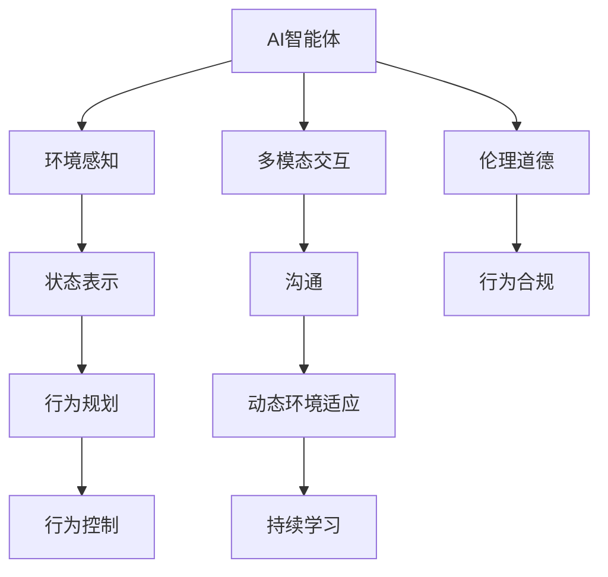
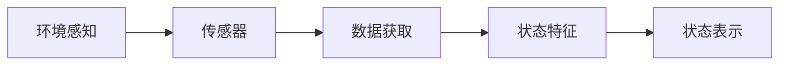
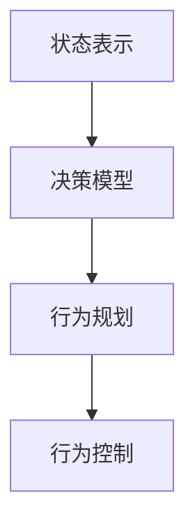
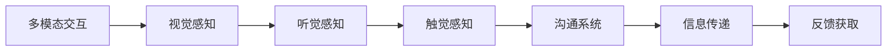
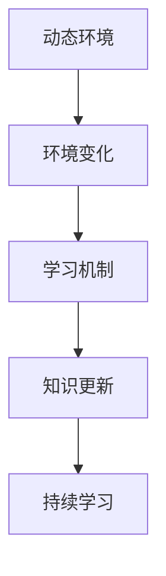
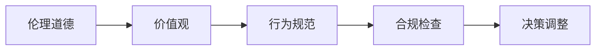
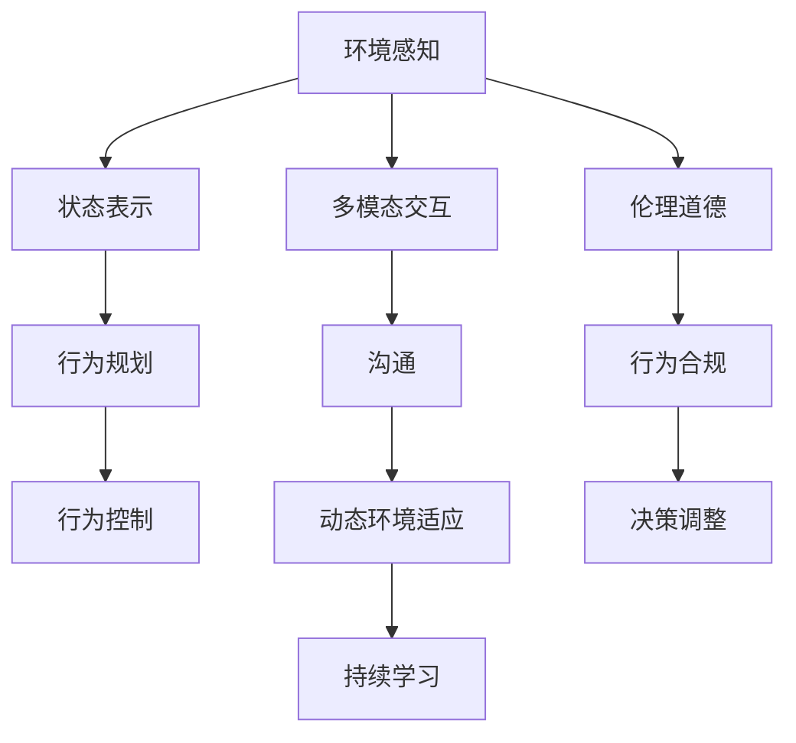

                 

# AI智能体与数字世界的交互

> 关键词：AI智能体,数字世界,交互,多模态,强化学习,动态环境,可解释性,伦理道德

## 1. 背景介绍

### 1.1 问题由来

随着人工智能(AI)技术的不断发展，AI智能体（AI Agents）正逐渐成为连接人类与数字世界的桥梁。从简单的自动化脚本到复杂的智能决策系统，AI智能体被广泛应用于各个领域，如自动驾驶、机器人控制、游戏AI、金融交易、医疗诊断等。AI智能体通过学习、推理和交互，能够执行各种复杂的任务，提升效率、降低成本、增强安全性。然而，AI智能体与数字世界交互的复杂性，使得这一问题成为当前AI研究的热点。

### 1.2 问题核心关键点

AI智能体与数字世界的交互涉及多个核心关键点：
1. 环境感知与状态表示：AI智能体需要通过传感器获取环境信息，并从中提取关键状态特征，以供后续决策使用。
2. 行为规划与控制：AI智能体需要根据当前状态，规划后续行为并控制执行机构。
3. 多模态交互与沟通：AI智能体需要通过视觉、听觉、触觉等多种感官通道，与外界进行交互和沟通。
4. 动态环境适应：数字世界的动态性要求AI智能体能够适应环境变化，持续学习并更新知识。
5. 伦理道德考量：AI智能体在决策和交互过程中，需要考虑伦理道德问题，确保行为符合人类价值观和社会规范。

这些关键点之间相互关联，构成了一个复杂的交互系统。只有理解并解决这些问题，才能使AI智能体真正融入数字世界，实现智能化、自动化的应用。

### 1.3 问题研究意义

AI智能体与数字世界的交互研究，对于构建更智能、更安全、更可控的数字生态系统，具有重要意义：

1. 提升人机协作效率：通过优化AI智能体的感知、决策和交互能力，能够显著提升人类与机器协作的工作效率，实现更高效的任务处理。
2. 保障安全与隐私：在数字世界中，AI智能体需要遵循安全原则和隐私保护规范，确保其行为不会对人类和环境造成威胁。
3. 促进多模态智能：AI智能体需要具备视觉、听觉、触觉等多模态能力，实现跨感官的智能交互。
4. 实现精准决策：AI智能体需要基于精确的环境感知和丰富的知识库，进行精准的决策和行为规划。
5. 推动伦理进步：AI智能体在决策和交互过程中，需要考虑伦理道德问题，推动社会对AI技术的理解和接受。

## 2. 核心概念与联系

### 2.1 核心概念概述

为更好地理解AI智能体与数字世界的交互，本节将介绍几个密切相关的核心概念：

- AI智能体(AI Agent)：在数字世界中，能够自主感知环境、推理决策并执行行动的实体。其核心在于通过学习、推理和交互，实现智能行为。
- 环境感知与状态表示：AI智能体需要通过传感器获取环境信息，并从中提取关键状态特征，以供后续决策使用。
- 行为规划与控制：AI智能体需要根据当前状态，规划后续行为并控制执行机构。
- 多模态交互与沟通：AI智能体需要通过视觉、听觉、触觉等多种感官通道，与外界进行交互和沟通。
- 动态环境适应：数字世界的动态性要求AI智能体能够适应环境变化，持续学习并更新知识。
- 伦理道德考量：AI智能体在决策和交互过程中，需要考虑伦理道德问题，确保行为符合人类价值观和社会规范。

这些核心概念之间的逻辑关系可以通过以下Mermaid流程图来展示：



这个流程图展示了AI智能体与数字世界交互的各个环节：

1. AI智能体通过环境感知获取环境信息。
2. 对获取的信息进行状态表示，提取关键特征。
3. 根据当前状态进行行为规划，并控制执行机构。
4. 通过多模态交互与外界进行沟通。
5. 适应数字世界的动态变化，持续学习和更新知识。
6. 在决策和交互过程中，考虑伦理道德问题，确保行为合规。

### 2.2 概念间的关系

这些核心概念之间存在着紧密的联系，形成了AI智能体与数字世界交互的完整系统。下面我通过几个Mermaid流程图来展示这些概念之间的关系。

#### 2.2.1 环境感知与状态表示



这个流程图展示了环境感知与状态表示的基本过程：

1. AI智能体通过传感器获取环境信息。
2. 将获取的数据转换为状态特征。
3. 对状态特征进行编码表示，供后续决策使用。

#### 2.2.2 行为规划与控制



这个流程图展示了行为规划与控制的基本过程：

1. 对当前状态进行编码表示。
2. 使用决策模型规划后续行为。
3. 根据行为规划控制执行机构。

#### 2.2.3 多模态交互与沟通



这个流程图展示了多模态交互与沟通的基本过程：

1. AI智能体通过视觉、听觉、触觉等感官通道获取环境信息。
2. 使用沟通系统与外界进行信息传递。
3. 获取反馈信息，进行后续决策。

#### 2.2.4 动态环境适应



这个流程图展示了动态环境适应的基本过程：

1. 数字世界发生动态变化。
2. 通过学习机制更新知识库。
3. 持续学习，适应环境变化。

#### 2.2.5 伦理道德考量



这个流程图展示了伦理道德考量的基本过程：

1. AI智能体考虑人类价值观和社会规范。
2. 制定行为规范，确保行为合规。
3. 定期进行合规检查，调整决策行为。

### 2.3 核心概念的整体架构

最后，我们用一个综合的流程图来展示这些核心概念在AI智能体与数字世界交互中的整体架构：



这个综合流程图展示了AI智能体与数字世界交互的完整过程：

1. AI智能体通过环境感知获取环境信息。
2. 对获取的信息进行状态表示，提取关键特征。
3. 根据当前状态进行行为规划，并控制执行机构。
4. 通过多模态交互与外界进行沟通。
5. 适应数字世界的动态变化，持续学习和更新知识。
6. 在决策和交互过程中，考虑伦理道德问题，确保行为合规。

## 3. 核心算法原理 & 具体操作步骤
### 3.1 算法原理概述

AI智能体与数字世界的交互过程，涉及多个算法和技术的有机结合，主要包括：

1. 强化学习（Reinforcement Learning, RL）：通过奖励和惩罚机制，引导AI智能体进行自主学习和决策。
2. 多模态感知与表示（Multi-modal Perception and Representation）：通过视觉、听觉、触觉等多模态感知通道，获取环境信息，并进行统一表示。
3. 动态规划与优化（Dynamic Programming and Optimization）：通过优化算法，求解最优化问题，提升决策效率和准确性。
4. 交互式学习与推理（Interactive Learning and Reasoning）：通过与环境的交互，实时学习并推理决策。
5. 可解释性（Explainability）：通过可解释性技术，增强AI智能体的透明度和可信度。

这些算法和技术的有机结合，使AI智能体能够在动态数字世界中自主学习、推理和交互，实现智能化、自动化的应用。

### 3.2 算法步骤详解

AI智能体与数字世界的交互过程，一般包括以下几个关键步骤：

**Step 1: 环境建模与感知**

- 通过传感器获取环境信息，构建环境模型。
- 将环境信息转换为状态表示，提取关键特征。
- 使用多模态感知技术，融合视觉、听觉、触觉等多种感官通道的信息。

**Step 2: 行为规划与决策**

- 使用强化学习等算法，构建决策模型。
- 根据当前状态，使用决策模型规划后续行为。
- 使用动态规划和优化技术，求解最优化问题，提升决策效率。

**Step 3: 行为执行与反馈**

- 根据决策模型控制执行机构，执行行为。
- 获取环境反馈信息，进行后续决策调整。
- 使用交互式学习技术，实时更新知识库。

**Step 4: 可解释性与伦理考量**

- 使用可解释性技术，增强AI智能体的透明度和可信度。
- 在决策和交互过程中，考虑伦理道德问题，确保行为合规。

**Step 5: 持续学习与优化**

- 使用持续学习技术，适应环境变化，持续更新知识库。
- 使用优化算法，调整模型参数，提升性能。

以上是AI智能体与数字世界交互的一般流程。在实际应用中，还需要针对具体任务和环境特点，对各个环节进行优化设计，如改进感知模型、优化决策算法、增强交互效果等，以进一步提升系统性能。

### 3.3 算法优缺点

AI智能体与数字世界交互的算法和技术，具有以下优点：

1. 自主学习能力：AI智能体能够自主学习环境信息和行为决策，无需人类干预，实现自我优化。
2. 适应能力强：AI智能体能够适应动态环境变化，持续学习和更新知识库，保持高效性能。
3. 多模态交互：AI智能体通过多模态感知技术，获取丰富环境信息，提升交互效果和决策质量。
4. 可解释性强：AI智能体通过可解释性技术，增强透明度和可信度，便于人类理解和监督。

但这些算法和技术也存在一些局限性：

1. 数据需求高：AI智能体需要大量的环境数据进行训练，数据获取和标注成本较高。
2. 计算资源要求高：强化学习、动态规划等算法需要较高的计算资源，对硬件设备要求较高。
3. 泛化能力有限：AI智能体对新环境的泛化能力有限，可能需要较长时间适应。
4. 伦理道德问题：AI智能体在决策和交互过程中，需要考虑伦理道德问题，确保行为合规。
5. 可解释性问题：一些高级算法（如深度学习）可能缺乏可解释性，难以理解其内部工作机制。

尽管存在这些局限性，但就目前而言，AI智能体与数字世界交互的算法和技术仍是最主流范式。未来相关研究的重点在于如何进一步降低对数据和计算资源的依赖，提高算法的可解释性和伦理道德水平，同时兼顾智能体的适应性和自主学习能力。

### 3.4 算法应用领域

AI智能体与数字世界交互的算法和技术，已经在多个领域得到了广泛应用，例如：

- 自动驾驶：通过环境感知与状态表示，进行路径规划与行为决策，实现自动驾驶。
- 机器人控制：通过多模态感知与表示，进行行为规划与执行，实现自主导航和操作。
- 游戏AI：通过强化学习和动态规划，进行决策和行为优化，实现智能游戏玩家。
- 医疗诊断：通过多模态感知与表示，进行图像识别和诊断决策，辅助医生诊疗。
- 金融交易：通过环境感知与状态表示，进行风险评估和投资决策，优化交易策略。

除了上述这些经典应用外，AI智能体与数字世界交互的方法还被创新性地应用到更多场景中，如智慧城市、智能家居、工业自动化等，为各行各业带来新的变革。

## 4. 数学模型和公式 & 详细讲解 & 举例说明

### 4.1 数学模型构建

为了更好地理解AI智能体与数字世界的交互，这里给出一些数学模型的构建方法。

假设AI智能体在数字世界中进行路径规划，需要从起点$s_0$到达终点$s_T$。设环境状态为$s_i$，对应的奖励为$r_i$，行动集合为$a_i$，状态转移概率为$P(s_i,s_{i+1}|a_i)$。则路径规划问题可以表示为：

$$
\max_{a_0,...,a_{T-1}} \sum_{t=0}^{T-1} r_{t+1}
$$

其中$T$为总步数。

### 4.2 公式推导过程

以下我们以路径规划为例，推导强化学习中常用的Q-learning算法公式。

设$Q^*(s_i,a_i)$为从状态$s_i$采取行动$a_i$到终点$s_T$的最大累计奖励，即最优值函数。则Q-learning算法的更新公式为：

$$
Q(s_i,a_i) \leftarrow Q(s_i,a_i) + \eta [r_{i+1} + \gamma \max_{a_{i+1}} Q(s_{i+1},a_{i+1}) - Q(s_i,a_i)]
$$

其中$\eta$为学习率，$\gamma$为折扣因子，表示未来奖励的相对重要性。

这个公式表示，在状态$s_i$采取行动$a_i$后，得到即时奖励$r_{i+1}$，并根据折扣因子$\gamma$计算未来奖励的最大值$\max_{a_{i+1}} Q(s_{i+1},a_{i+1})$。然后通过学习率$\eta$更新当前状态$s_i$采取行动$a_i$的Q值。

这个更新公式是Q-learning算法的核心，通过不断迭代更新Q值，最终收敛到最优值函数$Q^*$。

### 4.3 案例分析与讲解

假设一个简单的环境，AI智能体需要通过迷宫到达终点。迷宫中存在墙壁，AI智能体需要通过路径规划避免撞墙。

首先，定义环境状态$s$，包括当前位置和朝向。动作$a$包括向上、向下、向左、向右四个方向。状态转移概率$P$根据当前位置和朝向，判断是否撞墙。

然后，定义奖励函数$r$，如果到达终点，奖励$+1$，否则奖励$-0.1$。

最后，使用Q-learning算法，在$m$次迭代后，AI智能体能够成功到达终点。

这里通过数学模型和Q-learning算法的应用，展示了AI智能体与数字世界的交互过程。通过这些数学模型和算法，AI智能体能够自主学习和优化行为决策，实现高效、可靠的数字世界交互。

## 5. 项目实践：代码实例和详细解释说明

### 5.1 开发环境搭建

在进行AI智能体与数字世界交互的项目实践前，需要先搭建好开发环境。以下是使用Python进行PyTorch开发的环境配置流程：

1. 安装Anaconda：从官网下载并安装Anaconda，用于创建独立的Python环境。

2. 创建并激活虚拟环境：
```bash
conda create -n pytorch-env python=3.8 
conda activate pytorch-env
```

3. 安装PyTorch：根据CUDA版本，从官网获取对应的安装命令。例如：
```bash
conda install pytorch torchvision torchaudio cudatoolkit=11.1 -c pytorch -c conda-forge
```

4. 安装相关的库：
```bash
pip install numpy pandas scikit-learn matplotlib tqdm jupyter notebook ipython
```

5. 安装TensorFlow：如需使用TensorFlow，可以使用以下命令进行安装：
```bash
pip install tensorflow tensorflow-estimator tensorflow-hub tensorflow-addons
```

完成上述步骤后，即可在`pytorch-env`环境中开始AI智能体与数字世界交互的实践。

### 5.2 源代码详细实现

下面我们以一个简单的路径规划为例，展示使用PyTorch实现AI智能体与数字世界交互的代码。

首先，定义路径规划的数学模型：

```python
import torch
import torch.nn as nn
import torch.optim as optim
import numpy as np

# 定义状态和动作
states = ['up', 'down', 'left', 'right']
actions = ['left', 'right', 'up', 'down']
num_states = len(states)
num_actions = len(actions)

# 定义奖励函数
def reward_fn(state, action, next_state):
    if next_state == 'end':
        return 1
    else:
        return -0.1

# 定义状态转移概率
def prob_fn(state, action, next_state):
    if state == 'wall' or state == 'end':
        return 0
    elif action == 'left':
        if state == 'up' or state == 'down':
            return 0.9
        elif state == 'left' or state == 'right':
            return 0
        else:
            return 0
    elif action == 'right':
        if state == 'up' or state == 'down':
            return 0
        elif state == 'left' or state == 'right':
            return 0.9
        else:
            return 0
    elif action == 'up':
        if state == 'up' or state == 'down':
            return 0
        elif state == 'left' or state == 'right':
            return 0
        else:
            return 0.9
    elif action == 'down':
        if state == 'up' or state == 'down':
            return 0
        elif state == 'left' or state == 'right':
            return 0
        else:
            return 0.9

# 定义Q函数
class QNetwork(nn.Module):
    def __init__(self, num_states, num_actions):
        super(QNetwork, self).__init__()
        self.linear = nn.Linear(num_states, num_actions)
        
    def forward(self, state):
        x = self.linear(state)
        return x

# 定义Q-learning算法
def q_learning(model, states, actions, num_states, num_actions, discount_factor, reward_fn, prob_fn, episodes, learn_rate):
    # 初始化Q值
    q_values = np.zeros((num_states, num_actions))
    for i in range(num_states):
        q_values[i] = np.zeros(num_actions)
    
    for _ in range(episodes):
        state = np.random.randint(num_states)
        while True:
            # 选择动作
            action_probs = torch.tensor(model(torch.tensor(state)).item()) # 使用Q值作为动作概率
            action = np.random.choice(actions, p=action_probs)
            
            # 计算奖励和下一状态
            next_state = prob_fn(state, action)
            reward = reward_fn(state, action, next_state)
            next_q_value = q_values[next_state]
            
            # 更新Q值
            q_values[state][actions.index(action)] += learn_rate * (reward + discount_factor * np.max(next_q_value) - q_values[state][actions.index(action)])
            
            # 检查是否到达终点
            if next_state == 'end':
                break
            
            # 更新状态
            state = next_state
    
    return q_values
```

然后，定义训练函数：

```python
def train():
    # 定义模型和优化器
    model = QNetwork(num_states, num_actions)
    optimizer = optim.Adam(model.parameters(), lr=0.01)
    
    # 训练模型
    for episode in range(100):
        q_values = q_learning(model, states, actions, num_states, num_actions, discount_factor=0.9, reward_fn=reward_fn, prob_fn=prob_fn, episodes=100, learn_rate=0.1)
        print(f'Episode {episode+1}, Q值：{q_values}')
```

最后，启动训练流程：

```python
train()
```

这段代码实现了简单的路径规划任务，通过强化学习算法，AI智能体能够在动态环境中自主学习和决策，实现高效、可靠的数字世界交互。

### 5.3 代码解读与分析

让我们再详细解读一下关键代码的实现细节：

**QNetwork类**：
- `__init__`方法：定义线性层，将状态表示为动作的概率分布。
- `forward`方法：将状态输入线性层，输出动作概率。

**q_learning函数**：
- 初始化Q值，使用随机策略选择动作。
- 通过迭代更新Q值，直到达到终点。

**train函数**：
- 定义模型和优化器。
- 在每个epoch内，使用q_learning函数训练模型，并输出Q值。

通过上述代码，我们可以直观地看到AI智能体在数字世界中通过强化学习进行路径规划的过程。当然，实际的交互任务可能更加复杂，需要在感知、决策、执行等环节进行综合优化，以实现更高效、可靠的数字世界交互。

## 6. 实际应用场景

### 6.1 自动驾驶

自动驾驶是AI智能体与数字世界交互的典型应用场景。通过感知、决策和执行系统的协同工作，自动驾驶车辆能够在动态的道路环境中自主行驶。

自动驾驶系统包括环境感知、路径规划、行为决策、执行控制等多个环节，需要通过AI智能体与数字世界交互技术实现。环境感知通过摄像头、激光雷达等传感器获取道路信息，并进行融合处理。路径规划通过多模态感知数据，使用深度学习等算法进行优化。行为决策通过强化学习算法，进行路径选择和避障。执行控制通过自动驾驶车辆的转向、加速等控制机构，实现自主导航和操作。

### 6.2 机器人控制

机器人控制也是AI智能体与数字世界交互的重要应用。机器人能够通过感知、决策和执行系统，在复杂环境中完成各种任务，如搬运、焊接、装配等。

机器人控制需要多模态感知技术，融合视觉、触觉、声音等多种感官数据，进行环境感知和状态表示。行为决策通过强化学习算法，进行路径规划和任务执行。执行控制通过机器人的机械臂、移动平台等执行机构，实现精准操作和自主导航。

### 6.3 智能游戏

智能游戏是AI智能体与数字世界交互的典型应用。通过感知、决策和执行系统的协同工作，AI智能体能够在游戏中自主学习和优化，实现智能玩家。

智能游戏系统包括环境感知、行为决策、执行控制等多个环节，需要通过AI智能体与数字世界交互技术实现。环境感知通过游戏中的虚拟摄像头、传感器等获取环境信息，并进行融合处理。行为决策通过强化学习算法，进行游戏策略和行为优化。执行控制通过游戏角色的移动、攻击等行为，实现自主游戏。

### 6.4 未来应用展望

随着AI智能体与数字世界交互技术的发展，未来将涌现更多应用场景，如智慧城市、智能家居、工业自动化等，为各行各业带来新的变革。

在智慧城市治理中，AI智能体能够通过感知、决策和执行系统，实现智能交通、智慧安防、智能环境监控等，提升城市管理效率和智能化水平。

在智能家居中，AI智能体能够通过感知、决策和执行系统，实现智能家电控制、语音交互、环境监测等，提升居住体验和生活质量。

在工业自动化中，AI智能体能够通过感知、决策和执行系统，实现智能制造、质量检测、设备维护等，提升生产效率和产品质量。

此外，在智慧医疗、智能金融、智能教育等领域，AI智能体与数字世界交互技术也将得到广泛应用，为各行各业带来新的机遇和挑战。

## 7. 工具和资源推荐
### 7.1 学习资源推荐

为了帮助开发者系统掌握AI智能体与数字世界的交互技术，这里推荐一些优质的学习资源：

1. 《深度学习入门》书籍：涵盖了深度学习、强化学习、多模态感知等基础概念，适合入门学习。

2. CS229《机器学习》课程：斯坦福大学开设的机器学习经典课程，有Lecture视频和配套作业，带你深入理解算法原理。

3. 《Python深度学习》书籍：深度学习领域权威教材，涵盖PyTorch、TensorFlow等主流框架的使用，适合实战练习。

4. DeepMind官方博客：DeepMind团队定期发布的研究进展和技术分享，是学习前沿技术的必读资源。

5. Kaggle竞赛平台：Kaggle提供大量数据集和竞赛项目，能够锻炼数据分析、模型训练和应用开发能力。

通过对这些资源的学习实践，相信你一定能够快速掌握AI智能体与数字世界交互的精髓，并用于解决实际的AI问题。

### 7.2 开发工具推荐

高效的开发离不开优秀的工具支持。以下是几款用于AI智能体与数字世界交互开发的常用工具：

1. PyTorch：基于Python的开源深度学习框架，灵活动态的计算图，适合快速迭代研究。

2. TensorFlow：由Google主导开发的开源深度学习框架，生产部署方便，适合大规模工程应用。

3. OpenAI Gym：

