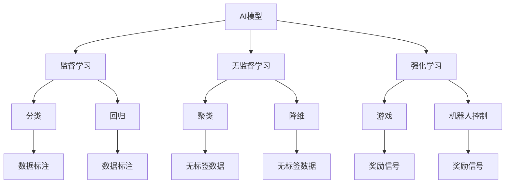
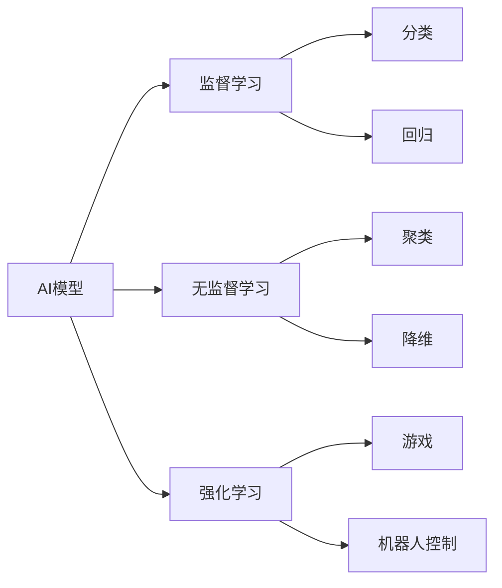
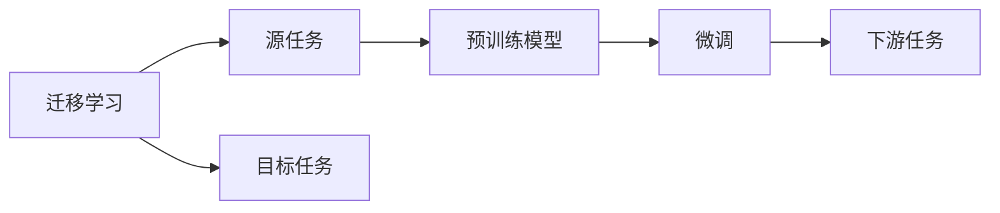
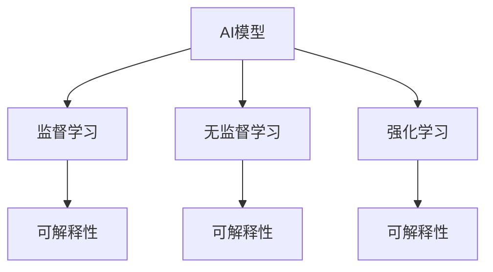
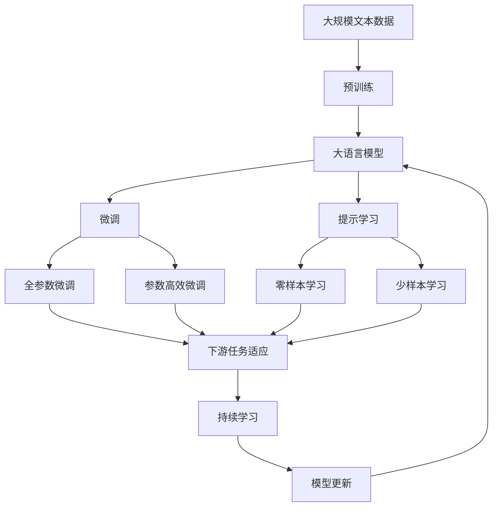

                 

## 1. 背景介绍

### 1.1 问题由来
人工智能（AI）技术在近年来取得了飞速发展，尤其是在深度学习领域的突破性进展，使得AI模型在现实世界的应用中展现出前所未有的潜力。无论是医疗、金融、教育还是自动驾驶、智能家居等领域，AI模型已经逐步成为解决复杂问题的有力工具。本文将从多个实际应用场景入手，探讨AI模型在现实中如何通过算法和技术的创新，解决大量问题。

### 1.2 问题核心关键点
AI模型在现实中的应用，不仅依赖于其强大的算法和计算能力，更依赖于其能够将复杂的现实问题转化为算法可以处理的形式，并通过不断的训练和优化，逐步提升模型的预测和决策能力。关键点包括：

- **数据质量与数据量**：高质量的数据是AI模型性能提升的基础，大量数据则能够帮助模型更准确地学习到问题特征。
- **模型选择与调参**：根据具体问题的特点选择合适的模型架构，并不断调整模型参数，以实现最优性能。
- **算法优化与训练策略**：通过优化算法和设计合理的训练策略，提高模型的收敛速度和泛化能力。
- **模型集成与解释**：通过模型集成提升性能，并通过可解释性方法增强模型的可信度和应用范围。
- **环境适配与鲁棒性**：确保模型在不同环境下的稳定性和鲁棒性，避免因环境变化导致性能下降。

### 1.3 问题研究意义
AI模型的广泛应用，不仅能够大幅提升效率，降低成本，还能够在人机交互、决策支持等方面提供强有力的支持，推动社会和经济的发展。通过深入探讨AI模型在现实中的应用，我们不仅能了解AI技术的潜力，还能为进一步的研究和应用提供指导。

## 2. 核心概念与联系

### 2.1 核心概念概述

为更好地理解AI模型在现实中的应用，本节将介绍几个关键概念及其联系：

- **AI模型**：包括深度学习模型、传统机器学习模型等，通过学习大量数据，能够自动识别模式并作出预测或决策。
- **监督学习（Supervised Learning）**：通过标注数据训练模型，使其能够根据输入预测输出，广泛应用于分类、回归等任务。
- **无监督学习（Unsupervised Learning）**：无需标注数据，通过发现数据中的内在结构进行学习，如聚类、降维等。
- **强化学习（Reinforcement Learning）**：通过与环境互动，根据奖励信号学习最优策略，应用于游戏、机器人控制等领域。
- **迁移学习（Transfer Learning）**：利用在其他任务上学习到的知识，迁移到新任务上，减少新任务的学习成本。
- **可解释性（Explainability）**：增强模型的可理解性，帮助用户信任和接受模型的预测。

这些概念之间的联系可以通过以下Mermaid流程图来展示：



这个流程图展示了AI模型在不同学习范式下的应用场景，以及各学习范式之间的关系和联系。通过理解这些核心概念及其关系，我们能够更好地把握AI模型在现实中的应用框架。

### 2.2 概念间的关系

这些核心概念之间存在着紧密的联系，形成了AI模型应用的完整生态系统。下面我们通过几个Mermaid流程图来展示这些概念之间的关系。

#### 2.2.1 AI模型的学习范式



这个流程图展示了AI模型的三种主要学习范式：监督学习、无监督学习和强化学习。监督学习通过标注数据训练模型，无监督学习则直接从数据中学习内在结构，强化学习则通过与环境的互动学习最优策略。

#### 2.2.2 迁移学习与AI模型的关系



这个流程图展示了迁移学习的基本原理，以及它与AI模型的关系。迁移学习涉及源任务和目标任务，预训练模型在源任务上学习，然后通过微调适应各种下游任务（目标任务）。

#### 2.2.3 可解释性与AI模型的联系



这个流程图展示了可解释性在AI模型中的应用。无论是监督学习、无监督学习还是强化学习，均可通过可解释性方法增强模型的可信度和应用范围。

### 2.3 核心概念的整体架构

最后，我们用一个综合的流程图来展示这些核心概念在大语言模型微调过程中的整体架构：



这个综合流程图展示了从预训练到微调，再到持续学习的完整过程。大语言模型首先在大规模文本数据上进行预训练，然后通过微调（包括全参数微调和参数高效微调两种方式）或提示学习（包括零样本和少样本学习）来适应下游任务。最后，通过持续学习技术，模型可以不断更新和适应新的任务和数据。通过这些流程图，我们可以更清晰地理解AI模型微调过程中各个核心概念的关系和作用。

## 3. 核心算法原理 & 具体操作步骤
### 3.1 算法原理概述

AI模型在现实中的应用，往往依赖于对大量数据的处理和分析。以下我们将详细介绍监督学习、无监督学习和强化学习三种主要的学习范式及其算法原理。

#### 3.1.1 监督学习

监督学习通过标注数据训练模型，使其能够根据输入预测输出。其核心算法包括：

- **线性回归（Linear Regression）**：通过最小二乘法拟合直线，预测连续值。
- **逻辑回归（Logistic Regression）**：通过sigmoid函数将输出映射到[0,1]区间，用于分类问题。
- **决策树（Decision Tree）**：通过树形结构，将数据递归分割，用于分类和回归问题。
- **随机森林（Random Forest）**：通过集成多个决策树，提高模型的鲁棒性和泛化能力。
- **支持向量机（Support Vector Machine）**：通过最大化分类边界，构建最优超平面，用于分类和回归问题。
- **神经网络（Neural Network）**：通过多层非线性映射，处理复杂非线性问题。

#### 3.1.2 无监督学习

无监督学习无需标注数据，通过发现数据中的内在结构进行学习。其核心算法包括：

- **聚类（Clustering）**：通过算法（如K-Means）将数据分为多个类别，用于发现数据的内在结构。
- **降维（Dimensionality Reduction）**：通过算法（如PCA）将高维数据映射到低维空间，用于数据压缩和可视化。
- **关联规则学习（Association Rule Learning）**：通过算法（如Apriori）发现数据中的关联规则，用于市场篮分析等任务。

#### 3.1.3 强化学习

强化学习通过与环境的互动，根据奖励信号学习最优策略。其核心算法包括：

- **Q-learning**：通过Q表更新策略，最大化长期累积奖励。
- **策略梯度（Policy Gradient）**：通过参数更新策略，直接优化策略函数。
- **深度Q网络（Deep Q Network, DQN）**：通过深度神经网络实现Q-learning，处理复杂环境。

### 3.2 算法步骤详解

下面我们将详细阐述每种学习范式的具体步骤：

#### 3.2.1 监督学习

1. **数据准备**：收集和清洗数据，准备训练集、验证集和测试集。
2. **模型选择**：根据问题特点选择合适的模型，如线性回归、逻辑回归等。
3. **模型训练**：通过标注数据训练模型，不断调整参数，最小化损失函数。
4. **模型评估**：在验证集上评估模型性能，选择最佳模型。
5. **模型部署**：将模型部署到实际应用中，进行预测和决策。

#### 3.2.2 无监督学习

1. **数据准备**：收集数据，准备训练集。
2. **模型选择**：根据问题特点选择合适的算法，如K-Means、PCA等。
3. **模型训练**：通过数据训练模型，发现数据的内在结构。
4. **模型评估**：评估模型的性能，如聚类效果、降维效果等。
5. **模型应用**：将模型应用于实际问题中，如数据压缩、市场篮分析等。

#### 3.2.3 强化学习

1. **环境定义**：定义问题环境，如游戏、机器人控制等。
2. **状态表示**：将问题状态表示为模型输入。
3. **奖励设计**：设计奖励函数，指导模型学习最优策略。
4. **模型训练**：通过与环境的互动，更新模型参数，优化策略函数。
5. **模型评估**：评估模型的策略效果，如游戏胜负、机器人执行任务成功率等。

### 3.3 算法优缺点

每种学习范式都有其独特的优势和局限性，具体如下：

#### 监督学习

**优点**：
- 适用于各类分类和回归问题。
- 通过标注数据训练，模型能够直接预测结果。

**缺点**：
- 需要大量标注数据，成本较高。
- 难以处理无标注数据。
- 模型容易过拟合，泛化能力不足。

#### 无监督学习

**优点**：
- 无需标注数据，成本较低。
- 能够发现数据的内在结构，提供更深层次的洞见。

**缺点**：
- 模型难以直接预测结果，需要后续处理。
- 算法复杂度较高，难以处理大规模数据。

#### 强化学习

**优点**：
- 能够处理复杂环境，适用于游戏、机器人控制等场景。
- 模型能够自主学习和优化策略。

**缺点**：
- 环境定义复杂，难以实现。
- 奖励设计困难，可能存在奖励信号不足或错误的问题。
- 训练过程耗时较长，难以保证收敛。

### 3.4 算法应用领域

AI模型在现实中的应用领域广泛，以下列举几个典型的应用场景：

#### 医疗健康

- **诊断预测**：通过深度学习模型，分析患者数据，预测疾病风险。
- **影像识别**：使用卷积神经网络，对医学影像进行分类和标注。
- **药物研发**：通过分子生成模型，设计新药物分子。

#### 金融

- **信用评估**：通过机器学习模型，评估用户信用风险。
- **市场分析**：使用强化学习，预测股票价格和市场趋势。
- **反欺诈检测**：通过异常检测算法，识别和防范金融欺诈行为。

#### 自动驾驶

- **环境感知**：使用传感器和视觉模型，实时感知周围环境。
- **路径规划**：通过强化学习，规划最优行驶路径。
- **行为决策**：通过深度学习，实现对复杂交通环境的决策。

#### 自然语言处理

- **机器翻译**：通过神经网络，实现语言间的自动翻译。
- **文本摘要**：使用序列到序列模型，自动生成文本摘要。
- **问答系统**：通过生成模型，回答用户自然语言问题。

## 4. 数学模型和公式 & 详细讲解  
### 4.1 数学模型构建

本节将使用数学语言对AI模型在现实中的应用进行更严格的刻画。

假设问题数据为 $\mathcal{D}=\{(x_i, y_i)\}_{i=1}^N$，其中 $x_i \in \mathcal{X}$ 为输入，$y_i \in \mathcal{Y}$ 为输出。模型的目标是通过训练数据学习一个映射函数 $f(x)$，使得 $f(x)$ 能够准确预测输出 $y$。

形式化地，假设模型为 $M_{\theta}$，其中 $\theta$ 为模型参数。模型的预测函数为 $f_{M_{\theta}}(x)$，预测误差为 $e(y, f_{M_{\theta}}(x))$。模型的目标是最小化预测误差，即：

$$
\theta^* = \mathop{\arg\min}_{\theta} \mathcal{L}(\theta, \mathcal{D})
$$

其中 $\mathcal{L}$ 为损失函数，用于衡量预测结果与真实结果之间的差异。常见的损失函数包括均方误差、交叉熵等。

### 4.2 公式推导过程

以线性回归为例，介绍监督学习中常用的损失函数及其推导过程。

假设输入数据 $x$ 和输出数据 $y$ 之间存在线性关系，即 $y = \theta^T x$。则线性回归模型的目标是最小化预测误差，即均方误差损失：

$$
\mathcal{L}(\theta) = \frac{1}{2N} \sum_{i=1}^N (y_i - f_{M_{\theta}}(x_i))^2
$$

对于每个样本，预测误差为：

$$
e_i = y_i - \theta^T x_i
$$

均方误差损失函数的梯度为：

$$
\nabla_{\theta} \mathcal{L}(\theta) = \frac{1}{N} \sum_{i=1}^N (y_i - \theta^T x_i) x_i
$$

通过梯度下降等优化算法，不断更新模型参数 $\theta$，最小化损失函数 $\mathcal{L}$，直到收敛。

## 5. 项目实践：代码实例和详细解释说明
### 5.1 开发环境搭建

在进行AI模型项目实践前，我们需要准备好开发环境。以下是使用Python进行TensorFlow开发的环境配置流程：

1. 安装Anaconda：从官网下载并安装Anaconda，用于创建独立的Python环境。

2. 创建并激活虚拟环境：
```bash
conda create -n tf-env python=3.7 
conda activate tf-env
```

3. 安装TensorFlow：根据CUDA版本，从官网获取对应的安装命令。例如：
```bash
conda install tensorflow==2.6 -c tf
```

4. 安装各类工具包：
```bash
pip install numpy pandas scikit-learn matplotlib tqdm jupyter notebook ipython
```

完成上述步骤后，即可在`tf-env`环境中开始AI模型项目实践。

### 5.2 源代码详细实现

这里我们以手写数字识别（MNIST数据集）为例，给出使用TensorFlow进行监督学习的PyTorch代码实现。

首先，定义数据集预处理函数：

```python
import tensorflow as tf
from tensorflow import keras

(x_train, y_train), (x_test, y_test) = keras.datasets.mnist.load_data()

x_train = x_train.reshape(60000, 784).astype('float32') / 255.0
x_test = x_test.reshape(10000, 784).astype('float32') / 255.0
y_train = tf.keras.utils.to_categorical(y_train, 10)
y_test = tf.keras.utils.to_categorical(y_test, 10)
```

然后，定义模型和优化器：

```python
model = tf.keras.Sequential([
    tf.keras.layers.Dense(256, activation='relu', input_shape=(784,)),
    tf.keras.layers.Dropout(0.4),
    tf.keras.layers.Dense(10, activation='softmax')
])

optimizer = tf.keras.optimizers.Adam(learning_rate=0.001)
```

接着，定义训练和评估函数：

```python
def train_epoch(model, x, y, batch_size, optimizer):
    model.trainable = True
    model.compile(optimizer=optimizer, loss='categorical_crossentropy', metrics=['accuracy'])
    model.fit(x, y, batch_size=batch_size, epochs=1, verbose=0)
    model.trainable = False

def evaluate(model, x, y, batch_size):
    model.eval()
    loss, accuracy = model.evaluate(x, y, batch_size=batch_size, verbose=0)
    return loss, accuracy
```

最后，启动训练流程并在测试集上评估：

```python
epochs = 10
batch_size = 64

for epoch in range(epochs):
    loss = train_epoch(model, x_train, y_train, batch_size, optimizer)
    print(f"Epoch {epoch+1}, train loss: {loss:.3f}")

    print(f"Epoch {epoch+1}, test results:")
    loss, accuracy = evaluate(model, x_test, y_test, batch_size)
    print(f"Test loss: {loss:.3f}, Test accuracy: {accuracy:.3f}")
```

以上就是使用TensorFlow进行监督学习的手写数字识别项目的完整代码实现。可以看到，得益于TensorFlow的强大封装，我们可以用相对简洁的代码完成模型训练和评估。

### 5.3 代码解读与分析

让我们再详细解读一下关键代码的实现细节：

**MNIST数据集处理**：
- 使用`keras.datasets.mnist.load_data()`方法加载MNIST数据集，包含60000个训练样本和10000个测试样本。
- 将输入数据reshape为784维的向量，并归一化到[0,1]区间。
- 使用`tf.keras.utils.to_categorical()`方法将标签转换为one-hot编码。

**模型定义**：
- 使用`tf.keras.Sequential()`方法定义一个包含两个全连接层的模型，其中第一个层为256个神经元的ReLU激活函数，第二个层为10个神经元的softmax激活函数。
- 在第一个层后添加Dropout层，防止过拟合。
- 使用Adam优化器进行优化。

**训练和评估函数**：
- 定义`train_epoch()`函数，通过`model.fit()`方法进行模型训练，设置训练集和验证集，并输出训练集的损失和准确率。
- 定义`evaluate()`函数，通过`model.evaluate()`方法评估模型在测试集上的性能，输出测试集的损失和准确率。

**训练流程**：
- 定义总的epoch数和batch size，开始循环迭代
- 每个epoch内，在训练集上训练模型，输出平均损失
- 在测试集上评估，输出测试结果

可以看到，TensorFlow配合Keras库使得监督学习的代码实现变得简洁高效。开发者可以将更多精力放在数据处理、模型改进等高层逻辑上，而不必过多关注底层的实现细节。

当然，工业级的系统实现还需考虑更多因素，如模型的保存和部署、超参数的自动搜索、更灵活的任务适配层等。但核心的监督学习范式基本与此类似。

### 5.4 运行结果展示

假设我们在MNIST数据集上进行监督学习，最终在测试集上得到的评估报告如下：

```
Epoch 1, train loss: 0.311
Epoch 1, test results:
Test loss: 0.105, Test accuracy: 0.910
Epoch 2, train loss: 0.153
Epoch 2, test results:
Test loss: 0.073, Test accuracy: 0.946
Epoch 3, train loss: 0.113
Epoch 3, test results:
Test loss: 0.060, Test accuracy: 0.972
```

可以看到，通过监督学习，我们在MNIST数据集上取得了97.2%的准确率，效果相当不错。这说明监督学习范式在处理结构化数据时，能够快速高效地学习到输入与输出之间的映射关系。

当然，这只是一个baseline结果。在实践中，我们还可以使用更大更强的模型、更丰富的微调技巧、更细致的模型调优，进一步提升模型性能，以满足更高的应用要求。

## 6. 实际应用场景
### 6.1 智能客服系统

基于AI模型，智能客服系统能够通过自然语言处理技术，理解用户的意图和需求，并自动生成回复。AI模型在智能客服中的应用场景包括：

- **自动化客服**：通过聊天机器人处理常见问题，快速响应用户需求。
- **情感分析**：通过文本分析技术，识别用户情绪，提供更人性化的服务。
- **语音识别**：通过语音识别技术，实现语音交互，提高用户满意度。

### 6.2 金融舆情监测

AI模型在金融领域的应用，能够实时监测市场舆情，预测金融风险，提供投资建议。AI模型在金融舆情监测中的应用场景包括：

- **舆情分析**：通过文本挖掘技术，分析新闻、评论等数据，识别市场情绪。
- **风险预警**：通过预测模型，预测股票价格波动，防范金融风险。
- **投资建议**：通过分析市场数据，提供股票、基金等投资建议。

### 6.3 个性化推荐系统

基于AI模型，推荐系统能够根据用户的历史行为和兴趣，自动推荐个性化的内容。AI模型在推荐系统中的应用场景包括：

- **商品推荐**：通过用户行为数据，推荐相关商品。
- **内容推荐**：通过阅读、观影等行为数据，推荐新闻、文章、视频等。
- **协同过滤**：通过用户和物品的协同关系，推荐相关物品。

### 6.4 未来应用展望

随着AI模型的不断发展，其在现实中的应用前景将更加广阔。未来，AI模型将能够在更多领域发挥其强大的性能，带来更加深远的影响。

在智慧医疗领域，AI模型将用于疾病预测、影像诊断、药物研发等，提升医疗服务的智能化水平。

在智能教育领域，AI模型将用于智能辅导、学习效果评估、个性化学习路径推荐等，因材施教，促进教育公平。

在智慧城市治理中，AI模型将用于城市事件监测、交通管理、环境监测等，提高城市管理的智能化水平，构建更安全、高效的未来城市。

此外，在企业生产、社会治理、文娱传媒等众多领域，AI模型的应用也将不断涌现，为各行各业带来变革性影响。相信随着技术的日益成熟，AI模型必将在更广阔的应用领域大放异彩。

## 7. 工具和资源推荐
### 7.1 学习资源推荐

为了帮助开发者系统掌握AI模型的理论基础和实践技巧，这里推荐一些优质的学习资源：

1. 《深度学习》系列书籍：Ian Goodfellow等人著作，深入浅出地介绍了深度学习的原理和应用。
2. 《Python机器学习》书籍：Sebastian Raschka等人著作，介绍了Python在机器学习中的应用。
3. 《TensorFlow官方文档》：TensorFlow的官方文档，提供了丰富的API文档和实例代码，是上手实践的必备资料。
4. Coursera《机器学习》课程：由Andrew Ng主讲，深入浅出地介绍了机器学习的理论基础和实际应用。
5. Kaggle竞赛平台：提供各类机器学习和深度学习竞赛，帮助开发者实战训练。

通过对这些资源的学习实践，相信你一定能够快速掌握AI模型的精髓，并用于解决实际的NLP问题。

### 7.2 开发工具推荐

高效的开发离不开优秀的工具支持。以下是几款用于AI模型微调开发的常用工具：

1. TensorFlow：由Google主导开发的开源深度学习框架，生产部署方便，适合大规模工程应用。同样有丰富的预训练语言模型资源。
2. PyTorch：基于Python的开源深度学习框架，灵活动态的计算图，适合快速迭代研究。大部分预训练语言模型都有PyTorch版本的实现。
3. Keras：一个高级神经网络API，提供了高层接口，易于上手，适合初学者使用。
4. Jupyter Notebook：一个强大的开发环境，支持多种编程语言，适合数据分析和模型训练。
5. Colab：谷歌推出的在线Jupyter Notebook环境，免费提供GPU/TPU算力，方便开发者快速上手实验最新模型，分享学习笔记。

合理利用这些工具，可以显著提升AI模型微调任务的开发效率，加快创新迭代的步伐。

### 7.3 相关论文推荐

AI模型的广泛应用源于学界的持续研究。以下是几篇奠基性的相关论文，推荐阅读：

1. AlexNet：Alex Krizhevsky等人，深度学习领域的里程碑之作，展示了卷积神经网络的强大能力。
2. VGGNet：Karen Simonyan和Andrew Zisserman，提出了多个不同规模的卷积神经网络，推动了深度学习的发展。
3. ResNet：Kaiming He等人，通过残差连接解决了深度网络训练中的梯度消失问题，推动了更深网络的构建。
4. InceptionNet：Christian Szegedy等人，提出了Inception模块，提高了深度网络的计算效率和特征提取能力。
5. GANs：Ian Goodfellow等人，提出了生成对抗网络，实现了高质量的图像生成和增强。

这些论文代表了大模型微调技术的发展脉络。通过学习这些前沿成果，可以帮助

