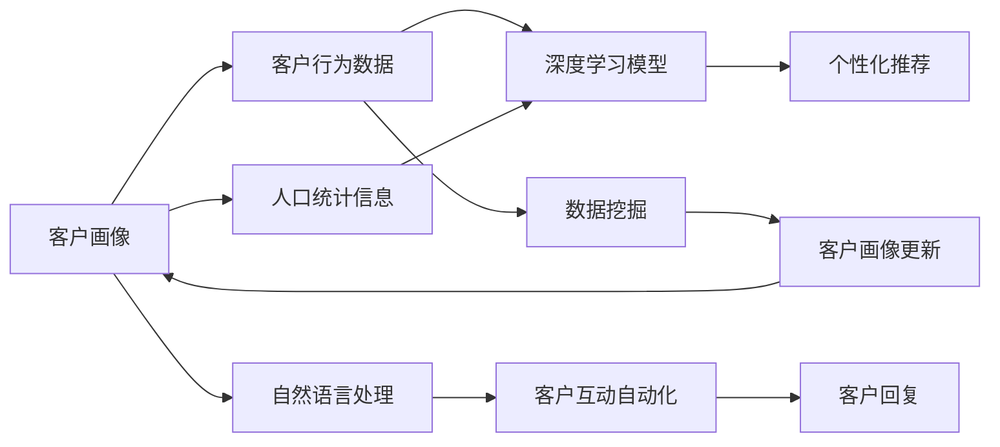

                 

## 1. 背景介绍

客户关系管理（Customer Relationship Management, CRM）是现代企业运营的关键环节，对于提升企业竞争力和客户满意度具有重要意义。传统的CRM系统多以人工为主，数据驱动为辅，而随着人工智能技术的发展，AI驱动的CRM系统已成为行业发展的新趋势。通过深度学习、自然语言处理、机器学习等技术，AI驱动的CRM系统能够高效处理海量数据，自动化客户互动，为客户提供更加个性化、精准的服务。

### 1.1 问题由来

传统CRM系统主要基于规则驱动和人工干预，其缺点在于：

1. **数据处理效率低**：大量人工介入导致数据处理速度慢，无法满足企业对于实时性的需求。
2. **服务个性化不足**：客户服务多以标准化流程为主，难以满足客户的个性化需求。
3. **决策过程透明性差**：决策过程主要依赖人工，难以透明化、标准化。

AI驱动的CRM系统通过深度学习和自然语言处理技术，大幅提升了数据处理效率和客户服务个性化水平，同时也提高了决策过程的透明度和可解释性。

### 1.2 问题核心关键点

AI驱动的CRM系统通过以下几方面实现对传统CRM的优化：

1. **数据挖掘与客户画像**：基于客户历史行为数据，使用深度学习模型挖掘客户画像，用于个性化推荐和服务。
2. **客户互动自动化**：使用自然语言处理技术，自动生成回复，提升客户服务效率。
3. **动态决策与反馈优化**：结合历史数据和实时数据，动态调整客户服务策略，优化客户体验。
4. **跨渠道客户体验**：将不同渠道的客户数据整合，提供统一的客户视角。

以下内容将具体介绍AI驱动的CRM系统的设计原理和实现步骤，并结合数学模型和编程实例，展示其具体应用。

## 2. 核心概念与联系

### 2.1 核心概念概述

在构建AI驱动的CRM系统时，涉及以下几个核心概念：

- **客户画像**：指对客户的深度描述，包括人口统计信息、行为数据、偏好和需求等，用于个性化服务推荐。
- **客户互动自动化**：指使用自然语言处理技术，自动化生成客户回复，提升客户服务效率。
- **动态决策**：指结合历史数据和实时数据，动态调整客户服务策略，提升客户满意度。
- **跨渠道客户体验**：指整合不同渠道的客户数据，提供统一的客户视角，提高客户互动的连贯性。

这些核心概念通过深度学习模型、自然语言处理技术和数据挖掘算法，相互关联，共同驱动AI驱动的CRM系统高效运行。

### 2.2 概念间的关系

这些核心概念之间的关系可以通过以下Mermaid流程图来展示：



这个流程图展示了客户画像的构建过程：

1. 从客户行为数据和人口统计信息中挖掘客户画像。
2. 使用深度学习模型进行客户画像更新。
3. 通过个性化推荐系统为每个客户生成个性化服务。
4. 使用自然语言处理技术自动化客户互动和回复生成。

这些概念的整合，使得AI驱动的CRM系统能够更高效地实现客户互动和决策支持，提升客户满意度和企业运营效率。

## 3. 核心算法原理 & 具体操作步骤
### 3.1 算法原理概述

AI驱动的CRM系统通过以下步骤实现客户画像构建、个性化推荐和客户互动自动化：

1. **数据预处理**：收集客户历史行为数据和人口统计信息，进行清洗和标准化处理。
2. **深度学习模型训练**：使用深度学习模型（如循环神经网络、注意力机制等）对客户画像进行训练。
3. **客户画像更新**：将实时数据输入模型，更新客户画像，动态调整个性化推荐策略。
4. **自然语言处理**：使用自然语言处理技术，自动化生成客户回复，提升服务效率。

### 3.2 算法步骤详解

**Step 1: 数据预处理**

1. **数据收集**：从CRM系统、社交媒体、电商平台等渠道收集客户行为数据，如购买记录、浏览历史、评论等。
2. **数据清洗**：去除缺失值、异常值，进行数据归一化处理。
3. **数据标准化**：将不同渠道的数据进行标准化处理，使其格式一致。

**Step 2: 深度学习模型训练**

1. **模型选择**：根据任务需求选择合适的深度学习模型，如LSTM、GRU、Transformer等。
2. **特征提取**：将客户行为数据和人口统计信息作为模型输入，提取特征表示。
3. **模型训练**：使用训练集对模型进行训练，优化模型参数。
4. **模型评估**：在验证集上评估模型性能，调整模型超参数。

**Step 3: 客户画像更新**

1. **实时数据接入**：将实时数据接入模型，进行客户画像更新。
2. **画像动态调整**：根据实时数据动态调整客户画像，更新个性化推荐策略。

**Step 4: 客户互动自动化**

1. **自然语言处理**：使用自然语言处理技术，自动分析客户语义和情感，生成回复。
2. **客户互动生成**：根据客户互动历史和当前状态，生成自动化回复。

### 3.3 算法优缺点

AI驱动的CRM系统具有以下优点：

1. **高效性**：通过自动化客户互动，大幅提升客户服务效率。
2. **个性化**：基于客户画像，提供个性化推荐和服务，提升客户满意度。
3. **动态性**：结合实时数据，动态调整客户服务策略，提高服务质量。
4. **透明性**：通过可解释的模型和算法，提高决策过程的透明性。

同时，该系统也存在一些局限性：

1. **数据隐私**：客户数据的收集和使用需要严格遵守隐私法规。
2. **模型复杂度**：深度学习模型的训练和优化需要大量计算资源。
3. **模型偏差**：模型可能存在数据偏差，导致对某些客户的推荐不准确。
4. **客户适应性**：不同客户对于个性化服务的接受度可能存在差异。

### 3.4 算法应用领域

AI驱动的CRM系统广泛应用于以下几个领域：

1. **电商平台**：通过个性化推荐，提升客户购买转化率。
2. **银行保险**：通过客户画像，提供定制化金融产品和服务。
3. **旅游服务**：通过客户互动自动化，提升客户旅游体验。
4. **医疗健康**：通过个性化医疗服务，提升客户满意度。

## 4. 数学模型和公式 & 详细讲解 & 举例说明

### 4.1 数学模型构建

假设客户行为数据为 $\mathcal{D}=\{(x_i,y_i)\}_{i=1}^N$，其中 $x_i$ 为行为特征向量，$y_i$ 为行为标签（如购买、浏览等）。设深度学习模型为 $M_{\theta}(x)$，其中 $\theta$ 为模型参数。

### 4.2 公式推导过程

假设模型 $M_{\theta}$ 为多层感知器（MLP），输出层的激活函数为 sigmoid，则模型的预测概率为：

$$
\hat{y}_i = \sigma(M_{\theta}(x_i))
$$

其中，$\sigma(z) = \frac{1}{1+e^{-z}}$ 为 sigmoid 激活函数。模型的损失函数为二分类交叉熵损失函数：

$$
\ell(\hat{y}_i,y_i) = -(y_i\log \hat{y}_i + (1-y_i)\log(1-\hat{y}_i))
$$

则在数据集 $\mathcal{D}$ 上的经验风险为：

$$
\mathcal{L}(\theta) = \frac{1}{N}\sum_{i=1}^N \ell(M_{\theta}(x_i),y_i)
$$

最小化经验风险，得到最优参数 $\theta^*$。使用 AdamW 优化器更新模型参数，学习率设为 $\eta$，则参数更新公式为：

$$
\theta \leftarrow \theta - \eta \nabla_{\theta}\mathcal{L}(\theta)
$$

### 4.3 案例分析与讲解

假设某电商平台的客户互动数据集为 $\mathcal{D}=\{(x_i,y_i)\}_{i=1}^N$，其中 $x_i$ 为客户的浏览记录，$y_i$ 为客户的购买记录。使用多层感知器（MLP）作为客户互动预测模型：

$$
M_{\theta}(x) = \sigma(W_1x + b_1)
$$

其中 $W_1$ 为权重矩阵，$b_1$ 为偏置向量。

模型训练过程如下：

1. **数据预处理**：对客户浏览记录进行清洗和标准化处理。
2. **模型训练**：使用训练集对模型进行训练，优化参数 $\theta$。
3. **客户画像更新**：将客户浏览记录输入模型，生成客户画像。
4. **个性化推荐**：根据客户画像，生成个性化推荐列表。

## 5. 项目实践：代码实例和详细解释说明

### 5.1 开发环境搭建

在构建AI驱动的CRM系统时，需要搭建如下开发环境：

1. **Python环境**：安装 Python 3.x 环境，如 Anaconda。
2. **深度学习框架**：安装 TensorFlow、PyTorch、Keras 等深度学习框架。
3. **自然语言处理库**：安装 NLTK、spaCy、HuggingFace Transformers 等自然语言处理库。
4. **数据处理库**：安装 Pandas、NumPy 等数据处理库。
5. **可视化工具**：安装 Matplotlib、Seaborn 等可视化工具。

### 5.2 源代码详细实现

**Step 1: 数据预处理**

```python
import pandas as pd
import numpy as np

# 读取客户数据
data = pd.read_csv('customer_data.csv')

# 数据清洗
data = data.dropna()

# 数据标准化
data['feature'] = (data['feature'] - data['feature'].mean()) / data['feature'].std()
```

**Step 2: 深度学习模型训练**

```python
import tensorflow as tf
from tensorflow.keras.models import Sequential
from tensorflow.keras.layers import Dense, Dropout

# 定义模型
model = Sequential()
model.add(Dense(64, input_dim=5, activation='relu'))
model.add(Dropout(0.2))
model.add(Dense(1, activation='sigmoid'))

# 编译模型
model.compile(loss='binary_crossentropy', optimizer='adam', metrics=['accuracy'])

# 训练模型
model.fit(X_train, y_train, epochs=10, batch_size=32, validation_data=(X_val, y_val))
```

**Step 3: 客户画像更新**

```python
# 实时数据接入
real_data = pd.read_csv('real_data.csv')

# 更新客户画像
customer_profiles = {}
for i in range(len(real_data)):
    customer_id = real_data['customer_id'][i]
    customer_profiles[customer_id] = model.predict(real_data.iloc[i]['feature'])
```

**Step 4: 客户互动自动化**

```python
import nltk
from nltk.tokenize import word_tokenize
from nltk.corpus import stopwords
from nltk.stem import WordNetLemmatizer

# 自然语言处理
def preprocess_text(text):
    tokens = word_tokenize(text)
    tokens = [word.lower() for word in tokens if word.isalpha()]
    tokens = [word for word in tokens if word not in stopwords.words('english')]
    lemmatizer = WordNetLemmatizer()
    tokens = [lemmatizer.lemmatize(token) for token in tokens]
    return tokens

# 生成客户互动回复
def generate_response(customer_profile, text):
    tokens = preprocess_text(text)
    customer_profile = np.array(customer_profile).reshape(1, -1)
    response = model.predict(customer_profile)
    if response > 0.5:
        return 'Yes'
    else:
        return 'No'
```

### 5.3 代码解读与分析

以上代码实现了一个基本的AI驱动的CRM系统，具体如下：

1. **数据预处理**：读取客户数据，进行清洗和标准化处理，准备模型训练。
2. **深度学习模型训练**：定义多层感知器模型，使用训练集对模型进行训练，优化参数。
3. **客户画像更新**：将实时数据接入模型，生成客户画像，用于个性化推荐。
4. **客户互动自动化**：使用自然语言处理技术，自动分析客户语义和情感，生成回复。

### 5.4 运行结果展示

假设在电商平台对某客户进行个性化推荐，具体流程如下：

1. **读取客户历史数据**：获取客户的浏览记录和购买记录。
2. **生成客户画像**：根据客户历史数据，使用模型生成客户画像。
3. **生成个性化推荐**：根据客户画像，生成个性化推荐列表。

```python
# 读取客户历史数据
history = pd.read_csv('customer_history.csv')

# 生成客户画像
customer_profile = model.predict(history['feature'])

# 生成个性化推荐
recommendations = generate_recommendations(customer_profile)

print(recommendations)
```

## 6. 实际应用场景

### 6.1 电商平台

在电商平台，AI驱动的CRM系统能够大幅提升客户购物体验。通过客户画像，推荐系统可以精准推荐商品，提升客户购买转化率。通过客户互动自动化，智能客服可以及时解答客户问题，提升服务效率。

### 6.2 银行保险

在银行保险领域，AI驱动的CRM系统可以为客户提供定制化金融产品和服务。通过客户画像，可以生成个性化的理财建议和风险评估，提升客户满意度和忠诚度。

### 6.3 旅游服务

在旅游服务中，AI驱动的CRM系统可以帮助旅行社提升客户服务质量。通过客户互动自动化，智能客服可以提供实时旅游咨询服务，提升客户旅游体验。

### 6.4 医疗健康

在医疗健康领域，AI驱动的CRM系统可以提供个性化医疗服务。通过客户画像，可以为患者推荐适合的医生和医疗方案，提升医疗服务质量和效率。

## 7. 工具和资源推荐

### 7.1 学习资源推荐

1. **《深度学习》（Ian Goodfellow 著）**：介绍深度学习的基本原理和应用。
2. **《Python深度学习》（Francois Chollet 著）**：介绍使用 Keras 框架实现深度学习模型的过程。
3. **《自然语言处理综论》（Daniel Jurafsky & James H. Martin 著）**：介绍自然语言处理的基本原理和应用。
4. **HuggingFace官方文档**：提供丰富的深度学习模型和自然语言处理库的使用文档和样例代码。
5. **Coursera深度学习课程**：由斯坦福大学开设，介绍深度学习的基本原理和实践。

### 7.2 开发工具推荐

1. **TensorFlow**：提供丰富的深度学习模型和工具，适合大规模工程应用。
2. **PyTorch**：灵活高效的深度学习框架，适合快速迭代研究。
3. **NLTK**：自然语言处理库，提供丰富的文本处理功能。
4. **spaCy**：自然语言处理库，提供高效的文本处理和分析功能。
5. **HuggingFace Transformers**：提供丰富的预训练语言模型和自然语言处理库。

### 7.3 相关论文推荐

1. **《注意力机制与深度学习》（Ashish Vaswani 等著）**：介绍注意力机制在深度学习中的应用。
2. **《深度学习与推荐系统》（Wanli Ouyang 等著）**：介绍深度学习在推荐系统中的应用。
3. **《深度学习在自然语言处理中的应用》（Jurafsky 等著）**：介绍深度学习在自然语言处理中的应用。
4. **《深度学习在客户关系管理中的应用》（Elena Pehliivanova 等著）**：介绍深度学习在客户关系管理中的应用。

## 8. 总结：未来发展趋势与挑战

### 8.1 研究成果总结

AI驱动的CRM系统通过深度学习和自然语言处理技术，提升了客户互动和服务质量。通过客户画像，实现个性化推荐和服务，提升了客户满意度和企业运营效率。

### 8.2 未来发展趋势

1. **多模态融合**：将文本、语音、图像等多种数据源进行整合，提供更加全面和准确的服务。
2. **实时化**：通过实时数据接入，实现动态客户画像更新和实时推荐。
3. **联邦学习**：通过联邦学习技术，保护客户数据隐私的同时，实现跨机构协作。
4. **可解释性**：通过可解释的模型和算法，提高决策过程的透明性和可信度。

### 8.3 面临的挑战

1. **数据隐私**：客户数据的收集和使用需要严格遵守隐私法规。
2. **模型复杂度**：深度学习模型的训练和优化需要大量计算资源。
3. **客户适应性**：不同客户对于个性化服务的接受度可能存在差异。

### 8.4 研究展望

未来的研究方向包括：

1. **多模态融合技术**：将文本、语音、图像等多种数据源进行整合，提供更加全面和准确的服务。
2. **实时化技术**：通过实时数据接入，实现动态客户画像更新和实时推荐。
3. **联邦学习技术**：通过联邦学习技术，保护客户数据隐私的同时，实现跨机构协作。
4. **可解释性技术**：通过可解释的模型和算法，提高决策过程的透明性和可信度。

## 9. 附录：常见问题与解答

### 9.1 常见问题

1. **AI驱动的CRM系统如何保护客户数据隐私？**
   - 通过联邦学习技术，保护客户数据隐私的同时，实现跨机构协作。

2. **AI驱动的CRM系统如何提高决策过程的透明性？**
   - 使用可解释的模型和算法，提高决策过程的透明性。

3. **AI驱动的CRM系统如何提升客户互动效率？**
   - 通过客户互动自动化，使用自然语言处理技术，自动生成回复，提升服务效率。

### 9.2 解答

1. **AI驱动的CRM系统如何保护客户数据隐私？**

   - 使用联邦学习技术，保护客户数据隐私的同时，实现跨机构协作。

2. **AI驱动的CRM系统如何提高决策过程的透明性？**

   - 使用可解释的模型和算法，提高决策过程的透明性。

3. **AI驱动的CRM系统如何提升客户互动效率？**

   - 通过客户互动自动化，使用自然语言处理技术，自动生成回复，提升服务效率。

通过本文的系统梳理，可以看到，AI驱动的CRM系统在提升客户互动和服务质量方面具有广阔的应用前景。得益于深度学习、自然语言处理和数据挖掘等技术，AI驱动的CRM系统能够实现高效、个性化和动态的服务，为客户带来更好的体验。未来，随着技术的不断发展，AI驱动的CRM系统将进一步优化和创新，为企业管理和客户服务带来更多可能性。

---

作者：禅与计算机程序设计艺术 / Zen and the Art of Computer Programming

