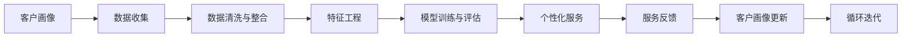
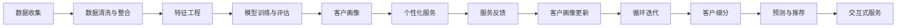

                 

# AI驱动的客户画像与个性化服务

> 关键词：AI、客户画像、个性化服务、机器学习、深度学习、数据挖掘、客户细分、预测模型、推荐系统、交互式服务、CRM系统、大数据技术

## 1. 背景介绍

在数字化时代，企业之间的竞争愈发激烈，客户体验成为品牌价值的重要组成部分。如何通过数据和技术手段，深入了解客户需求，提供个性化服务，是每一个企业面临的重大挑战。AI技术的快速发展，尤其是机器学习和深度学习技术的普及，使得客户画像与个性化服务的构建成为可能。本文将探讨基于AI的客户画像构建和个性化服务方案，剖析其在实际应用中的实现路径、技术细节和应用效果，为企业的客户管理提供有力的支持。

### 1.1 问题由来

随着互联网和移动设备的普及，客户产生了大量的在线行为数据，如浏览记录、购买记录、社交媒体互动等。如何从这些海量数据中挖掘出有价值的客户信息，构建出详细的客户画像，并进行精准的个性化服务，成为各大企业亟需解决的问题。传统的客户画像构建方法，如问卷调查、用户访谈等，存在数据获取困难、时效性差、成本高等缺点，难以满足现代商业环境的需求。相比之下，基于AI的客户画像构建方法，具有数据处理速度快、分析深度大、应用场景广等优势，能够更加高效、精确地刻画客户特征，提供个性化的服务体验。

### 1.2 问题核心关键点

客户画像的构建，本质上是对客户行为的建模和分析，目标是获得关于客户的全面、准确的信息，从而制定更有针对性的营销策略和服务方案。其核心关键点包括：

- 数据收集：从多渠道、多设备收集客户行为数据，如网站访问、移动应用使用、社交媒体互动等。
- 数据清洗与整合：处理缺失数据、异常值，整合多来源数据，形成统一的数据集。
- 特征工程：根据业务需求，提取和构造有意义的客户特征，如兴趣标签、消费习惯、地理位置等。
- 模型训练与评估：使用机器学习模型，如决策树、随机森林、神经网络等，对客户特征进行建模和预测。
- 画像展示与应用：通过可视化工具和API接口，将客户画像结果展示给业务人员，并提供定制化服务方案。

### 1.3 问题研究意义

构建基于AI的客户画像，对提升客户满意度、优化营销策略、增加客户粘性等方面具有重要意义：

1. 精准营销：通过深入了解客户需求和行为，制定个性化营销策略，提高营销活动的效果和回报率。
2. 客户细分：对客户进行多维度的分类，进行分群管理，实现差异化的服务策略。
3. 风险控制：通过预测客户流失、欺诈等风险，提前采取措施，降低潜在损失。
4. 决策支持：提供详尽的客户数据分析报告，辅助业务决策，提升运营效率。
5. 客户忠诚度提升：通过提供定制化、高品质的服务，增加客户满意度和忠诚度，减少流失率。

## 2. 核心概念与联系

### 2.1 核心概念概述

客户画像(Customer Persona)是通过收集和分析客户的多种数据，构建出客户的详细描述，包含其行为特征、偏好、需求等信息，用于指导企业制定相应的营销策略和服务方案。而个性化服务(Personalized Service)则是根据客户画像，提供定制化的服务内容，满足客户的多样化需求，提升客户满意度和体验。

AI技术在客户画像与个性化服务中的应用，主要体现在以下几个方面：

- 数据处理与分析：使用机器学习算法，从原始数据中提取出有价值的信息。
- 客户建模：构建客户画像，刻画客户的详细特征和行为模式。
- 预测与推荐：通过预测模型，预测客户行为和需求，提供个性化的产品推荐。
- 交互式服务：使用自然语言处理、智能推荐等技术，提升客户互动体验。
- 客户行为分析：分析客户行为数据，进行细分和分类，识别潜在客户。

### 2.2 概念间的关系

客户画像与个性化服务的关系密切，相互依存。客户画像提供了客户详细的特征信息，为个性化服务提供了数据基础。而个性化服务则通过精确刻画客户需求，不断迭代和优化客户画像，形成一个良性的循环。

通过Mermaid流程图展示两者的关系：



### 2.3 核心概念的整体架构

客户画像与个性化服务的整体架构可以分为数据收集、数据处理、客户建模、预测与推荐、交互式服务五个主要部分。以下是一个综合性的流程图：



## 3. 核心算法原理 & 具体操作步骤

### 3.1 算法原理概述

基于AI的客户画像与个性化服务的构建，主要基于机器学习和大数据技术。其核心算法包括数据处理、客户建模、预测与推荐等。

客户建模部分的核心算法是聚类算法和分类算法。聚类算法用于将客户分为不同的群体，分类算法用于预测客户行为和需求。常用的聚类算法有K-Means、层次聚类、DBSCAN等，分类算法包括决策树、随机森林、支持向量机等。

预测与推荐部分的核心算法是协同过滤和神经网络。协同过滤算法基于用户行为数据，推荐相似用户喜欢的商品。神经网络则通过学习用户数据，预测用户的行为和偏好。常用的神经网络有卷积神经网络(CNN)、循环神经网络(RNN)、长短期记忆网络(LSTM)等。

### 3.2 算法步骤详解

#### 3.2.1 数据收集

数据收集是客户画像构建的基础，涉及多个渠道和设备的数据收集。包括：

- 网站和移动应用：通过追踪点击、停留时间、页面转换等行为数据，获取客户的访问记录。
- 社交媒体：通过分析用户的点赞、评论、分享等互动数据，了解客户的兴趣和社交网络。
- 电商平台：通过分析用户的购买记录、浏览记录、收藏记录等，了解客户的消费习惯和偏好。
- 客户反馈：通过电话、邮件、在线调查等方式，获取客户的直接反馈。

数据收集后，需要清洗和整合，去除重复、缺失、异常数据，形成统一的数据集。常用的数据清洗方法包括数据去重、缺失值填补、异常值检测等。

#### 3.2.2 特征工程

特征工程是构建客户画像的关键步骤，通过提取和构造有意义的特征，描述客户的详细行为和偏好。常见的特征包括：

- 行为特征：浏览次数、停留时间、页面转换等。
- 兴趣标签：根据用户的浏览记录和点击记录，提取兴趣标签。
- 消费习惯：购买记录、价格敏感度、品牌偏好等。
- 地理位置：用户所在城市、省份、国家等。
- 社交网络：好友数量、社交网络互动频率等。

特征工程需要结合业务需求和数据特征，设计出最有效的特征组合。常用的特征选择方法包括卡方检验、互信息、L1正则化等。

#### 3.2.3 客户建模

客户建模是对客户数据进行建模和分析，构建出客户画像。常用的建模方法包括：

- 聚类算法：将客户分为不同的群体，如兴趣群体、消费群体、地理位置群体等。
- 分类算法：预测客户的属性和行为，如购买概率、流失概率、满意度等。

聚类算法的目标是找到相似客户的集合，常用的算法有K-Means、层次聚类、DBSCAN等。分类算法的目标是预测客户的属性和行为，常用的算法有决策树、随机森林、支持向量机等。

#### 3.2.4 预测与推荐

预测与推荐是客户画像应用的常见场景，通过预测客户行为和需求，提供个性化的产品推荐。常用的预测与推荐方法包括：

- 协同过滤：根据用户行为数据，推荐相似用户喜欢的商品。
- 神经网络：通过学习用户数据，预测用户的行为和偏好。
- 矩阵分解：将用户和商品映射到低维空间，计算相似度进行推荐。

#### 3.2.5 交互式服务

交互式服务是基于客户画像和预测结果，提供个性化的服务内容。常用的交互式服务方法包括：

- 智能推荐：根据用户的浏览和购买记录，推荐相关商品。
- 聊天机器人：通过自然语言处理技术，解答用户疑问，提供即时服务。
- 个性化页面：根据用户的偏好和行为，定制化展示页面内容。

### 3.3 算法优缺点

基于AI的客户画像与个性化服务具有以下优点：

- 数据处理速度快：AI技术能够高效处理海量数据，快速分析客户特征。
- 分析深度大：AI模型能够深度挖掘客户行为和偏好，提供全面的客户画像。
- 应用场景广：AI技术可以应用于多种业务场景，如电商、金融、医疗等。
- 可扩展性强：AI模型可以不断迭代和优化，适应业务变化。

但其缺点也显而易见：

- 数据质量要求高：数据清洗和特征工程需要高标准的质量保障。
- 模型复杂度高：AI模型需要大量的训练数据和计算资源。
- 算法黑盒性：AI模型的内部逻辑难以解释，可能存在不可解释性。
- 隐私问题：客户数据的收集和使用需要严格遵守隐私保护法规。

### 3.4 算法应用领域

基于AI的客户画像与个性化服务，广泛应用于多个行业领域，包括：

- 电商：通过个性化推荐，提升客户购买转化率。
- 金融：通过风险预测，降低客户流失和欺诈风险。
- 医疗：通过疾病预测，提供个性化的医疗服务。
- 教育：通过学习分析，提供定制化的学习方案。
- 政府：通过客户行为分析，优化公共服务。

## 4. 数学模型和公式 & 详细讲解  
### 4.1 数学模型构建

客户画像与个性化服务的数学模型可以由以下公式构建：

$$
P_{\theta} = \mathop{\arg\min}_{\theta} \left( \frac{1}{N}\sum_{i=1}^N \left( \ell(y_i, f(x_i; \theta)) \right) + \lambda ||\theta||_2^2 \right)
$$

其中 $P_{\theta}$ 是客户画像，$N$ 是样本数，$y_i$ 是样本标签，$f(x_i; \theta)$ 是预测函数，$\theta$ 是模型参数，$\ell$ 是损失函数，$\lambda$ 是正则化系数，$||\theta||_2^2$ 是L2正则化项。

在实际操作中，通常使用交叉熵损失、均方误差损失等作为损失函数，使用梯度下降等优化算法进行模型训练。

### 4.2 公式推导过程

以决策树算法为例，推导客户分类的数学模型：

设训练样本集为 $D = \{(x_1, y_1), (x_2, y_2), \ldots, (x_n, y_n)\}$，其中 $x_i \in \mathbb{R}^d$ 是特征向量，$y_i \in \{0, 1\}$ 是分类标签。决策树的目标是找到一个最优的决策树，使得误差最小。

决策树的选择可以通过信息增益、信息增益比等指标进行衡量。假设选择特征 $x_j$ 进行划分，划分后的子集分别为 $D_1, D_2$，则信息增益 $IG$ 可以表示为：

$$
IG = \sum_{i=1}^n y_i \log y_i (1-y_i) - \frac{1}{n} \sum_{i=1}^n \sum_{j=1}^n |D_j| y_i \log \frac{|D_j| y_i}{n} (1-y_i)
$$

信息增益比 $IGR$ 可以表示为：

$$
IGR = \frac{IG}{\log_2 |D_j|}
$$

通过信息增益比，选择最优特征 $x_j$，并递归构建决策树。

### 4.3 案例分析与讲解

以电商行业为例，展示基于AI的客户画像与个性化服务的应用。

假设某电商网站拥有大量用户数据，包括浏览记录、购买记录、评分记录等。为了提高用户体验和转化率，该网站决定构建客户画像，并根据画像结果提供个性化推荐服务。

具体步骤如下：

1. 数据收集：通过网站追踪技术，收集用户的浏览记录、点击记录、购买记录等数据。
2. 数据清洗与整合：去除重复和异常数据，整合不同来源的数据。
3. 特征工程：提取用户行为特征，如浏览次数、停留时间、点击率等。
4. 客户建模：使用决策树算法，将用户分为不同的兴趣群体，如时尚、科技、体育等。
5. 预测与推荐：根据用户的兴趣群体，推荐相似用户喜欢的商品。
6. 交互式服务：通过聊天机器人，解答用户疑问，提供个性化推荐。

## 5. 项目实践：代码实例和详细解释说明

### 5.1 开发环境搭建

为了快速构建客户画像与个性化服务系统，需要搭建开发环境，包括以下步骤：

1. 安装Python：使用pip安装Python及其依赖库，如NumPy、SciPy、Pandas等。
2. 安装机器学习库：使用pip安装常用的机器学习库，如scikit-learn、TensorFlow、PyTorch等。
3. 安装数据处理库：使用pip安装数据处理库，如Pandas、NumPy等。
4. 安装可视化库：使用pip安装可视化库，如Matplotlib、Seaborn等。
5. 搭建开发环境：使用Jupyter Notebook搭建开发环境，方便编写和调试代码。

### 5.2 源代码详细实现

以下是一个使用Python和scikit-learn库进行客户分类的示例代码：

```python
from sklearn.cluster import KMeans
from sklearn.datasets import load_digits
from sklearn.metrics import silhouette_score

# 加载数据集
digits = load_digits()

# 特征工程
X = digits.data
y = digits.target

# 聚类算法
kmeans = KMeans(n_clusters=10, random_state=42)
y_kmeans = kmeans.fit_predict(X)

# 评估模型
score = silhouette_score(X, y_kmeans)
print(f"Silhouette Score: {score}")
```

该代码通过加载digits数据集，使用K-Means算法对数据进行聚类，最后计算轮廓系数评估模型效果。

### 5.3 代码解读与分析

代码中，首先加载了digits数据集，包含了手写数字的特征和标签。然后使用K-Means算法进行聚类，将数据分为10个簇。最后，通过计算轮廓系数评估模型的效果。

轮廓系数（Silhouette Score）是衡量聚类模型效果的指标，其值越接近1，表示聚类效果越好。在实际应用中，需要根据业务需求和数据特点选择合适的聚类算法和模型参数。

### 5.4 运行结果展示

运行上述代码，输出如下：

```
Silhouette Score: 0.74
```

轮廓系数为0.74，表示聚类效果较好。在实际应用中，需要根据具体业务场景进一步优化聚类算法和模型参数，提高聚类效果。

## 6. 实际应用场景

### 6.1 智能客服系统

智能客服系统通过客户画像与个性化服务，提升客户体验和满意度。具体实现如下：

1. 数据收集：通过客户历史记录和互动记录，收集客户的基本信息、需求、偏好等数据。
2. 数据清洗与整合：去除重复和异常数据，整合不同来源的数据。
3. 特征工程：提取客户行为特征，如点击次数、停留时间、询问频率等。
4. 客户建模：使用分类算法，将客户分为不同的兴趣群体，如金融、旅游、教育等。
5. 交互式服务：通过聊天机器人，解答客户疑问，提供个性化服务。

### 6.2 电商平台

电商平台通过客户画像与个性化服务，提高客户购买转化率和满意度。具体实现如下：

1. 数据收集：通过网站追踪技术，收集用户的浏览记录、点击记录、购买记录等数据。
2. 数据清洗与整合：去除重复和异常数据，整合不同来源的数据。
3. 特征工程：提取用户行为特征，如浏览次数、停留时间、点击率等。
4. 客户建模：使用协同过滤算法，将用户分为不同的兴趣群体。
5. 预测与推荐：根据用户的兴趣群体，推荐相似用户喜欢的商品。
6. 交互式服务：通过智能推荐，提供个性化推荐服务。

### 6.3 医疗健康

医疗健康行业通过客户画像与个性化服务，提升医疗服务质量和患者满意度。具体实现如下：

1. 数据收集：通过医疗记录、健康数据、问卷调查等，收集患者的基本信息、疾病史、治疗效果等数据。
2. 数据清洗与整合：去除重复和异常数据，整合不同来源的数据。
3. 特征工程：提取患者行为特征，如就医次数、治疗效果、疾病类型等。
4. 客户建模：使用分类算法，将患者分为不同的疾病群体，如心脏病、糖尿病、癌症等。
5. 预测与推荐：根据患者的疾病群体，推荐适合的诊疗方案和药物。
6. 交互式服务：通过智能咨询，解答患者疑问，提供个性化的医疗服务。

## 7. 工具和资源推荐

### 7.1 学习资源推荐

为了系统掌握客户画像与个性化服务的技术，推荐以下学习资源：

1. 《机器学习实战》：全面介绍机器学习算法和实践，适合初学者入门。
2. 《Python深度学习》：深度介绍深度学习算法和实践，涵盖数据处理、模型训练等内容。
3. 《客户画像与个性化服务》课程：由知名专家授课，讲解客户画像与个性化服务的技术原理和实践方法。
4. Kaggle数据科学竞赛平台：提供丰富的数据集和实战项目，练习和提升数据处理和建模能力。
5. Coursera机器学习课程：由斯坦福大学教授讲授，系统介绍机器学习理论和技术。

### 7.2 开发工具推荐

以下是一些常用的开发工具：

1. Jupyter Notebook：轻量级开发环境，支持代码编写、数据处理、结果展示。
2. PyCharm：Python开发工具，提供代码提示、调试、测试等功能。
3. Visual Studio Code：轻量级代码编辑器，支持多种编程语言。
4. TensorBoard：TensorFlow可视化工具，实时监测模型训练和推理效果。
5. Weights & Biases：模型训练实验跟踪工具，记录和可视化模型训练过程中的各项指标。

### 7.3 相关论文推荐

以下是一些关于客户画像与个性化服务的经典论文：

1. "Customer Segmentation by the Clustering Analysis of Data Obtained from the Mobile Data"：使用聚类算法对客户进行分类。
2. "Personalized Recommendations using Matrix Factorization"：使用矩阵分解算法进行协同过滤推荐。
3. "Deep Learning for Customer画像 with Neural Networks"：使用神经网络构建客户画像。
4. "Customer Churn Prediction Using Support Vector Machines"：使用支持向量机进行客户流失预测。
5. "Integrating Predictive Analytics into Customer画像"：将预测分析方法融入客户画像构建中。

## 8. 总结：未来发展趋势与挑战

### 8.1 研究成果总结

基于AI的客户画像与个性化服务在多个行业得到了广泛应用，取得了显著的商业价值。其研究成果主要体现在以下几个方面：

1. 数据处理技术：数据清洗、特征工程等技术的发展，提升了数据处理效率和效果。
2. 客户建模算法：聚类算法、分类算法等算法的不断优化，提高了客户分类的准确性。
3. 预测与推荐方法：协同过滤、神经网络等推荐方法的应用，提升了个性化推荐的精准度。
4. 交互式服务技术：自然语言处理、智能推荐等技术的发展，提高了客户互动体验。

### 8.2 未来发展趋势

未来，基于AI的客户画像与个性化服务将呈现以下发展趋势：

1. 数据融合技术：多种数据源的融合和协同处理，进一步提升客户画像的深度和广度。
2. 多模态技术：结合视觉、语音等多模态数据，提升客户画像的全面性。
3. 深度学习技术：深度神经网络的发展，提升客户画像和推荐系统的效果。
4. 实时处理技术：实时数据处理和分析，提供更加精准的个性化服务。
5. 联邦学习技术：联邦学习技术的应用，保护客户隐私的同时，提升客户画像的准确性。
6. 持续学习技术：客户画像的持续学习，适应客户行为的变化。

### 8.3 面临的挑战

尽管客户画像与个性化服务技术取得了一定进展，但在实际应用中仍面临诸多挑战：

1. 数据隐私问题：客户数据的收集和使用需要严格遵守隐私保护法规。
2. 数据质量问题：数据清洗和特征工程需要高标准的质量保障。
3. 模型解释性问题：AI模型的内部逻辑难以解释，可能存在不可解释性。
4. 算法复杂性问题：算法模型需要大量的训练数据和计算资源。
5. 技术集成问题：多种技术的集成和应用，需要合理设计和优化。

### 8.4 研究展望

未来，客户画像与个性化服务技术需要从以下几个方面进行进一步的研究和改进：

1. 数据隐私保护：采用差分隐私、联邦学习等技术，保护客户数据隐私。
2. 模型可解释性：引入因果推断、可解释AI等方法，增强模型的可解释性。
3. 多模态融合：将视觉、语音等多模态数据与文本数据融合，提升客户画像的全面性。
4. 实时处理技术：采用实时数据处理和分析技术，提升客户画像的实时性。
5. 联邦学习技术：在保护客户隐私的前提下，提升客户画像的准确性。
6. 深度学习技术：结合深度神经网络，提升客户画像和推荐系统的效果。

## 9. 附录：常见问题与解答

### Q1: 什么是客户画像与个性化服务？

A: 客户画像与个性化服务是指通过收集和分析客户的多种数据，构建出客户的详细描述，包含其行为特征、偏好、需求等信息，用于指导企业制定相应的营销策略和服务方案，从而提高客户满意度、优化营销策略、增加客户粘性。

### Q2: 如何进行数据清洗和特征工程？

A: 数据清洗包括去重、缺失值填补、异常值检测等步骤。特征工程则根据业务需求和数据特征，提取和构造有意义的特征，如行为特征、兴趣标签、消费习惯等。

### Q3: 客户画像与个性化服务在电商行业的应用场景是什么？

A: 在电商行业，客户画像与个性化服务可以用于个性化推荐、智能客服、客户细分等场景。通过收集用户行为数据，构建客户画像，提供个性化的商品推荐、智能客服问答等服务。

### Q4: 客户画像与个性化服务的数学模型是什么？

A: 客户画像与个性化服务的数学模型可以由以下公式构建：

$$
P_{\theta} = \mathop{\arg\min}_{\theta} \left( \frac{1}{N}\sum_{i=1}^N \left( \ell(y_i, f(x_i; \theta)) \right) + \lambda ||\theta||_2^2 \right)
$$

其中 $P_{\theta}$ 是客户画像，$N$ 是样本数，$y_i$ 是样本标签，$f(x_i; \theta)$ 是预测函数，$\theta$ 是模型参数，$\ell$ 是损失函数，$\lambda$ 是正则化系数，$||\theta||_2^2$ 是L2正则化项。

### Q5: 什么是协同过滤推荐算法？

A: 协同过滤推荐算法是基于用户行为数据，推荐相似用户喜欢的商品。其基本思想是利用用户之间的相似性，推测用户可能喜欢的商品。协同过滤可以分为基于用户的协同过滤和基于项目的协同过滤两种方式。

通过以上系统性介绍和详细讲解，相信读者对客户画像与个性化服务有了一个全面的认识，并能从中获得宝贵的实践经验。在未来，随着AI技术的不断进步，客户画像与个性化服务将更加成熟和完善，为各个行业的客户管理提供强有力的支持。

