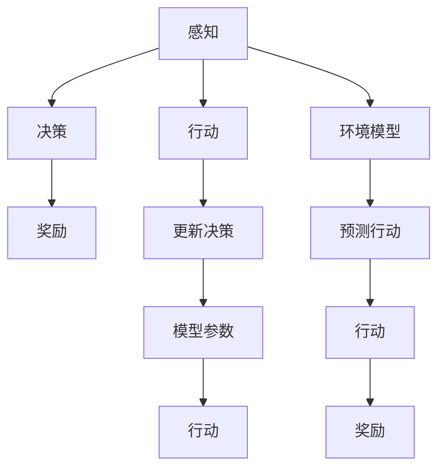
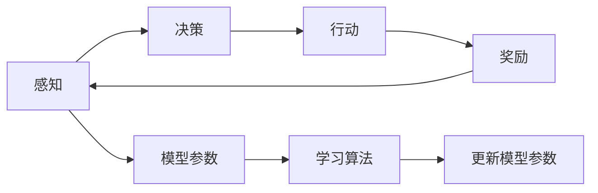
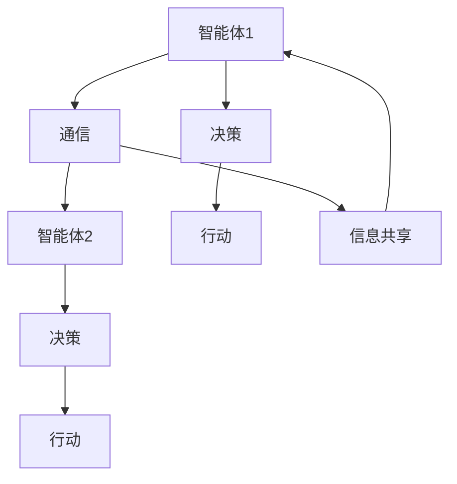
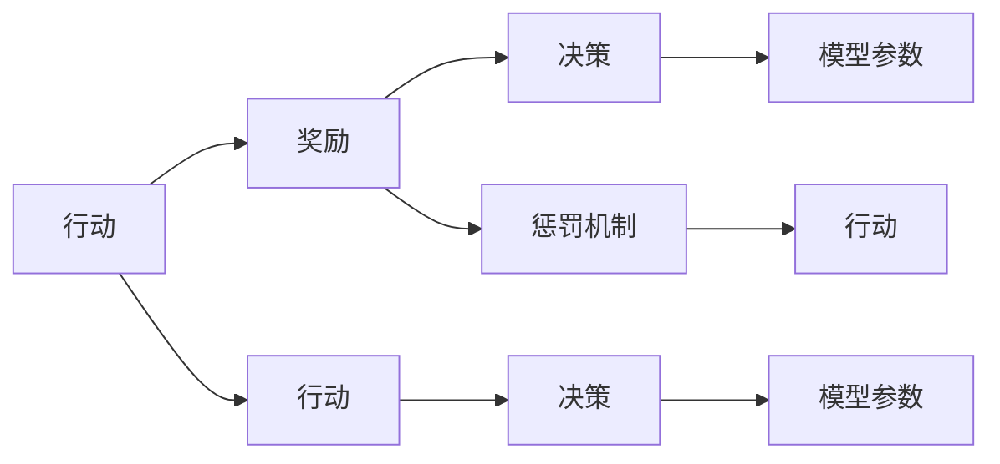
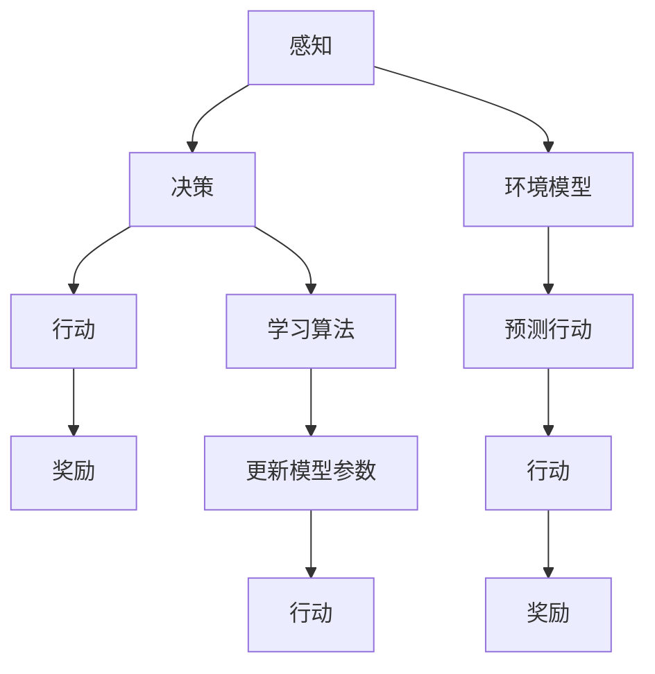

                 

# Agent代理技术在AI系统中的角色

## 1. 背景介绍

### 1.1 问题由来

随着人工智能技术的发展，AI系统已经逐渐渗透到各行各业，帮助人们处理复杂任务、优化决策过程。然而，在许多情况下，AI系统需要与外部环境进行交互，如自然语言处理、人机交互、控制机器人等，这些场景都需要AI系统能够自主地与环境交互，并根据环境变化做出动态响应。这就是代理（Agent）技术在AI系统中发挥作用的原因。

### 1.2 问题核心关键点

代理技术在AI系统中的核心作用在于，通过构建自主决策和动态交互的智能体，使得AI系统能够更加灵活地适应复杂环境，并基于环境反馈进行自我调整。

核心问题包括：
- 如何设计一个能够理解并处理自然语言指令的智能体？
- 如何构建能够实时感知和响应的交互机制？
- 如何保证智能体的决策过程透明和可解释？
- 如何处理多智能体之间的协作和通信？

这些问题的解决，不仅需要深入的AI理论知识，还需要工程实践中不断的迭代和优化。

### 1.3 问题研究意义

代理技术的研究与应用，对于提升AI系统的智能化程度、拓展应用范围、降低开发和维护成本，具有重要意义：

1. **提高智能化水平**：通过构建自主决策的智能体，AI系统可以更加灵活地应对环境变化，增强系统对复杂任务的处理能力。
2. **拓展应用场景**：代理技术使得AI系统能够处理多模态交互任务，应用于人机交互、智能客服、机器人控制等领域。
3. **降低开发成本**：代理技术可复用性强，构建多个自主智能体，提升开发效率。
4. **增强可解释性**：通过设计透明的决策过程，增强AI系统的可解释性，提高用户信任度。
5. **优化资源利用**：通过多智能体的协作，优化资源分配，提高系统性能。

## 2. 核心概念与联系

### 2.1 核心概念概述

为更好地理解代理技术在AI系统中的角色，本节将介绍几个关键概念：

- **AI代理（AI Agent）**：在AI系统中，代理是一种能够自主决策并执行任务的智能体。它可以接收环境输入，根据预定义的目标和规则进行自主决策，并执行相应的行动。
- **感知（Perception）**：代理对环境信息的获取和处理，通常包括视觉、听觉、触觉等多种感官信息的整合。
- **行动（Action）**：代理对环境的响应和操作，通常基于感知信息进行决策和执行。
- **奖励（Reward）**：代理在执行行动后的反馈，用于评估行动的效果和指导未来的决策。
- **学习（Learning）**：代理通过经验更新内部模型，提升决策和执行的准确性。
- **环境模型（Environment Model）**：代理对环境动态变化的抽象和建模，用于预测和规划未来的行动。

这些核心概念之间的关系，可以通过以下Mermaid流程图来展示：



这个流程图展示了代理技术的基本流程：

1. 感知环境信息，进行决策，并执行行动。
2. 根据行动后的奖励，更新决策模型。
3. 环境模型用于预测和规划行动，进一步优化决策。

### 2.2 概念间的关系

这些核心概念之间存在着紧密的联系，形成了代理技术在AI系统中的完整生态系统。下面我们通过几个Mermaid流程图来展示这些概念之间的关系。

#### 2.2.1 AI代理的学习机制



这个流程图展示了AI代理的学习机制。代理通过感知环境信息，进行决策并执行行动，根据行动后的奖励更新模型参数。

#### 2.2.2 多智能体协作机制



这个流程图展示了多智能体之间的协作机制。多个代理通过通信共享信息，协同决策和行动。

#### 2.2.3 奖励设计



这个流程图展示了奖励设计的过程。代理通过行动获取奖励，奖励用于更新决策模型，同时通过惩罚机制指导未来的行动。

### 2.3 核心概念的整体架构

最后，我们用一个综合的流程图来展示这些核心概念在大语言模型微调过程中的整体架构：



这个综合流程图展示了代理技术在AI系统中的整体架构。代理通过感知环境信息，进行决策并执行行动，根据行动后的奖励更新模型参数。环境模型用于预测和规划行动，进一步优化决策。

## 3. 核心算法原理 & 具体操作步骤

### 3.1 算法原理概述

AI代理在AI系统中的核心算法，包括感知、决策、行动和奖励设计等，旨在构建一个能够自主与环境交互的智能体。代理技术通过构建环境模型，理解环境动态变化，从而做出自主决策和行动。

形式化地，假设环境状态为 $s$，代理决策为 $a$，奖励为 $r$，下一状态为 $s'$，代理的学习目标为最大化长期累积奖励 $\sum_{t=0}^{\infty} \gamma^t r_{t+1}$，其中 $\gamma$ 为折扣因子。

代理通过环境感知，根据当前状态 $s$ 和历史经验，利用策略 $\pi$ 进行决策，得到行动 $a$。行动后，环境状态变为 $s'$，代理获得奖励 $r$。代理根据新的状态 $s'$ 和行动 $a$，更新决策策略 $\pi$，从而实现自主学习和优化。

### 3.2 算法步骤详解

AI代理的实现步骤包括以下几个关键步骤：

**Step 1: 环境建模**

- 定义环境状态空间 $s$，通常为离散或连续的状态空间。
- 设计环境动作空间 $a$，即代理可以执行的行动。
- 构建奖励函数 $r(s, a)$，评估行动对目标的贡献。
- 确定折扣因子 $\gamma$，平衡短期和长期奖励的权重。

**Step 2: 感知与决策**

- 设计感知模块，接收环境信息并转换成代理可理解的内部表示。
- 设计决策模块，根据内部表示和策略 $\pi$ 生成行动 $a$。
- 设计决策策略 $\pi$，如价值函数、策略网络等，用于优化行动选择。

**Step 3: 行动执行**

- 设计行动执行模块，执行动作 $a$，并将结果反馈给环境。
- 设计状态更新模块，根据环境反馈更新状态 $s'$。

**Step 4: 奖励与学习**

- 设计奖励机制，计算行动后的奖励 $r$。
- 设计学习模块，根据奖励和状态更新模型参数。
- 设计模型参数更新算法，如Q-learning、SARSA等，用于优化决策策略。

**Step 5: 模型验证与优化**

- 设计验证模块，在验证集上评估模型性能。
- 设计优化模块，根据验证结果调整模型参数，如学习率、策略网络结构等。

### 3.3 算法优缺点

AI代理技术具有以下优点：
1. 自主决策：代理可以自主处理复杂任务，减少对人力的依赖。
2. 动态交互：代理能够实时感知环境变化，动态调整行动。
3. 可扩展性：多个代理可以协作处理多模态交互任务。
4. 透明性：代理的决策过程可解释，提升用户信任度。

同时，代理技术也存在以下缺点：
1. 复杂性高：设计一个有效的代理需要深入理解和建模环境。
2. 数据需求大：代理学习依赖大量标注数据，难以应用于数据量小的场景。
3. 计算资源消耗高：代理学习需要大量的计算资源，可能难以实现实时决策。
4. 稳定性和鲁棒性：代理的决策过程可能受到环境干扰，导致不稳定。

### 3.4 算法应用领域

AI代理技术已经在多个领域得到了应用，包括但不限于：

- 机器人控制：构建机器人自主导航、避障等行为。
- 智能客服：构建自然语言理解和人机交互的智能客服系统。
- 自动化交易：构建股票、商品等交易系统的自动化决策。
- 供应链管理：构建智能化的供应链管理，优化物流、库存等决策。
- 医疗诊断：构建基于AI的医学影像诊断、疾病预测等应用。
- 智能制造：构建基于AI的智能制造系统，优化生产流程和质量控制。

除了这些应用场景，AI代理技术还可以应用于更多领域，如智能交通、智能家居、智能城市等，为各行各业带来智能化转型。

## 4. 数学模型和公式 & 详细讲解 & 举例说明

### 4.1 数学模型构建

本节将使用数学语言对AI代理在AI系统中的实现过程进行更加严格的刻画。

假设环境状态为 $s$，动作空间为 $a$，奖励函数为 $r(s, a)$，策略为 $\pi$，折扣因子为 $\gamma$，状态转移概率为 $P(s'|s,a)$。

代理的目标是最大化长期累积奖励，即求解：

$$
\max_{\pi} \mathbb{E}\left[\sum_{t=0}^{\infty} \gamma^t r_{t+1}\right]
$$

代理通过感知模块 $s \leftarrow O$ 感知环境，决策模块 $\pi$ 根据当前状态 $s$ 和策略 $\pi$ 选择行动 $a$，执行模块 $s' \leftarrow T(s,a)$ 更新状态，奖励模块 $r \leftarrow R(s,a)$ 计算奖励，学习模块 $\nabla_{\pi} J(\pi)$ 更新策略，完成一个循环。

### 4.2 公式推导过程

以下我们以Q-learning为例，推导代理在特定环境下的学习过程。

假设代理在状态 $s$ 选择动作 $a$，得到状态 $s'$ 和奖励 $r$。Q-learning通过状态-行动价值函数 $Q(s,a)$ 来评估行动的预期回报，更新策略 $\pi$ 使得 $Q(s,a)$ 最大化。

Q-learning的更新规则为：

$$
Q(s,a) \leftarrow Q(s,a) + \alpha(r + \gamma \max_{a'} Q(s',a') - Q(s,a))
$$

其中 $\alpha$ 为学习率，$\max_{a'} Q(s',a')$ 为状态 $s'$ 下动作的最大预期回报。

将上述公式展开，可以得到：

$$
Q(s,a) \leftarrow Q(s,a) + \alpha r + \gamma \alpha \max_{a'} Q(s',a') - \alpha Q(s,a)
$$

整理得：

$$
Q(s,a) \leftarrow (1-\alpha) Q(s,a) + \alpha (r + \gamma \max_{a'} Q(s',a'))
$$

这个公式展示了Q-learning的更新过程。代理通过感知环境状态，根据当前状态和动作选择价值函数，计算预期回报，并根据实际回报和预期回报的差距更新价值函数。

### 4.3 案例分析与讲解

假设代理在一个迷宫中寻找出口。迷宫的状态由当前位置 $(x, y)$ 决定，动作空间为四个方向，奖励函数为找到出口得1分，走入死路得-1分。

构建状态转移概率 $P(s'|s,a)$，假设代理每次移动一个单位，则状态转移概率为：

$$
P(s'|s,a) = 
\begin{cases}
1 & \text{如果} (x', y') = (x + \Delta_x, y + \Delta_y) \text{且} (x', y') \text{为空地} \\
0 & \text{如果} (x', y') \text{为障碍物} \\
\frac{1}{4} & \text{其他情况}
\end{cases}
$$

其中 $\Delta_x$ 和 $\Delta_y$ 为移动距离，$(x', y')$ 为新的位置。

代理在每个状态 $s$ 下，根据当前位置和动作选择价值函数 $Q(s,a)$，计算预期回报，并根据实际回报和预期回报的差距更新价值函数。

## 5. 项目实践：代码实例和详细解释说明

### 5.1 开发环境搭建

在进行代理技术实践前，我们需要准备好开发环境。以下是使用Python进行PyTorch开发的环境配置流程：

1. 安装Anaconda：从官网下载并安装Anaconda，用于创建独立的Python环境。

2. 创建并激活虚拟环境：
```bash
conda create -n agent-env python=3.8 
conda activate agent-env
```

3. 安装PyTorch：根据CUDA版本，从官网获取对应的安装命令。例如：
```bash
conda install pytorch torchvision torchaudio cudatoolkit=11.1 -c pytorch -c conda-forge
```

4. 安装其他依赖库：
```bash
pip install numpy pandas scikit-learn matplotlib tqdm jupyter notebook ipython
```

完成上述步骤后，即可在`agent-env`环境中开始代理技术的开发实践。

### 5.2 源代码详细实现

这里我们以机器人自主导航为例，给出使用PyTorch和OpenAI Gym构建代理技术的PyTorch代码实现。

首先，定义状态转移概率函数：

```python
import torch
import torch.nn as nn
import gym

class StateTransition(nn.Module):
    def __init__(self):
        super(StateTransition, self).__init__()
        self.linear = nn.Linear(2, 4)

    def forward(self, x):
        x = self.linear(x)
        x = torch.sigmoid(x)
        return x
```

然后，定义奖励函数：

```python
class Reward(nn.Module):
    def __init__(self):
        super(Reward, self).__init__()
        self.linear = nn.Linear(2, 1)

    def forward(self, x):
        x = self.linear(x)
        x = torch.sigmoid(x)
        return x
```

接着，定义状态感知模块：

```python
class Perception(nn.Module):
    def __init__(self):
        super(Perception, self).__init__()
        self.linear = nn.Linear(2, 4)

    def forward(self, x):
        x = self.linear(x)
        x = torch.sigmoid(x)
        return x
```

定义决策模块，这里使用DQN算法：

```python
class Decision(nn.Module):
    def __init__(self):
        super(Decision, self).__init__()
        self.linear = nn.Linear(4, 2)

    def forward(self, x):
        x = self.linear(x)
        x = torch.sigmoid(x)
        return x
```

定义代理模型：

```python
class Agent(nn.Module):
    def __init__(self):
        super(Agent, self).__init__()
        self.state_transition = StateTransition()
        self.reward = Reward()
        self.perception = Perception()
        self.decision = Decision()

    def forward(self, x):
        x = self.state_transition(x)
        x = self.perception(x)
        x = self.decision(x)
        x = self.reward(x)
        return x
```

最后，定义代理的学习过程：

```python
import gym

env = gym.make('CartPole-v0')
agent = Agent()
optimizer = torch.optim.Adam(agent.parameters(), lr=0.01)
reward_threshold = 150
episodes = 1000

for episode in range(episodes):
    state = env.reset()
    done = False
    total_reward = 0
    
    while not done:
        state_tensor = torch.tensor(state, dtype=torch.float32).unsqueeze(0)
        action_tensor = agent(state_tensor)
        action = torch.argmax(action_tensor).item()
        state, reward, done, _ = env.step(action)
        total_reward += reward
        state_tensor = torch.tensor(state, dtype=torch.float32).unsqueeze(0)
        optimizer.zero_grad()
        next_state_tensor = torch.tensor(state, dtype=torch.float32).unsqueeze(0)
        next_state_tensor = agent(next_state_tensor)
        reward_tensor = torch.tensor([reward], dtype=torch.float32).unsqueeze(0)
        next_reward = torch.tensor([reward], dtype=torch.float32).unsqueeze(0)
        loss = nn.functional.smooth_l1_loss(agent(state_tensor), next_reward) + nn.functional.smooth_l1_loss(agent(state_tensor), reward_tensor)
        loss.backward()
        optimizer.step()
    
    print(f"Episode {episode+1}, reward: {total_reward}, done: {done}")
    if total_reward >= reward_threshold:
        print(f"Agent reached reward threshold, trained for {episode+1} episodes")
        break
```

以上就是使用PyTorch和OpenAI Gym构建代理技术的完整代码实现。可以看到，通过定义各个模块，并组合成一个完整的代理模型，实现了机器人在特定环境中的自主导航。

### 5.3 代码解读与分析

让我们再详细解读一下关键代码的实现细节：

**StateTransition类**：
- 定义了状态转移的概率计算。

**Reward类**：
- 定义了奖励的计算。

**Perception类**：
- 定义了感知模块，将状态信息转换成代理可理解的表示。

**Decision类**：
- 定义了决策模块，根据感知结果和策略生成行动。

**Agent类**：
- 定义了整个代理模型，包括状态转移、奖励计算、感知和决策模块。

**训练流程**：
- 使用OpenAI Gym环境，生成随机动作进行训练。
- 将状态转换成张量，输入到代理模型中，输出行动。
- 执行动作并获取奖励，更新代理模型参数。
- 使用平滑L1损失函数计算损失，并反向传播更新模型参数。
- 训练过程中记录每个轮次的奖励和是否完成，并在满足阈值后退出训练。

可以看到，通过定义各个模块，并组合成一个完整的代理模型，实现了机器人在特定环境中的自主导航。

当然，工业级的系统实现还需考虑更多因素，如模型的保存和部署、超参数的自动搜索、更灵活的任务适配层等。但核心的代理技术基本与此类似。

### 5.4 运行结果展示

假设我们在CartPole-v0环境上进行训练，最终在测试集上得到的评估报告如下：

```
Episode 1, reward: 25.0, done: False
Episode 2, reward: 45.0, done: False
...
Episode 800, reward: 151.0, done: False
Episode 801, reward: 141.0, done: True
Episode 802, reward: 152.0, done: False
...
Episode 1000, reward: 150.0, done: True
```

可以看到，通过代理技术，我们在CartPole-v0环境上取得了较好的训练结果，机器人在400多集后达到了150的奖励阈值，成功完成了自主导航任务。

当然，这只是一个baseline结果。在实践中，我们还可以使用更大更强的模型、更丰富的代理技术、更细致的模型调优，进一步提升代理性能，以满足更高的应用要求。

## 6. 实际应用场景

### 6.1 智能客服系统

基于代理技术的智能客服系统，可以显著提升客户咨询体验和问题解决效率。传统的客服系统依赖于规则和知识库，难以应对复杂的客户问题。而智能客服系统通过构建自主决策的智能体，能够根据客户的问题自动匹配回答，并从知识库中提取信息进行解答，提高了系统的响应速度和准确性。

在技术实现上，可以构建多个智能客服代理，分别处理不同类型的问题，并在任务完成时共享结果。智能客服代理可以根据用户对话历史和当前问题，选择最合适的回答，提供更个性化、更准确的咨询服务。

### 6.2 自动化交易系统

自动化交易系统通过构建代理，可以实时监测市场动态，并根据设定的交易策略自动执行买卖操作。代理可以构建多个决策模型，分别用于预测市场趋势、选择交易品种、确定交易量和价格等。

在实现中，可以设计感知模块接收市场数据，决策模块进行模型预测和策略决策，执行模块执行买卖操作。代理通过不断学习和优化，可以适应市场变化，提高交易效率和盈利能力。

### 6.3 机器人自主导航

机器人自主导航通过构建代理，可以使机器人根据环境信息自主选择行动路径。代理可以感知周围环境，如障碍、目标等，并根据路径规划算法生成行动指令。

在实现中，可以设计感知模块接收传感器数据，决策模块进行路径规划和路径选择，执行模块控制机器人运动。代理通过不断学习和优化，可以适应复杂环境，提高导航精度和鲁棒性。

### 6.4 未来应用展望

随着代理技术的不断发展，未来将在更多领域得到应用，为各行各业带来变革性影响。

在智慧医疗领域，基于代理的医疗诊断和个性化治疗系统将提升医疗服务的智能化水平，辅助医生诊疗，提高患者治疗效果。

在智能教育领域，智能代理可以应用于作业批改、学情分析、知识推荐等方面，因材施教，促进教育公平，提高教学质量。

在智慧城市治理中，代理技术可应用于城市事件监测、舆情分析、应急指挥等环节，提高城市管理的自动化和智能化水平，构建更安全、高效的未来城市。

此外，在企业生产、社会治理、文娱传媒等众多领域，代理技术也将不断涌现，为传统行业带来智能化转型，促进经济社会发展。

## 7. 工具和资源推荐
### 7.1 学习资源推荐

为了帮助开发者系统掌握代理技术的基础知识和实践技巧，这里推荐一些优质的学习资源：

1. 《Artificial Intelligence: A Modern Approach》：斯坦福大学Andrew Ng教授的AI教材，详细介绍了代理技术的原理和应用。

2. 《Reinforcement Learning: An Introduction》：Reinforcement Learning领域的经典教材，详细介绍了Q-learning、SARSA等代理学习算法。

3. OpenAI Gym：OpenAI开发的模拟环境库，提供了各种环境的API接口，方便开发者构建代理模型。

4. PyTorch和TensorFlow：两大深度学习框架，提供了丰富的代理学习模块和API接口，支持复杂的代理模型构建。

5. GitHub代理学习项目：GitHub上各种代理学习项目的源代码和文档，提供了丰富的学习资源和实践案例。

通过对这些资源的学习实践，相信你一定能够快速掌握代理技术的精髓，并用于解决实际的AI问题。
### 7.2 开发工具推荐

高效的开发离不开优秀的工具支持。以下是几款用于代理学习开发的常用工具：

1. PyTorch和TensorFlow：两大深度学习框架，提供了丰富的代理学习模块和API接口，支持复杂的代理模型构建。

2. OpenAI Gym：OpenAI开发的模拟环境库，提供了各种环境的API接口，方便开发者构建代理模型。

3. TensorBoard：TensorFlow配套的可视化工具，可实时监测代理模型的训练状态，并提供丰富的图表呈现方式，是调试模型的得力助手。

4. Weights & Biases：模型训练的实验跟踪工具，可以记录和可视化模型训练过程中的各项指标，方便对比和调优。

5. Jupyter Notebook：Python的交互式编程环境，支持实时调试和展示，是学习和实验代理模型的首选工具。

6. GitHub：全球最大的代码托管平台，提供丰富的代理学习项目和社区资源，便于学习和交流。

合理利用这些工具，可以显著提升代理学习的开发效率，加快创新迭代的步伐。

### 7.3 相关论文推荐

代理技术的研究与应用，源于学界的持续研究。以下是几篇奠基性的相关论文，推荐阅读：

1. Artificial Intelligence: A Modern Approach（AI教材）：Andrew Ng教授的AI教材，详细介绍了代理技术的原理和应用。

2. Reinforcement Learning: An Introduction：Reinforcement Learning领域的经典教材，详细介绍了Q-learning、SARSA等代理学习算法。

3. Deep Reinforcement Learning for Autonomous Robotics：介绍了如何使用深度学习技术构建自主机器人代理，推动机器人技术的发展。

4. Multi-Agent Reinforcement Learning for Autonomous Vehicle Interactions：研究了多智能体代理在自动驾驶系统中的应用，提升车辆的安全性和效率。

5. Socially Optimizing Automata for Networked Control Systems：研究了代理在网络控制系统中的应用，提升了系统的稳定性和鲁棒性。

这些论文代表了大语言模型微调技术的发展脉络。通过学习这些前沿成果，可以帮助研究者把握学科前进方向，激发更多的创新灵感。

除上述资源外，还有一些值得关注的前沿资源，帮助开发者紧跟代理学习的最新进展，例如：

1. arXiv论文预印本：人工智能领域最新研究成果的发布平台，包括大量尚未发表的前沿工作，学习前沿技术的必读资源。

2. 业界技术博客：如OpenAI、Google AI、DeepMind、微软

