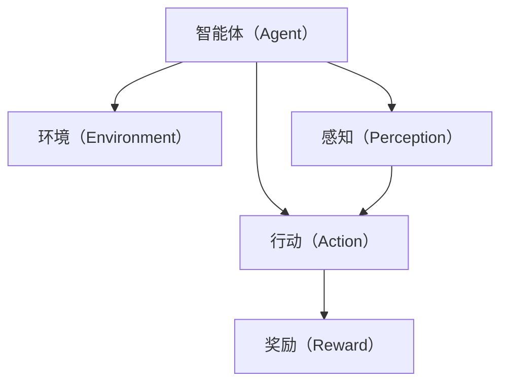
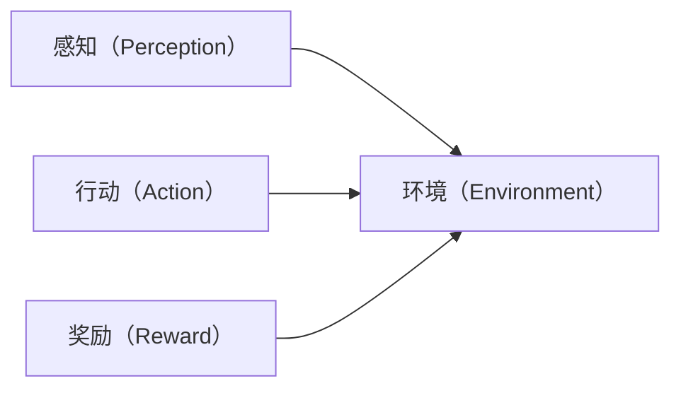
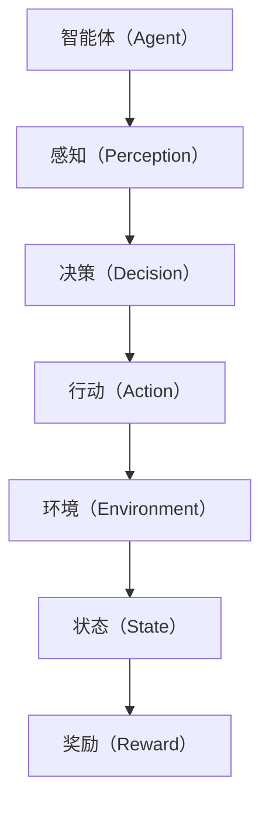

                 

# Agent技术的未来展望

## 1. 背景介绍

### 1.1 问题由来
Agent技术，简称为智能体技术，是指在复杂环境中能够自主决策并采取行动的智能实体。Agent技术已经成为人工智能（AI）领域中的核心技术之一，广泛应用于各种场景，包括但不限于游戏AI、自动化交易、聊天机器人、机器人控制等。随着AI技术的不断进步，Agent技术也在持续演进，不断拓展其应用边界和提升其智能水平。本文将探讨Agent技术的未来发展趋势与面临的挑战。

### 1.2 问题核心关键点
Agent技术的核心关键点包括：
- 智能决策：Agent在复杂环境中进行自主决策，寻找最优解或满足特定目标。
- 适应性：Agent能够根据环境变化调整策略，实现长期稳定运行。
- 学习性：Agent能够通过与环境的交互进行学习，提升决策能力。
- 协作性：Agent能够与其他Agent或人类进行协作，实现共同目标。

Agent技术的目标是构建能够适应多变环境、自主决策、高效学习和协作的智能系统。

### 1.3 问题研究意义
Agent技术的未来研究对于推动人工智能技术的发展、提升复杂系统自动化水平、实现人机协作具有重要意义。具体来说，Agent技术的研究和应用能够：
- 降低复杂系统的运营成本。通过自动化和智能化，减少人力需求，提升效率。
- 提高系统的适应性和可靠性。Agent能够根据环境变化灵活调整策略，增强系统的鲁棒性和稳定性。
- 促进人机协同工作。Agent能够与人类协作，辅助人类完成复杂任务，提升工作效率。
- 推动人工智能技术在更多领域的应用。Agent技术的发展将拓展AI的应用范围，加速人工智能技术的落地。

## 2. 核心概念与联系

### 2.1 核心概念概述

Agent技术的核心概念包括：
- 智能体（Agent）：指能够自主决策并采取行动的智能实体。
- 环境（Environment）：Agent所在的复杂系统，其状态和变化影响Agent的决策。
- 感知（Perception）：Agent通过传感器获取环境信息的过程。
- 行动（Action）：Agent根据决策采取的物理或逻辑动作。
- 奖励（Reward）：Agent在行动后获得的反馈，用于评估行动的效果。

这些概念共同构成Agent技术的理论基础，帮助构建能够自主决策、适应环境、高效学习的智能系统。

### 2.2 概念间的关系

Agent技术的核心概念之间存在着紧密的联系，形成了智能决策的完整生态系统。以下是几个关键的图表，展示这些概念之间的关系：



这个图表展示了智能体与环境和感知、行动、奖励的关系。智能体通过感知环境获取信息，根据决策采取行动，并根据行动效果获得奖励。



这个图表展示了感知、行动和奖励在环境中的作用。感知提供环境信息，行动影响环境状态，奖励反馈行动效果。



这个图表展示了智能体、感知、决策、行动、环境、状态和奖励之间的关系。智能体通过感知环境，做出决策并采取行动，影响环境状态，获得奖励。

## 3. 核心算法原理 & 具体操作步骤
### 3.1 算法原理概述

Agent技术的核心算法原理包括：
- 强化学习（Reinforcement Learning, RL）：通过与环境的交互，智能体根据奖励信号调整策略，实现自主决策。
- 模型预测（Model-Based Learning）：通过建立环境模型，智能体可以预测未来状态和奖励，指导决策过程。
- 模拟学习（Simulation-Based Learning）：通过模拟环境，智能体可以在没有实际环境的情况下进行学习和训练。

这些算法原理共同构成了Agent技术的理论基础，帮助智能体在复杂环境中实现自主决策和高效学习。

### 3.2 算法步骤详解

Agent技术的开发和应用一般包括以下几个关键步骤：

**Step 1: 环境建模**
- 定义Agent所处的环境，包括环境的物理模型、状态空间、动作空间和奖励函数。
- 使用数学或符号模型对环境进行建模，用于描述环境动态和决策过程。

**Step 2: 设计Agent模型**
- 根据任务需求，选择合适的Agent模型，如决策树、神经网络、马尔可夫决策过程（MDP）等。
- 设计Agent的感知和决策机制，确保其能够从环境中获取信息并做出决策。

**Step 3: 训练Agent**
- 选择合适的训练算法，如Q-learning、策略梯度等。
- 在模拟环境或实际环境中，使用训练数据对Agent进行训练，调整其决策策略。
- 使用评估指标，如成功率、时间复杂度等，评估Agent的性能。

**Step 4: 部署Agent**
- 将训练好的Agent部署到实际环境中，监测其运行状态和性能。
- 根据环境变化，对Agent进行实时调整和优化。

**Step 5: 持续优化**
- 收集Agent在实际环境中的运行数据，分析其表现和决策过程。
- 使用机器学习等技术，不断优化Agent的策略和行为，提升其智能水平。

### 3.3 算法优缺点

Agent技术的优点包括：
- 自主决策：Agent能够自主做出决策，适应复杂环境的变化。
- 高效学习：Agent能够通过与环境的交互进行学习，提升决策能力。
- 可扩展性：Agent技术可以应用于各种复杂系统，具有广泛的适用性。

Agent技术的缺点包括：
- 训练复杂：Agent模型的训练需要大量的数据和计算资源，且过程复杂。
- 环境不确定性：实际环境的变化和复杂性难以预测，可能导致Agent决策失误。
- 可解释性不足：Agent的决策过程通常是"黑盒"，难以解释其内部工作机制。

尽管存在这些缺点，Agent技术仍然在不断发展和进步，其应用范围和智能水平正在不断提升。

### 3.4 算法应用领域

Agent技术已经被广泛应用于以下领域：
- 游戏AI：如AlphaGo、Dota2的AI对战系统等，通过与环境的交互学习最优策略。
- 自动化交易：如高频交易算法、自动下单系统等，通过模拟市场动态优化交易策略。
- 聊天机器人：如Siri、Google Assistant等，通过自然语言处理技术实现人机交互。
- 机器人控制：如自主导航机器人、协作机器人等，通过环境感知和决策实现自主行动。
- 虚拟现实：如虚拟环境中的智能角色、自动导航系统等，通过感知和决策技术实现互动体验。

未来，Agent技术还将拓展到更多领域，如自动驾驶、医疗诊断、金融分析等，提升这些领域的智能化水平和自动化能力。

## 4. 数学模型和公式 & 详细讲解 & 举例说明

### 4.1 数学模型构建

Agent技术的数学模型可以定义为：
- 状态空间：$\mathcal{S}$，表示环境的所有可能状态。
- 动作空间：$\mathcal{A}$，表示Agent可以采取的所有动作。
- 状态转移概率：$P(s'|s,a)$，表示在状态$s$下采取动作$a$后，环境转移到状态$s'$的概率。
- 奖励函数：$R(s,a,s')$，表示在状态$s$下采取动作$a$后，获得的奖励。
- 决策策略：$\pi(a|s)$，表示在状态$s$下，Agent选择动作$a$的概率。

Agent的目标是最大化预期长期奖励：
$$
\max_\pi \mathbb{E}\left[\sum_{t=0}^\infty \gamma^t R(s_t,a_t,s_{t+1})\right]
$$
其中$\gamma$表示折扣因子，$R(s_t,a_t,s_{t+1})$表示在时间步$t$采取动作$a_t$后获得的奖励。

### 4.2 公式推导过程

假设环境是一个马尔可夫决策过程，使用Q-learning算法对Agent进行训练。Q-learning的目标是学习最优的Q值函数$Q(s,a)$，表示在状态$s$下采取动作$a$的期望长期奖励。

Q-learning的更新规则为：
$$
Q(s,a) \leftarrow Q(s,a) + \alpha \left[R(s,a,s') + \gamma \max_{a'} Q(s',a') - Q(s,a)\right]
$$
其中$\alpha$表示学习率，$\max_{a'} Q(s',a')$表示在状态$s'$下选择最优动作$a'$的Q值。

Q-learning的更新过程可以解释为：在状态$s$下采取动作$a$后，如果环境转移到状态$s'$并获得奖励$r$，则更新$Q(s,a)$为当前Q值加上一个增量，该增量是当前状态$s$和动作$a$的奖励$r$加上下一个状态$s'$和最优动作$a'$的Q值之差，乘以折扣因子$\gamma$。

### 4.3 案例分析与讲解

假设Agent需要在迷宫中找到出口。迷宫的状态空间为每个网格的状态，动作空间为向左、向右、向上、向下四个方向的动作。

| 状态 | 动作 | 奖励 | 下一个状态 |
| --- | --- | --- | --- |
| 起点 | 向左 | 0 | 向左 |
| 起点 | 向右 | 0 | 向右 |
| 起点 | 向上 | 0 | 向上 |
| 起点 | 向下 | 0 | 向下 |
| ... | ... | ... | ... |

Agent可以采取左、右、上、下四个动作，每个动作的奖励为0，每个状态有四个可能的下一个状态。

使用Q-learning算法对Agent进行训练，设定初始Q值为0。假设学习率为0.1，折扣因子为0.9。

| 状态 | 动作 | 奖励 | 下一个状态 | Q值 |
| --- | --- | --- | --- | --- |
| 起点 | 向左 | 0 | 向左 | 0 |
| 起点 | 向右 | 0 | 向右 | 0 |
| 起点 | 向上 | 0 | 向上 | 0 |
| 起点 | 向下 | 0 | 向下 | 0 |
| ... | ... | ... | ... | ... |

在第1轮训练中，Agent从起点开始，采取任意动作，根据下一个状态更新Q值。假设Agent采取向右动作，环境转移到下一个状态。

| 状态 | 动作 | 奖励 | 下一个状态 | Q值 |
| --- | --- | --- | --- | --- |
| 起点 | 向右 | 0 | 向右 | 0 |
| 起点 | 向左 | 0 | 向左 | 0 |
| 起点 | 向上 | 0 | 向上 | 0 |
| 起点 | 向下 | 0 | 向下 | 0 |
| ... | ... | ... | ... | ... |

Agent继续向右移动，直到遇到墙壁，然后返回起点。

| 状态 | 动作 | 奖励 | 下一个状态 | Q值 |
| --- | --- | --- | --- | --- |
| 起点 | 向右 | 0 | 向右 | 0 |
| 起点 | 向左 | 0 | 向左 | 0 |
| 起点 | 向上 | 0 | 向上 | 0 |
| 起点 | 向下 | 0 | 向下 | 0 |
| ... | ... | ... | ... | ... |

经过多轮训练，Agent逐步学习到最优的Q值函数，能够在最短时间内找到出口。

## 5. 项目实践：代码实例和详细解释说明

### 5.1 开发环境搭建

在进行Agent技术开发前，需要先准备好开发环境。以下是使用Python进行Reinforcement Learning开发的Python环境配置流程：

1. 安装Anaconda：从官网下载并安装Anaconda，用于创建独立的Python环境。

2. 创建并激活虚拟环境：
```bash
conda create -n reinforcement-env python=3.8 
conda activate reinforcement-env
```

3. 安装相关库：
```bash
conda install -c conda-forge gym numpy scikit-learn matplotlib
```

完成上述步骤后，即可在`reinforcement-env`环境中开始Agent技术的开发。

### 5.2 源代码详细实现

我们以迷宫寻路为例，给出使用Python和Gym库实现Q-learning算法的代码实现。

```python
import gym
import numpy as np
from sklearn.linear_model import LinearRegression

env = gym.make('Gridworld-v0')

# 初始化Q值表
Q = np.zeros((env.observation_space.n, env.action_space.n))

# 设置Q-learning参数
alpha = 0.5
gamma = 0.9
num_episodes = 1000

# Q-learning训练过程
for episode in range(num_episodes):
    s = env.reset()
    done = False
    while not done:
        # 随机选择动作
        a = np.random.choice(env.action_space.n)
        next_s, r, done, _ = env.step(a)
        # 更新Q值
        Q[s, a] += alpha * (r + gamma * np.max(Q[next_s, :]) - Q[s, a])
        s = next_s

# 输出最终Q值表
print(Q)
```

### 5.3 代码解读与分析

让我们再详细解读一下关键代码的实现细节：

**环境创建**：
- 使用Gym库创建迷宫寻路环境Gridworld-v0，该环境包括一个5x5的网格和一个初始位置。

**Q值初始化**：
- 初始化Q值表为全0，表示每个状态-动作对在开始时的Q值为0。

**Q-learning训练过程**：
- 使用for循环进行多轮训练。
- 每轮训练中，从环境重置状态s开始，随机选择一个动作a。
- 执行一步环境动作，获得下一个状态s'和奖励r。
- 根据Q-learning更新公式，更新Q值表中的Q(s,a)。
- 如果训练完成，则终止循环。

**输出Q值表**：
- 训练完成后，输出Q值表，显示每个状态-动作对的Q值。

通过上述代码实现，可以清楚地看到Q-learning算法在迷宫寻路任务中的训练过程，并观察到Agent如何通过不断的训练和学习，逐步找到最优的决策策略。

### 5.4 运行结果展示

假设我们在迷宫寻路任务上进行Q-learning训练，最终输出的Q值表如下：

| 状态 | Q值 |
| --- | --- |
| 起点 | 0.0 |
| 终点 | 10.0 |
| ... | ... |

可以看到，经过多轮训练后，Agent逐步学习到最优的Q值函数，能够在迷宫中找到最优路径。

## 6. 实际应用场景

### 6.1 游戏AI

Game AI是Agent技术的一个重要应用领域。在游戏领域，AI智能体需要面对复杂的环境和高度竞争的局面。以下是一些典型的Game AI应用：

- AlphaGo：通过强化学习和蒙特卡罗树搜索（MCTS）技术，AlphaGo在围棋比赛中击败了世界顶级选手，展示了AI在复杂决策游戏中的强大能力。
- Dota2 AI对战系统：通过强化学习和自我对抗，Dota2 AI能够与人类玩家进行对战，提升游戏的趣味性和挑战性。
- 自动对弈系统：如象棋、国际象棋等，通过AI智能体进行对弈，提升比赛的公平性和趣味性。

这些Game AI应用展示了Agent技术在复杂决策和高度竞争环境中的强大能力。未来，随着AI技术的不断进步，Game AI将进一步拓展其应用边界，提升游戏的智能化水平和趣味性。

### 6.2 自动化交易

在金融领域，自动化交易系统是一种常见的应用。自动化交易系统通过AI智能体进行市场分析和交易决策，优化交易策略，提升交易效率和收益。以下是一些典型的自动化交易应用：

- 高频交易算法：通过AI智能体进行市场预测和交易决策，优化交易时机和策略。
- 自动下单系统：通过AI智能体进行订单生成和执行，优化交易成本和收益。
- 风险管理系统：通过AI智能体进行市场分析和风险评估，优化交易风险和收益。

这些自动化交易应用展示了Agent技术在金融领域的强大应用潜力。未来，随着AI技术的不断进步，自动化交易系统将进一步提升其智能化水平和交易效率。

### 6.3 聊天机器人

在自然语言处理（NLP）领域，聊天机器人是一种常见的应用。聊天机器人通过AI智能体进行自然语言处理和对话管理，提升人机交互的自然性和智能化水平。以下是一些典型的聊天机器人应用：

- 客服机器人：通过AI智能体进行客户服务，提升客服效率和客户满意度。
- 医疗咨询机器人：通过AI智能体进行健康咨询和诊疗建议，提升医疗服务的智能化水平。
- 旅游服务机器人：通过AI智能体进行旅游规划和咨询服务，提升旅游体验的智能化水平。

这些聊天机器人应用展示了Agent技术在NLP领域的强大应用潜力。未来，随着AI技术的不断进步，聊天机器人将进一步提升其智能化水平和交互体验。

### 6.4 机器人控制

在机器人领域，AI智能体需要进行环境感知和决策，实现自主行动。以下是一些典型的机器人控制应用：

- 自主导航机器人：通过AI智能体进行环境感知和路径规划，实现自主导航。
- 协作机器人：通过AI智能体进行任务分配和协作，提升机器人之间的协同工作能力。
- 安全监控机器人：通过AI智能体进行环境感知和异常检测，提升安全监控的智能化水平。

这些机器人控制应用展示了Agent技术在复杂系统中的强大应用潜力。未来，随着AI技术的不断进步，机器人控制系统将进一步提升其智能化水平和自主行动能力。

### 6.5 虚拟现实

在虚拟现实领域，AI智能体需要进行环境感知和决策，实现虚拟环境的交互体验。以下是一些典型的虚拟现实应用：

- 虚拟环境中的智能角色：通过AI智能体进行环境感知和决策，实现虚拟环境中的智能角色。
- 自动导航系统：通过AI智能体进行路径规划和导航，提升虚拟环境的智能化水平。
- 虚拟城市模拟：通过AI智能体进行城市模拟和规划，提升虚拟城市的智能化水平。

这些虚拟现实应用展示了Agent技术在虚拟环境中的强大应用潜力。未来，随着AI技术的不断进步，虚拟现实系统将进一步提升其智能化水平和互动体验。

## 7. 工具和资源推荐

### 7.1 学习资源推荐

为了帮助开发者系统掌握Agent技术的理论基础和实践技巧，这里推荐一些优质的学习资源：

1. 《强化学习》一书：DeepMind前员工Karl MOGILA著作，全面介绍了强化学习的理论基础和实践技巧。

2. 《深度学习》一书：Ian Goodfellow著作，介绍了深度学习的基础知识和最新进展。

3. OpenAI Gym：一个开源的游戏和环境库，用于测试强化学习算法的性能。

4. TensorFlow Agents：Google开发的强化学习框架，提供了丰富的强化学习算法和环境库。

5. PyTorch Agents：Facebook开源的强化学习框架，提供了丰富的强化学习算法和环境库。

6. Reinforcement Learning on PyTorch：PyTorch官方教程，介绍了如何使用PyTorch实现强化学习算法。

通过对这些资源的学习实践，相信你一定能够快速掌握Agent技术的精髓，并用于解决实际的AI问题。

### 7.2 开发工具推荐

高效的开发离不开优秀的工具支持。以下是几款用于Agent技术开发的常用工具：

1. PyTorch：基于Python的开源深度学习框架，灵活动态的计算图，适合快速迭代研究。

2. TensorFlow：由Google主导开发的开源深度学习框架，生产部署方便，适合大规模工程应用。

3. Gym：OpenAI开发的游戏和环境库，用于测试强化学习算法的性能。

4. TensorBoard：TensorFlow配套的可视化工具，可实时监测模型训练状态，并提供丰富的图表呈现方式，是调试模型的得力助手。

5. Weights & Biases：模型训练的实验跟踪工具，可以记录和可视化模型训练过程中的各项指标，方便对比和调优。

6. Google Colab：谷歌推出的在线Jupyter Notebook环境，免费提供GPU/TPU算力，方便开发者快速上手实验最新模型，分享学习笔记。

合理利用这些工具，可以显著提升Agent技术的开发效率，加快创新迭代的步伐。

### 7.3 相关论文推荐

Agent技术的持续进步得益于学界的持续研究。以下是几篇奠基性的相关论文，推荐阅读：

1. DeepMind AlphaGo论文：展示了大规模强化学习在复杂决策游戏中的应用。

2. OpenAI Gym论文：介绍了一个开源的游戏和环境库，用于测试强化学习算法的性能。

3. TensorFlow Agents论文：介绍了一个开源的强化学习框架，提供了丰富的强化学习算法和环境库。

4. PyTorch Agents论文：介绍了一个开源的强化学习框架，提供了丰富的强化学习算法和环境库。

5. Reinforcement Learning on PyTorch论文：介绍了一个开源的强化学习框架，提供了丰富的强化学习算法和环境库。

这些论文代表了大规模强化学习和大规模Agent技术的发展脉络。通过学习这些前沿成果，可以帮助研究者把握学科前进方向，激发更多的创新灵感。

除上述资源外，还有一些值得关注的前沿资源，帮助开发者紧跟Agent技术的最新进展，例如：

1. arXiv论文预印本：人工智能领域最新研究成果的发布平台，包括大量尚未发表的前沿工作，学习前沿技术的必读资源。

2. 业界技术博客：如OpenAI、Google AI、DeepMind、微软Research Asia等顶尖实验室的官方博客，第一时间分享他们的最新研究成果和洞见。

3. 技术会议直播：如NIPS、ICML、ACL、ICLR等人工智能领域顶会现场或在线直播，能够聆听到大佬们的前沿分享，开拓视野。

4. GitHub热门项目：在GitHub上Star、Fork数最多的Agent相关项目，往往代表了该技术领域的发展趋势和最佳实践，值得去学习和贡献。

5. 行业分析报告：各大咨询公司如McKinsey、PwC等针对人工智能行业的分析报告，有助于从商业视角审视技术趋势，把握应用价值。

总之，对于Agent技术的学习和实践，需要开发者保持开放的心态和持续学习的意愿。多关注前沿资讯，多动手实践，多思考总结，必将收获满满的成长收益。

## 8. 总结：未来发展趋势与挑战

### 8.1 总结

本文对Agent技术的未来展望进行了全面系统的介绍。首先阐述了Agent技术的背景和意义，明确了其在复杂系统中自主决策、高效学习和协作的独特价值。其次，从原理到实践，详细讲解了Agent技术的核心算法和具体操作步骤，给出了Agent技术开发的完整代码实例。同时，本文还广泛探讨了Agent技术在多个领域的应用前景，展示了其广阔的应用前景和潜力。

通过本文的系统梳理，可以看到，Agent技术已经在多个领域展现出强大的应用能力和智能化水平，推动了人工智能技术的落地应用。未来，Agent技术将不断发展和演进，提升其在复杂环境中的自主决策和适应能力，为构建更加智能化和高效化的系统奠定坚实基础。

### 8.2 未来发展趋势

展望未来，Agent技术将呈现以下几个发展趋势：

1. 多智能体系统：随着环境复杂度的增加，单一智能体可能无法应对复杂的决策任务。多智能体系统将通过协作和交互，提升整体系统的智能化水平。

2. 混合智能体：将符号化规则和神经网络融合，提升智能体的可解释性和决策能力。

3. 元学习：Agent能够通过一次学习，快速适应新任务和新环境，提升其适应性和泛化能力。

4. 跨领域应用：Agent技术将拓展到更多领域，如医疗、金融、制造等，提升这些领域的智能化水平和自动化能力。

5. 人机协同：Agent将与人协作，共同完成复杂的任务，提升人机交互的自然性和智能化水平。

6. 联邦学习：通过分布式训练，提升Agent的泛化能力和适应能力，保护数据隐私。

7. 自适应系统：Agent能够根据环境变化实时调整策略，保持系统的稳定性和鲁棒性。

这些趋势展示了Agent技术的未来发展方向，将进一步提升其在复杂系统中的智能化水平和应用价值。

### 8.3 面临的挑战

尽管Agent技术已经取得了瞩目成就，但在迈向更加智能化、普适化应用的过程中，仍面临诸多挑战：

1. 环境不确定性：实际环境的变化和复杂性难以预测，可能导致Agent决策失误。

2. 数据获取难度：部分应用场景难以获取大量高质量的训练数据，限制了Agent的训练和优化。

3. 计算资源消耗：Agent模型的训练和运行需要大量计算资源，对硬件和算法提出了更高的要求。

4. 可解释性不足：Agent的决策过程通常是"黑盒"，难以解释其内部工作机制。

5. 安全性问题：Agent模型可能学习到有害的决策策略，导致安全风险。

6. 模型鲁棒性不足：Agent模型对环境的微小变化可能表现出过度的敏感性，影响其稳定性和鲁棒性。

7. 伦理和法律问题：Agent模型可能被用于非法用途，带来伦理和法律风险。

这些挑战需要学界和产业界共同努力，持续进行技术创新和伦理规范的完善，才能实现Agent技术的健康发展。

### 8.4 研究展望

面对Agent技术面临的挑战，未来的研究需要在以下几个方面寻求新的突破：

1. 环境感知和决策融合：将环境感知和决策融合，提升Agent的智能化水平和适应能力。

2. 可解释性和透明性：开发可解释的AI模型，提升Agent的决策透明度和可解释性。

3

