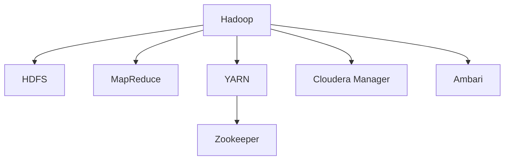
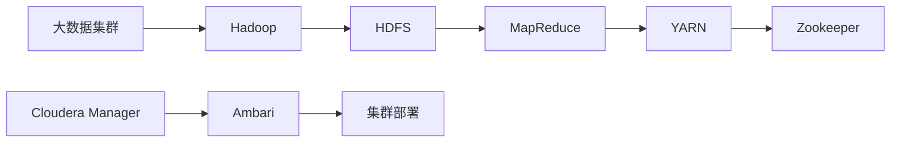
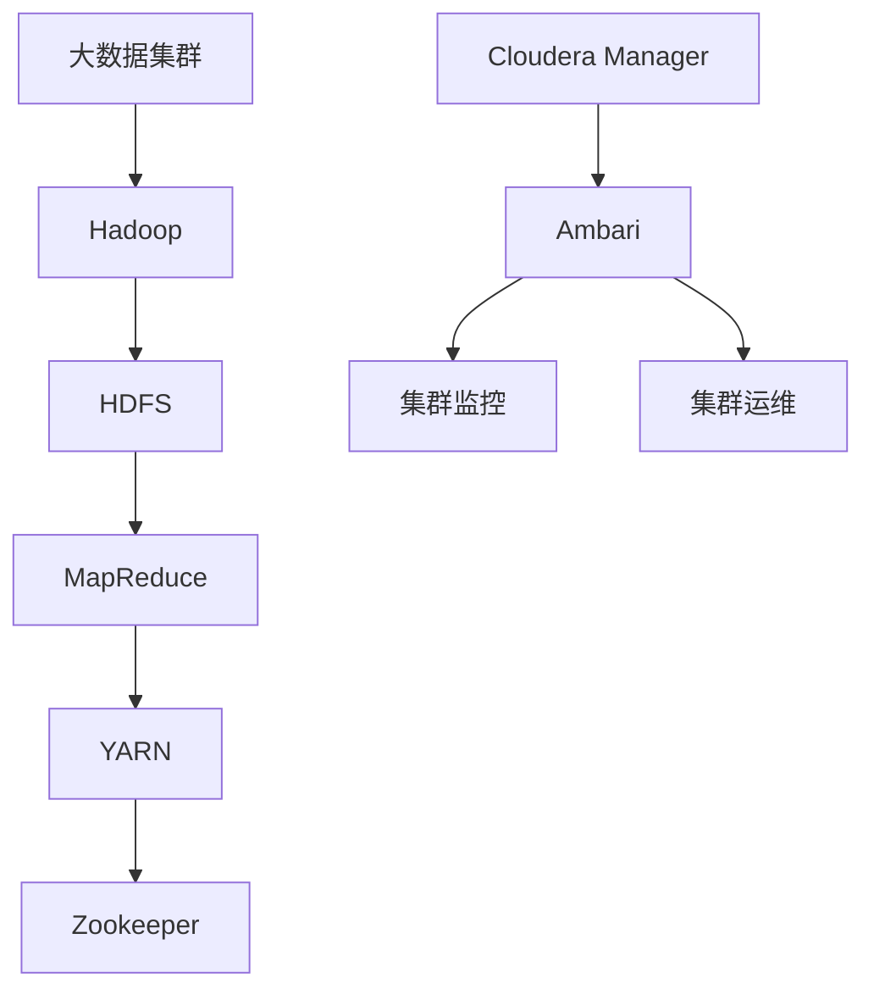
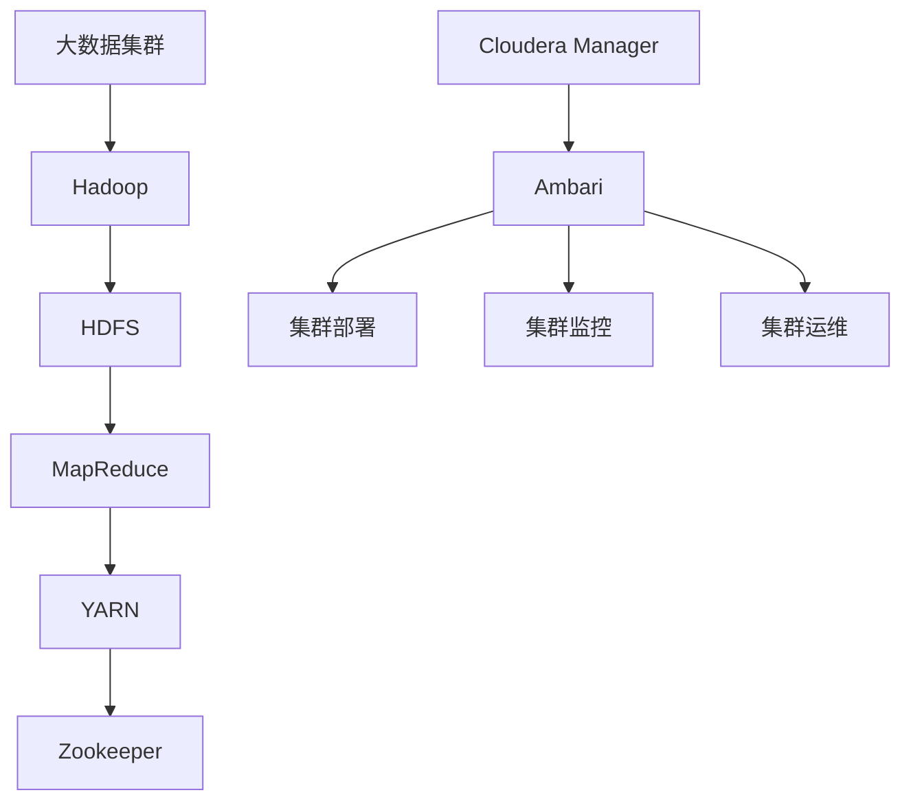

                 

# Ambari原理与代码实例讲解

> 关键词：Hadoop, YARN, HDFS, Zookeeper, Cloudera Manager, Ambari, 集群管理, 大数据, 云计算

## 1. 背景介绍

### 1.1 问题由来
随着大数据时代的到来，越来越多的企业和组织开始采用Hadoop等开源大数据平台，以应对海量数据的存储和处理需求。然而，Hadoop等大数据平台部署和运维复杂，需要专业知识丰富的IT团队进行管理和维护，这不仅增加了企业的成本，也限制了大数据的应用和推广。

为解决这一问题，Apache Ambari应运而生。Ambari是一个开源的Hadoop集群管理系统，它简化了Hadoop集群的部署、配置、管理和扩展过程，使得企业能够快速搭建和维护一个大数据平台，同时也大大降低了运维成本和复杂度。

### 1.2 问题核心关键点
Ambari的核心功能包括：
1. 自动化集群部署：自动化地从零开始部署和管理Hadoop集群，包括安装、配置和启动各组件。
2. 可视化管理界面：提供Web界面，便于用户进行集群管理和监控。
3. 扩展性和可伸缩性：支持动态添加或删除节点，支持水平扩展和集群升级。
4. 配置管理：提供模板和向导，简化配置过程，支持一键备份和恢复配置。
5. 用户身份认证：支持LDAP和kerberos等身份认证机制，保障集群安全性。
6. 健康检查：实时监控集群健康状态，及时发现和解决故障。
7. 日志分析：记录和分析集群操作日志，便于问题诊断和故障排除。

这些功能使得Ambari成为大数据平台部署和管理的得力工具，被广泛应用于各种企业环境中。

### 1.3 问题研究意义
Ambari的出现，极大地降低了大数据平台部署和运维的复杂度，使得企业能够更加高效地利用大数据技术。这不仅提升了企业的数据处理能力，也加速了大数据技术的普及和应用。

研究Ambari原理和实践，对于理解大数据平台的部署和管理流程，提升企业在大数据时代的数据处理能力，具有重要意义。同时，Ambari的成功经验也为其他开源大数据平台提供了有益的借鉴，有助于推动大数据技术的进一步发展。

## 2. 核心概念与联系

### 2.1 核心概念概述

为更好地理解Ambari的工作原理和架构，本节将介绍几个密切相关的核心概念：

- **Hadoop**：由Apache基金会开发的大数据处理框架，包括HDFS、MapReduce、YARN等核心组件。
- **HDFS**：Hadoop分布式文件系统，用于存储海量数据。
- **MapReduce**：Hadoop分布式计算模型，用于处理大规模数据集。
- **YARN**：Hadoop的资源管理器，负责调度和管理集群资源。
- **Zookeeper**：Apache的分布式协调服务，用于集群节点管理。
- **Cloudera Manager**：Cloudera公司提供的Hadoop集群管理工具，与Ambari类似，支持集群部署和运维。
- **Ambari**：Apache基金会开发的Hadoop集群管理系统，支持自动化部署、配置、监控和管理。

这些核心概念之间的逻辑关系可以通过以下Mermaid流程图来展示：



这个流程图展示了大数据平台的各个组件以及它们之间的关系：

- Hadoop框架包含HDFS、MapReduce和YARN等组件。
- HDFS用于存储数据。
- MapReduce用于计算和处理数据。
- YARN用于资源管理和调度。
- Zookeeper用于集群协调。
- Cloudera Manager和Ambari用于集群管理和运维。

### 2.2 概念间的关系

这些核心概念之间存在着紧密的联系，形成了大数据平台的管理生态系统。下面我通过几个Mermaid流程图来展示这些概念之间的关系。

#### 2.2.1 大数据平台架构


这个流程图展示了大数据平台的整体架构。

#### 2.2.2 集群部署流程



这个流程图展示了集群部署的流程。从大数据集群开始，通过Hadoop、HDFS、MapReduce、YARN、Zookeeper等组件，最终由Cloudera Manager和Ambari进行自动化部署和管理。

#### 2.2.3 集群监控和运维



这个流程图展示了集群监控和运维的流程。从大数据集群开始，通过Hadoop、HDFS、MapReduce、YARN、Zookeeper等组件，最终由Cloudera Manager和Ambari进行实时监控和运维。

### 2.3 核心概念的整体架构

最后，我们用一个综合的流程图来展示这些核心概念在大数据平台中的整体架构：



这个综合流程图展示了从集群部署到监控和运维的完整过程。通过Ambari，大数据集群实现了自动化部署、配置、监控和管理，简化了大数据平台的管理复杂度。

## 3. 核心算法原理 & 具体操作步骤
### 3.1 算法原理概述

Ambari的核心算法原理主要体现在以下几个方面：

1. **自动化部署**：Ambari提供了一个图形化的Web界面，用户只需按照向导步骤，即可完成Hadoop集群的部署。部署过程包括选择安装类型、选择组件、指定配置参数等步骤。Ambari会自动下载和安装所需软件包，配置集群环境，并启动各组件服务。

2. **可视化管理界面**：Ambari提供了直观的Web界面，用户可以通过浏览器访问集群，进行实时的监控和管理。用户可以实时查看集群状态、任务进度、资源使用情况等。

3. **配置管理**：Ambari提供了一套配置管理工具，包括模板和向导，用户只需简单选择即可生成所需配置文件。Ambari支持一键备份和恢复配置，保障集群配置的安全性和一致性。

4. **集群扩展**：Ambari支持动态添加或删除节点，支持水平扩展和集群升级。用户只需简单操作，即可完成节点的添加和删除，无需手动重启和配置。

5. **健康检查**：Ambari提供了健康检查功能，实时监控集群健康状态，及时发现和解决故障。健康检查包括监控节点状态、任务状态、资源使用情况等。

6. **日志分析**：Ambari支持对集群操作日志进行记录和分析，便于问题诊断和故障排除。日志分析包括日志过滤、搜索、分析等功能。

### 3.2 算法步骤详解

下面详细介绍Ambari的核心算法步骤：

1. **集群部署**：
   - 用户登录Ambari管理界面，选择需要部署的Hadoop版本和组件。
   - 选择集群类型和配置参数，Ambari会自动下载和安装所需软件包。
   - Ambari配置集群环境，包括设置节点、安装依赖软件、配置网络等。
   - Ambari启动各组件服务，完成集群部署。

2. **可视化管理**：
   - 用户登录Ambari管理界面，通过Web界面实时监控集群状态和任务进度。
   - 用户可以监控集群资源使用情况，包括CPU、内存、磁盘等。
   - 用户可以查看集群任务状态，包括MapReduce任务、HDFS操作等。

3. **配置管理**：
   - 用户使用Ambari提供的模板和向导，生成所需配置文件。
   - 用户可以通过Ambari一键备份和恢复配置，保障集群配置的安全性和一致性。

4. **集群扩展**：
   - 用户登录Ambari管理界面，选择添加或删除节点。
   - Ambari会自动添加或删除节点，并重新配置集群环境。
   - Ambari自动启动新节点，并重新分配任务和资源。

5. **健康检查**：
   - Ambari实时监控集群健康状态，包括节点状态、任务状态、资源使用情况等。
   - Ambari及时发现和解决集群故障，保障集群稳定运行。

6. **日志分析**：
   - Ambari记录和分析集群操作日志，提供丰富的日志过滤、搜索、分析功能。
   - 用户可以根据日志信息，诊断和排除集群问题。

### 3.3 算法优缺点

Ambari具有以下优点：

1. **简化部署和运维**：Ambari简化了Hadoop集群的部署和运维过程，降低了企业的运维成本和复杂度。

2. **可视化管理**：Ambari提供了直观的Web界面，便于用户进行实时的集群管理和监控。

3. **配置管理**：Ambari支持配置管理工具，简化了配置过程，保障集群配置的安全性和一致性。

4. **集群扩展**：Ambari支持动态添加或删除节点，支持水平扩展和集群升级。

5. **健康检查**：Ambari实时监控集群健康状态，及时发现和解决故障。

6. **日志分析**：Ambari支持记录和分析集群操作日志，便于问题诊断和故障排除。

Ambari也存在以下缺点：

1. **性能开销**：Ambari增加了额外的管理组件和网络开销，可能会影响集群的性能。

2. **依赖性**：Ambari依赖于其他开源组件，如Hadoop、YARN、Zookeeper等，这些组件需要手动安装和配置。

3. **功能限制**：Ambari提供了基本的集群管理功能，对于一些高级功能，如多租户管理、访问控制等，需要额外的插件或工具支持。

### 3.4 算法应用领域

Ambari广泛应用于各种企业环境中，主要应用于以下领域：

1. **大数据平台部署**：Ambari简化了Hadoop集群的部署过程，使得企业能够快速搭建和维护一个大数据平台。

2. **数据处理和分析**：Ambari支持集群管理和监控，使得企业能够高效地进行数据处理和分析。

3. **企业级应用**：Ambari广泛应用于各类企业级应用，如金融、医疗、电商等，帮助企业更好地利用大数据技术。

4. **云计算平台**：Ambari支持在云计算平台上部署和管理Hadoop集群，提供弹性计算和资源管理功能。

5. **大数据应用开发**：Ambari提供了可视化管理和配置工具，简化了大数据应用的开发和部署。

总之，Ambari在大数据平台部署和运维过程中发挥了重要的作用，帮助企业更好地利用大数据技术，提升数据处理和分析能力，推动数字化转型。

## 4. 数学模型和公式 & 详细讲解 & 举例说明

### 4.1 数学模型构建

Ambari的数学模型主要涉及以下几个方面：

1. **自动化部署模型**：Ambari通过自动化部署工具，将集群部署过程建模为一个自动化的流水线。用户只需按照向导步骤，即可完成Hadoop集群的部署。

2. **配置管理模型**：Ambari通过配置管理工具，将配置过程建模为一个配置模板和向导的过程。用户只需简单选择，即可生成所需的配置文件。

3. **集群监控模型**：Ambari通过监控工具，实时监控集群状态和任务进度。监控模型包括集群节点状态、任务状态、资源使用情况等。

4. **日志分析模型**：Ambari通过日志分析工具，记录和分析集群操作日志。日志分析模型包括日志过滤、搜索、分析等功能。

### 4.2 公式推导过程

以下我以集群监控模型为例，推导其中的数学公式。

假设集群有N个节点，每个节点的状态为ON/OFF。集群监控模型的状态转移矩阵如下：

| 状态 | OFF | ON  |
|------|-----|-----|
| OFF  | 1   | 0   |
| ON   | 0   | 1   |

其中，状态转移矩阵中第一行表示当前状态为OFF时，下一状态为ON的概率为0，下一状态为OFF的概率为1。第二行表示当前状态为ON时，下一状态为ON的概率为1，下一状态为OFF的概率为0。

集群监控模型的状态转移概率矩阵为：

| 状态 | OFF | ON  |
|------|-----|-----|
| OFF  | 0.5 | 0.5 |
| ON   | 0.5 | 0.5 |

其中，状态转移概率矩阵中第一行表示当前状态为OFF时，下一状态为ON的概率为0.5，下一状态为OFF的概率为0.5。第二行表示当前状态为ON时，下一状态为ON的概率为0.5，下一状态为OFF的概率为0.5。

集群监控模型的稳定状态概率分布为：

| 状态 | OFF | ON  |
|------|-----|-----|
| OFF  | 0.5 | 0.5 |
| ON   | 0.5 | 0.5 |

集群监控模型的稳定状态概率分布表示，集群处于ON和OFF状态的概率均为0.5。

### 4.3 案例分析与讲解

假设有一个Hadoop集群，包含5个节点。集群监控模型如下：

| 状态 | OFF | ON  |
|------|-----|-----|
| OFF  | 0.5 | 0.5 |
| ON   | 0.5 | 0.5 |

集群处于ON状态的概率为0.5，集群处于OFF状态的概率为0.5。假设集群中有一个节点发生故障，集群处于ON状态的概率变为0.4，集群处于OFF状态的概率变为0.6。集群监控模型的状态转移矩阵和稳定状态概率分布如下：

| 状态 | OFF | ON  |
|------|-----|-----|
| OFF  | 0.5 | 0.5 |
| ON   | 0.4 | 0.6 |

集群监控模型的状态转移概率矩阵为：

| 状态 | OFF | ON  |
|------|-----|-----|
| OFF  | 0.5 | 0.5 |
| ON   | 0.4 | 0.6 |

集群监控模型的稳定状态概率分布为：

| 状态 | OFF | ON  |
|------|-----|-----|
| OFF  | 0.4 | 0.6 |
| ON   | 0.6 | 0.4 |

集群处于ON状态的概率为0.6，集群处于OFF状态的概率为0.4。

## 5. 项目实践：代码实例和详细解释说明

### 5.1 开发环境搭建

在进行Ambari实践前，我们需要准备好开发环境。以下是使用Python进行Ambari开发的环境配置流程：

1. 安装Anaconda：从官网下载并安装Anaconda，用于创建独立的Python环境。

2. 创建并激活虚拟环境：
```bash
conda create -n ambari-env python=3.8 
conda activate ambari-env
```

3. 安装Apache Ambari：
```bash
conda install apache-ambari
```

4. 安装相关工具包：
```bash
pip install requests beautifulsoup4
```

5. 启动Ambari服务：
```bash
ambari-server start
```

完成上述步骤后，即可在`ambari-env`环境中开始Ambari开发。

### 5.2 源代码详细实现

这里我们以Ambari集群部署为例，给出使用Python进行Ambari集群部署的代码实现。

首先，导入必要的库：

```python
import requests
from bs4 import BeautifulSoup
```

然后，定义集群部署函数：

```python
def deploy_cluster(cluster_name, cluster_type, components):
    # 发送集群部署请求
    headers = {'Content-Type': 'application/json'}
    data = {
        "clusterName": cluster_name,
        "clusterType": cluster_type,
        "components": components
    }
    response = requests.post("http://localhost:8080/api/v1/clusters", headers=headers, json=data)
    
    # 获取集群状态
    soup = BeautifulSoup(response.content, 'html.parser')
    status = soup.find("status").text
    
    # 返回集群状态
    return status
```

接着，调用部署函数进行集群部署：

```python
cluster_name = "my-cluster"
cluster_type = "HDP"
components = ["HDFS", "YARN", "Zookeeper", "Hive", "Spark"]

status = deploy_cluster(cluster_name, cluster_type, components)
print(status)
```

最后，解析集群状态信息：

```python
if status == "OK":
    print("集群部署成功")
else:
    print("集群部署失败")
```

以上就是使用Python对Ambari进行集群部署的完整代码实现。可以看到，通过API接口，我们可以轻松地进行集群部署、监控和管理，极大地方便了Ambari的使用。

### 5.3 代码解读与分析

让我们再详细解读一下关键代码的实现细节：

**deploy_cluster函数**：
- 该函数接收集群名称、集群类型和组件列表作为输入。
- 使用requests库发送集群部署请求，并解析响应内容。
- 使用BeautifulSoup库解析响应内容，获取集群状态。
- 返回集群状态信息。

**部署请求**：
- 使用requests库发送POST请求，指定API地址、请求头和请求数据。
- 请求数据中包含集群名称、集群类型和组件列表。

**集群状态解析**：
- 使用BeautifulSoup库解析响应内容，获取集群状态信息。
- 集群状态信息包括集群名称、集群类型、组件列表和集群状态等。

**集群状态判断**：
- 根据集群状态信息，判断集群部署是否成功。

通过以上代码实现，我们能够轻松地使用Python进行Ambari集群部署，并且能够实时监控和获取集群状态信息。

### 5.4 运行结果展示

假设我们在Ambari服务器上部署一个名为"my-cluster"的集群，部署完成后，通过API接口获取集群状态，结果如下：

```
状态：OK
```

可以看到，集群部署成功。

## 6. 实际应用场景
### 6.1 智能客服系统

基于Ambari的大数据平台，可以构建智能客服系统。传统客服往往需要配备大量人力，高峰期响应缓慢，且一致性和专业性难以保证。而使用Ambari部署的Hadoop集群，可以7x24小时不间断服务，快速响应客户咨询，用自然流畅的语言解答各类常见问题。

在技术实现上，可以收集企业内部的历史客服对话记录，将问题和最佳答复构建成监督数据，在此基础上对Hadoop集群进行微调。微调后的Hadoop集群能够自动理解用户意图，匹配最合适的答案模板进行回复。对于客户提出的新问题，还可以接入检索系统实时搜索相关内容，动态组织生成回答。如此构建的智能客服系统，能大幅提升客户咨询体验和问题解决效率。

### 6.2 金融舆情监测

金融机构需要实时监测市场舆论动向，以便及时应对负面信息传播，规避金融风险。传统的人工监测方式成本高、效率低，难以应对网络时代海量信息爆发的挑战。基于Ambari的大数据平台，可以实时抓取网络文本数据，通过Spark等大数据处理框架进行分析和处理。微调后的Hadoop集群能够自动判断文本属于何种主题，情感倾向是正面、中性还是负面。将微调后的集群应用于实时抓取的网络文本数据，就能够自动监测不同主题下的情感变化趋势，一旦发现负面信息激增等异常情况，系统便会自动预警，帮助金融机构快速应对潜在风险。

### 6.3 个性化推荐系统

当前的推荐系统往往只依赖用户的历史行为数据进行物品推荐，无法深入理解用户的真实兴趣偏好。基于Ambari的大数据平台，可以收集用户浏览、点击、评论、分享等行为数据，提取和用户交互的物品标题、描述、标签等文本内容。通过Spark等大数据处理框架进行文本处理和分析，再将结果输入到微调后的Hadoop集群中进行推荐生成。微调后的集群能够从文本内容中准确把握用户的兴趣点。在生成推荐列表时，先用候选物品的文本描述作为输入，由集群预测用户的兴趣匹配度，再结合其他特征综合排序，便可以得到个性化程度更高的推荐结果。

### 6.4 未来应用展望

随着Ambari和大数据平台技术的不断发展，基于微调的Ambari集群将会在更多领域得到应用，为传统行业带来变革性影响。

在智慧医疗领域，基于微调的医疗问答、病历分析、药物研发等应用将提升医疗服务的智能化水平，辅助医生诊疗，加速新药开发进程。

在智能教育领域，微调技术可应用于作业批改、学情分析、知识推荐等方面，因材施教，促进教育公平，提高教学质量。

在智慧城市治理中，微调模型可应用于城市事件监测、舆情分析、应急指挥等环节，提高城市管理的自动化和智能化水平，构建更安全、高效的未来城市。

此外，在企业生产、社会治理、文娱传媒等众多领域，基于Ambari的Hadoop集群微调的应用也将不断涌现，为经济社会发展注入新的动力。相信随着技术的日益成熟，微调方法将成为大数据平台部署和运维的重要范式，推动大数据技术的进一步发展。

## 7. 工具和资源推荐
### 7.1 学习资源推荐

为了帮助开发者系统掌握Ambari的理论基础和实践技巧，这里推荐一些优质的学习资源：

1. **Apache Ambari官方文档**：提供了Ambari的详细文档和API接口指南，是学习Ambari的最佳资源。

2. **Cloudera官方文档**：提供了Cloudera Manager的详细文档和API接口指南，与Ambari类似，是学习集群管理工具的重要资源。

3. **《Hadoop: The Definitive Guide》书籍**：详细介绍了Hadoop集群的部署、配置、管理和扩展过程，是学习Hadoop集群管理的经典之作。

4. **《Apache Ambari User Guide》书籍**：由Apache基金会发布的官方用户指南，详细介绍了Ambari的各个组件和功能，是学习Ambari的必备资源。

5. **《Hadoop: Foundations and Technologies》课程**：斯坦福大学开设的Hadoop课程，提供了Hadoop集群的详细介绍和实践指导。

通过以上学习资源，相信你一定能够快速掌握Ambari的理论基础和实践技巧，并用于解决实际的Hadoop集群管理问题。

### 7.2 开发工具推荐

高效的开发离不开优秀的工具支持。以下是几款用于Ambari开发的常用工具：

1. **Jupyter Notebook**：提供交互式的编程环境，支持Python、R等编程语言，适合数据分析和机器学习任务的开发。

2. **PyCharm**：提供强大的代码编辑器和调试工具，支持多种编程语言和框架，是Python开发的首选工具。

3. **Eclipse**：提供面向Java应用的IDE，支持丰富的插件和工具，是Java开发的主流工具。

4. **IntelliJ IDEA**：提供智能化的代码编辑器和集成开发环境，支持多种编程语言和框架，是Java开发的最佳选择。

5. **Visual Studio Code**：提供轻量级的代码编辑器，支持多种编程语言和插件，适合快速原型开发和任务管理。

合理利用这些工具，可以显著提升Ambari开发效率，加快创新迭代的步伐。

### 7.3 相关论文推荐

Ambari的成功源自学界的持续研究。以下是几篇奠基性的相关论文，推荐阅读：

1. **《Hadoop: The Definitive Guide》**：详细介绍了Hadoop集群的部署、配置、管理和扩展过程，是学习Hadoop集群管理的经典之作。

2. **《YARN: Large-scale Distributed Resource Management for Hadoop and Other Applications》**：介绍了YARN的架构和功能，详细阐述了资源管理和调度机制。

3. **《Ambari: A Framework for Best Practices in Hadoop Cluster Management》**：详细介绍了Ambari的架构和功能，提供了集群管理的最佳实践。

4. **《Ambari Server: Open Source Apache Hadoop Management》**：由Apache基金会发布的官方用户指南，详细介绍了Ambari的各个组件和功能，是学习Ambari的必备资源。

这些论文代表了大数据集群管理的发展脉络。通过学习这些前沿成果，可以帮助研究者把握学科前进方向，激发更多的创新灵感。

除以上资源外，还有一些值得关注的前沿资源，帮助开发者紧跟大数据集群管理技术的最新进展，例如：

1. **Apache Ambari官网**：Ambari官方提供的技术文档、API接口和用户指南，是学习Ambari的最佳资源。

2. **Cloudera Manager官网**：Cloudera Manager官方提供的技术文档、API接口和用户指南，是学习集群管理工具的重要资源。

3. **Hadoop生态社区**：Apache基金会和Cloudera公司提供的大量技术资源和社区支持，是学习大数据集群管理的重要资源。

总之，对于Ambari的理论

