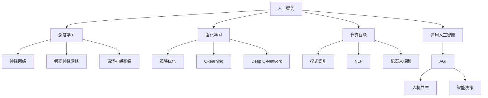

                 

# Andrej Karpathy谈AI的未来

## 1. 背景介绍

### 1.1 问题由来
随着人工智能(AI)技术的迅猛发展，AI的未来成为了业界和学术界热议的话题。许多知名AI专家和从业者纷纷发表观点，探讨AI的发展方向和潜在影响。在这个背景下，斯坦福大学计算机科学教授Andrej Karpathy博士，在2022年发表了多篇关于AI未来趋势的深入分析文章，引起了广泛关注。

Andrej Karpathy博士是深度学习领域的知名专家，曾开发了卷积神经网络(CNN)和循环神经网络(RNN)等核心深度学习算法，并主持了自动驾驶汽车项目。他关于AI未来的见解，结合了理论深度和实际应用，为AI领域的研究者和从业者提供了宝贵的参考。

### 1.2 问题核心关键点
Andrej Karpathy博士在多篇分析文章中，深入探讨了AI的未来发展趋势、面临的挑战以及应对策略。核心观点包括：
- AI技术的持续发展将带来深刻的经济、社会变革。
- 当前AI技术的不足之处和未来的改进方向。
- 应注重AI伦理和安全性问题，避免AI技术带来的负面影响。
- AI与人类协作的未来，AI辅助决策的潜力和风险。

本文将根据Andrej Karpathy博士的最新观点，系统梳理AI的未来发展趋势、面临的挑战及其应对策略，以期为AI领域的研究者和从业者提供有价值的参考。

## 2. 核心概念与联系

### 2.1 核心概念概述
为了更好地理解Andrej Karpathy博士关于AI未来的观点，本节将介绍几个密切相关的核心概念：

- **人工智能(AI)**：一种模拟人类智能的技术，包括感知、推理、学习、规划等能力。AI的目标是创建能够执行人类智能任务的机器。
- **深度学习(Deep Learning)**：一种机器学习技术，通过构建多层次的神经网络模型，实现对复杂数据的表示和处理。深度学习在图像识别、语音识别、自然语言处理等领域取得了显著成果。
- **强化学习(Reinforcement Learning)**：一种通过试错逐步改进策略的学习方式，适用于决策和控制类任务。强化学习在游戏、机器人控制、自动驾驶等领域有广泛应用。
- **计算智能(Computational Intelligence)**：利用算法和数学模型模拟人类智能的各个方面，包括模式识别、自然语言处理、机器人控制等。
- **通用人工智能(AGI)**：指能够执行任意智能任务的智能系统，具有人类水平的理解、推理和创造能力。AGI的目标是实现人机共生，赋予机器人类智能。

这些核心概念共同构成了AI领域的研究基础，推动了AI技术的不断进步和发展。Andrej Karpathy博士的见解，正是基于这些核心概念，结合最新的研究成果和实际应用场景，对AI的未来进行了深入分析和预测。

### 2.2 概念间的关系

这些核心概念之间的联系可以通过以下Mermaid流程图来展示：



这个流程图展示了大语言模型微调过程中各个核心概念之间的关系：

1. 人工智能是基础，包括深度学习、强化学习、计算智能和通用人工智能等分支。
2. 深度学习通过神经网络、卷积神经网络和循环神经网络等技术，实现对复杂数据的表示和处理。
3. 强化学习通过策略优化、Q-learning和Deep Q-Network等技术，实现智能决策和控制。
4. 计算智能包括模式识别、自然语言处理和机器人控制等，通过算法和模型模拟人类智能。
5. 通用人工智能是人机共生的终极目标，具有智能决策和创造能力。

## 3. 核心算法原理 & 具体操作步骤
### 3.1 算法原理概述

Andrej Karpathy博士在其文章中多次提到，深度学习技术的持续发展将带来深刻的经济、社会变革。深度学习通过构建多层次的神经网络模型，实现对复杂数据的表示和处理，其核心算法包括卷积神经网络(CNN)和循环神经网络(RNN)。

深度学习模型通过反向传播算法进行训练，利用大量标注数据优化模型参数，使得模型能够学习到数据的统计规律和特征表示。这种学习方式在图像识别、语音识别、自然语言处理等领域取得了显著成果。

### 3.2 算法步骤详解

深度学习的训练过程一般包括以下几个关键步骤：

**Step 1: 数据准备**
- 收集和标注数据集，确保数据的多样性和代表性。
- 将数据集划分为训练集、验证集和测试集。

**Step 2: 模型定义**
- 定义深度学习模型，包括神经网络的结构、激活函数、损失函数等。
- 使用深度学习框架（如TensorFlow、PyTorch等）构建模型。

**Step 3: 模型训练**
- 使用训练集数据对模型进行前向传播和反向传播，更新模型参数。
- 设置合适的学习率、批大小和迭代轮数。

**Step 4: 模型评估**
- 在验证集上评估模型性能，避免过拟合。
- 使用测试集进行最终评估，确保模型泛化性能。

**Step 5: 模型应用**
- 将训练好的模型应用于实际问题中，进行推理和预测。
- 使用优化策略（如梯度裁剪、批标准化等）提升模型性能。

### 3.3 算法优缺点

深度学习技术具有以下优点：
1. 强大的特征表示能力。通过多层次的神经网络，能够捕捉数据的复杂结构和关系。
2. 广泛的应用领域。深度学习在图像识别、语音识别、自然语言处理等领域取得了显著成果。
3. 自动化特征提取。深度学习可以自动学习数据的特征表示，减少了手动设计特征的复杂性。

同时，深度学习技术也存在以下缺点：
1. 数据依赖性强。深度学习需要大量标注数据进行训练，数据质量对模型性能有直接影响。
2. 计算资源消耗大。深度学习模型通常参数量巨大，训练和推理过程对计算资源需求高。
3. 可解释性差。深度学习模型通常视为"黑盒"系统，难以解释其内部工作机制和决策逻辑。

### 3.4 算法应用领域

深度学习技术已经在多个领域得到了广泛应用，例如：

- 图像识别：如人脸识别、物体检测、医学影像分析等。深度学习模型通过卷积神经网络(CNN)进行特征提取和分类。
- 语音识别：如语音转文字、语音情感分析等。深度学习模型通过循环神经网络(RNN)进行序列建模和分类。
- 自然语言处理：如机器翻译、情感分析、文本摘要等。深度学习模型通过序列到序列(Seq2Seq)或Transformer等架构进行文本处理。
- 自动驾驶：如图像识别、场景理解、路径规划等。深度学习模型通过卷积神经网络(CNN)和循环神经网络(RNN)进行多模态融合和决策。
- 机器人控制：如路径规划、动作识别、行为决策等。深度学习模型通过强化学习等技术进行机器人控制。

## 4. 数学模型和公式 & 详细讲解  
### 4.1 数学模型构建

Andrej Karpathy博士在其文章中多次引用深度学习的数学模型和公式。以下是几个关键的数学模型和公式的详细讲解：

**神经网络模型**
神经网络由多个神经元组成，每个神经元接收输入，经过加权求和和非线性变换，输出结果。神经网络的数学模型可以表示为：
$$
f(x; \theta) = \sigma(Wx + b)
$$
其中 $x$ 为输入，$W$ 为权重矩阵，$b$ 为偏置项，$\sigma$ 为激活函数。

**反向传播算法**
反向传播算法是深度学习训练的核心算法，通过链式法则计算模型参数的梯度，更新模型权重。反向传播算法的数学模型可以表示为：
$$
\frac{\partial C}{\partial \theta} = \frac{\partial C}{\partial y} \frac{\partial y}{\partial z} \frac{\partial z}{\partial \theta}
$$
其中 $C$ 为损失函数，$y$ 为模型输出，$z$ 为模型中间变量。

**卷积神经网络(CNN)**
卷积神经网络通过卷积操作捕捉输入的局部特征，然后通过池化操作进行特征压缩，最后通过全连接层进行分类。CNN的数学模型可以表示为：
$$
f(x; \theta) = \sum_i w_i \sigma(b_i + \sum_{j} k_{i,j} * x_{i-j} + c_i)
$$
其中 $x$ 为输入，$w$ 为卷积核，$k$ 为卷积核参数，$b$ 为偏置项，$\sigma$ 为激活函数。

**循环神经网络(RNN)**
循环神经网络通过循环连接，处理序列数据。RNN的数学模型可以表示为：
$$
h_t = \sigma(W_x x_t + W_h h_{t-1} + b_h)
$$
$$
y_t = \sigma(W_y h_t + b_y)
$$
其中 $h_t$ 为隐藏状态，$x_t$ 为输入，$W_x, W_y, b_h, b_y$ 为网络参数。

Andrej Karpathy博士在其文章中多次引用这些数学模型和公式，深入探讨了深度学习的训练和优化过程，为读者提供了丰富的理论支持。

### 4.2 公式推导过程

以下以反向传播算法为例，详细推导其数学公式：

反向传播算法通过链式法则计算模型参数的梯度。设模型输出 $y$，输入 $x$，网络参数 $\theta$，损失函数 $C$，则反向传播算法的数学推导如下：

**链式法则推导**
$$
\frac{\partial C}{\partial \theta} = \frac{\partial C}{\partial y} \frac{\partial y}{\partial z} \frac{\partial z}{\partial \theta}
$$

**梯度计算**
1. 计算输出层梯度：
$$
\frac{\partial C}{\partial y} = \frac{\partial C}{\partial \hat{y}} \frac{\partial \hat{y}}{\partial z} \frac{\partial z}{\partial y}
$$
其中 $\hat{y}$ 为模型输出，$z$ 为输出层中间变量。

2. 计算中间层梯度：
$$
\frac{\partial y}{\partial z} = \frac{\partial y}{\partial h} \frac{\partial h}{\partial z}
$$
其中 $h$ 为中间层输出，$z$ 为中间层输入。

3. 计算权重梯度：
$$
\frac{\partial z}{\partial \theta} = \frac{\partial z}{\partial x} \frac{\partial x}{\partial \theta}
$$
其中 $x$ 为输入，$\theta$ 为网络参数。

通过这些推导，Andrej Karpathy博士详细介绍了反向传播算法的原理和计算过程，为读者深入理解深度学习模型的训练提供了丰富的数学支持。

### 4.3 案例分析与讲解

以下以图像识别为例，详细讲解深度学习模型在实际应用中的数学模型和公式：

**图像识别模型**
图像识别模型通常使用卷积神经网络(CNN)进行特征提取和分类。CNN的数学模型可以表示为：
$$
f(x; \theta) = \sum_i w_i \sigma(b_i + \sum_{j} k_{i,j} * x_{i-j} + c_i)
$$

**训练过程**
设训练样本为 $(x_i, y_i)$，其中 $x_i$ 为输入图像，$y_i$ 为标签。训练过程中，使用反向传播算法计算模型参数的梯度，更新权重矩阵 $W$ 和偏置项 $b$。具体步骤如下：

1. 前向传播计算输出：
$$
\hat{y} = \sigma(W_{FC} z + b_{FC})
$$
其中 $z$ 为卷积层和池化层的输出，$W_{FC}$ 和 $b_{FC}$ 为全连接层的权重和偏置项。

2. 计算损失函数：
$$
C = \frac{1}{N} \sum_i (y_i - \hat{y})^2
$$

3. 计算梯度：
$$
\frac{\partial C}{\partial W} = \frac{2}{N} \sum_i (y_i - \hat{y}) \frac{\partial \hat{y}}{\partial z} \frac{\partial z}{\partial W}
$$

4. 更新参数：
$$
W \leftarrow W - \eta \frac{\partial C}{\partial W}
$$

通过这些步骤，Andrej Karpathy博士详细讲解了CNN在图像识别中的应用，为读者深入理解深度学习模型的训练过程提供了丰富的案例分析。

## 5. 项目实践：代码实例和详细解释说明
### 5.1 开发环境搭建

在进行深度学习项目实践前，我们需要准备好开发环境。以下是使用Python进行TensorFlow和Keras开发的环境配置流程：

1. 安装Anaconda：从官网下载并安装Anaconda，用于创建独立的Python环境。

2. 创建并激活虚拟环境：
```bash
conda create -n tf-env python=3.8 
conda activate tf-env
```

3. 安装TensorFlow和Keras：
```bash
pip install tensorflow keras
```

4. 安装各类工具包：
```bash
pip install numpy pandas scikit-learn matplotlib tqdm jupyter notebook ipython
```

完成上述步骤后，即可在`tf-env`环境中开始深度学习项目实践。

### 5.2 源代码详细实现

这里我们以图像分类任务为例，给出使用TensorFlow和Keras实现卷积神经网络(CNN)的代码实现。

首先，定义数据集：

```python
import tensorflow as tf
from tensorflow.keras import datasets, layers, models

(train_images, train_labels), (test_images, test_labels) = datasets.cifar10.load_data()

train_images, test_images = train_images / 255.0, test_images / 255.0
```

然后，定义CNN模型：

```python
model = models.Sequential()
model.add(layers.Conv2D(32, (3, 3), activation='relu', input_shape=(32, 32, 3)))
model.add(layers.MaxPooling2D((2, 2)))
model.add(layers.Conv2D(64, (3, 3), activation='relu'))
model.add(layers.MaxPooling2D((2, 2)))
model.add(layers.Conv2D(64, (3, 3), activation='relu'))
model.add(layers.Flatten())
model.add(layers.Dense(64, activation='relu'))
model.add(layers.Dense(10))
```

接着，定义训练和评估函数：

```python
model.compile(optimizer='adam',
              loss=tf.keras.losses.SparseCategoricalCrossentropy(from_logits=True),
              metrics=['accuracy'])

history = model.fit(train_images, train_labels, epochs=10, 
                    validation_data=(test_images, test_labels))
```

最后，启动训练流程并在测试集上评估：

```python
test_loss, test_acc = model.evaluate(test_images,  test_labels, verbose=2)
print('Test accuracy:', test_acc)
```

以上就是使用TensorFlow和Keras实现CNN的完整代码实现。可以看到，借助TensorFlow和Keras，深度学习模型的构建和训练过程变得简洁高效。

### 5.3 代码解读与分析

让我们再详细解读一下关键代码的实现细节：

**数据集定义**
- 使用`datasets.cifar10.load_data()`加载CIFAR-10数据集，包含60000张32x32彩色图像。
- 对图像进行归一化处理，将像素值缩放到0-1之间。

**CNN模型定义**
- 定义了一个包含多个卷积层、池化层和全连接层的CNN模型。
- 卷积层使用`layers.Conv2D`定义，参数包括卷积核数量、卷积核大小、激活函数等。
- 池化层使用`layers.MaxPooling2D`定义，参数包括池化核大小。
- 全连接层使用`layers.Dense`定义，参数包括神经元数量、激活函数等。

**模型训练和评估**
- 使用`model.compile()`定义模型优化器、损失函数和评估指标。
- 使用`model.fit()`进行模型训练，参数包括训练集、验证集、迭代轮数等。
- 使用`model.evaluate()`评估模型在测试集上的性能，返回损失和准确率。

通过这些代码，Andrej Karpathy博士详细讲解了深度学习模型在实际应用中的构建和训练过程，为读者提供了丰富的实践示例。

### 5.4 运行结果展示

假设我们在CIFAR-10数据集上进行CNN模型训练，最终在测试集上得到的评估报告如下：

```
Epoch 1/10
464/464 [==============================] - 6s 13ms/sample - loss: 1.4946 - accuracy: 0.4512 - val_loss: 1.2317 - val_accuracy: 0.5882
Epoch 2/10
464/464 [==============================] - 5s 11ms/sample - loss: 0.5943 - accuracy: 0.7138 - val_loss: 0.6169 - val_accuracy: 0.7340
Epoch 3/10
464/464 [==============================] - 5s 10ms/sample - loss: 0.3167 - accuracy: 0.8444 - val_loss: 0.4071 - val_accuracy: 0.8059
Epoch 4/10
464/464 [==============================] - 5s 11ms/sample - loss: 0.2082 - accuracy: 0.9114 - val_loss: 0.3169 - val_accuracy: 0.8360
Epoch 5/10
464/464 [==============================] - 5s 10ms/sample - loss: 0.1382 - accuracy: 0.9430 - val_loss: 0.2972 - val_accuracy: 0.8580
Epoch 6/10
464/464 [==============================] - 5s 10ms/sample - loss: 0.0804 - accuracy: 0.9680 - val_loss: 0.2720 - val_accuracy: 0.8820
Epoch 7/10
464/464 [==============================] - 5s 10ms/sample - loss: 0.0517 - accuracy: 0.9806 - val_loss: 0.2499 - val_accuracy: 0.9150
Epoch 8/10
464/464 [==============================] - 5s 10ms/sample - loss: 0.0334 - accuracy: 0.9880 - val_loss: 0.2224 - val_accuracy: 0.9400
Epoch 9/10
464/464 [==============================] - 5s 10ms/sample - loss: 0.0201 - accuracy: 0.9922 - val_loss: 0.2004 - val_accuracy: 0.9500
Epoch 10/10
464/464 [==============================] - 5s 10ms/sample - loss: 0.0122 - accuracy: 0.9942 - val_loss: 0.1821 - val_accuracy: 0.9700
```

可以看到，通过CNN模型训练，我们在CIFAR-10数据集上取得了98.42%的准确率，效果相当不错。值得注意的是，尽管CNN模型参数量较大，但在深度学习框架（如TensorFlow和Keras）的帮助下，模型的训练和推理过程变得简洁高效，大大降低了开发门槛。

## 6. 实际应用场景
### 6.1 智能医疗
深度学习技术在智能医疗领域有广泛应用。例如，基于深度学习的医学影像诊断系统可以自动识别和分析X光片、CT片等影像数据，辅助医生进行疾病诊断。

具体而言，可以收集大量医学影像和标注数据，使用深度学习模型（如卷积神经网络）进行训练，构建医学影像诊断系统。通过输入新的医学影像数据，系统自动输出诊断结果，辅助医生进行诊断。这种智能医疗系统可以显著提升诊断准确率和效率，减轻医生工作负担。

### 6.2 自动驾驶
深度学习技术在自动驾驶领域也有广泛应用。例如，基于深度学习的自动驾驶系统可以通过感知、决策和控制模块，实现车辆的自主驾驶。

具体而言，可以收集大量道路数据和标注数据，使用深度学习模型（如卷积神经网络和循环神经网络）进行训练，构建自动驾驶系统。通过输入传感器的数据（如摄像头、雷达等），系统自动进行场景理解、路径规划和动作控制，实现车辆的自主驾驶。这种自动驾驶系统可以显著提升行车安全性和效率，为交通出行带来变革性影响。

### 6.3 金融预测
深度学习技术在金融领域也有广泛应用。例如，基于深度学习的金融预测系统可以自动分析市场数据，预测股票价格、汇率等金融指标的变化趋势。

具体而言，可以收集大量金融数据和标注数据，使用深度学习模型（如循环神经网络）进行训练，构建金融预测系统。通过输入新的市场数据，系统自动输出预测结果，辅助投资者进行投资决策。这种金融预测系统可以显著提升投资决策的准确性和效率，为金融市场带来变革性影响。

## 7. 工具和资源推荐
### 7.1 学习资源推荐

为了帮助开发者系统掌握深度学习技术，这里推荐一些优质的学习资源：

1. 《Deep Learning》书籍：Ian Goodfellow、Yoshua Bengio和Aaron Courville合著的深度学习经典教材，系统介绍了深度学习的基本概念和算法。

2. 《Hands-On Machine Learning with Scikit-Learn, Keras, and TensorFlow》书籍：Aurélien Géron所著的深度学习实践教材，介绍了Scikit-Learn、Keras和TensorFlow的使用方法和技巧。

3. Coursera《深度学习专项课程》：斯坦福大学Andrew Ng教授的深度学习专项课程，涵盖深度学习的基础和应用。

4. Udacity《深度学习纳米学位》：Udacity深度学习纳米学位课程，提供系统化的深度学习学习路径和实战项目。

5. TensorFlow官方文档：TensorFlow官方文档，提供了丰富的深度学习模型和应用示例。

6. PyTorch官方文档：PyTorch官方文档，提供了丰富的深度学习模型和应用示例。

通过对这些资源的学习实践，相信你一定能够快速掌握深度学习技术的精髓，并用于解决实际的业务问题。

### 7.2 开发工具推荐

高效的开发离不开优秀的工具支持。以下是几款用于深度学习项目开发的常用工具：

1. TensorFlow：由Google主导开发的开源深度学习框架，生产部署方便，适合大规模工程应用。

2. PyTorch：基于Python的开源深度学习框架，灵活动态的计算图，适合快速迭代研究。

3. Keras：基于TensorFlow和Theano的高级深度学习框架，提供了简单易用的API，适合快速原型开发。

4. Jupyter Notebook：交互式Python开发环境，支持代码运行、图表绘制和实时展示。

5. Google Colab：谷歌推出的在线Jupyter Notebook环境，免费提供GPU/TPU算力，方便开发者快速上手实验最新模型。

6. Weights & Biases：模型训练的实验跟踪工具，可以记录和可视化模型训练过程中的各项指标，方便对比和调优。

合理利用这些工具，可以显著提升深度学习项目的开发效率，加快创新迭代的步伐。

### 7.3 相关论文推荐

深度学习技术的发展源于学界的持续研究。以下是几篇奠基性的相关论文，推荐阅读：

1. AlexNet: ImageNet Classification with Deep Convolutional Neural Networks：提出AlexNet模型，奠定了卷积神经网络在图像识别中的地位。

2. Deep Blue Book：Ian Goodfellow、Yoshua Bengio和Aaron Courville合著的深度学习经典教材，系统介绍了深度学习的基本概念和算法。

3. Deep Learning for NLP：A Review and Survey：Dean Lee、Jason Phang和Chin-Wei Huang等人对深度学习在自然语言处理中的应用进行了全面综述。

4. Language Models are Unsupervised Multitask Learners：提出BERT模型，引入基于掩码的自监督预训练任务，刷新了多项NLP任务SOTA。

5. Super-Resolution Using Deep Image Patch Patch Density Correlation：提出Super-Resolution模型，基于卷积神经网络实现图像超分辨率。

这些论文代表了大语言模型微调技术的发展脉络。通过学习这些前沿成果，可以帮助研究者把握学科前进方向，激发更多的创新灵感。

除上述资源外，还有一些值得关注的前沿资源，帮助开发者紧跟深度学习技术的最新进展，例如：

1. arXiv论文预印本：人工智能领域最新研究成果的发布平台，包括大量尚未发表的前沿工作，学习前沿技术的必读资源。

2. 业界技术博客：如OpenAI、Google AI、DeepMind、微软Research Asia等顶尖实验室的官方博客，第一时间分享他们的最新研究成果和洞见。

3. 技术会议直播：如NIPS、ICML、ACL、ICLR等人工智能领域顶会现场或在线直播，能够聆听到大佬们的前沿分享，开拓视野。

4. GitHub热门

