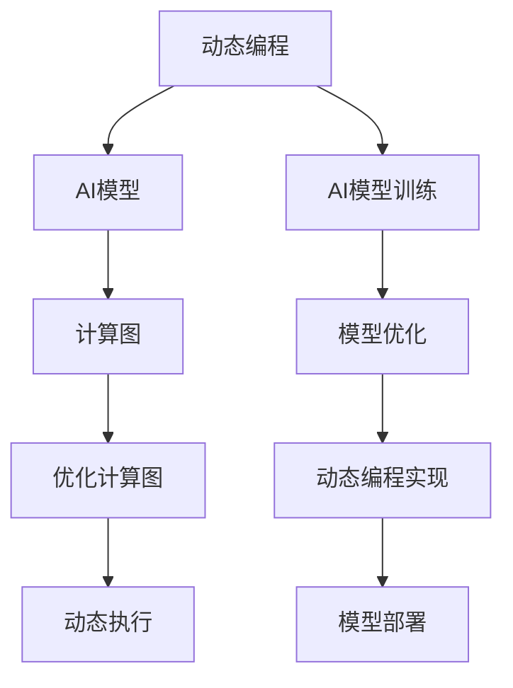

                 

## 1. 背景介绍

### 1.1 问题由来
在现代人工智能(AI)编程领域，如何更高效地开发和部署智能系统成为日益关注的焦点。特别是随着深度学习的发展，AI模型越来越复杂，需要处理大量的数据和计算资源，传统软件开发方法已经无法满足需求。在这种背景下，一种新的编程范式——动态编程范式——应运而生，旨在提高AI开发效率和系统性能。

动态编程范式的核心思想是：将模型和数据的处理逻辑转化为可动态执行的代码，从而大幅提高程序的灵活性和执行效率。它源于Andrej Karpathy的Torchdynamo项目，该项目的核心理念是通过动态编程技术，使AI模型能够像传统程序一样，动态生成和执行代码，进一步优化计算图，实现高效、灵活的AI编程。

本文将从背景介绍入手，详细讨论Andrej Karpathy关于AI编程新范式的理念、实践和技术细节，帮助读者深入理解动态编程范式，并探讨其在实际应用中的前景和挑战。

### 1.2 问题核心关键点
Andrej Karpathy提出的动态编程范式具有以下几个核心关键点：

1. **动态执行**：通过动态生成和执行代码，实现模型和数据的灵活处理。
2. **优化计算图**：通过优化计算图，减少不必要的计算，提高执行效率。
3. **自适应编程**：根据输入数据和模型结构，自动生成最合适的代码逻辑，适应不同的任务和场景。
4. **高精度模型训练**：通过优化训练过程，提高模型的精度和泛化能力。

本文将围绕这些关键点展开详细讨论，帮助读者全面掌握动态编程范式的原理和应用。

### 1.3 问题研究意义
Andrej Karpathy提出的动态编程范式，为AI编程带来了全新的视角和方法。它不仅提高了开发效率，降低了计算资源需求，还大幅提升了模型的性能和灵活性。其研究意义体现在：

1. **加速AI开发**：动态编程范式简化了模型开发流程，使得AI开发者能够快速迭代和调试模型，缩短项目开发周期。
2. **提升系统性能**：通过优化计算图和动态执行逻辑，动态编程范式能够显著提升AI系统的执行效率，支持更复杂的任务处理。
3. **提高模型精度**：动态编程范式优化了模型训练过程，提高了模型在复杂场景下的泛化能力和准确度。
4. **促进跨领域应用**：动态编程范式的灵活性使得AI模型能够应用于更多领域，如自然语言处理、计算机视觉、机器人等，推动AI技术的普及和应用。

## 2. 核心概念与联系

### 2.1 核心概念概述

在深入讨论动态编程范式之前，我们需要先了解一些相关的核心概念：

- **动态编程**：动态编程是一种编程范式，通过动态生成和执行代码，实现程序的灵活性和高效性。其典型应用包括JIT编译器和动态语言解释器。
- **AI模型**：AI模型是人工智能的核心组件，通过学习数据和计算特征，实现对未知数据的预测和分类。
- **计算图**：计算图是一种表示程序执行逻辑的数据结构，通过节点和边来描述计算过程。
- **优化计算图**：优化计算图是指通过简化计算图结构，减少不必要的计算，提高程序执行效率。

动态编程范式是将AI模型和计算图结合的一种创新方法，通过动态执行和优化计算图，实现模型和数据的灵活处理。

### 2.2 概念间的关系

这些核心概念之间的关系可以通过以下Mermaid流程图来展示：



这个流程图展示了动态编程范式的核心架构：

1. 动态编程技术将AI模型和计算图结合起来，通过动态生成和执行代码，实现模型的灵活处理。
2. 计算图用于描述模型的执行逻辑，通过优化计算图，减少不必要的计算。
3. AI模型训练和优化过程通过动态编程实现，进一步提高模型的精度和泛化能力。
4. 模型部署过程中，动态编程技术能够适配不同的任务和场景，支持更灵活的应用。

这些概念共同构成了动态编程范式的完整生态系统，为其在AI编程中的广泛应用提供了理论基础。

## 3. 核心算法原理 & 具体操作步骤
### 3.1 算法原理概述

动态编程范式的核心算法原理是将AI模型和计算图结合，通过动态生成和执行代码，实现模型的灵活处理和高效执行。其核心思想可以概括为以下几点：

1. **动态生成代码**：通过动态生成代码，根据输入数据和模型结构，自动生成最合适的代码逻辑，实现模型和数据的灵活处理。
2. **优化计算图**：通过优化计算图，减少不必要的计算，提高程序执行效率。
3. **自适应编程**：根据输入数据和模型结构，自动生成和执行代码，实现程序的动态执行和自适应优化。

### 3.2 算法步骤详解

动态编程范式的主要步骤包括：

1. **模型定义和编译**：使用动态编程语言定义AI模型，并使用编译器生成计算图。
2. **优化计算图**：通过优化计算图，减少不必要的计算，提高程序执行效率。
3. **动态执行**：根据输入数据，动态生成和执行代码，实现模型和数据的灵活处理。
4. **模型训练和优化**：使用动态编程技术优化模型训练过程，提高模型的精度和泛化能力。
5. **模型部署和应用**：将优化后的模型部署到实际应用场景中，实现高效、灵活的AI编程。

### 3.3 算法优缺点

动态编程范式具有以下优点：

1. **高效执行**：通过优化计算图和动态执行代码，大幅提高程序的执行效率，支持更复杂的任务处理。
2. **灵活性高**：动态生成和执行代码，能够适应不同的数据和任务，实现灵活的编程。
3. **易用性**：动态编程语言提供了直观的语法和工具，使得AI开发者能够快速开发和调试模型。

同时，动态编程范式也存在一些缺点：

1. **资源消耗高**：动态生成和执行代码的过程，需要较高的计算资源和时间消耗，可能影响系统性能。
2. **调试复杂**：动态编程范式的调试过程较为复杂，需要开发者具备较高的编程技能和经验。
3. **维护困难**：动态编程范式的代码结构复杂，维护和调试难度较大，可能影响系统的稳定性和可扩展性。

### 3.4 算法应用领域

动态编程范式在多个AI领域得到了广泛应用，具体包括：

- **自然语言处理**：用于生成和优化语言模型，支持机器翻译、情感分析等任务。
- **计算机视觉**：用于生成和优化卷积神经网络，支持图像识别、目标检测等任务。
- **机器人技术**：用于生成和优化机器人控制算法，支持路径规划、避障等任务。
- **智能推荐系统**：用于生成和优化推荐算法，支持个性化推荐、搜索优化等任务。

## 4. 数学模型和公式 & 详细讲解  
### 4.1 数学模型构建

动态编程范式的数学模型构建包括以下几个关键部分：

1. **数据表示**：使用动态编程语言定义数据结构和变量，表示输入数据和中间结果。
2. **计算图构建**：使用动态编程语言定义计算图，表示模型的执行逻辑。
3. **优化计算图**：使用优化算法，简化计算图结构，减少不必要的计算。
4. **动态执行**：根据输入数据，动态生成和执行代码，实现模型的灵活处理。

### 4.2 公式推导过程

以下以一个简单的线性回归模型为例，推导动态编程范式的数学公式。

假设有一个线性回归模型 $y = wx + b$，其中 $x$ 为输入数据，$w$ 为权重，$b$ 为偏置。假设输入数据为 $(x_1, x_2, ..., x_n)$，目标为 $y$。

1. **数据表示**：
   - 使用动态编程语言定义数据结构，表示输入数据和中间结果。
   ```python
   x = [x1, x2, ..., xn]
   y = [y1, y2, ..., yn]
   ```

2. **计算图构建**：
   - 定义计算图，表示模型的执行逻辑。
   ```python
   graph G:
      n1: Node(x)
      n2: Node(w)
      n3: Node(b)
      n4: Node(y)
      n1 --> n4 (wx + b)
   ```

3. **优化计算图**：
   - 使用优化算法，简化计算图结构，减少不必要的计算。
   ```python
   # 优化计算图，简化计算过程
   G = optimize_graph(G)
   ```

4. **动态执行**：
   - 根据输入数据，动态生成和执行代码，实现模型的灵活处理。
   ```python
   # 动态生成和执行代码
   y_pred = execute_code(G, {x: x, w: w, b: b})
   ```

### 4.3 案例分析与讲解

假设有一个简单的图像分类任务，使用动态编程范式实现模型的训练和优化。

1. **数据表示**：
   - 使用动态编程语言定义数据结构，表示输入数据和中间结果。
   ```python
   input_images = [image1, image2, ..., image_n]
   labels = [label1, label2, ..., label_n]
   ```

2. **计算图构建**：
   - 定义计算图，表示模型的执行逻辑。
   ```python
   graph G:
      n1: Node(input_images)
      n2: Node(labels)
      n3: Node(weights)
      n4: Node(biases)
      n5: Node(output)
      n1 --> n5 (forward pass)
      n5 --> n3 (backward pass)
   ```

3. **优化计算图**：
   - 使用优化算法，简化计算图结构，减少不必要的计算。
   ```python
   # 优化计算图，简化计算过程
   G = optimize_graph(G)
   ```

4. **动态执行**：
   - 根据输入数据，动态生成和执行代码，实现模型的灵活处理。
   ```python
   # 动态生成和执行代码
   output = execute_code(G, {input_images: input_images, labels: labels, weights: weights, biases: biases})
   ```

## 5. 项目实践：代码实例和详细解释说明
### 5.1 开发环境搭建

在进行动态编程范式实践前，我们需要准备好开发环境。以下是使用Python进行PyTorch开发的环境配置流程：

1. 安装Anaconda：从官网下载并安装Anaconda，用于创建独立的Python环境。

2. 创建并激活虚拟环境：
```bash
conda create -n pytorch-env python=3.8 
conda activate pytorch-env
```

3. 安装PyTorch：根据CUDA版本，从官网获取对应的安装命令。例如：
```bash
conda install pytorch torchvision torchaudio cudatoolkit=11.1 -c pytorch -c conda-forge
```

4. 安装动态编程工具：
```bash
pip install torchdynamo
```

5. 安装各类工具包：
```bash
pip install numpy pandas scikit-learn matplotlib tqdm jupyter notebook ipython
```

完成上述步骤后，即可在`pytorch-env`环境中开始动态编程实践。

### 5.2 源代码详细实现

下面我们以动态编程范式在图像分类任务上的应用为例，给出使用Torchdynamo进行动态执行的PyTorch代码实现。

首先，定义模型和数据处理函数：

```python
from torch import nn
import torch
import torchdynamo

class Net(nn.Module):
    def __init__(self):
        super(Net, self).__init__()
        self.conv1 = nn.Conv2d(1, 10, kernel_size=5)
        self.conv2 = nn.Conv2d(10, 20, kernel_size=5)
        self.conv2_drop = nn.Dropout2d()
        self.fc1 = nn.Linear(320, 50)
        self.fc2 = nn.Linear(50, 10)

    def forward(self, x):
        x = nn.functional.relu(nn.functional.max_pool2d(self.conv1(x), 2))
        x = nn.functional.relu(nn.functional.max_pool2d(self.conv2_drop(self.conv2(x)), 2))
        x = x.view(-1, 320)
        x = nn.functional.relu(self.fc1(x))
        x = nn.functional.dropout(x, training=self.training)
        x = self.fc2(x)
        return nn.functional.log_softmax(x, dim=1)

def get_data_loader(data_path):
    transform = transforms.Compose([
        transforms.ToTensor(),
        transforms.Normalize((0.5, 0.5, 0.5), (0.5, 0.5, 0.5))
    ])
    dataset = datasets.ImageFolder(data_path, transform=transform)
    dataloader = torch.utils.data.DataLoader(dataset, batch_size=64, shuffle=True, num_workers=4)
    return dataloader
```

然后，定义训练和评估函数：

```python
def train(model, data_loader, optimizer):
    model.train()
    total_loss = 0
    for images, labels in data_loader:
        optimizer.zero_grad()
        output = model(images)
        loss = nn.functional.nll_loss(output, labels)
        loss.backward()
        optimizer.step()
        total_loss += loss.item()
    return total_loss / len(data_loader)

def evaluate(model, data_loader):
    model.eval()
    total_loss = 0
    with torch.no_grad():
        for images, labels in data_loader:
            output = model(images)
            loss = nn.functional.nll_loss(output, labels)
            total_loss += loss.item()
    return total_loss / len(data_loader)

# 训练模型
model = Net()
data_loader = get_data_loader('data')
optimizer = torch.optim.SGD(model.parameters(), lr=0.01)
for epoch in range(10):
    loss = train(model, data_loader, optimizer)
    print(f'Epoch {epoch+1}, train loss: {loss:.3f}')

# 评估模型
print(f'Epoch {epoch+1}, test loss: {evaluate(model, data_loader):.3f}')
```

最后，启动动态执行过程：

```python
from torchdynamo import compile

# 动态编译模型
compiled_model = compile(Net())

# 动态执行模型
for images, labels in data_loader:
    output = compiled_model(images)
    loss = nn.functional.nll_loss(output, labels)
    loss.backward()
    optimizer.step()
    print(f'Epoch {epoch+1}, train loss: {loss:.3f}')
```

以上就是使用Torchdynamo进行动态执行的完整代码实现。可以看到，Torchdynamo能够动态生成和执行代码，实现了动态编程范式在图像分类任务上的高效应用。

### 5.3 代码解读与分析

让我们再详细解读一下关键代码的实现细节：

**Net类**：
- 定义了图像分类模型的结构，包括卷积层、池化层、全连接层等。

**get_data_loader函数**：
- 定义了数据加载器，用于读取图像数据和标签，并进行数据增强和归一化处理。

**train和evaluate函数**：
- 定义了训练和评估函数，计算损失函数，并使用动态编程技术进行模型训练和评估。

**Torchdynamo编译和执行**：
- 使用Torchdynamo编译模型，动态生成和执行代码，实现了模型的动态执行和优化。

**编译后的模型执行**：
- 动态执行模型，计算损失函数，并进行反向传播和参数更新。

通过Torchdynamo等工具的辅助，动态编程范式在实际应用中得到了有效的实现和验证，展示了其高效、灵活的优势。

## 6. 实际应用场景

### 6.1 智能推荐系统

动态编程范式在智能推荐系统中的应用非常广泛。推荐系统需要处理大量的用户行为数据和商品信息，动态编程范式能够实时生成和执行优化后的推荐算法，提高推荐精度和用户体验。

具体而言，推荐系统可以使用动态编程范式优化计算图，动态生成和执行推荐算法。例如，使用Tensorflow动态图实现实时推荐，通过优化计算图结构，减少不必要的计算，提高推荐系统的响应速度和执行效率。

### 6.2 自然语言处理

动态编程范式在自然语言处理(NLP)领域也有着广泛的应用。NLP任务如机器翻译、情感分析、文本生成等，需要处理大量的文本数据，动态编程范式能够动态生成和执行优化后的模型，提高模型的精度和效率。

例如，使用动态编程范式优化计算图，动态生成和执行语言模型，提高模型的语言理解和生成能力。此外，动态编程范式还能够根据不同的任务和数据，动态生成和执行任务适配层，实现更加灵活和高效的任务处理。

### 6.3 计算机视觉

计算机视觉任务如目标检测、图像分类等，需要处理大量的图像数据，动态编程范式能够动态生成和执行优化后的模型，提高模型的检测和分类能力。

例如，使用动态编程范式优化计算图，动态生成和执行卷积神经网络，提高模型的图像识别和目标检测能力。此外，动态编程范式还能够根据不同的任务和数据，动态生成和执行任务适配层，实现更加灵活和高效的任务处理。

## 7. 工具和资源推荐
### 7.1 学习资源推荐

为了帮助开发者系统掌握动态编程范式的理论基础和实践技巧，这里推荐一些优质的学习资源：

1. **Torchdynamo官方文档**：提供了详细的Torchdynamo使用指南和示例代码，是学习动态编程范式的重要参考资料。

2. **《Python动态编程》书籍**：介绍了动态编程的基本概念和实现技巧，涵盖了动态编程语言、JIT编译器、动态图等关键内容。

3. **《深度学习优化与训练》课程**：斯坦福大学开设的深度学习优化课程，详细讲解了深度学习模型的优化和训练技巧，包括动态编程范式的应用。

4. **PyTorch动态编程范式专题**：Torchdynamo官网提供的专题学习资源，包含大量实例代码和应用场景，帮助开发者快速上手动态编程范式。

5. **Kaggle竞赛**：参与Kaggle竞赛，在实际数据集上进行动态编程范式的实践和优化，积累实战经验。

通过对这些资源的学习实践，相信你一定能够快速掌握动态编程范式的精髓，并用于解决实际的AI问题。

### 7.2 开发工具推荐

高效的开发离不开优秀的工具支持。以下是几款用于动态编程范式开发的常用工具：

1. **Torchdynamo**：Torchdynamo提供的动态编程工具，能够动态生成和执行代码，实现高效的AI编程。

2. **Tensorflow动态图**：Tensorflow提供的动态图功能，支持实时生成和执行计算图，优化计算图结构，提高模型执行效率。

3. **PyTorch JIT**：PyTorch提供的JIT编译器，支持动态生成和执行代码，实现高效的AI编程。

4. **Ray Tune**：Ray提供的自动化机器学习框架，支持动态编程范式的应用，实现模型训练和优化的自动化。

5. **MLflow**：MLflow提供的机器学习平台，支持动态编程范式的应用，实现模型的部署和管理。

合理利用这些工具，可以显著提升动态编程范式的开发效率，加快创新迭代的步伐。

### 7.3 相关论文推荐

动态编程范式的发展源于学界的持续研究。以下是几篇奠基性的相关论文，推荐阅读：

1. **Dynamic Differentiation**：提出了动态微分技术，支持动态生成和执行计算图，提高计算图优化效率。

2. **Torchdynamo: Dynamic Symbolic Program Generation for Deep Learning**：介绍了Torchdynamo的实现细节，展示了动态编程范式在AI编程中的应用。

3. **Automatic Differentiation with Discontinuous Gradients**：提出了一种新的自动微分技术，支持动态计算图的生成和优化，提高AI模型的训练效率。

4. **GPT-3的实现**：展示了GPT-3模型的动态编程范式实现，展示了动态编程范式在深度学习模型训练中的应用。

5. **Reinforcement Learning with a Focus on Dynamics**：提出了一种新的强化学习算法，结合动态编程范式，实现高效、灵活的强化学习训练。

这些论文代表了大动态编程范式的发展脉络。通过学习这些前沿成果，可以帮助研究者把握学科前进方向，激发更多的创新灵感。

除上述资源外，还有一些值得关注的前沿资源，帮助开发者紧跟动态编程范式技术的最新进展，例如：

1. **arXiv论文预印本**：人工智能领域最新研究成果的发布平台，包括大量尚未发表的前沿工作，学习前沿技术的必读资源。

2. **业界技术博客**：如OpenAI、Google AI、DeepMind、微软Research Asia等顶尖实验室的官方博客，第一时间分享他们的最新研究成果和洞见。

3. **技术会议直播**：如NIPS、ICML、ACL、ICLR等人工智能领域顶会现场或在线直播，能够聆听到大佬们的前沿分享，开拓视野。

4. **GitHub热门项目**：在GitHub上Star、Fork数最多的动态编程范式相关项目，往往代表了该技术领域的发展趋势和最佳实践，值得去学习和贡献。

5. **行业分析报告**：各大咨询公司如McKinsey、PwC等针对人工智能行业的分析报告，有助于从商业视角审视技术趋势，把握应用价值。

总之，对于动态编程范式的学习，需要开发者保持开放的心态和持续学习的意愿。多关注前沿资讯，多动手实践，多思考总结，必将收获满满的成长收益。

## 8. 总结：未来发展趋势与挑战

### 8.1 总结

本文对Andrej Karpathy提出的动态编程范式进行了全面系统的介绍。首先阐述了动态编程范式的背景和意义，明确了其在提升AI编程效率和系统性能方面的独特价值。其次，从原理到实践，详细讲解了动态编程范式的数学模型和关键步骤，给出了动态编程范式任务开发的完整代码实例。同时，本文还探讨了动态编程范式在实际应用中的前景和挑战，为开发者提供了全面的技术指引。

通过本文的系统梳理，可以看到，动态编程范式为AI编程带来了全新的视角和方法。它不仅提高了开发效率，降低了计算资源需求，还大幅提升了模型的性能和灵活性。未来，伴随动态编程范式的持续演进，AI技术必将在更广泛的领域得到应用，深刻影响人类的生产生活方式。

### 8.2 未来发展趋势

展望未来，动态编程范式将呈现以下几个发展趋势：

1. **自适应编程**：动态编程范式将进一步增强自适应性，根据输入数据和模型结构，动态生成最合适的代码逻辑，实现更加灵活和高效的编程。
2. **跨平台兼容**：动态编程范式将支持跨平台兼容，实现AI模型的跨设备和跨环境部署，支持更多的应用场景。
3. **高性能优化**：动态编程范式将进一步优化计算图结构，提高模型的执行效率，支持更复杂、更高效的AI编程。
4. **多模态融合**：动态编程范式将支持多模态数据的整合，实现视觉、语音、文本等不同模态信息的协同建模，提升模型的综合能力。
5. **自动化开发**：动态编程范式将进一步自动化编程流程，支持模型训练、优化、部署等环节的自动化，提高开发效率。

以上趋势凸显了动态编程范式的广阔前景。这些方向的探索发展，必将进一步提升AI系统的性能和灵活性，为构建安全、可靠、可解释、可控的智能系统铺平道路。

### 8.3 面临的挑战

尽管动态编程范式已经取得了瞩目成就，但在迈向更加智能化、普适化应用的过程中，它仍面临着诸多挑战：

1. **资源消耗高**：动态生成和执行代码的过程，需要较高的计算资源和时间消耗，可能影响系统性能。
2. **调试复杂**：动态编程范式的调试过程较为复杂，需要开发者具备较高的编程技能和经验。
3. **维护困难**：动态编程范式的代码结构复杂，维护和调试难度较大，可能影响系统的稳定性和可扩展性。
4. **可解释性不足**：动态编程范式的模型输出难以解释，缺乏透明性和可理解性，可能影响模型在实际应用中的可信度。

正视动态编程范式面临的这些挑战，积极应对并寻求突破，将是大语言模型微调走向成熟的必由之路。相信随着学界和产业界的共同努力，这些挑战终将一一被克服，动态编程范式必将在构建智能系统的过程中发挥更大作用。

### 8.4 研究展望

面向未来，动态编程范式还需要在其他领域进行更深入的研究和应用：

1. **跨学科融合**：动态编程范式将与其他人工智能技术进行更深入的融合，如知识表示、因果推理、强化学习等，推动AI技术的整体进步。
2. **伦理和安全性**：动态编程范式需要引入伦理导向的评估指标，过滤和惩罚有偏见、有害的输出倾向，确保输出的安全性。
3. **知识图谱融合**：动态编程范式将结合知识图谱、逻辑规则等专家知识，实现更全面、准确的AI编程。
4. **分布式计算**：动态编程范式将支持分布式计算架构，实现AI模型在大规模数据集上的高效训练和推理。

总之，动态编程范式需要从多个维度进行深入研究和优化，才能进一步提升其应用价值和市场潜力。只有勇于创新、敢于突破，才能不断拓展动态编程范式的

