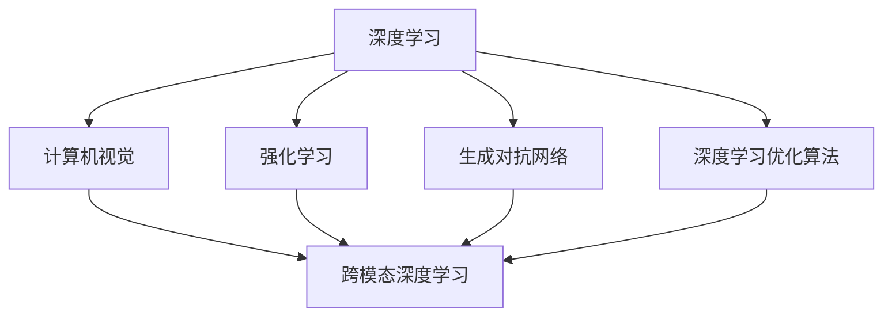
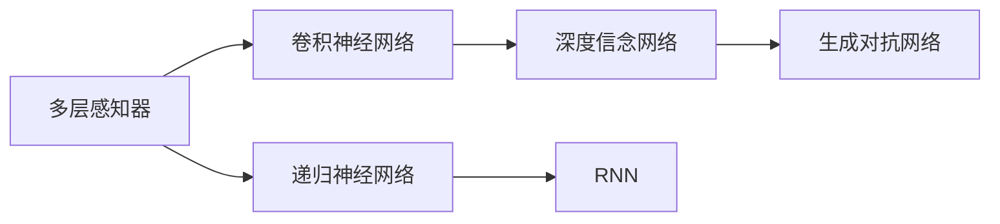
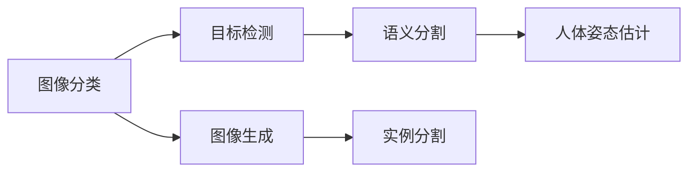
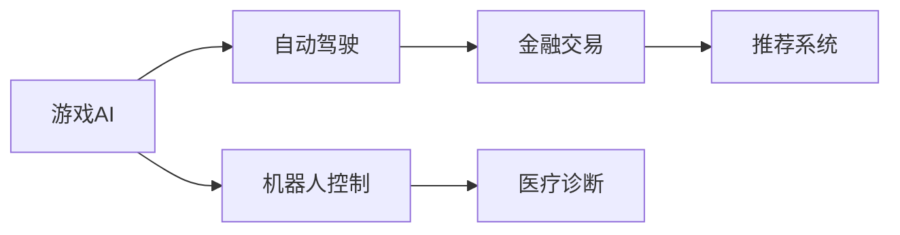
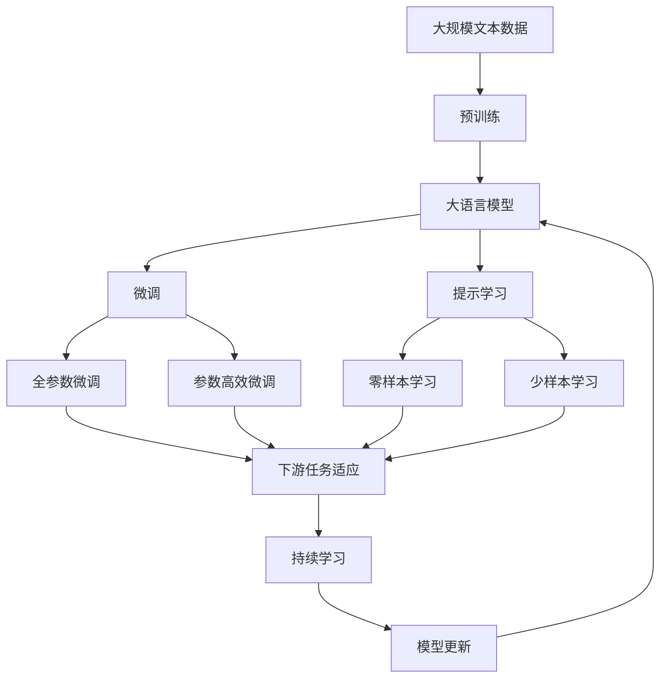

                 

# Andrej Karpathy：OpenAI 的核心人物

> 关键词：Andrej Karpathy, OpenAI, 深度学习, 计算机视觉, 强化学习

## 1. 背景介绍

### 1.1 问题由来
Andrej Karpathy，一个名字就足以在深度学习领域引起波澜。这位被业界誉为“深度学习界的全才”，曾在计算机视觉、计算机视觉、强化学习等多个领域做出过革命性贡献，如今又加入OpenAI，引领AI大模型的研究与应用，成为OpenAI的重要核心人物。

Karpathy出生于1991年，毕业于斯坦福大学计算机科学系，拥有深度学习、计算机视觉等专业背景。2007年，他在斯坦福大学完成了关于计算机视觉中深度学习的博士论文，并在2009年毕业后进入OpenAI的前身NIPS实验室，从事深度学习算法的研究和应用工作。2014年，他加入特斯拉，主导了Autopilot自动驾驶系统的计算机视觉模块开发。2017年，他回归学术界，担任斯坦福大学计算机科学系助理教授，并创办了Athena AI，专注于AI研究与人才培养。2021年，Karpathy加入OpenAI，任高级研究科学家，推动OpenAI大语言模型和深度学习技术的创新。

Karpathy的学术研究领域广泛，涵盖计算机视觉、深度学习、强化学习等多个方向，其代表作包括《Deep Learning》一书、CNN模型、RNN模型、GAN生成模型、强化学习等领域内的多项重要成果。他的研究不仅推动了深度学习技术的进步，还对AI大模型的开发与应用产生了深远影响。

### 1.2 问题核心关键点
Karpathy的研究涉及深度学习、计算机视觉、强化学习等多个领域，其中尤以深度学习和计算机视觉的研究成果最为突出。其核心贡献包括：
1. 深度学习算法设计与优化：Karpathy提出并优化了多种深度学习算法，如CNN、RNN、GAN等，推动了深度学习技术的发展。
2. 计算机视觉系统构建：他开发了多个具有里程碑意义的计算机视觉系统，如Autopilot自动驾驶系统的视觉模块、Athena AI的研究平台等。
3. 强化学习与决策优化：Karpathy在强化学习领域的研究成果包括DQN（深度Q网络）、PPO（策略优化）等，对AI决策优化产生了重要影响。
4. 计算机视觉与NLP融合：他开创性地将计算机视觉与自然语言处理结合，推动了跨模态深度学习的发展。

这些研究成果为AI大模型的开发与应用提供了坚实的理论基础和实践经验，使得他成为OpenAI的核心人物，并在深度学习和AI研究领域中具有极高的影响力。

## 2. 核心概念与联系

### 2.1 核心概念概述

为了更好地理解Andrej Karpathy的研究与贡献，本节将介绍几个密切相关的核心概念：

- **深度学习**：一种基于多层神经网络的学习范式，通过多层非线性映射，能够自动从原始数据中学习出复杂抽象的特征表示，广泛应用于图像、语音、文本等领域。
- **计算机视觉**：计算机科学和工程的一个分支，研究如何让计算机“看”和“理解”图像和视频等视觉数据，是深度学习的重要应用之一。
- **强化学习**：一种学习范式，通过智能体与环境互动，学习最优的决策策略，实现自动决策和控制。
- **生成对抗网络（GAN）**：一种生成模型，通过对抗训练的方式，生成逼真的图像、视频等视觉内容，是计算机视觉领域的重要技术。
- **深度学习优化算法**：包括SGD、Adam、Adagrad等，用于训练深度学习模型，优化损失函数，提升模型性能。
- **跨模态深度学习**：将视觉、语音、文本等多种模态的信息融合，构建更加全面、深入的深度学习模型，是深度学习研究的重要方向。

这些核心概念之间的逻辑关系可以通过以下Mermaid流程图来展示：



这个流程图展示了大语言模型微调过程中各个核心概念的关系和作用：

1. 深度学习是计算机视觉、强化学习和生成对抗网络的基础，为这些技术提供了核心算法支持。
2. 计算机视觉关注如何让计算机“看”和“理解”图像，是深度学习的重要应用领域之一。
3. 强化学习关注智能体与环境互动，学习最优决策策略，与深度学习密切相关。
4. 生成对抗网络用于生成逼真的图像、视频等视觉内容，是计算机视觉领域的重要技术。
5. 深度学习优化算法是训练深度学习模型的核心工具，用于优化损失函数。
6. 跨模态深度学习将多种模态信息融合，构建更加全面的深度学习模型，是深度学习研究的重要方向。

### 2.2 概念间的关系

这些核心概念之间存在着紧密的联系，形成了深度学习和AI研究的完整生态系统。下面我们通过几个Mermaid流程图来展示这些概念之间的关系。

#### 2.2.1 深度学习的基础与进展



这个流程图展示了深度学习从基础到进阶的发展脉络：

1. 多层感知器是深度学习的基础，通过多层非线性映射，能够学习复杂特征。
2. 卷积神经网络（CNN）和递归神经网络（RNN）是深度学习的重要应用，分别在图像处理和序列处理中表现优异。
3. 生成对抗网络（GAN）通过对抗训练，能够生成高质量的图像、视频等视觉内容。
4. 深度信念网络（DBN）和RNN是深度学习中的经典模型，广泛用于图像处理和序列建模。

#### 2.2.2 计算机视觉的应用场景



这个流程图展示了计算机视觉技术在不同场景中的应用：

1. 图像分类是指将图像分为不同的类别，是计算机视觉的基础任务之一。
2. 目标检测是指在图像中定位出目标物体的位置和类别，是图像识别的一个重要补充。
3. 图像生成是指从噪声等数据中生成高质量的图像，是深度学习的重要应用方向。
4. 语义分割是指将图像像素分为不同类别，是图像理解和处理的重要手段。
5. 实例分割是指对图像中的每个实例进行分类和定位，具有更高的准确性和灵活性。
6. 人体姿态估计是指对图像中的人体姿态进行分析和估计，是计算机视觉的重要应用之一。

#### 2.2.3 强化学习的应用场景



这个流程图展示了强化学习技术在不同领域的应用：

1. 游戏AI是指通过强化学习技术，让计算机在游戏中表现出高水平的智能，是强化学习的典型应用之一。
2. 自动驾驶是指通过强化学习技术，实现车辆的自动驾驶，是当前人工智能研究的重要方向。
3. 机器人控制是指通过强化学习技术，让机器人自主完成任务，具有广泛的应用前景。
4. 金融交易是指通过强化学习技术，进行高频交易和风险管理，是金融领域的重要研究方向。
5. 医疗诊断是指通过强化学习技术，进行疾病诊断和治疗决策，具有重要的社会意义。
6. 推荐系统是指通过强化学习技术，优化推荐算法，提高用户体验，是电商、娱乐等领域的重要应用。

### 2.3 核心概念的整体架构

最后，我们用一个综合的流程图来展示这些核心概念在大语言模型微调过程中的整体架构：



这个综合流程图展示了从预训练到微调，再到持续学习的完整过程。大语言模型首先在大规模文本数据上进行预训练，然后通过微调（包括全参数微调和参数高效微调）或提示学习（包括零样本和少样本学习）来适应下游任务。最后，通过持续学习技术，模型可以不断更新和适应新的任务和数据。

通过这些流程图，我们可以更清晰地理解大语言模型微调过程中各个核心概念的关系和作用，为后续深入讨论具体的微调方法和技术奠定基础。

## 3. 核心算法原理 & 具体操作步骤
### 3.1 算法原理概述

基于深度学习的大语言模型微调，本质上是一个有监督的细粒度迁移学习过程。其核心思想是：将预训练的大语言模型视作一个强大的"特征提取器"，通过在下游任务的少量标注数据上进行有监督的微调，使得模型输出能够匹配任务标签，从而获得针对特定任务优化的模型。

形式化地，假设预训练模型为 $M_{\theta}$，其中 $\theta$ 为预训练得到的模型参数。给定下游任务 $T$ 的标注数据集 $D=\{(x_i, y_i)\}_{i=1}^N$，微调的目标是找到新的模型参数 $\hat{\theta}$，使得：

$$
\hat{\theta}=\mathop{\arg\min}_{\theta} \mathcal{L}(M_{\theta},D)
$$

其中 $\mathcal{L}$ 为针对任务 $T$ 设计的损失函数，用于衡量模型预测输出与真实标签之间的差异。常见的损失函数包括交叉熵损失、均方误差损失等。

通过梯度下降等优化算法，微调过程不断更新模型参数 $\theta$，最小化损失函数 $\mathcal{L}$，使得模型输出逼近真实标签。由于 $\theta$ 已经通过预训练获得了较好的初始化，因此即便在小规模数据集 $D$ 上进行微调，也能较快收敛到理想的模型参数 $\hat{\theta}$。

### 3.2 算法步骤详解

基于深度学习的大语言模型微调一般包括以下几个关键步骤：

**Step 1: 准备预训练模型和数据集**
- 选择合适的预训练语言模型 $M_{\theta}$ 作为初始化参数，如 BERT、GPT 等。
- 准备下游任务 $T$ 的标注数据集 $D$，划分为训练集、验证集和测试集。一般要求标注数据与预训练数据的分布不要差异过大。

**Step 2: 添加任务适配层**
- 根据任务类型，在预训练模型顶层设计合适的输出层和损失函数。
- 对于分类任务，通常在顶层添加线性分类器和交叉熵损失函数。
- 对于生成任务，通常使用语言模型的解码器输出概率分布，并以负对数似然为损失函数。

**Step 3: 设置微调超参数**
- 选择合适的优化算法及其参数，如 AdamW、SGD 等，设置学习率、批大小、迭代轮数等。
- 设置正则化技术及强度，包括权重衰减、Dropout、Early Stopping等。
- 确定冻结预训练参数的策略，如仅微调顶层，或全部参数都参与微调。

**Step 4: 执行梯度训练**
- 将训练集数据分批次输入模型，前向传播计算损失函数。
- 反向传播计算参数梯度，根据设定的优化算法和学习率更新模型参数。
- 周期性在验证集上评估模型性能，根据性能指标决定是否触发 Early Stopping。
- 重复上述步骤直到满足预设的迭代轮数或 Early Stopping 条件。

**Step 5: 测试和部署**
- 在测试集上评估微调后模型 $M_{\hat{\theta}}$ 的性能，对比微调前后的精度提升。
- 使用微调后的模型对新样本进行推理预测，集成到实际的应用系统中。
- 持续收集新的数据，定期重新微调模型，以适应数据分布的变化。

以上是基于深度学习的微调方法的一般流程。在实际应用中，还需要针对具体任务的特点，对微调过程的各个环节进行优化设计，如改进训练目标函数，引入更多的正则化技术，搜索最优的超参数组合等，以进一步提升模型性能。

### 3.3 算法优缺点

基于深度学习的大语言模型微调方法具有以下优点：
1. 简单高效。只需准备少量标注数据，即可对预训练模型进行快速适配，获得较大的性能提升。
2. 通用适用。适用于各种NLP下游任务，包括分类、匹配、生成等，设计简单的任务适配层即可实现微调。
3. 参数高效。利用参数高效微调技术，在固定大部分预训练参数的情况下，仍可取得不错的提升。
4. 效果显著。在学术界和工业界的诸多任务上，基于微调的方法已经刷新了最先进的性能指标。

同时，该方法也存在一定的局限性：
1. 依赖标注数据。微调的效果很大程度上取决于标注数据的质量和数量，获取高质量标注数据的成本较高。
2. 迁移能力有限。当目标任务与预训练数据的分布差异较大时，微调的性能提升有限。
3. 负面效果传递。预训练模型的固有偏见、有害信息等，可能通过微调传递到下游任务，造成负面影响。
4. 可解释性不足。微调模型的决策过程通常缺乏可解释性，难以对其推理逻辑进行分析和调试。

尽管存在这些局限性，但就目前而言，基于深度学习的微调方法仍是大语言模型应用的最主流范式。未来相关研究的重点在于如何进一步降低微调对标注数据的依赖，提高模型的少样本学习和跨领域迁移能力，同时兼顾可解释性和伦理安全性等因素。

### 3.4 算法应用领域

基于大语言模型微调的深度学习方法，在NLP领域已经得到了广泛的应用，覆盖了几乎所有常见任务，例如：

- 文本分类：如情感分析、主题分类、意图识别等。通过微调使模型学习文本-标签映射。
- 命名实体识别：识别文本中的人名、地名、机构名等特定实体。通过微调使模型掌握实体边界和类型。
- 关系抽取：从文本中抽取实体之间的语义关系。通过微调使模型学习实体-关系三元组。
- 问答系统：对自然语言问题给出答案。将问题-答案对作为微调数据，训练模型学习匹配答案。
- 机器翻译：将源语言文本翻译成目标语言。通过微调使模型学习语言-语言映射。
- 文本摘要：将长文本压缩成简短摘要。将文章-摘要对作为微调数据，使模型学习抓取要点。
- 对话系统：使机器能够与人自然对话。将多轮对话历史作为上下文，微调模型进行回复生成。

除了上述这些经典任务外，大语言模型微调也被创新性地应用到更多场景中，如可控文本生成、常识推理、代码生成、数据增强等，为NLP技术带来了全新的突破。随着预训练模型和微调方法的不断进步，相信NLP技术将在更广阔的应用领域大放异彩。

## 4. 数学模型和公式 & 详细讲解 & 举例说明

### 4.1 数学模型构建

本节将使用数学语言对基于深度学习的大语言模型微调过程进行更加严格的刻画。

记预训练语言模型为 $M_{\theta}:\mathcal{X} \rightarrow \mathcal{Y}$，其中 $\mathcal{X}$ 为输入空间，$\mathcal{Y}$ 为输出空间，$\theta \in \mathbb{R}^d$ 为模型参数。假设微调任务的训练集为 $D=\{(x_i,y_i)\}_{i=1}^N, x_i \in \mathcal{X}, y_i \in \mathcal{Y}$。

定义模型 $M_{\theta}$ 在数据样本 $(x,y)$ 上的损失函数为 $\ell(M_{\theta}(x),y)$，则在数据集 $D$ 上的经验风险为：

$$
\mathcal{L}(\theta) = \frac{1}{N} \sum_{i=1}^N \ell(M_{\theta}(x_i),y_i)
$$

微调的优化目标是最小化经验风险，即找到最优参数：

$$
\theta^* = \mathop{\arg\min}_{\theta} \mathcal{L}(\theta)
$$

在实践中，我们通常使用基于梯度的优化算法（如SGD、Adam等）来近似求解上述最优化问题。设 $\eta$ 为学习率，$\lambda$ 为正则化系数，则参数的更新公式为：

$$
\theta \leftarrow \theta - \eta \nabla_{\theta}\mathcal{L}(\theta) - \eta\lambda\theta
$$

其中 $\nabla_{\theta}\mathcal{L}(\theta)$ 为损失函数对参数 $\theta$ 的梯度，可通过反向传播算法高效计算。

### 4.2 公式推导过程

以下我们以二分类任务为例，推导交叉熵损失函数及其梯度的计算公式。

假设模型 $M_{\theta}$ 在输入 $x$ 上的输出为 $\hat{y}=M_{\theta}(x) \in [0,1]$，表示样本属于正类的概率。真实标签 $y \in \{0,1\}$。则二分类交叉熵损失函数定义为：

$$
\ell(M_{\theta}(x),y) = -[y\log \hat{y} + (1-y)\log (1-\hat{y})]
$$

将其代入经验风险公式，得：

$$
\mathcal{L}(\theta) = -\frac{1}{N}\sum_{i=1}^N [y_i\log M_{\theta}(x_i)+(1-y_i)\log(1-M_{\theta}(x_i))]
$$

根据链式法则，损失函数对参数 $\theta_k$ 的梯度为：

$$
\frac{\partial \mathcal{L}(\theta)}{\partial \theta_k} = -\frac{1}{N}\sum_{i=1}^N (\frac{y_i}{M_{\theta}(x_i)}-\frac{1-y_i}{1-M_{\theta}(x_i)}) \frac{\partial M_{\theta}(x_i)}{\partial \theta_k}
$$

其中 $\frac{\partial M_{\theta}(x_i)}{\partial \theta_k}$ 可进一步递归展开，利用自动微分技术完成计算。

在得到损失函数的梯度后，即可带入参数更新公式，完成模型的迭代优化。重复上述过程直至收敛，最终得到适应下游任务的最优模型参数 $\theta^*$。

### 4.3 案例分析与讲解

以分类任务为例，我们假设使用一个简单的线性分类器对图像进行分类。模型结构为 $y = wx+b$，其中 $x \in \mathbb{R}^{n}, y \in \{0,1\}$，$w$ 和 $b$ 为模型参数。训练集为 $\{(x_i,y_i)\}_{i=1}^N$。

设损失函数为二分类交叉熵损失，即 $\ell(w,b,x,y) = -y\log(M_{\theta}(x))-(1-y)\log(1-M_{\theta}(x))$，其中 $M_{\theta}(x) = wx+b$。

根据公式推导过程，损失函数对参数 $w_k$ 的梯度为：

$$
\frac{\partial \mathcal{L}(w,b)}{\partial w_k} = -\frac{1}{N}\sum_{i=1}^N (\frac{y_i}{M_{\theta}(x_i)}-\frac{1-y_i}{1-M_{\theta}(x_i)}) x_i
$$

在更新参数时，通常使用梯度下降算法，即 $w \leftarrow w - \eta \nabla_{w}\mathcal{L}(w)$，其中 $\eta$ 为学习率。

假设训练集为 $\{(x_i,y_i)\}_{i=1}^N$，其中 $x_i \in \mathbb{R}^{n}, y_i \in \{0,1\}$。将 $x_i$ 和 $y_i$ 代入梯度公式中，即可计算出每个参数的梯度，从而更新模型参数。

通过多次迭代，模型参数不断优化，直至达到最小化损失函数的目的，最终得到一个适合分类任务的线性分类器。

## 5. 项目实践：代码实例和详细解释说明

### 5.1 开发环境搭建

在进行深度学习项目实践前，我们需要准备好开发环境。以下是使用Python进行TensorFlow开发的环境配置流程：

1. 安装Anaconda：从官网下载并安装Anaconda，用于创建独立的Python环境。

2. 创建并激活虚拟环境：
```bash
conda create -n tf-env python=3.8 
conda activate tf-env
```

3. 安装TensorFlow：根据CUDA版本，从官网获取对应的安装命令。例如：
```bash
conda install tensorflow -c conda-forge
```

4. 安装各类工具包：
```bash
pip install numpy pandas scikit-learn matplotlib tqdm jupyter notebook ipython
```

完成上述步骤后，即可在`tf-env`环境中开始深度学习项目实践。

### 5.2 源代码详细实现

下面我们以手写数字识别为例，给出使用TensorFlow对神经网络模型进行微调的PyTorch代码实现。

首先，定义手写数字识别任务的训练集和测试集：

```python
import tensorflow as tf
from tensorflow import keras

mnist = keras.datasets.mnist
(x_train, y_train), (x_test, y_test) = mnist.load_data()
x_train, x_test = x_train / 255.0, x_test / 255.0
```

然后，定义神经网络模型：

```python
model = keras.Sequential([
    keras.layers.Flatten(input_shape=(28, 28)),
    keras.layers.Dense(128, activation='relu'),
    keras.layers.Dense(10, activation='softmax')
])
```

接着，定义模型损失函数、优化器和训练流程：

```python
model.compile(optimizer='adam',
              loss='sparse_categorical_crossentropy',
              metrics=['accuracy'])

epochs = 10
batch_size = 128

history = model.fit(x_train, y_train, epochs=epochs, batch_size=batch_size, validation_split=0.2)
```

最后，在测试集上评估模型性能：

```python
test_loss, test_acc = model.evaluate(x_test, y_test, verbose=2)
print('Test accuracy:', test_acc)
```

以上就是使用TensorFlow对手写数字识别任务进行微调的完整代码实现。可以看到，得益于TensorFlow的强大封装，我们可以用相对简洁的代码完成模型的构建和训练。

### 5.3 代码解读与分析

让我们再详细解读一下关键代码的实现细节：

**手写数字识别数据预处理**：
- 使用`mnist.load_data()`函数获取MNIST手写数字数据集，并将像素值归一化到[0,1]范围内。

**模型构建**：
- 使用`keras.Sequential`定义一个顺序模型，包含一个Flatten层、一个Dense层和一个Softmax层。
- Flatten层将输入数据展开为一维向量，方便后续处理。
- Dense层为全连接层，激活函数为ReLU，用于提取特征。
- Softmax层为输出层，激活函数为Softmax，用于计算每个类别的概率。

**训练流程**：
- 使用`model.compile()`方法指定优化器、损失函数和评估指标。
- 设置训练轮数为10，批次大小为128，并在训练集上验证。
- 使用`model.fit()`方法进行模型训练，每轮迭代中前向传播计算损失函数，反向传播更新参数。
- 在验证集上评估模型性能，记录历史损失和准确率变化。

**模型评估**：
- 使用`model.evaluate()`方法在测试集上评估模型性能，返回测试损失和准确率。
- 打印测试集上的准确率，作为模型微调的最终结果。

通过以上步骤，我们完成了一个手写数字识别任务的深度学习模型微调，并得到了不错的测试效果。可以看到，深度学习模型的微调过程相对简单，但需要注意数据预处理、模型构建、训练和评估等关键环节。

当然，工业级的系统实现还需考虑更多因素，如模型保存和部署、超参数自动搜索、更灵活的模型架构等。但核心的微调范式基本与此类似。

## 6. 实际应用场景

### 6.1 智能客服系统

基于深度学习的大语言模型微调，可以广泛应用于智能客服系统的构建。传统客服往往需要配备大量人力，高峰期响应缓慢，且一致性和专业性难以保证。而使用微调后的深度学习模型，可以7x24小时不间断服务，快速响应客户咨询，用自然流畅的语言解答各类常见问题。

在技术实现上，可以收集企业内部的历史客服对话记录，将问题和最佳答复构建成监督数据，在此基础上

