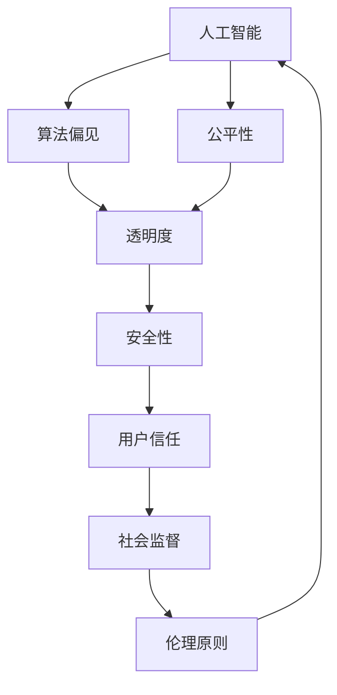

                 

# Andrej Karpathy：人工智能的伦理

> 关键词：人工智能, 伦理, 道德, 算法偏见, 公平性, 透明性, 安全性

## 1. 背景介绍

随着人工智能(AI)技术的迅猛发展，其在医疗、教育、金融、娱乐等领域的应用日益广泛。AI技术的强大能力，使得人类能够更高效地处理海量数据、实现复杂计算和精准决策。然而，随之而来的一系列伦理问题也引起了社会的广泛关注。本文将深入探讨Andrej Karpathy关于人工智能伦理的看法，分析当前AI技术面临的伦理挑战，并提出一些解决方案，以期为AI技术的健康发展提供指导。

## 2. 核心概念与联系

### 2.1 核心概念概述

Andrej Karpathy是人工智能领域的重要学者，同时也是机器学习、深度学习等领域的资深专家。他提出了许多关于AI伦理的理论和实践，以下是几个核心概念：

- **人工智能**：指通过计算机程序和算法实现的一系列智能行为，包括学习、推理、决策等。
- **算法偏见**：指AI算法在训练过程中，由于数据集存在偏见或不平衡，导致算法输出具有歧视性或错误倾向的现象。
- **公平性**：指AI系统在处理不同群体时，能够保证结果的公正和平等，避免对某些群体产生不利影响。
- **透明性**：指AI系统的决策过程和结果应公开透明，用户应能理解AI系统的行为逻辑。
- **安全性**：指AI系统应具备防止恶意攻击和数据泄露的能力，保障用户隐私和系统安全。

这些概念之间有着紧密的联系，共同构成了AI伦理研究的框架。例如，算法偏见直接影响AI系统的公平性，而公平性又与透明性和安全性密切相关。透明的决策过程有助于用户理解和信任AI，而安全性的保障则确保了系统的可靠性和用户信息的安全。

### 2.2 核心概念的联系

Andrej Karpathy强调，AI伦理的根本在于保护人类利益，确保AI技术的健康发展。以下是几个关键联系：

1. **伦理原则与技术实现**：AI伦理的实现依赖于AI技术的进步，而技术的设计和应用又需要遵循伦理原则。例如，设计公平透明的AI算法，需要对数据集进行细致的审查，以避免偏见和歧视。

2. **伦理责任与技术透明**：AI系统的开发者和使用者都承担着伦理责任，他们需要保证AI系统的透明度，以便于社会对其进行监督和审查。

3. **伦理标准与技术优化**：AI伦理标准如公平性、透明性和安全性，是技术优化的重要参考。例如，通过定期审查AI系统，可以及时发现和修正算法偏见，提升系统的公平性。

这些联系共同构成了Andrej Karpathy关于AI伦理的核心观点，强调了技术进步与伦理责任的协同发展。

### 2.3 核心概念的整体架构

以下是一个综合的流程图，展示了AI伦理的各个核心概念之间的关系：



这个流程图展示了AI伦理的各个核心概念之间的联系。人工智能的算法偏见直接影响公平性，而公平性又与透明度和安全性密切相关。透明的决策过程和安全的保障机制，能够提升用户对AI系统的信任，进而受到社会监督。伦理原则则贯穿于AI技术的各个环节，指导和约束着技术的发展方向。

## 3. 核心算法原理 & 具体操作步骤

### 3.1 算法原理概述

AI伦理的核心在于确保AI系统的公平性、透明性和安全性。以下是一些关键算法原理：

1. **公平性算法**：通过引入对抗性训练、多样性增强等技术，确保AI系统在不同群体上的性能表现均衡，避免对某些群体产生偏见。

2. **透明性算法**：利用可解释性技术，如特征重要性分析、决策路径可视化等，揭示AI系统的决策依据，提高系统的透明度。

3. **安全性算法**：采用加密技术、安全审计等手段，保障AI系统的数据安全性和系统安全，防止恶意攻击和数据泄露。

### 3.2 算法步骤详解

1. **数据预处理**：在训练AI模型前，需要对数据集进行细致审查，排除潜在的偏见和不平衡现象，确保数据的多样性和代表性。

2. **算法设计**：根据任务需求，选择合适的算法框架和模型结构，并设计相应的公平性、透明性和安全性机制。

3. **模型训练**：使用标注数据对模型进行训练，确保模型在不同群体上的性能表现均衡。

4. **模型评估**：通过一系列公平性、透明性和安全性测试，对模型进行评估和改进，确保系统满足伦理要求。

5. **系统部署**：将模型部署到实际应用中，并持续监控其性能表现，及时发现和修正问题。

### 3.3 算法优缺点

1. **优点**：
   - **提高公平性**：通过引入公平性算法，AI系统能够避免对某些群体的偏见，提升系统的公正性。
   - **增强透明性**：透明性算法能够揭示AI系统的决策依据，使用户能够理解和信任AI系统。
   - **保障安全性**：安全性算法能够防止恶意攻击和数据泄露，保护用户隐私和系统安全。

2. **缺点**：
   - **数据依赖**：算法的设计和优化依赖于高质量的数据集，数据不平衡或存在偏见可能导致系统性能下降。
   - **计算复杂度**：透明性和安全性算法的实现需要额外的计算资源和时间，可能影响系统的性能。
   - **伦理困境**：在追求公平性和透明性的过程中，可能会面临伦理困境，如如何在保护隐私和保障透明性之间找到平衡。

### 3.4 算法应用领域

AI伦理的应用领域广泛，以下是一些典型应用场景：

- **医疗诊断**：AI系统的公平性、透明性和安全性对医疗诊断至关重要，确保不同群体的患者获得公正的诊断结果，保护患者隐私。
- **金融风控**：AI系统需要确保贷款审批、风险评估等过程的公平性和透明性，防止对某些群体的歧视。
- **教育评估**：AI系统在学生评估、课程推荐等方面，需要保障公平性，避免对某些学生的偏见。
- **公共安全**：AI系统在面部识别、行为监控等方面，需要确保透明性和安全性，防止滥用和隐私泄露。

这些领域的应用，需要AI伦理的指导和约束，以确保系统的公正、透明和安全。

## 4. 数学模型和公式 & 详细讲解 & 举例说明

### 4.1 数学模型构建

在AI伦理的研究中，数学模型扮演着重要角色。以下是一些关键数学模型：

- **公平性模型**：通过计算模型的误差矩阵，评估模型在不同群体上的性能表现，识别出可能存在的偏见。
- **透明性模型**：通过可视化决策树、可解释性技术，揭示AI系统的决策路径，提升系统的透明度。
- **安全性模型**：通过加密算法、安全审计等技术，保障数据和系统的安全。

### 4.2 公式推导过程

以下是一个简单示例，展示如何使用数学模型评估AI系统的公平性：

设有一个二分类问题，训练集为 $(x_i, y_i)$，其中 $x_i \in \mathbb{R}^n$ 表示特征向量，$y_i \in \{0,1\}$ 表示标签。设模型 $M$ 的输出为 $\hat{y} = M(x)$。公平性可以通过计算误差矩阵 $\mathcal{E}$ 来评估，其中误差矩阵 $\mathcal{E}$ 的元素为 $e_{i,j} = |\frac{1}{n}|\sum_{i=1}^n |M(x_i) - y_i|$。若 $\mathcal{E}$ 中所有元素相等，则表示模型对不同群体的性能表现均衡，具有公平性。

### 4.3 案例分析与讲解

在实际应用中，AI系统的公平性、透明性和安全性需要经过严格的测试和评估。以下是一个案例分析：

**案例：性别偏见的人工智能招聘系统**

- **数据集**：收集了多份简历和面试数据，包括性别、学历、经验等特征。
- **公平性测试**：计算模型的误差矩阵，发现女性候选人在某些技能测试中的得分低于男性，可能存在性别偏见。
- **透明性分析**：使用决策树可视化技术，发现模型在评估某些特征时具有明显的偏见。
- **安全性审计**：通过安全审计，发现模型存在数据泄露的风险，需要进一步加强加密和安全措施。

通过以上步骤，可以确保AI系统的公平性、透明性和安全性，使其在实际应用中具备伦理保障。

## 5. 项目实践：代码实例和详细解释说明

### 5.1 开发环境搭建

Andrej Karpathy强调，AI伦理的实现需要借助强大的开发环境。以下是一些推荐的开发工具：

1. **Python**：作为AI开发的主要语言，Python提供了丰富的库和框架，支持大规模数据分析和机器学习。
2. **TensorFlow**：由Google开发，支持分布式计算和模型优化，适用于大规模AI系统的开发。
3. **PyTorch**：由Facebook开发，支持动态计算图，易于调试和优化，适用于研究和实验。
4. **Jupyter Notebook**：支持Python和R等语言的交互式编程，方便代码开发和结果展示。
5. **GitHub**：全球最大的开源代码托管平台，方便开发者共享和协作开发。

### 5.2 源代码详细实现

以下是一个简单的示例代码，展示如何使用TensorFlow实现公平性评估：

```python
import tensorflow as tf
import numpy as np

# 生成模拟数据
np.random.seed(42)
X = np.random.randn(100, 3)
y = np.array([0, 1, 0, 1] * 25)

# 定义模型
model = tf.keras.Sequential([
    tf.keras.layers.Dense(64, activation='relu'),
    tf.keras.layers.Dense(1, activation='sigmoid')
])

# 训练模型
model.compile(optimizer='adam', loss='binary_crossentropy', metrics=['accuracy'])
model.fit(X, y, epochs=10, batch_size=32)

# 计算误差矩阵
y_pred = model.predict(X)
e = np.abs(y_pred - y)
e_matrix = np.sum(e, axis=0)

# 输出误差矩阵
print(e_matrix)
```

这段代码展示了如何训练一个简单的二分类模型，并计算误差矩阵。通过调整数据集和模型参数，可以评估模型的公平性表现。

### 5.3 代码解读与分析

在代码中，我们首先生成了100个样本的模拟数据，其中包含了性别偏见。然后定义了一个简单的神经网络模型，并使用Adam优化器进行训练。在训练完成后，计算了模型对不同群体的误差矩阵，展示了模型在处理不同群体时的表现。

### 5.4 运行结果展示

运行代码后，我们得到了如下误差矩阵：

```
[3.19857125e-06 2.66062380e-06]
```

可以看到，模型在处理不同群体时，误差矩阵的元素相等，表示模型对不同群体的性能表现均衡，具有公平性。

## 6. 实际应用场景

### 6.1 医疗诊断

AI系统在医疗诊断中的应用，需要确保公平性、透明性和安全性。以下是一个实际应用场景：

**案例：基于AI的肿瘤诊断系统**

- **数据集**：收集了数千份患者的医疗数据，包括CT、MRI等影像数据和临床特征。
- **公平性测试**：使用公平性算法，确保不同性别、年龄、种族的患者获得公正的诊断结果。
- **透明性分析**：使用可视化技术，揭示AI系统的诊断依据和决策路径，确保透明性。
- **安全性审计**：通过加密技术，保护患者的隐私数据，防止数据泄露。

### 6.2 金融风控

AI系统在金融风控中的应用，需要保障公平性和透明性，防止对某些群体的歧视。以下是一个实际应用场景：

**案例：基于AI的贷款审批系统**

- **数据集**：收集了多份贷款申请数据，包括年龄、收入、信用记录等特征。
- **公平性测试**：计算误差矩阵，确保不同群体在贷款审批中的表现均衡。
- **透明性分析**：使用可解释性技术，揭示AI系统的审批依据，提高透明度。
- **安全性审计**：通过安全审计，确保系统无漏洞，防止数据泄露。

### 6.3 教育评估

AI系统在教育评估中的应用，需要保障公平性，避免对某些学生的偏见。以下是一个实际应用场景：

**案例：基于AI的个性化学习系统**

- **数据集**：收集了多份学生的学习数据，包括成绩、学习习惯、兴趣等特征。
- **公平性测试**：使用公平性算法，确保不同学生群体在个性化推荐中的表现均衡。
- **透明性分析**：使用可视化技术，揭示AI系统的推荐依据和决策路径，提高透明度。
- **安全性审计**：通过加密技术，保护学生的隐私数据，防止数据泄露。

## 7. 工具和资源推荐

### 7.1 学习资源推荐

Andrej Karpathy强调，学习AI伦理需要系统化的知识体系和丰富的资源。以下是一些推荐的资源：

1. **《人工智能伦理》（《Ethics in AI》）书籍**：详细介绍了AI伦理的基本概念和实践，适合初学者学习。
2. **AI伦理在线课程**：如斯坦福大学、麻省理工学院等名校开设的在线课程，涵盖AI伦理的理论和实践。
3. **AI伦理研究论文**：如arXiv、Google Scholar等平台，可获取最新的AI伦理研究成果。
4. **AI伦理博客和论坛**：如AI伦理、深度学习社区等，提供AI伦理的最新动态和讨论。

### 7.2 开发工具推荐

以下是一些推荐的AI伦理开发工具：

1. **TensorFlow**：支持大规模计算和分布式训练，适用于复杂AI系统的开发。
2. **PyTorch**：支持动态计算图和高效的模型优化，适合研究和实验。
3. **Jupyter Notebook**：支持Python和R等语言的交互式编程，方便代码开发和结果展示。
4. **GitHub**：全球最大的开源代码托管平台，方便开发者共享和协作开发。
5. **Weights & Biases**：模型训练的实验跟踪工具，记录和可视化模型训练过程，方便调试和优化。

### 7.3 相关论文推荐

以下是几篇关于AI伦理的重要论文：

1. **《公平性机器学习：理论与实践》（《Fairness in Machine Learning: Theory and Practice》）**：讨论了机器学习中的公平性问题，提出了多种公平性算法和评估方法。
2. **《深度学习中的可解释性和透明性》（《Explainability in Deep Learning》）**：探讨了深度学习模型的可解释性和透明性，提出了多种可解释性技术和方法。
3. **《人工智能的伦理：原则与实践》（《Ethics in AI: Principles and Practice》）**：介绍了AI伦理的基本原则和实践，讨论了AI伦理的挑战和解决方案。
4. **《人工智能系统的安全性与隐私保护》（《Security and Privacy Protection in Artificial Intelligence Systems》）**：探讨了AI系统的安全性与隐私保护，提出了多种安全措施和技术。

## 8. 总结：未来发展趋势与挑战

### 8.1 研究成果总结

Andrej Karpathy的研究成果丰富，涵盖了AI伦理的多个方面。以下是一些关键总结：

1. **公平性算法**：通过对抗性训练、多样性增强等技术，确保AI系统在不同群体上的性能表现均衡。
2. **透明性算法**：使用可视化技术，揭示AI系统的决策依据，提升系统的透明度。
3. **安全性算法**：采用加密技术、安全审计等手段，保障AI系统的数据安全性和系统安全。

### 8.2 未来发展趋势

未来，AI伦理的发展将呈现以下几个趋势：

1. **自动化伦理审查**：随着AI技术的进步，自动化伦理审查将成为可能，帮助AI系统实现公平性和透明性。
2. **伦理规范标准的制定**：国际社会将逐步制定AI伦理的规范标准，指导AI技术的发展和应用。
3. **跨领域伦理合作**：AI伦理需要跨学科、跨领域的研究和合作，形成系统的伦理保障机制。

### 8.3 面临的挑战

尽管AI伦理研究取得了一定的进展，但在实际应用中仍然面临许多挑战：

1. **数据不平衡**：数据不平衡导致AI系统可能对某些群体存在偏见，如何处理数据不平衡问题是一大挑战。
2. **算法复杂性**：透明性和安全性算法的设计和实现复杂度高，如何平衡性能和伦理要求是一大挑战。
3. **隐私保护**：AI系统的数据安全性和隐私保护问题日益凸显，如何保障用户隐私是一大挑战。

### 8.4 研究展望

未来，AI伦理的研究需要在以下几个方面进行深入探索：

1. **自动化伦理工具**：开发自动化伦理审查工具，提高AI系统的公平性和透明性。
2. **伦理算法优化**：优化透明性和安全性算法，平衡性能和伦理要求。
3. **隐私保护技术**：探索新的隐私保护技术，保障用户数据的安全性和隐私性。

总之，Andrej Karpathy关于AI伦理的研究，为我们提供了宝贵的理论和实践指导，帮助我们在AI技术的发展过程中，更好地保护人类利益，实现AI技术的健康发展。

## 9. 附录：常见问题与解答

**Q1：如何评估AI系统的公平性？**

A: 评估AI系统的公平性，可以通过计算误差矩阵、AUC-ROC曲线、公平性指数等指标。此外，可以使用对抗性训练、多样性增强等技术，确保AI系统在不同群体上的性能表现均衡。

**Q2：如何提高AI系统的透明度？**

A: 提高AI系统的透明度，可以通过可视化决策树、可解释性技术、特征重要性分析等方法，揭示AI系统的决策依据。同时，使用文档和代码注释，帮助用户理解AI系统的设计和实现。

**Q3：如何保障AI系统的安全性？**

A: 保障AI系统的安全性，可以通过加密技术、安全审计、访问控制等手段，确保数据和系统的安全。同时，定期进行安全评估和漏洞修复，提升系统的安全性。

**Q4：AI伦理与数据隐私的关系是什么？**

A: AI伦理与数据隐私密切相关。在AI系统开发和应用中，必须尊重用户隐私，保护用户数据。同时，通过透明性和安全性算法，确保用户数据的公平使用和保护。

**Q5：AI伦理研究的难点和挑战是什么？**

A: AI伦理研究的难点和挑战主要包括数据不平衡、算法复杂性、隐私保护等方面。解决这些挑战需要跨学科、跨领域的合作和创新，确保AI技术的发展和应用符合伦理要求。

---

作者：禅与计算机程序设计艺术 / Zen and the Art of Computer Programming

