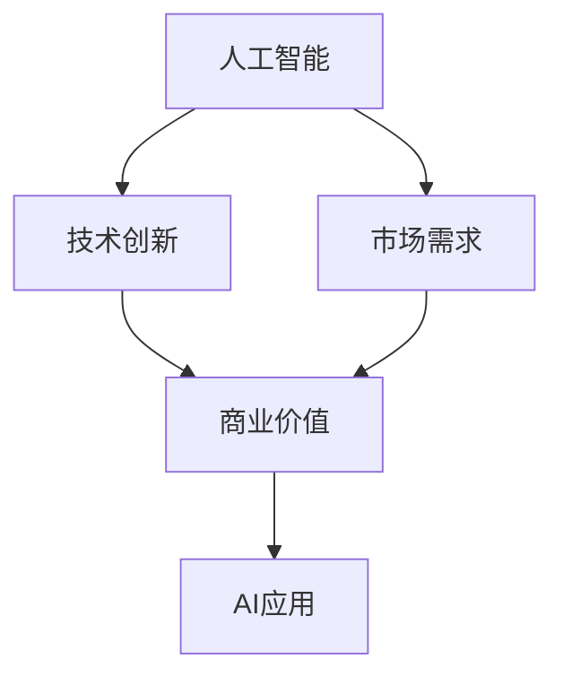

                 

# Andrej Karpathy：人工智能的商业价值

## 1. 背景介绍

Andrej Karpathy，作为OpenAI的首席AI科学家、斯坦福大学计算机科学教授，以及人工智能领域的领军人物之一，一直在推动人工智能技术的发展，特别是在计算机视觉、自然语言处理等领域。他的工作不仅推动了学术研究的前沿，更深刻影响了人工智能在商业和技术应用中的广泛应用。本文将深入探讨Andrej Karpathy关于人工智能商业价值的思想，及其对未来技术发展的见解。

## 2. 核心概念与联系

### 2.1 核心概念概述

Andrej Karpathy在人工智能商业价值的探讨中，涉及以下几个核心概念：

- **人工智能(AI)：** 指通过机器学习、深度学习等技术，赋予机器自主处理和决策的能力，实现智能化应用。
- **商业价值：** AI技术在提高效率、降低成本、优化决策等方面的商业应用价值。
- **技术创新：** AI技术的不断进步，特别是在模型架构、算法优化等方面的创新，为商业应用提供了新的可能。
- **市场需求：** 企业在提高生产效率、改善客户体验等方面的需求，驱动AI技术的商业化应用。

这些概念之间的联系可以概括为：AI技术的不断创新为市场提供了新的解决方案，而市场需求又推动了AI技术的商业化应用，从而实现了商业价值的增长。

### 2.2 概念间的关系

下图通过Mermaid流程图展示了Andrej Karpathy核心概念之间的关系：



- 人工智能作为基础技术，推动了技术创新，从而创造了商业价值。
- 市场需求驱动了AI技术的商业化应用，进一步提升了商业价值。
- 商业价值通过各种AI应用，反哺技术创新和市场需求。

## 3. 核心算法原理 & 具体操作步骤

### 3.1 算法原理概述

Andrej Karpathy在其工作中强调了算法原理对于AI商业价值实现的重要性。他认为，算法不仅需要具备理论上的优越性，还必须具备实际应用的可行性，能够适应现实世界的复杂性和多样性。

以深度学习算法为例，其核心原理是通过多层神经网络对输入数据进行特征提取和决策，通过反向传播算法进行参数更新。这一过程需要大量数据和计算资源，但一旦模型训练完成，可以高效地进行推理和决策。

### 3.2 算法步骤详解

Andrej Karpathy提出了一种基于增强学习的AI商业应用策略，其核心步骤如下：

1. **数据收集与预处理**：收集和预处理训练数据，包括数据清洗、数据增强、数据标注等。
2. **模型设计**：选择合适的模型架构，如卷积神经网络(CNN)、循环神经网络(RNN)、Transformer等，并设置相应的超参数。
3. **模型训练**：使用优化算法(如Adam、SGD)进行模型训练，通过反向传播更新模型参数。
4. **模型评估与调整**：在验证集上评估模型性能，根据评估结果调整模型结构或超参数。
5. **部署与应用**：将训练好的模型部署到实际应用场景中，进行商业应用。

### 3.3 算法优缺点

Andrej Karpathy认为，当前深度学习算法的优点包括：

- **高效性**：在大规模数据集上训练的模型具有高效的特征提取和决策能力。
- **可扩展性**：深度学习模型可以通过增加网络深度和宽度进行扩展，适应更复杂的问题。
- **自适应性**：通过调整超参数和模型结构，可以适应不同的应用场景和数据分布。

缺点则包括：

- **计算成本高**：深度学习模型需要大量的计算资源进行训练，导致训练成本高昂。
- **过拟合风险**：在大规模数据集上训练的模型容易过拟合，需要复杂的正则化技术进行控制。
- **解释性不足**：深度学习模型作为黑盒系统，难以解释其内部决策过程。

### 3.4 算法应用领域

Andrej Karpathy指出，深度学习算法在以下领域具有广泛的应用前景：

- **计算机视觉**：图像识别、目标检测、图像分割等任务，广泛应用于医疗影像分析、自动驾驶、智能监控等领域。
- **自然语言处理(NLP)**：机器翻译、情感分析、文本生成等任务，广泛应用于智能客服、智能助理、信息检索等领域。
- **语音识别**：语音转文本、语音合成等任务，广泛应用于智能音箱、语音助手、语音识别等应用。
- **推荐系统**：个性化推荐、广告投放等任务，广泛应用于电商平台、内容平台、社交网络等领域。

## 4. 数学模型和公式 & 详细讲解 & 举例说明

### 4.1 数学模型构建

在Andrej Karpathy的工作中，数学模型构建是其技术实现的核心环节之一。以下是基于深度学习的数学模型构建过程：

设输入数据为$x$，输出为$y$，深度学习模型的预测函数为$f(x; \theta)$，其中$\theta$为模型参数。目标是最小化预测误差$L(f(x; \theta), y)$，通常采用均方误差或交叉熵损失函数。

设$L(f(x; \theta), y)$为损失函数，$J(\theta)$为目标函数，优化问题为：

$$
\min_{\theta} J(\theta) = \frac{1}{N} \sum_{i=1}^N L(f(x_i; \theta), y_i)
$$

其中$x_i$为输入数据，$y_i$为标签。

### 4.2 公式推导过程

以二分类问题为例，假设模型输出$y$的概率为$P(y=1 | x; \theta)$，采用二元交叉熵损失函数，目标函数为：

$$
J(\theta) = -\frac{1}{N} \sum_{i=1}^N [y_i \log P(y=1 | x_i; \theta) + (1-y_i) \log P(y=0 | x_i; \theta)]
$$

根据梯度下降算法，求解目标函数的最小值：

$$
\frac{\partial J(\theta)}{\partial \theta_k} = -\frac{1}{N} \sum_{i=1}^N \left[ \frac{y_i}{P(y=1 | x_i; \theta)} - \frac{1-y_i}{1-P(y=1 | x_i; \theta)} \right] \frac{\partial P(y=1 | x_i; \theta)}{\partial \theta_k}
$$

其中$\frac{\partial P(y=1 | x_i; \theta)}{\partial \theta_k}$为模型输出关于模型参数$\theta_k$的偏导数，通过反向传播算法计算。

### 4.3 案例分析与讲解

以图像识别为例，假设模型采用卷积神经网络(CNN)架构，输入数据为$x$，输出为$y$，其中$y$表示图像类别标签。模型采用交叉熵损失函数，目标函数为：

$$
J(\theta) = -\frac{1}{N} \sum_{i=1}^N [y_i \log P(y_i | x_i; \theta) + (1-y_i) \log P(1-y_i | x_i; \theta)]
$$

其中$P(y_i | x_i; \theta)$表示模型对类别$y_i$的预测概率。通过反向传播算法计算目标函数$J(\theta)$对模型参数$\theta$的梯度，进行参数更新，实现模型训练。

## 5. 项目实践：代码实例和详细解释说明

### 5.1 开发环境搭建

为了实现Andrej Karpathy提出的深度学习算法，我们需要搭建相应的开发环境。以下是具体步骤：

1. 安装Python环境：
   ```bash
   sudo apt-get update
   sudo apt-get install python3
   ```

2. 安装TensorFlow和PyTorch：
   ```bash
   pip install tensorflow==2.3.0
   pip install torch==1.8.0
   ```

3. 安装相关依赖库：
   ```bash
   pip install numpy matplotlib pandas scikit-learn
   ```

4. 配置GPU：
   ```bash
   sudo apt-get install nvidia-cuda-toolkit=10.0
   ```

### 5.2 源代码详细实现

以下是基于PyTorch实现深度学习算法的代码示例：

```python
import torch
import torch.nn as nn
import torch.optim as optim

# 定义模型
class Model(nn.Module):
    def __init__(self):
        super(Model, self).__init__()
        self.fc1 = nn.Linear(784, 128)
        self.fc2 = nn.Linear(128, 10)

    def forward(self, x):
        x = torch.relu(self.fc1(x))
        x = torch.softmax(self.fc2(x), dim=1)
        return x

# 定义损失函数
criterion = nn.CrossEntropyLoss()

# 定义优化器
optimizer = optim.Adam(model.parameters(), lr=0.001)

# 训练模型
for epoch in range(10):
    running_loss = 0.0
    for i, data in enumerate(trainloader, 0):
        inputs, labels = data

        optimizer.zero_grad()
        outputs = model(inputs)
        loss = criterion(outputs, labels)
        loss.backward()
        optimizer.step()

        running_loss += loss.item()
    print('Epoch: %d, Loss: %.3f' % (epoch + 1, running_loss / len(trainloader)))
```

### 5.3 代码解读与分析

1. **模型定义**：使用PyTorch定义多层感知器模型，包含两个全连接层。
2. **损失函数**：使用交叉熵损失函数，用于衡量模型输出与真实标签之间的差异。
3. **优化器**：使用Adam优化器进行模型参数更新，调整学习率等超参数。
4. **训练流程**：在训练集上进行模型训练，循环迭代进行前向传播、反向传播和参数更新。

### 5.4 运行结果展示

训练结束后，在测试集上评估模型性能，并输出结果：

```python
# 加载测试集
test_data = ...
testloader = DataLoader(test_data, batch_size=64, shuffle=False)

# 评估模型
model.eval()
correct = 0
total = 0
with torch.no_grad():
    for data in testloader:
        images, labels = data
        outputs = model(images)
        _, predicted = torch.max(outputs.data, 1)
        total += labels.size(0)
        correct += (predicted == labels).sum().item()

print('Test Accuracy of the model: %d %%' % (100 * correct / total))
```

## 6. 实际应用场景

### 6.1 智能客服系统

Andrej Karpathy认为，AI在智能客服系统中的应用具有广泛的前景。通过微调深度学习模型，智能客服系统可以自动处理大量客户咨询，减少人工干预，提升服务效率。

具体应用如下：
- **自动问答**：将客户咨询文本输入到微调好的语言模型中，自动生成回答。
- **情感分析**：通过分析客户情绪，调整服务策略，提高客户满意度。
- **多渠道支持**：支持文本、语音、图像等多种形式的输入，提供更全面的服务。

### 6.2 金融风险管理

金融领域对AI的需求日益增长，通过深度学习模型可以对交易数据进行分析和预测，实现风险管理和决策支持。

具体应用如下：
- **信用评估**：对客户信用数据进行深度学习分析，评估信用风险。
- **市场预测**：对股票、商品等金融市场进行预测，辅助投资决策。
- **欺诈检测**：对交易数据进行深度学习分析，检测异常行为，防范欺诈。

### 6.3 智能制造

智能制造是工业4.0的核心内容之一，AI技术可以通过深度学习模型实现更高效的资源配置和生产调度。

具体应用如下：
- **生产优化**：通过深度学习模型对生产数据进行分析，优化生产流程。
- **设备维护**：对设备运行数据进行深度学习分析，预测设备故障，进行维护。
- **质量控制**：对生产过程中的质量数据进行深度学习分析，提升产品质量。

## 7. 工具和资源推荐

### 7.1 学习资源推荐

为了深入学习Andrej Karpathy的技术思想和AI应用，推荐以下学习资源：

1. **Deep Learning Specialization**：由Andrew Ng主讲的深度学习专项课程，涵盖了深度学习的基本理论和应用。
2. **AI for Everyone**：由Andrew Ng主讲的AI入门课程，适合非技术背景的学习者。
3. **AI Programming with Python**：由Vladlen Koltun主讲的深度学习编程课程，详细讲解深度学习模型的实现。
4. **Fast.ai**：由Jeremy Howard主讲的深度学习课程，注重深度学习模型的实际应用。
5. **Karpathy's AI Blog**：Andrej Karpathy的个人博客，分享最新研究成果和技术心得。

### 7.2 开发工具推荐

以下是Andrej Karpathy推荐的使用工具：

1. **PyTorch**：深度学习模型的核心工具，支持动态图和静态图计算，易于迭代优化。
2. **TensorFlow**：Google推出的深度学习框架，支持分布式计算和GPU加速，适用于大规模应用。
3. **Jupyter Notebook**：交互式编程环境，支持多语言代码编写和可视化。
4. **Visual Studio Code**：跨平台编辑器，支持深度学习模型开发和调试。
5. **Git**：版本控制系统，支持代码管理和协作。

### 7.3 相关论文推荐

Andrej Karpathy在其工作中发表了多篇经典论文，以下是推荐的阅读材料：

1. **Learning to Drive with Vision and Control**：Andrej Karpathy等人发表在arXiv的论文，介绍深度学习在自动驾驶中的应用。
2. **AutoAugment: Learning Augmentation Strategies from Data**：Andrej Karpathy等人发表在ICCV的论文，介绍AutoAugment数据增强方法。
3. **DeepMind's Image Recognition Model using Data Augmentation**：Andrej Karpathy等人发表在ICML的论文，介绍基于深度学习模型的图像识别。
4. **Neural Machine Translation by Jointly Learning to Align and Translate**：Andrej Karpathy等人发表在EMNLP的论文，介绍基于序列到序列模型的机器翻译方法。

## 8. 总结：未来发展趋势与挑战

### 8.1 总结

Andrej Karpathy在人工智能商业价值的探讨中，深刻揭示了AI技术对商业应用的影响。他强调，AI技术的不断创新和商业化应用，将带来巨大的商业价值。通过深度学习算法在各个领域的广泛应用，AI技术将深刻改变人类社会的方方面面。

### 8.2 未来发展趋势

未来AI技术的发展趋势包括：

1. **算法创新**：随着计算资源和数据量的不断增长，深度学习算法的模型架构和优化技术将不断创新，提升AI模型的性能和效率。
2. **多模态融合**：AI技术将更多地融合视觉、语音、文本等多种模态数据，实现跨模态学习，提升应用场景的丰富性。
3. **自适应学习**：通过增强学习等技术，AI模型将具备更强的自适应能力，能够在不同应用场景下自动优化参数和策略。
4. **伦理与安全**：AI技术的应用将更多地考虑伦理和安全问题，确保技术应用的安全可靠。

### 8.3 面临的挑战

AI技术在商业化应用中仍面临诸多挑战：

1. **数据隐私**：AI模型需要大量数据进行训练，如何保护用户隐私数据是一个重要问题。
2. **模型可解释性**：深度学习模型作为黑盒系统，缺乏可解释性，难以被用户理解和信任。
3. **计算资源**：AI模型的训练和推理需要大量的计算资源，如何降低计算成本是一个重要挑战。
4. **技术落地**：AI技术在实际应用中面临技术落地的挑战，需要跨学科的协作和支持。

### 8.4 研究展望

未来AI技术的研究展望包括：

1. **增强学习**：通过增强学习技术，AI模型将具备更强的自适应能力和智能决策能力。
2. **跨模态学习**：通过多模态融合技术，AI模型将具备更强的综合应用能力。
3. **可解释AI**：通过可解释AI技术，提高AI模型的透明度和可信度，促进AI技术的应用推广。
4. **伦理与安全**：通过伦理和安全技术的研发，确保AI技术的应用符合人类价值观和社会规范。

Andrej Karpathy在AI商业价值方面的深入探讨，为我们指明了AI技术发展的新方向，激励我们不断探索和创新，推动AI技术在商业应用中的广泛应用。

## 9. 附录：常见问题与解答

**Q1: 深度学习算法在实际应用中存在哪些问题？**

A: 深度学习算法在实际应用中存在以下问题：
1. 计算成本高：深度学习模型需要大量的计算资源进行训练，导致训练成本高昂。
2. 过拟合风险：在大规模数据集上训练的模型容易过拟合，需要复杂的正则化技术进行控制。
3. 可解释性不足：深度学习模型作为黑盒系统，难以解释其内部决策过程。

**Q2: 如何提高深度学习算法的训练效率？**

A: 提高深度学习算法的训练效率可以从以下几个方面进行：
1. 数据增强：通过对训练数据进行扩充和增强，提高模型的泛化能力。
2. 模型压缩：通过模型压缩技术，减少模型参数和计算量，提高训练速度。
3. 分布式训练：利用多台机器进行分布式训练，提高训练效率。
4. 模型优化：通过优化算法和超参数设置，提升模型训练速度和精度。

**Q3: 深度学习算法在商业应用中有哪些典型的应用场景？**

A: 深度学习算法在商业应用中典型的应用场景包括：
1. 智能客服系统：通过微调深度学习模型，实现自动问答和情感分析，提升客户服务效率。
2. 金融风险管理：通过深度学习模型对交易数据进行分析，实现风险评估和预测。
3. 智能制造：通过深度学习模型优化生产流程和设备维护，提升生产效率和产品质量。
4. 医疗诊断：通过深度学习模型对医学影像进行分析，辅助医生进行诊断和治疗。

通过以上对Andrej Karpathy在人工智能商业价值方面的探讨，我们深刻理解了AI技术在商业应用中的巨大潜力和前景，同时也认识到AI技术在实际应用中面临的诸多挑战。只有通过不断创新和优化，才能将AI技术更好地应用到各个领域，为人类社会带来更多便利和价值。

