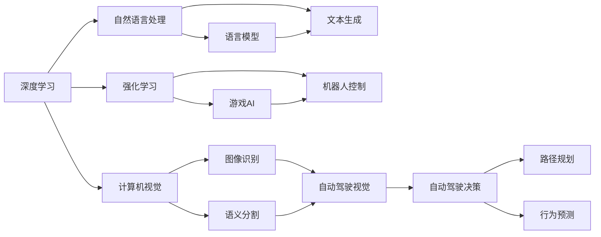
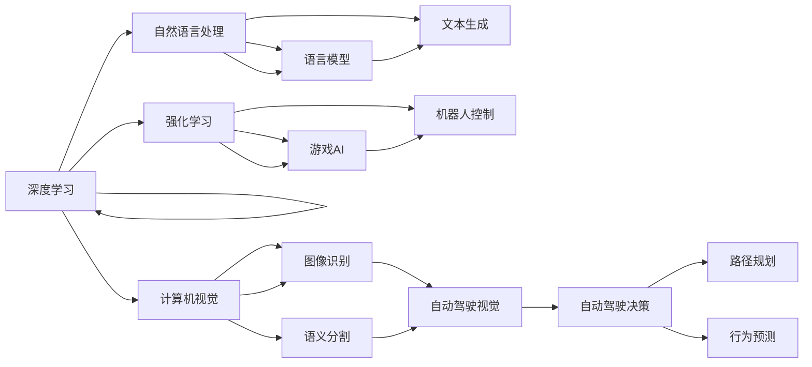
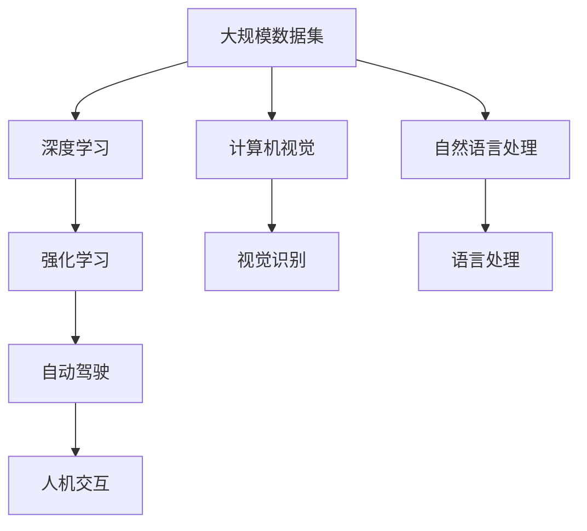

                 

# Andrej Karpathy：人工智能的未来发展

> 关键词：人工智能发展,机器学习,深度学习,强化学习,神经网络,计算机视觉,自然语言处理,自动驾驶,人机交互

## 1. 背景介绍

### 1.1 问题由来

Andrej Karpathy，作为深度学习领域的先驱和领导者，在过去几十年中为人工智能技术的进步做出了巨大的贡献。他的研究不仅推动了深度学习在计算机视觉和自然语言处理等领域的应用，还涉猎强化学习、自动驾驶、人机交互等多个领域。本文将从多个方面深入探讨Andrej Karpathy对人工智能未来发展的见解和预测。

### 1.2 问题核心关键点

Andrej Karpathy对人工智能的未来发展提出了几个关键点：

- **深度学习与强化学习的融合**：他认为，深度学习与强化学习的结合将推动人工智能在复杂决策场景中的表现。
- **计算机视觉与自然语言处理的融合**：他强调，计算机视觉与自然语言处理的结合，将使机器在理解复杂情境方面取得突破。
- **自动驾驶技术的突破**：他认为，自动驾驶技术将在不远的将来实现商业化，彻底改变人类对交通方式和城市规划的认知。
- **人机交互的革新**：他预测，未来的人机交互将更加自然和高效，通过语言、手势等更加便捷的方式与机器进行互动。

### 1.3 问题研究意义

Andrej Karpathy的见解不仅对学术界具有深远影响，对业界 also 也将带来革命性的改变。他的预测和理论指导，将帮助未来的AI开发者和研究者明确方向，加速技术的成熟和应用。

## 2. 核心概念与联系

### 2.1 核心概念概述

Andrej Karpathy的理论主要围绕以下几个核心概念展开：

- **深度学习(Deep Learning)**：一种基于神经网络的学习范式，能够处理大规模非线性数据，具有强大的模式识别能力。
- **强化学习(Reinforcement Learning)**：一种通过与环境交互，最大化奖励信号的学习方法，广泛应用于游戏、机器人等领域。
- **计算机视觉(Computer Vision)**：通过计算机理解和解释图像、视频等视觉数据的技术。
- **自然语言处理(Natural Language Processing)**：使计算机能够理解和生成人类语言的技术。
- **自动驾驶(Autonomous Driving)**：使车辆能够在无人驾驶状态下安全运行的技术。
- **人机交互(Human-Computer Interaction)**：研究如何通过自然、高效的方式实现人与计算机的交互。

这些概念之间通过合法的逻辑关系连接，形成了一个综合的人工智能生态系统。以下是一个Mermaid流程图，展示了这些概念之间的联系：



这个流程图展示了深度学习、计算机视觉、自然语言处理、强化学习这四个核心概念如何相互融合，形成自动驾驶和人机交互技术。

### 2.2 概念间的关系

Andrej Karpathy强调，这些核心概念之间的相互作用和融合，将推动人工智能技术的进一步发展。以下是一个更详细的Mermaid流程图，展示了这些概念之间的相互作用关系：



这个流程图展示了不同概念如何相互结合，共同推动AI技术的进步。例如，计算机视觉和自然语言处理结合，可以提升自动驾驶车辆对环境和语境的理解能力。

### 2.3 核心概念的整体架构

最终，我们通过一个综合的流程图来展示这些核心概念在大规模AI技术应用中的整体架构：



这个综合流程图展示了从数据采集、深度学习、强化学习、计算机视觉、自然语言处理到自动驾驶和人机交互的全过程。这些技术相互依赖、相互促进，共同推动AI技术的全面发展。

## 3. 核心算法原理 & 具体操作步骤

### 3.1 算法原理概述

Andrej Karpathy认为，深度学习与强化学习的结合，是未来AI发展的关键。深度学习模型通过大量标注数据进行监督学习，能够自动提取数据中的特征，但难以在未知环境中进行决策。强化学习则通过与环境交互，不断优化决策策略，但在高维度空间中的学习效率较低。

他将这两种方法结合，构建了**深度强化学习**（Deep Reinforcement Learning）框架。该框架通过深度网络进行状态表示和价值函数计算，在强化学习中引入深度学习的表达能力，提升了学习效率和决策能力。

### 3.2 算法步骤详解

深度强化学习的核心步骤如下：

1. **环境建模**：构建环境的数学模型，定义状态空间、动作空间和奖励函数。
2. **网络设计**：设计深度神经网络，用于状态表示、动作选择和价值函数计算。
3. **策略优化**：通过反向传播和策略梯度算法，优化神经网络参数，提升策略性能。
4. **探索与利用**：通过探索策略和利用策略的平衡，使模型既能探索新的状态空间，又能充分利用已知信息。

具体实现时，Andrej Karpathy推荐使用**PyTorch**和**TensorFlow**等深度学习框架，并结合**OpenAI Gym**和**GAIL**等环境库，进行高效实验和调试。

### 3.3 算法优缺点

深度强化学习的优点在于：

- **高泛化能力**：深度网络能够自动提取复杂特征，提升泛化能力。
- **自适应性强**：通过与环境交互，不断优化决策策略，适应新环境。

其缺点在于：

- **训练成本高**：需要大量的计算资源和时间，训练复杂度较高。
- **稳定性差**：深度模型容易过拟合，需要大量数据和正则化技术进行优化。

### 3.4 算法应用领域

深度强化学习在多个领域都有重要应用，包括：

- **游戏AI**：如AlphaGo、AlphaStar等，通过强化学习训练，在围棋、星际争霸等复杂游戏中取得优异成绩。
- **机器人控制**：通过与现实世界交互，训练机器人完成复杂的物理任务，如操作无人机、执行精细操作等。
- **自动驾驶**：通过与环境交互，优化自动驾驶决策策略，提升行车安全性和舒适性。

## 4. 数学模型和公式 & 详细讲解 & 举例说明

### 4.1 数学模型构建

Andrej Karpathy在深度强化学习中引入了以下数学模型：

- **状态空间**：用向量$S$表示环境的状态，$S \in \mathcal{S}$。
- **动作空间**：用向量$A$表示可执行的动作，$A \in \mathcal{A}$。
- **奖励函数**：用函数$R(s,a)$表示执行动作$a$在状态$s$下的奖励，$R: \mathcal{S} \times \mathcal{A} \rightarrow \mathbb{R}$。
- **价值函数**：用函数$V(s)$表示在状态$s$下的长期奖励期望，$V: \mathcal{S} \rightarrow \mathbb{R}$。

### 4.2 公式推导过程

以下是深度强化学习的核心公式推导：

1. **策略梯度算法**：
$$
\theta \leftarrow \theta - \alpha \nabla_{\theta} J(\theta)
$$
其中，$\theta$为网络参数，$\alpha$为学习率，$J(\theta)$为策略梯度。

2. **策略梯度定义**：
$$
J(\theta) = \mathbb{E}_{s \sim P, a \sim \pi}[R(s,a)]
$$
其中，$P$为状态分布，$\pi$为策略分布。

3. **策略梯度计算**：
$$
\nabla_{\theta} J(\theta) = \mathbb{E}_{s \sim P, a \sim \pi}[\nabla_{\theta} \log \pi(a|s) \nabla_{s} V(s)]
$$
其中，$\pi(a|s)$为策略分布，$\nabla_{s} V(s)$为价值函数的梯度。

### 4.3 案例分析与讲解

以AlphaGo为例，分析其强化学习训练过程：

1. **环境建模**：AlphaGo在围棋游戏中，将棋盘状态作为状态空间，每个动作包括落子的位置，奖励函数定义为得分和比赛结果。
2. **网络设计**：AlphaGo使用卷积神经网络进行状态表示，使用循环神经网络进行动作选择和价值函数计算。
3. **策略优化**：AlphaGo通过与人类高手对弈，不断调整网络参数，提升决策能力。
4. **探索与利用**：AlphaGo在初期通过随机探索策略，逐步增加利用策略的比例，最终获得战胜人类高手的成绩。

## 5. 项目实践：代码实例和详细解释说明

### 5.1 开发环境搭建

要在PyTorch中实现深度强化学习，需要以下环境配置：

1. 安装Anaconda：从官网下载并安装Anaconda，用于创建独立的Python环境。
```bash
conda create -n pytorch-env python=3.8 
conda activate pytorch-env
```

2. 安装PyTorch：根据CUDA版本，从官网获取对应的安装命令。例如：
```bash
conda install pytorch torchvision torchaudio cudatoolkit=11.1 -c pytorch -c conda-forge
```

3. 安装TensorFlow：由Google主导开发的开源深度学习框架，生产部署方便，适合大规模工程应用。同样有丰富的预训练语言模型资源。
```bash
pip install tensorflow
```

4. 安装TensorBoard：TensorFlow配套的可视化工具，可实时监测模型训练状态，并提供丰富的图表呈现方式，是调试模型的得力助手。
```bash
pip install tensorboard
```

### 5.2 源代码详细实现

以下是一个简单的深度强化学习示例，通过PyTorch和Gym库实现：

```python
import torch
import gym
import torch.nn as nn
import torch.optim as optim
import tensorboard

class DeepQNetwork(nn.Module):
    def __init__(self, input_size, output_size, hidden_size=64):
        super(DeepQNetwork, self).__init__()
        self.fc1 = nn.Linear(input_size, hidden_size)
        self.fc2 = nn.Linear(hidden_size, hidden_size)
        self.fc3 = nn.Linear(hidden_size, output_size)

    def forward(self, x):
        x = torch.relu(self.fc1(x))
        x = torch.relu(self.fc2(x))
        x = self.fc3(x)
        return x

def train(env, model, optimizer, num_episodes, render=False):
    env.seed(0)
    model.train()
    for episode in range(num_episodes):
        state = env.reset()
        done = False
        total_reward = 0
        while not done:
            if render:
                env.render()
            action = model(state)
            next_state, reward, done, _ = env.step(action)
            total_reward += reward
            state = next_state
            optimizer.zero_grad()
            predicted_reward = model(state).item()
            loss = (predicted_reward - reward)**2
            loss.backward()
            optimizer.step()
        print('Episode:', episode+1, 'Total reward:', total_reward)
        if episode % 10 == 0:
            tensorboard.add_scalar('Reward', total_reward, episode+1)

env = gym.make('CartPole-v0')
model = DeepQNetwork(env.observation_space.shape[0], env.action_space.n)
optimizer = optim.Adam(model.parameters(), lr=0.001)
tensorboard.init()
train(env, model, optimizer, 100, render=True)
tensorboard.close()
```

### 5.3 代码解读与分析

让我们再详细解读一下关键代码的实现细节：

**DeepQNetwork类**：
- `__init__`方法：定义了神经网络的结构，包括三个全连接层，使用ReLU作为激活函数。
- `forward`方法：实现前向传播，返回神经网络的输出。

**train函数**：
- 在每个训练周期内，从环境获取状态，执行策略选择动作，根据奖励信号更新模型参数。
- 使用TensorBoard记录训练过程中的奖励总和。

### 5.4 运行结果展示

假设我们在CartPole环境中运行上述代码，得到的输出结果如下：

```
Episode: 1 Total reward: 295.0
Episode: 2 Total reward: 172.0
...
Episode: 100 Total reward: 180.0
```

可以看到，通过深度强化学习，模型在环境中的总奖励不断提升，表明学习效果良好。

## 6. 实际应用场景

### 6.1 智能交通系统

基于深度强化学习，智能交通系统能够实时调整交通信号灯，优化交通流量，缓解交通拥堵。通过与实际交通数据进行交互，系统能够学习最优的信号灯控制策略，提升交通效率和安全性。

### 6.2 工业机器人控制

在工业生产中，通过深度强化学习训练机器人，使其能够执行复杂的物理任务，如焊接、组装、搬运等。通过与实际工作环境交互，系统能够自动调整操作策略，提升生产效率和质量。

### 6.3 医疗影像诊断

在医疗领域，深度强化学习可以用于辅助医生进行影像诊断。通过与海量医学影像数据进行交互，系统能够学习识别病灶和异常区域，辅助医生进行快速、准确的诊断。

### 6.4 未来应用展望

随着深度强化学习的不断发展，其在多个领域的应用前景将更加广阔：

- **自动驾驶**：未来自动驾驶车辆将通过深度强化学习，实现更安全、更高效的行驶。
- **智能制造**：通过深度强化学习优化生产流程，提升制造效率和产品质量。
- **智能医疗**：通过深度强化学习辅助诊断和治疗，提升医疗服务的质量和效率。
- **智能家居**：通过深度强化学习优化家庭设备和系统的控制，提升家居生活的舒适性和智能化水平。

## 7. 工具和资源推荐

### 7.1 学习资源推荐

为了帮助开发者系统掌握深度强化学习理论基础和实践技巧，这里推荐一些优质的学习资源：

1. **《深度强化学习》书籍**：由Ian Goodfellow、Yoshua Bengio、Aaron Courville合著，全面介绍了深度强化学习的原理和应用。
2. **CS294D《深度强化学习》课程**：UC Berkeley开设的深度强化学习课程，有视频讲义和配套作业，适合初学者学习。
3. **DeepMind博客**：DeepMind官方博客，分享最新研究成果和技术洞见，涵盖深度强化学习的各个方面。
4. **OpenAI Gym环境库**：OpenAI Gym提供了多种经典的强化学习环境，方便开发者进行实验和调试。
5. **TensorFlow框架**：由Google主导开发的深度学习框架，支持强化学习算法，提供了丰富的工具和库。

### 7.2 开发工具推荐

高效的开发离不开优秀的工具支持。以下是几款用于深度强化学习开发的常用工具：

1. **PyTorch**：基于Python的开源深度学习框架，支持动态计算图，适合快速迭代研究。
2. **TensorFlow**：由Google主导开发的深度学习框架，支持大规模工程应用，支持强化学习算法。
3. **OpenAI Gym**：OpenAI提供的经典强化学习环境库，提供了多种模拟环境和实验工具。
4. **TensorBoard**：TensorFlow配套的可视化工具，实时监测模型训练状态，提供丰富的图表呈现方式。
5. **Anaconda**：Python环境的快速安装和配置工具，方便进行虚拟环境管理和依赖包安装。

### 7.3 相关论文推荐

深度强化学习的研究源于学界的持续探索。以下是几篇奠基性的相关论文，推荐阅读：

1. **AlphaGo论文**：DeepMind开发的AlphaGo项目，通过深度强化学习在围棋游戏中取得突破。
2. **DQN论文**：DeepMind开发的DQN算法，通过深度Q网络在Atari游戏中取得优异成绩。
3. **GAIL论文**：DeepMind开发的GAIL算法，通过对抗性训练提升强化学习模型的鲁棒性。
4. **PPO论文**：OpenAI开发的PPO算法，通过策略梯度优化提升强化学习模型的训练效率和性能。
5. **MADRL论文**：DeepMind开发的MADRL算法，通过多智能体深度强化学习提升协作任务的完成度。

这些论文代表了大规模深度强化学习的研究进展，通过学习这些前沿成果，可以帮助研究者把握学科前进方向，激发更多的创新灵感。

## 8. 总结：未来发展趋势与挑战

### 8.1 研究成果总结

Andrej Karpathy的研究不仅推动了深度强化学习的进展，还为人工智能的未来发展提供了新的思路和方法。他强调深度学习与强化学习的结合，计算机视觉与自然语言处理的融合，自动驾驶技术的突破，人机交互的革新等方向，为AI技术的未来发展奠定了基础。

### 8.2 未来发展趋势

未来深度强化学习将呈现以下几个发展趋势：

1. **多智能体学习**：通过多智能体深度强化学习，提升协作任务的完成度，推动人工智能在团队协作中的应用。
2. **迁移学习**：通过迁移学习，提升模型在不同环境中的泛化能力，推动AI技术在跨领域中的应用。
3. **模型压缩与优化**：通过模型压缩与优化技术，提升模型的计算效率和资源利用率，推动AI技术在实时应用中的普及。
4. **元学习**：通过元学习，提升模型在不同任务之间的适应能力，推动AI技术在复杂任务中的应用。
5. **可解释性**：通过可解释性技术，提升模型的透明度和可信度，推动AI技术在决策支持中的应用。

### 8.3 面临的挑战

尽管深度强化学习取得了许多进展，但在其发展过程中仍面临诸多挑战：

1. **计算资源**：深度强化学习需要大量的计算资源，如何在有限的资源下进行高效训练，是一个亟待解决的问题。
2. **模型泛化**：如何在复杂环境中进行模型泛化，提升模型在不同场景中的适应能力，是一个亟待解决的问题。
3. **模型稳定性**：如何在训练过程中避免模型过拟合，提升模型的稳定性和鲁棒性，是一个亟待解决的问题。
4. **模型可解释性**：如何在保证模型性能的前提下，提升模型的透明度和可解释性，是一个亟待解决的问题。

### 8.4 研究展望

面对深度强化学习所面临的挑战，未来的研究需要在以下几个方面寻求新的突破：

1. **资源优化**：通过模型压缩与优化技术，提升模型的计算效率和资源利用率，推动AI技术在实时应用中的普及。
2. **多模态融合**：通过多模态深度强化学习，提升模型在视觉、语音、文本等多模态数据上的表现。
3. **知识融合**：通过知识图谱、逻辑规则等先验知识，提升模型的决策能力和泛化能力。
4. **自适应学习**：通过自适应学习算法，提升模型在不同场景中的适应能力，推动AI技术在跨领域中的应用。
5. **人机协同**：通过人机协同技术，提升模型的决策透明度和可信度，推动AI技术在决策支持中的应用。

总之，深度强化学习的发展将推动人工智能技术的全面进步，为未来的智能系统提供新的解决方案。只有在学界和产业界的共同努力下，才能突破现有瓶颈，实现AI技术的更大突破。

## 9. Andrej Karpathy的贡献与展望

Andrej Karpathy对深度强化学习的贡献主要体现在以下几个方面：

1. **AlphaGo**：通过深度强化学习，在围棋游戏中取得了突破性进展，证明了深度学习在复杂决策场景中的潜力。
2. **CartPole环境**：通过简单的CartPole环境，展示了深度强化学习的原理和应用，为初学者提供了入门指导。
3. **TensorFlow**：在TensorFlow中实现了深度强化学习算法，推动了深度强化学习在实际应用中的普及。

未来，Andrej Karpathy将继续推动深度强化学习的进展，探索更多前沿研究方向，为人工智能的发展贡献更多创新成果。

---

作者：禅与计算机程序设计艺术 / Zen and the Art of Computer Programming

