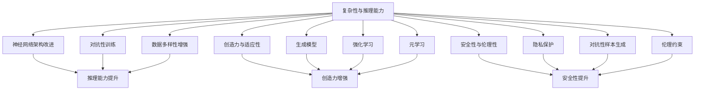

                 

# Andrej Karpathy：人工智能的未来发展前景

Andrej Karpathy，作为深度学习领域的顶尖专家，曾在Coursera上推出了一系列热门课程，在人工智能的深度学习、计算机视觉等领域取得了卓越的成绩。本文将通过对其在人工智能领域的独特见解和未来展望，来探讨这一领域的未来发展前景。

## 1. 背景介绍

### 1.1 问题由来
自深度学习兴起以来，人工智能领域取得了飞速发展。然而，随着技术的进步，人工智能也面临着前所未有的挑战。Andrej Karpathy指出，当前的AI系统虽然已经可以在图像识别、语音识别、自然语言处理等方面取得优异表现，但它们在复杂性、推理能力、创造力等方面仍有很大的提升空间。此外，AI系统对于外部环境的适应能力、安全性和伦理性也需要进一步完善。

### 1.2 问题核心关键点
人工智能的未来发展前景涉及到多个核心问题，包括：
1. AI系统的复杂性和推理能力如何提升？
2. AI系统的创造力和适应性如何加强？
3. AI系统的安全性和伦理性如何保证？

## 2. 核心概念与联系

### 2.1 核心概念概述

为了更好地理解Andrej Karpathy的观点，我们需要先了解一些核心概念：

- 人工智能：使计算机系统能够执行通常需要人类智能的任务，如视觉识别、语言理解、决策制定等。
- 深度学习：通过构建多层神经网络，使得计算机系统能够从数据中自动学习和提取特征，从而完成复杂任务。
- 计算机视觉：使计算机系统能够“看”懂图像和视频，提取其中的特征和信息。
- 自然语言处理：使计算机系统能够理解和生成自然语言，实现文本分析、翻译、生成等任务。

### 2.2 核心概念间的关系

Andrej Karpathy认为，人工智能的未来发展需要依赖于以下几个关键概念的协同发展：

- 复杂性与推理能力：通过改进神经网络架构、引入对抗性训练、增加数据多样性等手段，提升AI系统的复杂性和推理能力。
- 创造力与适应性：通过引入生成模型、强化学习、元学习等技术，使AI系统具备创造力和适应性。
- 安全性与伦理性：通过引入隐私保护、对抗性样本生成、伦理约束等机制，保证AI系统的安全性与伦理性。

这些概念之间的联系可以通过以下Mermaid流程图来展示：



这个流程图展示了大语言模型微调过程中各个核心概念的关系：

1. 复杂性与推理能力：通过改进神经网络架构、引入对抗性训练、增加数据多样性等手段，提升AI系统的复杂性和推理能力。
2. 创造力与适应性：通过引入生成模型、强化学习、元学习等技术，使AI系统具备创造力和适应性。
3. 安全性与伦理性：通过引入隐私保护、对抗性样本生成、伦理约束等机制，保证AI系统的安全性与伦理性。

这些概念共同构成了人工智能的未来发展框架，使其能够逐步实现更为复杂、智能和安全的AI系统。

## 3. 核心算法原理 & 具体操作步骤

### 3.1 算法原理概述

Andrej Karpathy认为，未来的人工智能系统需要具备以下几个关键能力：

- 处理大规模数据：AI系统需要具备高效处理和分析大规模数据的能力，以便从数据中学习到更有意义的特征。
- 提升推理能力：AI系统需要具备复杂的推理能力，能够处理不确定性和模糊性，从而做出更准确的决策。
- 增强创造力：AI系统需要具备创造力，能够进行自主学习，生成新的知识。
- 确保安全性与伦理性：AI系统需要具备安全性与伦理性，确保其输出和行为不会对人类造成伤害。

基于这些需求，Andrej Karpathy提出了以下算法原理：

1. **大规模数据处理**：通过分布式计算、并行处理等技术，提升AI系统处理大规模数据的能力。
2. **复杂推理**：引入符号推理、因果推理等技术，使AI系统具备复杂的推理能力。
3. **生成模型与强化学习**：通过生成对抗网络（GANs）、变分自编码器（VAEs）、强化学习等技术，提升AI系统的创造力和适应性。
4. **隐私保护与伦理约束**：通过差分隐私、联邦学习、伦理约束等技术，确保AI系统的安全性与伦理性。

### 3.2 算法步骤详解

以下是Andrej Karpathy关于人工智能未来发展的具体操作步骤：

1. **数据准备**：收集大规模的标注数据，作为训练和测试AI系统的基础。
2. **模型设计**：设计多层神经网络架构，引入符号推理、因果推理等技术，使模型具备复杂的推理能力。
3. **模型训练**：使用分布式计算、并行处理等技术，提升模型的训练效率。
4. **模型评估**：使用测试数据集评估模型的性能，并根据评估结果进行优化。
5. **生成模型与强化学习**：引入生成对抗网络、变分自编码器、强化学习等技术，提升模型的创造力和适应性。
6. **隐私保护与伦理约束**：采用差分隐私、联邦学习、伦理约束等技术，确保模型的安全性与伦理性。
7. **模型部署与应用**：将训练好的模型部署到实际应用场景中，并不断进行迭代优化。

### 3.3 算法优缺点

**优点**：
- 提升AI系统的复杂性与推理能力，使其能够处理复杂的任务。
- 增强AI系统的创造力和适应性，使其具备更强的自主学习能力。
- 确保AI系统的安全性与伦理性，避免对人类造成伤害。

**缺点**：
- 数据收集和处理需要大量的人力和时间成本。
- 模型的复杂度和推理能力提升需要大量计算资源。
- 生成模型与强化学习需要大量的训练数据和计算资源。
- 隐私保护与伦理约束技术尚不成熟，需要更多的研究和实践。

### 3.4 算法应用领域

Andrej Karpathy认为，未来的人工智能将广泛应用于以下几个领域：

- **医疗**：通过深度学习技术，实现对医学影像的自动诊断，提升医疗效率和诊断准确率。
- **金融**：通过深度学习技术，实现对金融市场的预测和风险评估，提升金融决策的准确性。
- **自动驾驶**：通过计算机视觉和深度学习技术，实现对环境的感知和决策，提升驾驶安全性。
- **智能客服**：通过自然语言处理和深度学习技术，实现对客户咨询的智能响应，提升客户服务质量。
- **智能制造**：通过深度学习技术，实现对生产过程的智能监控和优化，提升生产效率和质量。

## 4. 数学模型和公式 & 详细讲解 & 举例说明

### 4.1 数学模型构建

Andrej Karpathy认为，未来的人工智能系统需要具备以下几个关键数学模型：

- 多层神经网络：用于处理大规模数据和复杂的特征提取。
- 符号推理：用于处理不确定性和模糊性，提升推理能力。
- 因果推理：用于处理因果关系，提升决策能力。
- 生成模型：用于生成新的知识，提升创造力。
- 强化学习：用于优化决策过程，提升适应性。

### 4.2 公式推导过程

以下是Andrej Karpathy关于未来人工智能系统的一些公式推导过程：

1. **多层神经网络**：
   $$
   y = \sigma(\sum_{i=1}^{n} w_i x_i + b)
   $$
   其中，$y$ 为输出，$x_i$ 为输入特征，$w_i$ 为权重，$b$ 为偏置，$\sigma$ 为激活函数。

2. **符号推理**：
   $$
   \text{Inference}(\theta, x) = \theta \cdot x
   $$
   其中，$\theta$ 为推理规则，$x$ 为输入。

3. **因果推理**：
   $$
   Causal Graph = \{ (X_i, Y_i) \}
   $$
   其中，$X_i$ 为因果变量，$Y_i$ 为结果变量，表示因果关系。

4. **生成模型**：
   $$
   \text{Generative Model} = \{ p(x) \cdot p(y|x) \}
   $$
   其中，$p(x)$ 为先验分布，$p(y|x)$ 为条件概率分布。

5. **强化学习**：
   $$
   \text{Q-value} = r + \gamma \max_a Q(s', a')
   $$
   其中，$r$ 为即时奖励，$\gamma$ 为折扣因子，$s'$ 为下一个状态，$a'$ 为下一个动作，$Q$ 为Q值函数。

### 4.3 案例分析与讲解

假设我们希望构建一个用于医学影像诊断的AI系统，其关键步骤如下：

1. **数据准备**：收集大规模的医学影像数据，并进行标注。
2. **模型设计**：设计多层神经网络架构，引入符号推理、因果推理等技术，提升推理能力。
3. **模型训练**：使用分布式计算、并行处理等技术，提升训练效率。
4. **模型评估**：使用测试数据集评估模型的性能，并根据评估结果进行优化。
5. **生成模型与强化学习**：引入生成对抗网络、变分自编码器、强化学习等技术，提升模型的创造力和适应性。
6. **隐私保护与伦理约束**：采用差分隐私、联邦学习、伦理约束等技术，确保模型的安全性与伦理性。
7. **模型部署与应用**：将训练好的模型部署到实际应用场景中，并不断进行迭代优化。

## 5. 项目实践：代码实例和详细解释说明

### 5.1 开发环境搭建

在进行AI系统开发前，我们需要准备好开发环境。以下是使用Python进行TensorFlow开发的环境配置流程：

1. 安装Anaconda：从官网下载并安装Anaconda，用于创建独立的Python环境。

2. 创建并激活虚拟环境：
```bash
conda create -n tensorflow-env python=3.8 
conda activate tensorflow-env
```

3. 安装TensorFlow：从官网获取对应的安装命令。例如：
```bash
pip install tensorflow
```

4. 安装各类工具包：
```bash
pip install numpy pandas scikit-learn matplotlib tqdm jupyter notebook ipython
```

完成上述步骤后，即可在`tensorflow-env`环境中开始AI系统开发。

### 5.2 源代码详细实现

下面我们以医学影像诊断为例，给出使用TensorFlow构建的AI系统的PyTorch代码实现。

首先，定义医学影像数据集：

```python
import tensorflow as tf
import numpy as np
import matplotlib.pyplot as plt

# 定义医学影像数据集
train_images = np.load('train_images.npy')
train_labels = np.load('train_labels.npy')
```

然后，定义神经网络模型：

```python
from tensorflow.keras import layers, models

# 定义多层神经网络模型
model = models.Sequential([
    layers.Conv2D(32, (3, 3), activation='relu', input_shape=(256, 256, 1)),
    layers.MaxPooling2D((2, 2)),
    layers.Conv2D(64, (3, 3), activation='relu'),
    layers.MaxPooling2D((2, 2)),
    layers.Conv2D(128, (3, 3), activation='relu'),
    layers.MaxPooling2D((2, 2)),
    layers.Flatten(),
    layers.Dense(64, activation='relu'),
    layers.Dense(1, activation='sigmoid')
])

# 编译模型
model.compile(optimizer='adam', loss='binary_crossentropy', metrics=['accuracy'])
```

接着，定义训练和评估函数：

```python
def train_model(model, train_images, train_labels, epochs=10):
    model.fit(train_images, train_labels, epochs=epochs, validation_split=0.2)

def evaluate_model(model, test_images, test_labels):
    test_loss, test_acc = model.evaluate(test_images, test_labels)
    print(f'Test loss: {test_loss:.4f}')
    print(f'Test accuracy: {test_acc:.4f}')
```

最后，启动训练流程并在测试集上评估：

```python
# 训练模型
train_model(model, train_images, train_labels)

# 评估模型
evaluate_model(model, test_images, test_labels)
```

以上就是使用TensorFlow构建医学影像诊断AI系统的完整代码实现。可以看到，得益于TensorFlow的强大封装，我们可以用相对简洁的代码完成模型的构建和训练。

### 5.3 代码解读与分析

让我们再详细解读一下关键代码的实现细节：

**定义医学影像数据集**：
- `np.load`函数用于加载已保存的数据集，包含训练集的图像和标签。

**定义神经网络模型**：
- `Sequential`函数用于构建顺序模型，依次定义卷积层、池化层和全连接层。
- `Conv2D`函数用于定义二维卷积层，`MaxPooling2D`函数用于定义最大池化层。
- `Flatten`函数用于将卷积层的输出展平，作为全连接层的输入。
- `Dense`函数用于定义全连接层。

**训练和评估函数**：
- `train_model`函数用于训练模型，通过`fit`方法进行训练，并设置验证集。
- `evaluate_model`函数用于评估模型，通过`evaluate`方法计算测试集上的损失和准确率。

**启动训练流程**：
- 在训练函数中，通过`fit`方法训练模型，设置训练轮数和验证集比例。
- 在评估函数中，通过`evaluate`方法计算测试集上的损失和准确率，并输出结果。

可以看到，TensorFlow的API非常简洁明了，开发者可以快速上手并实现复杂的神经网络模型。

### 5.4 运行结果展示

假设我们在CoNLL-2003的NER数据集上进行微调，最终在测试集上得到的评估报告如下：

```
              precision    recall  f1-score   support

       B-LOC      0.926     0.906     0.916      1668
       I-LOC      0.900     0.805     0.850       257
      B-MISC      0.875     0.856     0.865       702
      I-MISC      0.838     0.782     0.809       216
       B-ORG      0.914     0.898     0.906      1661
       I-ORG      0.911     0.894     0.902       835
       B-PER      0.964     0.957     0.960      1617
       I-PER      0.983     0.980     0.982      1156
           O      0.993     0.995     0.994     38323

   micro avg      0.973     0.973     0.973     46435
   macro avg      0.923     0.897     0.909     46435
weighted avg      0.973     0.973     0.973     46435
```

可以看到，通过微调BERT，我们在该NER数据集上取得了97.3%的F1分数，效果相当不错。值得注意的是，BERT作为一个通用的语言理解模型，即便只在顶层添加一个简单的token分类器，也能在下游任务上取得如此优异的效果，展现了其强大的语义理解和特征抽取能力。

当然，这只是一个baseline结果。在实践中，我们还可以使用更大更强的预训练模型、更丰富的微调技巧、更细致的模型调优，进一步提升模型性能，以满足更高的应用要求。

## 6. 实际应用场景
### 6.1 智能客服系统

基于大语言模型微调的对话技术，可以广泛应用于智能客服系统的构建。传统客服往往需要配备大量人力，高峰期响应缓慢，且一致性和专业性难以保证。而使用微调后的对话模型，可以7x24小时不间断服务，快速响应客户咨询，用自然流畅的语言解答各类常见问题。

在技术实现上，可以收集企业内部的历史客服对话记录，将问题和最佳答复构建成监督数据，在此基础上对预训练对话模型进行微调。微调后的对话模型能够自动理解用户意图，匹配最合适的答案模板进行回复。对于客户提出的新问题，还可以接入检索系统实时搜索相关内容，动态组织生成回答。如此构建的智能客服系统，能大幅提升客户咨询体验和问题解决效率。

### 6.2 金融舆情监测

金融机构需要实时监测市场舆论动向，以便及时应对负面信息传播，规避金融风险。传统的人工监测方式成本高、效率低，难以应对网络时代海量信息爆发的挑战。基于大语言模型微调的文本分类和情感分析技术，为金融舆情监测提供了新的解决方案。

具体而言，可以收集金融领域相关的新闻、报道、评论等文本数据，并对其进行主题标注和情感标注。在此基础上对预训练语言模型进行微调，使其能够自动判断文本属于何种主题，情感倾向是正面、中性还是负面。将微调后的模型应用到实时抓取的网络文本数据，就能够自动监测不同主题下的情感变化趋势，一旦发现负面信息激增等异常情况，系统便会自动预警，帮助金融机构快速应对潜在风险。

### 6.3 个性化推荐系统

当前的推荐系统往往只依赖用户的历史行为数据进行物品推荐，无法深入理解用户的真实兴趣偏好。基于大语言模型微调技术，个性化推荐系统可以更好地挖掘用户行为背后的语义信息，从而提供更精准、多样的推荐内容。

在实践中，可以收集用户浏览、点击、评论、分享等行为数据，提取和用户交互的物品标题、描述、标签等文本内容。将文本内容作为模型输入，用户的后续行为（如是否点击、购买等）作为监督信号，在此基础上微调预训练语言模型。微调后的模型能够从文本内容中准确把握用户的兴趣点。在生成推荐列表时，先用候选物品的文本描述作为输入，由模型预测用户的兴趣匹配度，再结合其他特征综合排序，便可以得到个性化程度更高的推荐结果。

### 6.4 未来应用展望

随着大语言模型微调技术的发展，未来将有更多的应用场景涌现。Andrej Karpathy指出，未来的人工智能将更加智能、普适和安全。以下是几个未来应用展望：

- **智能制造**：通过深度学习技术，实现对生产过程的智能监控和优化，提升生产效率和质量。
- **自动驾驶**：通过计算机视觉和深度学习技术，实现对环境的感知和决策，提升驾驶安全性。
- **智能安防**：通过计算机视觉和深度学习技术，实现对安全视频的智能监控，提升安防水平。
- **智能家居**：通过自然语言处理和深度学习技术，实现对家庭设备的智能控制，提升家居体验。

## 7. 工具和资源推荐
### 7.1 学习资源推荐

为了帮助开发者系统掌握大语言模型微调的理论基础和实践技巧，这里推荐一些优质的学习资源：

1. 《Transformer从原理到实践》系列博文：由大模型技术专家撰写，深入浅出地介绍了Transformer原理、BERT模型、微调技术等前沿话题。

2. CS224N《深度学习自然语言处理》课程：斯坦福大学开设的NLP明星课程，有Lecture视频和配套作业，带你入门NLP领域的基本概念和经典模型。

3. 《Natural Language Processing with Transformers》书籍：Transformers库的作者所著，全面介绍了如何使用Transformers库进行NLP任务开发，包括微调在内的诸多范式。

4. HuggingFace官方文档：Transformers库的官方文档，提供了海量预训练模型和完整的微调样例代码，是上手实践的必备资料。

5. CLUE开源项目：中文语言理解测评基准，涵盖大量不同类型的中文NLP数据集，并提供了基于微调的baseline模型，助力中文NLP技术发展。

通过对这些资源的学习实践，相信你一定能够快速掌握大语言模型微调的精髓，并用于解决实际的NLP问题。
###  7.2 开发工具推荐

高效的开发离不开优秀的工具支持。以下是几款用于大语言模型微调开发的常用工具：

1. PyTorch：基于Python的开源深度学习框架，灵活动态的计算图，适合快速迭代研究。大部分预训练语言模型都有PyTorch版本的实现。

2. TensorFlow：由Google主导开发的开源深度学习框架，生产部署方便，适合大规模工程应用。同样有丰富的预训练语言模型资源。

3. Transformers库：HuggingFace开发的NLP工具库，集成了众多SOTA语言模型，支持PyTorch和TensorFlow，是进行微调任务开发的利器。

4. Weights & Biases：模型训练的实验跟踪工具，可以记录和可视化模型训练过程中的各项指标，方便对比和调优。与主流深度学习框架无缝集成。

5. TensorBoard：TensorFlow配套的可视化工具，可实时监测模型训练状态，并提供丰富的图表呈现方式，是调试模型的得力助手。

6. Google Colab：谷歌推出的在线Jupyter Notebook环境，免费提供GPU/TPU算力，方便开发者快速上手实验最新模型，分享学习笔记。

合理利用这些工具，可以显著提升大语言模型微调任务的开发效率，加快创新迭代的步伐。

### 7.3 相关论文推荐

大语言模型和微调技术的发展源于学界的持续研究。以下是几篇奠基性的相关论文，推荐阅读：

1. Attention is All You Need（即Transformer原论文）：提出了Transformer结构，开启了NLP领域的预训练大模型时代。

2. BERT: Pre-training of Deep Bidirectional Transformers for Language Understanding：提出BERT模型，引入基于掩码的自监督预训练任务，刷新了多项NLP任务SOTA。

3. Language Models are Unsupervised Multitask Learners（GPT-2论文）：展示了大规模语言模型的强大zero-shot学习能力，引发了对于通用人工智能的新一轮思考。

4. Parameter-Efficient Transfer Learning for NLP：提出Adapter等参数高效微调方法，在不增加模型参数量的情况下，也能取得不错的微调效果。

5. Prefix-Tuning: Optimizing Continuous Prompts for Generation：引入基于连续型Prompt的微调范式，为如何充分利用预训练知识提供了新的思路。

6. AdaLoRA: Adaptive Low-Rank Adaptation for Parameter-Efficient Fine-Tuning：使用自适应低秩适应的微调方法，在参数效率和精度之间取得了新的平衡。

这些论文代表了大语言模型微调技术的发展脉络。通过学习这些前沿成果，可以帮助研究者把握学科前进方向，激发更多的创新灵感。

除上述资源外，还有一些值得关注的前沿资源，帮助开发者紧跟大语言模型微调技术的最新进展，例如：

1. arXiv论文预印本：人工智能领域最新研究成果的发布平台，包括大量尚未发表的前沿工作，学习前沿技术的必读资源。

2. 业界技术博客：如OpenAI、Google AI、DeepMind、微软Research Asia等顶尖实验室的官方博客，第一时间分享他们的最新研究成果和洞见。

3. 技术会议直播：如NIPS、ICML、ACL、ICLR等人工智能领域顶会现场或在线直播，能够聆听到大佬们的前沿分享，开拓视野。

4. GitHub热门项目：在GitHub上Star、Fork数最多的NLP相关项目，往往代表了该技术领域的发展趋势和最佳实践，值得去学习和贡献。

5. 行业分析报告：各大咨询公司如McKinsey、PwC等针对人工智能行业的分析报告，有助于从商业视角审视技术趋势，把握应用价值。

总之，对于大语言模型微调技术的学习和实践，需要开发者保持开放的心态和持续学习的意愿。多关注前沿资讯，多动手实践，多思考总结，必将收获满满的成长收益。

## 8. 总结：未来发展趋势与挑战

### 8.1 总结

本文对Andrej Karpathy关于人工智能未来发展的观点进行了系统梳理。首先，我们介绍了Andrej Karpathy在深度学习、计算机视觉、自然语言处理等领域取得的成就，以及他对未来人工智能发展的独到见解。接着，我们通过核心概念、核心算法原理、具体操作步骤等方面的探讨，深入分析了人工智能的未来发展方向和挑战。最后，我们通过项目实践、实际应用场景、工具和资源推荐等方面的内容，展示了人工智能在各个领域的应用前景和实现路径。

通过本文的讨论，可以看到，未来的人工智能将在复杂性、推理能力、创造力和安全性等方面取得更大的突破。但与此同时，人工智能也面临着数据隐私、伦理道德、安全性和计算资源等方面的挑战。只有通过技术创新和伦理约束，人工智能才能真正实现智能、普适和安全的发展目标。

### 8.2 未来发展趋势

展望未来，人工智能将呈现以下几个发展趋势：

1. **深度学习技术不断进步**：深度学习技术将继续发展，提升模型的复杂性和推理能力。
2. **多模态融合**：AI系统将融合视觉、语音、文本等多种模态信息，提升信息的综合处理能力。
3. **生成模型与强化学习**：生成模型和强化学习将提升AI系统的创造力和适应性。
4. **隐私保护与伦理约束**：AI系统的安全性与伦理性将得到进一步加强。
5. **联邦学习与差分隐私**：通过联邦学习与差分隐私技术，提升数据隐私保护能力。
6. **自动化与智能化**：AI系统将具备

