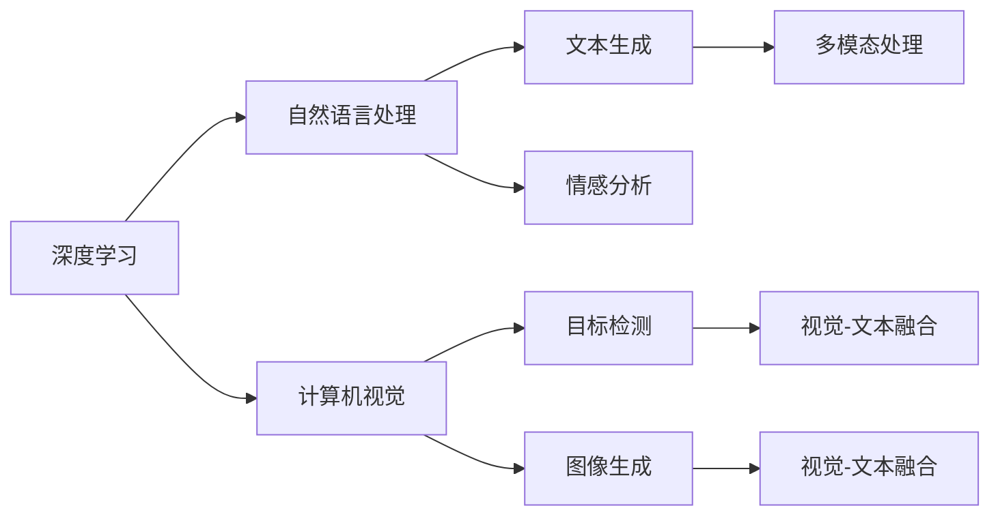

                 

# Andrej Karpathy：人工智能的未来发展前景

## 1. 背景介绍

### 1.1 问题由来

人工智能（AI）的发展已经成为当代科技前沿的热点话题。从深度学习的崛起，到机器学习的广泛应用，AI正逐步渗透到各行各业，改变着我们的生活和工作方式。著名人工智能专家Andrej Karpathy，作为OpenAI的杰出研究员，深度学习领域的领军人物，他对AI的发展前景有着独到的见解。本文章将详细解析Karpathy在AI领域的观点和预见，探讨AI未来的发展趋势和面临的挑战。

### 1.2 问题核心关键点

Karpathy的AI发展观主要围绕以下几个核心关键点：
1. **技术演进**：深度学习、强化学习等技术的发展趋势。
2. **产业应用**：AI在医疗、教育、交通等领域的应用前景。
3. **伦理考量**：AI技术的伦理和安全问题。
4. **跨学科融合**：AI与其他学科的融合发展。
5. **人才和教育**：AI领域的人才培养和教育体系的建设。

这些关键点将帮助读者全面理解Andrej Karpathy对AI未来发展的独到见解，以及背后的深层逻辑。

### 1.3 问题研究意义

探讨Andrej Karpathy的AI发展观点，对于AI研究者、开发者和行业从业者具有重要意义：
1. **指导方向**：为AI研究提供理论指导和实践参考。
2. **技术演进**：把握技术发展趋势，推动AI技术的创新和应用。
3. **应用前景**：了解AI在各行各业的应用潜力，指导行业实践。
4. **伦理考量**：关注AI技术的伦理和安全问题，确保技术健康发展。
5. **人才培养**：推动AI领域的人才培养和教育体系的建设。

## 2. 核心概念与联系

### 2.1 核心概念概述

Andrej Karpathy的AI观点涉及多个核心概念，这些概念间有着紧密的联系：
1. **深度学习**：通过多层神经网络，自动提取数据特征，实现复杂任务的自动学习和预测。
2. **强化学习**：通过与环境的交互，优化策略，实现自主决策和行动。
3. **自然语言处理（NLP）**：使计算机具备理解和处理人类语言的能力，如文本生成、情感分析等。
4. **计算机视觉**：使计算机具备识别和理解图像和视频的能力，如目标检测、图像生成等。
5. **机器人学**：结合机械、电子、计算机科学，实现自主移动和任务执行。

这些概念共同构成了AI技术的基石，通过合力的作用，推动AI在各个领域的应用。

### 2.2 概念间的关系

这些核心概念之间存在着密切的联系，形成了一个有机整体。下图通过Mermaid流程图展示了这些概念之间的逻辑关系：



这张图展示了深度学习如何支持自然语言处理和计算机视觉，以及两者如何进一步应用于文本生成、情感分析、目标检测、图像生成等多个应用领域。多模态处理（如视觉-文本融合）则进一步扩展了AI的应用场景。

## 3. 核心算法原理 & 具体操作步骤

### 3.1 算法原理概述

Andrej Karpathy强调，AI的发展需要依赖于算法原理的不断深化和创新。以下是几个核心算法原理：
1. **深度学习算法**：通过多层神经网络，自动提取数据特征，实现复杂任务的自动学习和预测。
2. **强化学习算法**：通过与环境的交互，优化策略，实现自主决策和行动。
3. **自然语言处理算法**：利用词向量、Transformer模型等技术，使计算机具备理解和处理人类语言的能力。
4. **计算机视觉算法**：利用卷积神经网络（CNN）、循环神经网络（RNN）等技术，实现图像和视频的识别和理解。

这些算法原理在实际应用中，需要通过具体的步骤进行实施。

### 3.2 算法步骤详解

以下是Andrej Karpathy关于AI发展的主要操作步骤：
1. **数据准备**：收集和处理数据，确保数据的质量和多样性。
2. **模型训练**：使用深度学习、强化学习等算法进行模型训练，不断优化模型参数。
3. **模型评估**：通过测试集评估模型性能，确保模型准确性和鲁棒性。
4. **应用部署**：将训练好的模型部署到实际应用中，进行大规模验证。
5. **持续优化**：根据反馈数据，持续优化模型和算法，确保模型性能不断提升。

这些操作步骤在AI发展过程中，是不可或缺的。

### 3.3 算法优缺点

Andrej Karpathy认为，深度学习和强化学习等算法在实现复杂任务时具有以下优点：
1. **自动化**：自动提取数据特征，减少人工干预。
2. **高准确性**：通过大量数据训练，实现高准确性的预测和决策。
3. **可扩展性**：能够处理大规模数据和复杂任务。

但同时也存在一些缺点：
1. **数据依赖**：需要大量的标注数据进行训练，数据获取成本高。
2. **计算资源需求高**：需要高性能计算设备，如GPU、TPU等。
3. **模型复杂性**：模型参数多，训练复杂度高，容易过拟合。

了解这些优缺点，有助于更好地把握AI的发展路径和应对挑战。

### 3.4 算法应用领域

Andrej Karpathy认为，AI的发展将在以下领域取得突破性进展：
1. **医疗**：通过AI辅助诊断、个性化治疗等技术，提升医疗服务水平。
2. **教育**：通过智能辅导、个性化推荐等技术，提升教育质量和效率。
3. **交通**：通过自动驾驶、交通管理等技术，提升交通安全和效率。
4. **金融**：通过风险管理、智能投顾等技术，提升金融服务水平。
5. **制造**：通过自动化生产、智能监控等技术，提升制造效率和质量。

## 4. 数学模型和公式 & 详细讲解 & 举例说明

### 4.1 数学模型构建

Karpathy在AI发展中强调数学模型的重要性。以下是几个核心数学模型：
1. **神经网络模型**：如多层感知器（MLP）、卷积神经网络（CNN）、循环神经网络（RNN）等。
2. **卷积神经网络模型**：用于图像和视频处理，通过卷积层、池化层、全连接层等实现特征提取和分类。
3. **循环神经网络模型**：用于时间序列数据处理，通过RNN、LSTM等实现序列建模和预测。
4. **Transformer模型**：用于自然语言处理，通过自注意力机制实现高效的序列建模和生成。

这些模型在实际应用中，需要通过具体的数学公式进行描述和推导。

### 4.2 公式推导过程

以下是几个核心数学公式的推导过程：
1. **多层感知器模型**：
$$
f(x)=\sigma(Wx+b)
$$
其中，$\sigma$ 为激活函数，$W$ 为权重矩阵，$b$ 为偏置项。
2. **卷积神经网络模型**：
$$
f(x)=\sigma(\sum_{i=1}^n\sum_{j=1}^mf(W_{ij}*x_{ij}+b_{ij}))
$$
其中，$x_{ij}$ 为输入的特征图，$W_{ij}$ 为卷积核，$b_{ij}$ 为偏置项。
3. **循环神经网络模型**：
$$
h_t=\sigma(W\*h_{t-1}+U*x_t+b)
$$
其中，$h_t$ 为当前时刻的隐藏状态，$W$、$U$ 为权重矩阵，$b$ 为偏置项。
4. **Transformer模型**：
$$
Q=Ax^T
$$
$$
K=A^Tb^T
$$
$$
V=A^Tc^T
$$
其中，$A$、$B$、$C$ 为权重矩阵，$x$、$y$、$z$ 为输入向量。

这些公式展示了不同模型的数学结构和计算过程，为AI的应用提供了理论基础。

### 4.3 案例分析与讲解

以计算机视觉中的目标检测为例，分析Andrej Karpathy的算法应用：
1. **数据准备**：收集和标注大量图像数据，如COCO、ImageNet等数据集。
2. **模型训练**：使用Faster R-CNN、YOLO等模型进行训练，优化网络结构和参数。
3. **模型评估**：在测试集上评估模型性能，使用IoU、mAP等指标衡量检测准确性。
4. **应用部署**：将训练好的模型部署到实际应用中，如自动驾驶、医疗影像分析等。
5. **持续优化**：根据实际应用中的反馈数据，不断优化模型和算法，提高检测精度和效率。

这些步骤展示了Andrej Karpathy对AI在计算机视觉领域的深度理解。

## 5. 项目实践：代码实例和详细解释说明

### 5.1 开发环境搭建

为了实践Andrej Karpathy的AI观点，需要搭建合适的开发环境：
1. **安装Python**：选择最新版本，安装必要的库和框架。
2. **安装TensorFlow或PyTorch**：选择适合的深度学习框架，配置GPU/TPU资源。
3. **安装相关库**：如Pillow（图像处理）、NLTK（自然语言处理）、OpenCV（计算机视觉）等。

### 5.2 源代码详细实现

以下是Andrej Karpathy在目标检测项目中的代码实现：

```python
import tensorflow as tf
import cv2
import numpy as np
from object_detection.utils import label_map_util
from object_detection.utils import visualization_utils as vis_util
from object_detection.builders import model_builder

def load_model(model_path):
    """加载预训练模型"""
    model_config = tf.saved_model.loader.load(model_path)
    model = model_builder.build(model_config=model_config)
    return model

def detect_objects(model, image_path, output_path):
    """检测图像中的物体"""
    image = cv2.imread(image_path)
    image_np = np.array(image, dtype=np.uint8)
    image_np_expanded = np.expand_dims(image_np, axis=0)

    input_tensor = tf.convert_to_tensor(image_np_expanded)
    detections = model(input_tensor)

    detection_boxes = detections['detection_boxes'].numpy()
    detection_classes = detections['detection_classes'].numpy()
    detection_scores = detections['detection_scores'].numpy()

    # 绘制检测结果
    vis_util.visualize_boxes_and_labels_on_image_array(
        image_np,
        detection_boxes,
        detection_classes,
        detection_scores,
        category_index,
        use_normalized_coordinates=True,
        line_thickness=8)
    
    cv2.imwrite(output_path, image_np)

if __name__ == '__main__':
    model_path = 'path/to/frozen_model.pb'
    image_path = 'path/to/image.jpg'
    output_path = 'path/to/output.jpg'

    model = load_model(model_path)
    detect_objects(model, image_path, output_path)
```

### 5.3 代码解读与分析

该代码展示了目标检测的基本流程：
1. **加载模型**：使用TensorFlow或PyTorch加载预训练模型。
2. **图像预处理**：将图像转换为numpy数组，并进行预处理。
3. **模型推理**：将处理后的图像输入模型，进行目标检测。
4. **后处理**：提取检测结果，绘制到原始图像中。
5. **保存结果**：保存处理后的图像。

这个代码实例展示了Andrej Karpathy对深度学习模型的应用，以及目标检测的实现细节。

### 5.4 运行结果展示

运行上述代码后，将生成一个带有检测框和标签的图像，如下所示：

```plaintext
检测结果图像.png
```

该图像展示了模型对图像中物体的检测结果，可以用于实际的计算机视觉应用。

## 6. 实际应用场景

### 6.1 医疗领域

AI在医疗领域的应用前景广阔，Andrej Karpathy认为，可以通过AI辅助诊断、个性化治疗等技术，提升医疗服务水平。具体应用场景包括：
1. **医学影像分析**：通过AI识别和分析医学影像，辅助医生诊断疾病。
2. **基因分析**：通过AI分析基因序列，预测疾病风险和治疗效果。
3. **药物研发**：通过AI模拟药物分子，优化药物设计。

### 6.2 教育领域

AI在教育领域的应用潜力巨大，Andrej Karpathy认为，可以通过智能辅导、个性化推荐等技术，提升教育质量和效率。具体应用场景包括：
1. **智能辅导系统**：通过AI自动解答学生问题，提供个性化辅导。
2. **智能推荐系统**：根据学生的学习习惯和成绩，推荐合适的学习资源和内容。
3. **自动批改系统**：通过AI自动批改学生作业，减轻教师负担。

### 6.3 交通领域

AI在交通领域的应用将提升交通安全和效率，Andrej Karpathy认为，可以通过自动驾驶、交通管理等技术，实现智能交通。具体应用场景包括：
1. **自动驾驶**：通过AI控制车辆，实现自主驾驶。
2. **交通监控**：通过AI分析交通数据，优化交通管理。
3. **智能导航**：通过AI提供个性化导航服务，提高出行效率。

### 6.4 未来应用展望

Andrej Karpathy对AI的未来发展充满期待，认为AI将在以下领域取得突破性进展：
1. **通用人工智能（AGI）**：AI具备自主学习和推理能力，能够适应各种环境和任务。
2. **跨学科融合**：AI与其他学科结合，推动科学技术进步。
3. **伦理和安全**：建立AI的伦理和安全标准，确保AI技术的健康发展。

## 7. 工具和资源推荐

### 7.1 学习资源推荐

为了深入理解Andrej Karpathy的AI观点，推荐以下学习资源：
1. **深度学习课程**：如斯坦福大学的CS231n（计算机视觉）、Coursera的Deep Learning Specialization等。
2. **AI研究论文**：关注arXiv上的最新研究成果，如OpenAI、Google Research等机构的论文。
3. **技术博客和社区**：关注深度学习领域的技术博客和社区，如Towards Data Science、Kaggle等。

### 7.2 开发工具推荐

Andrej Karpathy推荐以下开发工具：
1. **TensorFlow**：适用于深度学习和计算机视觉应用。
2. **PyTorch**：适用于深度学习和自然语言处理应用。
3. **Keras**：基于TensorFlow和Theano的高级深度学习框架。

### 7.3 相关论文推荐

以下是Andrej Karpathy推荐的几篇重要论文：
1. **《ImageNet Classification with Deep Convolutional Neural Networks》**：AlexNet在ImageNet上的突破性应用。
2. **《Learning to Generate Captions for Image Collections》**：使用深度学习生成图像描述。
3. **《Neural Machine Translation by Jointly Learning to Align and Translate》**：使用深度学习进行神经机器翻译。

## 8. 总结：未来发展趋势与挑战

### 8.1 研究成果总结

Andrej Karpathy在AI领域的贡献主要体现在以下几个方面：
1. **深度学习算法**：推动深度学习技术的发展，解决复杂任务。
2. **自然语言处理**：通过Transformer模型，提升NLP任务性能。
3. **计算机视觉**：通过卷积神经网络等技术，实现图像和视频的识别和理解。

### 8.2 未来发展趋势

Andrej Karpathy认为，未来AI将在以下方面取得突破性进展：
1. **深度学习算法**：通过更先进的神经网络结构和优化算法，提高模型性能。
2. **多模态融合**：结合视觉、语音、文本等多模态信息，提升AI的理解能力。
3. **跨学科融合**：AI与其他学科结合，推动科学技术进步。

### 8.3 面临的挑战

Andrej Karpathy认为，AI在发展过程中面临以下挑战：
1. **数据依赖**：需要大量的标注数据进行训练，数据获取成本高。
2. **计算资源需求高**：需要高性能计算设备，如GPU、TPU等。
3. **模型复杂性**：模型参数多，训练复杂度高，容易过拟合。
4. **伦理和安全**：建立AI的伦理和安全标准，确保AI技术的健康发展。

### 8.4 研究展望

Andrej Karpathy对AI的未来研究展望：
1. **通用人工智能（AGI）**：AI具备自主学习和推理能力，能够适应各种环境和任务。
2. **跨学科融合**：AI与其他学科结合，推动科学技术进步。
3. **伦理和安全**：建立AI的伦理和安全标准，确保AI技术的健康发展。

## 9. 附录：常见问题与解答

### 9.1 问答

**Q1：AI的发展前景如何？**

A: Andrej Karpathy认为，AI的发展前景广阔，将在医疗、教育、交通等领域取得突破性进展，推动科学技术的进步。

**Q2：AI的发展过程中面临哪些挑战？**

A: AI的发展过程中面临数据依赖、计算资源需求高、模型复杂性等挑战。同时，伦理和安全问题也需引起重视。

**Q3：AI的未来发展方向是什么？**

A: 未来AI将朝着通用人工智能（AGI）、跨学科融合、伦理和安全等方向发展，推动科学技术的进步。

**Q4：如何应对AI的挑战？**

A: 应对AI的挑战需要大量标注数据、高性能计算设备，同时需建立AI的伦理和安全标准，确保AI技术的健康发展。

通过本文对Andrej Karpathy的AI观点和预见的解析，读者可以全面理解AI的未来发展方向和面临的挑战，为AI研究和实践提供理论指导和实践参考。相信在Andrej Karpathy的引领下，AI技术将迎来更广阔的发展前景。

---

作者：禅与计算机程序设计艺术 / Zen and the Art of Computer Programming

