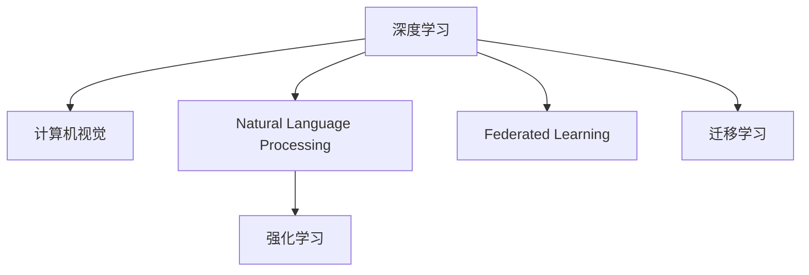
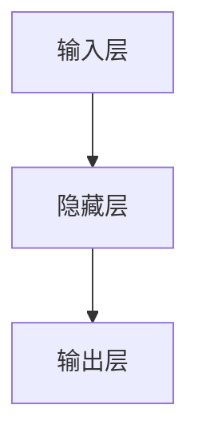

                 

## 1. 背景介绍

### 1.1 问题由来
Andrej Karpathy，作为人工智能领域的知名专家，对机器学习、深度学习、计算机视觉等多个领域的理论和技术有着深刻的见解。本文通过解读Andrej Karpathy对人工智能未来发展的观点，探讨了人工智能面临的挑战与机遇，对开发者和研究者提供了重要的参考。

### 1.2 问题核心关键点
1. **人工智能的现状与潜力**：
   - 当前，人工智能技术已经在图像识别、语音识别、自然语言处理等诸多领域取得了显著进展，但这些技术仍面临着诸多挑战。
   - 人工智能的潜力巨大，有望在未来实现更广泛的应用，如智能机器人、自动驾驶、智慧医疗等。

2. **伦理与安全性问题**：
   - 人工智能在带来便利的同时，也引发了伦理和安全性问题，如算法偏见、隐私泄露、决策透明度等。

3. **技术融合与创新**：
   - 人工智能需要与其他技术进行融合，如自然语言处理、计算机视觉、物联网等，以实现更广泛的应用。

4. **数据与计算资源的限制**：
   - 大规模训练和推理需要大量的数据和计算资源，这成为人工智能发展的重要瓶颈。

### 1.3 问题研究意义
通过探讨Andrej Karpathy的观点，本文旨在：
1. 揭示人工智能未来发展的主要挑战与机遇，为开发者和研究者提供清晰的指导。
2. 促进人工智能技术的跨领域应用，推动技术的不断创新和优化。
3. 增强人工智能的伦理与安全性，确保其健康、可控的发展。

## 2. 核心概念与联系

### 2.1 核心概念概述

Andrej Karpathy在讨论人工智能未来发展时，涉及了多个核心概念，包括但不限于：

1. **深度学习（Deep Learning）**：基于多层神经网络的技术，能够自动提取数据中的高层次特征。
2. **计算机视觉（Computer Vision）**：使计算机能够理解和处理图像和视频等视觉信息。
3. **自然语言处理（Natural Language Processing, NLP）**：使计算机能够理解和生成人类语言。
4. **强化学习（Reinforcement Learning）**：通过奖励机制训练智能体执行特定任务。
5. **联邦学习（Federated Learning）**：分布式学习技术，多个设备共同参与模型训练，保护用户隐私。
6. **迁移学习（Transfer Learning）**：将一个领域学到的知识迁移到另一个领域。

这些概念通过以下Mermaid流程图展示了它们之间的联系：



### 2.2 概念间的关系

这些核心概念之间存在着紧密的联系，构成了人工智能发展的完整生态系统。通过它们的相互作用，可以实现人工智能技术的广泛应用。

- **深度学习**：是计算机视觉和自然语言处理的基础，也是强化学习的重要组成部分。
- **计算机视觉**：深度学习中视觉数据的重要应用领域，可以用于图像识别、视频分析等。
- **自然语言处理**：与计算机视觉类似，深度学习中处理语言数据的重要领域，可以用于机器翻译、情感分析等。
- **强化学习**：通过奖励机制进行智能决策，广泛应用于自动驾驶、游戏AI等领域。
- **联邦学习**：分布式学习技术，可以在保护隐私的前提下进行模型训练。
- **迁移学习**：在不同领域之间进行知识迁移，提高模型在新领域上的性能。

这些概念的相互作用，使得人工智能技术能够在多个领域得到应用，并不断进步。

## 3. 核心算法原理 & 具体操作步骤
### 3.1 算法原理概述

Andrej Karpathy认为，人工智能的发展离不开以下几个核心算法原理：

1. **深度学习模型**：通过多层神经网络，实现对数据的复杂非线性映射，提高模型的表达能力。
2. **优化算法**：如随机梯度下降（SGD）、Adam、Adagrad等，用于模型参数的更新和优化。
3. **正则化技术**：如L2正则、Dropout等，防止过拟合，提高模型泛化能力。
4. **迁移学习与微调**：将预训练模型在新任务上进行微调，提高模型在新任务上的性能。

这些算法原理相互配合，共同构成了人工智能技术的核心。

### 3.2 算法步骤详解

基于上述算法原理，人工智能的开发流程可以概括为以下步骤：

1. **数据准备**：收集和处理训练数据，确保数据的质量和多样性。
2. **模型选择与设计**：选择合适的深度学习模型，并设计网络结构和超参数。
3. **模型训练**：使用优化算法对模型进行训练，并应用正则化技术防止过拟合。
4. **模型评估**：在验证集上评估模型性能，调整超参数和模型结构。
5. **模型微调**：在特定任务上对模型进行微调，提升模型在新任务上的性能。
6. **模型部署与应用**：将模型部署到实际应用中，实现人工智能技术的落地。

### 3.3 算法优缺点

人工智能算法原理具有以下优点：
1. **高效性**：通过深度学习模型和非线性映射，能够处理复杂的非线性数据。
2. **泛化能力**：通过迁移学习和正则化技术，提高模型在不同数据集上的泛化能力。
3. **可解释性**：优化算法和正则化技术使模型决策过程更加透明，便于解释和调试。

但同时也存在一些缺点：
1. **计算资源需求高**：深度学习模型和优化算法需要大量的计算资源，对硬件设施要求高。
2. **数据依赖性强**：模型性能依赖于高质量的训练数据，数据获取和处理成本高。
3. **模型复杂度高**：模型结构复杂，调试和维护难度大。
4. **伦理与安全问题**：模型决策过程缺乏透明度，可能引发伦理和安全问题。

### 3.4 算法应用领域

人工智能算法原理在多个领域得到了广泛应用，包括但不限于：

1. **计算机视觉**：图像分类、目标检测、人脸识别等。
2. **自然语言处理**：机器翻译、文本生成、情感分析等。
3. **自动驾驶**：车辆路径规划、行人检测、交通信号识别等。
4. **医疗诊断**：医学影像分析、疾病预测、基因分析等。
5. **金融风控**：信用评分、欺诈检测、投资策略等。

## 4. 数学模型和公式 & 详细讲解 & 举例说明

### 4.1 数学模型构建

Andrej Karpathy的讨论中，涉及了多个数学模型，如神经网络、反向传播算法等。这里以反向传播算法为例，进行详细讲解。

假设一个简单的前馈神经网络，包含输入层、隐藏层和输出层，其结构如图1所示：



假设输入为 $x$，隐藏层的激活函数为 $f$，输出层的激活函数为 $g$，则神经网络的输出可以表示为：

$$
y = g(f(W_1 x + b_1), W_2 \cdot f + b_2)
$$

其中 $W_1, W_2$ 为权重矩阵，$b_1, b_2$ 为偏置向量，$x$ 为输入向量。

### 4.2 公式推导过程

神经网络的输出与真实值 $y^*$ 之间的误差可以表示为均方误差（MSE）：

$$
\text{MSE} = \frac{1}{N} \sum_{i=1}^N (y_i - y_i^*)^2
$$

其中 $N$ 为样本数。

反向传播算法通过链式法则，求出每个参数对误差的导数，从而更新模型参数。以隐藏层的权重 $W_1$ 为例，其误差导数可以表示为：

$$
\frac{\partial \text{MSE}}{\partial W_1} = \frac{2}{N} \sum_{i=1}^N (y_i - y_i^*) \frac{\partial g}{\partial f} \frac{\partial f}{\partial W_1}
$$

其中 $\frac{\partial g}{\partial f}$ 和 $\frac{\partial f}{\partial W_1}$ 分别为输出层和隐藏层的误差导数。

### 4.3 案例分析与讲解

假设有一个二分类问题，输入为 $x = [1, 2, 3]$，输出为 $y = 1$。隐藏层激活函数为 Sigmoid，输出层激活函数为 Softmax。给定训练集 $(x_1, y_1), (x_2, y_2), (x_3, y_3)$，其中 $y_1 = y_2 = 0, y_3 = 1$。求出模型在训练集上的误差导数。

首先计算输出层的误差导数：

$$
\frac{\partial \text{MSE}}{\partial y} = -2 \times (y - y^*) = -2 \times (1 - 0.5) = -1
$$

然后计算隐藏层的误差导数：

$$
\frac{\partial \text{MSE}}{\partial f} = y^* - y = 0.5 - 1 = -0.5
$$

最后求出权重 $W_1$ 的误差导数：

$$
\frac{\partial \text{MSE}}{\partial W_1} = -1 \times -0.5 \times \frac{\partial f}{\partial W_1} = 0.5 \times \frac{\partial f}{\partial W_1}
$$

其中 $\frac{\partial f}{\partial W_1}$ 可以通过链式法则进一步计算，得到最终的结果。

## 5. 项目实践：代码实例和详细解释说明

### 5.1 开发环境搭建

为了进行人工智能项目开发，我们需要准备以下开发环境：

1. **Python**：主流编程语言，支持深度学习库和框架。
2. **深度学习框架**：如 PyTorch、TensorFlow、Keras 等。
3. **机器学习库**：如 Scikit-learn、XGBoost 等。
4. **数据处理库**：如 Pandas、NumPy 等。
5. **可视化库**：如 Matplotlib、Seaborn 等。

### 5.2 源代码详细实现

以下是一个简单的神经网络模型的 Python 代码实现：

```python
import torch
import torch.nn as nn
import torch.optim as optim

# 定义神经网络模型
class Net(nn.Module):
    def __init__(self):
        super(Net, self).__init__()
        self.fc1 = nn.Linear(10, 5)
        self.fc2 = nn.Linear(5, 2)

    def forward(self, x):
        x = nn.functional.relu(self.fc1(x))
        x = nn.functional.softmax(self.fc2(x), dim=1)
        return x

# 加载数据集
x_train = torch.randn(100, 10)
y_train = torch.randint(2, (100,))

# 创建模型和优化器
model = Net()
optimizer = optim.SGD(model.parameters(), lr=0.1)
loss_fn = nn.CrossEntropyLoss()

# 训练模型
for epoch in range(100):
    optimizer.zero_grad()
    output = model(x_train)
    loss = loss_fn(output, y_train)
    loss.backward()
    optimizer.step()

# 测试模型
x_test = torch.randn(10, 10)
output = model(x_test)
print(output)
```

### 5.3 代码解读与分析

上述代码中，我们定义了一个包含两个全连接层的神经网络模型，使用了 Sigmoid 和 Softmax 激活函数，并使用交叉熵损失函数进行训练。训练过程使用了随机梯度下降优化器，并在每个epoch结束后输出测试集上的输出结果。

## 6. 实际应用场景

### 6.1 智能家居系统

Andrej Karpathy认为，人工智能技术可以广泛应用于智能家居系统中，实现更加智能化和便捷的家居生活。例如：

- **智能家电控制**：通过语音识别技术，控制家电的开关、调节温度等。
- **家庭安防**：通过人脸识别和视频监控，确保家庭安全。
- **健康管理**：通过智能监测设备，收集健康数据，提供个性化健康建议。

### 6.2 智能医疗系统

在医疗领域，人工智能技术可以用于疾病诊断、患者监护、药品研发等。例如：

- **疾病诊断**：通过医学影像分析，辅助医生进行疾病诊断。
- **患者监护**：通过生命体征监测，实时监测患者状态，提供紧急响应。
- **药品研发**：通过药物分子结构分析和生物活性预测，加速新药研发进程。

### 6.3 自动驾驶系统

自动驾驶技术是人工智能的重要应用领域之一。通过计算机视觉和深度学习技术，实现车辆自主驾驶和交通管理。例如：

- **目标检测**：通过目标检测技术，识别道路上的行人、车辆等障碍物。
- **路径规划**：通过路径规划算法，生成最优行驶路径。
- **行为预测**：通过行为预测技术，预测其他车辆和行人的行为，做出安全决策。

## 7. 工具和资源推荐

### 7.1 学习资源推荐

为了帮助开发者和研究者深入理解人工智能技术，以下是一些推荐的资源：

1. **深度学习入门课程**：如斯坦福大学 CS231n课程，系统介绍深度学习的基本概念和应用。
2. **机器学习书籍**：如《深度学习》（Ian Goodfellow 著），全面介绍深度学习理论和实践。
3. **在线学习平台**：如 Coursera、Udacity 等，提供丰富的在线课程和实战项目。
4. **开源社区**：如 GitHub、Kaggle 等，分享开源项目和数据集。
5. **学术论文**：通过阅读最新的学术论文，了解人工智能领域的最新进展。

### 7.2 开发工具推荐

以下是一些常用的开发工具，用于人工智能项目开发：

1. **IDE**：如 PyCharm、VSCode 等，支持 Python 开发和调试。
2. **数据可视化工具**：如 Matplotlib、Seaborn 等，用于数据可视化。
3. **深度学习框架**：如 PyTorch、TensorFlow、Keras 等，支持深度学习模型开发。
4. **版本控制工具**：如 Git、SVN 等，管理代码版本和协作开发。

### 7.3 相关论文推荐

以下是一些具有代表性的论文，用于深入理解人工智能技术：

1. **ImageNet Large Scale Visual Recognition Challenge**：提出了大规模视觉识别挑战，推动计算机视觉技术的发展。
2. **Attention is All You Need**：提出了Transformer结构，大幅提升自然语言处理任务的性能。
3. **AlphaGo Zero**：通过强化学习技术，实现了击败人类顶尖选手的AlphaGo Zero。

## 8. 总结：未来发展趋势与挑战

### 8.1 研究成果总结

Andrej Karpathy认为，人工智能技术正处于快速发展阶段，未来具有以下几个发展趋势：

1. **深度学习模型不断进化**：通过网络结构优化和算法改进，深度学习模型将更加高效、精确。
2. **多模态学习发展**：通过视觉、语音、文本等多种模态数据的融合，提升模型理解和决策能力。
3. **联邦学习和隐私保护**：分布式学习技术将得到更广泛的应用，保护用户隐私和数据安全。
4. **自动机器学习**：自动化机器学习技术将使得模型训练和优化更加高效、智能。

### 8.2 未来发展趋势

未来，人工智能技术将呈现以下发展趋势：

1. **智能化水平提升**：通过多模态学习和深度学习技术，提升模型的智能化水平。
2. **广泛应用领域**：人工智能技术将渗透到更多行业和领域，实现更广泛的应用。
3. **实时性要求提高**：随着实时应用的增多，人工智能系统需要具备更高的实时性和响应速度。
4. **伦理和安全问题重视**：人工智能系统需要具备更高的透明性和可解释性，保障伦理和安全。

### 8.3 面临的挑战

人工智能技术面临以下挑战：

1. **计算资源瓶颈**：大规模深度学习模型需要大量的计算资源，硬件设施和能耗问题亟待解决。
2. **数据质量问题**：数据获取和处理成本高，数据质量和多样性不足影响模型性能。
3. **模型可解释性**：深度学习模型“黑盒”特性，缺乏透明性和可解释性，可能引发伦理和安全问题。
4. **隐私保护问题**：分布式学习过程中，如何保护用户隐私和数据安全是重要挑战。

### 8.4 研究展望

未来，人工智能技术需要解决以下问题：

1. **高效计算资源**：通过硬件优化和算法改进，提升计算效率和能效比。
2. **高质数据获取**：创新数据获取和处理技术，提升数据质量和多样性。
3. **模型可解释性**：通过模型可视化、知识蒸馏等技术，提升模型的透明性和可解释性。
4. **隐私保护技术**：研究隐私保护技术，保障用户隐私和数据安全。

## 9. 附录：常见问题与解答

**Q1: 人工智能技术的发展前景如何？**

A: 人工智能技术的发展前景广阔，未来将在各个领域得到广泛应用。例如，在智能家居、智能医疗、自动驾驶等领域，人工智能技术将带来更便捷、智能的生活方式和更高的生产力。

**Q2: 人工智能技术面临哪些主要挑战？**

A: 人工智能技术面临的主要挑战包括计算资源瓶颈、数据质量问题、模型可解释性、隐私保护问题等。解决这些挑战需要技术创新和多方合作。

**Q3: 如何提升人工智能技术的智能化水平？**

A: 提升人工智能技术的智能化水平，需要不断优化深度学习模型和算法，推动多模态学习、自动化机器学习等技术的发展。

**Q4: 人工智能技术如何在保护用户隐私的前提下进行分布式学习？**

A: 通过联邦学习技术，可以在不泄露用户隐私的情况下，实现分布式模型训练。具体方法包括模型聚合、差分隐私等。

**Q5: 人工智能技术如何在实际应用中保障透明性和可解释性？**

A: 通过模型可视化、知识蒸馏等技术，提升模型的透明性和可解释性。例如，可以使用LIME、SHAP等工具，解释模型的决策过程。

---

作者：禅与计算机程序设计艺术 / Zen and the Art of Computer Programming

