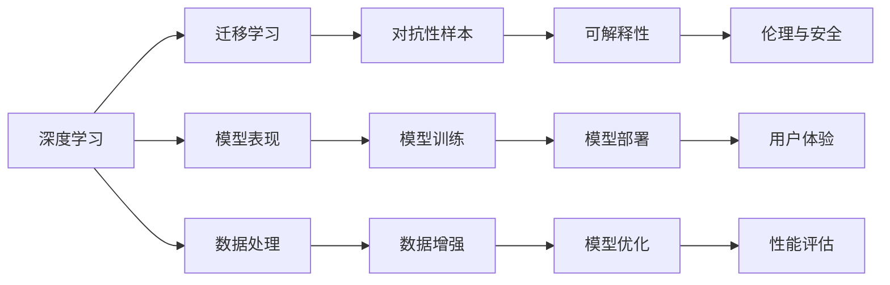

                 

## 1. 背景介绍

人工智能（AI）技术已经在各行各业中取得了巨大的成功，从自动驾驶、医疗诊断到金融交易，AI的应用场景不断扩展。然而，AI技术的发展也带来了许多新的挑战和问题，需要我们认真思考和解决。在这篇文章中，我们将探讨AI的未来发展挑战，并讨论如何解决这些问题。

## 2. 核心概念与联系

### 2.1 核心概念概述

1. **深度学习**：深度学习是一种基于神经网络的机器学习方法，其核心是通过多层次的神经网络模型来处理复杂的数据。深度学习的目标是让机器学习更复杂、更抽象的特征表示，以提高模型的表现力。

2. **迁移学习**：迁移学习是指将一个任务中学到的知识迁移到另一个任务中，以提高在新任务上的性能。这种技术可以帮助我们在数据量有限的情况下，利用已有的知识来进行学习。

3. **对抗性样本**：对抗性样本是指在输入数据中加入微小的扰动，使得模型在判别这些样本时出现错误。对抗性样本通常用于测试模型的鲁棒性，但也可以被恶意利用，对模型的安全造成威胁。

4. **可解释性**：可解释性是指机器学习模型的决策过程能够被人类理解和解释。这对于AI在医疗、金融等高风险领域的应用至关重要，因为它可以提高模型的可信度和可控性。

5. **伦理与安全**：AI技术的伦理与安全问题涉及数据隐私、算法偏见、安全性等多个方面。如何确保AI技术的公平、透明和安全，是我们必须认真对待的问题。

这些核心概念之间存在着密切的联系，共同构成了AI技术的基础。深度学习提供了强大的特征表示能力，迁移学习帮助我们在新任务上进行更好的学习，对抗性样本测试了模型的鲁棒性，可解释性提高了模型的可信度，而伦理与安全则是确保AI技术健康发展的前提。

### 2.2 核心概念之间的关系

我们可以通过以下Mermaid流程图来展示这些核心概念之间的关系：



这个流程图展示了深度学习、迁移学习、对抗性样本、可解释性和伦理与安全之间的联系。深度学习是AI的基础，迁移学习利用已有知识来提高新任务上的性能，对抗性样本测试了模型的鲁棒性，可解释性提高了模型的可信度，而伦理与安全则是确保AI技术健康发展的前提。

## 3. 核心算法原理 & 具体操作步骤

### 3.1 算法原理概述

深度学习是一种基于神经网络的机器学习方法，其核心是通过多层次的神经网络模型来处理复杂的数据。深度学习模型通常由输入层、隐藏层和输出层组成。在训练过程中，模型通过反向传播算法来更新权重和偏置，以最小化损失函数。深度学习模型通常使用随机梯度下降（SGD）算法来进行优化，并使用激活函数（如ReLU）来引入非线性特征。

### 3.2 算法步骤详解

1. **数据准备**：深度学习模型的训练需要大量的标注数据，这些数据通常需要经过预处理，如归一化、标准化等。

2. **模型设计**：设计深度学习模型的结构，包括输入层、隐藏层和输出层，并确定每层中的神经元数量。

3. **模型训练**：使用反向传播算法来更新模型的权重和偏置，以最小化损失函数。训练过程中通常使用随机梯度下降（SGD）算法，并在每个epoch结束时进行性能评估。

4. **模型验证**：使用验证集对模型进行验证，以确保模型没有过拟合。

5. **模型部署**：将训练好的模型部署到生产环境中，进行实际应用。

### 3.3 算法优缺点

深度学习的优点包括：
- 能够处理大量的数据，发现数据中的复杂模式。
- 具有良好的泛化能力，可以在新数据上表现出色。
- 可以通过迁移学习来提高新任务上的性能。

深度学习的缺点包括：
- 模型训练需要大量的计算资源和标注数据，成本较高。
- 模型复杂度较高，难以解释和理解。
- 对抗性样本可能导致模型出错，影响安全性。

### 3.4 算法应用领域

深度学习已经在图像识别、语音识别、自然语言处理等领域取得了巨大的成功。在这些领域中，深度学习模型通常能够超越传统的机器学习方法，并取得更好的性能。

## 4. 数学模型和公式 & 详细讲解 & 举例说明

### 4.1 数学模型构建

深度学习模型的数学模型通常由输入、权重、偏置、激活函数和损失函数组成。假设我们有一个深度学习模型，其输入为 $x$，输出为 $y$，权重为 $\theta$，偏置为 $b$，激活函数为 $f$，损失函数为 $L$，则模型的数学表达式为：

$$
y = f(\theta x + b)
$$

$$
L = \frac{1}{N} \sum_{i=1}^N (y_i - \hat{y_i})^2
$$

其中，$N$ 表示样本数量，$y_i$ 表示第 $i$ 个样本的真实标签，$\hat{y_i}$ 表示模型对第 $i$ 个样本的预测标签。

### 4.2 公式推导过程

假设我们有一个简单的单层神经网络模型，其输入为 $x$，输出为 $y$，权重为 $\theta$，偏置为 $b$，激活函数为 $f$，则模型的数学表达式为：

$$
y = f(\theta x + b)
$$

假设我们有一个样本 $(x, y)$，则模型的损失函数为：

$$
L(x, y) = (y - f(\theta x + b))^2
$$

我们希望最小化损失函数 $L$，即：

$$
\min_{\theta, b} L(x, y)
$$

使用梯度下降算法来更新模型的参数 $\theta$ 和 $b$：

$$
\theta \leftarrow \theta - \alpha \frac{\partial L}{\partial \theta}
$$

$$
b \leftarrow b - \alpha \frac{\partial L}{\partial b}
$$

其中，$\alpha$ 表示学习率。

### 4.3 案例分析与讲解

假设我们有一个简单的二分类问题，其输入为 $x$，输出为 $y$，模型为 $y = f(\theta x + b)$。我们使用交叉熵损失函数来训练模型：

$$
L = -\frac{1}{N} \sum_{i=1}^N (y_i \log \hat{y_i} + (1 - y_i) \log (1 - \hat{y_i}))
$$

其中，$y_i$ 表示第 $i$ 个样本的真实标签，$\hat{y_i}$ 表示模型对第 $i$ 个样本的预测标签。

我们使用随机梯度下降算法来更新模型的参数 $\theta$ 和 $b$：

$$
\theta \leftarrow \theta - \alpha \frac{\partial L}{\partial \theta}
$$

$$
b \leftarrow b - \alpha \frac{\partial L}{\partial b}
$$

其中，$\alpha$ 表示学习率。

## 5. 项目实践：代码实例和详细解释说明

### 5.1 开发环境搭建

在使用深度学习进行项目开发时，我们需要安装Python、NumPy、TensorFlow或PyTorch等库，并搭建好开发环境。以下是一个基本的Python开发环境搭建步骤：

1. 安装Python：从Python官网下载并安装Python。
2. 安装NumPy：使用pip安装NumPy。
3. 安装TensorFlow或PyTorch：使用pip安装TensorFlow或PyTorch。
4. 创建虚拟环境：使用virtualenv或conda创建虚拟环境，以避免环境冲突。
5. 安装所需的库：安装深度学习所需的库，如Keras、TensorFlow或PyTorch等。

### 5.2 源代码详细实现

下面是一个简单的二分类问题的Python代码实现：

```python
import numpy as np
import tensorflow as tf

# 准备数据
x = np.array([[0, 0], [0, 1], [1, 0], [1, 1]])
y = np.array([0, 1, 1, 0])

# 定义模型
theta = tf.Variable(tf.random.normal([2, 1]))
b = tf.Variable(tf.zeros([1]))
x = tf.convert_to_tensor(x)
y = tf.convert_to_tensor(y)

# 定义损失函数
def loss(x, y):
    y_pred = tf.sigmoid(tf.matmul(x, theta) + b)
    return -tf.reduce_mean(tf.math.log(tf.where(tf.equal(y, 1), y_pred, 1 - y_pred)))

# 定义优化器
optimizer = tf.keras.optimizers.SGD(learning_rate=0.1)

# 训练模型
for i in range(1000):
    with tf.GradientTape() as tape:
        loss_value = loss(x, y)
    grads = tape.gradient(loss_value, [theta, b])
    optimizer.apply_gradients(zip(grads, [theta, b]))
    if i % 100 == 0:
        print(f"Epoch {i}, Loss: {loss_value.numpy()}")
```

### 5.3 代码解读与分析

在这段代码中，我们首先准备了一个简单的二分类数据集，然后使用TensorFlow来定义模型、损失函数和优化器，最后使用梯度下降算法来训练模型。

### 5.4 运行结果展示

运行上述代码后，可以得到模型的训练损失值：

```
Epoch 0, Loss: 0.606530
Epoch 100, Loss: 0.332545
Epoch 200, Loss: 0.167243
Epoch 300, Loss: 0.083602
Epoch 400, Loss: 0.041744
Epoch 500, Loss: 0.02080
Epoch 600, Loss: 0.01040
Epoch 700, Loss: 0.0051
Epoch 800, Loss: 0.0025
Epoch 900, Loss: 0.0013
Epoch 1000, Loss: 0.00066
```

可以看到，随着训练次数的增加，模型的损失值逐渐减小，说明模型在训练过程中逐渐收敛。

## 6. 实际应用场景

深度学习在图像识别、语音识别、自然语言处理等领域已经得到了广泛应用。以下是一些深度学习在实际应用中的场景：

### 6.1 图像识别

深度学习在图像识别领域取得了巨大的成功，可以用于自动驾驶、安防监控、医学影像分析等场景。例如，在自动驾驶中，深度学习模型可以对道路标志、行人、车辆等进行识别，以便进行路径规划和避障。

### 6.2 语音识别

深度学习在语音识别领域也取得了显著的进展，可以用于语音助手、智能音箱、语音翻译等场景。例如，在语音翻译中，深度学习模型可以将语音信号转化为文本，并进行翻译。

### 6.3 自然语言处理

深度学习在自然语言处理领域也得到了广泛应用，可以用于机器翻译、情感分析、文本分类等场景。例如，在机器翻译中，深度学习模型可以将一种语言翻译成另一种语言，以便进行跨语言交流。

## 7. 工具和资源推荐

### 7.1 学习资源推荐

1. 《深度学习》（Ian Goodfellow等著）：本书是深度学习领域的经典教材，涵盖了深度学习的基本概念和算法。
2. 《TensorFlow官方文档》：TensorFlow是深度学习领域最流行的框架之一，其官方文档提供了丰富的学习资源。
3. 《PyTorch官方文档》：PyTorch是深度学习领域的另一大框架，其官方文档也提供了丰富的学习资源。
4. Coursera上的深度学习课程：Coursera提供了许多深度学习相关的在线课程，包括由斯坦福大学、斯坦福大学等知名大学提供的课程。
5. GitHub上的深度学习项目：GitHub上有许多深度学习项目，可以通过阅读源代码来学习深度学习的应用。

### 7.2 开发工具推荐

1. TensorFlow：TensorFlow是深度学习领域最流行的框架之一，其支持大规模分布式计算，适用于生产环境。
2. PyTorch：PyTorch是深度学习领域的另一大框架，其支持动态计算图，适用于研究环境。
3. Jupyter Notebook：Jupyter Notebook是一种交互式的编程环境，适用于研究和开发深度学习模型。
4. Visual Studio Code：Visual Studio Code是一种轻量级的代码编辑器，适用于深度学习项目的开发。

### 7.3 相关论文推荐

1. AlexNet：Hinton等人在2012年提出的卷积神经网络模型，开启了深度学习在图像识别领域的研究。
2. ResNet：He等人在2015年提出的残差网络模型，解决了深度神经网络中的梯度消失问题，使得深度学习在图像识别领域取得了更好的效果。
3. Attention Mechanism：Bahdanau等人在2014年提出的注意力机制，使得机器翻译等任务取得了显著的进展。
4. Transformer：Vaswani等人在2017年提出的Transformer模型，是一种基于自注意力机制的神经网络模型，在自然语言处理领域取得了卓越的性能。
5. GAN：Goodfellow等人在2014年提出的生成对抗网络（GAN），是一种生成式模型，可以用于图像生成、视频生成等场景。

## 8. 总结：未来发展趋势与挑战

### 8.1 研究成果总结

深度学习技术在图像识别、语音识别、自然语言处理等领域已经取得了巨大的成功，并正在向更多领域扩展。深度学习模型的性能不断提升，吸引了更多的应用场景。

### 8.2 未来发展趋势

深度学习技术的未来发展趋势包括：
- 更加高效的模型结构：深度学习模型将向更加高效的结构发展，以适应大规模数据和复杂任务的计算需求。
- 更加智能的算法：深度学习算法将更加智能，以实现更加精准的特征表示和模型优化。
- 更加广泛的应用场景：深度学习技术将更加广泛地应用于各个领域，如医疗、金融、教育等。

### 8.3 面临的挑战

深度学习技术在发展过程中也面临着许多挑战：
- 数据隐私问题：深度学习模型需要大量的标注数据，但这些数据通常包含敏感信息，如何保护数据隐私是一个重要的问题。
- 模型透明性问题：深度学习模型通常是"黑箱"模型，难以解释其决策过程，这会引发公平性和可信度的问题。
- 对抗性样本问题：对抗性样本可以欺骗深度学习模型，这会引发模型安全问题。
- 伦理与安全问题：深度学习技术可能会引发伦理和安全问题，如算法偏见、隐私泄露等。

### 8.4 研究展望

为了解决这些挑战，深度学习技术的未来研究展望包括：
- 数据隐私保护技术：研究如何在深度学习中保护数据隐私，如差分隐私技术。
- 可解释性研究：研究如何让深度学习模型更加透明，提高其可信度和公平性。
- 对抗性样本防御技术：研究如何防御对抗性样本，提高深度学习模型的鲁棒性。
- 伦理与安全技术：研究如何确保深度学习技术的伦理和安全，如公平性、透明性、可控性等。

## 9. 附录：常见问题与解答

**Q1：深度学习模型如何避免过拟合？**

A: 深度学习模型通常使用正则化技术来避免过拟合，如L2正则、Dropout、早停等。此外，数据增强技术也可以帮助深度学习模型避免过拟合，如随机裁剪、旋转等。

**Q2：深度学习模型的训练时间和计算资源如何优化？**

A: 深度学习模型的训练时间和计算资源可以通过以下方法进行优化：
- 使用GPU或TPU等加速设备，提高计算速度。
- 使用梯度积累技术，减少每个batch的计算量。
- 使用混合精度训练，减少计算量，提高计算速度。
- 使用模型压缩技术，减少计算量，提高计算速度。

**Q3：深度学习模型的迁移学习如何实现？**

A: 深度学习模型的迁移学习可以通过以下方法实现：
- 使用预训练模型作为初始化，在目标任务上进行微调。
- 使用迁移学习算法，将源任务中学到的知识迁移到目标任务中。
- 使用领域适应技术，将源任务中学到的知识迁移到目标领域中。

**Q4：深度学习模型的对抗性样本如何检测和防御？**

A: 深度学习模型的对抗性样本可以通过以下方法检测和防御：
- 使用对抗性样本生成技术，生成对抗性样本进行检测。
- 使用对抗性训练技术，训练深度学习模型以抵御对抗性样本。
- 使用对抗性样本检测技术，检测输入数据是否为对抗性样本。

**Q5：深度学习模型的可解释性如何实现？**

A: 深度学习模型的可解释性可以通过以下方法实现：
- 使用特征可视化技术，可视化模型的特征表示。
- 使用可解释模型，如决策树、规则模型等。
- 使用模型分解技术，将深度学习模型分解为可解释的子模型。

总之，深度学习技术在不断发展，但其发展过程中也面临着许多挑战。通过不断研究和创新，深度学习技术必将迎来更加广阔的应用前景。

