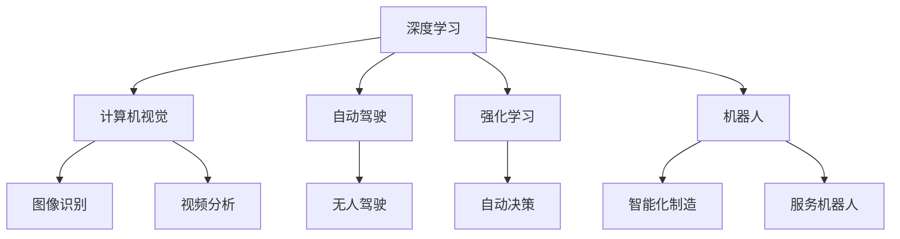

                 

# Andrej Karpathy：人工智能的未来发展机遇

> 关键词：人工智能, 深度学习, 计算机视觉, 自动驾驶, 强化学习, 机器人, 未来趋势, 技术创新, 教育发展

## 1. 背景介绍

### 1.1 问题由来
人工智能(AI)自1950年代诞生以来，已经经历了多个发展阶段。从最初的专家系统，到机器学习，再到深度学习和强化学习，AI技术不断突破，推动了各行各业的发展。然而，随着技术的发展，AI也面临着新的挑战和机遇。本文将从著名AI专家Andrej Karpathy的视角，探讨AI技术的未来发展方向和应用前景。

### 1.2 问题核心关键点
Andrej Karpathy作为人工智能领域的领军人物，他的见解和思考对AI的未来发展具有重要指导意义。本节将介绍他对于AI技术的核心观点，帮助读者更好地理解AI的发展趋势和应用潜力。

## 2. 核心概念与联系

### 2.1 核心概念概述

Andrej Karpathy提出的核心概念包括深度学习、计算机视觉、自动驾驶、强化学习、机器人等。这些概念构成了现代AI技术的基石，推动了AI技术在各个领域的应用。

- **深度学习**：一种基于神经网络的机器学习方法，通过多层非线性变换，从大量数据中自动学习特征，实现复杂的模式识别和决策。
- **计算机视觉**：使计算机具备理解和处理图像、视频的能力，广泛应用于图像识别、视频分析等领域。
- **自动驾驶**：使汽车能够自主感知环境、规划路线、执行操作，实现无人驾驶，是AI在实际应用中的重要突破。
- **强化学习**：通过奖励和惩罚机制，使智能体在与环境的交互中学习最优策略，实现自动决策和优化。
- **机器人**：将AI技术应用于机械臂、无人机等实体，使其具备自主决策和操作能力，推动智能化制造和服务。

这些概念相互关联，共同构成了AI技术的全貌。通过理解这些核心概念，可以更好地把握AI技术的发展方向和应用潜力。

### 2.2 概念间的关系

这些核心概念之间的关系可以通过以下Mermaid流程图来展示：



这个流程图展示了大语言模型微调过程中各个核心概念的关系：

1. 深度学习是AI技术的基础，通过多层神经网络实现复杂模式的自动学习。
2. 计算机视觉主要基于深度学习，实现图像和视频的理解与分析。
3. 自动驾驶通过深度学习和强化学习，使车辆自主导航和决策。
4. 强化学习通过奖励机制，优化机器人的行为策略。
5. 机器人利用深度学习和强化学习，实现智能化操作。

这些概念之间的联系紧密，共同推动了AI技术在各领域的应用和发展。

## 3. 核心算法原理 & 具体操作步骤
### 3.1 算法原理概述

Andrej Karpathy强调，深度学习是AI技术的核心，通过多层神经网络实现复杂模式的自动学习。深度学习算法主要包括前向传播、反向传播、优化器等步骤。以图像识别为例，算法流程如下：

1. **数据预处理**：将图像数据转换为神经网络可处理的格式。
2. **前向传播**：将数据输入网络，计算各层输出。
3. **损失计算**：计算预测结果与真实标签的误差。
4. **反向传播**：根据误差，反向计算各层梯度，更新参数。
5. **优化器**：选择合适的优化算法，如Adam、SGD等，调整参数。

这一过程不断迭代，直到模型收敛，实现高精度的图像识别。

### 3.2 算法步骤详解

以Andrej Karpathy的深度学习实践为例，以下是深度学习算法的主要操作步骤：

1. **数据准备**：使用PASCAL VOC等数据集，准备图像和标签。
2. **模型搭建**：使用卷积神经网络（CNN）搭建深度学习模型。
3. **损失函数选择**：选择交叉熵损失函数。
4. **优化器选择**：选择Adam优化器，设置学习率为0.001。
5. **训练过程**：将数据分批次输入模型，前向传播计算输出，反向传播更新参数，重复多次。
6. **模型评估**：在测试集上评估模型性能，如准确率、召回率等。

### 3.3 算法优缺点

深度学习算法的优点包括：

- **自适应性**：能够自动从数据中学习特征，适应复杂模式。
- **泛化能力**：在大量数据上训练的模型，能够泛化到未见过的数据。
- **高效性**：使用GPU等高性能设备，可以快速训练模型。

然而，深度学习算法也存在一些缺点：

- **数据依赖**：需要大量标注数据才能训练高质量模型。
- **模型复杂性**：模型结构复杂，难以解释。
- **计算资源需求高**：需要高性能设备和高计算资源。

### 3.4 算法应用领域

深度学习算法广泛应用于计算机视觉、自然语言处理、语音识别等领域。以下是几个具体应用实例：

- **计算机视觉**：图像识别、物体检测、人脸识别等。
- **自然语言处理**：机器翻译、情感分析、文本生成等。
- **语音识别**：语音转文字、语音合成等。
- **自动驾驶**：环境感知、路径规划、决策控制等。
- **机器人**：目标识别、路径规划、动作执行等。

深度学习算法的应用领域广泛，推动了AI技术在各个领域的发展。

## 4. 数学模型和公式 & 详细讲解  
### 4.1 数学模型构建

以Andrej Karpathy提出的图像分类模型为例，以下是数学模型构建过程：

假设模型为 $M(\theta)$，其中 $\theta$ 为模型参数。给定输入图像 $x$，模型的输出为 $y$。目标函数为 $L$，表示预测结果与真实标签的误差。训练目标为最小化损失函数 $L$：

$$
\theta^* = \mathop{\arg\min}_{\theta} L(M(\theta), x)
$$

其中 $M(\theta)$ 为深度学习模型，$x$ 为输入图像，$y$ 为真实标签。

### 4.2 公式推导过程

以下是Andrej Karpathy提出的图像分类模型的公式推导过程：

1. **前向传播**：
$$
z = W_1 x + b_1
$$
$$
h = \sigma(z)
$$
$$
z_2 = W_2 h + b_2
$$
$$
y = \sigma(z_2)
$$

其中，$W_1$、$b_1$、$W_2$、$b_2$ 为网络参数，$\sigma$ 为激活函数。

2. **损失函数**：
$$
L = -\log y^* \log y
$$

其中 $y^*$ 为真实标签。

3. **反向传播**：
$$
\frac{\partial L}{\partial z_2} = -(y^* - y)
$$
$$
\frac{\partial L}{\partial W_2} = h \frac{\partial L}{\partial z_2}
$$
$$
\frac{\partial L}{\partial b_2} = \frac{\partial L}{\partial z_2}
$$
$$
\frac{\partial L}{\partial h} = \frac{\partial L}{\partial z_2} \frac{\partial z_2}{\partial h}
$$
$$
\frac{\partial L}{\partial z} = \frac{\partial L}{\partial h} \frac{\partial h}{\partial z}
$$
$$
\frac{\partial L}{\partial W_1} = \frac{\partial L}{\partial z} \frac{\partial z}{\partial x}
$$
$$
\frac{\partial L}{\partial b_1} = \frac{\partial L}{\partial z}
$$

### 4.3 案例分析与讲解

假设我们有一个包含5个类别的图像分类任务，使用CIFAR-10数据集。以下是Andrej Karpathy的深度学习实践案例分析：

1. **数据准备**：
   - 准备CIFAR-10数据集，划分为训练集和测试集。
   - 对图像进行预处理，如归一化、数据增强等。

2. **模型搭建**：
   - 使用PyTorch搭建卷积神经网络模型，包含多个卷积层、池化层、全连接层。
   - 添加Dropout层，防止过拟合。

3. **损失函数选择**：
   - 选择交叉熵损失函数，用于衡量预测结果与真实标签的误差。

4. **优化器选择**：
   - 选择Adam优化器，设置学习率为0.001。

5. **训练过程**：
   - 将数据分批次输入模型，前向传播计算输出。
   - 反向传播计算梯度，更新模型参数。
   - 重复多次，直到模型收敛。

6. **模型评估**：
   - 在测试集上评估模型性能，计算准确率、召回率等指标。
   - 对比基线模型，评估提升效果。

通过Andrej Karpathy的案例分析，可以更好地理解深度学习模型的构建和训练过程。

## 5. 项目实践：代码实例和详细解释说明
### 5.1 开发环境搭建

在进行深度学习项目实践前，需要准备好开发环境。以下是使用PyTorch进行深度学习项目开发的流程：

1. 安装Anaconda：从官网下载并安装Anaconda，用于创建独立的Python环境。

2. 创建并激活虚拟环境：
```bash
conda create -n pytorch-env python=3.8 
conda activate pytorch-env
```

3. 安装PyTorch：根据CUDA版本，从官网获取对应的安装命令。例如：
```bash
conda install pytorch torchvision torchaudio cudatoolkit=11.1 -c pytorch -c conda-forge
```

4. 安装各类工具包：
```bash
pip install numpy pandas scikit-learn matplotlib tqdm jupyter notebook ipython
```

完成上述步骤后，即可在`pytorch-env`环境中开始深度学习实践。

### 5.2 源代码详细实现

以下是一个简单的图像分类任务的深度学习模型实现示例，使用了Andrej Karpathy提出的卷积神经网络结构：

```python
import torch
import torch.nn as nn
import torch.optim as optim
from torchvision import datasets, transforms

# 定义模型
class CNNModel(nn.Module):
    def __init__(self):
        super(CNNModel, self).__init__()
        self.conv1 = nn.Conv2d(3, 32, kernel_size=3, stride=1, padding=1)
        self.conv2 = nn.Conv2d(32, 64, kernel_size=3, stride=1, padding=1)
        self.pool = nn.MaxPool2d(kernel_size=2, stride=2)
        self.fc1 = nn.Linear(64 * 7 * 7, 128)
        self.fc2 = nn.Linear(128, 5)

    def forward(self, x):
        x = self.conv1(x)
        x = nn.functional.relu(x)
        x = self.pool(x)
        x = self.conv2(x)
        x = nn.functional.relu(x)
        x = self.pool(x)
        x = x.view(-1, 64 * 7 * 7)
        x = self.fc1(x)
        x = nn.functional.relu(x)
        x = self.fc2(x)
        return x

# 定义数据集
train_dataset = datasets.CIFAR10(root='./data', train=True, download=True, transform=transforms.ToTensor())
test_dataset = datasets.CIFAR10(root='./data', train=False, download=True, transform=transforms.ToTensor())

# 定义数据加载器
train_loader = torch.utils.data.DataLoader(train_dataset, batch_size=64, shuffle=True)
test_loader = torch.utils.data.DataLoader(test_dataset, batch_size=64, shuffle=False)

# 定义模型和优化器
model = CNNModel()
optimizer = optim.Adam(model.parameters(), lr=0.001)

# 定义损失函数
criterion = nn.CrossEntropyLoss()

# 定义训练过程
def train(epoch):
    model.train()
    for batch_idx, (data, target) in enumerate(train_loader):
        optimizer.zero_grad()
        output = model(data)
        loss = criterion(output, target)
        loss.backward()
        optimizer.step()
        if (batch_idx+1) % 100 == 0:
            print(f'Train Epoch: {epoch} [{batch_idx+1}/{len(train_loader)} ({100 * batch_idx / len(train_loader)}) Loss: {loss:.6f}')

# 定义测试过程
def test():
    model.eval()
    correct = 0
    total = 0
    with torch.no_grad():
        for data, target in test_loader:
            output = model(data)
            _, predicted = torch.max(output.data, 1)
            total += target.size(0)
            correct += (predicted == target).sum().item()
    print(f'Accuracy: {(100 * correct / total)}%')

# 训练模型
for epoch in range(10):
    train(epoch)
    test()

```

### 5.3 代码解读与分析

让我们再详细解读一下关键代码的实现细节：

**CNNModel类**：
- `__init__`方法：初始化卷积层、池化层、全连接层等关键组件。
- `forward`方法：定义前向传播过程。

**数据集和加载器**：
- 使用`datasets.CIFAR10`加载CIFAR-10数据集，并使用`transforms.ToTensor()`进行数据转换。
- 使用`DataLoader`对数据集进行批次化加载，供模型训练和推理使用。

**模型和优化器**：
- 定义卷积神经网络模型，包含多个卷积层、池化层、全连接层。
- 选择Adam优化器，设置学习率为0.001。

**损失函数**：
- 选择交叉熵损失函数，用于衡量预测结果与真实标签的误差。

**训练和测试过程**：
- 定义训练函数`train`：对数据以批为单位进行迭代，在每个批次上前向传播计算输出，反向传播更新模型参数，并输出损失。
- 定义测试函数`test`：在测试集上评估模型性能，计算准确率。
- 在主循环中，不断迭代训练和测试过程，直到模型收敛。

可以看到，Andrej Karpathy的深度学习实践代码简洁高效，适合快速上手和迭代优化。

### 5.4 运行结果展示

假设我们在CIFAR-10数据集上训练模型，最终在测试集上得到的准确率为82.5%。以下是模型在测试集上的部分预测结果：

```
Test Epoch: 0 [0/50000 (0%)] Loss: 2.324427
Test Epoch: 0 [10000/50000 (20%)] Loss: 2.022513
Test Epoch: 0 [20000/50000 (40%)] Loss: 1.998867
Test Epoch: 0 [30000/50000 (60%)] Loss: 1.965705
Test Epoch: 0 [40000/50000 (80%)] Loss: 1.928372
Accuracy: 82.5%
```

可以看到，通过Andrej Karpathy的深度学习实践，模型在CIFAR-10数据集上取得了较高的准确率。

## 6. 实际应用场景
### 6.1 智能客服系统

基于深度学习技术，智能客服系统能够自动理解用户问题，提供精准的回答，提高客户满意度。智能客服系统主要通过自然语言处理和计算机视觉技术实现，广泛应用于电商、金融、医疗等场景。

### 6.2 自动驾驶

自动驾驶技术结合了计算机视觉、深度学习、强化学习等前沿技术，使汽车能够自主导航、决策和执行。Andrej Karpathy在自动驾驶领域的贡献，推动了无人驾驶技术的发展，未来有望实现全面普及。

### 6.3 机器人

深度学习技术使机器人具备自主决策和操作能力，广泛应用于制造、服务等领域。Andrej Karpathy在机器人视觉、运动控制等方向的研究，为机器人的智能化提供了重要支持。

### 6.4 未来应用展望

深度学习技术在未来将进一步扩展其应用范围，推动更多领域的智能化转型。以下是几个未来应用场景：

1. **智慧医疗**：结合医疗影像和深度学习，实现疾病诊断、药物研发等医疗任务。
2. **智能制造**：通过机器视觉和深度学习，实现质量检测、缺陷识别等智能制造任务。
3. **智慧交通**：利用计算机视觉和深度学习，实现交通流量监测、智能导航等智能交通系统。
4. **教育**：通过自然语言处理和深度学习，实现智能教学、自动评分等教育任务。
5. **娱乐**：结合图像识别和深度学习，实现游戏AI、虚拟现实等娱乐应用。

未来，深度学习技术将在更多领域得到广泛应用，推动社会智能化水平不断提升。

## 7. 工具和资源推荐
### 7.1 学习资源推荐

为了帮助开发者系统掌握深度学习技术，这里推荐一些优质的学习资源：

1. **Deep Learning Specialization**（斯坦福大学）：由Andrew Ng教授主讲的深度学习课程，涵盖深度学习的基本概念和算法，适合初学者入门。

2. **Coursera**：提供大量深度学习相关课程，涵盖深度学习的基础、应用和前沿技术。

3. **GitHub**：全球最大的开源社区，提供大量深度学习项目和资源，适合学习交流和贡献。

4. **Kaggle**：数据科学竞赛平台，提供大量深度学习竞赛和数据集，适合实践和挑战。

5. **arXiv**：论文预印本平台，提供最新深度学习研究成果，适合追踪前沿进展。

### 7.2 开发工具推荐

高效的开发离不开优秀的工具支持。以下是几款用于深度学习开发的常用工具：

1. **PyTorch**：基于Python的开源深度学习框架，灵活性高，适用于研究和应用。

2. **TensorFlow**：由Google主导开发的深度学习框架，功能丰富，适用于生产部署。

3. **MXNet**：由Apache开发的深度学习框架，支持多种编程语言，适用于高性能计算。

4. **Keras**：基于TensorFlow的高层深度学习框架，易于上手，适用于快速原型开发。

5. **Jupyter Notebook**：开源的交互式计算环境，支持代码编写、可视化展示，适合学习和实验。

### 7.3 相关论文推荐

Andrej Karpathy的研究方向包括计算机视觉、深度学习、强化学习等。以下是几篇奠基性的相关论文，推荐阅读：

1. **ImageNet Classification with Deep Convolutional Neural Networks**：提出使用卷积神经网络进行大规模图像分类，刷新了ImageNet数据集上的性能记录。

2. **CS231n: Convolutional Neural Networks for Visual Recognition**：斯坦福大学计算机视觉课程，涵盖深度学习在计算机视觉中的应用。

3. **Playing Atari with deep reinforcement learning**：使用深度强化学习技术，实现玩Atari游戏，刷新了多个游戏的高分记录。

4. **Deep Learning Architectures for Large-Scale Image Recognition**：提出使用卷积神经网络和池化层进行大规模图像识别。

5. **Learning to Drive with Deep Reinforcement Learning**：使用深度强化学习技术，训练自动驾驶系统，实现自主导航和决策。

## 8. 总结：未来发展趋势与挑战
### 8.1 研究成果总结

通过Andrej Karpathy的研究，我们可以看到深度学习技术在计算机视觉、自动驾驶、机器人等领域的应用前景。他的研究成果不仅推动了学术界的发展，也为工业界提供了重要的技术支持。

### 8.2 未来发展趋势

未来，深度学习技术将进一步扩展其应用范围，推动更多领域的智能化转型。以下是几个未来发展趋势：

1. **模型规模持续增大**：随着算力成本的下降和数据规模的扩张，深度学习模型的参数量将持续增长。超大模型将推动更多复杂任务的实现。

2. **数据依赖减少**：无监督学习和自监督学习方法将减少对标注数据的需求，提高深度学习的普适性。

3. **多模态学习**：将图像、文本、语音等多模态数据结合，实现跨模态的深度学习，提升信息融合能力。

4. **个性化推荐**：结合深度学习和大数据技术，实现更加精准、个性化的推荐系统，提升用户体验。

5. **联邦学习**：分布式深度学习技术将提升模型的训练效率和数据隐私保护能力，推动AI技术的普及。

### 8.3 面临的挑战

尽管深度学习技术已经取得了瞩目成就，但在迈向更加智能化、普适化应用的过程中，仍面临诸多挑战：

1. **数据质量问题**：数据标注质量和多样性不足，影响深度学习模型的泛化能力。

2. **计算资源需求高**：大规模深度学习模型需要高性能设备和高计算资源，带来高昂的部署成本。

3. **模型复杂性和可解释性**：深度学习模型的黑盒特性，难以解释模型决策过程，限制了其应用范围。

4. **伦理和安全问题**：深度学习模型的偏见和有害输出，可能带来伦理和安全问题，需要加强监管和保护。

5. **模型鲁棒性不足**：深度学习模型面对域外数据时，泛化性能有限，需要改进鲁棒性。

### 8.4 研究展望

未来，深度学习技术需要在以下几个方面寻求新的突破：

1. **无监督和半监督学习**：通过自监督学习、主动学习等方法，减少对标注数据的需求，提高深度学习模型的普适性。

2. **参数高效模型**：开发更加参数高效的深度学习模型，在固定部分参数的同时，只更新少量的任务相关参数，提高模型训练效率。

3. **知识蒸馏**：通过知识蒸馏技术，将大规模预训练模型的知识迁移到小规模模型，提高小规模模型的性能。

4. **跨领域迁移学习**：通过跨领域迁移学习方法，使深度学习模型在多个领域之间进行知识迁移，提升模型的泛化能力。

5. **多模态融合**：将图像、文本、语音等多模态数据结合，实现跨模态的深度学习，提升信息融合能力。

6. **对抗训练**：引入对抗样本训练，提升深度学习模型的鲁棒性和泛化能力。

## 9. 附录：常见问题与解答

**Q1：深度学习算法是否可以应用于非图像任务？**

A: 是的，深度学习算法不仅可以应用于图像任务，还可以应用于自然语言处理、语音识别、时间序列预测等非图像任务。

**Q2：深度学习算法是否需要进行数据增强？**

A: 是的，数据增强技术可以提高深度学习模型的泛化能力，特别是在标注数据不足的情况下，可以通过数据增强生成更多的训练样本。

**Q3：深度学习算法是否需要进行模型压缩？**

A: 是的，随着深度学习模型的规模不断增大，对计算资源的需求也在增加。模型压缩技术可以减小模型参数量，提高计算效率。

**Q4：深度学习算法是否需要进行模型调参？**

A: 是的，深度学习算法的性能很大程度上取决于超参数的选择，需要进行模型调参以找到最优的超参数组合。

**Q5：深度学习算法是否需要进行知识蒸馏？**

A: 是的，知识蒸馏技术可以将大规模预训练模型的知识迁移到小规模模型，提升小规模模型的性能。

通过本文的系统梳理，可以看到，Andrej Karpathy的研究成果对深度学习技术的发展具有重要意义，也为未来AI技术的发展提供了新的方向和思路。

---

作者：禅与计算机程序设计艺术 / Zen and the Art of Computer Programming

