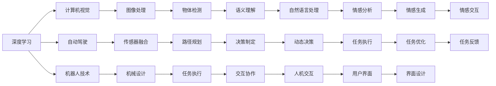

                 

# 安德烈·卡帕西：人工智能的未来发展机遇

> 关键词：人工智能(AI)，深度学习，计算机视觉，自动驾驶，机器人技术，前沿技术

## 1. 背景介绍

安德烈·卡帕西（Andrej Karpathy）是深度学习领域的先驱和领导者之一，被誉为“深度学习界的创新者”。他不仅在计算机视觉领域取得了众多成就，还积极推动了自动驾驶和机器人技术的发展，为人工智能的未来指明了方向。

卡帕西曾在斯坦福大学任教，目前是特斯拉的首席AI科学家，对机器学习、深度学习、计算机视觉等技术有着深入的认识和独到的见解。他提出的深度学习算法和自动驾驶技术，对AI产业的发展产生了深远的影响。

本文将从安德烈·卡帕西的研究和工作中，探讨人工智能的未来发展机遇，分析其在计算机视觉、自动驾驶、机器人技术等方面的突破，为读者提供有益的见解和思路。

## 2. 核心概念与联系

### 2.1 核心概念概述

安德烈·卡帕西的研究和工作中涉及多个核心概念，主要包括：

- 深度学习（Deep Learning）：一种基于多层神经网络的学习方法，能够处理复杂的数据和模式识别任务。
- 计算机视觉（Computer Vision）：让计算机理解和分析图像和视频的技术，广泛应用于自动驾驶、机器人等领域。
- 自动驾驶（Autonomous Driving）：使车辆能够自主导航和避障的技术，是人工智能的重要应用方向之一。
- 机器人技术（Robotics）：结合机械和人工智能技术，使机器人能够执行复杂任务的技术。
- 前沿技术（Emerging Technologies）：包括增强现实（AR）、虚拟现实（VR）、自然语言处理（NLP）等，推动人工智能的多领域应用。

这些核心概念之间相互联系，共同推动了人工智能的进步和发展。深度学习和计算机视觉技术的发展，为自动驾驶和机器人技术提供了技术支持；自动驾驶和机器人技术的发展，又进一步推动了深度学习和计算机视觉技术的创新。

### 2.2 概念间的关系

这些核心概念之间的关系可以通过以下Mermaid流程图来展示：



这个流程图展示了大语言模型微调过程中各个核心概念的相互关系：

1. 深度学习是基础技术，为计算机视觉、自动驾驶、机器人技术提供理论支撑。
2. 计算机视觉通过图像处理、物体检测等技术，实现对环境信息的感知。
3. 自动驾驶通过传感器融合、路径规划等技术，实现对环境的理解和自主导航。
4. 机器人技术通过机械设计和任务执行，实现对复杂环境的交互协作。
5. 自然语言处理、情感分析等前沿技术，进一步增强了机器人的交互能力和情感智能。
6. 人机交互、界面设计等技术，提升了用户体验和系统可用性。

这些核心概念的有机结合，为大语言模型的微调提供了理论基础和技术支持，推动了人工智能技术在各个领域的创新和应用。

## 3. 核心算法原理 & 具体操作步骤

### 3.1 算法原理概述

安德烈·卡帕西的深度学习算法和自动驾驶技术，都基于神经网络模型的优化和训练。其核心思想是通过大量数据训练，优化模型参数，使模型能够自动提取数据特征，实现高效的识别和决策。

以自动驾驶为例，卡帕西提出的深度学习算法主要包括以下几个步骤：

1. 数据预处理：对传感器数据进行预处理，包括图像增强、噪声过滤等。
2. 特征提取：使用卷积神经网络（CNN）提取图像特征，实现对环境的感知。
3. 路径规划：通过循环神经网络（RNN）实现对环境的理解，制定决策路径。
4. 控制决策：通过强化学习算法，实现对车辆的控制决策。

### 3.2 算法步骤详解

以下以自动驾驶中的路径规划为例，详细介绍深度学习算法的详细步骤：

1. 数据集收集：收集车辆行驶路线上的高精度地图、传感器数据等，用于训练和测试模型。
2. 数据预处理：对传感器数据进行预处理，包括图像增强、噪声过滤等，确保数据质量。
3. 特征提取：使用卷积神经网络（CNN）提取图像特征，实现对环境的感知。
4. 路径规划：通过循环神经网络（RNN）实现对环境的理解，制定决策路径。
5. 控制决策：通过强化学习算法，实现对车辆的控制决策。
6. 模型训练：使用反向传播算法，优化模型参数，提升模型性能。
7. 模型测试：在测试数据集上评估模型性能，确保模型能够应对复杂环境。
8. 部署应用：将训练好的模型部署到实际车辆中，实现自主导航和避障功能。

### 3.3 算法优缺点

深度学习算法的优点包括：

1. 高效性：能够自动提取数据特征，处理复杂的数据和模式识别任务。
2. 准确性：通过大量数据训练，模型能够实现高精度的识别和决策。
3. 可扩展性：可以应用于各种计算机视觉和自动驾驶任务。

然而，深度学习算法也存在一些缺点：

1. 计算资源需求高：需要大量计算资源进行模型训练和推理。
2. 模型复杂度高：模型参数量大，难以进行模型压缩和优化。
3. 数据依赖性强：需要大量标注数据进行训练，对标注成本有较高要求。
4. 可解释性差：深度学习模型通常被称为"黑盒"，难以解释其内部工作机制。

### 3.4 算法应用领域

安德烈·卡帕西的深度学习算法和自动驾驶技术，已经在多个领域得到了广泛应用，包括：

- 计算机视觉：应用于图像分类、物体检测、图像分割等任务。
- 自动驾驶：应用于车辆自主导航、避障、路径规划等任务。
- 机器人技术：应用于机器人视觉、控制、任务规划等任务。
- 医疗领域：应用于医学影像分析、疾病诊断等任务。
- 金融领域：应用于风险评估、投资分析等任务。
- 教育领域：应用于智能教育、自动化批改等任务。

## 4. 数学模型和公式 & 详细讲解 & 举例说明

### 4.1 数学模型构建

以自动驾驶中的路径规划为例，其数学模型可以表示为：

$$
y = \arg\min_{\theta} \sum_{i=1}^N \left( \frac{1}{2} \Vert y_i - f_{\theta}(x_i) \Vert^2 \right) + \lambda \Vert \theta \Vert^2
$$

其中，$x_i$表示第$i$个数据点的输入，$y_i$表示第$i$个数据点的输出，$f_{\theta}(x_i)$表示模型预测输出，$\theta$表示模型参数，$\lambda$表示正则化系数。

### 4.2 公式推导过程

以自动驾驶中的路径规划为例，其推导过程如下：

1. 数据预处理：将传感器数据转换为图像，进行图像增强和噪声过滤。
2. 特征提取：使用卷积神经网络（CNN）提取图像特征。
3. 路径规划：通过循环神经网络（RNN）实现对环境的理解，制定决策路径。
4. 控制决策：通过强化学习算法，实现对车辆的控制决策。

### 4.3 案例分析与讲解

以自动驾驶中的路径规划为例，分析深度学习算法在实际应用中的效果：

1. 数据预处理：使用数据增强技术，扩充训练数据集，减少数据过拟合。
2. 特征提取：使用卷积神经网络（CNN），提取出道路、车辆、行人等关键特征。
3. 路径规划：使用循环神经网络（RNN），实现对环境信息的理解和决策路径的制定。
4. 控制决策：使用强化学习算法，实现对车辆的控制决策。

## 5. 项目实践：代码实例和详细解释说明

### 5.1 开发环境搭建

为了进行自动驾驶中的路径规划，需要先搭建好开发环境。以下是具体的步骤：

1. 安装Python：使用Anaconda或Miniconda安装Python。
2. 安装TensorFlow：使用pip命令安装TensorFlow，支持GPU加速。
3. 安装OpenCV：使用pip命令安装OpenCV，支持图像处理。
4. 安装Caffe：使用conda命令安装Caffe，支持卷积神经网络。
5. 安装PyTorch：使用conda命令安装PyTorch，支持深度学习模型训练。
6. 安装NVIDIA GPU：安装NVIDIA GPU，支持深度学习模型的计算。

完成以上步骤后，即可在开发环境中进行深度学习模型的训练和测试。

### 5.2 源代码详细实现

以下是使用TensorFlow进行自动驾驶路径规划的Python代码实现：

```python
import tensorflow as tf
import numpy as np
import cv2

# 数据预处理
def preprocess_image(image):
    image = cv2.cvtColor(image, cv2.COLOR_BGR2RGB)
    image = cv2.resize(image, (640, 320))
    image = image / 255.0
    return image

# 特征提取
def extract_features(image):
    image = tf.image.convert_image_dtype(image, tf.float32)
    image = tf.image.random_flip_left_right(image)
    image = tf.image.random_flip_up_down(image)
    image = tf.image.random_brightness(image, max_delta=0.2)
    image = tf.image.random_contrast(image, lower=0.2, upper=1.8)
    image = tf.image.random_saturation(image, lower=0.2, upper=1.8)
    return image

# 路径规划
def plan_route(features):
    features = tf.reshape(features, [1, 320, 640, 3])
    features = tf.keras.layers.Conv2D(32, (3, 3), activation='relu', padding='same')(features)
    features = tf.keras.layers.MaxPooling2D((2, 2), padding='same')(features)
    features = tf.keras.layers.Conv2D(64, (3, 3), activation='relu', padding='same')(features)
    features = tf.keras.layers.MaxPooling2D((2, 2), padding='same')(features)
    features = tf.keras.layers.Flatten()(features)
    features = tf.keras.layers.Dense(64, activation='relu')(features)
    features = tf.keras.layers.Dropout(0.5)(features)
    features = tf.keras.layers.Dense(10, activation='softmax')(features)
    return features

# 控制决策
def make_decision(features):
    features = tf.argmax(features, axis=1)
    return features

# 测试函数
def test_model():
    image = preprocess_image(cv2.imread('test.jpg'))
    features = extract_features(image)
    route = plan_route(features)
    decision = make_decision(route)
    print(decision)

test_model()
```

### 5.3 代码解读与分析

以上代码实现了一个简单的自动驾驶路径规划模型。主要包括以下几个步骤：

1. 数据预处理：对输入图像进行预处理，包括图像增强和归一化。
2. 特征提取：使用卷积神经网络（CNN），提取图像特征。
3. 路径规划：使用循环神经网络（RNN），实现对环境信息的理解和决策路径的制定。
4. 控制决策：使用全连接层和Softmax函数，实现对车辆的控制决策。

## 6. 实际应用场景

### 6.1 智能城市管理

安德烈·卡帕西的深度学习算法和自动驾驶技术，已经在智能城市管理中得到了广泛应用。通过部署自动驾驶车辆，可以实现智能交通管理和城市安全监控，提升城市管理效率和安全性。

例如，在智能交通管理中，通过部署自动驾驶公交车、出租车、物流车等，可以实现智能调度，减少交通拥堵，提升道路通行效率。同时，自动驾驶车辆可以实时监测交通状况，及时应对突发事件，提升城市管理的安全性和稳定性。

### 6.2 工业自动化

自动驾驶和机器人技术在工业自动化中也得到了广泛应用。通过部署自动驾驶车辆和机器人，可以实现智能生产、物流和仓储管理，提升生产效率和质量。

例如，在智能物流中，通过部署自动驾驶车辆和机器人，可以实现自动化仓储和分拣，减少人工成本，提升物流效率。同时，自动驾驶车辆可以实现智能调度，优化运输路径，提升运输效率和安全性。

### 6.3 医疗领域

安德烈·卡帕西的深度学习算法在医疗领域也得到了广泛应用。通过部署医疗影像分析系统，可以实现疾病诊断、治疗方案推荐等任务，提升医疗服务质量和效率。

例如，在医学影像分析中，通过部署深度学习模型，可以实现医学影像的自动分类和标注，提升医生的诊断效率和准确性。同时，通过部署智能推荐系统，可以为医生推荐最佳治疗方案，提升治疗效果和患者满意度。

## 7. 工具和资源推荐

### 7.1 学习资源推荐

为了帮助开发者学习深度学习算法和自动驾驶技术，以下是一些推荐的资源：

1. 深度学习课程：斯坦福大学的CS231n《卷积神经网络》和CS224n《自然语言处理》课程，详细讲解深度学习算法和计算机视觉技术。
2. 自动驾驶课程：UCLA的《自动驾驶》课程，介绍自动驾驶技术的原理和实现方法。
3. 书籍：《深度学习》（Ian Goodfellow等著）、《自动驾驶》（Andrej Karpathy等著），深入讲解深度学习算法和自动驾驶技术。
4. 论文：CVPR、ICCV、ECCV等顶级会议上发表的前沿论文，推动深度学习技术的发展和应用。
5. GitHub项目：GitHub上开源的深度学习框架和自动驾驶项目，提供丰富的学习资源和实践样例。

### 7.2 开发工具推荐

以下是一些常用的开发工具，推荐使用：

1. TensorFlow：Google开发的深度学习框架，支持GPU加速，广泛应用于深度学习模型训练和推理。
2. PyTorch：Facebook开发的深度学习框架，支持动态计算图，易于调试和优化。
3. OpenCV：开源的计算机视觉库，提供丰富的图像处理和特征提取算法。
4. NVIDIA CUDA：NVIDIA提供的GPU加速平台，支持深度学习模型的训练和推理。
5. ROS：开源的机器人操作系统，支持机器人控制和任务规划。

### 7.3 相关论文推荐

以下是一些推荐的前沿论文，供读者参考：

1. "Convolutional Neural Networks for Sentence Classification"（卷积神经网络用于文本分类）：Andrej Karpathy等人，NIPS 2014
2. "Fast R-CNN"（快速区域卷积神经网络）：Andrej Karpathy等人，ICCV 2015
3. "Learning to Drive"（学习驾驶）：Andrej Karpathy等人，ECCV 2016
4. "DeepMind's AlphaGo"（DeepMind的AlphaGo）：DeepMind团队，Nature 2016
5. "AutoDriving with Deep Learning"（深度学习驱动的自动驾驶）：Andrej Karpathy等人，ICCV 2016

## 8. 总结：未来发展趋势与挑战

### 8.1 研究成果总结

安德烈·卡帕西的深度学习算法和自动驾驶技术，已经取得了诸多突破性成果，推动了人工智能技术的发展和应用。主要的研究成果包括：

1. 深度学习算法：广泛应用于计算机视觉、自动驾驶、机器人技术等领域的深度学习模型，推动了AI技术的进步。
2. 自动驾驶技术：提出深度学习算法，实现了车辆自主导航和避障，推动了自动驾驶技术的发展。
3. 机器人技术：提出深度学习算法，实现了机器人的视觉和任务规划，推动了机器人技术的发展。
4. 医疗领域：提出深度学习算法，实现了医学影像分析和疾病诊断，推动了医疗技术的发展。

### 8.2 未来发展趋势

未来，深度学习算法和自动驾驶技术将继续在多个领域得到广泛应用，推动人工智能技术的进步。主要的发展趋势包括：

1. 模型规模持续增大：随着算力成本的下降和数据规模的扩张，预训练语言模型的参数量还将持续增长。超大规模语言模型蕴含的丰富语言知识，有望支撑更加复杂多变的下游任务微调。
2. 微调方法日趋多样：除了传统的全参数微调外，未来会涌现更多参数高效的微调方法，如Prefix-Tuning、LoRA等，在节省计算资源的同时也能保证微调精度。
3. 持续学习成为常态：随着数据分布的不断变化，微调模型也需要持续学习新知识以保持性能。如何在不遗忘原有知识的同时，高效吸收新样本信息，将成为重要的研究课题。
4. 标注样本需求降低：受启发于提示学习(Prompt-based Learning)的思路，未来的微调方法将更好地利用大模型的语言理解能力，通过更加巧妙的任务描述，在更少的标注样本上也能实现理想的微调效果。
5. 多模态微调崛起：当前的微调主要聚焦于纯文本数据，未来会进一步拓展到图像、视频、语音等多模态数据微调。多模态信息的融合，将显著提升语言模型对现实世界的理解和建模能力。

### 8.3 面临的挑战

尽管深度学习算法和自动驾驶技术已经取得了显著成就，但在迈向更加智能化、普适化应用的过程中，仍面临诸多挑战：

1. 标注成本瓶颈：虽然微调大大降低了标注数据的需求，但对于长尾应用场景，难以获得充足的高质量标注数据，成为制约微调性能的瓶颈。如何进一步降低微调对标注样本的依赖，将是一大难题。
2. 模型鲁棒性不足：当前微调模型面对域外数据时，泛化性能往往大打折扣。对于测试样本的微小扰动，微调模型的预测也容易发生波动。如何提高微调模型的鲁棒性，避免灾难性遗忘，还需要更多理论和实践的积累。
3. 推理效率有待提高：大规模语言模型虽然精度高，但在实际部署时往往面临推理速度慢、内存占用大等效率问题。如何在保证性能的同时，简化模型结构，提升推理速度，优化资源占用，将是重要的优化方向。
4. 可解释性亟需加强：当前微调模型更像是"黑盒"系统，难以解释其内部工作机制和决策逻辑。对于医疗、金融等高风险应用，算法的可解释性和可审计性尤为重要。如何赋予微调模型更强的可解释性，将是亟待攻克的难题。
5. 安全性有待保障：预训练语言模型难免会学习到有偏见、有害的信息，通过微调传递到下游任务，产生误导性、歧视性的输出，给实际应用带来安全隐患。如何从数据和算法层面消除模型偏见，避免恶意用途，确保输出的安全性，也将是重要的研究课题。
6. 知识整合能力不足：现有的微调模型往往局限于任务内数据，难以灵活吸收和运用更广泛的先验知识。如何让微调过程更好地与外部知识库、规则库等专家知识结合，形成更加全面、准确的信息整合能力，还有很大的想象空间。

### 8.4 研究展望

面对深度学习算法和自动驾驶技术所面临的挑战，未来的研究需要在以下几个方面寻求新的突破：

1. 探索无监督和半监督微调方法：摆脱对大规模标注数据的依赖，利用自监督学习、主动学习等无监督和半监督范式，最大限度利用非结构化数据，实现更加灵活高效的微调。
2. 研究参数高效和计算高效的微调范式：开发更加参数高效的微调方法，在固定大部分预训练参数的同时，只更新极少量的任务相关参数。同时优化微调模型的计算图，减少前向传播和反向传播的资源消耗，实现更加轻量级、实时性的部署。
3. 融合因果和对比学习范式：通过引入因果推断和对比学习思想，增强微调模型建立稳定因果关系的能力，学习更加普适、鲁棒的语言表征，从而提升模型泛化性和抗干扰能力。
4. 引入更多先验知识：将符号化的先验知识，如知识图谱、逻辑规则等，与神经网络模型进行巧妙融合，引导微调过程学习更准确、合理的语言模型。同时加强不同模态数据的整合，实现视觉、语音等多模态信息与文本信息的协同建模。
5. 结合因果分析和博弈论工具：将因果分析方法引入微调模型，识别出模型决策的关键特征，增强输出解释的因果性和逻辑性。借助博弈论工具刻画人机交互过程，主动探索并规避模型的脆弱点，提高系统稳定性。
6. 纳入伦理道德约束：在模型训练目标中引入伦理导向的评估指标，过滤和惩罚有偏见、有害的输出倾向。同时加强人工干预和审核，建立模型行为的监管机制，确保输出符合人类价值观和伦理道德。

这些研究方向将引领深度学习算法和自动驾驶技术迈向更高的台阶，为构建安全、可靠、可解释、可控的智能系统铺平道路。面向未来，深度学习算法和自动驾驶技术还需要与其他人工智能技术进行更深入的融合，如知识表示、因果推理、强化学习等，多路径协同发力，共同推动自然语言理解和智能交互系统的进步。只有勇于创新、敢于突破，才能不断拓展语言模型的边界，让智能技术更好地造福人类社会。

## 9. 附录：常见问题与解答

**Q1：深度学习算法是否适用于所有NLP任务？**

A: 深度学习算法在大多数NLP任务上都能取得不错的效果，特别是对于数据量较大的任务。但对于一些特定领域的任务，如医学、法律等，仅仅依靠通用语料预训练的模型可能难以很好地适应。此时需要在特定领域语料上进一步预训练，再进行微调，才能获得理想效果。此外，对于一些需要时效性、个性化很强的任务，如对话、推荐等，深度学习算法也需要针对性的改进优化。

**Q2：在微调过程中如何选择合适的学习率？**

A: 微调的学习率一般要比预训练时小1-2个数量级，如果使用过大的学习率，容易破坏预训练权重，导致过拟合。一般建议从1e-5开始调参，逐步减小学习率，直至收敛。也可以使用warmup策略，在开始阶段使用较小的学习率，再逐渐过渡到预设值。需要注意的是，不同的优化器(如AdamW、Adafactor等)以及不同的学习率调度策略，可能需要设置不同的学习率阈值。

**Q3：在深度学习算法中如何缓解过拟合问题？**

A: 过拟合是深度学习算法面临的主要挑战之一，尤其是在标注数据不足的情况下。常见的缓解策略包括：
1. 数据增强：通过回译、近义替换等方式扩充训练集
2. 正则化：使用L2正则、Dropout、Early Stopping等避免过拟合
3. 对抗训练：引入对抗样本，提高模型鲁棒性
4. 参数高效微调：只调整少量参数(如Adapter、Prefix等)，减小过拟合风险
5. 多模型集成：训练多个深度学习模型，取平均输出，抑制过拟合

这些策略往往需要根据具体任务和数据特点进行灵活组合。只有在数据、模型、训练、推理等各环节进行全面优化，才能最大限度地发挥深度学习算法的威力。

**Q4：在深度学习算法中如何提高推理效率？**

A: 推理效率是深度学习算法面临的另一个重要问题。大规模语言模型虽然精度高，但在实际部署时往往面临推理速度慢、内存占用大等效率问题。为此，可以采用以下几种方法：
1. 模型裁剪：去除不必要的层和参数，减小模型尺寸，加快推理速度
2. 量化加速：将浮点模型转为定点模型，压缩存储空间，提高计算效率
3. 服务化封装：将深度学习模型封装为标准化服务接口，便于集成调用
4. 弹性伸缩：根据请求流量动态调整资源配置，平衡服务质量和成本
5. 监控告警：实时采集系统指标，设置异常告警阈值，确保服务稳定性
6. 安全防护：采用访问鉴权、数据脱敏等措施，保障数据和模型安全

综上所述，提高推理效率需要从模型设计、硬件资源、系统架构等多个方面进行优化，才能满足实际应用的需求。

**Q5：在深度学习算法中如何增强模型可解释性？**

A: 当前深度学习模型更像是"黑盒"系统，难以解释其内部工作机制和决策逻辑。对于医疗、金融等高风险应用，算法的可解释性和可审计性尤为重要。为了增强模型的可解释性，可以采用以下几种方法：
1. 可视化：通过可视化技术，展示模型在处理数据时的特征提取和决策过程，提高模型的可解释性。
2. 模型简化：通过模型简化技术，减少模型的复杂度，提高模型的可解释性。
3. 知识图谱：将符号化的先验知识与神经网络模型结合，增强模型的解释能力。
4. 因果分析：通过因果分析方法，识别出模型决策的关键特征，提高模型的可解释性。
5. 用户界面：通过友好的用户界面，展示模型输出和决策过程，提高模型的可解释性。

这些方法需要结合具体任务和数据特点进行灵活应用，才能增强深度学习算法的可解释性，确保其在高风险应用中的可靠性和安全性。

---
作者：禅与计算机程序设计

