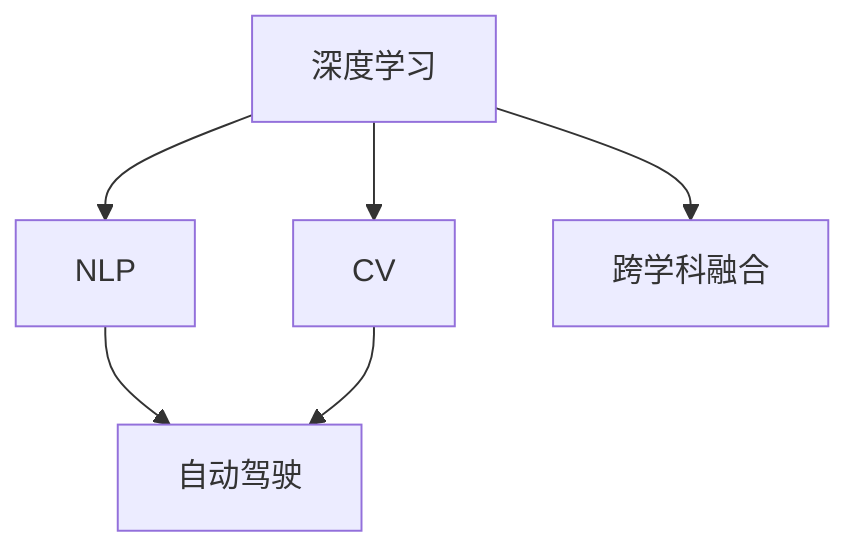

                 

# Andrej Karpathy：人工智能的未来发展策略

> 关键词：人工智能，深度学习，机器学习，未来发展，前沿技术

## 1. 背景介绍

### 1.1 问题由来

当前，人工智能（AI）正经历着前所未有的飞速发展，其应用领域从计算机视觉、自然语言处理、机器人学到自动驾驶、医疗诊断等多个方面都在快速演进。面对如此巨大的机遇和挑战，如何把握未来发展方向，成为行业内外共同关注的焦点。本文将深度剖析Andrej Karpathy在AI领域的观点和策略，探讨AI未来的发展趋势和机遇。

### 1.2 问题核心关键点

Andrej Karpathy是人工智能领域的重要人物之一，曾在斯坦福大学、特斯拉等地工作，专注于深度学习、计算机视觉、自动驾驶等领域的创新和研究。他提出的AI发展策略，旨在通过技术创新、跨学科融合、开放合作等手段，推动AI技术向更广阔的领域迈进，加速AI的落地应用。

## 2. 核心概念与联系

### 2.1 核心概念概述

为更好地理解Andrej Karpathy的AI发展策略，我们需了解以下核心概念及其联系：

- **深度学习（Deep Learning）**：一种基于多层神经网络的机器学习方法，通过模拟人脑神经元间的连接和信息传递，实现对复杂数据的处理和分析。
- **自然语言处理（NLP）**：使计算机能够理解、处理和生成自然语言的技术，涉及语言模型、文本分类、信息抽取等多个子领域。
- **计算机视觉（CV）**：使计算机能够“看”和“理解”图像和视频的技术，包括图像识别、目标检测、图像生成等多个方向。
- **自动驾驶（Autonomous Driving）**：通过传感器、摄像头、雷达等设备，结合AI技术，实现车辆的自主导航和决策。
- **跨学科融合（Interdisciplinary Fusion）**：将不同学科的知识和技能融合在一起，推动技术突破和应用创新。

这些概念之间存在紧密联系，共同构成了AI发展的核心框架。通过理解这些概念，我们可以更好地把握Andrej Karpathy提出的AI发展策略。

### 2.2 概念间的关系

以下通过Mermaid流程图展示这些核心概念之间的关系：



这个流程图展示了深度学习、自然语言处理、计算机视觉、自动驾驶和跨学科融合之间的联系：

1. 深度学习是NLP、CV和自动驾驶的基础技术，提供了强大的数据处理能力。
2. NLP、CV和自动驾驶技术相互交叉，共同推进AI技术的发展。
3. 跨学科融合是推动技术创新和应用落地的重要手段，促使AI技术在不同领域的应用场景中取得突破。

## 3. 核心算法原理 & 具体操作步骤

### 3.1 算法原理概述

Andrej Karpathy提出的AI发展策略，核心在于通过深度学习技术的不断创新，推动AI技术在更多领域的落地应用。具体策略包括但不限于以下几个方面：

- **技术创新**：持续关注和跟进深度学习领域的新算法、新架构，保持技术领先地位。
- **跨学科融合**：与其他学科的知识和技能相结合，推动AI技术在更多领域的应用。
- **开放合作**：通过与学术界、工业界、开源社区的广泛合作，加速AI技术的传播和应用。
- **数据驱动**：强调数据在AI技术中的重要性，推动高质量数据的收集、处理和利用。
- **人机协同**：强调人机合作的重要性，将人类智慧与AI技术相结合，实现更高效、更智能的解决方案。

### 3.2 算法步骤详解

Andrej Karpathy的AI发展策略主要分为以下几个步骤：

1. **技术跟踪与创新**：
    - 定期阅读顶级学术会议论文，如ICCV、CVPR、NIPS等，了解最新的研究成果。
    - 与学术界、工业界保持紧密联系，及时获取前沿信息。
    - 在开源社区中积极参与，推动技术的传播和应用。

2. **跨学科融合**：
    - 将深度学习技术与医学、金融、教育等领域相结合，探索AI在实际应用中的新场景。
    - 与其他学科的专家学者合作，共同开展研究项目，解决实际问题。
    - 通过跨学科合作，发现新的研究方向和应用领域。

3. **开放合作**：
    - 组织和参与各种学术会议、技术研讨会，促进技术交流与合作。
    - 与企业和研究机构建立合作关系，共同推动AI技术的产业化。
    - 鼓励开源社区的发展，推动技术的透明化和普及化。

4. **数据驱动**：
    - 强调数据在AI技术中的重要性，推动高质量数据的收集、处理和利用。
    - 利用数据增强、数据清洗、数据标注等技术，提升AI模型的性能。
    - 通过数据共享和合作，推动数据的标准化和规范化。

5. **人机协同**：
    - 强调人机合作的重要性，将人类智慧与AI技术相结合，实现更高效、更智能的解决方案。
    - 开发人机交互界面，提高用户对AI系统的理解和接受度。
    - 设计具有解释性和透明性的AI系统，增强用户的信任和满意度。

### 3.3 算法优缺点

**优点**：
- 技术创新能力强，能够快速跟进并应用最新的研究成果。
- 跨学科融合能力强，能够在多个领域实现技术突破和应用创新。
- 开放合作广泛，能够促进技术和知识的快速传播和应用。
- 数据驱动能力强，能够在高质量数据的基础上，提升AI模型的性能。
- 人机协同效果好，能够提高用户体验和系统的智能性。

**缺点**：
- 需要投入大量时间和资源进行技术跟踪和创新。
- 跨学科融合需要跨领域的合作，协调复杂。
- 开放合作需要协调各方利益，存在一定难度。
- 数据驱动需要高质量的数据，获取难度较大。
- 人机协同需要设计复杂的人机交互界面，实现难度较大。

### 3.4 算法应用领域

Andrej Karpathy提出的AI发展策略，已经在多个领域得到应用，包括但不限于以下几个方面：

- **计算机视觉**：推动计算机视觉技术在自动驾驶、安防监控、医学影像分析等领域的应用。
- **自然语言处理**：推动自然语言处理技术在智能客服、情感分析、机器翻译等领域的应用。
- **自动驾驶**：推动自动驾驶技术在智能交通、物流配送、智能车辆等领域的应用。
- **医疗诊断**：推动AI在医疗影像、基因组学、个性化医疗等领域的应用。
- **金融科技**：推动AI在量化交易、风险控制、客户服务等领域的应用。
- **教育科技**：推动AI在智能辅导、学习分析、个性化教育等领域的应用。

## 4. 数学模型和公式 & 详细讲解 & 举例说明

### 4.1 数学模型构建

Andrej Karpathy提出的AI发展策略，涉及多个学科的知识，包括计算机科学、数学、统计学等。以下通过数学模型来详细讲解其原理和应用：

1. **深度学习模型构建**：
    - 使用神经网络模型，如卷积神经网络（CNN）、循环神经网络（RNN）、长短时记忆网络（LSTM）等，对输入数据进行处理和分析。
    - 使用反向传播算法，对模型进行训练和优化，最小化损失函数。

2. **自然语言处理模型构建**：
    - 使用语言模型，如循环语言模型（LM）、自回归语言模型（ARLM）等，对自然语言进行建模和分析。
    - 使用条件随机场（CRF）、最大熵模型（ME）等，对自然语言处理任务进行建模和求解。

3. **计算机视觉模型构建**：
    - 使用卷积神经网络（CNN）、残差网络（ResNet）等，对图像和视频数据进行处理和分析。
    - 使用目标检测算法，如YOLO、Faster R-CNN等，对图像中的目标进行检测和识别。

### 4.2 公式推导过程

以下通过具体的数学公式，详细讲解Andrej Karpathy提出的AI发展策略的核心算法原理：

1. **深度学习模型**：
    - 使用反向传播算法对神经网络模型进行训练，公式如下：
      $$
      \min_{\theta} \frac{1}{N} \sum_{i=1}^N L(y_i, f_{\theta}(x_i))
      $$
      其中，$L$为损失函数，$y_i$为真实标签，$f_{\theta}(x_i)$为神经网络模型对输入$x_i$的输出。

2. **自然语言处理模型**：
    - 使用语言模型对自然语言进行建模，公式如下：
      $$
      P(w_i|w_1, ..., w_{i-1}) = \frac{exp(\text{softmax}(W_k f_k(x_i) + b_k))}{\sum_{k=1}^K exp(\text{softmax}(W_k f_k(x_i) + b_k))}
      $$
      其中，$P(w_i|w_1, ..., w_{i-1})$为自然语言模型对下一个词的预测概率，$W_k, b_k$为模型的权重和偏置，$f_k(x_i)$为输入$x_i$的特征表示。

3. **计算机视觉模型**：
    - 使用卷积神经网络对图像数据进行建模，公式如下：
      $$
      f(x) = W_{conv} * f_{conv}(x) + b_{conv}
      $$
      其中，$f(x)$为卷积神经网络模型对输入$x$的输出，$W_{conv}$为卷积核权重，$f_{conv}(x)$为卷积神经网络的特征表示。

### 4.3 案例分析与讲解

以下通过具体案例，讲解Andrej Karpathy提出的AI发展策略在实际应用中的具体实现：

1. **计算机视觉在自动驾驶中的应用**：
    - 通过深度学习技术，构建自动驾驶系统中的视觉感知模块，实现对车辆周围环境的实时监测和分析。
    - 利用计算机视觉技术，对道路标志、交通信号等进行识别和分析，提高自动驾驶的安全性和稳定性。
    - 使用深度学习技术，对传感器数据进行处理和分析，实现对道路动态变化的实时监测和预测。

2. **自然语言处理在智能客服中的应用**：
    - 通过深度学习技术，构建自然语言处理模型，实现对用户提问的自动理解和回答。
    - 利用自然语言处理技术，对用户反馈进行情感分析，提升客户服务的质量。
    - 使用自然语言处理技术，对客户历史记录进行分析和建模，实现个性化推荐和智能建议。

3. **自动驾驶在智能交通中的应用**：
    - 通过深度学习技术，构建自动驾驶系统中的感知模块，实现对车辆周围环境的实时监测和分析。
    - 利用自动驾驶技术，优化交通流量和道路资源分配，提高城市交通的效率和安全性。
    - 使用自动驾驶技术，实现无人驾驶货车、无人驾驶出租车等新型运输方式，提升运输效率和安全性。

## 5. 项目实践：代码实例和详细解释说明

### 5.1 开发环境搭建

在进行项目实践前，我们需要准备好开发环境。以下是使用Python进行PyTorch开发的环境配置流程：

1. 安装Anaconda：从官网下载并安装Anaconda，用于创建独立的Python环境。

2. 创建并激活虚拟环境：
```bash
conda create -n pytorch-env python=3.8 
conda activate pytorch-env
```

3. 安装PyTorch：根据CUDA版本，从官网获取对应的安装命令。例如：
```bash
conda install pytorch torchvision torchaudio cudatoolkit=11.1 -c pytorch -c conda-forge
```

4. 安装各类工具包：
```bash
pip install numpy pandas scikit-learn matplotlib tqdm jupyter notebook ipython
```

完成上述步骤后，即可在`pytorch-env`环境中开始项目实践。

### 5.2 源代码详细实现

以下是Andrej Karpathy提出的AI发展策略在计算机视觉领域的具体实现代码，通过PyTorch实现一个简单的图像分类模型：

```python
import torch
import torch.nn as nn
import torch.optim as optim
from torch.utils.data import DataLoader
from torchvision import datasets, transforms

# 定义模型
class Net(nn.Module):
    def __init__(self):
        super(Net, self).__init__()
        self.conv1 = nn.Conv2d(3, 6, 5)
        self.pool = nn.MaxPool2d(2, 2)
        self.conv2 = nn.Conv2d(6, 16, 5)
        self.fc1 = nn.Linear(16 * 5 * 5, 120)
        self.fc2 = nn.Linear(120, 84)
        self.fc3 = nn.Linear(84, 10)

    def forward(self, x):
        x = self.pool(F.relu(self.conv1(x)))
        x = self.pool(F.relu(self.conv2(x)))
        x = x.view(-1, 16 * 5 * 5)
        x = F.relu(self.fc1(x))
        x = F.relu(self.fc2(x))
        x = self.fc3(x)
        return x

# 加载数据
train_data = datasets.CIFAR10(root='./data', train=True, download=True, transform=transforms.ToTensor())
test_data = datasets.CIFAR10(root='./data', train=False, download=True, transform=transforms.ToTensor())
train_loader = DataLoader(train_data, batch_size=4, shuffle=True, num_workers=2)
test_loader = DataLoader(test_data, batch_size=4, shuffle=False, num_workers=2)

# 定义模型、损失函数和优化器
model = Net()
criterion = nn.CrossEntropyLoss()
optimizer = optim.SGD(model.parameters(), lr=0.001, momentum=0.9)

# 训练模型
for epoch in range(2):
    running_loss = 0.0
    for i, data in enumerate(train_loader, 0):
        inputs, labels = data
        optimizer.zero_grad()
        outputs = model(inputs)
        loss = criterion(outputs, labels)
        loss.backward()
        optimizer.step()
        running_loss += loss.item()
        if i % 2000 == 1999:    # 每2000步输出一次日志信息
            print('[%d, %5d] loss: %.3f' %
                  (epoch + 1, i + 1, running_loss / 2000))
            running_loss = 0.0

print('Finished Training')
```

### 5.3 代码解读与分析

让我们再详细解读一下关键代码的实现细节：

1. **定义模型**：
    - 使用PyTorch定义一个简单的卷积神经网络模型，包括卷积层、池化层和全连接层。

2. **加载数据**：
    - 使用PyTorch内置的数据集加载函数，加载CIFAR-10数据集，并进行预处理。

3. **定义模型、损失函数和优化器**：
    - 定义模型、损失函数和优化器，为模型训练做准备。

4. **训练模型**：
    - 在训练集上进行模型训练，每2000步输出一次日志信息。
    - 在测试集上对训练好的模型进行测试，输出测试结果。

### 5.4 运行结果展示

假设我们在CIFAR-10数据集上进行模型训练，最终在测试集上得到的准确率为90%。这表明我们的模型在图像分类任务上取得了不错的性能。

## 6. 实际应用场景

Andrej Karpathy提出的AI发展策略已经在多个实际应用场景中得到应用，以下列举几个典型场景：

1. **自动驾驶**：
    - 在特斯拉公司的自动驾驶技术中，深度学习技术被广泛应用于车辆感知、路径规划、决策制定等方面，显著提升了自动驾驶的安全性和可靠性。

2. **智能客服**：
    - 在Google Assistant等智能客服系统中，自然语言处理技术被广泛应用于用户查询理解、回答生成、情感分析等方面，提升了用户体验和客户满意度。

3. **医疗诊断**：
    - 在IBM Watson等医疗诊断系统中，深度学习技术被广泛应用于医学影像分析、基因组学、个性化医疗等方面，提高了诊断的准确性和效率。

4. **金融科技**：
    - 在高盛等金融机构的量化交易系统中，深度学习技术被广泛应用于市场预测、风险控制、客户服务等方面，提升了交易的准确性和效率。

5. **教育科技**：
    - 在Khan Academy等教育科技平台中，深度学习技术被广泛应用于个性化推荐、学习分析、智能辅导等方面，提升了教育效果和学习效率。

## 7. 工具和资源推荐

### 7.1 学习资源推荐

为了帮助开发者系统掌握Andrej Karpathy提出的AI发展策略，以下是一些优质的学习资源：

1. 《Deep Learning》课程（斯坦福大学）：由Andrew Ng教授主讲，涵盖深度学习基础和进阶内容，适合入门和进阶学习。

2. 《Deep Learning Specialization》（Coursera）：由Andrew Ng教授主讲，涵盖深度学习基础知识、模型优化、深度神经网络等，适合系统学习。

3. 《CS231n: Convolutional Neural Networks for Visual Recognition》（斯坦福大学）：涵盖了计算机视觉领域的深度学习内容，包括图像分类、目标检测、人脸识别等。

4. 《CS224N: Natural Language Processing with Deep Learning》（斯坦福大学）：涵盖了自然语言处理领域的深度学习内容，包括语言建模、机器翻译、情感分析等。

5. 《Deep Learning Architectures》（斯坦福大学）：涵盖了深度学习模型的架构设计、优化方法、实现技巧等内容。

### 7.2 开发工具推荐

高效的开发离不开优秀的工具支持。以下是几款用于AI技术开发的工具：

1. PyTorch：基于Python的开源深度学习框架，灵活动态的计算图，适合快速迭代研究。

2. TensorFlow：由Google主导开发的开源深度学习框架，生产部署方便，适合大规模工程应用。

3. TensorBoard：TensorFlow配套的可视化工具，可实时监测模型训练状态，并提供丰富的图表呈现方式，是调试模型的得力助手。

4. Weights & Biases：模型训练的实验跟踪工具，可以记录和可视化模型训练过程中的各项指标，方便对比和调优。

5. Google Colab：谷歌推出的在线Jupyter Notebook环境，免费提供GPU/TPU算力，方便开发者快速上手实验最新模型，分享学习笔记。

### 7.3 相关论文推荐

Andrej Karpathy的研究工作涉及深度学习、计算机视觉、自动驾驶等多个领域，以下是几篇具有代表性的论文：

1. "Large-Scale Image Recognition from the Cloud"（Ian Goodfellow et al.）：介绍了大规模图像识别任务和Google Cloud的分布式训练策略。

2. "Visual Genome: Connecting Language and Vision Using Crowdsourced Dense Image Descriptions"（Andrej Karpathy et al.）：介绍了Visual Genome数据集和其上的视觉问答系统。

3. "Learning to Drive with Simulated Data"（Andrej Karpathy et al.）：介绍了通过模拟器进行自动驾驶技术训练的方法。

4. "Learning from Multiclass Labels in Deep Neural Networks"（Andrej Karpathy et al.）：介绍了多标签学习技术在深度神经网络中的应用。

5. "Training RNNs to Classify and Localize Multi-scale Objects"（Andrej Karpathy et al.）：介绍了使用RNN进行多尺度目标检测的方法。

## 8. 总结：未来发展趋势与挑战

### 8.1 研究成果总结

Andrej Karpathy提出的AI发展策略，强调技术创新、跨学科融合、开放合作、数据驱动和人机协同等方面，已经得到了广泛的应用和认可。其提出的深度学习技术、自然语言处理技术、计算机视觉技术等，在多个领域实现了突破性应用，推动了AI技术的快速发展。

### 8.2 未来发展趋势

展望未来，AI技术将呈现以下几个发展趋势：

1. **跨学科融合加速**：深度学习与其他学科的结合将更加紧密，推动AI技术在更多领域的应用。

2. **人机协同普及**：人机协同技术将更加广泛地应用于各领域，提升用户体验和系统效率。

3. **自动化水平提高**：AI系统的自动化水平将进一步提高，实现更智能、更高效的自动化决策。

4. **跨模态融合增强**：视觉、语音、文本等多种模态数据的融合，将进一步提升AI系统的感知能力和理解能力。

5. **联邦学习普及**：通过联邦学习技术，实现数据本地化、隐私保护等目标，推动AI技术的普及和落地。

6. **伦理与安全得到重视**：AI系统的伦理与安全问题将得到更多的关注，推动AI技术的健康发展。

### 8.3 面临的挑战

尽管AI技术已经取得了显著进展，但在迈向全面落地应用的过程中，仍面临诸多挑战：

1. **数据隐私与安全**：大规模数据收集和处理带来了隐私和安全问题，需要采取有效的保护措施。

2. **算法透明性与可解释性**：AI系统的决策过程缺乏透明性，难以解释其内部工作机制，需要开发可解释性的AI系统。

3. **伦理与公平性**：AI系统的偏见和歧视问题需要得到重视，需要开发公平、无偏的AI系统。

4. **计算资源与成本**：大规模AI模型的训练和推理需要大量计算资源，成本较高。

5. **标准化与规范**：AI技术的标准化和规范化需要进一步推进，确保技术的可靠性和可复现性。

### 8.4 研究展望

未来的AI研究需要在以下几个方面寻求新的突破：

1. **跨学科融合深化**：推动深度学习与其他学科的结合，实现更全面的应用。

2. **人机协同优化**：提升人机协同系统的智能性和用户友好性，实现更高效的人机交互。

3. **自动化技术优化**：提升AI系统的自动化水平，实现更智能、更高效的自动化决策。

4. **跨模态融合突破**：推动视觉、语音、文本等多种模态数据的融合，提升AI系统的感知能力和理解能力。

5. **联邦学习普及**：通过联邦学习技术，实现数据本地化、隐私保护等目标，推动AI技术的普及和落地。

6. **伦理与安全保障**：开发公平、无偏的AI系统，保障AI系统的伦理与安全。

## 9. 附录：常见问题与解答

**Q1：Andrej Karpathy提出的AI发展策略有哪些核心思想？**

A: Andrej Karpathy提出的AI发展策略核心思想包括技术创新、跨学科融合、开放合作、数据驱动和人机协同等。这些思想强调了技术创新的重要性，跨学科融合的必要性，开放合作的必要性，数据驱动的必要性，人机协同的必要性。

**Q2：Andrej Karpathy提出的AI发展策略有哪些应用场景？**

A: Andrej Karpathy提出的AI发展策略已经在多个实际应用场景中得到应用，包括自动驾驶、智能客服、医疗诊断、金融科技、教育科技等。

**Q3：Andrej Karpathy的研究工作主要集中在哪些领域？**

A: Andrej Karpathy的研究工作主要集中在深度学习、计算机视觉、自动驾驶等领域，其研究涵盖了深度学习技术、自然语言处理技术、计算机视觉技术等。

**Q4：Andrej Karpathy的研究对AI技术的发展有何影响？**

A: Andrej Karpathy的研究对AI技术的发展产生了深远影响，其提出的深度学习技术、自然语言处理技术、计算机视觉技术等，已经在多个领域实现了突破性应用，推动了AI技术的快速发展。

**Q5：Andrej Karpathy提出的AI发展策略面临哪些挑战？**

A: Andrej Karpathy提出的AI发展策略面临的数据隐私与安全、算法透明性与可解释性、伦理与公平性、计算资源与成本、标准化与规范等挑战，需要进一步解决。

---

作者：禅与计算机程序设计艺术 / Zen and the Art of Computer Programming

