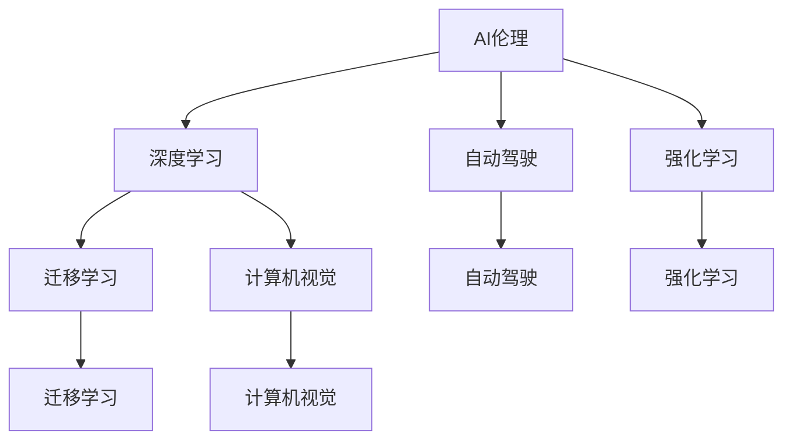
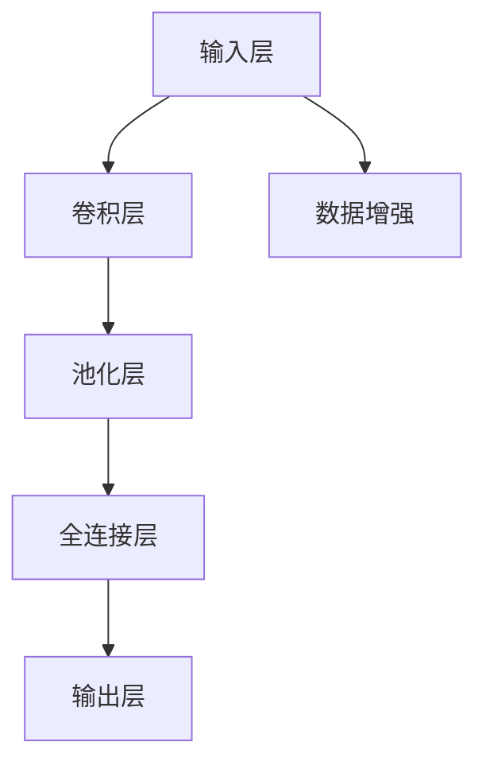

                 

# Andrej Karpathy：人工智能的未来发展策略

人工智能（AI）的发展正在迅速改变我们的世界，从智能助理到自动驾驶汽车，AI技术的应用无处不在。然而，AI的发展也带来了一些挑战，如伦理问题、技术壁垒等。本文将探讨Andrej Karpathy（斯坦福大学计算机科学教授、人工智能研究员）对AI未来发展的一些思考和策略，希望能为读者提供一些启示。

## 1. 背景介绍

### 1.1 问题由来
Andrej Karpathy在AI领域有着深厚的研究背景和丰富的实践经验。他不仅是斯坦福大学的教授，还曾在Facebook和特斯拉担任AI研究领导职务。Karpathy对AI的未来发展有着独到的见解，他曾多次发表关于AI技术的文章和演讲，涵盖从自动驾驶到AI伦理等多个方面。本文将通过梳理Karpathy的主要观点，探讨AI未来的发展策略。

### 1.2 问题核心关键点
Karpathy在AI领域的思考主要集中在以下几个方面：
- 如何平衡AI技术与人类需求，实现AI与人类共存。
- 如何通过技术创新解决AI的伦理问题，如偏见、透明性等。
- 如何在AI技术的快速发展中保持竞争力，推动技术的可持续发展。

## 2. 核心概念与联系

### 2.1 核心概念概述

为更好地理解Karpathy对AI未来发展的看法，本节将介绍几个密切相关的核心概念：

- **AI伦理**：涉及AI系统在设计和应用过程中所涉及的伦理问题，如隐私、安全、偏见等。
- **深度学习**：通过神经网络等方法进行模型训练，使计算机具备学习、识别、决策等能力。
- **自动驾驶**：利用AI技术实现车辆自主驾驶，提高交通安全和效率。
- **强化学习**：通过试错和奖励机制，使智能体在复杂环境中学习最优策略。
- **迁移学习**：将在一个任务中学到的知识迁移到另一个相关任务中，以减少新任务的学习负担。
- **计算机视觉**：使计算机具备识别、理解图像和视频的能力，是AI领域的重要分支。

这些核心概念之间存在着紧密的联系，共同构成了AI发展的生态系统。以下是这些概念之间的联系：



## 3. 核心算法原理 & 具体操作步骤
### 3.1 算法原理概述

Karpathy认为，AI的未来发展需要在伦理、技术、应用等方面取得平衡。他强调，AI技术的开发和应用应遵循以下几个基本原则：

1. **以人为中心**：AI系统应服务于人类需求，提升人类生活质量。
2. **透明性**：AI系统的决策过程应可解释，让用户理解其工作原理。
3. **可控性**：用户应能够控制AI系统的行为，避免意外结果。
4. **公正性**：AI系统不应带有偏见，应对所有人公平。
5. **安全性**：AI系统应在各种场景下保持稳定和安全，避免造成伤害。

### 3.2 算法步骤详解

Karpathy认为，实现这些原则需要以下几个步骤：

1. **数据标注和清洗**：AI系统需要大量标注数据进行训练，标注数据的质量直接影响模型性能。同时，需要清洗数据，避免偏差和错误。
2. **模型设计和选择**：根据任务需求选择合适的模型架构和优化方法，如深度神经网络、迁移学习等。
3. **模型训练和验证**：通过大量数据训练模型，并使用验证集评估模型性能。
4. **部署和监控**：将模型部署到实际应用中，并持续监控其表现，及时调整。
5. **用户反馈和迭代**：收集用户反馈，优化模型和应用，使其更好地服务于用户需求。

### 3.3 算法优缺点

Karpathy认为，当前的AI技术在以下方面具有优势：
- **精度高**：深度学习模型在图像识别、语音识别等任务中表现优异。
- **自动化**：AI技术可以自动处理大量数据，提高效率。
- **创新性强**：AI技术的快速发展推动了诸多领域的创新。

但同时也存在一些缺点：
- **资源消耗大**：AI系统需要大量计算资源和数据进行训练。
- **依赖数据质量**：AI系统对标注数据的质量和数量依赖较大。
- **伦理问题**：AI系统可能存在偏见、透明性不足等问题。

### 3.4 算法应用领域

Karpathy认为，AI技术在以下领域具有广阔的应用前景：

1. **医疗**：通过图像识别、自然语言处理等技术，提升医疗诊断和治疗效果。
2. **金融**：利用AI进行风险评估、投资分析等，提高金融决策的准确性。
3. **交通**：自动驾驶技术的应用，提升交通安全性。
4. **教育**：AI辅助教育，提升教育质量和效率。
5. **零售**：通过推荐系统、客户服务机器人等，提升零售体验。

## 4. 数学模型和公式 & 详细讲解 & 举例说明
### 4.1 数学模型构建

Karpathy在AI模型构建方面有独到见解，他认为，构建一个有效的AI模型需要以下几个步骤：

1. **数据预处理**：将原始数据转换为模型可接受的格式，如标准化、归一化等。
2. **特征提取**：从原始数据中提取有意义的特征，如卷积神经网络（CNN）用于图像处理。
3. **模型训练**：使用标注数据训练模型，最小化损失函数。
4. **模型评估**：使用验证集评估模型性能，调整超参数。

### 4.2 公式推导过程

以深度神经网络为例，Karpathy介绍了模型训练的基本步骤：

1. **前向传播**：将输入数据传递给神经网络，计算输出。
2. **损失函数计算**：计算模型输出与真实标签之间的误差。
3. **反向传播**：根据误差计算梯度，更新模型参数。
4. **参数更新**：根据梯度更新模型参数，使误差最小化。

### 4.3 案例分析与讲解

以图像识别为例，Karpathy展示了深度神经网络的基本架构：



## 5. 项目实践：代码实例和详细解释说明
### 5.1 开发环境搭建

Karpathy认为，AI模型的开发需要高效的开发环境。以下是一些推荐的开发环境：

1. **Python**：Karpathy推荐使用Python进行AI开发，因为它具有丰富的科学计算库和高效的代码执行能力。
2. **TensorFlow**：Karpathy常用TensorFlow进行深度学习模型训练，其易用性和强大的计算能力使其成为首选。
3. **PyTorch**：Karpathy也推荐使用PyTorch进行模型开发，其动态计算图和灵活的框架设计使其适合进行复杂的模型构建和调试。

### 5.2 源代码详细实现

以下是Karpathy在TensorFlow中实现一个简单的图像识别模型的代码：

```python
import tensorflow as tf
from tensorflow.keras import layers

# 定义模型
model = tf.keras.Sequential([
    layers.Conv2D(32, (3, 3), activation='relu', input_shape=(32, 32, 3)),
    layers.MaxPooling2D((2, 2)),
    layers.Conv2D(64, (3, 3), activation='relu'),
    layers.MaxPooling2D((2, 2)),
    layers.Flatten(),
    layers.Dense(10, activation='softmax')
])

# 编译模型
model.compile(optimizer='adam',
              loss=tf.keras.losses.SparseCategoricalCrossentropy(from_logits=True),
              metrics=['accuracy'])

# 训练模型
model.fit(train_images, train_labels, epochs=10, validation_data=(test_images, test_labels))
```

### 5.3 代码解读与分析

这段代码展示了Karpathy如何使用TensorFlow构建和训练一个简单的卷积神经网络模型。他采用了卷积层和池化层来提取图像特征，通过全连接层进行分类，最终得到模型输出。

## 6. 实际应用场景
### 6.1 医疗影像诊断

Karpathy认为，AI在医疗领域具有巨大的潜力。他提出了基于深度学习的医学影像识别系统，通过分析医学影像，辅助医生进行诊断和治疗决策。

### 6.2 自动驾驶

Karpathy曾参与特斯拉的自动驾驶项目，他认为自动驾驶技术是AI发展的重要方向。他主张在自动驾驶系统中采用多传感器融合和深度学习技术，提高系统的安全性和可靠性。

### 6.3 金融风险评估

Karpathy提出了一种基于深度学习的金融风险评估模型，通过分析历史金融数据，预测股票市场走势和风险等级。

## 7. 工具和资源推荐
### 7.1 学习资源推荐

Karpathy推荐以下学习资源：

1. **Coursera**：Karpathy在Coursera上开设了深度学习课程，系统介绍了深度学习的基本概念和应用。
2. **GitHub**：Karpathy认为GitHub是学习深度学习的重要平台，许多优秀的深度学习项目和代码都可以在GitHub上找到。
3. **arXiv**：Karpathy推荐关注arXiv上的最新研究成果，了解深度学习领域的最新进展。

### 7.2 开发工具推荐

Karpathy推荐以下开发工具：

1. **TensorFlow**：Karpathy常用TensorFlow进行深度学习模型训练，其易用性和强大的计算能力使其成为首选。
2. **PyTorch**：Karpathy也推荐使用PyTorch进行模型开发，其动态计算图和灵活的框架设计使其适合进行复杂的模型构建和调试。
3. **GitHub**：Karpathy认为GitHub是学习深度学习的重要平台，许多优秀的深度学习项目和代码都可以在GitHub上找到。

### 7.3 相关论文推荐

Karpathy推荐以下相关论文：

1. **ImageNet Classification with Deep Convolutional Neural Networks**：Alex Krizhevsky等人提出的深度卷积神经网络，奠定了深度学习在图像处理领域的基础。
2. **Object Detection with a Convolutional Neural Network**：Piotr Dollar等人提出了一种基于卷积神经网络的物体检测方法，提高了物体检测的准确性。
3. **A Theoretically Grounded Application of Convolutional Neural Networks**：Andrej Karpathy等人提出了一种基于卷积神经网络的图像分割方法，提升了图像分割的精度。

## 8. 总结：未来发展趋势与挑战
### 8.1 研究成果总结

Karpathy认为，AI技术的快速发展带来了诸多机遇和挑战。他主张在AI技术的开发和应用中，需要关注伦理、安全、透明性等关键问题，以实现技术的可持续发展。

### 8.2 未来发展趋势

Karpathy认为，未来AI技术的发展将呈现以下几个趋势：

1. **自动化和智能化**：AI技术将更加智能化，具备自主决策和自适应能力。
2. **跨领域应用**：AI技术将在更多领域得到应用，如医疗、金融、交通等。
3. **伦理和透明性**：AI技术的开发和应用将更加注重伦理和透明性，避免偏见和有害行为。

### 8.3 面临的挑战

Karpathy认为，AI技术的未来发展面临以下挑战：

1. **数据质量和数量**：AI系统对标注数据的质量和数量依赖较大，获取高质量标注数据仍是一个难题。
2. **算法透明性**：AI系统的决策过程复杂，难以解释和理解。
3. **伦理和偏见**：AI系统可能存在偏见和伦理问题，需要解决这些问题以确保公平和透明。

### 8.4 研究展望

Karpathy认为，未来AI技术的研究方向应包括以下几个方面：

1. **算法透明性**：提高AI算法的透明性，使其更加可解释和可信。
2. **跨领域应用**：将AI技术应用于更多领域，解决实际问题。
3. **伦理和偏见**：在AI技术开发和应用中，注重伦理和偏见问题，确保公平和透明。

## 9. 附录：常见问题与解答
### 9.1 数据标注质量如何保证？

Karpathy认为，数据标注质量是AI系统性能的重要保证。为确保数据标注质量，可以采用以下方法：

1. **多标注**：邀请多个标注员对同一数据进行标注，并取平均值。
2. **标注培训**：对标注员进行培训，提高其标注质量。
3. **质量检查**：定期检查标注数据，发现问题及时纠正。

### 9.2 深度学习模型如何避免过拟合？

Karpathy认为，深度学习模型容易过拟合，特别是在数据量不足的情况下。为避免过拟合，可以采用以下方法：

1. **数据增强**：通过对训练数据进行增强，增加数据多样性。
2. **正则化**：使用L2正则化、Dropout等方法，防止模型过拟合。
3. **模型简化**：简化模型结构，减小模型参数量。

### 9.3 如何提高AI系统的透明性？

Karpathy认为，提高AI系统的透明性需要以下几个步骤：

1. **可解释性算法**：使用可解释性算法，使AI系统输出更易理解。
2. **模型可视化**：通过可视化方法，展示AI系统的内部工作机制。
3. **用户反馈**：收集用户反馈，优化AI系统。

### 9.4 如何解决AI系统的伦理问题？

Karpathy认为，解决AI系统的伦理问题需要以下几个步骤：

1. **公平性评估**：评估AI系统的公平性，确保不带有偏见。
2. **透明度提升**：提高AI系统的透明度，让用户理解其决策过程。
3. **伦理约束**：在AI系统开发和应用中，遵守伦理规范，确保行为符合伦理要求。

---

作者：禅与计算机程序设计艺术 / Zen and the Art of Computer Programming

