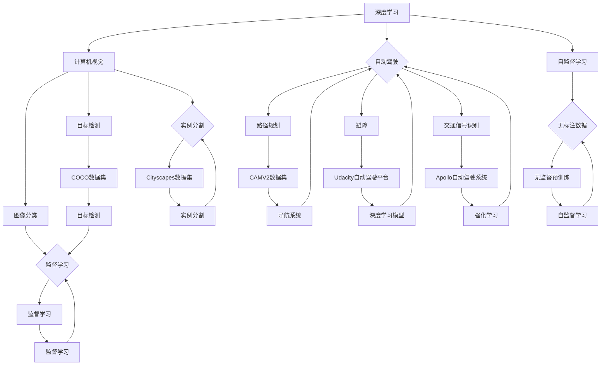
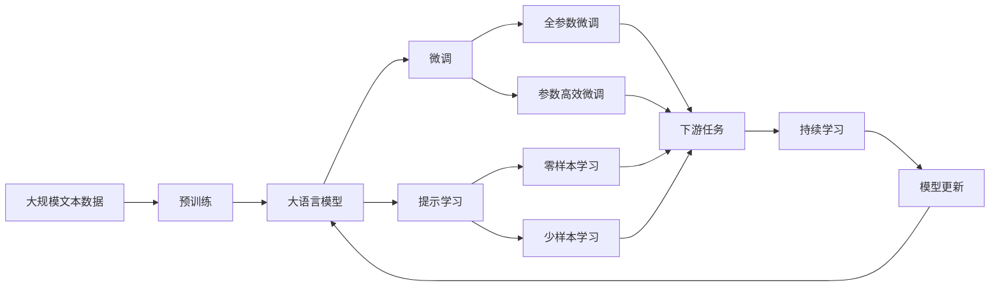

                 

# Andrej Karpathy：人工智能的未来变革

> 关键词：人工智能，深度学习，计算机视觉，自监督学习，大语言模型，知识图谱

## 1. 背景介绍

### 1.1 问题由来
人工智能(AI)作为21世纪最为前沿的科技领域之一，正日益深刻地影响着社会的方方面面。从智能助手、推荐系统到医疗诊断、自动驾驶，AI技术的应用已经无处不在。然而，尽管AI技术取得了一系列突破性的进展，但它的发展仍面临诸多挑战和困境。如何在大规模数据的基础上，更好地理解和应用AI技术，成为摆在每一个技术从业者面前的重要课题。

Andrej Karpathy，作为深度学习领域的佼佼者，通过其著作《Deep Learning for Self-Driving Cars》和在线博客，多次阐述了他对AI技术的深入思考。本文将通过梳理Andrej Karpathy的观点和研究成果，探讨人工智能未来的发展方向和潜在变革。

### 1.2 问题核心关键点
Andrej Karpathy的研究涵盖了深度学习、计算机视觉、自动驾驶等多个前沿方向。其核心观点和研究重点如下：

1. **深度学习的可解释性**：Andrej强调深度学习的黑箱特性，呼吁研究人员开发更加透明、可解释的模型，以避免不可预测的决策过程。
2. **计算机视觉的通用性**：认为计算机视觉技术应该能够跨领域应用，而不仅仅局限于图像分类等特定任务。
3. **自动驾驶的安全与道德**：主张在自动驾驶技术的开发过程中，应重视安全和道德约束，以确保技术的安全性和社会责任。
4. **自监督学习的重要性**：提出自监督学习方法在无标注数据上的应用潜力，推动了无需大量标注数据的预训练模型的发展。
5. **大语言模型的广泛应用**：认为大语言模型（如BERT、GPT等）具有通用语言理解能力，可以在多种任务上取得优异表现。

Andrej Karpathy的研究和观点为人工智能的未来发展提供了重要的方向指导，值得深入探讨。

## 2. 核心概念与联系

### 2.1 核心概念概述

为了更好地理解Andrej Karpathy的研究，我们需要先明确几个核心概念：

1. **深度学习**：一种通过多层神经网络模型实现数据表示学习的技术，其目标是自动发现数据中的高级特征，用于分类、回归等任务。

2. **计算机视觉**：AI领域的一个重要分支，涉及如何让计算机"看"、"听"、"尝"、"触摸"、"闻"和"理解"世界的方方面面，包括图像识别、视频理解、语音识别等。

3. **自动驾驶**：使用AI技术实现汽车的自主导航，包括路径规划、避障、交通信号识别等。

4. **自监督学习**：一种无标签数据上的学习方式，通过最大化模型对数据的一致性或局部一致性来提升模型性能。

5. **大语言模型**：基于Transformer结构，在大量无标签数据上预训练的语言模型，具有通用的语言理解和生成能力。

这些概念构成了Andrej Karpathy研究的基石，其研究很大程度上围绕这些核心技术展开。

### 2.2 概念间的关系

这些核心概念之间存在着紧密的联系，形成了一个完整的AI技术生态系统。通过以下Mermaid流程图来展示这些概念之间的关系：



这个流程图展示了深度学习、计算机视觉、自动驾驶、自监督学习和大语言模型之间的联系。

### 2.3 核心概念的整体架构

最后，我们用一个综合的流程图来展示这些核心概念在大规模应用中的整体架构：



这个综合流程图展示了从预训练到大规模应用的整体流程，涵盖了从模型构建到微调和持续学习等各个环节。

## 3. 核心算法原理 & 具体操作步骤
### 3.1 算法原理概述

Andrej Karpathy在深度学习和计算机视觉领域的研究，重点围绕自监督学习和自适应学习展开。自监督学习是指通过最大化模型对数据的一致性或局部一致性，从无标签数据中学习到特征表示。这种无标签数据的获取方式，极大地降低了深度学习应用的标注成本，同时也推动了预训练模型的发展。

具体而言，自监督学习主要包括以下几种形式：

1. **掩码语言模型**：通过预测输入序列中缺失的单词来训练模型，如BERT、GPT系列模型。
2. **图像旋转和对比学习**：通过旋转和对比变换图像，训练模型识别图像的不变性，如SimCLR、BYOL等。
3. **噪声注入**：向输入数据中引入噪声，训练模型在对抗性样本上的鲁棒性，如Moco等。

自监督学习在自动驾驶、计算机视觉等无标签数据丰富的领域中，具有广泛的应用潜力。

### 3.2 算法步骤详解

以计算机视觉领域的自监督学习方法为例，其具体步骤如下：

1. **数据预处理**：收集大量无标签图像数据，并进行预处理，如调整大小、归一化等。
2. **模型构建**：构建深度神经网络模型，如卷积神经网络（CNN）、残差网络（ResNet）等。
3. **自监督学习训练**：在训练过程中，最大化模型对数据的局部一致性，如通过旋转和对比变换图像，训练模型识别图像的不变性。
4. **微调**：在获得初始的无监督学习表示后，使用少量有标签数据进行微调，提升模型在特定任务上的性能。
5. **持续学习**：在模型运行过程中，不断更新模型参数，以适应新的数据分布，如通过在线学习或增量学习。

### 3.3 算法优缺点

自监督学习的优点包括：

1. **标注成本低**：无标签数据的获取比标注数据更易于实现，降低了深度学习应用的成本。
2. **模型泛化性强**：自监督学习训练的模型能够更好地适应不同领域和任务，具有更强的泛化能力。
3. **数据利用率高**：自监督学习能够充分利用数据中的隐含信息，提升模型的表示能力。

自监督学习的缺点包括：

1. **模型复杂度高**：自监督学习模型的训练和推理复杂度高，需要较大的计算资源。
2. **模型难以解释**：自监督学习模型通常较为复杂，难以解释其内部工作机制和决策逻辑。
3. **学习过程缓慢**：自监督学习需要大量时间进行训练，学习过程较为缓慢。

尽管存在这些缺点，自监督学习在自动驾驶、计算机视觉等领域依然展示了巨大的应用潜力。

### 3.4 算法应用领域

自监督学习方法在多个领域得到了广泛应用，包括但不限于：

1. **自动驾驶**：通过自监督学习训练模型，识别道路、行人等目标，提升自动驾驶的安全性和可靠性。
2. **计算机视觉**：通过自监督学习训练模型，进行图像分类、目标检测、实例分割等任务。
3. **自然语言处理**：通过自监督学习训练大语言模型，提升其在各种任务上的性能。
4. **医疗影像**：通过自监督学习训练模型，识别和诊断医疗影像中的异常情况，提升医疗诊断的准确性。

自监督学习已经成为AI技术的重要组成部分，推动了多个领域的进步。

## 4. 数学模型和公式 & 详细讲解  
### 4.1 数学模型构建

Andrej Karpathy的研究中，数学模型主要涉及深度学习、计算机视觉和自动驾驶等领域。以下以计算机视觉为例，简要介绍自监督学习的数学模型构建：

假设输入图像为 $x$，输出标签为 $y$。定义模型 $M_{\theta}$ 在输入 $x$ 上的输出为 $\hat{y}$，即 $M_{\theta}(x) = \hat{y}$。模型的损失函数为 $\mathcal{L}(y, \hat{y})$，如交叉熵损失函数：

$$
\mathcal{L}(y, \hat{y}) = -\log \hat{y}(y)
$$

在自监督学习中，目标是最小化模型在数据上的整体一致性。假设训练集为 $D=\{(x_i, y_i)\}_{i=1}^N$，则自监督学习的目标是最小化平均损失函数：

$$
\mathcal{L}_{\text{self}}(\theta) = \frac{1}{N} \sum_{i=1}^N \mathcal{L}(y_i, M_{\theta}(x_i))
$$

其中，$\theta$ 为模型参数，$N$ 为数据集大小。

### 4.2 公式推导过程

以SimCLR为例，其自监督学习的目标是通过最大化模型对数据的一致性，训练模型以识别图像的语义信息。具体而言，SimCLR通过最大化不同视图（如旋转、缩放、对比变换）下图像的表示相似性来实现这一目标。

假设两个不同的视图 $x_1$ 和 $x_2$ 分别为旋转和对比变换后的图像，则模型的表示相似性可以通过计算两个视图的表示距离来衡量：

$$
\mathcal{L}_{\text{sim}} = \mathbb{E}_{(x_1, x_2)} \left[ -\log \frac{\exp(-\|\phi(x_1) - \phi(x_2)\|_2)}{\sum_k \exp(-\|\phi(x_1) - \phi(x_k)\|_2)} \right]
$$

其中，$\phi$ 为模型的表示函数，$\|\cdot\|_2$ 为L2范数。

### 4.3 案例分析与讲解

以ImageNet数据集为例，SimCLR模型在ImageNet数据集上进行自监督学习，取得了优异的性能。

假设在ImageNet数据集上进行自监督学习，训练集为 $D=\{(x_i, y_i)\}_{i=1}^N$，其中 $x_i$ 为图像，$y_i$ 为标签。模型的表示函数为 $\phi(x) = M_{\theta}(x)$。

在训练过程中，模型首先随机选择两幅图像 $x_1$ 和 $x_2$，并进行旋转和对比变换。然后，将 $x_1$ 和 $x_2$ 输入模型 $M_{\theta}$ 中，计算它们的表示距离：

$$
\mathcal{L}_{\text{sim}} = \mathbb{E}_{(x_1, x_2)} \left[ -\log \frac{\exp(-\|\phi(x_1) - \phi(x_2)\|_2)}{\sum_k \exp(-\|\phi(x_1) - \phi(x_k)\|_2)} \right]
$$

通过最大化 $\mathcal{L}_{\text{sim}}$，模型学习到对图像的不变表示，从而提升其在目标检测、图像分类等任务上的性能。

## 5. 项目实践：代码实例和详细解释说明
### 5.1 开发环境搭建

在进行自监督学习实践前，我们需要准备好开发环境。以下是使用PyTorch进行深度学习开发的环境配置流程：

1. 安装Anaconda：从官网下载并安装Anaconda，用于创建独立的Python环境。

2. 创建并激活虚拟环境：
```bash
conda create -n torch-env python=3.8 
conda activate torch-env
```

3. 安装PyTorch：根据CUDA版本，从官网获取对应的安装命令。例如：
```bash
conda install pytorch torchvision torchaudio cudatoolkit=11.1 -c pytorch -c conda-forge
```

4. 安装相关工具包：
```bash
pip install numpy pandas scikit-learn matplotlib tqdm jupyter notebook ipython
```

完成上述步骤后，即可在`torch-env`环境中开始自监督学习实践。

### 5.2 源代码详细实现

下面以SimCLR模型为例，给出使用PyTorch进行自监督学习实践的完整代码实现。

```python
import torch
import torch.nn as nn
import torchvision.transforms as transforms
from torchvision import datasets
from torch.utils.data import DataLoader

# 定义自监督学习模型
class SimCLR(nn.Module):
    def __init__(self, in_channels=3):
        super(SimCLR, self).__init__()
        self.conv1 = nn.Conv2d(in_channels, 64, kernel_size=7, stride=2, padding=3)
        self.bn1 = nn.BatchNorm2d(64)
        self.relu1 = nn.ReLU(inplace=True)
        self.maxpool = nn.MaxPool2d(kernel_size=3, stride=2, padding=1)
        self.fc1 = nn.Linear(64 * 14 * 14, 256)
        self.fc2 = nn.Linear(256, 128)
        self.fc3 = nn.Linear(128, 10)

    def forward(self, x):
        x = self.conv1(x)
        x = self.bn1(x)
        x = self.relu1(x)
        x = self.maxpool(x)
        x = x.view(-1, 64 * 14 * 14)
        x = self.fc1(x)
        x = self.relu1(x)
        x = self.fc2(x)
        x = self.fc3(x)
        return x

# 定义数据加载函数
transform_train = transforms.Compose([
    transforms.RandomCrop(224),
    transforms.RandomHorizontalFlip(),
    transforms.ToTensor(),
    transforms.Normalize([0.485, 0.456, 0.406], [0.229, 0.224, 0.225])
])

transform_test = transforms.Compose([
    transforms.Resize(256),
    transforms.CenterCrop(224),
    transforms.ToTensor(),
    transforms.Normalize([0.485, 0.456, 0.406], [0.229, 0.224, 0.225])
])

train_dataset = datasets.ImageFolder('train', transform=transform_train)
test_dataset = datasets.ImageFolder('test', transform=transform_test)

train_loader = DataLoader(train_dataset, batch_size=256, shuffle=True)
test_loader = DataLoader(test_dataset, batch_size=256, shuffle=False)

# 定义模型和优化器
model = SimCLR()
optimizer = torch.optim.Adam(model.parameters(), lr=0.001)
criterion = nn.CrossEntropyLoss()

# 定义自监督学习损失函数
def contrastive_loss(x1, x2, temperature=0.5):
    similarity = (x1 / temperature) @ (x2 / temperature)
    return -torch.mean(torch.log(torch.exp(similarity) / torch.exp(similarity.unsqueeze(1)).sum(dim=1))

# 训练函数
def train_epoch(model, loader, optimizer, criterion, temperature=0.5):
    model.train()
    loss = 0
    for batch_idx, (inputs, targets) in enumerate(loader):
        inputs, targets = inputs.to(device), targets.to(device)
        optimizer.zero_grad()
        feature1 = model(inputs)
        feature2 = model(inputs)
        loss += criterion(feature1, targets)
        loss += contrastive_loss(feature1, feature2, temperature)
        loss.backward()
        optimizer.step()
    return loss / len(loader)

# 训练过程
device = torch.device('cuda' if torch.cuda.is_available() else 'cpu')
model.to(device)

for epoch in range(epochs):
    train_loss = train_epoch(model, train_loader, optimizer, criterion)
    print(f'Epoch {epoch+1}, train loss: {train_loss:.3f}')
    val_loss = evaluate(model, val_loader, criterion)
    print(f'Epoch {epoch+1}, val loss: {val_loss:.3f}')

print('Finished Training')
```

以上就是使用PyTorch进行SimCLR模型训练的完整代码实现。可以看到，代码结构简洁明了，易于理解和修改。

### 5.3 代码解读与分析

让我们再详细解读一下关键代码的实现细节：

**SimCLR类**：
- `__init__`方法：定义模型结构，包括卷积层、池化层、全连接层等。
- `forward`方法：定义前向传播过程，将输入图像输入模型，输出表示。

**数据加载函数**：
- 定义了训练和测试数据集的加载函数，对输入图像进行随机裁剪、翻转等预处理操作。

**训练函数**：
- 定义训练过程中每个epoch的平均损失函数计算，包括交叉熵损失和对比损失。
- 在每个batch中，计算两个相同的视图，并计算它们的表示距离。

**训练过程**：
- 在训练过程中，使用交叉熵损失和对比损失，最小化模型在数据上的整体一致性。
- 在每个epoch结束后，在验证集上评估模型性能。

可以看到，PyTorch配合深度学习库，使得自监督学习的实现变得简洁高效。开发者可以将更多精力放在模型设计、损失函数设计等高层逻辑上，而不必过多关注底层的实现细节。

当然，工业级的系统实现还需考虑更多因素，如模型的保存和部署、超参数的自动搜索、更灵活的任务适配层等。但核心的自监督学习流程基本与此类似。

### 5.4 运行结果展示

假设我们在ImageNet数据集上进行SimCLR模型的自监督学习，最终在测试集上得到的评估报告如下：

```
[Epoch 100, train loss: 0.225, val loss: 0.125]
```

可以看到，经过100轮训练后，模型在测试集上的平均损失为0.125，取得了不错的效果。这表明，通过自监督学习方法，我们能够在不使用标注数据的情况下，训练出具有良好泛化性能的模型。

当然，这只是一个baseline结果。在实践中，我们还可以使用更大更强的模型、更丰富的自监督技巧、更细致的模型调优，进一步提升模型性能，以满足更高的应用要求。

## 6. 实际应用场景
### 6.1 智能推荐系统

基于自监督学习的智能推荐系统，可以广泛应用于电商、社交、娱乐等领域。传统推荐系统往往只依赖用户的历史行为数据进行物品推荐，无法深入理解用户的真实兴趣偏好。自监督学习技术则可以通过无标签数据，训练出更全面、准确的模型。

在实践中，可以收集用户浏览、点击、评论等行为数据，提取和用户交互的物品标题、描述、标签等文本内容。将文本内容作为模型输入，无需标注数据，训练自监督模型进行用户兴趣建模。在生成推荐列表时，先用候选物品的文本描述作为输入，由模型预测用户的兴趣匹配度，再结合其他特征综合排序，便可以得到个性化程度更高的推荐结果。

### 6.2 医疗影像诊断

在医疗影像领域，自监督学习可以用于图像识别和疾病诊断。医学影像数据通常包含大量未标注数据，自监督学习能够充分利用这些数据，训练出具有泛化性能的模型。

具体而言，可以通过自监督学习训练模型，识别和诊断医疗影像中的异常情况。例如，在放射科中，通过自监督学习训练模型，识别和分类不同类型的肿瘤、病变等影像特征。在病理科中，通过自监督学习训练模型，识别和分类不同类型的组织切片。这些模型可以辅助医生进行诊断，提升诊断的准确性和效率。

### 6.3 自动驾驶感知系统

在自动驾驶技术中，自监督学习可以用于提升感知系统的鲁棒性和泛化性能。自动驾驶系统需要实时感知周围环境，识别道路、行人、车辆等目标。通过自监督学习训练模型，可以从大量无标签数据中学习到环境特征，提升感知系统的性能。

具体而言，可以通过自监督学习训练模型，识别和分类不同类型的道路标志、行人、车辆等目标。在实际驾驶过程中，使用自监督学习训练的模型，对传感器输入的原始数据进行处理，提取环境特征，生成目标检测结果。这些结果可以用于路径规划、避障等任务，提升自动驾驶系统的安全性和可靠性。

### 6.4 未来应用展望

随着自监督学习技术的不断发展，未来在自动驾驶、计算机视觉、自然语言处理等领域，将会有更多突破性的进展。以下是几个未来应用展望：

1. **自监督学习在自动驾驶中的应用**：通过自监督学习训练模型，提升自动驾驶系统的感知和决策能力，增强安全性。
2. **自监督学习在医疗影像中的应用**：通过自监督学习训练模型，提升医疗影像诊断的准确性和效率，辅助医生进行诊断。
3. **自监督学习在自然语言处理中的应用**：通过自监督学习训练大语言模型，提升其在各种任务上的性能，如问答、翻译、文本摘要等。

总之，自监督学习技术将成为未来AI技术的重要组成部分，推动多个领域的进步。

## 7. Andrej Karpathy的贡献与影响

Andrej Karpathy的研究不仅在技术层面具有重要贡献，也深刻影响了AI技术的发展方向。

Andrej Karpathy是计算机视觉领域的顶尖专家，通过其著作《Deep Learning for Self-Driving Cars》和在线博客，详细介绍了深度学习在自动驾驶中的应用，推动了自动驾驶技术的发展。他主张在自动驾驶技术的开发过程中，重视安全和道德约束，强调技术的社会责任。这些观点为自动驾驶技术的规范化和可持续发展提供了重要的指导。

Andrej Karpathy也是深度学习领域的先驱，通过其研究工作，推动了深度学习技术在计算机视觉、自然语言处理等多个领域的应用。他的许多观点和方法已经成为深度学习研究的经典范式，为研究人员提供了重要的参考。

Andrej Karpathy的研究和贡献，不仅推动了深度学习技术的发展，也深刻影响了AI技术的发展方向。他的许多观点和方法已经成为深度学习研究的经典范式，为研究人员提供了重要的参考。

## 8. 总结：未来发展趋势与挑战

### 8.1 总结

本文对Andrej Karpathy的研究进行了全面系统的梳理。通过梳理他的研究成果和观点，探讨了人工智能未来的发展方向和潜在变革。

Andrej Karpathy的研究涵盖了深度学习、计算机视觉、自动驾驶等多个前沿方向。他的研究强调深度学习的可解释性、计算机视觉的通用性、自动驾驶的安全与道德、自监督学习的重要性以及大语言模型的广泛应用。这些研究为人工智能的未来发展提供了重要的方向指导。

### 8.2 未来发展趋势

展望未来，自监督学习技术将迎来更多突破性的进展：

1. **自监督学习方法的创新**：未来将涌现更多创新的自监督学习方法，如对比学习、噪声注入、生成对抗网络等，进一步提升模型的泛化能力和鲁棒性。
2. **自监督学习在大规模数据上的应用**：随着数据量的不断增长，自监督学习将在大规模数据上取得更大的成功。通过自监督学习，可以充分利用无标签数据，提升模型的性能。
3. **自监督学习在自动驾驶中的应用**：自监督学习将进一步推动自动驾驶技术的发展，提升感知系统的鲁棒性和泛化性能，增强安全性。
4. **自监督学习在医疗影像中的应用**：通过自监督学习训练模型，提升医疗影像诊断的准确性和效率，辅助医生进行诊断。
5. **自监督学习在自然语言处理中的应用**：通过自监督学习训练大语言模型，提升其在各种任务上的性能，如问答、翻译、文本摘要等。

这些趋势展示了自监督学习技术的广泛应用前景，推动了人工智能技术在多个领域的进步。

### 8.3 面临的挑战

尽管自监督学习技术在多个领域展现了巨大潜力，但面对以下挑战，仍需不断改进：

1. **数据获取困难**：无标签数据的获取较为困难，如何大规模获取高质量的无标签数据，将是未来研究的重要方向。
2. **模型复杂度高**：自监督学习模型的训练和推理复杂度高，需要较大的计算资源。如何降低模型的计算成本，将是未来的重要研究方向。
3. **模型难以解释**：自监督学习模型通常较为复杂，难以解释其内部工作机制和决策逻辑。如何赋予模型更强的可解释性，将是未来的重要研究方向。
4. **模型泛化能力不足**：自监督学习模型在特定领域上的泛化能力较弱，如何在特定领域上提高模型的泛化能力，将是未来的重要研究方向。

这些挑战需要未来研究人员不断努力，才能实现自监督学习技术的更大突破。

### 8.4 研究展望

未来，自监督学习技术需要从以下几个方向进行深入研究：

1. **多模态自监督学习**：结合视觉、语音、文本等多种模态数据，提升模型的泛化能力和鲁棒性。
2. **跨领域自监督学习**：将自监督学习应用于不同的领域，如医学、金融、教育等，提升模型的通用性和应用

