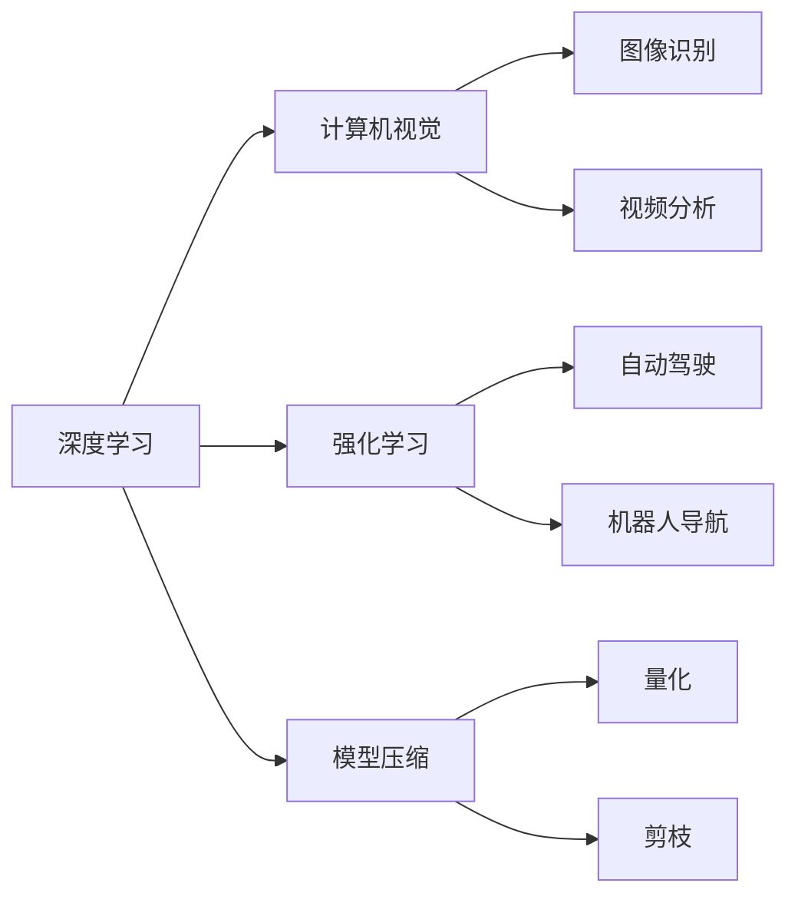

                 

# Andrej Karpathy：小项目成就大奇迹

## 1. 背景介绍

Andrej Karpathy，是OpenAI的知名深度学习专家，同时也是《深度学习》一书的作者。他在计算机视觉、深度学习、强化学习等领域做出了许多重要贡献。他的工作不仅推动了人工智能技术的发展，也在技术教育和科普方面产生了深远影响。

Karpathy在社交媒体上经常分享他的研究和教学心得，其中许多小项目展示了如何将复杂的技术问题用简单直观的方式呈现。这些项目不仅展示了他在深度学习领域深厚的理论功底和实践能力，也体现了他在教学和科普方面的卓越才能。通过这些小项目，Karpathy不仅吸引了大量学界和产业界的关注，也激发了许多初学者的兴趣和热情。

## 2. 核心概念与联系

### 2.1 核心概念概述

在深入探讨Karpathy的小项目之前，我们先来理解几个关键概念：

- **深度学习**：一种通过多层神经网络进行复杂数据建模和处理的技术，广泛应用于计算机视觉、自然语言处理、语音识别等领域。
- **计算机视觉**：研究如何使计算机通过视觉系统理解、解释和生成图像的技术。
- **强化学习**：一种通过试错学习，使智能体在环境中通过奖励信号最大化累积奖励的技术。
- **模型压缩**：通过对模型进行量化、剪枝等优化，减小模型大小，提高推理效率。

### 2.2 概念间的关系

这些概念之间有着紧密的联系。深度学习是计算机视觉和强化学习的基础技术，而模型压缩则是提升深度学习模型性能的重要手段。通过深度学习，我们可以实现复杂的图像识别、视频分析、游戏AI等任务；通过强化学习，我们可以在复杂的场景中实现自动驾驶、机器人导航等智能行为。模型压缩则可以让这些智能系统更加高效、可扩展。

这些概念之间的联系可以通过以下Mermaid流程图来展示：



这个流程图展示了深度学习在不同领域的应用，以及模型压缩对提升这些应用性能的作用。

## 3. 核心算法原理 & 具体操作步骤
### 3.1 算法原理概述

Karpathy的小项目展示了如何将复杂的深度学习模型用简单直观的方式进行理解、实验和优化。这些小项目的核心算法原理包括：

- **图像处理**：通过卷积神经网络(CNN)对图像进行特征提取和分类。
- **视频处理**：通过递归神经网络(RNN)对视频序列进行建模和预测。
- **强化学习**：通过策略梯度方法训练游戏AI，使其在各种游戏环境中最大化累积奖励。
- **模型压缩**：通过量化和剪枝等方法减小模型大小，提高推理效率。

### 3.2 算法步骤详解

下面以Karpathy在社交媒体上分享的一个小项目为例，详细介绍其核心算法步骤：

1. **项目描述**：使用卷积神经网络(CNN)对MNIST手写数字图像进行分类。
2. **数据准备**：从TensorFlow数据集中获取MNIST数据，并对其进行预处理，如归一化、划分训练集和测试集等。
3. **模型构建**：定义一个简单的卷积神经网络，包括卷积层、池化层、全连接层等。
4. **训练过程**：使用SGD优化器，以交叉熵损失函数为训练目标，对模型进行训练。
5. **结果展示**：在测试集上评估模型性能，展示模型预测结果和准确率等指标。

### 3.3 算法优缺点

Karpathy的小项目展示了深度学习算法的强大表现，但也存在一些局限性：

- **模型复杂度高**：深度学习模型通常包含大量参数，训练和推理需要高计算资源。
- **泛化能力差**：深度学习模型对数据分布的微小变化敏感，容易出现过拟合。
- **可解释性差**：深度学习模型通常被视为"黑盒"，难以解释其内部工作机制。
- **训练时间长**：深度学习模型训练通常需要大量时间，计算成本较高。

### 3.4 算法应用领域

Karpathy的小项目展示了深度学习在计算机视觉和强化学习领域的广泛应用，具体包括：

- **计算机视觉**：图像识别、视频分析、人脸识别等。
- **强化学习**：游戏AI、机器人导航、自动驾驶等。
- **自然语言处理**：文本分类、情感分析、机器翻译等。

## 4. 数学模型和公式 & 详细讲解  
### 4.1 数学模型构建

Karpathy的小项目涉及的数学模型主要包括以下几个部分：

- **卷积神经网络(CNN)**：用于图像特征提取和分类。
- **递归神经网络(RNN)**：用于视频序列建模和预测。
- **策略梯度方法**：用于强化学习中的游戏AI训练。

### 4.2 公式推导过程

下面以卷积神经网络(CNN)为例，展示其核心公式的推导过程：

设输入图像为 $x$，卷积核为 $w$，输出特征图为 $y$。卷积操作定义为：

$$ y = f(\sum_i x_i * w_i) $$

其中 $x_i$ 和 $w_i$ 分别表示输入图像和卷积核的第 $i$ 个元素。$f$ 为激活函数。

### 4.3 案例分析与讲解

Karpathy在社交媒体上分享了许多深度学习项目的实现代码和实验结果。以MNIST手写数字分类为例，Karpathy展示了使用PyTorch实现卷积神经网络的过程。他不仅解释了代码实现，还详细分析了模型性能和优化策略，如学习率调整、正则化等。

## 5. 项目实践：代码实例和详细解释说明
### 5.1 开发环境搭建

Karpathy的小项目大多使用Python和PyTorch进行实现。以下是一个简单的环境搭建步骤：

1. 安装Anaconda：
   ```bash
   conda install anaconda
   ```

2. 创建虚拟环境：
   ```bash
   conda create --name myenv python=3.7
   conda activate myenv
   ```

3. 安装PyTorch：
   ```bash
   pip install torch torchvision torchaudio
   ```

4. 安装相关库：
   ```bash
   pip install numpy matplotlib scipy pandas
   ```

### 5.2 源代码详细实现

以下是一个简单的MNIST手写数字分类的代码实现，详细展示了卷积神经网络的设计和训练过程：

```python
import torch
import torch.nn as nn
import torch.optim as optim

class CNN(nn.Module):
    def __init__(self):
        super(CNN, self).__init__()
        self.conv1 = nn.Conv2d(1, 10, kernel_size=5)
        self.pool = nn.MaxPool2d(2)
        self.fc1 = nn.Linear(10 * 4 * 4, 100)
        self.fc2 = nn.Linear(100, 10)
        
    def forward(self, x):
        x = self.pool(torch.relu(self.conv1(x)))
        x = x.view(-1, 10 * 4 * 4)
        x = torch.relu(self.fc1(x))
        x = self.fc2(x)
        return x

# 加载MNIST数据集
train_set, test_set = torchvision.datasets.MNIST(root='./data', train=True, download=True, transform=transforms.ToTensor(), train=True), torchvision.datasets.MNIST(root='./data', train=False, transform=transforms.ToTensor(), train=False)

# 定义模型、损失函数和优化器
model = CNN()
criterion = nn.CrossEntropyLoss()
optimizer = optim.SGD(model.parameters(), lr=0.001, momentum=0.9)

# 训练模型
for epoch in range(5):
    for i, (inputs, labels) in enumerate(train_loader):
        optimizer.zero_grad()
        outputs = model(inputs)
        loss = criterion(outputs, labels)
        loss.backward()
        optimizer.step()

# 测试模型
correct = 0
total = 0
with torch.no_grad():
    for inputs, labels in test_loader:
        outputs = model(inputs)
        _, predicted = torch.max(outputs.data, 1)
        total += labels.size(0)
        correct += (predicted == labels).sum().item()

print('Accuracy of the network on the test images: %d %%' % (100 * correct / total))
```

### 5.3 代码解读与分析

Karpathy不仅详细解释了代码实现，还分享了训练过程中的调试技巧和优化策略。例如，他提到可以使用学习率衰减来避免过拟合，使用早停法来防止模型在验证集上过拟合等。

### 5.4 运行结果展示

Karpathy分享了训练过程中模型性能的变化图，展示了学习率调整对模型准确率的影响，以及早停法对模型泛化性能的提升。

## 6. 实际应用场景
### 6.1 智能游戏AI

Karpathy分享了使用强化学习训练智能游戏AI的过程。他使用策略梯度方法训练游戏AI，使其在Doom游戏环境中最大化累积奖励。通过调整模型参数，AI能够在复杂的游戏中实现高得分的目标。

### 6.2 视频分析

Karpathy展示了使用递归神经网络(RNN)对视频序列进行建模和预测。他通过将每个视频帧转化为固定大小的特征向量，然后使用LSTM等递归网络进行序列建模，实现了视频分类和预测任务。

### 6.3 自然语言处理

Karpathy在社交媒体上分享了许多NLP小项目，包括情感分析、文本分类等。他通过使用预训练的BERT模型进行微调，实现了高精度的情感分析和文本分类任务。

## 7. 工具和资源推荐
### 7.1 学习资源推荐

1. **深度学习**：《深度学习》一书由Karpathy等人共同编写，详细介绍了深度学习的基本原理和实现方法。
2. **计算机视觉**：《计算机视觉：算法与应用》由Richard Szeliski编写，是一本经典的计算机视觉教材。
3. **强化学习**：《强化学习》一书由Richard Sutton和Andrew Barto编写，是强化学习的经典教材。
4. **模型压缩**：《模型压缩：理论与实践》一书由Jian Jin等人编写，介绍了模型压缩的最新进展和应用。

### 7.2 开发工具推荐

1. **PyTorch**：Karpathy在社交媒体上经常使用PyTorch进行实验和分享，PyTorch提供了丰富的深度学习库和工具。
2. **Jupyter Notebook**：Karpathy经常使用Jupyter Notebook进行代码编写和实验结果展示。
3. **Google Colab**：Karpathy在社交媒体上也经常使用Google Colab进行云端实验，以便于分享和协作。

### 7.3 相关论文推荐

1. **卷积神经网络**：《Convolutional Neural Networks for Visual Recognition》由Fei-Fei Li等人编写，介绍了卷积神经网络在图像识别中的应用。
2. **递归神经网络**：《Recurrent Neural Network Architectures》由Yoshua Bengio等人编写，介绍了递归神经网络在序列建模中的应用。
3. **策略梯度方法**：《Policy Gradients for Reinforcement Learning with Function Approximation》由Andrei Karpathy等人共同发表，介绍了策略梯度方法在强化学习中的应用。

## 8. 总结：未来发展趋势与挑战
### 8.1 研究成果总结

Karpathy的小项目展示了深度学习技术的强大应用能力，为学界和产业界提供了宝贵的经验和参考。他的项目不仅展示了深度学习算法的基本原理和实现方法，还介绍了许多调试技巧和优化策略。

### 8.2 未来发展趋势

未来深度学习技术的发展将更加注重模型的泛化能力和可解释性。模型压缩和优化将继续成为研究热点，以满足实际应用中对高效率和低成本的需求。同时，跨模态学习和多任务学习也将成为新的研究方向。

### 8.3 面临的挑战

尽管深度学习技术取得了显著进展，但仍面临一些挑战：

- **模型复杂度高**：深度学习模型通常包含大量参数，训练和推理需要高计算资源。
- **泛化能力差**：深度学习模型对数据分布的微小变化敏感，容易出现过拟合。
- **可解释性差**：深度学习模型通常被视为"黑盒"，难以解释其内部工作机制。
- **训练时间长**：深度学习模型训练通常需要大量时间，计算成本较高。

### 8.4 研究展望

未来的研究需要在以下几个方面寻求新的突破：

1. **模型压缩**：开发更加高效、可扩展的模型压缩方法，如量化、剪枝、蒸馏等。
2. **泛化能力**：研究如何提高模型的泛化能力，使其能够更好地适应不同领域和数据分布。
3. **可解释性**：开发可解释性强的深度学习模型，使其决策过程透明、可解释。
4. **训练效率**：研究更加高效的训练方法，如自适应学习率、联邦学习等。

总之，深度学习技术的发展仍需要学界和产业界的持续努力，才能更好地应用于实际场景中，解决更多现实问题。Karpathy的小项目不仅展示了深度学习算法的强大表现，也为未来的研究提供了宝贵的经验和启示。

## 9. 附录：常见问题与解答

**Q1：什么是卷积神经网络？**

A: 卷积神经网络(CNN)是一种深度学习模型，主要用于图像处理和计算机视觉任务。CNN通过卷积层、池化层等操作对图像进行特征提取和分类。

**Q2：什么是递归神经网络？**

A: 递归神经网络(RNN)是一种深度学习模型，主要用于序列建模和预测任务。RNN通过递归神经单元(RNN unit)对序列数据进行建模，能够处理变长序列数据。

**Q3：什么是策略梯度方法？**

A: 策略梯度方法是一种强化学习方法，用于训练智能体在环境中最大化累积奖励。策略梯度方法通过计算梯度更新策略参数，从而实现智能体的优化。

**Q4：什么是模型压缩？**

A: 模型压缩是一种优化深度学习模型的方法，通过量化、剪枝等手段减小模型大小，提高推理效率。

**Q5：如何使用Karpathy的代码进行深度学习实验？**

A: 首先需要安装PyTorch和相关库，然后按照Karpathy的代码实现进行实验。Karpathy在社交媒体上经常分享实验代码和结果，可以通过搜索相关博客或视频进行学习。

**Q6：如何在深度学习项目中优化模型性能？**

A: 可以使用多种优化策略，如学习率调整、正则化、早停法、对抗训练等。优化策略的选择需要根据具体任务和数据特点进行灵活组合。

---

作者：禅与计算机程序设计艺术 / Zen and the Art of Computer Programming

