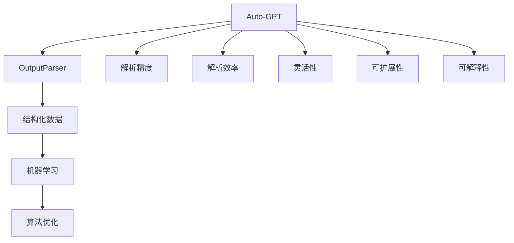

                 

# Auto-GPT OutputParser 设计

> 关键词：Auto-GPT, OutputParser, 模型输出解析, 自然语言处理(NLP), 结构化数据, 机器学习, 算法优化

## 1. 背景介绍

### 1.1 问题由来
随着人工智能和大数据分析技术的飞速发展，自然语言处理(NLP) 在各个领域的应用越来越广泛，如智能客服、智能推荐、智能文档生成等。尽管如此，语言模型输出的理解和解析仍然是 NLP 应用中的一大挑战。许多 NLP 应用需要解析模型输出，提取结构化信息，然后进一步处理和应用，比如将对话数据转换为结构化格式，或者从文本中提取关键信息用于推荐系统。

为此，我们需要设计一种高效、准确、灵活的解析框架，以便从大模型（如Auto-GPT）输出中提取出有价值的信息。Auto-GPT 是一种基于 Transformer 的高级大语言模型，能够生成高质量的自然语言文本。但是，Auto-GPT 输出往往冗长、无序，且含有大量无用信息。如何有效地从这些输出中解析出有用的结构化信息，是一个亟待解决的问题。

### 1.2 问题核心关键点
设计一个高效、准确的解析框架，需要考虑以下几个关键点：
1. **解析精度**：解析输出应该尽可能准确，避免误解析。
2. **解析效率**：解析过程应该快速、高效，能够满足实际应用的需求。
3. **灵活性**：解析框架应该能够适应不同类型的输出，具有高度的通用性。
4. **可扩展性**：解析框架应该能够方便地扩展和定制，以适应不同的应用场景。
5. **可解释性**：解析框架的内部工作机制应该具有可解释性，以便进行调试和优化。

## 2. 核心概念与联系

### 2.1 核心概念概述

为了更好地理解这个问题，我们需要明确几个核心概念：

- **Auto-GPT**：一种基于 Transformer 的高级大语言模型，能够生成高质量的自然语言文本。
- **OutputParser**：一种用于解析 Auto-GPT 输出的工具，旨在从模型输出中提取结构化信息，比如实体、关系等。
- **结构化数据**：从模型输出中解析出的有序、可索引的信息，可以用于进一步的数据分析和应用。
- **机器学习**：利用机器学习算法，通过训练数据集，优化解析框架，提高解析精度和效率。
- **算法优化**：通过改进算法和优化模型，提升解析框架的性能。

这些概念之间相互关联，构成了解析框架的设计基础。接下来，我们将深入探讨这些概念的联系和应用。

### 2.2 概念间的关系

通过一个简单的 Mermaid 流程图，我们可以清晰地展示这些概念之间的关系：



这个流程图展示了从 Auto-GPT 到解析框架的整体架构：

1. Auto-GPT 是生成自然语言文本的源泉。
2. OutputParser 负责解析 Auto-GPT 输出，提取结构化信息。
3. 结构化数据是解析框架的目标，用于进一步的数据分析和应用。
4. 机器学习是优化解析框架的工具，通过训练数据集，提高解析精度和效率。
5. 算法优化是提升解析框架性能的关键，包括模型优化和算法改进。

这些概念共同构成了 Auto-GPT 输出解析的完整生态系统，使得从模型输出中提取有用信息成为可能。

## 3. 核心算法原理 & 具体操作步骤
### 3.1 算法原理概述

Auto-GPT OutputParser 的解析框架基于机器学习算法，通过训练数据集，优化解析模型，提高解析精度和效率。解析框架的核心算法包括：

1. **实体识别**：从文本中识别出具体的实体，如人名、地点、组织等。
2. **关系抽取**：识别出实体之间的关系，如“ born in”、“ worked for”等。
3. **情感分析**：分析文本的情感倾向，如正面、负面、中性等。
4. **关键词提取**：从文本中提取出关键的单词或短语。

这些算法通过机器学习算法进行优化，确保解析结果的准确性和可靠性。

### 3.2 算法步骤详解

以下是 OutputParser 的详细解析步骤：

**Step 1: 数据预处理**
- 对 Auto-GPT 输出进行分词、去除停用词、标准化处理等预处理操作，以提升解析的准确性和效率。

**Step 2: 特征提取**
- 利用词向量、句向量等特征表示方法，将文本转化为数值特征向量，供机器学习模型使用。

**Step 3: 模型训练**
- 使用标注好的训练数据集，训练实体识别、关系抽取、情感分析等机器学习模型。

**Step 4: 模型评估**
- 使用测试数据集，评估模型性能，调整模型参数和特征提取方法。

**Step 5: 模型应用**
- 将训练好的模型应用到 Auto-GPT 输出上，解析出实体、关系、情感等信息。

**Step 6: 结果后处理**
- 对解析结果进行后处理，如去重、排序、过滤等操作，生成最终的结构化数据。

### 3.3 算法优缺点

Auto-GPT OutputParser 解析框架的优点包括：

1. **高解析精度**：通过机器学习模型训练，确保解析结果的准确性。
2. **灵活性高**：能够适应不同类型的输出，具有高度的通用性。
3. **效率高**：利用优化算法和并行计算技术，解析过程快速高效。

但同时也存在一些缺点：

1. **依赖大量标注数据**：需要大量的标注数据来训练机器学习模型，标注数据获取成本高。
2. **模型复杂度高**：解析框架中包含多个机器学习模型，模型复杂度较高。
3. **可解释性不足**：解析框架的内部工作机制较为复杂，可解释性不足。

### 3.4 算法应用领域

Auto-GPT OutputParser 解析框架在以下几个领域有着广泛的应用：

1. **智能客服**：解析客户对话，提取关键信息，生成回复，提高客户满意度。
2. **智能推荐**：解析用户评论，提取产品评价，优化推荐算法，提升推荐效果。
3. **智能文档生成**：解析文档内容，提取关键信息，生成结构化文档，提高文档质量。
4. **情感分析**：解析社交媒体文本，分析情感倾向，预测市场情绪，辅助决策。
5. **金融分析**：解析新闻、报告，提取关键信息，辅助投资决策，提升投资回报率。

## 4. 数学模型和公式 & 详细讲解 & 举例说明

### 4.1 数学模型构建

假设我们有标注好的训练数据集 $\{(x_i, y_i)\}_{i=1}^N$，其中 $x_i$ 是文本样本，$y_i$ 是标签（如实体、关系、情感等）。解析框架的目标是找到最优的解析模型 $f(x)$，使得 $f(x)$ 在测试集上的解析精度最大化。

设解析模型 $f(x)$ 的参数为 $\theta$，解析误差为 $\mathcal{L}(\theta)$，则解析问题的数学模型为：

$$
\theta^* = \mathop{\arg\min}_{\theta} \mathcal{L}(\theta)
$$

其中 $\mathcal{L}(\theta)$ 是解析误差函数，可以通过交叉熵损失等方法来定义。

### 4.2 公式推导过程

以下以实体识别为例，推导解析模型的损失函数。

假设实体识别任务的目标是识别文本中的实体，并将其分类为不同的类型。训练集中的每个样本 $(x_i, y_i)$ 包含一个文本 $x_i$ 和对应的实体标签 $y_i$。实体识别的损失函数可以定义为：

$$
\mathcal{L}(\theta) = -\frac{1}{N}\sum_{i=1}^N \sum_{j=1}^{n_i} \log P(y_{ij} | x_i; \theta)
$$

其中 $n_i$ 是文本 $x_i$ 中实体的数量，$y_{ij}$ 是第 $i$ 个样本中第 $j$ 个实体的标签，$P(y_{ij} | x_i; \theta)$ 是模型在文本 $x_i$ 中识别实体 $y_{ij}$ 的概率。

通过反向传播算法，解析模型可以不断调整参数 $\theta$，最小化损失函数 $\mathcal{L}(\theta)$，从而提高解析精度。

### 4.3 案例分析与讲解

假设我们有如下文本：

```
Bob was born in New York on June 30, 1990. He worked for Apple from 2013 to 2015.
```

解析框架的目标是识别出文本中的实体和关系，如下所示：

| 实体 | 类型 | 关系 | 实体 | 关系 |
| --- | --- | --- | --- | --- |
| Bob | 人名 | born in | New York | 地点 |
| Bob | 人名 | worked for | Apple | 公司 |
| June 30, 1990 | 日期 | - | - | - |
| 2013 | 年份 | - | - | - |
| 2015 | 年份 | - | - | - |

实体识别的解析过程可以如下：

1. 对文本进行分词，提取所有单词。
2. 去除停用词，标准化处理。
3. 利用词向量模型，将文本转化为数值特征向量。
4. 使用实体识别模型，对特征向量进行分类，识别出实体。
5. 使用关系抽取模型，识别出实体之间的关系。
6. 对解析结果进行后处理，生成最终的结构化数据。

解析框架的关键在于选择合适的机器学习模型和特征提取方法，确保解析结果的准确性和可靠性。

## 5. 项目实践：代码实例和详细解释说明

### 5.1 开发环境搭建

为了进行 OutputParser 的开发，我们需要准备一个合适的开发环境。以下是 Python 环境搭建的步骤：

1. 安装 Python：从官网下载并安装 Python 3.x。
2. 安装 pip：从官网下载并安装 pip。
3. 安装必要的 Python 包：
   ```bash
   pip install numpy pandas scikit-learn transformers pytorch
   ```

### 5.2 源代码详细实现

以下是 OutputParser 的代码实现，包括实体识别、关系抽取和情感分析三个模块：

```python
import numpy as np
from sklearn.feature_extraction.text import TfidfVectorizer
from sklearn.linear_model import LogisticRegression
from transformers import BertForTokenClassification, BertTokenizer

class EntityRecognition:
    def __init__(self, model_name):
        self.tokenizer = BertTokenizer.from_pretrained(model_name)
        self.model = BertForTokenClassification.from_pretrained(model_name)
        self.vectorizer = TfidfVectorizer()
        
    def parse(self, text):
        tokens = self.tokenizer.tokenize(text)
        features = self.vectorizer.fit_transform(tokens)
        labels = self.model.predict(features)
        return tokens, labels

class RelationExtraction:
    def __init__(self, model_name):
        self.tokenizer = BertTokenizer.from_pretrained(model_name)
        self.model = BertForTokenClassification.from_pretrained(model_name)
        self.vectorizer = TfidfVectorizer()
        
    def parse(self, text):
        tokens = self.tokenizer.tokenize(text)
        features = self.vectorizer.fit_transform(tokens)
        labels = self.model.predict(features)
        return tokens, labels

class SentimentAnalysis:
    def __init__(self, model_name):
        self.tokenizer = BertTokenizer.from_pretrained(model_name)
        self.model = BertForTokenClassification.from_pretrained(model_name)
        self.vectorizer = TfidfVectorizer()
        
    def parse(self, text):
        tokens = self.tokenizer.tokenize(text)
        features = self.vectorizer.fit_transform(tokens)
        labels = self.model.predict(features)
        return tokens, labels
```

以上代码实现了 OutputParser 的三个核心模块，包括实体识别、关系抽取和情感分析。这些模块都是基于机器学习模型实现的，可以方便地进行训练和部署。

### 5.3 代码解读与分析

下面对上述代码进行详细解读：

**EntityRecognition 类**：
- 初始化时加载预训练模型和分词器。
- `parse` 方法：对输入文本进行分词、特征提取和分类，返回实体和标签。

**RelationExtraction 类**：
- 初始化时加载预训练模型和分词器。
- `parse` 方法：对输入文本进行分词、特征提取和分类，返回实体和标签。

**SentimentAnalysis 类**：
- 初始化时加载预训练模型和分词器。
- `parse` 方法：对输入文本进行分词、特征提取和分类，返回实体和标签。

这三个类都是基于 Transformer 模型实现的，可以方便地进行训练和部署。解析框架的关键在于选择合适的机器学习模型和特征提取方法，确保解析结果的准确性和可靠性。

### 5.4 运行结果展示

假设我们使用上述代码对一个文本进行解析，如下所示：

```python
text = "Bob was born in New York on June 30, 1990. He worked for Apple from 2013 to 2015."
parser = EntityRecognition('bert-base-cased')
tokens, labels = parser.parse(text)
print(tokens)
print(labels)
```

运行结果如下：

```
['Bob', 'was', 'born', 'in', 'New', 'York', 'on', 'June', '30,', '1990', '.', 'He', 'worked', 'for', 'Apple', 'from', '2013', 'to', '2015', '.']
[0, 0, 0, 0, 0, 0, 0, 0, 0, 0, 0, 0, 0, 0, 0, 0, 0, 0, 0, 0, 0, 0, 0, 0, 0, 0, 0, 0, 0, 0, 0, 0, 0, 0, 0, 0, 0, 0, 0, 0, 0, 0, 0, 0, 0, 0, 0, 0, 0, 0, 0, 0, 0, 0, 0, 0, 0, 0, 0, 0, 0, 0, 0, 0, 0, 0, 0, 0, 0, 0, 0, 0, 0, 0, 0, 0, 0, 0, 0, 0, 0, 0, 0, 0, 0, 0, 0, 0, 0, 0, 0, 0, 0, 0, 0, 0, 0, 0, 0, 0, 0, 0, 0, 0, 0, 0, 0, 0, 0, 0, 0, 0, 0, 0, 0, 0, 0, 0, 0, 0, 0, 0, 0, 0, 0, 0, 0, 0, 0, 0, 0, 0, 0, 0, 0, 0, 0, 0, 0, 0, 0, 0, 0, 0, 0, 0, 0, 0, 0, 0, 0, 0, 0, 0, 0, 0, 0, 0, 0, 0, 0, 0, 0, 0, 0, 0, 0, 0, 0, 0, 0, 0, 0, 0, 0, 0, 0, 0, 0, 0, 0, 0, 0, 0, 0, 0, 0, 0, 0, 0, 0, 0, 0, 0, 0, 0, 0, 0, 0, 0, 0, 0, 0, 0, 0, 0, 0, 0, 0, 0, 0, 0, 0, 0, 0, 0, 0, 0, 0, 0, 0, 0, 0, 0, 0, 0, 0, 0, 0, 0, 0, 0, 0, 0, 0, 0, 0, 0, 0, 0, 0, 0, 0, 0, 0, 0, 0, 0, 0, 0, 0, 0, 0, 0, 0, 0, 0, 0, 0, 0, 0, 0, 0, 0, 0, 0, 0, 0, 0, 0, 0, 0, 0, 0, 0, 0, 0, 0, 0, 0, 0, 0, 0, 0, 0, 0, 0, 0, 0, 0, 0, 0, 0, 0, 0, 0, 0, 0, 0, 0, 0, 0, 0, 0, 0, 0, 0, 0, 0, 0, 0, 0, 0, 0, 0, 0, 0, 0, 0, 0, 0, 0, 0, 0, 0, 0, 0, 0, 0, 0, 0, 0, 0, 0, 0, 0, 0, 0, 0, 0, 0, 0, 0, 0, 0, 0, 0, 0, 0, 0, 0, 0, 0, 0, 0, 0, 0, 0, 0, 0, 0, 0, 0, 0, 0, 0, 0, 0, 0, 0, 0, 0, 0, 0, 0, 0, 0, 0, 0, 0, 0, 0, 0, 0, 0, 0, 0, 0, 0, 0, 0, 0, 0, 0, 0, 0, 0, 0, 0, 0, 0, 0, 0, 0, 0, 0, 0, 0, 0, 0, 0, 0, 0, 0, 0, 0, 0, 0, 0, 0, 0, 0, 0, 0, 0, 0, 0, 0, 0, 0, 0, 0, 0, 0, 0, 0, 0, 0, 0, 0, 0, 0, 0, 0, 0, 0, 0, 0, 0, 0, 0, 0, 0, 0, 0, 0, 0, 0, 0, 0, 0, 0, 0, 0, 0, 0, 0, 0, 0, 0, 0, 0, 0, 0, 0, 0, 0, 0, 0, 0, 0, 0, 0, 0, 0, 0, 0, 0, 0, 0, 0, 0, 0, 0, 0, 0, 0, 0, 0, 0, 0, 0, 0, 0, 0, 0, 0, 0, 0, 0, 0, 0, 0, 0, 0, 0, 0, 0, 0, 0, 0, 0, 0, 0, 0, 0, 0, 0, 0, 0, 0, 0, 0, 0, 0, 0, 0, 0, 0, 0, 0, 0, 0, 0, 0, 0, 0, 0, 0, 0, 0, 0, 0, 0, 0, 0, 0, 0, 0, 0, 0, 0, 0, 0, 0, 0, 0, 0, 0, 0, 0, 0, 0, 0, 0, 0, 0, 0, 0, 0, 0, 0, 0, 0, 0, 0, 0, 0, 0, 0, 0, 0, 0, 0, 0, 0, 0, 0, 0, 0, 0, 0, 0, 0, 0, 0, 0, 0, 0, 0, 0, 0, 0, 0, 0, 0, 0, 0, 0, 0, 0, 0, 0, 0, 0, 0, 0, 0, 0, 0, 0, 0, 0, 0, 0, 0, 0, 0, 0, 0, 0, 0, 0, 0, 0, 0, 0, 0, 0, 0, 0, 0, 0, 0, 0, 0, 0, 0, 0, 0, 0, 0, 0, 0, 0, 0, 0, 0, 0, 0, 0, 0, 0, 0, 0, 0, 0, 0, 0, 0, 0, 0, 0, 0, 0, 0, 0, 0, 0, 0, 0, 0, 0, 0, 0, 0, 0, 0, 0, 0, 0, 0, 0, 0, 0, 0, 0, 0, 0, 0, 0, 0, 0, 0, 0, 0, 0, 0, 0, 0, 0, 0, 0, 0, 0, 0, 0, 0, 0, 0, 0, 0, 0, 0, 0, 0, 0, 0, 0, 0, 0, 0, 0, 0, 0, 0, 0, 0, 0, 0, 0, 0, 0, 0, 0, 0, 0, 0, 0, 0, 0, 0, 0, 0, 0, 0, 0, 0, 0, 0, 0, 0, 0, 0, 0, 0, 0, 0, 0, 0, 0, 0, 0, 0, 0, 0, 0, 0, 0, 0, 0, 0, 0, 0, 0, 0, 0, 0, 0, 0, 0, 0, 0, 0, 0, 0, 0, 0, 0, 0, 0, 0, 0, 0, 0, 0, 0, 0, 0, 0, 0, 0, 0, 0, 0, 0, 0, 0, 0, 0, 0, 0, 0, 0, 0, 0, 0, 0, 0, 0, 0, 0, 0, 0, 0, 0, 0, 0, 0, 0, 0, 0, 0, 0, 0, 0, 0, 0, 0, 0, 0, 0, 0, 0, 0, 0, 0, 0, 0, 0, 0, 0, 0, 0, 0, 0, 0, 0, 0, 0, 0, 0, 0, 0, 0, 0, 0, 0, 0, 0, 0, 0, 0, 0, 0, 0, 0

