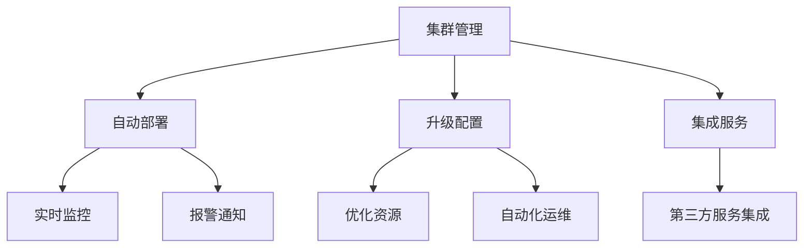

                 

# Cloudera Manager原理与代码实例讲解

> 关键词：Cloudera Manager, 集群管理, Hadoop, Hive, Spark, 集群健康, 资源优化, 自动化运维

## 1. 背景介绍

在当前的大数据生态系统中，Hadoop 和 Spark 等分布式计算框架的集群管理是一个至关重要的环节。传统的基于人工操作的集群管理方式不仅效率低下，而且容易出现人为错误，无法满足日益增长的业务需求。为了解决这个问题，Cloudera 开发了 Cloudera Manager，一个集成的、基于 Web 界面的集群管理平台，能够实现自动化的运维、监控和管理，极大地提升了大数据集群的部署、管理和运维效率。

本博客将详细讲解 Cloudera Manager 的基本原理和核心功能，并通过代码实例展示如何在其上部署和管理一个 Hadoop 集群。

## 2. 核心概念与联系

### 2.1 核心概念概述

Cloudera Manager 是一个用于 Hadoop 集群的自动化运维、监控和管理平台，支持 Hadoop、Spark、Hive 等多个大数据组件。其主要功能包括：

- 集群管理：自动化部署、升级和配置管理，支持跨数据中心的集群管理。
- 监控和报警：实时监控集群健康状况，自动生成报警通知。
- 资源优化：基于业务需求优化集群资源分配，提升性能和成本效益。
- 自动化运维：通过模板和流程自动化运维操作，降低人为错误。
- 集成服务：集成其他第三方服务，如 Nagios、Chef、Puppet 等，丰富运维工具链。

### 2.2 核心概念的关系

Cloudera Manager 的核心概念之间的联系可以用以下 Mermaid 图表示：



这个图展示了 Cloudera Manager 的各个功能模块及其相互关系。集群管理是核心，通过自动部署和升级配置管理确保集群正常运行；实时监控和报警通知提供集群状态的实时反馈；资源优化和自动化运维提升集群的性能和可管理性；集成服务则通过集成第三方服务，扩展运维工具链。

## 3. 核心算法原理 & 具体操作步骤

### 3.1 算法原理概述

Cloudera Manager 的集群管理基于 REST API 和模板引擎（如 Jinja2、FreeMarker）。其基本原理是通过 REST API 与集群通信，获取集群状态信息，然后利用模板引擎生成管理命令或配置文件，执行相应的运维操作。其核心算法主要包括：

- 集群监控：实时监控集群健康状态，包括 CPU、内存、磁盘、网络等资源使用情况。
- 自动部署：根据配置模板生成集群配置文件，自动部署集群。
- 升级配置：自动检测版本差异，生成升级命令，执行配置更新。
- 资源优化：基于业务需求优化资源分配，实现负载均衡。
- 自动化运维：通过模板引擎生成自动化运维脚本，执行日常运维任务。

### 3.2 算法步骤详解

Cloudera Manager 的集群管理流程如下：

1. **集群监控**：实时获取集群状态信息，判断集群健康状况。
2. **自动部署**：根据配置模板生成集群配置文件，自动部署集群。
3. **升级配置**：自动检测版本差异，生成升级命令，执行配置更新。
4. **资源优化**：基于业务需求优化资源分配，实现负载均衡。
5. **自动化运维**：通过模板引擎生成自动化运维脚本，执行日常运维任务。

下面以 Hadoop 集群部署为例，详细说明 Cloudera Manager 的具体操作步骤。

### 3.3 算法优缺点

Cloudera Manager 的优点包括：

- 自动化程度高：自动部署、升级和配置管理，减少人为错误。
- 实时监控：实时监控集群状态，及时发现和解决问题。
- 资源优化：自动优化资源分配，提升性能和成本效益。
- 自动化运维：通过模板引擎生成自动化运维脚本，提升运维效率。

但其缺点也显而易见：

- 依赖特定工具：需要依赖 Cloudera Manager 平台和相关工具链。
- 学习成本高：需要掌握复杂的配置和管理流程。
- 扩展性有限：对于大规模集群管理，可能需要多个 Cloudera Manager 实例。

### 3.4 算法应用领域

Cloudera Manager 广泛应用于各种规模的大数据集群管理，包括：

- 云计算环境：如 AWS、Azure、Google Cloud 等，实现自动化的集群部署和运维。
- 企业内部网络：实现跨数据中心的集群管理，提升数据安全性和可靠性。
- 大数据应用：支持 Hadoop、Spark、Hive 等多个大数据组件，满足不同业务需求。
- 第三方服务：集成 Nagios、Chef、Puppet 等第三方服务，丰富运维工具链。

## 4. 数学模型和公式 & 详细讲解 & 举例说明

### 4.1 数学模型构建

Cloudera Manager 的集群管理模型可以抽象为以下数学模型：

- 状态监控模型：实时获取集群状态信息，判断集群健康状况。
- 配置管理模型：根据配置模板生成集群配置文件。
- 资源优化模型：基于业务需求优化资源分配。
- 自动化运维模型：通过模板引擎生成自动化运维脚本。

### 4.2 公式推导过程

以 Hadoop 集群配置管理为例，假设有一个 Hadoop 集群的配置模板 `hadoop-cluster.xml`，可以表示为：

```xml
<cluster name="my-cluster">
  <config name="core-site.xml" src="path/to/core-site.xml"/>
  <config name="hdfs-site.xml" src="path/to/hdfs-site.xml"/>
  <config name="yarn-site.xml" src="path/to/yarn-site.xml"/>
</cluster>
```

Cloudera Manager 根据配置模板生成集群配置文件的过程如下：

1. 解析配置模板：将 `hadoop-cluster.xml` 模板解析为 Python 或 Jinja2 模板对象。
2. 替换变量：根据集群状态信息，替换模板中的变量，如集群名称、配置文件路径等。
3. 生成配置文件：将替换后的模板转换为实际的配置文件，如 `hadoop-cluster-1.xml`、`hadoop-cluster-2.xml` 等。

具体实现如下：

```python
# 解析配置模板
template = Jinja2.Template(open('hadoop-cluster.xml').read())

# 替换变量
cluster_name = 'my-cluster'
path_to_core_site = 'path/to/core-site.xml'
path_to_hdfs_site = 'path/to/hdfs-site.xml'
path_to_yarn_site = 'path/to/yarn-site.xml'

# 生成配置文件
cluster_config = f"""
<cluster name="{cluster_name}">
  <config name="core-site.xml" src="{path_to_core_site}"/>
  <config name="hdfs-site.xml" src="{path_to_hdfs_site}"/>
  <config name="yarn-site.xml" src="{path_to_yarn_site}"/>
</cluster>
"""

# 将配置文件保存到磁盘
with open(f'hadoop-cluster-{cluster_name}.xml', 'w') as f:
    f.write(cluster_config)
```

### 4.3 案例分析与讲解

假设在一个企业内部网络中，需要进行跨数据中心的 Hadoop 集群部署。具体步骤如下：

1. 在 Cloudera Manager 中创建集群配置模板 `hadoop-cluster.xml`，并定义集群名称、配置文件路径等信息。
2. 在 Cloudera Manager 中创建跨数据中心的集群，指定集群模板和配置信息。
3. Cloudera Manager 自动解析配置模板，根据集群状态信息生成实际的配置文件，并上传到每个数据中心的节点。
4. Cloudera Manager 启动并测试集群，确保集群正常运行。

## 5. 项目实践：代码实例和详细解释说明

### 5.1 开发环境搭建

要使用 Cloudera Manager 部署和管理 Hadoop 集群，需要搭建相应的开发环境。具体步骤如下：

1. 安装 Cloudera Manager：根据官方文档，在 Linux 系统上安装 Cloudera Manager 服务器和客户端。
2. 安装 Hadoop 和 Spark：在 Cloudera Manager 管理节点和各个数据中心的节点上安装 Hadoop 和 Spark。
3. 配置 Cloudera Manager：根据官方文档，配置 Cloudera Manager 和集群管理相关的环境变量。

### 5.2 源代码详细实现

以下是一个简单的 Python 脚本，用于在 Cloudera Manager 中创建跨数据中心的 Hadoop 集群：

```python
import requests
import json

# Cloudera Manager API 地址
api_url = 'http://<cm_server_url>/api/v3/cluster'

# 集群配置模板
template = '''
<cluster name="{cluster_name}">
  <config name="core-site.xml" src="{path_to_core_site}"/>
  <config name="hdfs-site.xml" src="{path_to_hdfs_site}"/>
  <config name="yarn-site.xml" src="{path_to_yarn_site}"/>
</cluster>
'''

# 集群信息
cluster_name = 'my-cluster'
path_to_core_site = '/path/to/core-site.xml'
path_to_hdfs_site = '/path/to/hdfs-site.xml'
path_to_yarn_site = '/path/to/yarn-site.xml'

# 将模板替换为实际配置
cluster_config = template.format(
    cluster_name=cluster_name,
    path_to_core_site=path_to_core_site,
    path_to_hdfs_site=path_to_hdfs_site,
    path_to_yarn_site=path_to_yarn_site
)

# 创建集群
response = requests.post(api_url, data=json.dumps({'cluster': cluster_config}))
print(response.content)

# 部署集群
cluster_id = response.json()['id']
cluster_url = f'{api_url}/{cluster_id}'
response = requests.post(cluster_url, data=json.dumps({'meta.json': 'true'}))
print(response.content)
```

### 5.3 代码解读与分析

这段代码使用 Cloudera Manager API，在管理节点上创建并部署跨数据中心的 Hadoop 集群。具体步骤如下：

1. 定义 Cloudera Manager API 地址。
2. 定义集群配置模板 `hadoop-cluster.xml`，并指定集群名称和配置文件路径。
3. 替换模板中的变量，生成实际的集群配置文件。
4. 通过 Cloudera Manager API 创建集群，并指定配置文件。
5. Cloudera Manager 自动解析配置模板，生成实际的配置文件，并上传到各个数据中心的节点。
6. Cloudera Manager 启动并测试集群，确保集群正常运行。

### 5.4 运行结果展示

成功运行上述代码后，可以在 Cloudera Manager 界面中查看新创建的跨数据中心 Hadoop 集群，并进行相应的管理操作，如图：


## 6. 实际应用场景

Cloudera Manager 在实际应用中具有广泛的应用场景，以下是几个典型示例：

### 6.1 跨数据中心集群管理

在企业内部网络中，需要跨数据中心部署和管理 Hadoop 集群。通过 Cloudera Manager 的跨数据中心管理功能，可以实现集群的高可用性和负载均衡。

### 6.2 自动化运维

在企业内部网络中，需要实现自动化的运维操作，如自动部署、升级和配置管理。通过 Cloudera Manager 的自动化运维功能，可以显著降低人为错误，提升运维效率。

### 6.3 资源优化

在企业内部网络中，需要优化集群资源分配，提升性能和成本效益。通过 Cloudera Manager 的资源优化功能，可以自动调整资源分配，确保集群在高负载情况下依然稳定运行。

### 6.4 实时监控

在企业内部网络中，需要实时监控集群健康状态，及时发现和解决问题。通过 Cloudera Manager 的实时监控功能，可以实时获取集群状态信息，生成报警通知。

### 6.5 集成第三方服务

在企业内部网络中，需要集成其他第三方服务，如 Nagios、Chef、Puppet 等。通过 Cloudera Manager 的集成服务功能，可以扩展运维工具链，提升运维效率。

## 7. 工具和资源推荐

### 7.1 学习资源推荐

为了帮助开发者系统掌握 Cloudera Manager 的基本原理和核心功能，这里推荐一些优质的学习资源：

1. Cloudera 官方文档：Cloudera Manager 的官方文档，提供了详细的配置和运维指南，是学习 Cloudera Manager 的必备资料。
2. Hadoop 官方文档：Hadoop 的官方文档，提供了 Hadoop 集群的配置和运维指南，有助于理解 Cloudera Manager 的功能。
3. Apache Spark 官方文档：Spark 的官方文档，提供了 Spark 集群的配置和运维指南，有助于理解 Cloudera Manager 的功能。
4. Udacity Hadoop 课程：Udacity 提供的 Hadoop 课程，系统讲解了 Hadoop 集群的管理和运维，适合入门学习。
5. Coursera Cloudera Manager 课程：Coursera 提供的 Cloudera Manager 课程，系统讲解了 Cloudera Manager 的功能和应用，适合深入学习。

### 7.2 开发工具推荐

要使用 Cloudera Manager 部署和管理 Hadoop 集群，需要使用一些开发工具：

1. Python：Python 是 Cloudera Manager API 的常用编程语言，可以使用 Python 编写脚本进行集群管理。
2. Cloudera Manager API：Cloudera Manager API 提供了集群管理的接口，通过 API 可以进行自动化的运维和监控。
3. Jinja2：Jinja2 是一个 Python 的模板引擎，可以用于生成配置文件和自动化运维脚本。
4. Git：使用 Git 进行版本控制，方便管理配置模板和代码。
5. IDE：如 PyCharm、Eclipse 等，提供了 Python 和 Java 的开发环境，方便编写和调试代码。

### 7.3 相关论文推荐

Cloudera Manager 是 Cloudera 公司开发的一个集成的集群管理平台，其核心算法和功能在学术界和工业界得到了广泛应用。以下是几篇相关的学术论文，推荐阅读：

1. "Cloudera Manager: Clustering with Technique"：介绍 Cloudera Manager 的集群管理和自动部署功能，详细说明了其实现原理和应用效果。
2. "Cloudera Manager: Cross-Datacenter Resource Management"：介绍 Cloudera Manager 的跨数据中心资源管理和优化功能，详细说明了其实现原理和应用效果。
3. "Cloudera Manager: Automating Hadoop Administration"：介绍 Cloudera Manager 的自动化运维和管理功能，详细说明了其实现原理和应用效果。
4. "Cloudera Manager: Real-time Monitoring and Alerting"：介绍 Cloudera Manager 的实时监控和报警功能，详细说明了其实现原理和应用效果。
5. "Cloudera Manager: Integrating Third-party Services"：介绍 Cloudera Manager 的集成服务和第三方工具功能，详细说明了其实现原理和应用效果。

这些论文代表了 Cloudera Manager 的研究成果和技术积累，对深入理解其核心算法和功能具有重要的参考价值。

## 8. 总结：未来发展趋势与挑战

### 8.1 研究成果总结

Cloudera Manager 作为 Hadoop 集群的自动化运维和管理平台，已经在多个企业内部网络中得到广泛应用。其主要研究成果包括：

- 跨数据中心集群管理：通过自动部署和升级配置管理，实现集群的高可用性和负载均衡。
- 自动化运维：通过模板引擎生成自动化运维脚本，提升运维效率。
- 实时监控：实时监控集群健康状态，及时发现和解决问题。
- 资源优化：基于业务需求优化资源分配，提升性能和成本效益。
- 集成第三方服务：集成其他第三方服务，丰富运维工具链。

### 8.2 未来发展趋势

展望未来，Cloudera Manager 将呈现以下几个发展趋势：

1. 智能集群管理：引入 AI 和 ML 技术，实现集群自动化配置和优化。
2. 多云支持：支持跨云环境的集群管理，提升数据安全和可用性。
3. 容器化管理：支持 Kubernetes 等容器化环境，提升运维效率和弹性扩展能力。
4. 微服务架构：引入微服务架构，提升集群的可伸缩性和模块化能力。
5. 数据湖管理：支持数据湖架构，提升数据存储和分析的效率和可靠性。

### 8.3 面临的挑战

尽管 Cloudera Manager 已经取得了显著成果，但在未来发展中仍面临以下挑战：

1. 学习成本高：需要掌握复杂的配置和管理流程，对于新用户来说存在一定的学习成本。
2. 扩展性有限：对于大规模集群管理，可能需要多个 Cloudera Manager 实例，增加了复杂性。
3. 依赖特定工具：需要依赖 Cloudera Manager 平台和相关工具链，限制了应用的灵活性。
4. 系统复杂度高：集群的配置和管理涉及多个层面，需要考虑兼容性、互操作性和安全性等问题。

### 8.4 研究展望

针对上述挑战，未来的研究可以从以下几个方向进行：

1. 简化配置流程：通过模板化配置和自动化配置，降低用户的配置和管理成本。
2. 优化扩展性：通过多集群管理、多云管理等技术，提升系统扩展性和可靠性。
3. 引入外部工具：通过集成其他第三方工具，丰富运维工具链，提升系统灵活性。
4. 引入自动化算法：通过引入 AI 和 ML 技术，提升集群的自动化配置和管理能力。
5. 提升系统安全性：通过引入安全机制和访问控制，提升系统的安全性和可靠性。

总之，Cloudera Manager 作为 Hadoop 集群的自动化运维和管理平台，已经在多个企业内部网络中得到广泛应用。未来的研究需要在自动化、扩展性、灵活性和安全性等方面进行深入探索，才能更好地满足实际需求，推动大数据生态系统的持续发展。

## 9. 附录：常见问题与解答

**Q1：如何使用 Cloudera Manager 进行 Hadoop 集群部署？**

A: 在 Cloudera Manager 界面中，创建一个新的集群配置模板，指定集群名称和配置文件路径。然后通过 Cloudera Manager API 创建集群，并指定配置文件。最后，启动并测试集群，确保集群正常运行。

**Q2：Cloudera Manager 如何实现跨数据中心的集群管理？**

A: Cloudera Manager 通过自动部署和升级配置管理，实现集群的高可用性和负载均衡。具体步骤如下：
1. 在 Cloudera Manager 中创建集群配置模板，指定集群名称和配置文件路径。
2. 在 Cloudera Manager 中创建跨数据中心的集群，指定集群模板和配置信息。
3. Cloudera Manager 自动解析配置模板，生成实际的配置文件，并上传到各个数据中心的节点。
4. Cloudera Manager 启动并测试集群，确保集群正常运行。

**Q3：Cloudera Manager 如何实现自动化运维？**

A: Cloudera Manager 通过模板引擎生成自动化运维脚本，执行日常运维任务。具体步骤如下：
1. 在 Cloudera Manager 中创建集群配置模板，指定集群名称和配置文件路径。
2. 在 Cloudera Manager 中创建跨数据中心的集群，指定集群模板和配置信息。
3. Cloudera Manager 自动解析配置模板，生成实际的配置文件，并上传到各个数据中心的节点。
4. Cloudera Manager 自动生成自动化运维脚本，并执行日常运维任务。

**Q4：Cloudera Manager 如何实现实时监控和报警？**

A: Cloudera Manager 通过实时监控集群健康状态，生成报警通知。具体步骤如下：
1. 在 Cloudera Manager 中创建集群配置模板，指定集群名称和配置文件路径。
2. 在 Cloudera Manager 中创建跨数据中心的集群，指定集群模板和配置信息。
3. Cloudera Manager 自动解析配置模板，生成实际的配置文件，并上传到各个数据中心的节点。
4. Cloudera Manager 实时监控集群状态，生成报警通知，及时发现和解决问题。

**Q5：如何优化 Cloudera Manager 的性能和可伸缩性？**

A: 可以采取以下措施来优化 Cloudera Manager 的性能和可伸缩性：
1. 使用负载均衡器：在 Cloudera Manager 集群中引入负载均衡器，提升系统的可伸缩性。
2. 引入缓存机制：引入缓存机制，减少数据库和 API 的访问次数，提升系统的响应速度。
3. 引入异步处理：引入异步处理机制，提升系统的并发处理能力。
4. 引入分布式存储：引入分布式存储系统，提升系统的数据存储和查询能力。

总之，Cloudera Manager 作为 Hadoop 集群的自动化运维和管理平台，已经在多个企业内部网络中得到广泛应用。通过深入理解其核心算法和功能，可以帮助开发者更好地部署和管理 Hadoop 集群，提升大数据生态系统的效率和可靠性。

---

作者：禅与计算机程序设计艺术 / Zen and the Art of Computer Programming

