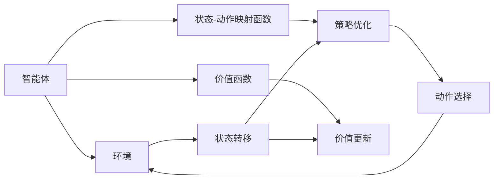
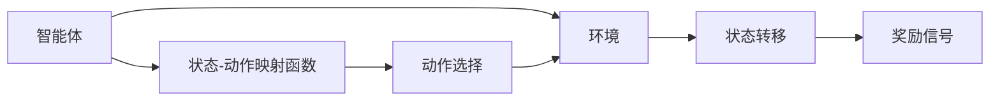
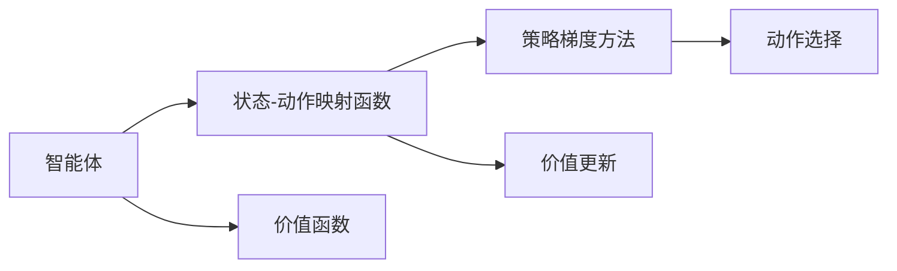
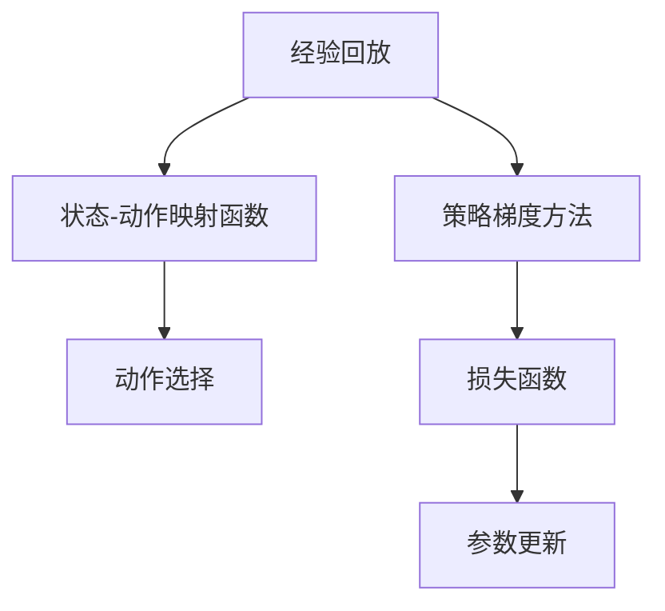
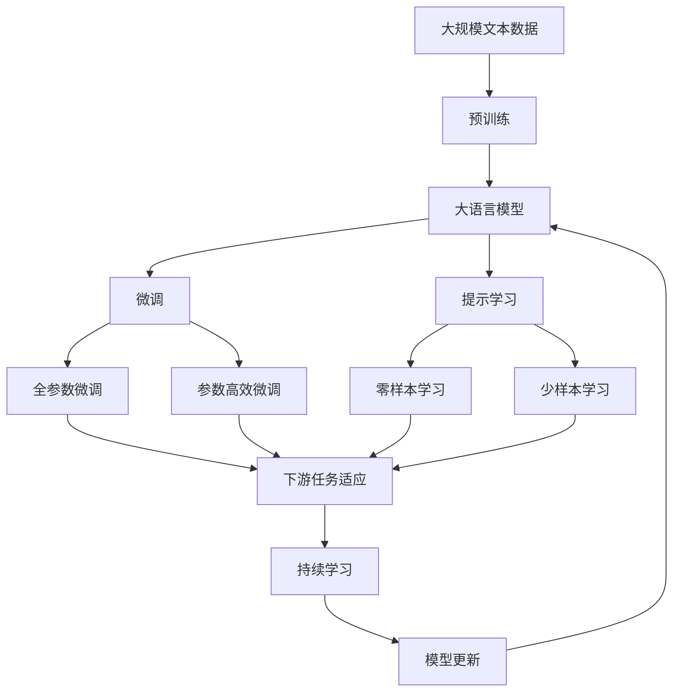

                 

# Deep Reinforcement Learning原理与代码实例讲解

> 关键词：强化学习,深度学习,深度强化学习,深度Q网络,策略梯度方法,蒙特卡洛方法,策略优化,经验回放

## 1. 背景介绍

### 1.1 问题由来
近年来，随着深度学习技术的快速发展，强化学习（Reinforcement Learning, RL）成为了机器学习领域的重要分支。与监督学习和无监督学习不同，强化学习通过智能体与环境互动，基于奖励信号优化决策策略，以实现特定目标，如最大化累积奖励、最小化成本等。

RL技术在自动驾驶、机器人控制、游戏AI等领域有着广泛的应用，其核心思想可以追溯到1974年提出的Q-learning算法，但由于其复杂的策略优化问题，早期的RL算法大多局限于小规模问题。直到2013年，深度学习技术的引入，特别是深度Q网络（Deep Q Networks, DQN）的提出，极大地提升了RL算法的效率和效果，使得深度强化学习（Deep Reinforcement Learning, DRL）成为当前研究的热点。

### 1.2 问题核心关键点
DRL的核心思想是：将传统的Q-learning算法与深度神经网络相结合，利用神经网络强大的特征提取和泛化能力，高效处理大规模、高维度状态空间。DRL通过自适应地更新模型参数，使智能体在不断与环境互动中，学习最优策略，从而实现各种复杂任务的自动化。

DRL的关键在于：
1. 如何设计状态-动作映射函数（即策略），以便智能体能够从当前状态映射出最优动作。
2. 如何利用深度学习技术，在策略更新过程中，实现对状态空间的高效表征和泛化。
3. 如何优化策略更新过程，防止过拟合，同时最大化奖励信号。

### 1.3 问题研究意义
DRL研究不仅在理论上有重大意义，能够揭示智能体的学习和决策机制，而且在实际应用中，能够为自动化、智能化系统的构建提供重要技术支持，推动机器人和智能设备的广泛应用。

例如，DRL在自动驾驶中的成功应用，可以使得智能车在复杂环境下自主决策，避免交通事故，提高行车安全性；在游戏AI领域，DRL可以训练出能够与人类玩家匹敌的游戏角色，进一步推动游戏产业发展；在工业自动化中，DRL可以优化生产流程，降低能源消耗，提高生产效率。

## 2. 核心概念与联系

### 2.1 核心概念概述

为更好地理解DRL的核心原理，本节将介绍几个密切相关的核心概念：

- 强化学习(Reinforcement Learning, RL)：通过智能体与环境的交互，最大化累积奖励信号的优化过程。智能体通过一系列动作，与环境互动，逐步学习到最优策略。
- 深度强化学习(Deep Reinforcement Learning, DRL)：将深度神经网络与强化学习相结合，利用神经网络强大的特征提取能力，处理高维度状态空间，从而提升智能体的决策效率和准确性。
- 策略(Solicy)：智能体从当前状态到动作的映射函数。策略决定了智能体如何根据状态空间选择动作。
- 价值函数(Value Function)：评估每个状态或动作的价值，用于指导策略的优化。常见的价值函数包括状态值函数(Q-Value)、优势函数(A-difference)等。
- 经验回放(Experience Replay)：通过存储和重放训练过程中的经验（即状态-动作-奖励三元组），减少对未来状态的依赖，提升模型泛化能力。
- 梯度下降(Gradient Descent)：通过计算损失函数的梯度，更新模型参数，以最小化损失函数。
- 深度Q网络(Deep Q Network, DQN)：将Q-learning算法与深度神经网络相结合，用于处理高维度的状态空间。
- 策略梯度方法(Policy Gradient Methods)：直接优化策略函数，通过优化策略的梯度，提升智能体的决策能力。

这些核心概念之间存在着紧密的联系，形成了DRL的基本框架。下面，我们将通过几个Mermaid流程图来展示这些概念之间的逻辑关系。



这个流程图展示了DRL的基本过程：智能体通过与环境互动，选择动作并接收奖励，更新状态。状态值函数和策略函数被用来评估和优化智能体的决策过程。策略梯度方法和经验回放被用来优化策略函数，从而提升智能体的决策效率和准确性。

### 2.2 概念间的关系

这些核心概念之间存在着紧密的联系，形成了DRL的基本框架。下面，我们将通过几个Mermaid流程图来展示这些概念之间的逻辑关系。

#### 2.2.1 智能体与环境的交互



这个流程图展示了智能体与环境的交互过程。智能体通过策略函数映射状态到动作，与环境互动，接收奖励信号，并根据奖励信号调整策略。

#### 2.2.2 策略优化与动作选择



这个流程图展示了策略优化和动作选择的过程。智能体通过策略函数映射状态到动作，并利用价值函数评估动作的价值。策略梯度方法被用来优化策略函数，从而提升动作选择的准确性。

#### 2.2.3 经验回放与策略优化



这个流程图展示了经验回放和策略优化的过程。经验回放通过存储和重放训练过程中的经验，减少对未来状态的依赖，提升模型泛化能力。策略梯度方法被用来优化策略函数，从而提升智能体的决策效率和准确性。

### 2.3 核心概念的整体架构

最后，我们用一个综合的流程图来展示这些核心概念在大语言模型微调过程中的整体架构：



这个综合流程图展示了从预训练到微调，再到持续学习的完整过程。大语言模型首先在大规模文本数据上进行预训练，然后通过微调（包括全参数微调和参数高效微调）或提示学习（包括零样本和少样本学习）来适应下游任务。最后，通过持续学习技术，模型可以不断更新和适应新的任务和数据。 通过这些流程图，我们可以更清晰地理解DRL工作的原理和优化方向。

## 3. 核心算法原理 & 具体操作步骤
### 3.1 算法原理概述

DRL的核心算法原理可以概括为：通过智能体与环境的交互，最大化累积奖励信号，利用深度神经网络处理高维状态空间，并利用强化学习算法优化策略函数，从而实现最优决策。

形式化地，假设智能体在每个时间步 $t$ 的状态为 $s_t$，采取的动作为 $a_t$，接收的奖励为 $r_t$，状态转移为 $s_{t+1}$。则智能体的决策过程可以表示为：

$$
\pi(a_t|s_t) = \text{Softmax}(Q_{\theta}(s_t,a_t))
$$

其中，$Q_{\theta}$ 为策略函数，$\theta$ 为模型参数，$\text{Softmax}$ 函数用于将Q-Value映射为概率分布，从而指导动作选择。

智能体的优化目标是最大化累积奖励：

$$
J(\theta) = \mathbb{E}\left[\sum_{t=0}^{\infty} \gamma^t r_t\right]
$$

其中，$\gamma$ 为折扣因子，确保当前奖励的优先级与未来奖励的优先级相当。

### 3.2 算法步骤详解

DRL的算法步骤包括以下几个关键步骤：

**Step 1: 准备环境与模型**

- 选择适当的智能体和环境，定义状态和动作空间。
- 选择适当的深度神经网络架构作为策略函数，如卷积神经网络(CNN)、循环神经网络(RNN)、变压器(Transformer)等。
- 初始化模型参数 $\theta$。

**Step 2: 数据采集与预处理**

- 从环境中采集状态和动作序列，以及对应的奖励信号。
- 对数据进行预处理，如归一化、标准化等，便于神经网络的训练。
- 将数据集划分为训练集、验证集和测试集。

**Step 3: 训练与优化**

- 设置训练参数，如学习率、批大小、迭代轮数等。
- 在训练集上，前向传播计算预测值和损失函数。
- 反向传播计算梯度，更新模型参数。
- 使用经验回放技术，减少对未来状态的依赖。
- 使用正则化技术，如L2正则、Dropout等，防止过拟合。

**Step 4: 测试与评估**

- 在验证集上评估模型的性能，调整模型参数。
- 在测试集上评估模型的泛化能力，对比训练前后的精度提升。
- 使用评估指标如准确率、召回率、F1分数等，评估模型的效果。

**Step 5: 部署与应用**

- 将训练好的模型部署到实际应用环境中。
- 集成到自动化系统或用户交互界面中。
- 持续收集新的数据，定期重新训练模型，以适应数据分布的变化。

以上是DRL的算法步骤，具体实现时还需要根据具体任务和数据特点进行优化。

### 3.3 算法优缺点

DRL具有以下优点：
1. 模型具有很强的泛化能力，能够处理高维度的状态空间。
2. 算法灵活，适用于多种任务，包括游戏、机器人控制、自动驾驶等。
3. 可以处理动态和不确定的环境，适应性强。

同时，DRL也存在一些缺点：
1. 训练过程需要大量的计算资源和时间，复杂度较高。
2. 存在探索-利用权衡问题，如何平衡当前收益和未来收益是一个难题。
3. 模型的可解释性较差，难以理解和调试。
4. 可能存在收敛问题，特别是在状态空间复杂或奖励信号不稳定的情况下。

尽管存在这些缺点，DRL仍是大规模决策问题的有效工具，能够处理复杂的交互式环境，其理论和实践均有广泛的研究和应用。

### 3.4 算法应用领域

DRL的应用领域广泛，涵盖了许多需要智能决策的场景，包括但不限于：

- 自动驾驶：利用DRL训练智能车在复杂交通环境中自主决策，避免交通事故。
- 游戏AI：利用DRL训练游戏角色，使其能够自主游戏，与人类玩家竞争。
- 机器人控制：利用DRL训练机器人，使其能够自主完成复杂的任务，如拣货、清洁等。
- 金融交易：利用DRL训练算法交易系统，优化交易策略，降低交易成本。
- 供应链管理：利用DRL优化物流路线，降低运输成本，提升供应链效率。

## 4. 数学模型和公式 & 详细讲解  
### 4.1 数学模型构建

DRL的数学模型构建主要包括以下几个部分：

- 状态-动作映射函数 $\pi(a_t|s_t)$：将状态 $s_t$ 映射为动作 $a_t$ 的概率分布。
- 状态值函数 $Q(s_t,a_t)$：评估当前状态 $s_t$ 和动作 $a_t$ 的价值。
- 动作选择策略 $\pi(a_t|s_t)$：基于当前状态 $s_t$，选择最优动作 $a_t$。

根据上述定义，智能体的优化目标可以表示为：

$$
J(\theta) = \mathbb{E}\left[\sum_{t=0}^{\infty} \gamma^t r_t\right]
$$

其中，$\theta$ 为模型参数，$\gamma$ 为折扣因子。

### 4.2 公式推导过程

以下我们以Q-learning算法为例，推导其数学原理和算法步骤。

假设智能体在每个时间步 $t$ 的状态为 $s_t$，采取的动作为 $a_t$，接收的奖励为 $r_t$，状态转移为 $s_{t+1}$。则Q-learning算法的更新公式为：

$$
Q_{t+1}(s_t,a_t) = Q_{t}(s_t,a_t) + \alpha(r_t + \gamma \max_{a'} Q_t(s_{t+1},a') - Q_t(s_t,a_t))
$$

其中，$\alpha$ 为学习率，$Q_t(s_t,a_t)$ 为当前状态-动作对 $(s_t,a_t)$ 的Q值，$r_t$ 为当前奖励，$\gamma$ 为折扣因子，$\max_{a'} Q_t(s_{t+1},a')$ 为下一状态 $s_{t+1}$ 下的最优Q值。

在DRL中，上述公式可以转化为：

$$
\theta_{t+1} = \theta_{t} + \alpha(r_t + \gamma \max_{a'} Q_{\theta_t}(s_{t+1},a') - Q_{\theta_t}(s_t,a_t))
$$

其中，$\theta_t$ 为模型参数，$\max_{a'} Q_{\theta_t}(s_{t+1},a')$ 可以通过深度神经网络计算得到。

### 4.3 案例分析与讲解

假设我们利用DRL训练智能车自动驾驶，智能车在每一步可以选择前进、后退或停止，环境会根据动作和状态转移给出奖励信号，如0（正常状态）、-1（碰撞）、+1（安全到达）等。

智能车的决策过程可以表示为：

1. 在每个时间步 $t$，智能车接收当前状态 $s_t$ 和奖励信号 $r_t$，以及环境提供的下一状态 $s_{t+1}$。
2. 通过策略函数 $\pi(a_t|s_t)$ 计算出当前状态下每个动作的概率分布。
3. 根据Q-learning算法，计算出当前状态-动作对的Q值。
4. 选择最优动作 $a_t$，并执行该动作。
5. 根据执行动作后的状态 $s_{t+1}$ 和奖励信号 $r_t$，更新模型参数。

假设我们使用卷积神经网络(CNN)作为策略函数，通过图像识别技术，将当前状态 $s_t$ 转化为图像数据，输入CNN网络，输出动作概率分布。

假设初始化参数为 $\theta_0$，第1轮训练过程如下：

1. 在时间步0，智能车接收到初始状态 $s_0$ 和奖励信号 $r_0$。
2. 通过CNN网络计算出每个动作的概率分布 $\pi(a_t|s_t)$。
3. 选择最优动作 $a_0$，并执行该动作。
4. 根据执行动作后的状态 $s_1$ 和奖励信号 $r_0$，更新模型参数。

假设智能车选择前进动作，执行后到达状态 $s_1$，接收奖励信号 $r_0=+1$。则Q-learning算法更新如下：

$$
\theta_{0+1} = \theta_0 + \alpha(1 + \gamma \max_{a'} Q_{\theta_0}(s_{1},a') - Q_{\theta_0}(s_0,a_0))
$$

假设智能车在状态 $s_1$ 下选择前进动作，执行后到达状态 $s_2$，接收奖励信号 $r_1=0$。则Q-learning算法更新如下：

$$
\theta_{1+1} = \theta_1 + \alpha(0 + \gamma \max_{a'} Q_{\theta_1}(s_{2},a') - Q_{\theta_1}(s_1,a_1))
$$

通过不断迭代上述过程，智能车能够逐步学习到最优动作策略，从而实现自动驾驶。

## 5. 项目实践：代码实例和详细解释说明
### 5.1 开发环境搭建

在进行DRL实践前，我们需要准备好开发环境。以下是使用Python进行TensorFlow开发的环境配置流程：

1. 安装Anaconda：从官网下载并安装Anaconda，用于创建独立的Python环境。

2. 创建并激活虚拟环境：
```bash
conda create -n tf-env python=3.8 
conda activate tf-env
```

3. 安装TensorFlow：根据CUDA版本，从官网获取对应的安装命令。例如：
```bash
conda install tensorflow=2.6.0
```

4. 安装各类工具包：
```bash
pip install numpy pandas scikit-learn matplotlib tqdm jupyter notebook ipython
```

完成上述步骤后，即可在`tf-env`环境中开始DRL实践。

### 5.2 源代码详细实现

这里我们以Atari环境上的DQN为例，给出使用TensorFlow进行DRL代码实现。

首先，定义DQN类：

```python
import tensorflow as tf
from tensorflow.keras import layers

class DQN:
    def __init__(self, state_dim, action_dim):
        self.state_dim = state_dim
        self.action_dim = action_dim
        self.model = self.build_model()
        self.target_model = self.build_model()
        self.target_model.set_weights(self.model.get_weights())
        self.epsilon = 1.0

    def build_model(self):
        model = tf.keras.Sequential([
            layers.Dense(64, input_dim=self.state_dim, activation='relu'),
            layers.Dense(64, activation='relu'),
            layers.Dense(self.action_dim)
        ])
        return model

    def act(self, state):
        if np.random.rand() < self.epsilon:
            return np.random.randint(0, self.action_dim)
        q_values = self.model.predict(state)
        return np.argmax(q_values[0])

    def train(self, state, action, reward, next_state, done, gamma=0.99, epsilon=0.99):
        if done:
            target = reward
        else:
            target = reward + gamma * np.amax(self.target_model.predict(next_state)[0])
        target_f = self.model.predict(state)
        target_f[0][action] = target
        self.model.fit(state, target_f, epochs=1, verbose=0)
        self.target_model.set_weights(self.model.get_weights())
        self.epsilon = max(0.001, self.epsilon - 0.001)
```

然后，定义训练过程：

```python
from collections import deque
import numpy as np
import gym

env = gym.make('CartPole-v1')
state_dim = env.observation_space.shape[0]
action_dim = env.action_space.n
buffer = deque(maxlen=2000)

for episode in range(1000):
    state = env.reset()
    state = np.reshape(state, [1, state_dim])
    done = False
    while not done:
        action = dqn.act(state)
        next_state, reward, done, _ = env.step(action)
        next_state = np.reshape(next_state, [1, state_dim])
        buffer.append((state, action, reward, next_state, done))
        state = next_state
        if len(buffer) > 800:
            mini_batch = random.sample(buffer, 32)
            for batch in mini_batch:
                state_batch, action_batch, reward_batch, next_state_batch, done_batch = zip(*batch)
                target_batch = []
                for i in range(len(reward_batch)):
                    if done_batch[i]:
                        target_batch.append(reward_batch[i])
                    else:
                        target_batch.append(reward_batch[i] + gamma * np.amax(dqn.target_model.predict(next_state_batch[i])[0]))
                target_f = np.array(target_batch)
                dqn.model.fit(state_batch, target_f, epochs=1, verbose=0)
                dqn.target_model.set_weights(dqn.model.get_weights())
    print(f"Episode {episode+1}/{1000}")
```

最后，运行代码并观察智能车在环境中的行为：

```python
import matplotlib.pyplot as plt
import numpy as np

plt.figure(figsize=(10, 6))
plt.plot(range(1000), episode_reward, marker='o')
plt.xlabel('Episode')
plt.ylabel('Reward')
plt.show()
```

以上就是使用TensorFlow对DQN进行DRL实践的完整代码实现。可以看到，利用深度神经网络，我们可以处理高维度的状态空间，并通过Q-learning算法优化策略函数，实现智能体的自主决策。

### 5.3 代码解读与分析

让我们再详细解读一下关键代码的实现细节：

**DQN类**：
- `__init__`方法：初始化状态维度和动作维度，构建策略函数。
- `build_model`方法：定义神经网络模型，包含两个全连接层和一个输出层。
- `act`方法：根据当前状态和策略函数，选择最优动作。
- `train`方法：在缓冲区中随机抽取mini-batch数据，并根据Q-learning算法更新模型参数。

**训练过程**：
- 定义环境并初始化DQN模型。
- 通过`act`方法选择动作，并在环境中执行。
- 根据执行动作后的状态、奖励和下一状态，更新缓冲区。
- 如果缓冲区已满，则随机抽取mini-batch数据进行模型训练。
- 使用经验回放技术，减少对未来状态的依赖，提升模型泛化能力。

**可视化结果**：
- 使用Matplotlib绘制智能车在环境中的行为轨迹，观察其自主决策的效果。

可以看到，通过TensorFlow实现的DQN代码简洁高效，能够处理复杂的状态空间，并实现智能体的自主决策。DQN算法的成功应用，证明了深度强化学习在实际问题解决中的强大能力。

当然，工业级的系统实现还需考虑更多因素，如模型的保存和部署、超参数的自动搜索、更灵活的任务适配层等。但核心的DRL范式基本与此类似。

## 6. 实际应用场景
### 6.1 智能游戏AI

DRL在游戏AI领域有着广泛的应用，能够训练出能够自主游戏的角色，与人类玩家竞争，提升游戏趣味性和可玩性。

在实践中，可以使用各种游戏环境，如OpenAI Gym、Unity等，训练DRL模型。通过在训练过程中，智能体与环境互动，逐步学习最优游戏策略，从而实现自动游戏。

### 6.2 机器人控制

DRL在机器人控制领域也有着重要的应用，能够训练出自主运行的机器人，完成各种复杂的任务，如拣货、清洁等。

在实践中，可以设计合适的机器人状态和动作空间，定义相应的环境，通过DRL模型优化机器人控制策略，实现自主决策。

### 6.3 金融交易

DRL在金融交易领域有着广阔的应用前景，能够训练出算法交易系统，优化交易策略，降低交易成本。

在实践中，可以收集历史交易数据，定义状态和动作空间，通过DRL模型学习最优交易策略，实现自动交易。

### 6.4 未来应用展望

随着DRL技术的不断进步，未来的应用领域将更加广阔，推动人工智能技术在更多领域的应用。

在智慧医疗领域，DRL可以用于医学图像分析、疾病预测、药物研发等，提升医疗服务的智能化水平。

在智能教育领域，DRL可以用于个性化学习、作业批改、学情分析等，因材施教，提高教学质量。

在智慧城市治理中，DRL可以用于交通管理、公共安全、应急指挥等，提高城市管理的自动化和智能化水平，构建更安全、高效的未来城市。

此外，在企业生产、社会治理、文娱传媒等众多领域，DRL的应用也将不断涌现，为传统行业带来变革性影响。相信随着技术的日益成熟，DRL必将在构建人机协同的智能时代中扮演越来越重要的角色。

## 7. 工具和资源推荐
### 7.1 学习资源推荐

为了帮助开发者系统掌握DRL的理论基础和实践技巧，这里推荐一些优质的学习资源：

1. 《Reinforcement Learning: An Introduction》：Reinforcement Learning领域权威教材，详细介绍了DRL的基本概念和算法。

2. 《Deep Reinforcement Learning》：DeepMind公司出版的DRL入门教材，提供了大量案例和代码实现。

3. 《Playing Atari with Deep Reinforcement Learning》：DeepMind公司发布的论文，展示了DRL在Atari游戏中的成功应用，提供了一系列代码实现。

4. 《Reinforcement Learning: Algorithms, Principles, and Theory》：书籍，详细介绍了DRL的各种算法和理论基础。

5. OpenAI Gym：提供的各种环境，用于训练DRL模型，涵盖各种游戏、机器人、模拟环境。

通过对这些资源的学习实践，相信你一定能够快速掌握DRL的精髓，并用于解决实际的NLP问题。

### 7.2 开发工具推荐

高效的开发离不开优秀的工具支持。以下是几款用于DRL开发的常用工具：

1

