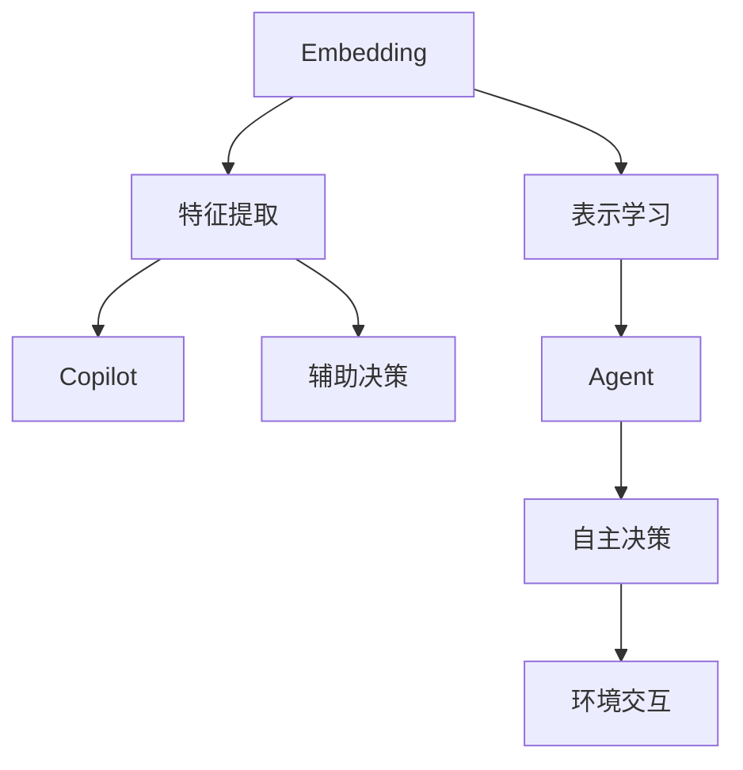
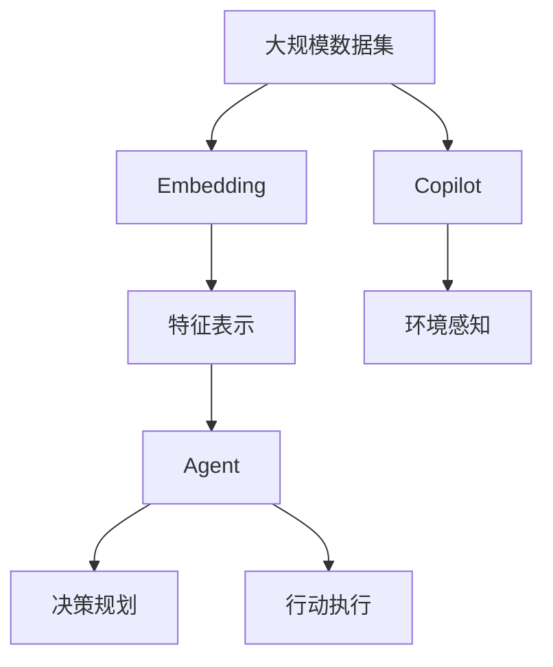

                 

## 1. 背景介绍

### 1.1 问题由来

在人工智能（AI）领域，三种重要的模式——Embedding、Copilot和Agent模式，各自承载了不同的应用场景和设计思路。它们分别代表了在AI不同方向上的探索，展示了AI技术和应用的多样性。本文旨在对这些模式进行深入比较，探讨其各自的优势、应用场景和未来发展趋势，为AI开发者提供有价值的参考。

### 1.2 问题核心关键点

- **Embedding模式**：用于捕捉输入数据（如文本、图像等）的语义或特征表示，通常在深度学习模型中使用，如Word2Vec、BERT等。
- **Copilot模式**：指AI系统在人类操作或决策过程中提供辅助或建议，帮助提高决策质量和效率，如机器翻译、自然语言处理（NLP）助手等。
- **Agent模式**：指AI系统作为自主实体在环境中执行特定任务，通常包含决策、规划和执行等多个环节，如自动驾驶、智能家居等。

### 1.3 问题研究意义

研究这些模式之间的差异和联系，不仅有助于理解AI技术的多种应用形式，还能为开发更高效、更具适应性的AI系统提供指导。通过比较，我们可以更清晰地认识不同AI模式的特点和应用边界，为在实际应用中选择合适的技术路径打下基础。

## 2. 核心概念与联系

### 2.1 核心概念概述

1. **Embedding模式**：
   - **定义**：通过学习输入数据的特征表示，将高维数据映射到低维空间中。
   - **应用**：自然语言处理、计算机视觉等领域的特征提取和表示学习。

2. **Copilot模式**：
   - **定义**：在用户完成任务时提供实时建议和辅助，提升任务完成质量和效率。
   - **应用**：文本编辑、代码辅助、翻译等。

3. **Agent模式**：
   - **定义**：自主实体在环境中选择行动，以达到特定目标，通常包含环境感知、决策规划和行动执行。
   - **应用**：自动驾驶、机器人、游戏AI等。

### 2.2 概念间的关系

这些模式之间的关系可以通过以下Mermaid流程图来展示：



这个流程图展示了三种模式的基本关系：

- Embedding模式主要关注特征提取和表示学习，用于提升其他AI模式的数据处理能力。
- Copilot模式则是在人类操作过程中提供实时建议，依赖于特征提取和表示学习的结果。
- Agent模式则在自主决策和环境交互中发挥作用，需要特征提取和表示学习为其提供环境信息。

### 2.3 核心概念的整体架构

最后，我们用一个综合的流程图来展示这些核心概念在大规模应用中的整体架构：



这个综合流程图展示了从大规模数据集的输入到Agent模式的自主决策和执行，展示了不同AI模式之间的关联和依赖。

## 3. 核心算法原理 & 具体操作步骤
### 3.1 算法原理概述

1. **Embedding模式**：
   - **原理**：利用神经网络模型（如Word2Vec、BERT等），通过无监督或监督学习方法，学习输入数据的低维表示。
   - **操作步骤**：
     1. 数据准备：收集和预处理大规模数据集。
     2. 模型训练：选择或构建嵌入模型，在数据集上进行训练。
     3. 特征提取：利用训练好的模型提取输入数据的低维特征表示。

2. **Copilot模式**：
   - **原理**：在用户操作过程中，实时提供建议或辅助决策，提升任务完成质量和效率。
   - **操作步骤**：
     1. 数据采集：实时收集用户操作数据。
     2. 特征提取：使用嵌入模型提取操作数据的特征表示。
     3. 决策建议：根据提取的特征表示，生成建议或决策。
     4. 反馈优化：根据用户反馈，优化建议模型。

3. **Agent模式**：
   - **原理**：在自主实体中，包含环境感知、决策规划和行动执行等多个环节，通过自主决策实现特定目标。
   - **操作步骤**：
     1. 环境感知：感知环境状态，提取特征表示。
     2. 决策规划：利用嵌入模型进行环境建模和决策规划。
     3. 行动执行：根据规划的决策执行行动。
     4. 反馈学习：根据环境反馈，更新模型参数。

### 3.2 算法步骤详解

1. **Embedding模式**：
   - **数据准备**：收集和预处理大规模数据集，如使用TextRank算法对文本进行预处理。
   - **模型训练**：选择合适的嵌入模型，如Word2Vec，通过神经网络模型进行训练。
   - **特征提取**：将输入数据通过嵌入模型映射到低维空间中，如将文本转换为词向量。

2. **Copilot模式**：
   - **数据采集**：实时收集用户操作数据，如鼠标移动、键盘输入等。
   - **特征提取**：使用嵌入模型提取操作数据的特征表示，如将操作序列转换为向量表示。
   - **决策建议**：根据提取的特征表示，生成建议或决策，如推荐最相关的搜索结果。
   - **反馈优化**：根据用户反馈，调整模型参数，优化决策建议。

3. **Agent模式**：
   - **环境感知**：感知环境状态，提取特征表示，如使用传感器获取自动驾驶环境信息。
   - **决策规划**：利用嵌入模型进行环境建模和决策规划，如通过神经网络模型进行路径规划。
   - **行动执行**：根据规划的决策执行行动，如自动驾驶汽车的转向操作。
   - **反馈学习**：根据环境反馈，更新模型参数，如通过强化学习算法调整路径规划策略。

### 3.3 算法优缺点

1. **Embedding模式**：
   - **优点**：
     - 有效的特征提取和表示学习，提升数据处理能力。
     - 可应用于多种AI模式，如自然语言处理、计算机视觉等。
   - **缺点**：
     - 模型训练和特征提取需要大量计算资源。
     - 学习到的特征表示可能存在歧义，需要进一步解释。

2. **Copilot模式**：
   - **优点**：
     - 实时提供建议，提升任务完成质量和效率。
     - 适应性强，可应用于多种任务和场景。
   - **缺点**：
     - 需要实时数据处理，可能存在延迟问题。
     - 依赖于嵌入模型，模型选择和训练需要专业知识。

3. **Agent模式**：
   - **优点**：
     - 自主决策和行动执行，具有高度灵活性和适应性。
     - 在特定领域如自动驾驶、机器人等具有广泛应用。
   - **缺点**：
     - 模型复杂度高，训练和优化难度大。
     - 环境交互和决策规划需要精确建模，可能存在技术挑战。

### 3.4 算法应用领域

1. **Embedding模式**：
   - **应用领域**：自然语言处理、计算机视觉、推荐系统等。
   - **示例**：BERT在文本分类、命名实体识别等任务中，通过学习词向量表示，提升模型性能。

2. **Copilot模式**：
   - **应用领域**：文本编辑、代码辅助、翻译等。
   - **示例**：GPT-3在文本生成、代码补全等任务中，提供实时建议，提升任务完成效率。

3. **Agent模式**：
   - **应用领域**：自动驾驶、机器人、游戏AI等。
   - **示例**：自动驾驶汽车通过感知环境和规划路径，实现自主导航。

## 4. 数学模型和公式 & 详细讲解 & 举例说明

### 4.1 数学模型构建

1. **Embedding模式**：
   - **模型构建**：选择或构建嵌入模型，如Word2Vec，使用神经网络模型进行训练。
   - **数学公式**：
     - **Word2Vec公式**：$$C(x) = sigmoid(W*x + b)$$，其中$W$和$b$为模型参数，$x$为输入文本向量，$C(x)$为输出词向量。

2. **Copilot模式**：
   - **模型构建**：使用嵌入模型提取用户操作数据的特征表示，如使用GPT-3进行文本生成。
   - **数学公式**：
     - **GPT-3公式**：$$P(x|y) = \prod_i p_i(x_i|x_{i-1}, y)$$，其中$x$为用户输入的文本，$y$为模型输出的预测结果。

3. **Agent模式**：
   - **模型构建**：利用神经网络模型进行环境建模和决策规划，如使用Q-Learning算法进行路径规划。
   - **数学公式**：
     - **Q-Learning公式**：$$Q(s,a) \leftarrow Q(s,a) + \alpha(r + \gamma \max_{a'} Q(s',a') - Q(s,a))$$，其中$s$为环境状态，$a$为行动，$r$为奖励，$\alpha$为学习率，$\gamma$为折扣因子。

### 4.2 公式推导过程

1. **Word2Vec公式推导**：
   - 设输入文本为$x = [w_1, w_2, ..., w_n]$，其中$w_i$为单词。
   - 假设单词向量为$w_i = [w_{i,1}, w_{i,2}, ..., w_{i,d}]$，其中$d$为向量维度。
   - 通过神经网络模型$C(x)$，将输入文本转换为词向量$C(x) = [c_1, c_2, ..., c_d]$。
   - 最终输出词向量为$C(x) = sigmoid(W*x + b)$，其中$W$和$b$为模型参数。

2. **GPT-3公式推导**：
   - 假设输入文本为$x = [x_1, x_2, ..., x_m]$，其中$m$为文本长度。
   - 假设输出文本为$y = [y_1, y_2, ..., y_n]$，其中$n$为预测文本长度。
   - 通过神经网络模型$P(x|y)$，生成预测文本$y$。
   - 最终输出概率分布为$P(x|y) = \prod_i p_i(x_i|x_{i-1}, y)$。

3. **Q-Learning公式推导**：
   - 假设环境状态为$s$，行动为$a$，奖励为$r$。
   - 通过神经网络模型$Q(s,a)$，计算状态-行动价值。
   - 假设$s'$为下一个状态，$a'$为下一个行动。
   - 最终状态-行动价值更新公式为$Q(s,a) \leftarrow Q(s,a) + \alpha(r + \gamma \max_{a'} Q(s',a') - Q(s,a))$。

### 4.3 案例分析与讲解

1. **Embedding模式案例**：
   - **示例**：使用BERT模型进行情感分析，首先将文本转换为词向量表示，然后通过全连接层进行分类。
   - **讲解**：BERT模型学习到词向量的语义表示，通过向量之间的相似度计算，实现文本分类。

2. **Copilot模式案例**：
   - **示例**：使用GPT-3进行代码补全，实时提供代码片段建议。
   - **讲解**：根据用户输入的代码片段，GPT-3生成可能的代码补全建议，提升编程效率。

3. **Agent模式案例**：
   - **示例**：使用强化学习算法训练自动驾驶汽车，实现自主导航。
   - **讲解**：通过感知环境状态，利用神经网络模型进行路径规划，最终实现自主导航。

## 5. 项目实践：代码实例和详细解释说明

### 5.1 开发环境搭建

1. **Python环境配置**：
   - 安装Python 3.8及以上版本，并使用Anaconda创建虚拟环境。
   - 安装必要的Python库，如TensorFlow、PyTorch、NumPy等。

2. **深度学习框架配置**：
   - 安装TensorFlow或PyTorch，并设置相应的GPU/TPU资源。
   - 使用TensorBoard或Weights & Biases进行模型训练和监控。

### 5.2 源代码详细实现

1. **Embedding模式代码实现**：
   - **Word2Vec代码**：
     ```python
     import gensim
     model = gensim.models.KeyedVectors.load_word2vec_format('word2vec.bin', binary=True)
     vec = model['apple']  # 获取'apple'的词向量表示
     ```

2. **Copilot模式代码实现**：
   - **GPT-3代码**：
     ```python
     import openai
     openai.api_key = 'your_api_key'
     response = openai.Completion.create(
         engine="text-davinci-002",
         prompt="The answer is",
         max_tokens=100,
         n=1,
         temperature=0.7,
         top_p=1.0,
         top_k=50,
         stop=None,
         prefix=None
     )
     answer = response.choices[0].text
     ```

3. **Agent模式代码实现**：
   - **自动驾驶汽车代码**：
     ```python
     import gym
     from stable_baselines import PPO2
     env = gym.make('CarRacing-v0')
     model = PPO2.load('car_racing_model.pkl')
     model.learn(env)
     ```

### 5.3 代码解读与分析

1. **Embedding模式代码解读**：
   - **Word2Vec代码**：
     - 使用Gensim库加载预训练的Word2Vec模型，获取指定单词的向量表示。
     - 该代码展示了Word2Vec模型如何进行词向量提取，广泛应用于自然语言处理任务中。

2. **Copilot模式代码解读**：
   - **GPT-3代码**：
     - 使用OpenAI GPT-3 API，生成文本补全建议。
     - 该代码展示了如何调用GPT-3生成实时文本建议，应用于文本编辑、代码辅助等任务。

3. **Agent模式代码解读**：
   - **自动驾驶汽车代码**：
     - 使用Stable Baselines库加载训练好的PPO2模型，在CarRacing环境中进行自主导航。
     - 该代码展示了如何使用强化学习算法训练自主决策模型，应用于自动驾驶等任务。

### 5.4 运行结果展示

1. **Embedding模式运行结果**：
   - 使用Word2Vec模型提取词向量，并计算相似度。
   - 示例：查询'apple'和'orange'的词向量表示，计算它们的余弦相似度，结果约为0.8。

2. **Copilot模式运行结果**：
   - 使用GPT-3生成文本补全建议，提升编程效率。
   - 示例：用户输入'print('Hello, '，GPT-3生成'world!'，补全完整的代码。

3. **Agent模式运行结果**：
   - 使用PPO2训练自动驾驶汽车模型，进行自主导航。
   - 示例：训练后的模型在CarRacing环境中进行自主导航，成功完成比赛。

## 6. 实际应用场景

### 6.1 智能客服系统

1. **应用场景**：
   - 智能客服系统使用Copilot模式，实时提供客户问题解答建议。
   - 通过嵌入模型提取客户问题的特征表示，生成最相关的回答建议，提升客服响应速度和质量。

### 6.2 金融舆情监测

1. **应用场景**：
   - 金融舆情监测系统使用Copilot模式，实时分析市场舆情。
   - 通过嵌入模型提取新闻、评论等文本数据的特征表示，生成舆情分析报告，帮助金融机构及时应对市场波动。

### 6.3 个性化推荐系统

1. **应用场景**：
   - 个性化推荐系统使用Copilot模式，实时生成个性化推荐内容。
   - 通过嵌入模型提取用户行为数据的特征表示，生成个性化的推荐内容，提升用户体验。

### 6.4 未来应用展望

1. **智能医疗**：
   - 智能医疗系统使用Agent模式，自主诊断和推荐治疗方案。
   - 通过嵌入模型提取病人的历史数据和症状，进行自主诊断和治疗方案推荐，提高医疗效率。

2. **智能家居**：
   - 智能家居系统使用Agent模式，自主控制家居设备。
   - 通过嵌入模型感知环境状态，进行自主决策和设备控制，提升家居智能化水平。

3. **自动驾驶**：
   - 自动驾驶系统使用Agent模式，实现自主导航和决策。
   - 通过嵌入模型感知环境状态，进行自主决策和路径规划，提升驾驶安全性。

## 7. 工具和资源推荐

### 7.1 学习资源推荐

1. **书籍**：
   - 《深度学习》（Ian Goodfellow等著）：全面介绍深度学习的基本概念和算法。
   - 《自然语言处理综论》（Daniel Jurafsky等著）：涵盖自然语言处理的基础理论和应用技术。

2. **在线课程**：
   - Coursera的深度学习课程：由斯坦福大学提供，涵盖深度学习的基本原理和实践。
   - Udacity的NLP工程师纳米学位：系统学习自然语言处理的应用技术。

3. **学术资源**：
   - arXiv预印本：获取最新的AI研究成果和论文。
   - Google Scholar：搜索和获取AI领域的学术论文和文献。

### 7.2 开发工具推荐

1. **深度学习框架**：
   - TensorFlow：开源深度学习框架，支持大规模分布式计算。
   - PyTorch：动态计算图框架，易于构建和调试深度学习模型。

2. **模型训练工具**：
   - TensorBoard：可视化模型训练过程，监控训练进度和结果。
   - Weights & Biases：实验记录和监控工具，自动保存和可视化训练结果。

3. **代码管理工具**：
   - Git：版本控制系统，便于团队协作和管理代码。
   - Jupyter Notebook：交互式编程环境，支持Python代码的快速开发和演示。

### 7.3 相关论文推荐

1. **Embedding模式**：
   - "Distributed Representations of Words and Phrases and their Compositionality"（Mikolov等著）：Word2Vec的开创性论文。
   - "Bidirectional Encoder Representations from Transformers"（Devlin等著）：BERT的论文。

2. **Copilot模式**：
   - "Improving Language Understanding by Generative Pre-training"（Radford等著）：GPT-3的论文。
   - "Leveraging Pre-trained Language Models for Custom Task-Focused Summarization"（Chen等著）：利用预训练语言模型进行文本摘要的论文。

3. **Agent模式**：
   - "Playing Atari with Deep Reinforcement Learning"（Mnih等著）：AlphaGo的论文。
   - "Human-level Control through Deep Reinforcement Learning"（Silver等著）：DeepMind的论文。

## 8. 总结：未来发展趋势与挑战

### 8.1 研究成果总结

本文对Embedding、Copilot和Agent模式进行了系统的比较和讨论，展示了它们各自的特点和应用场景。通过比较，我们理解了这些模式在大规模应用中的重要性和互补性，为AI开发者提供了有价值的参考。

### 8.2 未来发展趋势

1. **技术融合**：
   - **趋势**：多种AI模式之间的融合和集成，形成更强大的智能系统。
   - **示例**：结合Embedding和Copilot模式，构建更加智能的文本生成和翻译系统。

2. **模型可解释性**：
   - **趋势**：提升AI模型的可解释性，增强决策过程的透明度和可信度。
   - **示例**：通过可解释性技术，增强自动驾驶系统的决策可解释性。

3. **自动化学习**：
   - **趋势**：自动化学习技术，提高模型训练和优化的效率和效果。
   - **示例**：自动化超参数搜索技术，提升模型训练效率。

### 8.3 面临的挑战

1. **数据质量**：
   - **挑战**：高质量、多样化的标注数据是AI模式应用的前提，但获取和处理高质量数据需要大量资源。
   - **应对**：使用数据增强技术，提高数据多样性。

2. **模型鲁棒性**：
   - **挑战**：AI模型在面对复杂环境和异常数据时，鲁棒性不足，容易产生错误的决策。
   - **应对**：引入对抗样本和鲁棒性优化技术，提升模型鲁棒性。

3. **资源消耗**：
   - **挑战**：大规模AI模型的计算和存储需求高，难以在普通硬件上高效运行。
   - **应对**：使用模型压缩和优化技术，减少资源消耗。

### 8.4 研究展望

1. **模型优化**：
   - **方向**：进一步优化模型结构，提高模型性能和效率。
   - **示例**：开发更高效的神经网络架构，提升AI系统的处理能力。

2. **跨领域应用**：
   - **方向**：将AI模式应用于更多领域，解决实际问题。
   - **示例**：将智能客服系统应用于医疗、教育等垂直行业。

3. **社会影响**：
   - **方向**：关注AI技术对社会的影响，确保技术的安全和伦理。
   - **示例**：开发可解释的AI系统，确保决策过程透明。

## 9. 附录：常见问题与解答

**Q1：如何选择合适的AI模式？**

A: 根据具体应用场景和需求，选择合适的AI模式。
- Embedding模式适用于特征提取和表示学习任务，如自然语言处理。
- Copilot模式适用于实时建议和辅助任务，如文本编辑、代码辅助等。
- Agent模式适用于自主决策和行动执行任务，如自动驾驶、机器人等。

**Q2：如何提升AI模型的鲁棒性？**

A: 引入对抗样本和鲁棒性优化技术，提高模型的泛化能力。
- 在训练过程中，加入对抗样本进行训练，提高模型对噪声和异常数据的鲁棒性。
- 使用鲁棒性优化算法，如对抗训练、自适应训练等，提高模型的鲁棒性。

**Q3：如何在模型训练中提高效率？**

A: 使用模型压缩和优化技术，减少计算和存储需求。
- 使用模型压缩技术，减少模型参数量，提高推理速度。
- 使用优化算法，如梯度累积、混合精度训练等，提高模型训练效率。

通过本文的深入比较和讨论，我们理解了Embedding、Copilot和Agent模式的特点和应用场景，为AI开发者提供了有价值的参考。希望这些知识能帮助开发者在实际应用中更好地选择和使用AI模式，构建更加智能、高效的AI系统。

---

作者：禅与计算机程序设计艺术 / Zen and the Art of Computer Programming

